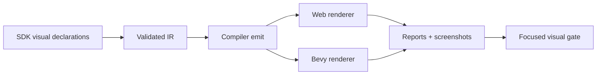
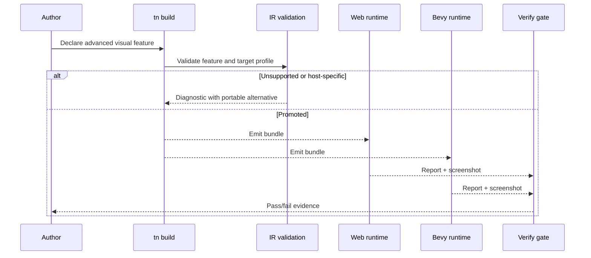

# PRD: Advanced Visual Effects, Lighting, and Material Depth

Complexity: 13 -> HIGH mode

Score basis: +3 touches 10+ files during future implementation, +2 adds
advanced renderer/material/light contract surfaces, +2 requires cross-runtime
visual calibration, +2 spans SDK/IR/compiler/web/Bevy/verify/docs, +2 includes
host capability negotiation and diagnostics, +2 requires screenshot and report
evidence.

## 1. Context

**Problem:** The remaining visual gaps are now advanced effects and material
depth features that need narrow promotion criteria instead of broad parity
claims.

**Files Analyzed:**

- `docs/bevy-feature-parity.md`
- `docs/STATUS.md`
- `docs/PRDs/README.md`
- `docs/PRDs/done/other/post-v10-rendering-materials-geometry-residuals.md`
- `/home/joao/.claude/skills/prd-creator/SKILL.md`

**Current Behavior:**

- Core lights, shadows, skyboxes, environment maps, material slots, alpha,
  bloom, anti-aliasing, color grading metadata, LOD, instancing policy, and
  advanced renderer diagnostics are already covered by focused gates.
- V10 visual calibration proves bounded color, material, lighting, atmosphere,
  post, geometry, dense-content, and combined-scene fixtures.
- Area lights, lightmaps, parallax/depth mapping, advanced PBR fields,
  atmosphere/volumetrics, auto exposure, DOF, motion blur, SSR, decals,
  deferred rendering, virtual geometry, and custom post-processing remain
  unchecked.

## Pre-Planning Findings

No `.env` or host secret configuration is required. Any future visual tests
must use bundle-local fixtures and deterministic artifact paths.

**How will this feature be reached?**

- [x] Entry point identified: SDK material/light/post-processing declarations,
  `tn build`, runtime previews, conformance fixtures, and a focused visual
  verification gate.
- [x] Caller file identified: SDK helpers, IR validators, compiler emit paths,
  web Three.js renderer adapters, Bevy renderer adapters, and verify tooling.
- [x] Registration/wiring needed: capability fields, visual fixtures,
  screenshot sampling, report schemas, unsupported-feature diagnostics, package
  scripts, parity docs, and release gate inclusion when stable.

**Is this user-facing?**

- [x] YES. Authors see accepted visual declarations in rendered scenes and
  unsupported declarations as stable diagnostics.
- [ ] NO.

**Full user flow:**

1. User authors an advanced light, material, atmosphere, or post-processing
   declaration.
2. `tn build` validates the declaration against target-profile capability
   metadata.
3. Web and Bevy previews render promoted features or emit unsupported-feature
   diagnostics.
4. Verification captures reports, screenshots, diffs, and contact sheets.

## 2. Solution

**Approach:**

- Promote only features with bounded authoring shape and measurable web/native
  output: decals, DOF, area-light approximation, lightmap metadata, selected
  advanced PBR fields, and simple post-processing passes are candidates.
- Keep deferred rendering, virtual geometry, volumetrics, SSR, and arbitrary
  custom post passes diagnostic-first unless a smaller PRD proves portable
  semantics.
- Require every checked row to include SDK/IR validation, compiler emit,
  web/Bevy runtime reports, visual fixtures, and docs updates.
- Reuse existing V10 visual calibration report and screenshot infrastructure.

**Key Decisions:**

- [x] Library/framework choices: reuse Three.js and Bevy renderer adapters plus
  existing visual calibration tooling.
- [x] Error-handling strategy: unsupported effects fail with stable diagnostic
  codes, target-profile metadata, and suggested portable alternatives.
- [x] Reused utilities: conformance fixtures, screenshot contact sheets,
  material reports, capability diagnostics, and docs drift checks.

**Data Changes:** Extend renderer, material, light, post-processing, and
capability report schemas. No database migrations.

## 3. Sequence Flow

## 4. Execution Phases

#### Phase 1: Bounded Lighting and Material Depth - Advanced surface detail has portable proof.

**Files (max 5):**

- `packages/sdk/src/*` - authoring helpers for promoted fields
- `packages/ir/src/*` - schema and validation updates
- `packages/compiler/src/*` - capability and bundle emit
- `packages/runtime-web-three/src/*` - web renderer mapping
- `runtime-bevy/src/*` - native renderer mapping

**Implementation:**

- [x] Lock area-light and spherical-light declarations behind stable IR
  diagnostics until approximation policy and report evidence exist.
- [x] Lock lightmap/mixed-lighting material declarations behind stable IR
  diagnostics until static asset metadata is promoted.
- [x] Lock parallax/depth and selected advanced PBR fields behind stable IR
  diagnostics until both runtimes can produce report-backed observations.
- [x] Keep unsupported material fields diagnostic-only.

**Tests Required:**

| Test File | Test Name | Assertion |
| --- | --- | --- |
| `packages/ir/src/advanced-visual.test.ts` | `should reject unsupported advanced PBR fields when target profile lacks support` | Diagnostic includes field path and suggested fallback. |
| `packages/ir/src/validate.test.ts` | `should reject unsupported advanced material depth and PBR fields` | Diagnostics include field paths and portable fallbacks. |
| `packages/ir/src/validate.test.ts` | `should reject unsupported advanced light kinds` | Diagnostic names the unsupported light kind. |
| `packages/runtime-web-three/src/advanced-visual.test.ts` | `should report promoted lightmap material usage` | Web report includes lightmap asset id. |
| `runtime-bevy/tests/advanced_visual.rs` | `should report promoted lightmap material usage` | Native report matches fixture metadata. |

**Verification Plan:**

1. Unit tests for SDK/IR validation.
2. Runtime report tests for web and Bevy.
3. Focused visual gate with screenshots and contact sheets.
4. `pnpm check:docs` and `pnpm verify:conformance`.

**User Verification:**

- Action: run the focused advanced-visual example in web and native preview.
- Expected: promoted material/light rows appear in reports; unsupported fields
  fail with stable diagnostics.

#### Phase 2: Post-Processing and Camera Effects - Promoted effects produce matching evidence.

**Files (max 5):**

- `packages/ir/src/*` - post-processing schema
- `packages/compiler/src/*` - post-processing emit
- `packages/runtime-web-three/src/*` - web effect mapping
- `runtime-bevy/src/*` - native effect mapping
- `tools/verify/src/*` - visual gate checks

**Implementation:**

- [x] Preserve depth-of-field runtime config in matching web/native reports as a
  report-level boundary; keep screenshot-calibrated blur deferred until a visual
  threshold slice exists.
- [x] Keep auto exposure, motion blur, and SSR diagnostic-only until matching
  host capability states and visual evidence exist.
- [x] Keep deferred rendering and arbitrary custom post passes diagnostic-only
  unless a future slice proves a narrow contract.

**Tests Required:**

| Test File | Test Name | Assertion |
| --- | --- | --- |
| `packages/ir/src/post-processing.test.ts` | `should reject custom post passes without a portable effect id` | Diagnostic names the pass. |
| `tools/verify/src/advanced-visual.test.ts` | `should fail when promoted effects lack both web and native screenshots` | Gate reports missing artifact paths. |
| `runtime-bevy/crates/threenative_runtime/tests/conformance.rs` | `should_report_v9_environment_lighting_budgets_and_renderer_quality` | Native report preserves depth-of-field runtime config and post-processing marker. |
| `packages/runtime-web-three/src/conformance.test.ts` | `should report V9 environment lighting, light budgets, and renderer quality observations` | Web report preserves depth-of-field runtime config and post-processing marker. |

**Verification Plan:**

1. Unit tests for accepted/rejected effect declarations.
2. Web/Bevy runtime report tests.
3. Focused visual screenshots plus threshold checks.
4. `pnpm verify:release` before marking any parity rows complete.

**User Verification:**

- Action: run the visual effects fixture and inspect the contact sheet.
- Expected: promoted effects are visible and unsupported effects are reported,
  not silently ignored.

## 5. Acceptance Criteria

- [x] All promoted report-level rows have SDK/IR/compiler/web/Bevy/docs coverage.
- [x] Visual reports and screenshots exist for every visually promoted effect; depth-of-field visual blur remains explicitly deferred.
- [x] Unsupported advanced renderer features emit stable diagnostics.
- [x] `docs/bevy-feature-parity.md` and `docs/STATUS.md` are updated when rows
  move from unchecked to checked.
