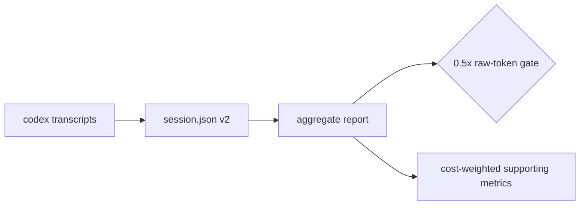
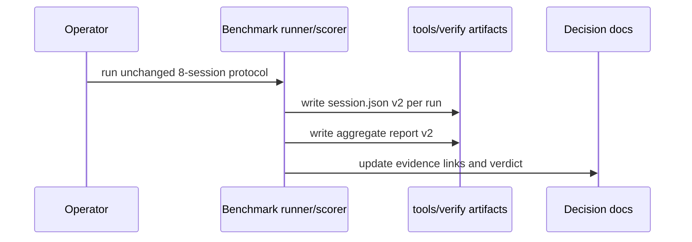

# PRD: Agent Benchmark Token Cost Metrics and Rerun

`Planning Mode: Principal Architect`
`Complexity: 4 -> MEDIUM mode`

Score basis: +2 touches 6-10 files; +1 benchmark schema/report changes; +1
protocol and evidence updates.

## 1. Context

**Problem:** The pilot benchmark failed the raw-token threshold, but the report
does not separate cached from uncached input tokens or prove whether the
token-efficiency fixes moved ThreeNative below the new 0.5x vanilla target.

**Files Analyzed:**

- `docs/audits/TOKEN_EFFICIENCY_AUDIT_2026-07-06.md`
- `tools/agent-benchmark/schemas/session.schema.json`
- `tools/agent-benchmark/schemas/report.schema.json`
- `tools/agent-benchmark/fixtures/vanilla-smoke/session.json`
- `docs/PRDs/done/agent-ergonomics-2026-07-05/PRD-001-agent-authoring-benchmark.md`
- `docs/PRDs/done/agent-ergonomics-2026-07-05/README.md`

**Current Behavior:**

- Session schema records only `tokenCount`, `iterationCount`, stop reason, and
  human rubric.
- Aggregate verdict threshold is fixed to `threenative-median-tokens <= 2x
  vanilla-median-tokens`.
- Audit notes that 90%+ of ThreeNative input tokens were cached in some pilot
  runs, but cached/uncached costs are not represented in benchmark artifacts.
- The suggested post-fix rerun has not been encoded as an executable
  acceptance gate.

## Pre-Planning Findings

**How will this feature be reached?**

- [x] Entry point identified: benchmark session JSON files, aggregate report
  generation, schemas under `tools/agent-benchmark/schemas`, and the unchanged
  run protocol in `tools/agent-benchmark/PROTOCOL.md`.
- [x] Caller file identified: benchmark scorer/report code under
  `tools/agent-benchmark` reads session files and writes aggregate reports.
- [x] Registration/wiring needed: schema version bump, report summary fields,
  fixture updates, protocol wording, and status/PRD evidence links after rerun.

**Is this user-facing?**

- [x] YES. This is an internal product decision gate, but the report is the
  source of truth for continue/kill investment decisions.

**Full user flow:**

1. Operator runs the same 8-session benchmark protocol after P0/P1 fixes land.
2. Scorer records raw tokens, cached input tokens, uncached input tokens, output
   tokens, iteration count, failed command count, and tool output bytes.
3. Aggregate report compares ThreeNative and vanilla on raw median tokens and
   blended cost-weighted tokens.
4. Decision gate passes only if ThreeNative raw median is <= 0.5x vanilla on
   both prompts, with cost-weighted metrics reported as supporting evidence.

## 2. Solution

**Approach:**

- Extend benchmark session schema to record token categories and command/output
  counters mined from transcripts.
- Extend aggregate report schema with per-prompt medians for raw tokens,
  uncached input tokens, cached input tokens, output tokens, blended cost, tool
  output bytes, iteration count, and failed command count.
- Update verdict threshold from the original 2x continuation screen to the
  audit target: ThreeNative median raw tokens <= 0.5x vanilla median for both
  prompts.
- Rerun the original pilot protocol unchanged except for capturing the added
  fields.

**Key Decisions:**

- [x] Raw-token medians remain the headline metric for comparability with the
  pilot.
- [x] Cached/uncached and blended-cost fields are supporting metrics, not a
  substitute for the raw 0.5x gate.
- [x] The rerun protocol must use the same prompts and conditions as the pilot
  so P0/P1 impact is attributable.
- [x] Failed command count and iteration count are promoted to first-class
  fields because the audit identifies turn fragmentation as a root cause.

**Data Changes:** Benchmark artifact schema version bump from v1 to v2.

## 3. Sequence Flow

## 4. Execution Phases

#### Phase 1: Benchmark schema and scorer fields - reports expose raw and cost-weighted token views

**Files (max 5):**

- `tools/agent-benchmark/schemas/session.schema.json` - v2 token breakdown.
- `tools/agent-benchmark/schemas/report.schema.json` - v2 aggregate metrics and
  threshold.
- `tools/agent-benchmark/*` scorer/report source - compute new fields.
- `tools/agent-benchmark/fixtures/vanilla-smoke/session.json` - update fixture.
- `tools/agent-benchmark/*test*` - scorer fixture tests.

**Implementation:**

- [ ] Add optional-but-preferred raw source fields:
  `inputTokens`, `cachedInputTokens`, `uncachedInputTokens`, `outputTokens`,
  `toolOutputBytes`, and `failedCommandCount`.
- [ ] Add `costWeightedTokens` computed from a documented weighting constant,
  while keeping `tokenCount` as raw total for backward compatibility.
- [ ] Update aggregate prompt summaries to include medians for the new fields.
- [ ] Update verdict threshold string and logic to `threenative-median-tokens <=
  0.5x vanilla-median-tokens`.

**Tests Required:**
| Test File | Test Name | Assertion |
|-----------|-----------|-----------|
| benchmark scorer test | `should compute cached and uncached token medians` | prompt summary contains correct medians |
| benchmark scorer test | `should fail when threenative raw median exceeds half vanilla` | verdict status is `fail` |
| benchmark schema test | `should accept v2 session token breakdown` | session fixture validates |

**User Verification:**

- Action: run the benchmark scorer on fixtures.
- Expected: report validates and includes both raw and cost-weighted metrics.

#### Phase 2: Protocol update and post-fix rerun - evidence proves whether P0/P1 worked

**Files (max 5):**

- `tools/agent-benchmark/PROTOCOL.md` - field capture and unchanged prompt
  rerun instructions.
- `docs/audits/TOKEN_EFFICIENCY_AUDIT_2026-07-06.md` - append rerun pointer
  after execution.
- `docs/PRDs/README.md` - link current/final benchmark evidence.
- `docs/status/capabilities/tooling-proof.md` - record the new benchmark gate
  after completion.
- `tools/verify/artifacts/agent-benchmark/<rerun-id>/` - generated evidence
  artifacts.

**Implementation:**

- [ ] Keep original prompts, model conditions, and session count unchanged.
- [ ] Capture iteration count, failed command count, and tool output bytes from
  transcripts in every session.
- [ ] Store session and aggregate reports under a dated rerun artifact
  directory.
- [ ] Update docs with a concise verdict and links to evidence.

**Tests Required:**
| Test File | Test Name | Assertion |
|-----------|-----------|-----------|
| benchmark protocol smoke | `should validate all rerun session and report artifacts` | schemas pass for every artifact |
| benchmark scorer test | `should include failed command and tool output medians` | aggregate report has all root-cause metrics |

**User Verification:**

- Action: inspect the aggregate rerun report.
- Expected: each prompt reports raw median ratio, cost-weighted ratio,
  iteration median, failed-command median, and tool-output median.

#### Phase 3: Decision gate - decide whether scaffold-first is required

**Files (max 5):**

- `docs/PRDs/done/agent-ergonomics-2026-07-05/README.md` - append post-fix
  decision.
- `docs/PRDs/README.md` - update current PRD ordering if scaffold-first is
  activated.
- `docs/status/capabilities/game-production.md` - note benchmark result when
  relevant.

**Implementation:**

- [ ] If both prompts pass <= 0.5x raw median, record the token-efficiency
  initiative as successful and keep scaffold-first as optional backlog.
- [ ] If either prompt lands between 0.5x and 1.0x, activate
  `agent-token-efficiency-scaffold-first.md` before engine-breadth work.
- [ ] If either prompt remains above 1.0x, escalate to the existing
  kill/continue decision gate rather than adding more gameplay breadth.

**Tests Required:**
| Test File | Test Name | Assertion |
|-----------|-----------|-----------|
| docs/check test or existing docs gate | `should link benchmark evidence from PRD index` | no orphaned rerun evidence |

**User Verification:**

- Action: read the decision note.
- Expected: next investment decision is explicit and backed by report paths.

## 5. Checkpoint Protocol

- Phase 1 checkpoint: schema/scorer tests pass.
- Phase 2 checkpoint: all rerun artifacts validate.
- Phase 3 checkpoint: docs link the evidence and state the decision.
- Automated reviewer should verify the rerun did not change prompts or
  benchmark conditions.

## 6. Verification Strategy

- Schema tests prevent malformed benchmark artifacts.
- Scorer tests prove ratio and cost-weighted calculations.
- The rerun itself is required evidence; code changes alone do not satisfy this
  PRD.

## 7. Acceptance Criteria

- [ ] Benchmark session/report schemas include raw, cached, uncached, output,
  cost-weighted, failed-command, iteration, and tool-output metrics.
- [ ] Aggregate verdict uses the audit target: ThreeNative median raw tokens <=
  0.5x vanilla median on both prompts.
- [ ] The original 8-session protocol is rerun after P0/P1 fixes land.
- [ ] Rerun evidence is linked from PRD/status docs with a clear decision.
- [ ] If the rerun misses the target, the scaffold-first PRD is explicitly
  activated or the kill/continue gate is escalated.
