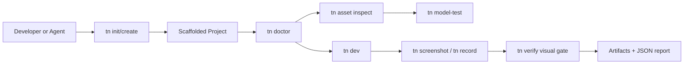
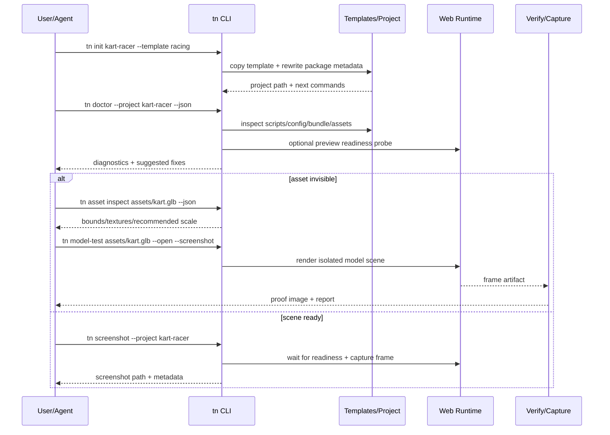

# PRD: Agent-Friendly Project Scaffolding and Visual Debugging Workflows

Complexity: 10 -> HIGH mode

Score basis: +3 touches 10+ future files, +2 adds new CLI/support surfaces,
+2 spans SDK/compiler/CLI/runtime-web/verify/docs/templates, +1 affects
asset/glTF inspection, +1 affects visual verification gates, +1 adds developer
experience documentation and examples.

## 1. Context

**Problem:** Building a non-trivial ThreeNative prototype currently requires too
much manual discovery when an agent or developer hits project setup, asset
visibility, camera framing, runtime transform, or screenshot/video proof issues.

**Goal:** Provide first-class CLI workflows and reference artifacts that let a
fresh agent scaffold, inspect, debug, visually verify, screenshot, and record a
ThreeNative game without guessing or hand-building one-off harnesses.

**Non-goals:**

- Do not build a full visual editor.
- Do not add arbitrary browser automation as a hidden runtime dependency.
- Do not promise unsupported engine features; unsupported paths should produce
  explicit diagnostics.
- Do not replace existing `tn create`, `tn dev`, `tn verify`, or packaging
  commands; extend and align them.

**Files Analyzed:**

- `AGENTS.md`
- `package.json`
- `docs/PRDs/README.md`
- `docs/PRDs/done/other/ai-consumable-distribution-contract.md`
- `docs/PRDs/other/ui-platform-desktop-residuals.md`
- `packages/cli/src/index.ts`
- `packages/cli/src/commands/create.ts`
- `packages/cli/src/commands/dev.ts`
- `packages/cli/src/commands/verify.ts`
- `packages/cli/src/templates/registry.ts`
- `packages/cli/src/verify/imageAnalysis.ts`
- `packages/cli/src/verify/cameraViews.ts`
- `templates/starter-functional/README.md`
- `templates/starter-functional/src/game.ts`
- `templates/v5-game-starter/README.md`
- `templates/v5-game-starter/src/game.ts`
- `/home/joao/projects/threenative-racing-circuit/src/game.ts`

**Current Behavior:**

- `tn create <name> [--template ...]` already scaffolds a project and rewrites
  package metadata/dependencies for source checkouts or published packages.
- `tn --help` lists implemented commands, but does not provide task-oriented
  help such as “make a racing game”, “inspect a GLB”, or “capture proof”.
- `tn dev` and web preview can run a project, and `tn verify` can capture web
  preview frames, but the path from “game is running” to “send screenshot/video
  proof of the exact visible state” is not ergonomic enough.
- Visual runtime readiness (`window.__THREENATIVE_READY__`) can be true while the
  game is visually unacceptable: black canvas, HUD-only, missing player, missing
  rivals, tiny models, bad camera framing, or hidden assets.
- glTF/GLB assets can load successfully while still being invisible due to
  scale, pivot, transform patch semantics, camera/frustum, texture dependency,
  or scene-composition issues.
- Real asset scale is a repeated failure mode: a model can be technically loaded
  and present in IR while being too tiny, too huge, clipped, hidden behind the
  camera, or mismatched against lane width/colliders. Agents need a required
  calibration loop before building the full scene.
- Runtime `Transform` patch behavior is easy to misuse. Patching only position
  and rotation may wipe scale if semantics are replace-like instead of
  component-field merge-like. Camera rotation mutation can also create failure
  modes that are hard to diagnose from normal console output.

## Pre-Planning Findings

No secret configuration is required. Browser/video capture may require local
browser dependencies; unsupported host states must be reported as unavailable
with stable diagnostics instead of silently degrading.

**How will this feature be reached?**

- [x] Entry point identified:
  - `tn create` / proposed alias `tn init` for scaffolded projects.
  - `tn help` / `tn help <topic>` for task-oriented references.
  - `tn doctor` for project/runtime/bundle/asset diagnostics.
  - `tn asset inspect <path>` and `tn model-test <path>` for GLB/glTF inspection.
  - `tn screenshot` and `tn record` for visual proof capture.
  - `tn verify` for automated visual acceptance gates.
- [x] Caller file identified:
  - `packages/cli/src/index.ts`
  - `packages/cli/src/commands/create.ts`
  - new command files under `packages/cli/src/commands/`
  - `packages/cli/src/templates/registry.ts`
  - verify/capture helpers under `packages/cli/src/verify/`
  - runtime diagnostics in `packages/runtime-web-three`
  - SDK/runtime transform helpers in `packages/sdk` and runtimes
  - docs under `docs/workflows/`, `docs/runtime/`, and `docs/contracts/`
- [x] Registration/wiring needed:
  - Add command registrations, JSON output contracts, tests, docs, and release
    verification coverage for the new CLI workflows.
  - Add canonical templates/examples and make them discoverable from help.
  - Add runtime-visible diagnostics for camera, transform, assets, and scene
    visibility.

**Is this user-facing?**

- [x] YES. This directly affects developers and agents building ThreeNative
  games, especially during first project setup and visual QA.
- [ ] NO.

**Full user/system flow:**

1. User asks an agent to create a playable ThreeNative prototype.
2. Agent runs `tn init`/`tn create` with an appropriate template and receives
   next commands plus reference links.
3. Agent runs `tn doctor` to confirm package links, scripts, bundle output,
   browser preview, runtime readiness, and known diagnostics.
4. If models are invisible or visually wrong, agent runs `tn asset inspect` and/or
   `tn model-test` to prove asset bounds, texture dependencies, preview scale,
   screen occupancy, collider/lane-width ratio, and loader health.
5. Agent uses documented camera/transform helpers instead of ad-hoc patching
   that can hide scale or black-screen the canvas.
6. Agent runs `tn screenshot` or `tn record --duration <seconds>` to produce
   shareable proof artifacts.
7. Agent runs `tn verify` or a focused visual gate and reports exact artifact
   paths, command output, and remaining visual risks.

## 2. Solution

**Approach:**

- Treat “agent builds a game from scratch” as a supported workflow, not an
  accidental use case. Provide explicit CLI affordances for setup, diagnosis,
  asset inspection, visual proof, and task-specific help.
- Evolve existing `tn create` into a stronger `tn init` experience rather than
  duplicating scaffolding logic. `tn init` can be an alias or more interactive
  front door; `tn create` remains scriptable.
- Add asset/model inspection tools that answer the questions agents repeatedly
  need: bounds, pivot, external textures, bundle path, recommended scale, and
  isolated render proof.
- Add a scale-calibration contract: every model-test and game template should
  compute world-unit bounds, compare model dimensions to authored gameplay
  units, and report whether the model is too small/large for the current camera,
  lane width, collider, and target screen occupancy.
- Make runtime diagnostics visible and machine-readable. Readiness must separate
  “the renderer started” from “the scene contains visible meshes, active camera,
  loaded assets, and no black canvas”.
- Add screenshot/video commands that can start or attach to a preview, wait for
  readiness, optionally send inputs, and save proof artifacts with JSON metadata.
- Promote blessed transform/camera helpers and diagnostics so model scale and
  camera framing failures are caught before visual QA.

**Key Decisions:**

- [x] Library/framework choices: reuse the existing CLI command framework,
  template registry, web preview runtime, verify capture utilities, JSON
  diagnostics, and docs gates.
- [x] Error-handling strategy: every command supports `--json`; failures produce
  stable diagnostic codes, a human message, affected path/asset/entity where
  possible, and suggested next command.
- [x] Reused utilities: existing `tn create`, `tn dev`, `tn verify`, image
  analysis helpers, camera view utilities, template registry, and docs checker.
- [x] Verification strategy: add focused CLI tests for command behavior and at
  least one runnable visual fixture that proves asset inspection, model-test,
  screenshot, and record artifacts.

**Data Changes:**

- Add JSON report schemas for doctor, asset inspection, model-test, screenshot,
  and record artifacts. No database migrations.

**Risks:**

- Browser/video capture can be flaky on CI or headless hosts. Mitigate with
  `supported/unavailable/failed` states and deterministic JSON reports.
- `tn doctor` can become a dumping ground. Keep it diagnostic and actionable:
  each finding must include a concrete fix or next command.
- Model-test scenes may mask bugs in full game composition. Mitigate by reporting
  that isolated asset proof is necessary but not sufficient for full-scene proof.
- Transform helper changes can affect existing scripting semantics. Preserve
  backwards compatibility and add diagnostics before changing behavior.
- Video capture may add heavy dependencies. Prefer optional Playwright/browser
  plumbing already used by verification, and degrade gracefully when unavailable.

## 3. Sequence Flow

## 4. Execution Phases

#### Phase 1: Improve scaffold front door — clear first-project path

**Dependencies:** None.

**Files:**

- `packages/cli/src/index.ts` — register `init` alias and improve help text.
- `packages/cli/src/commands/create.ts` — expose reusable scaffold implementation
  for `create` and `init`; improve next-command output.
- `packages/cli/src/commands/create.test.ts` — cover alias/help/JSON output.
- `packages/cli/src/templates/registry.ts` — ensure template names and aliases
  are machine-readable.
- `docs/workflows/developer-workflow.md` — document first-project flow.

**Implementation:**

- [ ] Add `init` as a documented alias for `create`, or a wrapper that calls the
  same implementation with friendlier output.
- [ ] Update command descriptions from “V1 starter” language to current
  ThreeNative terminology.
- [ ] Ensure output includes exact next commands: install, validate, build, dev,
  screenshot/verify once those exist.
- [ ] Add `--json` fields for `template`, `path`, `nextCommands`, and
  `referenceDocs`.

**Tests required:**

- `packages/cli/src/index.test.ts` — `tn --help` lists `init` and `create`.
- `packages/cli/src/commands/create.test.ts` — `tn init sample --json` returns
  the same scaffold payload shape as `tn create`.

**Verification:**

- Command: `pnpm --filter @threenative/cli test -- commands/create.test.ts index.test.ts`
- Expected result: alias/help/create tests pass.

**Manual/user verification:**

- Action: create a temp project from source checkout.
- Expected: output gives a direct working path to `pnpm install`, `pnpm run
  validate`, `pnpm run build`, and `pnpm run dev:web` or `tn dev`.

#### Phase 2: Add task-oriented CLI help — references that agents can inspect

**Dependencies:** Phase 1.

**Files:**

- `packages/cli/src/index.ts` — add `help` command dispatch or topic-aware help.
- `packages/cli/src/commands/help.ts` — new command for topic/reference output.
- `packages/cli/src/commands/help.test.ts` — help topic tests.
- `docs/workflows/ai-workflows.md` — add agent-oriented recipes.
- `docs/runtime/README.md` — link runtime/debugging topics.

**Implementation:**

- [ ] Add `tn help` and `tn help <topic>` with topics such as `scaffold`,
  `assets`, `camera`, `transform`, `visual-qa`, `screenshot`, and `record`.
- [ ] Support `--json` output listing topics, commands, examples, and docs.
- [ ] Document common failure symptoms: black canvas, HUD-only, model loaded but
  invisible, missing texture, camera clipping, transform scale wipe.

**Tests required:**

- `packages/cli/src/commands/help.test.ts` — unknown topics fail with stable
  diagnostic; known topics include commands and docs links.

**Verification:**

- Command: `pnpm --filter @threenative/cli test -- commands/help.test.ts`
- Expected result: help command tests pass.

#### Phase 3: Add `tn doctor` — actionable project/runtime diagnostics

**Dependencies:** Phase 1.

**Files:**

- `packages/cli/src/commands/doctor.ts` — new diagnostic command.
- `packages/cli/src/commands/doctor.test.ts` — project and bundle checks.
- `packages/cli/src/index.ts` — command registration.
- `packages/cli/src/diagnostics.ts` — diagnostic codes if needed.
- `docs/workflows/developer-workflow.md` — doctor usage.

**Implementation:**

- [ ] Check `package.json`, package manager, required scripts, local CLI shim,
  config file, source entrypoint, bundle output, and template metadata.
- [ ] Check bundle files: `manifest.json`, `world.ir.json`, `assets.manifest.json`,
  `runtime.config.json`, schemas, and script bundle.
- [ ] Optionally probe a running preview URL: canvas exists, ready flag, runtime
  diagnostics, console errors, loaded asset statuses, visible mesh count if
  runtime exposes it.
- [ ] Output severity levels: `ok`, `warning`, `error`, `unavailable`.
- [ ] Include exact next command for each failure.

**Tests required:**

- `packages/cli/src/commands/doctor.test.ts` — valid starter project returns OK.
- `packages/cli/src/commands/doctor.test.ts` — missing bundle/source/scripts
  return stable diagnostics and suggested fixes.

**Verification:**

- Command: `pnpm --filter @threenative/cli test -- commands/doctor.test.ts`
- Expected result: doctor diagnostics are deterministic and JSON-serializable.

#### Phase 4: Add `tn asset inspect` — GLB/glTF visibility triage

**Dependencies:** Phase 3.

**Files:**

- `packages/cli/src/commands/asset.ts` — new asset command namespace.
- `packages/cli/src/commands/asset.test.ts` — GLB/glTF inspection tests.
- `packages/cli/src/index.ts` — command registration.
- `docs/workflows/asset-pipeline.md` — inspection workflow.
- `packages/cli/src/diagnostics.ts` — texture/bounds diagnostics if needed.

**Implementation:**

- [ ] Implement `tn asset inspect <path> [--json]`.
- [ ] Report file type, byte size, scenes/nodes/meshes/materials, approximate
  bounds, origin/pivot, external texture/image dependencies, and missing files.
- [ ] Report recommended preview scale and camera distance based on bounds.
- [ ] Report calibration metrics for game use: unscaled dimensions, proposed
  scale for a target world-unit height/length, lane-width ratio, collider ratio,
  camera-distance range, and expected screen occupancy for common FOVs.
- [ ] Emit warnings when a model is likely invisible or visually wrong: near-zero
  bounds, extreme scale required, pivot far outside bounds, model behind/inside
  the camera in bundle context, or transform/collider mismatch.
- [ ] Detect asset paths that will not bundle correctly or whose external
  texture dependencies are outside project/bundle roots.

**Tests required:**

- `packages/cli/src/commands/asset.test.ts` — fixture GLB reports bounds and
  dependencies.
- `packages/cli/src/commands/asset.test.ts` — missing external texture reports a
  stable diagnostic.

**Verification:**

- Command: `pnpm --filter @threenative/cli test -- commands/asset.test.ts`
- Expected result: inspection works without launching a browser.

#### Phase 5: Add `tn model-test` — isolated model render proof

**Dependencies:** Phase 4.

**Files:**

- `packages/cli/src/commands/modelTest.ts` — generate/run isolated model scene.
- `packages/cli/src/commands/modelTest.test.ts` — command/report tests.
- `packages/cli/src/verify/cameraViews.ts` — reusable preview camera selection.
- `templates/model-test/` — minimal generated project or ephemeral scene assets.
- `docs/workflows/asset-pipeline.md` — model-test workflow.

**Implementation:**

- [ ] Implement `tn model-test <asset> [--screenshot] [--out <dir>] [--json]`.
- [ ] Generate an ephemeral scene using inspected bounds and recommended camera.
- [ ] Include a visible world-unit ruler/grid, bounding box overlay, camera frustum
  summary, and at least three scale presets: `1x`, `fit-target`, and
  `gameplay-recommended`.
- [ ] Render in web preview and save screenshot/report when capture is available.
- [ ] Report a scale verdict (`too-small`, `ok`, `too-large`, `clipped`,
  `unknown`) based on projected screen occupancy and bounds-vs-camera analysis.
- [ ] Explicitly state: isolated model render proof does not prove full game
  composition, but it separates loader/asset issues from scene/camera issues.

**Tests required:**

- `packages/cli/src/commands/modelTest.test.ts` — generated scene references the
  requested asset and copies required textures.
- Visual fixture or smoke test — screenshot artifact exists when capture is
  available; otherwise reports `unavailable`.

**Verification:**

- Command: `pnpm --filter @threenative/cli test -- commands/modelTest.test.ts`
- Expected result: model-test generation and JSON report pass.

#### Phase 6: Clarify Transform patching and add camera helpers

**Dependencies:** Phase 3.

**Files:**

- `packages/sdk/src/` — transform/camera helper APIs or docs annotations.
- `packages/runtime-web-three/src/` — runtime support and diagnostics.
- `runtime-bevy/` — parity support or explicit unsupported diagnostics.
- `docs/contracts/scripting-api.md` — Transform patch semantics.
- `docs/runtime/runtime-adapters.md` — camera mutation constraints.
- relevant conformance tests under packages/runtime/verify fixtures.

**Implementation:**

- [ ] Document exact `Transform` patch semantics: merge vs replace, scale
  preservation, and recommended helper APIs.
- [ ] Add helper APIs where appropriate: `setPosition`, `setRotation`,
  `setScale`, or `patchTransform` with explicit merge behavior.
- [ ] Add `followCamera` / `chaseCamera` helper or documented pattern that avoids
  unsafe runtime camera rotation mutation.
- [ ] Add diagnostics when a runtime patch updates only part of `Transform` in a
  way likely to drop scale or when camera mutation fails.

**Tests required:**

- Runtime/conformance tests proving scale is preserved or diagnostics are
  emitted for unsafe partial patches.
- Camera helper tests proving stable web and Bevy behavior or explicit host
  differences.

**Verification:**

- Command: `pnpm verify:conformance`
- Expected result: shared transform/camera semantics are covered by conformance
  or documented as capability-gated.

#### Phase 7: Add `tn screenshot` and improve `tn verify` proof artifacts

**Dependencies:** Phase 3.

**Files:**

- `packages/cli/src/commands/screenshot.ts` — new screenshot command.
- `packages/cli/src/commands/screenshot.test.ts` — command/report tests.
- `packages/cli/src/commands/verify.ts` — share capture/wait helpers.
- `packages/cli/src/verify/imageAnalysis.ts` — optional visual checks.
- `docs/workflows/developer-workflow.md` — screenshot proof flow.

**Implementation:**

- [ ] Implement `tn screenshot [--project <path>] [--url <url>] [--out <path>]
  [--wait-ready] [--json]`.
- [ ] Wait for canvas and runtime readiness; fail separately for no canvas,
  runtime error, black frame, and HUD-only/low-visible-mesh frame where
  detectable.
- [ ] Save screenshot plus JSON metadata: URL, dimensions, readiness,
  diagnostics, console errors, resource failures, timestamp, and command.
- [ ] Reuse the same capture path inside `tn verify` where possible.

**Tests required:**

- `packages/cli/src/commands/screenshot.test.ts` — argument parsing/report
  shape.
- Capture smoke fixture — screenshot artifact path exists or command reports
  unavailable with diagnostic code.

**Verification:**

- Command: `pnpm --filter @threenative/cli test -- commands/screenshot.test.ts`
- Expected result: screenshot command is deterministic and scriptable.

#### Phase 8: Add `tn record` — short gameplay video proof

**Dependencies:** Phase 7.

**Files:**

- `packages/cli/src/commands/record.ts` — new video command.
- `packages/cli/src/commands/record.test.ts` — command/report tests.
- `packages/cli/src/verify/` — shared browser/input/video helpers.
- `docs/workflows/developer-workflow.md` — recording workflow.

**Implementation:**

- [ ] Implement `tn record [--project <path>] [--url <url>] [--duration 10]
  [--input-script <path>] [--out <path>] [--json]`.
- [ ] Support a simple inline/default input script for common proof: hold `W`,
  steer left/right, tap boost.
- [ ] Cap default recordings below one minute and report exact duration/fps/path.
- [ ] Degrade gracefully when browser/video codecs are unavailable.

**Tests required:**

- `packages/cli/src/commands/record.test.ts` — parsing/report shape and duration
  caps.
- Optional smoke fixture — records a short artifact when supported.

**Verification:**

- Command: `pnpm --filter @threenative/cli test -- commands/record.test.ts`
- Expected result: record command rejects unsafe/too-long durations and emits a
  stable report.

#### Phase 9: Add runtime debug overlay and scene visibility diagnostics

**Dependencies:** Phase 3.

**Files:**

- `packages/runtime-web-three/src/` — expose runtime diagnostics and optional
  debug overlay.
- `runtime-bevy/` — corresponding diagnostics where feasible.
- `packages/ir/` — report schema if needed.
- `docs/runtime/runtime-adapters.md` — debug overlay docs.
- `tools/verify/src/` — diagnostics gate if promoted.

**Implementation:**

- [ ] Expose machine-readable diagnostics for active camera, canvas size, loaded
  asset count, failed resources, visible mesh count, culled mesh count where
  practical, current scene id, and recent runtime errors.
- [ ] Expose model visibility diagnostics where practical: per-rendered-entity
  world-space bounds, final transform scale, projected screen-space bounds,
  camera distance, frustum/clipping state, and material/texture load state.
- [ ] Add optional debug overlay toggle for humans.
- [ ] Ensure `tn doctor`, `tn screenshot`, and `tn verify` can consume the
  diagnostics without relying only on console output.

**Tests required:**

- Runtime tests for diagnostics payload shape.
- Verify tests consuming diagnostics in a fixture preview.

**Verification:**

- Command: `pnpm verify:focused -- runtime-diagnostics` or equivalent focused
  gate once registered.
- Expected result: diagnostics are available in web preview and explicitly
  unavailable/unsupported elsewhere.

#### Phase 10: Add richer starter templates and example gallery

**Dependencies:** Phases 1, 2, and 7.

**Files:**

- `templates/racing-kart/` — new canonical racing template with player, rivals,
  camera, HUD, and visual proof fixture.
- `templates/third-person/` — optional future template.
- `packages/cli/src/templates/registry.ts` — register templates and aliases.
- `docs/workflows/developer-workflow.md` — template selection docs.
- `docs/PRDs/README.md` and status docs if templates become release-relevant.

**Implementation:**

- [ ] Add `racing-kart` template covering the exact failure modes from the
  prototype: foreground player, visible rivals, curved track, HUD, camera helper,
  model scale, screenshot-ready composition.
- [ ] Include an explicit scale-calibration fixture in the template: real asset
  bounds, chosen scale rationale, lane width/collider dimensions, camera offset,
  and before/after screenshot expectations. The template must fail visual QA if
  the kart is tiny, clipped, hidden, or too large to read.
- [ ] Add `tn examples list` or include example listing through `tn help
  examples` if a full examples command is too much for this PRD.
- [ ] Include proof artifacts or fixture expectations so regressions are caught.

**Tests required:**

- Template registry tests proving `racing-kart` scaffolds.
- Template validate/build test.
- Visual screenshot smoke proof if capture is available.

**Verification:**

- Command: `pnpm tn -- create /tmp/tn-racing --template racing-kart && cd
  /tmp/tn-racing && pnpm install && pnpm run validate && pnpm run build`
- Expected result: scaffolded racing template validates/builds and produces
  screenshot-ready output.

## 5. Verification Strategy

Philosophy: do not trust readiness flags alone. A feature is done only when
commands, JSON reports, and visual artifacts prove the developer/agent workflow
works end-to-end.

**Automated verification:**

- CLI unit tests for each new command and error path.
- Template registry tests for `init/create` and new templates.
- Asset inspection tests using GLB/glTF fixtures with known bounds and texture
  dependencies.
- Runtime diagnostics tests for visible machine-readable state.
- Conformance tests for transform/camera semantics if shared across runtimes.
- Docs checks through `pnpm check:docs`.

**Manual/visual verification:**

- Scaffold a fresh project from source checkout.
- Run doctor before and after build to confirm actionable findings.
- Inspect a GLB model and run isolated model-test screenshot.
- Confirm model scale calibration before full-scene work: asset bounds,
  recommended scale, lane/collider ratio, camera distance, and screenshot screen
  occupancy must be recorded.
- Run a full game preview and capture screenshot proof.
- Record a sub-one-minute clip with a default input script.
- Confirm reports include artifact paths and exact unsupported/unavailable states
  where host capture is not available.

## Acceptance Criteria

- [ ] `tn init` or an explicitly documented `tn create` path scaffolds a basic
  project with next commands and machine-readable output.
- [ ] `tn help <topic>` gives agent-consumable references for scaffolding,
  assets, camera, transform, visual QA, screenshot, and record workflows.
- [ ] `tn doctor` diagnoses missing setup, missing bundle output, runtime preview
  readiness, resource failures, and known visual/runtime failure classes.
- [ ] `tn asset inspect` reports GLB/glTF bounds, texture dependencies, and
  scale/camera hints.
- [ ] `tn asset inspect` reports gameplay scale calibration: unscaled dimensions,
  recommended scale, target world-unit size, lane/collider ratios, camera-distance
  range, and warnings for extreme scale/pivot/visibility risks.
- [ ] `tn model-test` can isolate a model into a generated preview scene and
  capture/report proof when the host supports it.
- [ ] Transform patch semantics are documented and covered by tests or stable
  diagnostics; scale-wipe-prone updates are no longer silent footguns.
- [ ] Camera follow/chase helpers or documented safe patterns prevent common
  black-canvas/camera-mutation failures.
- [ ] `tn screenshot` captures a ready preview frame plus JSON metadata.
- [ ] `tn record` captures a short gameplay video with optional scripted input or
  reports a stable unavailable state.
- [ ] Runtime debug diagnostics expose active camera, canvas, loaded assets,
  resource failures, visible mesh/scene information where practical, and recent
  runtime errors.
- [ ] Runtime/model diagnostics expose final world bounds, final scale,
  projected screen-space bounds, camera distance, and frustum/clipping state so
  “asset loaded but wrong scale” is diagnosable without guessing.
- [ ] A canonical racing/kart example or template demonstrates player kart,
  visible rivals, curved track, readable HUD, camera framing, and screenshot
  proof.
- [ ] Existing behavior is preserved for `tn create`, `tn dev`, `tn verify`, and
  package/build commands.
- [ ] Relevant tests pass: focused CLI tests, `pnpm check:docs`, and broader
  gates appropriate to touched runtime/contract surfaces.
- [ ] Documentation updated for user-facing behavior changes.

## PHASE 1 CHECKPOINT

Files changed: CLI init/create/help docs and tests.
Automated verification: `pnpm --filter @threenative/cli test -- commands/create.test.ts index.test.ts`.
Manual verification needed: yes, scaffold a temp project.
Drift from PRD: record any deviation in command naming or next-command output.
Decision: continue only when scaffold flow is scriptable and documented.

## PHASE 2 CHECKPOINT

Files changed: help command/docs/tests.
Automated verification: help command tests and `pnpm check:docs`.
Manual verification needed: no, unless docs links are externally hosted.
Drift from PRD: record skipped topics.
Decision: continue only when task-oriented help covers the prototype failure
classes.

## PHASE 3 CHECKPOINT

Files changed: doctor command/tests/docs.
Automated verification: doctor command tests.
Manual verification needed: yes, run against a valid starter and a deliberately
broken project.
Drift from PRD: record diagnostic classes not yet detectable.
Decision: continue only when diagnostics include exact suggested next commands.

## PHASE 4 CHECKPOINT

Files changed: asset inspect command/tests/docs.
Automated verification: asset command tests.
Manual verification needed: yes, inspect at least one real Kenney-style GLB with
external texture dependency.
Drift from PRD: record unsupported GLB features.
Decision: continue only when bounds and texture dependencies are reliable.

## PHASE 5 CHECKPOINT

Files changed: model-test command/template/tests/docs.
Automated verification: model-test command tests.
Manual verification needed: yes, capture one isolated model screenshot where host
supports it.
Drift from PRD: record capture unavailability separately from model-load failure.
Decision: continue only when model-test separates loader bugs from scene bugs.

## PHASE 6 CHECKPOINT

Files changed: SDK/runtime/docs/conformance tests.
Automated verification: `pnpm verify:conformance` or focused equivalent.
Manual verification needed: yes if camera visual behavior changes.
Drift from PRD: record any compatibility constraints.
Decision: continue only when transform/camera semantics are explicit.

## PHASE 7 CHECKPOINT

Files changed: screenshot command/tests/verify helpers/docs.
Automated verification: screenshot command tests and capture smoke where
available.
Manual verification needed: yes, sendable screenshot artifact path.
Drift from PRD: record black-frame/HUD-only detection limitations.
Decision: continue only when screenshot proof is scriptable.

## PHASE 8 CHECKPOINT

Files changed: record command/tests/docs.
Automated verification: record command tests and duration cap checks.
Manual verification needed: yes, short video artifact on a supported host.
Drift from PRD: record codec/browser limitations.
Decision: continue only when unavailable states are explicit.

## PHASE 9 CHECKPOINT

Files changed: runtime diagnostics/overlay/tests/docs.
Automated verification: runtime diagnostics tests/focused gate.
Manual verification needed: yes for overlay readability.
Drift from PRD: record runtime parity limitations.
Decision: continue only when tools can consume diagnostics machine-readably.

## PHASE 10 CHECKPOINT

Files changed: templates/examples/registry/docs/tests.
Automated verification: template scaffold + validate/build + docs checks.
Manual verification needed: yes, screenshot confirms player, rivals, shaped track,
HUD, and no black canvas.
Drift from PRD: record any visual acceptance failures before promotion.
Decision: finish only when the racing/kart template is genuinely screenshot-ready.
