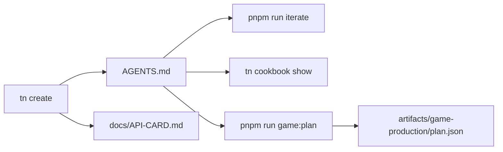
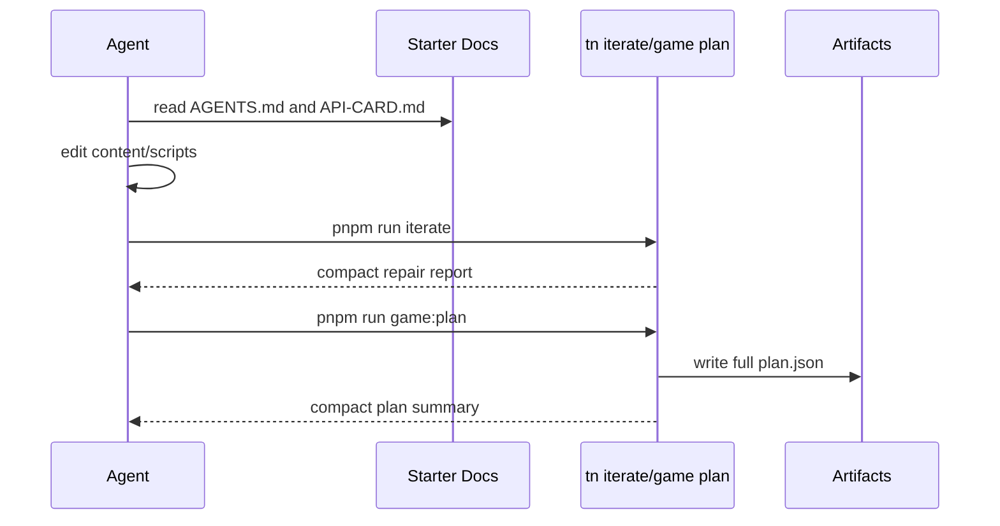

# PRD: Agent Token Efficiency Loop and API Card

`Planning Mode: Principal Architect`
`Complexity: 5 -> MEDIUM mode`

Score basis: +2 touches 6-10 files; +1 docs/template workflow changes; +2
generated API card and validation across packages.

## 1. Context

**Problem:** ThreeNative agents still spend many turns discovering APIs and
running fragmented commands even though `tn iterate` and cookbook examples
exist.

**Files Analyzed:**

- `docs/audits/TOKEN_EFFICIENCY_AUDIT_2026-07-06.md`
- `templates/structured-source-starter/AGENTS.md`
- `templates/_shared/AGENT_GAME_PLAN.md`
- `templates/structured-source-starter/package.json`
- `packages/script-stdlib/src/script-context.ts`
- `packages/cli/src/commands/cookbook.ts`
- `packages/cli/src/commands/game.ts`
- `tools/verify/src/templateProductionGate.ts`
- `docs/PRDs/done/agent-ergonomics-2026-07-05/PRD-002-authoring-cookbook.md`
- `docs/PRDs/done/agent-ergonomics-2026-07-05/PRD-003-single-command-iteration-loop.md`

**Current Behavior:**

- Starter instructions recommend cookbook and `tn iterate`, but also list many
  lower-level commands prominently.
- The benchmark pilot showed zero use of `tn iterate` and 24-34 exploratory
  reads/searches per ThreeNative session.
- `ScriptContext` is discoverable in package source, but no compact generated
  API card is present inside starters.
- `tn game plan --json` is commonly redirected to `plan.json`; direct stdout is
  still large enough to become long-lived context if run interactively.

## Pre-Planning Findings

**How will this feature be reached?**

- [x] Entry point identified: generated project `AGENTS.md`, `AGENT_GAME_PLAN.md`,
  `docs/API-CARD.md` or `llms.txt`, `tn iterate --project . --json`, and
  `pnpm run game:plan`.
- [x] Caller file identified: template creation copies shared instructions;
  `tools/verify/src/templateProductionGate.ts` verifies starter instruction
  content; CLI `game.ts` owns plan output.
- [x] Registration/wiring needed: generated-card script/gate, template copy
  inclusion, documentation updates, and compact `tn game plan` stdout behavior.

**Is this user-facing?**

- [x] YES. This is a developer/agent UX change for generated projects and CLI
  command output.

**Full user flow:**

1. Agent opens the generated project instructions.
2. Instructions point first to the local API card, cookbook IDs, and
   `pnpm run iterate`.
3. Agent patches durable source or scripts without reading repo internals.
4. Agent runs `tn iterate --project . --json` as the only default repair loop.
5. If planning a game, `pnpm run game:plan` writes the full plan artifact while
   stdout stays compact.

## 2. Solution

**Approach:**

- Make starter instructions stricter: after edits, run `pnpm run iterate` as
  the default loop; use validate/build/playtest individually only for named
  diagnostic situations.
- Ship a generated, CI-validated API card in starters with the compact
  `ScriptContext` surface, source document shapes, input conventions, resource
  rules, and cookbook pointers.
- Change `tn game plan --json` direct stdout to a compact summary with the full
  plan written to `artifacts/game-production/plan.json` by default, or add an
  explicit `--full-json`/`--stdout-plan` escape hatch if compatibility requires
  it.
- Gate starter docs against reintroducing repo-spelunking instructions.

**Key Decisions:**

- [x] The API card must be generated from source or verified against source, not
  hand-maintained.
- [x] Starter docs may mention lower-level commands, but the first repair loop
  must be `tn iterate`.
- [x] The full machine-readable game plan remains persisted; compact stdout
  removes long-lived context bloat.
- [x] Success is measured by the next benchmark transcript containing zero
  `rg`/`sed` reads outside the candidate project for API discovery.

**Data Changes:** Add generated starter documentation. No IR schema changes.
Potential CLI JSON contract change for `tn game plan --json`; preserve full
plan artifact.

## 3. Sequence Flow

## 4. Execution Phases

#### Phase 1: Starter instruction funnel - generated projects make iterate the default loop

**Files (max 5):**

- `templates/structured-source-starter/AGENTS.md` - prioritize iterate and
  compact report workflow.
- `templates/racing-kit-rally-starter/AGENTS.md` - keep maintained starter
  aligned.
- `templates/_shared/AGENT_GAME_PLAN.md` - replace per-command loop guidance
  with iterate-first guidance.
- `tools/verify/src/templateProductionGate.ts` - require iterate-first wording
  and compact artifact guidance.
- `tools/verify/src/templateProductionGate.test.ts` - coverage for the new
  instruction requirements.

**Implementation:**

- [ ] Move validate/build/playtest commands under "focused fallback" language.
- [ ] Explicitly instruct agents to avoid reading deep logs unless compact
  reports identify a need.
- [ ] Gate generated starter `AGENTS.md` for `iterate` and compact-report
  language.

**Tests Required:**
| Test File | Test Name | Assertion |
|-----------|-----------|-----------|
| `tools/verify/src/templateProductionGate.test.ts` | `should require iterate as the starter repair loop` | missing iterate-first guidance emits stable diagnostic |
| `tools/verify/src/templateProductionGate.test.ts` | `should reject instructions that point agents at deep frame logs` | missing compact-report guidance emits stable diagnostic |

**User Verification:**

- Action: run `tn create` in a scratch directory and open `AGENTS.md`.
- Expected: the default loop is unambiguously `pnpm run iterate`.

#### Phase 2: Generated API card - agents get the script/source contract locally

**Files (max 5):**

- `tools/verify/src/apiCard.ts` or a new generator under existing tooling -
  generate/validate API card content.
- `tools/verify/src/apiCard.test.ts` - `ScriptContext` parity tests.
- `templates/structured-source-starter/docs/API-CARD.md` - generated card.
- `templates/racing-kit-rally-starter/docs/API-CARD.md` - generated card.
- `templates/structured-source-starter/AGENTS.md` - reference the card.

**Implementation:**

- [ ] Generate or validate a 4-6 KB card containing `ScriptContext`
  signatures, allowed stdlib imports, common content JSON shapes, input axis
  names, resource patterns, and cookbook commands.
- [ ] Fail verification when the card drifts from
  `packages/script-stdlib/src/script-context.ts`.
- [ ] Include the card in generated projects.

**Tests Required:**
| Test File | Test Name | Assertion |
|-----------|-----------|-----------|
| `tools/verify/src/apiCard.test.ts` | `should list every ScriptContext member in the generated API card` | source interface members are all present |
| `tools/verify/src/apiCard.test.ts` | `should keep the API card below the context budget` | rendered card is <= 6 KB |

**User Verification:**

- Action: create a starter and inspect `docs/API-CARD.md`.
- Expected: card is compact, local, and sufficient for script authoring without
  reading package source.

#### Phase 3: Compact game plan stdout - full plans are artifacts, not long-lived context

**Files (max 5):**

- `packages/cli/src/commands/game.ts` - write full plan artifact and compact
  stdout mode.
- `packages/cli/src/commands/gameScore.test.ts` - plan artifact/stdout tests.
- `templates/structured-source-starter/package.json` - remove shell redirect if
  CLI writes the plan directly.
- `templates/racing-kit-rally-starter/package.json` - same.
- `templates/_shared/AGENT_GAME_PLAN.md` - update first commands.

**Implementation:**

- [ ] Make `tn game plan --project . --json` write the full
  `artifacts/game-production/plan.json` artifact by default.
- [ ] Print compact stdout with plan path, milestones, file map, proof command
  list, and diagnostics.
- [ ] Provide an explicit full-plan stdout mode only if existing tests or users
  need it.
- [ ] Update template scripts to avoid shell redirects if the CLI now owns
  artifact persistence.

**Tests Required:**
| Test File | Test Name | Assertion |
|-----------|-----------|-----------|
| `packages/cli/src/commands/gameScore.test.ts` | `should write full game plan artifact by default` | artifact has `schema: threenative.game-plan` and `mutate:false` |
| `packages/cli/src/commands/gameScore.test.ts` | `should print compact game plan summary to stdout` | stdout omits full high-value tables and stays below budget |
| `tools/verify/src/templateProductionGate.test.ts` | `should accept game plan script without redirect when CLI persists artifact` | starter scripts pass |

**User Verification:**

- Action: run `tn game plan --goal "small collector" --project . --json`.
- Expected: stdout is compact and `artifacts/game-production/plan.json`
  contains the complete plan.

## 5. Checkpoint Protocol

- Phase 1 checkpoint: run `pnpm verify:template-production`.
- Phase 2 checkpoint: run API-card tests and create a scratch starter.
- Phase 3 checkpoint: run game command tests and `pnpm verify:agent-io`.
- Automated PRD reviewer should check that the new docs actually route agents
  through iterate and local API-card context.

## 6. Verification Strategy

- Template gate enforces durable instruction changes.
- API-card parity test prevents stale docs.
- CLI tests prove full game plans remain persisted while stdout is compact.
- The benchmark rerun PRD measures whether discovery reads and turn counts
  actually drop.

## 7. Acceptance Criteria

- [ ] Maintained starter `AGENTS.md` files make `pnpm run iterate` the default
  post-edit repair loop.
- [ ] Generated projects include a compact API card that is verified against
  `ScriptContext`.
- [ ] `tn game plan --json` no longer forces agents to keep the full plan in
  stdout context during normal use.
- [ ] Template gates fail if instructions point agents at deep frame logs or
  omit iterate-first guidance.
- [ ] Relevant tests plus `pnpm verify:template-production` and
  `pnpm verify:agent-io` pass.
