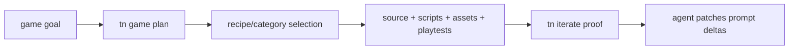
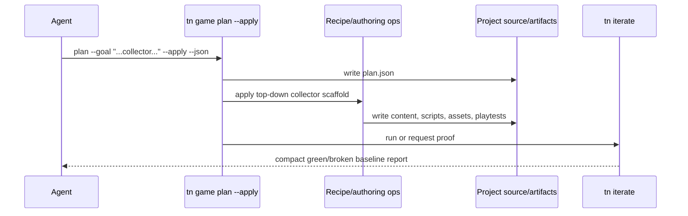

# PRD: Agent Token Efficiency Scaffold-First Game Plan Apply

`Planning Mode: Principal Architect`
`Complexity: 7 -> HIGH mode`

Score basis: +3 touches 10+ files; +2 multi-package CLI/template/game recipe
changes; +2 new scaffold-to-playable orchestration behavior.

## 1. Context

**Problem:** Even after compact IO and iterate-first docs, ThreeNative may still
need a structural advantage over vanilla Three.js: scaffold a playable baseline
from a recipe so agents only patch the requested deltas.

**Files Analyzed:**

- `docs/audits/TOKEN_EFFICIENCY_AUDIT_2026-07-06.md`
- `packages/cli/src/commands/game.ts`
- `packages/cli/src/commands/gameScore.test.ts`
- `packages/cli/src/commands/create.ts`
- `packages/cli/src/commands/recipe*`
- `templates/structured-source-starter/`
- `templates/racing-kit-rally-starter/`
- `docs/PRDs/done/game-development-velocity-kits.md`
- `docs/PRDs/done/gameblocks-informed-gameplay-accuracy.md`
- `docs/PRDs/done/agent-game-planning-template-and-init-scaffold.md`

**Current Behavior:**

- `tn game plan --json` recommends recipes, assets, scripts, and proofs, but
  remains non-mutating (`mutate:false`).
- `tn game improve --apply-plan` applies plan-driven improvements, but it does
  not guarantee a first playable, scenario-backed baseline from an empty
  starter.
- Agents still spend many turns creating the basic playable loop that recipes
  and templates could materialize deterministically.

## Pre-Planning Findings

**How will this feature be reached?**

- [x] Entry point identified: `tn game plan --goal "<goal>" --project . --apply
  --json` or a paired `tn game apply-plan --from-latest --json` command.
- [x] Caller file identified: `packages/cli/src/commands/game.ts` owns game
  planning and improve/apply-plan behavior; recipe commands own bounded source
  mutation.
- [x] Registration/wiring needed: CLI option/subcommand, recipe selection,
  source mutation orchestration, scenario generation, production evidence, and
  template/docs updates.

**Is this user-facing?**

- [x] YES. This mutates generated project source and is the intended fastest
  game-authoring path for agents.

**Full user flow:**

1. Agent starts from a fresh starter and user goal.
2. Agent runs `tn game plan --goal "lane runner with coins" --project . --apply --json`.
3. CLI writes the full plan, applies the matching starter recipe, creates or
   updates durable source/scripts/assets, and commits playtest scenarios.
4. CLI runs or instructs `tn iterate` to prove the baseline.
5. Agent patches prompt-specific deltas and reruns `tn iterate`.

## 2. Solution

**Approach:**

- Add an explicit scaffold-first path that converts high-confidence plan recipes
  into a compiling, playtest-passing baseline.
- Limit the first implementation to categories represented in the benchmark and
  cookbook: top-down collector and lane runner.
- Reuse existing bounded recipe/authoring operations; do not generate raw
  Three.js or backend-private Bevy data.
- Produce committed playtest scenarios and production evidence as part of the
  scaffold so the agent's first loop starts green.

**Key Decisions:**

- [x] `--apply` must be explicit because `tn game plan` has historically been
  non-mutating.
- [x] Baseline source must stay in `content/**/*.json` and
  `src/scripts/**/*.ts`.
- [x] First slice targets benchmark categories before broadening to arbitrary
  genres.
- [x] Primitive fallback cannot be marked finished for high-value surfaces; the
  applied scaffold must preserve asset sourcing/provenance or explicit fallback
  blockers.

**Data Changes:** No IR schema changes expected. May add recipe metadata fields
for scaffold applicability and required scenario outputs.

## 3. Sequence Flow

## 4. Execution Phases

#### Phase 1: Apply contract and dry-run safety - mutating scaffold is explicit and auditable

**Files (max 5):**

- `packages/cli/src/commands/game.ts` - `--apply` option or subcommand.
- `packages/cli/src/commands/gamePlanTypes.ts` - scaffold/apply plan fields.
- `packages/cli/src/commands/gameScore.test.ts` - command contract tests.
- `packages/cli/src/index.ts` - help text.
- `docs/PRDs/other/agent-benchmark-token-cost-rerun.md` - note activation
  dependency if needed.

**Implementation:**

- [ ] Keep plain `tn game plan --json` non-mutating or compact-summary only.
- [ ] Add explicit `--apply` path that declares planned source writes before
  executing them.
- [ ] Add stable diagnostics for unsupported categories, dirty generated
  outputs, or missing recipe applicability.
- [ ] Return compact apply summary with plan path, changed durable files,
  scenario paths, proof command, and diagnostics.

**Tests Required:**
| Test File | Test Name | Assertion |
|-----------|-----------|-----------|
| `packages/cli/src/commands/gameScore.test.ts` | `should not mutate source without apply flag` | normal plan leaves content/scripts unchanged |
| `packages/cli/src/commands/gameScore.test.ts` | `should reject unsupported scaffold category with diagnostic` | emits stable unsupported diagnostic |
| `packages/cli/src/commands/gameScore.test.ts` | `should summarize planned writes before applying scaffold` | stdout includes durable file list |

**User Verification:**

- Action: run `tn game plan --goal "abstract puzzle" --apply --json`.
- Expected: unsupported category fails clearly without partial writes.

#### Phase 2: Collector scaffold - fresh starter becomes a proven playable collector

**Files (max 5):**

- `packages/cli/src/commands/game.ts` - collector scaffold orchestration.
- `packages/cli/src/commands/recipe*` - reusable collector application hook.
- `packages/cli/src/commands/gameScore.test.ts` - collector fixture tests.
- `docs/cookbook/top-down-collector-recipe.md` - update if recipe command or
  source pattern changes.
- `tools/verify/src/gameProductionGate.ts` - require scaffold evidence if the
  example is promoted.

**Implementation:**

- [ ] Select collector recipe from goal/category.
- [ ] Materialize scene resources, player control, collectible progression,
  HUD binding, fail/retry or win condition, and a committed playtest scenario.
- [ ] Preserve asset sourcing rows or explicit fallback blockers for high-value
  surfaces.
- [ ] Run or emit `tn iterate --project . --json` as the required proof.

**Tests Required:**
| Test File | Test Name | Assertion |
|-----------|-----------|-----------|
| `packages/cli/src/commands/gameScore.test.ts` | `should apply collector scaffold to a fresh starter` | content/scripts/playtests exist and build metadata is valid |
| `packages/cli/src/commands/gameScore.test.ts` | `should include collector playtest scenario in apply summary` | summary lists scenario path and proof command |
| cookbook verification | `top-down-collector recipe remains executable` | `pnpm verify:cookbook` passes |

**User Verification:**

- Action: apply collector scaffold in a scratch starter and run
  `tn iterate --project . --json`.
- Expected: baseline passes or reports only actionable diagnostics owned by
  durable source.

#### Phase 3: Lane-runner scaffold - benchmark lane-runner prompt starts from a green baseline

**Files (max 5):**

- `packages/cli/src/commands/game.ts` - lane-runner scaffold orchestration.
- `packages/cli/src/commands/recipe*` - reusable lane-runner hook.
- `packages/cli/src/commands/gameScore.test.ts` - lane-runner fixture tests.
- `docs/cookbook/lane-runner-spawn.md` - update if source pattern changes.
- `tools/verify/src/gameProductionGate.ts` - gate promoted evidence.

**Implementation:**

- [ ] Select lane-runner recipe from goal/category.
- [ ] Materialize lanes, continuous movement, hazards/rewards, camera, HUD
  state, fail/retry, and committed playtest.
- [ ] Include relative scale and dominant environment surface checks in the
  proof plan.
- [ ] Keep native proof instructions for release claims.

**Tests Required:**
| Test File | Test Name | Assertion |
|-----------|-----------|-----------|
| `packages/cli/src/commands/gameScore.test.ts` | `should apply lane-runner scaffold to a fresh starter` | generated source references scripts and scenarios |
| `packages/cli/src/commands/gameScore.test.ts` | `should prove lane-runner scaffold with iterate metadata` | apply summary names iterate artifact path |
| cookbook verification | `lane-runner recipe remains executable` | `pnpm verify:cookbook` passes |

**User Verification:**

- Action: apply lane-runner scaffold in a scratch starter and run
  `tn iterate --project . --json`.
- Expected: baseline is playable and green before prompt-specific polish.

#### Phase 4: Benchmark proof - scaffold-first beats vanilla floor when activated

**Files (max 5):**

- `tools/agent-benchmark/PROTOCOL.md` - scaffold-first condition notes if the
  benchmark uses the new path.
- `docs/audits/TOKEN_EFFICIENCY_AUDIT_2026-07-06.md` - append scaffold-first
  rerun evidence.
- `docs/PRDs/README.md` - update status.
- `docs/status/capabilities/game-production.md` - record scaffold-first
  support.

**Implementation:**

- [ ] Rerun collector and lane-runner benchmark sessions with the same prompts
  and scaffold-first instructions.
- [ ] Record raw and cost-weighted token ratios using the v2 benchmark schema.
- [ ] Promote scaffold-first as default only if it improves tokens without
  weakening playability or visual quality rubric scores.

**Tests Required:**
| Test File | Test Name | Assertion |
|-----------|-----------|-----------|
| benchmark report validation | `should validate scaffold-first benchmark artifacts` | all sessions and aggregate report pass schema |

**User Verification:**

- Action: inspect scaffold-first aggregate report.
- Expected: ThreeNative median raw tokens are <= 0.5x vanilla on both benchmark
  prompts or the decision gate explicitly fails.

## 5. Checkpoint Protocol

- HIGH complexity requires automated review after every phase.
- Phase 2 and 3 also require manual verification from a scratch starter because
  visual/playable quality cannot be proven by schema tests alone.
- Continue only when the phase's tests and scratch `tn iterate` proof pass.

## 6. Verification Strategy

- Unit/CLI tests prove the mutating contract is explicit and source-bounded.
- Cookbook verification proves reusable recipes did not drift.
- `tn iterate` proofs prove applied scaffolds build, render, and satisfy a
  committed playtest.
- Benchmark rerun proves the token-efficiency goal, not just implementation
  completeness.

## 7. Acceptance Criteria

- [ ] `tn game plan --apply --json` or equivalent explicit command creates a
  source-bounded playable scaffold for collector and lane-runner goals.
- [ ] Plain `tn game plan --json` remains safe for non-mutating planning unless
  the user passes the explicit apply path.
- [ ] Applied scaffolds include durable source, scripts, scenario proof, plan
  evidence, and compact summary output.
- [ ] Scratch collector and lane-runner starters pass `tn iterate --project .
  --json` after scaffold application.
- [ ] `pnpm verify:cookbook` passes if cookbook patterns change.
- [ ] Benchmark evidence proves the scaffold-first path meets or fails the
  <= 0.5x raw-token target with no ambiguity.
