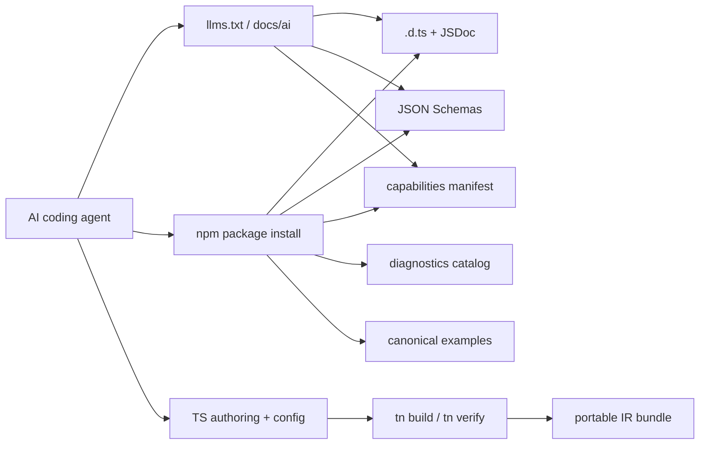
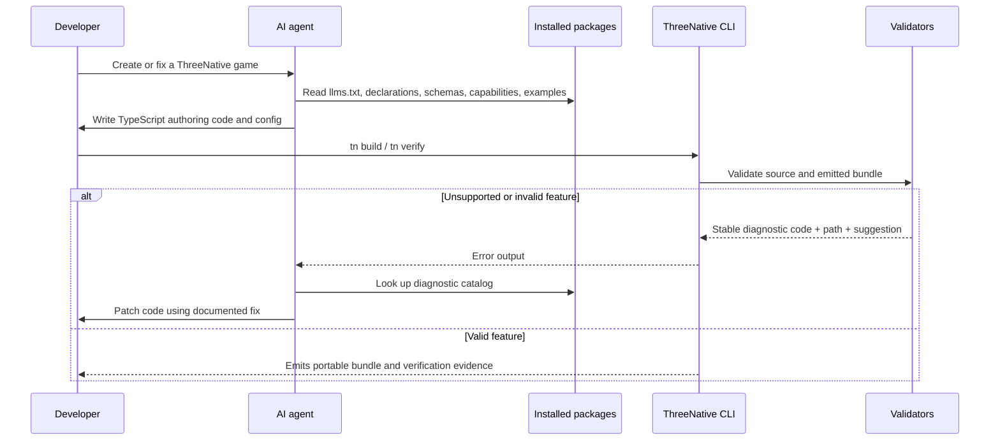

# PRD: AI-Consumable Distribution Contract

Complexity: 9 -> HIGH mode

Score basis: +3 touches 10+ files during future execution, +2 spans multiple
published packages, +2 adds a new distribution support surface, +1 affects
release-gate behavior, +1 adds structured docs and metadata artifacts.

## 1. Context

**Problem:** Installed ThreeNative packages are usable by humans with repo
context, but AI coding agents consuming only the published distribution need a
self-contained, machine-readable contract for APIs, bundle artifacts,
capabilities, diagnostics, and examples.

**Files Analyzed:**

- `AGENTS.md`
- `docs/PRDs/README.md`
- `docs/PRDs/ir-contract-drift-hardening.md`
- `docs/PRDs/artifact-fixture-layout-reorg.md`
- `docs/STATUS.md`
- `package.json`
- `packages/sdk/package.json`
- `packages/ir/package.json`
- `tsconfig.base.json`
- `scripts/verify-distribution-release.mjs`
- `scripts/publish-distribution-release.mjs`

**Current Behavior:**

- Published TypeScript packages expose `types` fields and emit declaration maps
  through the shared TypeScript config.
- `@threenative/ir` already ships `schemas` and exports `./schemas/*`.
- Most packages export only JavaScript entrypoints, not conditional
  `types`-aware export maps for subpaths.
- Canonical examples and verification fixtures exist in the repository, but the
  distribution does not yet define a small shipped example corpus for external
  consumers and agents.
- Diagnostics are implemented across compiler, CLI, runtime, scripts, and
  validators, but there is no generated distribution catalog that an agent can
  inspect without reading source.
- There is no `llms.txt`, AI reference index, or capability manifest that
  states what APIs and IR features an agent should generate or avoid.

## Pre-Planning Findings

No relevant `.env` or runtime configuration files are required for this PRD.

**How will this feature be reached?**

- [x] Entry point identified:
  - npm package install in an external project.
  - IDE/type-server inspection of published `.d.ts` and `.d.ts.map` files.
  - package subpath imports such as `@threenative/ir/schemas/*`.
  - docs entrypoints such as `llms.txt`, `llms-full.txt`, and
    `docs/ai/README.md`.
  - distribution verification through `pnpm verify:distribution` and the guarded
    publish dry run.
- [x] Caller file identified:
  - `scripts/verify-distribution-release.mjs`
  - `scripts/publish-distribution-release.mjs`
  - package `package.json` export maps and `files` lists
  - generated docs/check scripts wired through `pnpm check:docs`
- [x] Registration/wiring needed:
  - Add generated or maintained AI docs artifacts to published package `files`.
  - Add `types` conditions to package export maps where subpaths are public.
  - Add a capability manifest and diagnostics catalog to package exports.
  - Extend distribution verification to install from packed tarballs and assert
    the metadata is present and valid.

**Is this user-facing?**

- [x] YES. This is public SDK distribution work for external developers and AI
  agents that assist them.
- [ ] NO.

**Full user flow:**

1. A developer asks an AI agent to create or modify a ThreeNative game in a
   clean project that has only npm-installed packages.
2. The agent inspects package metadata, TypeScript declarations, schemas,
   capability manifests, diagnostics docs, and examples from the installed
   packages or docs URL.
3. The agent generates TypeScript authoring code and bundle/config JSON that
   stays inside the supported portable contract.
4. If validation fails, the agent maps stable diagnostic codes to documented
   fixes without reading repository source.
5. The developer runs `tn build`, `tn verify`, or release/distribution gates and
   receives the same contract behavior documented in the shipped metadata.

## 2. Solution

**Approach:**

- Treat the npm distribution as the source available to AI consumers: every
  supported public API, artifact shape, diagnostic, and example must be
  discoverable from package contents and exported docs.
- Prioritize TypeScript declarations with JSDoc, JSON Schemas, canonical
  examples, diagnostics, and capabilities over source maps. Source maps and
  declaration maps remain useful debugging aids but are not the primary contract.
- Add an AI docs front door using `llms.txt`, `llms-full.txt`, and a concise
  `docs/ai/` reference that points to package entrypoints, schema IDs, CLI
  commands, diagnostics, and examples.
- Add a versioned capability manifest so agents can generate only supported
  SDK/IR/runtime features and avoid unsupported Three.js, Bevy, or platform
  assumptions.
- Extend distribution verification so missing declarations, schema exports,
  docs artifacts, examples, diagnostics, or capability metadata fail before
  publish.

**Key Decisions:**

- [x] Ship declarations, declaration maps, and JSDoc as the primary public API
  contract.
- [x] Ship JSON Schema files and `$schema` URLs for bundle/config artifacts as
  the primary serialized contract.
- [x] Ship source maps where practical for debugging, but do not rely on them
  for AI comprehension.
- [x] Use maintained/generated Markdown and JSON metadata instead of expecting
  consumers to inspect implementation source.
- [x] Keep Bevy internal: AI docs must tell agents to author TypeScript and IR
  bundles, not Bevy source.
- [x] Unsupported features remain explicit diagnostics, not silent omissions or
  vague docs warnings.

**Data Changes:** No database changes. New distribution artifacts are added:
AI docs files, capability manifests, diagnostics catalogs, public examples, and
package export metadata.

## 3. Sequence Flow

## 4. Execution Phases

#### Phase 1: Distribution Inventory and Export Contract - Contributors can see what each package must ship.

**Files (max 5):**

- `docs/contracts/distribution-contract.md` - document shipped AI/human support artifacts
  and package ownership.
- `docs/PRDs/ai-consumable-distribution-contract.md` - keep phase checklist
  current.
- `docs/PRDs/README.md` - index this current initiative.
- `scripts/check-distribution-contract.mjs` - assert required files/exports in
  package manifests.
- `scripts/check-distribution-contract.test.mjs` - cover missing metadata and
  valid package cases.

**Implementation:**

- [x] Define required published artifacts by package:
  `.d.ts`, `.d.ts.map`, source maps where produced, public schemas, AI docs,
  diagnostics catalog, capabilities manifest, and examples.
- [x] Document which artifacts are package-local versus repo-level docs-site
  artifacts.
- [x] Add a package manifest checker that validates `types`, public `exports`
  type conditions, `files`, and required subpath exports.
- [x] Wire the checker into `pnpm check:docs` or the distribution verifier
  without making regular development builds depend on packed tarballs.

**Tests Required:**

| Test File | Test Name | Assertion |
| --- | --- | --- |
| `scripts/check-distribution-contract.test.mjs` | `should require type declarations and declaration maps for public packages` | Missing `types` or declaration-map output is reported with a stable diagnostic. |
| `scripts/check-distribution-contract.test.mjs` | `should require public schemas diagnostics capabilities and examples to be exported` | Missing subpath exports or `files` entries fail the check. |
| `scripts/check-distribution-contract.test.mjs` | `should accept the current package contract after required metadata is present` | Checker returns no diagnostics for all published packages. |

**Verification Plan:**

1. **Unit Tests:** `node --test scripts/check-distribution-contract.test.mjs`.
2. **Docs Gate:** `pnpm check:docs`.
3. **Evidence Required:** checker diagnostics show package path, missing field,
   and suggested fix.

**User Verification:**

- Action: read `docs/contracts/distribution-contract.md`.
- Expected: a contributor can determine exactly which files a package must ship
  for AI-assisted external usage.

**Progress Evidence:**

- `node --test scripts/check-distribution-contract.test.mjs` - 3 tests passing
  for missing declaration-map/type metadata, planned schemas/capabilities/
  diagnostics/examples export diagnostics, and the current package contract.
- `node scripts/check-distribution-contract.mjs` - current package manifests
  pass the Phase 1 contract after public exports gained explicit `types`
  conditions.
- `pnpm check:docs` - docs consistency passed with the maintained distribution
  contract linked from `docs/contracts/README.md`.
- `pnpm verify:distribution` - packed all public packages, installed them into
  a clean consumer project, built and verified the generated game, built the
  packaged Bevy runtime, and validated the desktop distributable after the
  distribution contract checker passed at gate start.

**Checkpoint:**

- Automated: run the PRD checkpoint reviewer for Phase 1.
- Manual: not required.

#### Phase 2: Typed API Reference Surface - AI agents can infer authoring APIs from installed declarations.

**Files (max 5):**

- `packages/sdk/src/index.ts` and adjacent public SDK modules - add focused
  JSDoc to public authoring APIs.
- `packages/ir/src/index.ts` and exported public IR modules - add focused JSDoc
  to bundle, validation, schema, diagnostics, and capability types.
- `packages/compiler/src/index.ts` - document compiler entrypoints and
  diagnostic behavior.
- `packages/cli/package.json` - expose CLI helper types/docs subpaths if
  public.
- `tsconfig.base.json` - keep declaration/declaration-map/source-map policy
  explicit.

**Implementation:**

- [x] Audit public exports for missing or ambiguous declaration names.
- [x] Add JSDoc that explains intent, accepted values, failure behavior, and a
  minimal example for high-value APIs.
- [x] Replace public `any`/wide `unknown` surfaces where a stable exported type
  already exists.
- [x] Add conditional export maps with `"types"` entries for public package
  root and subpath exports.
- [x] Preserve internal implementation boundaries; do not expose Bevy adapter
  internals as authoring APIs.

**Tests Required:**

| Test File | Test Name | Assertion |
| --- | --- | --- |
| `scripts/check-distribution-contract.test.mjs` | `should require types conditions for every public export` | Public package export maps include a resolvable `types` target. |
| `scripts/verify-distribution-release.test.mjs` or new focused test | `should typecheck a clean consumer project using only installed package declarations` | External fixture imports SDK/IR/compiler APIs without source access. |

**Verification Plan:**

1. **Typecheck:** `pnpm typecheck`.
2. **Distribution Proof:** `pnpm verify:distribution`.
3. **Consumer Fixture:** pack tarballs, install into a temporary project, and run
   `tsc --noEmit` against imports and generated authoring code.

**User Verification:**

- Action: open a clean generated project and inspect imports from
  `@threenative/sdk` and `@threenative/ir` in an editor.
- Expected: completions show documented public APIs and do not require repo
  source to understand basic usage.

**Progress Evidence:**

- `pnpm --filter @threenative/sdk build`,
  `pnpm --filter @threenative/ir build`, and
  `pnpm --filter @threenative/compiler build` - touched public declaration
  emitters compile after JSDoc additions.
- `pnpm verify:distribution` - packed packages install into a clean consumer
  project and now run `tsc --noEmit --project
  tsconfig.threenative-contract.json` against installed declarations and public
  subpaths before creating/building/verifying the sample game.

**Checkpoint:**

- Automated: run the PRD checkpoint reviewer for Phase 2.
- Manual: not required.

#### Phase 3: Schemas, Capabilities, and Diagnostics Metadata - Agents can validate generated JSON and repair failures.

**Files (max 5):**

- `packages/ir/capabilities/threenative.capabilities.json` - supported feature
  manifest with package, IR, runtime, and diagnostic policy metadata.
- `packages/ir/diagnostics/diagnostics.catalog.json` - stable diagnostic code
  catalog.
- `packages/ir/package.json` - export `./capabilities/*` and
  `./diagnostics/*` and include them in `files`.
- `packages/ir/src/diagnosticsCatalog.test.ts` - validate catalog shape and
  coverage for known diagnostics.
- `docs/contracts/diagnostics.md` - link generated or maintained diagnostic details.

**Implementation:**

- [x] Define a versioned capability manifest with supported, partial,
  diagnostic-only, and non-portable feature states.
- [x] Include runtime support fields for web Three.js and native Bevy when a
  feature claim depends on both runtimes.
- [x] Build or maintain a diagnostics catalog containing code, severity,
  message summary, source surface, JSON/source path shape, suggested fix, and
  example rejected input where practical.
- [x] Ensure every exported schema has stable `$id`, version, and package path
  documentation.
- [x] Add validation that known diagnostic codes in tests/docs are present in
  the catalog, while allowing internal verifier-only codes to be explicitly
  classified.

**Progress Evidence:**

- `packages/ir/capabilities/threenative.capabilities.json` defines supported,
  partial, diagnostic-only, and non-portable feature states plus web Three.js
  and native Bevy runtime support fields.
- `packages/ir/diagnostics/diagnostics.catalog.json` documents exact
  high-value diagnostics and explicit public `TN_IR_*` families with severity,
  surface, path shape, suggested fix, and representative rejected input where
  practical.
- `packages/ir/src/diagnosticsCatalog.test.ts` validates catalog shape,
  current IR diagnostic coverage from source/docs, and every exported schema
  document's `$id`, version, schema literal, and package path.
- `scripts/check-distribution-contract.mjs` now requires IR capabilities and
  diagnostics package exports and `files` entries.
- `docs/contracts/diagnostics.md`, `docs/contracts/distribution-contract.md`,
  `docs/STATUS.md`, and `docs/bevy-feature-parity.md` record the promoted
  metadata surface.
- `pnpm --filter @threenative/ir typecheck` - IR package typecheck passed.
- `pnpm --filter @threenative/ir test` - 247 IR tests passed, including the new
  diagnostics catalog and schema metadata tests.
- `node --test scripts/check-distribution-contract.test.mjs` and
  `node scripts/check-distribution-contract.mjs` - distribution contract tests
  and current package manifest check passed.
- `pnpm check:docs`, `pnpm check:names`, and `git diff --check` - docs,
  naming, and whitespace checks passed.
- `pnpm verify:distribution` - packed tarballs include the IR capabilities and
  diagnostics metadata, clean consumer typecheck/build/verify passed, packaged
  native runtime compiled, and desktop bundle validation passed.

**Tests Required:**

| Test File | Test Name | Assertion |
| --- | --- | --- |
| `packages/ir/src/diagnosticsCatalog.test.ts` | `should validate the diagnostics catalog shape` | Every catalog entry has code, severity, surface, summary, and suggested fix. |
| `packages/ir/src/diagnosticsCatalog.test.ts` | `should list public diagnostics referenced by validators and docs` | Missing public diagnostic code fails with the owning source path. |
| `scripts/check-distribution-contract.test.mjs` | `should require capabilities and diagnostics catalogs in the packed ir package` | Packed tarball contains exported catalog files. |

**Verification Plan:**

1. **Unit Tests:** `pnpm --filter @threenative/ir test -- --run diagnostics`.
2. **Distribution Proof:** `pnpm verify:distribution`.
3. **Docs Gate:** `pnpm check:docs`.

**User Verification:**

- Action: import or read
  `@threenative/ir/capabilities/threenative.capabilities.json` and
  `@threenative/ir/diagnostics/diagnostics.catalog.json` from a packed install.
- Expected: the files describe supported features and stable fixes without
  referring to repository source.

**Checkpoint:**

- Automated: run the PRD checkpoint reviewer for Phase 3.
- Manual: not required.

#### Phase 4: Canonical Examples and AI Docs Front Door - Agents have copy-paste workflows and a compact project map.

**Files (max 5):**

- `llms.txt` - compact public AI entrypoint.
- `llms-full.txt` - expanded AI reference index with package, schema,
  diagnostic, and example links.
- `docs/workflows/ai-distribution.md` - maintained AI usage guide and boundary
  rules.
- `examples/ai-reference/README.md` - index canonical distributed examples.
- `packages/cli/package.json` or root packaging metadata - include examples and
  docs in the distributed surface that external users install or generate.

**Implementation:**

- [x] Add `llms.txt` with the minimum stable map: package roles, product
  boundary, authoring flow, schema locations, examples, and diagnostics.
- [x] Add `llms-full.txt` or generated equivalent for richer context that still
  avoids requiring full source access.
- [x] Create a small canonical AI example set:
  simple scene, material/light/camera, ECS component/system, asset manifest,
  validation failure, web preview, and native/distribution verification.
- [x] Ensure examples are runnable from a clean installed or generated project
  and do not depend on repository-only assets.
- [x] Document unsupported boundaries clearly: raw Three.js, raw Bevy authoring,
  runtime-generated game source, and silent fallback behavior are not part of
  the supported authoring model.

**Progress Evidence:**

- `llms.txt`, `llms-full.txt`, `docs/workflows/ai-distribution.md`, and
  `examples/ai-reference/README.md` document the package map, TypeScript-to-IR
  flow, schema/capability/diagnostic metadata, CLI commands, examples, and
  unsupported raw Three.js/raw Bevy/generated-bundle boundaries.
- `packages/cli/scripts/copy-templates.mjs` copies those repo-level AI docs into
  `@threenative/cli` `dist/ai/` during package build.
- `scripts/verify-distribution-release.mjs` verifies the packed CLI install
  contains readable `dist/ai` docs before the clean-consumer typecheck/build/
  verify flow proceeds.
- `node --test scripts/check-ai-docs.test.mjs` validates required public
  package, schema, diagnostic, command, example, and boundary links.

**Tests Required:**

| Test File | Test Name | Assertion |
| --- | --- | --- |
| `scripts/check-ai-docs.test.mjs` | `should include required package schema diagnostic and example links in llms files` | AI docs mention every required public entrypoint. |
| `scripts/verify-distribution-release.test.mjs` or focused distribution test | `should run canonical AI examples from a packed install` | Example build/verify succeeds without repository source paths. |

**Verification Plan:**

1. **Docs Test:** `node --test scripts/check-ai-docs.test.mjs`.
2. **Distribution Proof:** `pnpm verify:distribution`.
3. **Release Dry Run:** `pnpm run deploy -- --dry-run`.

**User Verification:**

- Action: give an AI agent only `llms.txt`, `llms-full.txt`, installed package
  contents, and the canonical examples.
- Expected: the agent can create a valid small ThreeNative game and explain how
  to fix a known validation failure using diagnostic docs.

**Checkpoint:**

- Automated: run the PRD checkpoint reviewer for Phase 4.
- Manual: perform the AI-agent smoke test above because automated checks cannot
  fully prove comprehension quality.

#### Phase 5: Release Gate Enforcement - Missing AI-consumable artifacts block publish.

**Files (max 5):**

- `scripts/verify-distribution-release.mjs` - assert packed tarball contents
  and clean-consumer AI metadata access.
- `scripts/publish-distribution-release.mjs` - keep guarded publish dry run
  dependent on distribution verification.
- `package.json` - add focused check scripts if needed.
- `docs/STATUS.md` - record the implemented AI-consumable distribution contract.
- `docs/bevy-feature-parity.md` - add evidence anchor if capability/release
  tracker requires distribution contract coverage.

**Implementation:**

- [ ] Extend packed-tarball verification to assert declarations,
  declaration maps, source maps where expected, schemas, capabilities,
  diagnostics, AI docs, and examples are present.
- [ ] Validate that clean consumers can import public APIs and read exported
  JSON metadata using package subpaths, not repository-relative paths.
- [ ] Fail release dry runs when any public package omits required AI support
  artifacts.
- [ ] Update `docs/STATUS.md` and `docs/bevy-feature-parity.md` in the same
  implementation change once the release gate is complete.
- [ ] Record evidence paths in the distribution verification report.

**Tests Required:**

| Test File | Test Name | Assertion |
| --- | --- | --- |
| `scripts/verify-distribution-release.test.mjs` | `should fail when a packed package omits AI docs or metadata` | Missing artifact produces a stable distribution diagnostic. |
| `scripts/verify-distribution-release.test.mjs` | `should prove clean consumers can resolve exported schemas capabilities and diagnostics` | Temporary consumer reads files through package exports. |

**Verification Plan:**

1. **Unit Tests:** `node --test scripts/verify-distribution-release.test.mjs`.
2. **Distribution Gate:** `pnpm verify:distribution`.
3. **Release Gate:** `pnpm verify:release`.
4. **Publish Dry Run:** `pnpm run deploy -- --dry-run`.

**User Verification:**

- Action: inspect the packed tarballs or install them into a temporary project.
- Expected: public packages contain the AI docs, declarations, schemas,
  capability metadata, diagnostics catalog, and canonical examples named in this
  PRD.

**Checkpoint:**

- Automated: run the PRD checkpoint reviewer for Phase 5.
- Manual: not required beyond packed-install inspection when release evidence is
  unclear.

## 5. Verification Strategy

- Keep the narrowest checks local: docs/metadata shape tests should run without
  packing tarballs.
- Keep distribution truth in `pnpm verify:distribution`: it must install from
  packed packages and prove external consumers can use only published contents.
- Keep release confidence in `pnpm verify:release` and
  `pnpm run deploy -- --dry-run`.
- Treat missing metadata as a release regression, not documentation drift.
- Include negative tests for missing exports, missing catalog entries, and
  examples that accidentally rely on repository-only paths.

## 6. Acceptance Criteria

- [ ] All public packages expose accurate `.d.ts` files and declaration maps.
- [ ] Public export maps include resolvable `types` conditions for root and
  supported subpath exports.
- [ ] Public JSON Schemas, capability manifests, diagnostics catalogs, AI docs,
  and canonical examples are included in packed tarballs where promised.
- [ ] `llms.txt`, `llms-full.txt`, and `docs/ai/README.md` explain the
  TypeScript-to-IR-to-runtime flow, package map, supported capabilities,
  schemas, diagnostics, examples, and unsupported boundaries.
- [ ] A clean external consumer can typecheck ThreeNative authoring code and
  read exported schema/capability/diagnostic metadata without repository source.
- [ ] Canonical AI examples build and verify from the distributed surface.
- [ ] `pnpm check:docs`, `pnpm verify:distribution`, `pnpm verify:release`, and
  `pnpm run deploy -- --dry-run` pass after implementation.
- [ ] `docs/STATUS.md` and `docs/bevy-feature-parity.md` are updated when the
  release-gate implementation is complete.
