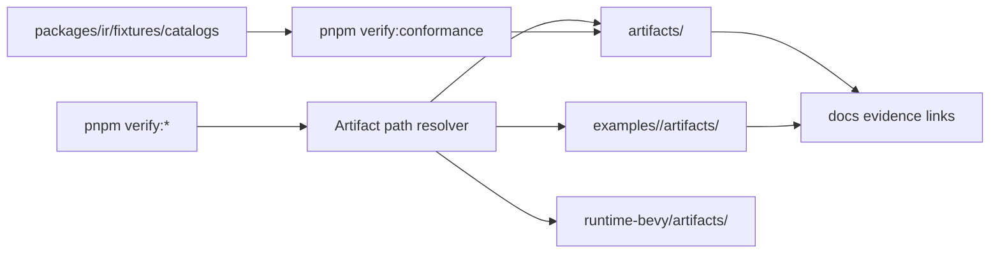
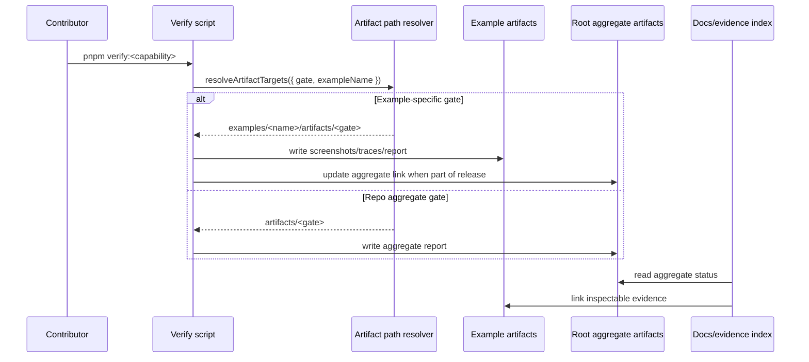

# Reorg PRD: Example-Local Artifacts, Fixtures, and Docs Structure

Complexity: 10 -> HIGH mode

## 1. Context

**Problem:** Generated verification evidence is split between root
`artifacts/*`, example-local `examples/*/artifacts/*`, runtime-specific
`runtime-bevy/artifacts/*`, and template/tmp artifact folders, while fixtures
under `packages/ir/fixtures/*` are shared contract inputs. The docs tree is
also mostly flat, mixing architecture, contracts, runtime, workflow,
verification, and roadmap pages at one level. The mixed layout makes ownership,
cleanup, and evidence discovery unclear.

**Files Analyzed:**

- `AGENTS.md`
- `examples/AGENTS.md`
- `package.json`
- `docs/PRDs/README.md`
- `docs/PRDs/cleanup-versioned-debt.md`
- `docs/STATUS.md`
- `docs/bevy-feature-parity.md`
- `docs/README.md`
- top-level docs such as `docs/architecture.md`, `docs/sdk.md`, `docs/ir.md`,
  `docs/runtime-adapters.md`, `docs/developer-workflow.md`, and
  `docs/verify-v*.md`
- `scripts/verify-conformance.mjs`
- `scripts/verify-v10.mjs`
- `scripts/verify-v9-visual-matrix.mjs`
- `scripts/verify-v6-resource-events-trace.mjs`
- `tools/verify/src/release.ts`
- `tools/verify/src/conformance.ts`
- `packages/ir/src/conformance.ts`
- `packages/ir/src/schema.test.ts`
- `packages/ir/fixtures/conformance/fixture-catalog.json`
- `examples/*/threenative.config.json`

**Current Behavior:**

- Example build bundles already live under each example, usually
  `examples/<name>/dist/<bundle>.bundle`.
- Some visual/playable verification evidence is example-local, for example
  `examples/v7-functional/artifacts/verify/*`, while newer capability gates
  write to root paths such as `artifacts/v10/<capability>/*`.
- Root `artifacts/conformance/*`, `artifacts/release/*`, and
  `artifacts/v*/*` mix aggregate gate reports, cross-runtime diffs, screenshots,
  and historical evidence.
- `packages/ir/fixtures/*` are not examples. They are shared IR contract inputs
  consumed by IR tests, conformance scripts, and Bevy runtime tests.
- `runtime-bevy/artifacts/*`, `templates/*/artifacts/*`, and `tmp/*/artifacts/*`
  exist as additional generated-output surfaces and need explicit ownership.
- Root docs mix unrelated topics at one level. Architecture, SDK/IR contracts,
  runtime adapter docs, workflows, verification/evidence, and status/roadmap
  docs should be grouped contextually.

## Surface Area Inventory

| Surface | Current Examples | Target Policy |
| --- | --- | --- |
| Example bundles | `examples/rendering-lights/dist/rendering-lights.bundle` | Keep in `examples/<name>/dist/*`; this already matches example ownership. |
| Example verification evidence | `examples/v7-functional/artifacts/verify`, `examples/crystal-runner/artifacts/verify` | Standardize on `examples/<name>/artifacts/<gate>/...` for evidence produced by running or inspecting one example. |
| Root aggregate reports | `artifacts/release/verification-report.json`, `artifacts/conformance/verification-report.json` | Keep only repo-level aggregate reports and manifests at root, under stable capability/gate names. |
| Root example-specific evidence | `artifacts/v10/native-ui-effects/*`, `artifacts/v8/camera-views/*`, `artifacts/v9/rendering-lights/*` | Move new output to the owning example's `artifacts/<gate>/`; root reports may link to those paths. |
| Shared IR fixtures | `packages/ir/fixtures/conformance/basic-scene/game.bundle` | Keep under `packages/ir/fixtures`; these are contract fixtures, not example output. Add catalog metadata that records canonical owner, source example when applicable, and regeneration command. |
| Rejected fixtures | `packages/ir/fixtures/rejected/v10-boundaries/catalog.json` | Keep near IR validation because they test schema/validator behavior, not runnable examples. |
| Runtime-native evidence | `runtime-bevy/artifacts/v4/*` | Classify as native adapter evidence. Either keep under `runtime-bevy/artifacts/<gate>/` when Bevy-only, or move under example artifacts when generated from an example bundle. |
| Templates | `templates/v5-game-starter/artifacts/*` | Generated template artifacts should not be committed unless they are intentional template fixtures. Prefer `templates/<name>/fixtures/*` for checked-in inputs and ignore generated `artifacts/*`. |
| Temporary projects | `tmp/simple-game/artifacts/*` | Treat as scratch output; ensure ignored and never referenced by docs or release gates. |
| Docs evidence indexes | `docs/pr-evidence/v10-visual-calibration/README.md` | Keep docs indexes, but link to canonical owner paths instead of copying or inventing separate evidence roots. |
| Docs architecture | `docs/architecture.md`, `docs/concept.md`, `docs/tech-stack.md`, `docs/goals.md` | Move active architecture context under `docs/architecture/` with an index. |
| Docs contracts | `docs/sdk.md`, `docs/ir.md`, `docs/ecs.md`, `docs/ui.md`, `docs/scripting-api.md`, `docs/environment-scene-ir.md`, `docs/diagnostics.md` | Move SDK, IR, schema, diagnostics, and authoring contract docs under `docs/contracts/`. |
| Docs runtime | `docs/runtime-adapters.md`, `docs/runtime-backends.md` | Move web/native runtime context under `docs/runtime/`. |
| Docs workflows | `docs/developer-workflow.md`, `docs/ai-workflows.md`, `docs/conventions.md`, `docs/asset-pipeline.md` | Move contributor and asset workflow docs under `docs/workflows/`. |
| Docs verification and evidence | `docs/verify-v*.md`, `docs/visual-parity-policy.md`, `docs/pr-evidence/*` | Move active verification guidance under `docs/verification/`; archive or label historical milestone verification pages. |
| Docs status and roadmap | `docs/STATUS.md`, `docs/bevy-feature-parity.md`, `docs/ROADMAP.md`, `docs/feature-maturity.md`, `docs/advanced-features-roadmap.md` | Group under `docs/status/`, while keeping `docs/STATUS.md` as a small stable front-door page if needed. |
| Agent instructions | root `AGENTS.md`, `examples/AGENTS.md`, package/runtime nested `AGENTS.md` | Add only short layout rules where they affect local work; avoid duplicating the PRD. |

## Pre-Planning Findings

**How will this reorg be reached?**

- [x] Entry points identified: `pnpm verify:release`,
  `pnpm verify:conformance`, focused `pnpm verify:*` scripts, `tn verify`,
  example `threenative.config.json` `outDir` values, docs front-door links,
  docs evidence links, and fixture catalogs.
- [x] Caller files identified: `package.json`, `scripts/verify-*.mjs`,
  `tools/verify/src/*.ts`, `packages/ir/src/conformance.ts`,
  `runtime-bevy/crates/*/tests/*`, docs under `docs/`, and example configs
  under `examples/*/threenative.config.json`.
- [x] Registration/wiring needed: shared artifact path resolver, gate report
  metadata, fixture catalog ownership fields, docs group indexes, docs link
  updates, AGENTS.md guidance, and temporary compatibility path reads for
  existing evidence.

**Is this user-facing?**

- [x] YES. Contributors and release automation read and generate these paths.
  The public runtime behavior is unchanged, but local workflows, docs links, and
  release evidence paths are user-visible.
- [ ] NO.

**Full user flow:**

1. Contributor runs a focused gate such as `pnpm verify:v10:visual-calibration`
   or its future capability alias.
2. The gate resolves its owning example or aggregate owner.
3. Example-specific screenshots, traces, and reports are written under
   `examples/<name>/artifacts/<gate>/`.
4. Root aggregate reports under `artifacts/<aggregate>/` record links to those
   example-local artifacts.
5. Docs and parity tables point to the aggregate report for gate status and to
   example-local paths for inspectable evidence.
6. Contributor navigates docs through contextual indexes such as
   `docs/architecture/README.md`, `docs/contracts/README.md`,
   `docs/runtime/README.md`, `docs/workflows/README.md`, and
   `docs/verification/README.md`.

## 2. Solution

**Approach:**

- Define a path ownership contract before moving files:
  example-specific output belongs to `examples/<name>/artifacts/<gate>/`,
  repo-level gate summaries belong to `artifacts/<gate>/`, shared contract
  fixtures belong to `packages/ir/fixtures`, and adapter-only evidence belongs
  to the adapter package.
- Add a shared artifact path resolver used by verification scripts and typed
  verify tools so new gates stop hardcoding root `artifacts/v*` paths.
- Keep `packages/ir/fixtures` in place, but enrich the fixture catalog with
  ownership and regeneration metadata instead of moving fixtures into examples.
- Update docs and reports to reference canonical paths while preserving
  temporary compatibility reads for old artifact locations during migration.
- Reorganize docs by context: architecture, contracts, runtime, workflows,
  verification/evidence, status/roadmap, and PRDs.
- Add cleanup checks that reject new example-specific root artifact writes and
  reject checked-in generated artifacts in templates/tmp paths.
- Update root and nested `AGENTS.md` files with short local rules only where
  they change agent behavior.



**Key Decisions:**

- [x] Do not move `packages/ir/fixtures` into examples. They are shared IR
  contract fixtures, not generated example artifacts.
- [x] Do not move `examples/<name>/dist/*` as part of this PRD. Build output is
  already example-local.
- [x] Root `artifacts/*` remains valid for aggregate release/conformance
  reports, but not for one-example screenshots, traces, or per-example
  verification reports.
- [x] Do not delete root `artifacts/`. The target is to shrink it to aggregate
  reports, classified adapter evidence if needed, and archived legacy evidence.
- [x] Historical root artifacts can remain as archive material until a cleanup
  phase removes or relocates them with docs links updated.
- [x] New code should use structured path metadata in reports instead of
  constructing paths with string concatenation at call sites.
- [x] Root docs should become a small front door plus compatibility pages;
  active subject docs should live under contextual folders.

**Data Changes:** None. This is a repository layout and generated artifact
contract change only.

## 3. Sequence Flow



## 4. Execution Phases

#### Phase 1: Layout Contract - Contributors can tell where every artifact belongs.

**Files (max 5):**

- `docs/developer-workflow.md` - add artifact and fixture ownership policy.
- `docs/PRDs/other/artifact-fixture-layout-reorg.md` - mark Phase 1 complete when
  implemented.
- `docs/PRDs/README.md` - keep the current initiative indexed.
- `examples/AGENTS.md` - clarify example-local artifacts and fixture boundary.
- `AGENTS.md` - add the repo-wide canonical layout summary.

**Implementation:**

- [ ] Document canonical paths:
  `examples/<name>/artifacts/<gate>/`, `examples/<name>/dist/*`,
  `artifacts/<aggregate>/`, `packages/ir/fixtures/*`, and
  `runtime-bevy/artifacts/<gate>/`.
- [ ] Define what is checked in versus generated and ignored.
- [ ] Document that fixtures are stable inputs and artifacts are outputs.
- [ ] Document compatibility policy for old `artifacts/v*` paths.

**Tests Required:**

| Test File | Test Name | Assertion |
| --- | --- | --- |
| `scripts/check-docs-layout.test.mjs` | `should document canonical artifact and fixture roots when docs are checked` | Docs mention every canonical root and distinguish fixture inputs from generated artifacts. |

**User Verification:**

- Action: Read `docs/developer-workflow.md`.
- Expected: A contributor can decide where a new visual gate report, screenshot,
  conformance fixture, and Bevy-only report should go without reading old PRDs.

#### Phase 2: Docs Information Architecture - Current docs are grouped by reader intent.

**Files (max 5):**

- `docs/README.md` - replace flat navigation with grouped entry points.
- `docs/architecture/README.md` - architecture/concept index.
- `docs/contracts/README.md` - SDK/IR/diagnostics contract index.
- `docs/runtime/README.md` - web/native runtime index.
- `docs/verification/README.md` - verification/evidence index.

**Implementation:**

- [ ] Create canonical docs groups: `docs/architecture/`,
  `docs/contracts/`, `docs/runtime/`, `docs/workflows/`,
  `docs/verification/`, `docs/status/`, and `docs/PRDs/`.
- [ ] Keep root `docs/README.md` as the main docs front door.
- [ ] Decide whether root `docs/STATUS.md` remains a permanent compatibility
  front door or becomes a forwarding stub to `docs/status/STATUS.md`.
- [ ] Add a docs map that lists old flat paths and their target grouped paths.
- [ ] Fix current PRD index links so grouped PRDs under `docs/PRDs/other/` and
  `docs/PRDs/archive/` resolve.

**Tests Required:**

| Test File | Test Name | Assertion |
| --- | --- | --- |
| `scripts/check-docs-layout.test.mjs` | `should require contextual docs group indexes` | Required docs group README files exist and are linked from `docs/README.md`. |
| `scripts/check-docs-layout.test.mjs` | `should reject broken current initiative PRD links` | Links from `docs/PRDs/README.md` resolve to actual files. |

**User Verification:**

- Action: Open `docs/README.md`.
- Expected: A contributor can jump directly to architecture, contracts,
  runtime, workflows, verification, status, or PRDs without scanning the root
  docs folder.

#### Phase 3: Shared Path Resolver - New gates write to the right owner by default.

**Files (max 5):**

- `tools/verify/src/artifacts.ts` - add resolver and metadata types.
- `tools/verify/src/artifacts.test.ts` - cover owner/path resolution.
- `tools/verify/src/release.ts` - use resolver for aggregate release report.
- `tools/verify/src/conformance.ts` - use resolver for aggregate conformance
  report metadata.
- `tools/verify/src/index.ts` or equivalent export barrel - expose resolver if
  needed by scripts.

**Implementation:**

- [ ] Add `resolveArtifactTargets({ root, gate, owner })`.
- [ ] Support owner kinds: `example`, `aggregate`, `runtime`, and `package`.
- [ ] Return absolute paths for writers and repo-relative paths for reports.
- [ ] Add report metadata fields: `artifactOwner`, `canonicalArtifactDir`,
  `legacyArtifactDirs`, and `linkedArtifacts`.
- [ ] Update typed release/conformance tools first because they are current
  aggregate entry points.

**Tests Required:**

| Test File | Test Name | Assertion |
| --- | --- | --- |
| `tools/verify/src/artifacts.test.ts` | `should resolve example artifact paths under examples when owner is example` | `examples/rendering-lights/artifacts/rendering-lights/verification-report.json` is returned. |
| `tools/verify/src/artifacts.test.ts` | `should resolve aggregate artifact paths under root artifacts when owner is aggregate` | `artifacts/release/verification-report.json` is returned. |
| `tools/verify/src/artifacts.test.ts` | `should include repo-relative canonical paths in metadata` | Metadata never exposes machine-specific absolute paths. |

**User Verification:**

- Action: Run `pnpm build:verify-tools`.
- Expected: Verify tools compile and generated aggregate reports preserve their
  current behavior while recording canonical metadata.

#### Phase 4: Migrate Focused Example Gates - Example-specific evidence moves under examples.

**Files (max 5):**

- `scripts/verify-v8-camera-views.mjs` - write example-local artifacts.
- `scripts/verify-v9-rendering-lights.mjs` - write example-local artifacts.
- `scripts/verify-v9-assets-gltf-scene-workflow.mjs` - write example-local
  artifacts.
- `scripts/verify-v10-visual-calibration.mjs` - write per-example evidence
  under each visual calibration example and aggregate links at root.
- `scripts/verify-v10.test.mjs` or focused script tests - update expected
  paths.

**Implementation:**

- [ ] Migrate one representative gate first and prove old report readers still
  work.
- [ ] For each migrated script, replace hardcoded root example evidence paths
  with the resolver.
- [ ] Keep root aggregate report files for gates that summarize multiple
  examples.
- [ ] Add compatibility reads for existing root evidence during one migration
  window.
- [ ] Update generated report JSON to list both canonical and legacy paths when
  both exist.

**Tests Required:**

| Test File | Test Name | Assertion |
| --- | --- | --- |
| `scripts/verify-v10.test.mjs` | `should require focused reports from canonical example artifact paths` | Missing example-local report fails with actionable diagnostics. |
| `scripts/verify-v9-rendering-lights.test.mjs` | `should write rendering lights evidence under the example artifact directory` | Report path starts with `examples/rendering-lights/artifacts/`. |
| `scripts/verify-v9-assets-gltf-scene-workflow.test.mjs` | `should preserve legacy artifact links during migration` | Report includes canonical and legacy path metadata. |

**User Verification:**

- Action: Run one migrated focused gate, for example
  `pnpm verify:v9:rendering-lights`.
- Expected: Inspectable screenshots/traces/reports appear under the owning
  example's `artifacts/` folder; root artifacts contain only aggregate links or
  summaries.

#### Phase 5: Fixture Catalog Ownership - Shared fixtures remain shared but explain their source.

**Files (max 5):**

- `packages/ir/fixtures/conformance/fixture-catalog.json` - add ownership
  metadata.
- `packages/ir/src/conformance.ts` - parse and expose metadata.
- `tools/verify/src/conformance.ts` - include fixture owner/source metadata in
  reports.
- `scripts/verify-conformance.mjs` - use fixture metadata in diagnostics.
- `packages/ir/src/conformance.test.ts` - cover catalog metadata.

**Implementation:**

- [ ] Add optional fixture metadata fields such as `owner`, `sourceExample`,
  `regenerateCommand`, and `canonicalArtifactGate`.
- [ ] Keep fixture paths stable under `packages/ir/fixtures`.
- [ ] Update conformance reports to identify fixture owners without relocating
  fixture bundles.
- [ ] Add diagnostics for fixtures that claim an example source but reference a
  missing example.

**Tests Required:**

| Test File | Test Name | Assertion |
| --- | --- | --- |
| `packages/ir/src/conformance.test.ts` | `should expose fixture ownership metadata from the catalog` | Catalog entries include owner/source fields when present. |
| `packages/ir/src/conformance.test.ts` | `should keep conformance fixture paths rooted in packages/ir/fixtures` | Fixture resolution does not point into `examples/*/artifacts`. |

**User Verification:**

- Action: Run `pnpm verify:conformance`.
- Expected: Conformance still reads shared fixtures from `packages/ir/fixtures`
  and writes aggregate report metadata that explains fixture ownership.

#### Phase 6: AGENTS.md Layout Guidance - Agents get short local rules without duplicating docs.

**Files (max 5):**

- `AGENTS.md` - add a concise repo-wide layout summary.
- `examples/AGENTS.md` - add example-local artifact rules.
- `packages/AGENTS.md` - add fixture/package-output boundary if relevant.
- `runtime-bevy/AGENTS.md` - add native evidence ownership rule if relevant.
- `docs/PRDs/other/artifact-fixture-layout-reorg.md` - mark phase status when
  implemented.

**Implementation:**

- [ ] Add no more than 5-8 lines to root `AGENTS.md` covering canonical roots:
  root aggregate artifacts, example-local artifacts, shared IR fixtures, and
  contextual docs groups.
- [ ] Keep nested `AGENTS.md` updates local: examples mention
  `examples/<name>/artifacts/`; runtime-bevy mentions native-only evidence;
  packages mention fixtures only if package-local work needs it.
- [ ] Do not paste PRD rationale into AGENTS.md files.
- [ ] Prefer links to the PRD or developer workflow doc over duplicated policy.

**Tests Required:**

| Test File | Test Name | Assertion |
| --- | --- | --- |
| `scripts/check-docs-layout.test.mjs` | `should keep agent layout guidance concise` | AGENTS.md files contain canonical roots without duplicating long PRD sections. |

**User Verification:**

- Action: Read root `AGENTS.md` and `examples/AGENTS.md`.
- Expected: The layout rule is clear in under a minute and points to deeper docs
  instead of bloating agent instructions.

#### Phase 7: Cleanup Gate and Migration Enforcement - New drift is rejected automatically.

**Files (max 5):**

- `scripts/check-current-names.mjs` or a new layout check script - enforce
  artifact layout.
- `scripts/version-name-allowlist.json` or a new layout allowlist - classify
  legacy paths.
- `package.json` - wire the check into `pnpm check:names` or `pnpm check:docs`.
- `scripts/check-artifact-layout.test.mjs` - cover allowed/rejected paths.
- `.gitignore` - ignore generated artifacts in templates/tmp if missing.

**Implementation:**

- [ ] Reject new root `artifacts/<capability>` writes for gates that declare a
  single example owner.
- [ ] Allow root `artifacts/release`, `artifacts/conformance`, and explicitly
  archived historical evidence.
- [ ] Reject checked-in `tmp/**/artifacts/**`.
- [ ] Reject template generated artifacts unless explicitly classified as
  template fixtures.
- [ ] Reject new flat root docs pages unless they are approved front-door or
  compatibility pages.
- [ ] Reject AGENTS.md changes that duplicate long policy blocks instead of
  linking to canonical docs.
- [ ] Add a migration allowlist with removal notes for historical root evidence.

**Tests Required:**

| Test File | Test Name | Assertion |
| --- | --- | --- |
| `scripts/check-artifact-layout.test.mjs` | `should reject example-specific root artifact paths` | `artifacts/v10/native-ui-effects/report.json` is rejected unless allowlisted. |
| `scripts/check-artifact-layout.test.mjs` | `should allow aggregate release and conformance reports` | `artifacts/release/verification-report.json` and `artifacts/conformance/verification-report.json` pass. |
| `scripts/check-artifact-layout.test.mjs` | `should reject tmp artifact paths` | `tmp/simple-game/artifacts/report.json` fails. |
| `scripts/check-docs-layout.test.mjs` | `should reject unclassified flat docs pages` | A new `docs/new-feature.md` fails unless assigned to a docs group or allowlisted. |

**User Verification:**

- Action: Run `pnpm check:names && pnpm check:docs`.
- Expected: Layout drift is reported with canonical destination suggestions.

#### Phase 8: Docs Content and Evidence Link Migration - Current docs point to canonical paths.

**Files (max 5):**

- `docs/STATUS.md` - update current evidence path language.
- `docs/bevy-feature-parity.md` - update evidence anchors.
- `docs/pr-evidence/v10-visual-calibration/README.md` - link canonical
  example artifacts.
- `docs/workflows/asset-pipeline.md` or
  `docs/workflows/developer-workflow.md` - update artifact examples after docs
  moves.
- `docs/PRDs/archive/cleanup-versioned-debt.md` - cross-link this layout policy.

**Implementation:**

- [ ] Replace active docs references to root example-specific artifact paths
  with canonical example-local paths.
- [ ] Keep archive references clearly labeled as historical.
- [ ] Link root aggregate reports only for aggregate status.
- [ ] Update cleanup-versioned-debt to treat artifact layout as the canonical
  path policy for naming cleanup.
- [ ] Move flat docs in small batches with `git mv`, leaving only approved root
  front-door or compatibility pages.
- [ ] Update relative links after every docs move batch.

**Tests Required:**

| Test File | Test Name | Assertion |
| --- | --- | --- |
| Existing docs check tests | `should accept canonical artifact references` | Docs checks pass with example-local evidence paths. |
| Existing docs check tests | `should reject current docs that cite unclassified root example artifacts` | Current docs cannot add new root example-specific evidence paths. |

**User Verification:**

- Action: Open `docs/STATUS.md` and follow one focused visual evidence link.
- Expected: Aggregate status is rooted in `artifacts/<aggregate>/`; inspectable
  per-example evidence is under `examples/<name>/artifacts/<gate>/`.

## 5. Checkpoint Protocol

After each phase:

- Run the phase's narrow tests first.
- Run `pnpm check:docs` for documentation phases.
- Run `pnpm build:verify-tools` for typed verify-tool phases.
- Run `pnpm verify:conformance` for fixture catalog or conformance report
  phases.
- Run the migrated focused gate for any script whose artifact path changes.
- Run `pnpm check:names` before considering the layout migration complete.
- For docs moves, inspect `git diff --name-status` and run `pnpm check:docs`
  before moving to the next docs batch.

When an automated PRD reviewer tool is available, run it after each phase with:

```txt
Review checkpoint for phase <N> of PRD at docs/PRDs/other/artifact-fixture-layout-reorg.md
```

Continue only after reviewer findings are fixed or explicitly deferred in this
PRD.

## 6. Verification Strategy

**Unit Tests:**

- Path resolver tests for every owner kind.
- Fixture catalog metadata parsing tests.
- Layout check tests for accepted and rejected paths.
- Docs layout tests for contextual group indexes, root docs allowlist, and
  resolvable current PRD links.
- Concise AGENTS.md guidance checks where practical.

**Integration Tests:**

- Focused verify-script tests that assert canonical output paths.
- `pnpm verify:conformance` to prove shared fixtures still load from
  `packages/ir/fixtures`.
- `pnpm verify:release` to prove aggregate report links remain valid.
- `pnpm check:docs` after every docs move batch.

**Manual Verification:**

- Run one migrated visual gate and inspect that screenshots/traces are
  example-local.
- Follow docs evidence links from `docs/STATUS.md` or
  `docs/bevy-feature-parity.md`.
- Navigate from `docs/README.md` through every contextual docs group index.
- Read changed AGENTS.md files and confirm they state only local rules plus
  links to deeper docs.

**Evidence Required:**

- [ ] `pnpm build:verify-tools`
- [ ] `pnpm check:names`
- [ ] `pnpm check:docs`
- [ ] `pnpm verify:conformance`
- [ ] At least one migrated focused visual/example gate
- [ ] `pnpm verify:release` after aggregate report migration
- [ ] Docs group indexes and moved docs links verified through `pnpm check:docs`

## 7. Acceptance Criteria

- [ ] Every artifact-producing script has an explicit owner kind: `example`,
  `aggregate`, `runtime`, or `package`.
- [ ] Example-specific screenshots, traces, visual diffs, and focused reports
  generated by current gates are written under `examples/<name>/artifacts/`.
- [ ] Root `artifacts/*` contains only aggregate release/conformance reports,
  explicitly classified adapter evidence, or archived legacy evidence.
- [ ] Root `artifacts/` is not deleted; it is retained as the aggregate/archive
  evidence root with stricter ownership.
- [ ] `packages/ir/fixtures/*` remains the shared location for IR contract
  fixtures, with catalog metadata documenting ownership and regeneration.
- [ ] Docs link to canonical artifact paths and label historical paths as
  archive/legacy.
- [ ] Active docs are grouped under contextual folders for architecture,
  contracts, runtime, workflows, verification/evidence, status/roadmap, and
  PRDs.
- [ ] Root `docs/` contains only approved front-door or compatibility pages.
- [ ] Root and nested `AGENTS.md` files contain concise layout instructions
  where relevant, without duplicating this PRD.
- [ ] Layout checks prevent new unclassified root example artifacts, tmp
  artifacts, generated template artifacts, or unclassified flat docs pages from
  entering the repo.
- [ ] Compatibility reads or aliases exist for old paths during the migration
  window, with removal notes.
- [ ] `pnpm check:names`, `pnpm check:docs`, `pnpm verify:conformance`, and
  `pnpm verify:release` pass after migration.

## Open Questions

- Should old root `artifacts/v*` evidence be moved into an archive directory, or
  should it remain in place but be classified as historical in the layout
  allowlist?
- Should example-local artifact folders be committed for promoted evidence, or
  should generated evidence be ignored and reproduced on demand except for docs
  evidence snapshots?
- Should `runtime-bevy/artifacts/*` remain adapter-local for native-only tests,
  or should native evidence generated from an example always be colocated with
  that example?
- Should fixture regeneration commands be mandatory for every conformance
  fixture, or only for fixtures derived from examples?
- Should `docs/STATUS.md` remain permanently at the root as a compatibility
  front door, or become a short forwarding page to `docs/status/STATUS.md`?
- Should old flat docs paths be kept as stubs for one release window, or should
  internal links move immediately with no compatibility stubs?
