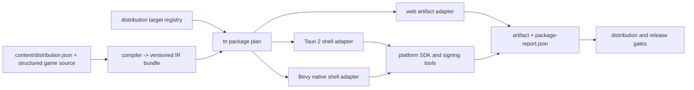
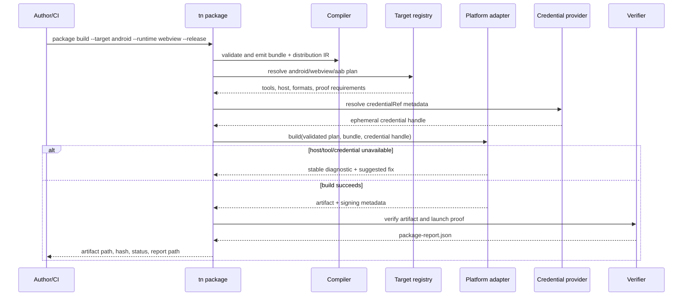

# PRD: Cross-Platform Distribution

`Planning Mode: Principal Architect`
`Complexity: 10 -> HIGH mode`

Score basis: +3 touches more than 10 files; +2 adds a distribution subsystem;
+2 spans IR, compiler, CLI, web runtime, Bevy runtime, templates, verification,
and CI; +1 integrates platform SDKs and stores; +2 coordinates signing,
host-toolchain constraints, and a two-runtime mobile matrix.

## 1. Context

**Problem:** ThreeNative can build web bundles and a desktop Bevy package, but
authors cannot use one supported workflow to produce verified release artifacts
for the web, Windows, macOS, Linux, Android, and iOS/iPadOS.

### Product outcome

An author can declare distribution metadata once, choose a platform and runtime
backend, and receive a deterministic, signed-or-explicitly-unsigned artifact
plus a machine-readable verification report. Mobile supports both:

1. `bevy`: the bundle runs through the native Bevy adapter; and
2. `webview`: the web Three.js build runs inside a Tauri 2 mobile shell.

Tauri is adapter-private. Authors continue to own TypeScript, structured
source, and bundle-local assets; they do not maintain Rust, Gradle, or Xcode
application projects.

### Scope definition

"Major platforms" means:

| Family | Targets | Required release artifacts | Runtime choices |
| --- | --- | --- | --- |
| Web | Modern desktop/mobile browsers, installable PWA | immutable static directory and `.zip` | `web` |
| Windows | x86_64 initially; arm64 after toolchain proof | portable archive and signed installer (`msi` or `nsis`) | `bevy`, `webview` |
| macOS | Apple silicon and Intel/universal where CI permits | signed/notarized `.app` and `.dmg`; App Store bundle is a later channel slice | `bevy`, `webview` |
| Linux | x86_64 initially; arm64 after toolchain proof | tar archive and AppImage; deb/rpm are follow-on formats | `bevy`, `webview` |
| Android | arm64 device plus emulator proof | signed `.aab`; debug/test `.apk` | `bevy`, `webview` |
| iOS/iPadOS | arm64 device plus simulator proof | signed `.xcarchive` and exportable `.ipa` | `bevy`, `webview` |

CPU architecture expansion is evidence-driven. A platform is not "supported"
merely because its toolchain accepts a target triple.

### Files analyzed

- `packages/cli/src/commands/package.ts`
- `packages/cli/src/commands/package.test.ts`
- `packages/cli/src/index.ts`
- `packages/ir/src/types.ts`
- `packages/ir/schemas/target-profile.schema.json`
- `packages/ir/src/contractDrift.test.ts`
- `packages/authoring/src/operations/documents.ts`
- `runtime-bevy/Cargo.toml`
- `tools/verify/src/release.ts`
- `scripts/verify-distribution-release.mjs`
- `docs/contracts/distribution-contract.md`
- `docs/workflows/ai-distribution.md`
- `docs/PRDs/proof-first-engine-loop-2026-07-05/PRD-017-signed-installers-store-packaging.md`
- `docs/PRDs/done/v10/V10-04-production-platform-audio-assets-and-release.md`
- `docs/runtime/native-path.md`
- `docs/STATUS.md`

No release secret is read from a checked-in `.env` file. Implementation must
use the existing project-environment/config loader for non-secret settings and
an explicit credential provider for CI or OS keychain secrets.

### Current behavior

- `tn package` produces desktop packages with `bevy` or a web artifact, but the
  current web path opens a local URL and is not an embedded Tauri application.
- Package preflight recognizes `desktop`, `mobile`, `android`, and `ios`, but
  mobile output is diagnostic-only and reports missing signing credentials.
- Target profiles accept only `web` and `desktop`; mobile platforms and runtime
  backend selection are not durable IR/source contracts.
- `pnpm verify:distribution` covers npm/AI distribution and a limited desktop
  artifact path, not the release matrix in this PRD.
- Signing, notarization, provisioning, store assets, privacy declarations, and
  platform-host restrictions are not represented by one validated descriptor.

### External constraints

- Tauri 2 officially exposes desktop, Android, and iOS build commands and uses
  platform-native web renderers. Its Android path requires the Android SDK,
  NDK, JDK, and Rust mobile targets; iOS builds require macOS and Xcode. See the
  [Tauri prerequisites](https://v2.tauri.app/start/prerequisites/) and
  [distribution guide](https://v2.tauri.app/distribute/).
- Android release artifacts require signing; keystore material must not be
  committed. See [Tauri Android signing](https://v2.tauri.app/distribute/sign/android/).
- iOS distribution requires an Apple bundle identifier, signing certificate,
  and provisioning profile. Signing and device release proof therefore run on
  macOS. See [Tauri iOS signing](https://v2.tauri.app/distribute/sign/ios/).
- The repository's native parity freeze still applies. Bevy mobile promotion
  requires a named shipped-game need, web evidence, native device evidence,
  and a focused gate. This PRD does not silently waive that policy.

## 2. Goals, non-goals, and success measures

### Goals

- One source-owned distribution descriptor for identity, version, presentation
  assets, runtime choice, capabilities, signing references, and channels.
- One registry-derived CLI workflow for plan, build, sign, verify, and inspect.
- Reproducible unsigned builds where platform tools permit, and explicit signed
  release builds without leaking credentials.
- A Tauri 2 shell that packages the emitted web runtime on desktop and mobile.
- Native Bevy Android/iOS shells that consume the same versioned IR bundle.
- Device-level launch, input, rendering, asset, persistence, suspend/resume,
  and orientation evidence for both mobile runtime choices.
- Release reports containing artifact hashes, toolchain versions, source hash,
  target, runtime, architecture, signing state, and proof status.

### Non-goals

- Consoles, visionOS, tvOS, smart TVs, or proprietary SDK integrations.
- A public Tauri API, public Bevy API, or raw platform handles in scripts.
- Cloud hosting, CDN purchasing, store account creation, tax/legal setup, or
  automatic public submission in the initial release.
- Runtime web content loaded from an arbitrary remote origin. The webview shell
  packages the compiled app and bundle locally; allowlisted HTTPS assets remain
  governed by the existing asset/network policy.
- Identical binary size or graphics performance between Bevy and webview.
- Auto-update support before signed base releases and rollback policy are
  proven independently.

### Success measures

- A clean starter can run `tn package plan --project . --matrix release --json`
  and receive every required target/runtime row with host and credential needs.
- Web, Windows, macOS, Linux, Android, and iOS rows each produce a schema-valid
  package report and expected artifact on an eligible CI host.
- Android and iOS each have passing device/simulator evidence for both `bevy`
  and `webview` before the corresponding runtime row is promoted.
- Rebuilding an unsigned artifact from the same source and pinned toolchain
  yields identical content hashes, excluding a documented allowlist of
  platform signing/timestamp fields.
- Secret canaries never appear in stdout, stderr, generated configs, package
  reports, archives, or uploaded CI artifacts.
- `pnpm verify:distribution` and `pnpm verify:release` fail if a promoted matrix
  row lacks current artifact and proof evidence.

## 3. Integration points and user flow

### How will this feature be reached?

- [x] Entry point identified: existing `tn package` command, expanded with
  `plan`, `build`, `verify`, and `inspect` subcommands.
- [x] Caller identified: `packages/cli/src/index.ts` dispatches through the CLI
  registry to `packages/cli/src/commands/package.ts`.
- [x] Registration/wiring identified: package subcommands, structured-authoring
  operation, target registry, compiler bundle entry, template defaults,
  focused distribution gate, and release-gate descriptor.

### Is this user-facing?

- [x] Yes. The primary UI is the JSON-first CLI and generated artifact/report
  directory. No editor UI is required for the first release.
- [x] A later editor panel may call the same authoring operation; it must not
  own a second distribution model.

### Full user flow

1. User runs `tn distribution set app --id com.example.game --name "Example"`
   or supplies equivalent structured JSON.
2. User runs `tn package plan --project . --matrix release --json`.
3. The CLI validates source and bundle, expands the owning target registry, and
   reports host SDK, signing, privacy, store metadata, and proof prerequisites.
4. User runs, for example,
   `tn package build --target android --runtime webview --format aab --release --json`.
5. The CLI builds the web bundle, generates a temporary Tauri shell from the
   pinned template, injects only validated metadata, invokes the platform
   adapter, and writes the artifact plus `package-report.json`.
6. User runs `tn package verify --artifact <path> --target android --runtime webview --json`.
7. CI archives the artifact and report; promoted release gates consume the
   report rather than rediscovering platform state.

The existing flat form (`tn package --bundle ...`) remains a compatibility
alias during one deprecation window and resolves through the same registry.

## 4. Solution

### Approach

- Add `content/distribution.json` as durable structured source and compile it
  to `distribution.ir.json`; keep deployment identity separate from runtime
  performance budgets in `target.profile.json`.
- Put the platform/runtime/format/channel matrix in one exported distribution
  registry. CLI help, validation enums, build dispatch, CI matrix generation,
  documentation tables, and release requirements derive from it. Where JSON
  Schema cannot directly derive, add an explicit drift test.
- Implement a shared package orchestrator with narrow `web`, `tauri`, and
  `bevy-mobile` adapters. Adapters receive validated plans and return reports;
  they do not parse arbitrary user source.
- Generate native shell workspaces under an ignored cache/output directory.
  Durable source remains the ThreeNative project; generated Tauri/Gradle/Xcode
  files are never the source of truth.
- Separate `build`, `sign`, and `verify` states. A successful unsigned build
  must never be described as store-ready.

### Architecture



### Key decisions

- [x] Tauri 2 is the webview packaging backend for desktop and mobile. The
  current localhost/browser launcher is not considered embedded webview proof.
- [x] Mobile runtime is explicit (`bevy` or `webview`); no environment-based
  implicit fallback is allowed in release mode.
- [x] Webview uses local packaged assets and a generated capability allowlist.
  Tauri commands/plugins are deny-by-default and added only by a typed platform
  capability descriptor.
- [x] `appId` is immutable after the first signed release unless the user
  intentionally creates a new product identity.
- [x] Credentials are references, never values, in source or IR.
- [x] Upload/publish is manual initially. A future `--submit` command requires
  a separate explicit approval surface, idempotency design, and audit report.
- [x] Platform support is promoted row-by-row; a generic "mobile supported"
  claim is forbidden if only one runtime or one OS has evidence.

### Data changes

Add a versioned `threenative.distribution` document with this conceptual shape:

```json
{
  "schema": "threenative.distribution",
  "version": "0.1.0",
  "app": {
    "id": "com.example.game",
    "displayName": "Example Game",
    "version": "1.2.3",
    "buildNumber": 42,
    "icons": "assets/distribution/icons",
    "privacyPolicyUrl": "https://example.com/privacy"
  },
  "targets": [
    { "platform": "web", "runtime": "web", "formats": ["static", "zip", "pwa"] },
    { "platform": "android", "runtime": "webview", "formats": ["aab", "apk"] },
    { "platform": "android", "runtime": "bevy", "formats": ["aab", "apk"] },
    { "platform": "ios", "runtime": "webview", "formats": ["xcarchive", "ipa"] },
    { "platform": "ios", "runtime": "bevy", "formats": ["xcarchive", "ipa"] }
  ],
  "signing": {
    "android": { "credentialRef": "ci:android-upload" },
    "apple": { "credentialRef": "keychain:threenative-apple" }
  }
}
```

Validation rules:

- All paths are normalized bundle/project-relative paths with traversal and
  symlink escape checks.
- Runtime/platform/format combinations must exist in the owning registry.
- Reverse-DNS identifiers, versions, build numbers, minimum OS versions,
  orientation, capabilities, icon/splash sizes, and channel metadata receive
  target-specific diagnostics with structured fixes where possible.
- Secrets, passwords, certificate bodies, provisioning profiles, keystores,
  API keys, and private-key paths are rejected from durable source. Only a
  provider-qualified `credentialRef` is accepted.
- Platform capability requests (camera, microphone, network, storage, gamepad,
  vibration) must be declared. Generated Android permissions, iOS entitlements,
  privacy strings, and Tauri capabilities derive from these declarations.

### Package report contract

`package-report.json` must include:

- schema/version, source commit or source hash, bundle hash, artifact hash and
  byte size;
- platform, architecture, runtime, format, release channel, minimum OS;
- tool names and versions, eligible host, clean/dirty source state;
- build status, signing status, signer reference id (never value),
  notarization/provisioning status, and reproducibility exclusions;
- validation diagnostics and reproduction command;
- proof paths for launch, first frame, input, asset loading, suspend/resume,
  persistence, orientation, and runtime-specific parity checks.

## 5. Sequence flow



## 6. Execution phases

Each phase is a user-testable vertical slice and changes at most five files.
After every phase, run the narrow checks and the automated checkpoint protocol
in Section 7 before starting the next phase.

### Phase 1: Distribution source contract - Authors can declare and validate release intent

**Files (max 5):**

- `packages/ir/src/distribution.ts` - types, descriptor registry, validation.
- `packages/ir/src/distribution.test.ts` - accepted and rejected documents.
- `packages/ir/schemas/distribution.schema.json` - serialized schema.
- `packages/ir/src/index.ts` - public IR exports.
- `packages/ir/src/contractDrift.test.ts` - registry/schema enum drift guard.

**Implementation:**

- [ ] Define platforms, runtimes, formats, architectures, capabilities, signing
  references, and channel metadata.
- [ ] Export one registry describing valid combinations, eligible hosts,
  required tools, signability, proof requirements, and promotion state.
- [ ] Reject secret-shaped fields and unsafe paths with stable diagnostics.
- [ ] Keep current target-profile semantics intact; link distribution targets
  to target-profile compatibility during bundle validation.

**Tests required:**

| Test file | Test name | Assertion |
| --- | --- | --- |
| `packages/ir/src/distribution.test.ts` | `should accept android webview and bevy targets when metadata is complete` | both rows normalize deterministically |
| `packages/ir/src/distribution.test.ts` | `should reject unsupported runtime format combinations` | diagnostic names platform/runtime/format and valid choices |
| `packages/ir/src/distribution.test.ts` | `should reject embedded signing secrets` | secret-shaped values never enter normalized IR |
| `packages/ir/src/contractDrift.test.ts` | `should keep distribution schema enums aligned with the registry` | schema and registry cannot drift |

**User verification:** Run `pnpm --filter @threenative/ir test`. A valid dual-
runtime mobile document passes; malformed or secret-bearing documents fail with
actionable JSON diagnostics.

### Phase 2: Structured authoring and compiler wiring - Distribution metadata reaches emitted bundles

**Files (max 5):**

- `packages/authoring/src/operations/documents.ts` - create/update distribution source.
- `packages/authoring/src/operationRegistry.ts` - registry-backed operation.
- `packages/authoring/src/operationRegistry.test.ts` - mutation/idempotency tests.
- `packages/compiler/src/index.ts` - compile and emit `distribution.ir.json`.
- `packages/compiler/src/index.test.ts` - fresh-project emission test.

**Implementation:**

- [ ] Add `distribution.set_app` and `distribution.set_target` operations with
  validate-before-write and idempotent behavior.
- [ ] Emit normalized distribution IR and reference it from the bundle manifest.
- [ ] Verify target-profile compatibility without teaching the compiler about
  platform SDKs.
- [ ] Preserve stable app identity and target ordering.

**Tests required:**

| Test file | Test name | Assertion |
| --- | --- | --- |
| `packages/authoring/src/operationRegistry.test.ts` | `should update one distribution target without replacing siblings` | Bevy and webview rows coexist |
| `packages/authoring/src/operationRegistry.test.ts` | `should be idempotent when distribution metadata is unchanged` | second mutation has no diff |
| `packages/compiler/src/index.test.ts` | `should emit normalized distribution IR into a fresh bundle` | manifest reference and bytes are stable |

**User verification:** Create a starter, run the distribution operations, build
twice, and confirm identical `distribution.ir.json` bytes.

### Phase 3: Registry-derived package planning - Authors can see the complete release matrix before building

**Files (max 5):**

- `packages/cli/src/commands/package.ts` - `plan` subcommand and legacy mapping.
- `packages/cli/src/commands/package.test.ts` - plan and diagnostics tests.
- `packages/cli/src/commands/registry.ts` - package subcommand metadata.
- `packages/cli/src/index.ts` - dispatch through the registered command.
- `packages/cli/src/commands/help.test.ts` - help/registry drift proof.

**Implementation:**

- [ ] Implement `tn package plan --matrix release|declared` with no external
  mutation and compact JSON output.
- [ ] Report each row as `ready`, `missing-tool`, `missing-metadata`,
  `missing-credential`, `wrong-host`, `proof-required`, or `unsupported`.
- [ ] Derive help, allowed flags, and choices from the distribution registry.
- [ ] Map the existing flat desktop flags onto the new build plan with a
  deprecation diagnostic; do not keep a second dispatcher.

**Tests required:**

| Test file | Test name | Assertion |
| --- | --- | --- |
| `packages/cli/src/commands/package.test.ts` | `should plan every promoted target from the distribution registry` | no hand-maintained target list |
| `packages/cli/src/commands/package.test.ts` | `should report ios as wrong-host outside macos` | plan remains successful and actionable |
| `packages/cli/src/commands/help.test.ts` | `should derive package target help from registry metadata` | help cannot drift from dispatch |

**User verification:** `tn package plan --project . --matrix release --json`
prints the full matrix without invoking Cargo, Tauri, Gradle, or Xcode.

### Phase 4: Web/PWA distribution - Authors can ship an immutable hosting-neutral web artifact

**Files (max 5):**

- `packages/cli/src/distribution/web.ts` - static/zip/PWA adapter.
- `packages/cli/src/distribution/web.test.ts` - artifact and negative tests.
- `packages/cli/src/commands/package.ts` - build dispatch integration.
- `packages/runtime-web-three/src/index.ts` - packaged base URL/readiness contract.
- `docs/workflows/release-packaging.md` - web build and deployment handoff.

**Implementation:**

- [ ] Build hashed JS/assets with relative or configured base paths and no dev
  server dependency.
- [ ] Emit `index.html`, bundle assets, optional manifest/service worker, asset
  inventory, integrity hashes, and package report.
- [ ] Verify deep-link/base-path policy, MIME expectations, offline launch for
  PWA, and absence of local absolute paths.
- [ ] Keep hosting provider neutral; document static-directory upload only.

**Tests required:**

| Test file | Test name | Assertion |
| --- | --- | --- |
| `packages/cli/src/distribution/web.test.ts` | `should build a static artifact that launches without the dev server` | ready signal and canvas appear from a local static server |
| `packages/cli/src/distribution/web.test.ts` | `should produce stable hashes for repeated unsigned web builds` | file inventory and hashes match |
| `packages/cli/src/distribution/web.test.ts` | `should reject absolute development URLs in release output` | release build fails before packaging |

**User verification:** Serve the output directory with a generic static server,
load it at root and a configured base path, then run a committed web playtest.

### Phase 5: Tauri shell foundation - The web runtime launches inside a real embedded shell

**Files (max 5):**

- `packages/cli/src/distribution/tauri.ts` - generated-shell adapter.
- `packages/cli/src/distribution/tauri.test.ts` - config and command tests.
- `packages/cli/templates/tauri/Cargo.toml` - pinned generated shell manifest.
- `packages/cli/templates/tauri/tauri.conf.json` - least-privilege base config.
- `packages/cli/templates/tauri/src/lib.rs` - desktop/mobile entry point.

**Implementation:**

- [ ] Generate the shell under `.threenative/cache/distribution/<hash>/tauri`.
- [ ] Point Tauri at Phase 4 output; never start a localhost server in a
  packaged release.
- [ ] Generate Tauri capabilities from declared platform capabilities and deny
  undeclared commands/plugins.
- [ ] Pin Tauri CLI/crates and record versions in reports.
- [ ] Prove regeneration overwrites cache output without touching durable source.

**Tests required:**

| Test file | Test name | Assertion |
| --- | --- | --- |
| `packages/cli/src/distribution/tauri.test.ts` | `should generate the same tauri shell for identical distribution IR` | normalized files are byte-stable |
| `packages/cli/src/distribution/tauri.test.ts` | `should package local web assets without a localhost launcher` | config points to bundled frontend |
| `packages/cli/src/distribution/tauri.test.ts` | `should deny undeclared tauri capabilities` | generated allowlist is minimal |

**User verification:** Build a development shell on the current eligible host,
launch it, and confirm readiness, rendering, input, and asset requests occur
inside the embedded webview.

### Phase 6: Desktop release matrix - Windows, macOS, and Linux artifacts are packageable and verifiable

**Files (max 5):**

- `packages/cli/src/distribution/desktop.ts` - host/format orchestration.
- `packages/cli/src/distribution/desktop.test.ts` - adapter contract tests.
- `packages/cli/src/distribution/signing.ts` - typed credential handles and redaction.
- `scripts/verify-desktop-distribution.mjs` - cross-host report collector.
- `tools/verify/src/gateDescriptors.ts` - focused gate enrollment.

**Implementation:**

- [ ] Route desktop `bevy` builds through the current native builder and
  `webview` builds through Tauri; remove duplicate packaging policy.
- [ ] Produce the required per-OS artifacts and platform signing/notarization
  states from the registry.
- [ ] Fail closed when `--release` requires unavailable credentials; allow an
  explicit `--unsigned` developer artifact with honest status.
- [ ] Run platform artifacts on their native CI hosts and merge reports by
  registry key.

**Tests required:**

| Test file | Test name | Assertion |
| --- | --- | --- |
| `packages/cli/src/distribution/desktop.test.ts` | `should select bevy or tauri without changing authored source` | runtime choice changes adapter only |
| `packages/cli/src/distribution/desktop.test.ts` | `should redact credential canaries from every output surface` | no canary in logs/config/report/archive |
| `scripts/verify-desktop-distribution.test.mjs` | `should require launch evidence from each promoted desktop host` | missing OS row fails the gate |

**User verification:** On each native host, build the platform's release
artifact, install/launch it in a clean environment, and record first-frame plus
input evidence for both promoted runtimes.

### Phase 7: Android webview distribution - A Tauri-wrapped game installs and runs on Android

**Files (max 5):**

- `packages/cli/src/distribution/androidTauri.ts` - Android Tauri invocation.
- `packages/cli/src/distribution/androidTauri.test.ts` - Gradle/config/report tests.
- `packages/cli/templates/tauri/mobile/android.json` - generated Android defaults.
- `scripts/verify-android-webview-distribution.mjs` - emulator/device proof.
- `tools/verify/src/gateDescriptors.ts` - Android webview row enrollment.

**Implementation:**

- [ ] Generate Android package id, SDK levels, orientation, icons, permissions,
  and signing config from validated source.
- [ ] Produce debug APK for proof and signed AAB for release.
- [ ] Exercise touch, keyboard/back behavior, resize/orientation, pause/resume,
  local persistence, audio lifecycle, safe area, and asset loading.
- [ ] Record device/API/GPU/webview versions and app startup diagnostics.

**Tests required:**

| Test file | Test name | Assertion |
| --- | --- | --- |
| `packages/cli/src/distribution/androidTauri.test.ts` | `should derive android permissions only from declared capabilities` | no undeclared permission appears |
| `packages/cli/src/distribution/androidTauri.test.ts` | `should write an aab report with redacted signing metadata` | hash and signer ref are present; secret is absent |
| `scripts/verify-android-webview-distribution.test.mjs` | `should fail when install launch or resume evidence is missing` | all device proof moments are blocking |

**User verification:** Install the APK on the pinned emulator and at least one
physical arm64 device, complete the canonical playtest, background/foreground
the app, rotate where allowed, and confirm persisted state.

**Current checkpoint (2026-07-14):** `NEEDS CORRECTION`. The supported CLI
produces and hashes a current x86-64 APK plus disposable-proof-signed arm64 AAB.
Pinned Android 15 emulator evidence passes install, launch, first frame, touch,
Back, pause/resume, surface resize, safe area, cold-relaunch persistence, and
local assets. The 1280x720 landscape pass keeps the React overlay full-screen,
compacts actions without covering the board, and scales relayed pointer
coordinates between the iframe and parent viewport. A QEMU WAV output capture
now proves non-silent move audio, while
Android audio-service state proves the ambience stops after backgrounding and
starts again after foregrounding. This proof exposed and fixed a web runtime
defect that validated script audio services but discarded them before the sink.
No physical arm64 device is attached. The proof report therefore remains
fail-closed at `partial` and Phase 8 has not started. Fixes crossed the original
five-file estimate because emulator proof exposed runtime persistence,
viewport, script-audio delivery, and generated Tauri lifecycle defects; the
owning contract, compiler, runtime, game source, tests, and status documents
were updated rather than hiding those defects in the proof harness.

**Budget reconciliation:** The original five-file list was a planning estimate
for the Android adapter slice, not a safe cap on proof-driven corrections. Phase
7 now explicitly includes the independently tested runtime audio, overlay input,
chess UI, evidence, and status surfaces named in this checkpoint; Phase 8 stays
gated until the remaining physical arm64 proof passes.

Evidence:

- `examples/chess/artifacts/distribution/android/webview/phase-7-partial-proof-report.json`
- `examples/chess/artifacts/distribution/android/webview/emulator/resize-1280x720.png`
- `examples/chess/artifacts/distribution/android/webview/emulator/cold-relaunch-persistence.png`
- `examples/chess/artifacts/distribution/android/webview/emulator/cold-relaunch-persistence-trace.json`
- `examples/chess/artifacts/distribution/android/webview/emulator/audio-lifecycle-trace.json`
- `examples/chess/artifacts/distribution/android/webview/apk/package-report.json`
- `examples/chess/artifacts/distribution/android/webview/aab/package-report.json`

### Phase 8: iOS webview distribution - A Tauri-wrapped game installs and runs on iOS/iPadOS

**Files (max 5):**

- `packages/cli/src/distribution/iosTauri.ts` - iOS Tauri/Xcode invocation.
- `packages/cli/src/distribution/iosTauri.test.ts` - plist/entitlement/report tests.
- `packages/cli/templates/tauri/mobile/ios.json` - generated Apple defaults.
- `scripts/verify-ios-webview-distribution.mjs` - simulator/device proof.
- `tools/verify/src/gateDescriptors.ts` - iOS webview row enrollment.

**Implementation:**

- [ ] Generate bundle id, deployment target, orientations, icons, privacy usage
  strings, and entitlements from validated declarations.
- [ ] Produce simulator app for proof and signed archive/export artifact for
  release using ephemeral provisioning material.
- [ ] Exercise touch, safe area, resize/orientation, suspend/resume, persistence,
  audio interruption, and local asset loading.
- [ ] Record Xcode/SDK/device/iOS/webview versions in the package report.

**Tests required:**

| Test file | Test name | Assertion |
| --- | --- | --- |
| `packages/cli/src/distribution/iosTauri.test.ts` | `should require a privacy string for every sensitive capability` | missing string yields exact source path and fix |
| `packages/cli/src/distribution/iosTauri.test.ts` | `should keep provisioning material out of generated artifacts` | secret canary scan passes |
| `scripts/verify-ios-webview-distribution.test.mjs` | `should require simulator and signed device report classes` | promotion cannot rely on simulator alone |

**User verification:** Run the canonical scenario in the pinned simulator and
one physical iPhone/iPad class device; verify resume, orientation policy, safe
area, and persistence before exporting the archive.

### Phase 9: Android native Bevy distribution - The same bundle runs through Bevy on Android

**Prerequisite:** Name the shipped game that requires this path and attach its
web gameplay/visual evidence. The native parity freeze must be explicitly
satisfied before promotion.

**Files (max 5):**

- `runtime-bevy/crates/threenative_mobile/Cargo.toml` - Android library target.
- `runtime-bevy/crates/threenative_mobile/src/lib.rs` - mobile lifecycle entry.
- `packages/cli/src/distribution/androidBevy.ts` - shell/build adapter.
- `packages/cli/src/distribution/androidBevy.test.ts` - plan/report tests.
- `scripts/verify-android-bevy-distribution.mjs` - paired device proof.

**Implementation:**

- [ ] Wrap the existing adapter without exposing Bevy handles to authored code.
- [ ] Map Android lifecycle, surface recreation, touch, keyboard, audio focus,
  persistence directories, and asset bundle lookup to portable services.
- [ ] Produce APK/AAB with the same metadata/signing contract as webview.
- [ ] Compare gameplay traces and bounded visual metrics against the canonical
  web evidence; document honest GPU/feature fallbacks.

**Tests required:**

| Test file | Test name | Assertion |
| --- | --- | --- |
| `packages/cli/src/distribution/androidBevy.test.ts` | `should build the bevy android plan from the shared registry` | no second Android metadata model |
| `scripts/verify-android-bevy-distribution.test.mjs` | `should compare canonical gameplay traces with web evidence` | required state/events match within contract |
| `scripts/verify-android-bevy-distribution.test.mjs` | `should survive android surface recreation and resume` | runtime restores a playable frame |

**User verification:** Install on the same Android device class as Phase 7,
run the same committed scenario, background/foreground it, and inspect paired
trace and screenshot evidence.

### Phase 10: iOS native Bevy distribution - The same bundle runs through Bevy on iOS/iPadOS

**Prerequisite:** The native parity freeze evidence from Phase 9 or a separately
named iOS shipped-game need is approved before promotion.

**Files (max 5):**

- `runtime-bevy/crates/threenative_mobile/src/ios.rs` - iOS lifecycle bridge.
- `runtime-bevy/crates/threenative_mobile/tests/ios_contract.rs` - lifecycle tests.
- `packages/cli/src/distribution/iosBevy.ts` - Xcode/build adapter.
- `packages/cli/src/distribution/iosBevy.test.ts` - plan/report tests.
- `scripts/verify-ios-bevy-distribution.mjs` - paired simulator/device proof.

**Implementation:**

- [ ] Map iOS lifecycle, Metal surface changes, touch, safe areas, audio
  interruption, persistence directories, and packaged assets.
- [ ] Produce simulator and signed device/archive artifacts from the shared
  distribution contract.
- [ ] Compare canonical gameplay traces and bounded visual metrics with web.
- [ ] Require physical-device evidence for promotion.

**Tests required:**

| Test file | Test name | Assertion |
| --- | --- | --- |
| `runtime-bevy/crates/threenative_mobile/tests/ios_contract.rs` | `should preserve portable state across ios inactive and active transitions` | lifecycle trace is deterministic |
| `packages/cli/src/distribution/iosBevy.test.ts` | `should generate entitlements from shared capability declarations` | no hand-maintained entitlement list |
| `scripts/verify-ios-bevy-distribution.test.mjs` | `should require paired web and physical ios evidence` | simulator-only report cannot promote |

**User verification:** Install on a physical Apple device, run the canonical
scenario, exercise interruption/resume, and inspect paired web/native evidence.

### Phase 11: Release gate and starter enrollment - Promoted support cannot drift

**Files (max 5):**

- `tools/verify/src/distribution.ts` - registry-driven aggregate gate.
- `tools/verify/src/distribution.test.ts` - missing/stale/duplicate row tests.
- `templates/structured-source-minimal/content/distribution.json` - starter defaults.
- `tools/verify/src/release.ts` - release-gate integration.
- `package.json` - canonical distribution verification scripts.

**Implementation:**

- [ ] Make the aggregate gate enumerate promoted rows from the owning registry.
- [ ] Require current report schema, matching source hash, artifact hash,
  eligible host, signing state, and proof kinds per row.
- [ ] Add a minimal starter descriptor without credentials or store identity.
- [ ] Wire `pnpm verify:distribution` into `pnpm verify:release` only after the
  promoted rows are reliable on required hosts.

**Tests required:**

| Test file | Test name | Assertion |
| --- | --- | --- |
| `tools/verify/src/distribution.test.ts` | `should derive required release rows from the distribution registry` | registry promotion adds a gate row automatically |
| `tools/verify/src/distribution.test.ts` | `should reject stale reports from a different source hash` | old artifacts cannot satisfy release |
| `tools/verify/src/distribution.test.ts` | `should reject unsigned store artifacts` | signing status is blocking where required |

**User verification:** On the release commit, run `pnpm verify:distribution`,
`pnpm verify:conformance`, and `pnpm verify:release`; inspect the aggregate
report and confirm every promoted matrix row links its evidence.

### Phase 12: Distribution documentation - Authors can follow only evidence-backed release paths

**Files (max 5):**

- `docs/status/capabilities/distribution.md` - exact promoted matrix and evidence.
- `docs/STATUS.md` - one-line capability index entry.
- `docs/status/SYSTEMS_CODE_QUALITY_STATUS.md` - new-system architecture/debt status.
- `docs/cookbook/distribution-release.md` - reusable plan/build/verify recipe.
- `docs/contracts/distribution-contract.md` - final source, artifact, and report contract.

**Implementation:**

- [ ] Document only registry rows backed by current package and proof reports;
  keep unproved formats/runtimes in an explicit boundary table.
- [ ] Record the new distribution system and any remaining systemic risk in the
  code-quality status document.
- [ ] Add the reusable CLI recipe and run `pnpm verify:cookbook` because package
  planning/building is a new author workflow.
- [ ] Update the capability index and contract without changing unrelated
  Bevy/native parity claims.

**Tests required:**

| Test file | Test name | Assertion |
| --- | --- | --- |
| `tools/verify/src/docs.test.ts` or current docs checker | `should link every promoted distribution claim to current evidence` | no unsupported matrix row is claimed |
| cookbook verifier | `should validate the distribution release recipe` | commands and metadata match the CLI registry |

**User verification:** Run `pnpm verify:cookbook` and `pnpm check:docs`, then
follow the cookbook from a fresh starter through a web release artifact and
package report.

## 7. Checkpoint protocol

After every phase:

1. Run the phase's narrow unit/integration tests.
2. Run `pnpm typecheck` for TypeScript changes, `cargo test` for the affected
   Rust crate, and `pnpm verify:conformance` for shared runtime-contract changes.
3. Spawn the `prd-work-reviewer` agent with: `Review checkpoint for phase N of
   PRD at docs/PRDs/other/cross-platform-distribution-2026-07-13.md`.
4. Continue only after `PASS`; correct drift and repeat on `NEEDS CORRECTION`.
5. Archive checkpoint evidence under
   `tools/verify/artifacts/distribution/<platform>/<runtime>/`.

Manual verification is additionally required for Phases 4-10 because visual
launch behavior, installers, signing services, emulators, and physical devices
cannot be fully represented by mocked unit tests.

Checkpoint handoff format:

```text
PHASE N COMPLETE - CHECKPOINT
Files changed: <paths>
Narrow tests: <pass/fail and command>
Conformance: <pass/fail/not required and reason>
Automated reviewer: <PASS/NEEDS CORRECTION>
Manual evidence: <artifact/report paths>
Known boundaries: <none or explicit list>
```

## 8. Verification strategy

### Test layers

- **Unit:** registry resolution, schema validation, safe paths, config
  generation, credential redaction, report normalization.
- **Integration:** compiler-to-package-plan wiring, generated shell builds,
  artifact inventories, signing adapters with ephemeral test credentials.
- **Host smoke:** install and launch on clean Windows/macOS/Linux runners.
- **Emulator/simulator:** Android and iOS lifecycle, orientation, input,
  persistence, and local assets.
- **Physical device:** at least one arm64 Android device and one current iOS
  device for every promoted runtime row.
- **Parity:** canonical committed scenario comparing gameplay traces and bounded
  screenshots across web, mobile webview, and mobile Bevy.
- **Security:** archive/config/log canary scans, dependency/license inventory,
  permission/entitlement allowlist, and release-source integrity.

### Required proof moments

Every promoted executable row records:

1. installation succeeds in a clean target environment;
2. app launches and emits the ThreeNative ready signal;
3. first playable frame renders without error diagnostics;
4. pointer/touch, keyboard/controller where declared, and audio work;
5. all bundle-local assets load from the packaged artifact;
6. suspend/resume or close/reopen preserves declared local state;
7. orientation and safe-area policy hold on mobile;
8. uninstall/reinstall behavior matches the documented data policy;
9. artifact signature/provisioning validates for release channels;
10. report hash matches the exact archived artifact.

### CI host matrix

| Host | Blocking work |
| --- | --- |
| Linux | web, Linux Bevy/Tauri, Android emulator/build |
| Windows | Windows Bevy/Tauri installer and launch proof |
| macOS | macOS Bevy/Tauri, notarization, iOS simulator/device/archive |

Cross-compilation may reduce feedback time but cannot replace native-host
installer and launch proof.

### Verification evidence template

```markdown
## Verification Evidence

### <platform>/<runtime>/<format>
- Source hash: `<sha256>`
- Artifact/report: `<paths>`
- Host/toolchain: `<versions>`
- Signing state: `<unsigned|signed|notarized|provisioned>`
- Automated tests: `<command and result>`
- Device/OS/GPU/webview: `<identifiers>`
- Playtest scenario: `<path and result>`
- Checkpoint reviewer: `PASS`
- Manual inspection: `<result and evidence path>`
```

## 9. Security, privacy, and supply chain

- Credential providers expose opaque handles and redacted metadata only.
- Generated signing files live in a restrictive temporary directory and are
  removed after use; cleanup failures are reported.
- CI logs use argument files or stdin where platform tools support them; secret
  values must not appear in process arguments.
- Tauri capabilities, Android permissions, and Apple entitlements are generated
  from one declared capability registry and default to deny.
- Release artifacts include an SBOM/license inventory and hashes for the bundle,
  runtime, generated shell template, and platform dependencies where feasible.
- Release mode rejects a dirty source tree by default; `--allow-dirty` produces
  a non-promotable report.
- Network security policy, privacy manifest/usage strings, data deletion, and
  local-storage behavior are validated before store-ready status.
- Signing and notarization responses are preserved as redacted evidence; raw
  certificates, profiles, keystores, and API keys are not archived.

## 10. Risks and mitigations

| Risk | Mitigation |
| --- | --- |
| Tauri mobile or generated project shape changes | Pin versions; isolate template/adapters; record versions; update through a dedicated dependency PR |
| WebView rendering differs across OS versions | Record webview version; run a supported-device matrix; keep Bevy as an alternative backend |
| Bevy 0.14 mobile lifecycle gaps | Gate each platform behind canonical shipped-game device proof; do not claim generic native mobile support early |
| Signing credentials leak | Opaque providers, canary scans, temp cleanup, redacted reports, no secret values in source/IR |
| Store policy changes | Keep store rules in versioned validators and docs, distinct from portable runtime contracts |
| Matrix cost explodes | Registry promotion states; required smoke tier on every PR; full signed/device tier on release/nightly |
| Two mobile runtimes drift | Same emitted bundle, same scenario, paired trace/visual evidence, explicit row-level capability status |
| Generated native projects become user-maintained forks | Treat shells as disposable cache output and reject edits as source input |
| Existing package work is duplicated | Migrate the existing command and desktop builder behind the shared orchestrator; maintain one compatibility alias only |

## 11. Rollout and migration

1. Land the descriptor and plan command without changing current desktop output.
2. Promote web distribution and Tauri shell generation.
3. Migrate existing desktop Bevy packaging behind the registry and add Tauri
   desktop artifacts.
4. Promote Android/iOS Tauri rows after device evidence.
5. Start Bevy mobile phases only after the native freeze prerequisite is met.
6. Promote store-ready signing rows independently from unsigned developer rows.
7. Deprecate flat `tn package` flags after templates/docs use subcommands and a
   compatibility telemetry window shows no in-repo consumers.

No existing target profile or desktop package becomes invalid merely because a
distribution descriptor is absent. During migration, `tn package plan` may
infer a non-persisted desktop development plan and return a structured fix to
create durable distribution source. Release mode requires the source document.

## 12. Acceptance criteria

- [ ] All twelve phases are complete and all checkpoint reviews pass.
- [ ] Distribution source is versioned, validated, compiled, and reachable via
  bounded structured-authoring operations.
- [ ] CLI help, target choices, dispatch, CI matrix, and release requirements
  derive from one owning registry or have explicit drift tests.
- [ ] Web static/zip/PWA artifacts launch without the development server.
- [ ] Windows, macOS, and Linux have verified native-host artifacts for every
  promoted runtime/format row.
- [ ] Android produces verified APK/AAB artifacts for both Tauri webview and
  Bevy, with physical-device evidence before promotion.
- [ ] iOS produces verified simulator/archive/export artifacts for both Tauri
  webview and Bevy, with signed physical-device evidence before promotion.
- [ ] Tauri webview artifacts package local web output and use deny-by-default
  capabilities; they do not use the current localhost/browser launcher.
- [ ] Every release artifact has a matching report with hashes, tool versions,
  signing state, and required proof links.
- [ ] Unsigned, dirty, simulator-only, wrong-host, stale, or missing-proof rows
  cannot satisfy a promoted release gate.
- [ ] Secret canary scans pass across logs, temp configs, reports, archives, and
  CI artifacts.
- [ ] `pnpm verify:cookbook`, `pnpm verify:conformance`,
  `pnpm verify:distribution`, `pnpm check:docs`, and `pnpm verify:release` pass.
- [ ] `docs/status/capabilities/distribution.md`, `docs/STATUS.md`,
  `docs/status/SYSTEMS_CODE_QUALITY_STATUS.md`, cookbook guidance, and the
  distribution contract reflect only evidence-backed promoted rows.
- [ ] When complete, this PRD is moved to `docs/PRDs/done/`.

## 13. Open decisions before implementation

These do not block the contract/plan phases, but must be resolved before the
named build phase:

- Choose the first Windows installer (`msi` vs `nsis`) from current Tauri
  support and release-channel needs; keep the registry able to add the other.
- Choose whether the first macOS release requires universal binaries or
  separate arm64/x86_64 artifacts based on CI cost and audience evidence.
- Name the canonical shipped game and device matrix that justifies lifting the
  native freeze for Bevy mobile.
- Select minimum Android API and iOS deployment versions from measured runtime,
  graphics, and webview compatibility rather than popularity alone.
- Decide whether App Store/Microsoft Store desktop channels belong in this PRD's
  first execution or a follow-on store-submission PRD after direct-download
  artifacts are stable.
