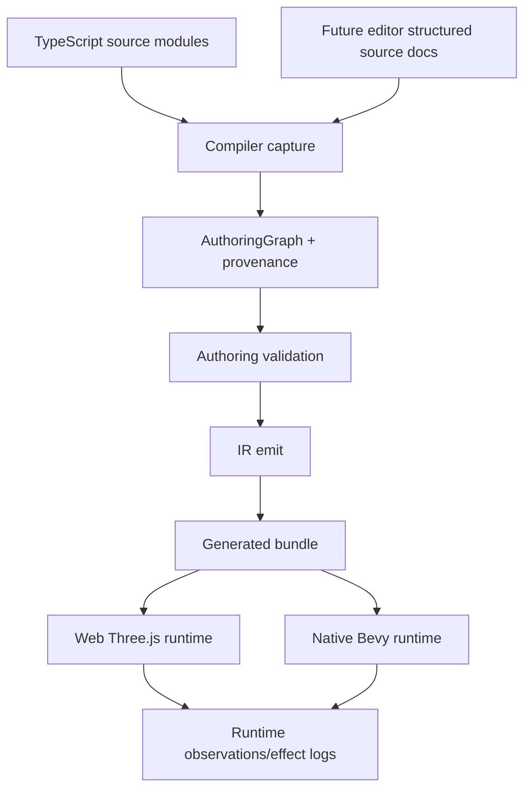

# PRD: Editor-Ready Modular Authoring and Scripting Architecture

Complexity: 13 -> HIGH mode

Score basis: +3 touches 10+ future files, +2 spans SDK/compiler/IR/CLI/web/Bevy/docs/templates, +2 changes authoring source-of-truth boundaries, +2 affects portable scripting and script bundling, +1 affects editor snapshot contracts, +1 affects scene lifecycle/prefab/resource architecture, +1 requires cross-runtime web/Bevy conformance, +1 needs migration of canonical templates/examples.

## 1. Context

**Problem:** ThreeNative can already author playable games in TypeScript and emit portable IR consumed by web Three.js and native Bevy. In practice, non-trivial games are drifting toward one very large `src/game.ts` file that mixes visual scene construction, ECS components/resources/events, systems, input, UI, audio, asset declarations, and procedural content. That is workable for prototypes, but it is not a safe foundation for a future editor.

A future editor cannot safely edit generated ECS/IR and then reconstruct arbitrary TypeScript. It also cannot treat `scripts.bundle.js` or `world.ir.json` as durable source without creating build drift. The architecture needs an explicit modular authoring layer now, before editor work turns generated runtime artifacts into accidental source of truth.

**Goal:** Refactor ThreeNative's authoring architecture so editor-owned scene/entity/prefab/resource data, TypeScript gameplay scripts, generated IR bundles, and live runtime state have strict boundaries. Add an agent-safe authoring surface so AIs do not freehand fragile scene JSON/TypeScript for common edits. The same generated bundle must continue to run in both web Three.js and native Bevy.

**Non-goals:**

- Do not build the full visual editor in this PRD.
- Do not replace TypeScript as the primary gameplay scripting language.
- Do not expose Bevy APIs, Three.js runtime objects, GPU handles, QuickJS handles, or runtime entity handles as public/editor source concepts.
- Do not make generated `dist/game.bundle/*.json` files hand-authored source.
- Do not implement arbitrary TypeScript-to-Rust compilation.
- Do not promise arbitrary Three.js project import/round-trip.
- Do not introduce an editor-only runtime format that bypasses SDK/compiler/IR validation.
- Do not make MCP the primary source of authoring behavior. MCP, if added, must wrap the same core/CLI operations and must not drift into a separate scene-authoring implementation.

**Files analyzed:**

- `AGENTS.md`
- `docs/architecture/architecture.md`
- `docs/architecture/concept.md`
- `docs/contracts/scripting.md`
- `docs/contracts/scripting-api.md`
- `docs/PRDs/README.md`
- `docs/PRDs/done/other/scene-lifecycle-and-flow-contract.md`
- `docs/PRDs/done/v8/V8-00-local-editor-scope-and-contract.md`
- `docs/PRDs/done/v8/V8-01-editor-project-snapshot-and-structured-diffs.md`
- `packages/ir/src/editorProject.ts`
- `packages/sdk/src/game.ts`
- `packages/sdk/src/sceneLifecycle.ts`
- `packages/sdk/src/ecs/World.ts`
- `packages/sdk/src/ecs/system.ts`
- `packages/sdk/src/ecs/commands.ts`
- `packages/compiler/src/capture.ts`
- `packages/compiler/src/emit/bundle.ts`
- `packages/compiler/src/emit/ecs.ts`
- `packages/compiler/src/emit/scene-to-world.ts`
- `packages/compiler/src/emit/systems.ts`
- `packages/compiler/src/scripts/bundle.ts`
- `packages/compiler/src/scripts/diagnostics.ts`
- `packages/runtime-web-three/src/systems/*`
- `runtime-bevy/crates/threenative_runtime/src/systems_*`
- `templates/starter-functional/src/game.ts`
- `templates/starter-functional/src/scenes/arena.ts`
- `templates/v5-game-starter/src/game.ts`
- `templates/v4-scripting/src/game.ts`

**Current behavior:**

- The intended pipeline is already documented as `TypeScript authoring / future editor -> SDK object model and ECS declarations -> compiler extraction and validation -> versioned IR bundle -> runtime adapter -> web preview or native Bevy runtime`.
- `defineGame(...)` composes top-level scene, world, input, UI, audio, environment, scenes, and runtime config.
- `defineScene(...)` models lifecycle scenes and keeps them distinct from the visual `Scene` graph.
- `captureEntry()` now transpiles the relative project graph before importing the entry module, so modular TypeScript imports are supported better than older PRD text suggested.
- The compiler still normalizes captured SDK objects directly into runtime IR documents. It does not yet have a formal authoring graph with provenance, declaration ownership, editor paths, or conflict diagnostics before flattening.
- `World.toJSON()` captures systems by serializing `system.run.toString()`, and `packages/compiler/src/scripts/bundle.ts` emits generated script exports into `scripts.bundle.js`.
- `scenes.ir.json` records lifecycle scene membership, but visual/world content is still merged into global runtime documents.
- V8 editor snapshot work exists, but the current snapshot points at bundle-relative JSON documents. That is useful for inspection and structured diffs, but it is not enough as a durable source model for future editor-owned authoring documents.

## 2. Key Architectural Decision

ThreeNative must have four explicit layers:

```txt
Authoring Source Documents + TypeScript Modules
        ↓
Captured Authoring Graph with Provenance
        ↓
Generated Portable IR Bundle
        ↓
Runtime State in Web Three.js / Native Bevy
```

Only the first layer is durable user/editor source. The second layer is compiler-owned. The third layer is generated and disposable. The fourth layer is live runtime state and never persisted as source unless converted into a validated source patch.

### AI authoring decision

AI scene authoring must not depend on unconstrained raw JSON or giant imperative TypeScript edits for common operations. The durable interface should be:

```txt
@threenative/authoring core library
        ↓
tn scene ... CLI commands       # canonical automation/human/CI interface
        ↓
optional MCP server wrapper     # agent-friendly adapter over the same operations
```

The CLI is the canonical external tool because it is reproducible in CI, shell scripts, Codex/Night Watch, and human debugging. MCP can improve interactive agent ergonomics, but it must call the same authoring core or shell out to `tn scene ... --json`. It must not own separate validation, mutation, or persistence logic.

For common scene edits, AIs should perform typed operations such as `scene.add_entity`, `scene.set_transform`, `scene.set_camera`, `scene.attach_script`, `scene.bind_ui`, `scene.validate`, and `scene.preview/screenshot`, not hand-edit arbitrary document shapes. Raw source document edits remain an escape hatch, but every such edit must pass schema validation, semantic authoring graph validation, compiler validation, and runtime proof before it is accepted.

### Source-of-truth rules

1. **Generated IR is not source.** `world.ir.json`, `systems.ir.json`, `scenes.ir.json`, `assets.manifest.json`, `scripts.bundle.js`, and generated assets are build artifacts.
2. **TypeScript gameplay modules are source.** The editor may reference them, scaffold them, or open them in code mode, but must not reverse-generate arbitrary TypeScript from IR.
3. **Editor-owned data is structured source.** Scene/entity/prefab/resource/input/UI/asset import settings should be schema-versioned structured documents or constrained SDK data declarations that can round-trip deterministically.
4. **Runtime state is session state.** Bevy `Entity`, Three.js object instances, GPU handles, asset loader handles, QuickJS values, computed `GlobalTransform`, and runtime object UUIDs must not appear in saved source documents.
5. **Web and Bevy consume the same generated bundle.** The editor must not introduce a parallel Bevy scene format, raw Three.js serialization path, or editor-only runtime contract.
6. **Authoring mutations must be validated operations.** CLI/MCP/editor mutations must go through one shared authoring core that rejects malformed IDs, missing references, invalid component names, wrong vector sizes, unsupported runtime fields, and web/Bevy-incompatible declarations before writing or compiling.

## 3. Product Model

### Authoring source

Authoring source is the durable project state. It may include TypeScript modules and structured editor documents.

Recommended project shape:

```txt
src/
  game.ts                       # project root; small composition only
  scenes/
    arena.scene.ts              # lifecycle scene declaration
    arena.entities.ts           # data-first entity declarations or JSON import
    arena.prefabs.ts            # prefab declarations/instances
    arena.systems.ts            # system metadata + script refs
    arena.input.ts              # input map declarations
    arena.ui.tsx                # UI authoring or structured UI refs
    arena.audio.ts              # audio declarations
    arena.assets.ts             # asset catalog/import settings refs
  scripts/
    kartArcadePhysics.ts        # gameplay behavior module
  content/
    scenes/arena.scene.json     # future editor-owned structured source
    prefabs/kart.prefab.json
    assets/kenney-roads.asset.json
```

The first implementation does not need to support every JSON document above, but it must establish the contract and migrate canonical templates away from one-file game blobs.

### Captured authoring graph

The compiler should capture source into a richer graph before emitting runtime IR.

The graph must preserve:

- project root path and entry path;
- source module path;
- declaration kind (`project`, `scene`, `entity`, `prefab`, `resource`, `system`, `asset`, `input`, `ui`, `audio`);
- stable declaration ID;
- owning lifecycle scene/module;
- editor metadata where present;
- original file span/source pointer where practical;
- references between declarations;
- provenance for every emitted entity/component/resource/system/material/asset;
- diagnostics for duplicate IDs and conflicting declarations before flattening.

Suggested new compiler modules:

```txt
packages/compiler/src/authoring/graph.ts
packages/compiler/src/authoring/capture-project.ts
packages/compiler/src/authoring/normalize.ts
packages/compiler/src/authoring/provenance.ts
packages/compiler/src/authoring/diagnostics.ts
```

### Generated IR bundle

The generated bundle remains the runtime contract:

```txt
dist/game.bundle/
  manifest.json
  world.ir.json
  scenes.ir.json
  systems.ir.json
  scripts.bundle.js
  scripts.manifest.json      # new or equivalent debug/source map manifest
  ui.ir.json
  input.ir.json
  assets.manifest.json
  materials.ir.json
  target.profile.json
```

The new `scripts.manifest.json` is optional if equivalent metadata lives elsewhere, but the capability is required: map system IDs back to authoring module/export/hash and generated bundle/export.

### Runtime state

Runtime adapters consume generated IR only.

- Web Three.js may map IR to Three.js objects.
- Native Bevy may map IR to Bevy entities/resources/components.
- Neither runtime writes source documents directly.
- Runtime/live preview patches must be classified as source-persistable, hot-reloadable runtime-only, full-reload-required, or rejected.

## 4. Scripting Edge Case: Mandatory Boundary

This is the high-risk part.

Current systems serialize `run(context)` with `Function.toString()` and emit generated JS. That is acceptable as a runtime MVP, but it is not editor-round-trippable. The editor must never treat generated script code as source.

### Required script model

A system declaration has two source pieces:

1. **Structured system metadata** owned by source/editor:
   - stable system ID;
   - schedule/stage;
   - queries;
   - reads/writes;
   - resource reads/writes;
   - event reads/writes;
   - commands;
   - services/capabilities;
   - owner scene/module;
   - script reference.

2. **TypeScript behavior module** owned by code:
   - module path;
   - named export;
   - implementation function;
   - optional helper imports validated by the portable script rules.

Example authoring shape:

```ts
export const kartArcadePhysicsSystem = defineSystemModule({
  id: "system.kartArcadePhysics",
  schedule: "fixedUpdate",
  script: {
    module: "src/scripts/kartArcadePhysics.ts",
    export: "kartArcadePhysics",
  },
  queries: [defineQuery({ with: [VehiclePhysics] })],
  reads: [VehiclePhysics, RivalAI, TrackItem, Transform],
  writes: [VehiclePhysics, TrackItem, Transform],
  resourceReads: [RaceState, MinimapState],
  resourceWrites: [RaceState, MinimapState],
  services: ["ui", "audio"],
});
```

Runtime IR may still contain:

```json
{
  "id": "system.kartArcadePhysics",
  "script": {
    "bundle": "scripts.bundle.js",
    "exportName": "system_kartArcadePhysics"
  }
}
```

But editor/source metadata must retain:

```json
{
  "systemId": "system.kartArcadePhysics",
  "source": {
    "module": "src/scripts/kartArcadePhysics.ts",
    "export": "kartArcadePhysics",
    "hash": "..."
  }
}
```

### Script anti-patterns to reject

The PRD implementation must reject or explicitly diagnose:

- inline script strings inside scene/prefab/resource JSON;
- editing `scripts.bundle.js` as source;
- reverse-generating TypeScript from `systems.ir.json` or generated script exports;
- hidden mutable module state that affects runtime determinism unless a future PRD defines system locals/state explicitly;
- DOM/browser APIs (`window`, `document`, WebGL internals, React DOM, raw Three.js runtime objects);
- Node APIs (`process`, `fs`, `node:*`, `require`);
- dynamic import/import.meta;
- `eval`, `new Function`, arbitrary timers, `requestAnimationFrame`, workers, network APIs, and unsupported async/promise behavior;
- arbitrary npm imports inside portable scripts unless explicitly whitelisted as pure compile-time helpers;
- runtime adapter imports or Bevy/Three internal handles.

### Script validation strategy

Regex diagnostics are not enough for editor-ready scripting.

Required validation:

- AST-based or bundler-plugin analysis for imports, globals, dynamic code, async/timers/network, and hidden module state.
- Stable diagnostics with code, severity, source path, export name, and suggested fix.
- Runtime validation remains defense-in-depth in web and Bevy: undeclared component/resource/event/service/command effects must be rejected before mutation.
- API drift gates must compare SDK types, IR schema/service enums, compiler diagnostics, web host support, Bevy host support, and docs.

## 5. Proposed Solution

### Approach

Add an editor-ready modular authoring architecture that keeps the public TypeScript SDK useful, but makes source ownership explicit.

Do this incrementally:

1. Define source-of-truth policy and authoring graph contracts.
2. Add data-first/module-first SDK declarations that can be owned by an editor later.
3. Add compiler authoring graph/provenance normalization before IR emit.
4. Add source-referenced script modules and a generated script manifest.
5. Update canonical templates to use modular source files.
6. Add web/Bevy conformance gates proving emitted bundles remain portable.



### Key decisions

- Keep `defineGame` and `defineScene` as supported authoring APIs, but make them composition roots, not dumping grounds.
- Do not overload visual `Scene` with lifecycle/editor/project responsibilities.
- Treat current V8 `editorProject` snapshot as an inspection/diff foundation, not the final source document model.
- Add explicit source modules and provenance before changing editor UI.
- Preserve one-file game support as compatibility, but canonical templates must teach modular authoring.
- Require migration diagnostics, not silent behavior changes.

## 6. Execution Phases

#### Phase 1: Source-of-truth contract and architecture docs

**Dependencies:** None.

**Files:**

- Modify: `docs/architecture/architecture.md`
- Modify: `docs/contracts/scripting.md`
- Modify: `docs/workflows/developer-workflow.md` if present and relevant
- Modify: `docs/PRDs/README.md`
- Create/modify docs for editor-ready authoring under `docs/architecture/` or `docs/contracts/`

**Implementation:**

- [ ] Document the four-layer model: authoring source, captured authoring graph, generated IR bundle, runtime state.
- [ ] Explicitly state generated IR is disposable and not editor-owned source.
- [ ] Explicitly state TypeScript scripts are source modules referenced by structured declarations.
- [ ] Document that web and Bevy runtimes consume generated IR only.
- [ ] Document that runtime/live preview edits require validated source patches before persistence.

**Verification:**

```bash
pnpm check:docs
```

Expected: docs gate passes.

**Checkpoint:** João should be able to read the docs and tell where editor persistence belongs and where it does not.

#### Phase 2: Define authoring graph and provenance model

**Dependencies:** Phase 1.

**Files:**

- Create: `packages/compiler/src/authoring/graph.ts`
- Create: `packages/compiler/src/authoring/provenance.ts`
- Create: `packages/compiler/src/authoring/diagnostics.ts`
- Create: `packages/compiler/src/authoring/normalize.ts`
- Modify: `packages/compiler/src/capture.ts`
- Modify: `packages/compiler/src/emit/bundle.ts`
- Test: `packages/compiler/src/authoring/*.test.ts`
- Test: `packages/compiler/src/capture.test.ts`

**Implementation:**

- [ ] Introduce `AuthoringGraph` types for project, scene modules, entities, components, resources, events, systems, assets, input, UI, audio, prefabs, and references.
- [ ] Attach provenance to graph nodes: source module path, declaration ID, declaration kind, owner scene, optional file span.
- [ ] Make capture produce `{ root, graph, diagnostics }` or successor equivalent.
- [ ] Add conflict diagnostics for duplicate IDs before IR flattening.
- [ ] Keep existing one-file authoring path by adapting it into a graph with compatibility provenance.
- [ ] Ensure relative module capture remains supported.

**Tests required:**

- modular scene imports produce graph nodes with source paths;
- one-file `defineGame` still builds;
- duplicate entity/material/system/resource IDs fail with source paths;
- unsupported imports/platform APIs still fail with stable diagnostics;
- graph normalization is deterministic for unchanged source.

**Verification:**

```bash
pnpm --filter @threenative/compiler test -- --run capture
pnpm --filter @threenative/compiler test -- --run authoring
```

Expected: focused compiler tests pass.

#### Phase 3: Add editor-ready modular SDK declarations

**Dependencies:** Phase 2 graph type direction.

**Files:**

- Modify: `packages/sdk/src/game.ts`
- Modify: `packages/sdk/src/sceneLifecycle.ts`
- Modify: `packages/sdk/src/ecs/World.ts`
- Modify: `packages/sdk/src/ecs/system.ts`
- Modify: `packages/sdk/src/prefab.ts`
- Modify: `packages/sdk/src/index.ts`
- Create as needed: `packages/sdk/src/authoring/*.ts`
- Test: `packages/sdk/src/**/*.test.ts`

**Implementation:**

- [ ] Add explicit project/module declaration APIs or data-first builders for scene modules, entities, prefabs, resources, assets, input maps, UI refs, audio refs, and system modules.
- [ ] Keep existing `Scene`, `World`, `defineGame`, and `defineScene` compatibility.
- [ ] Add stable source metadata hooks without exposing runtime handles.
- [ ] Add prefab source references plus structured override declarations.
- [ ] Add resource declarations that map to portable ECS/global config data, not arbitrary runtime objects.
- [ ] Add diagnostics when editor-owned data tries to embed runtime handles or generated paths.

**Tests required:**

- modular declaration APIs produce stable JSON/capture output;
- invalid source IDs or runtime-handle-shaped data is rejected;
- prefab references plus overrides lower deterministically;
- old one-file `World.spawn` examples still work.

**Verification:**

```bash
pnpm --filter @threenative/sdk test
pnpm --filter @threenative/compiler test -- --run authoring
```

Expected: SDK and capture tests pass.

#### Phase 4: Replace fragile script serialization with script references plus generated manifest

**Dependencies:** Phases 2-3.

**Files:**

- Modify: `packages/sdk/src/ecs/system.ts`
- Modify: `packages/compiler/src/scripts/bundle.ts`
- Modify: `packages/compiler/src/scripts/diagnostics.ts`
- Modify: `packages/compiler/src/emit/systems.ts`
- Modify: `packages/compiler/src/emit/ecs.ts`
- Modify: `packages/ir/src/types.ts`
- Modify: `packages/ir/src/validate.ts`
- Create as needed: `packages/ir/schemas/scripts-manifest.schema.json`
- Test: `packages/compiler/src/scripts/*.test.ts`
- Test: `packages/ir/src/systems.test.ts`
- Test: `packages/ir/src/conformance.test.ts`

**Implementation:**

- [ ] Add source-level script reference metadata: module path, export name, content hash, owner system ID.
- [ ] Emit `scripts.manifest.json` or equivalent mapping from system ID to source module/export/hash and generated bundle/export.
- [ ] Prevent generated export name collisions after sanitization.
- [ ] Replace bundle concatenation hazards with one valid generated script module for multi-scene/multi-world projects.
- [ ] Support relative helper imports through a real bundling path or reject them with stable diagnostics; do not leave ambiguous partial support.
- [ ] Add AST-based diagnostics for forbidden imports/globals/dynamic code/hidden mutable module state where practical.
- [ ] Keep runtime IR script refs as generated bundle/export only; source metadata is for diagnostics/editor mapping.

**Tests required:**

- system references `src/scripts/player.ts#movePlayer` and generated manifest points back to it;
- external helper module support or rejection is deterministic;
- `foo-bar` and `foo_bar` export collisions fail;
- multiple scene/world roots with scripts produce one valid `scripts.bundle.js`;
- inline script strings in structured authoring data are rejected;
- generated `scripts.bundle.js` is marked generated/non-source in editor metadata.

**Verification:**

```bash
pnpm --filter @threenative/compiler test -- --run scripts
pnpm --filter @threenative/ir test -- --run systems
```

Expected: script compiler and IR tests pass.

#### Phase 5: Align web and Bevy scripting host contracts

**Dependencies:** Phase 4.

**Files:**

- Modify: `packages/runtime-web-three/src/systems/context.ts`
- Modify: `packages/runtime-web-three/src/systems/runner.ts`
- Modify: `runtime-bevy/crates/threenative_runtime/src/systems_context.rs`
- Modify: `runtime-bevy/crates/threenative_runtime/src/systems_host.rs`
- Modify: `runtime-bevy/crates/threenative_runtime/tests/*`
- Modify: `packages/ir/src/conformance.test.ts`
- Modify: `docs/contracts/scripting-api.md`

**Implementation:**

- [ ] Define a single compatibility matrix for SDK `ISystemContext`, IR service enums/schemas, compiler diagnostics, web host support, Bevy host support, and docs.
- [ ] Add tests that fail when SDK/docs/runtime service support drifts.
- [ ] Ensure web and Bevy reject undeclared component/resource/event/command/service effects before mutation.
- [ ] Define module/local state lifetime policy explicitly and test it in web and Bevy.
- [ ] Add shared conformance fixtures for promoted context services.

**Tests required:**

- SDK `SystemService` and IR/runtime service support agree;
- web and Bevy produce matching canonical effect logs for script refs;
- native QuickJS bridge rejects forbidden ambient APIs or proves they are unavailable;
- module-local state policy is enforced or diagnosed;
- resource/event/component command effects match across web and Bevy.

**Verification:**

```bash
pnpm verify:conformance
cargo test -p threenative_runtime systems --manifest-path runtime-bevy/Cargo.toml
```

Expected: conformance and native runtime system tests pass.

#### Phase 6: Upgrade canonical templates and examples to modular authoring

**Dependencies:** Phases 2-5.

**Files:**

- Modify: `templates/starter-functional/src/game.ts`
- Modify/split: `templates/starter-functional/src/scenes/arena.ts`
- Modify/split: `templates/v5-game-starter/src/game.ts`
- Modify/split: `templates/v4-scripting/src/game.ts`
- Modify: `packages/cli/src/templates/registry.ts` if template metadata changes
- Modify: template README files
- Modify: relevant example smoke tests/gates

**Implementation:**

- [ ] Make `src/game.ts` a small project composition root.
- [ ] Split scene visual composition from ECS components/resources/events.
- [ ] Split systems into `src/scripts/*` plus structured system declarations.
- [ ] Split input/UI/audio/assets/prefabs into named modules.
- [ ] Keep template output beginner-friendly and AI-friendly.
- [ ] Include comments explaining what the future editor owns and what code owns.

**Tests required:**

- `tn create`/`tn init` template smoke builds;
- template validation passes;
- generated bundle has expected scenes/entities/systems/script manifest;
- web visual proof still works;
- native Bevy package/smoke still works when the template claims native support.

**Verification:**

```bash
pnpm verify:smoke
pnpm verify:conformance
```

Expected: smoke and conformance gates pass.

#### Phase 7: Editor snapshot/source document bridge

**Dependencies:** Phases 1-6.

**Files:**

- Modify: `packages/ir/src/editorProject.ts`
- Add tests: `packages/ir/src/editorProject.test.ts`
- Create as needed: `packages/ir/src/editorSourceDocuments.ts`
- Modify docs for editor project/source snapshots

**Implementation:**

- [ ] Clarify whether current `IEditorProjectSnapshot.documents` points to generated bundle docs, source docs, or both with explicit document kinds.
- [ ] Add validation that generated bundle documents are inspectable-only unless marked as source documents.
- [ ] Add structured source patch format with JSON pointer paths, stable IDs, and hot-reload policy.
- [ ] Add diagnostics for attempted source persistence of runtime handles, generated cache paths, computed transforms, or generated script code.
- [ ] Preserve deterministic structured diffs.

**Tests required:**

- source document patches validate and diff deterministically;
- generated bundle docs are inspectable but not source-persistable;
- runtime-only state is rejected;
- live preview edit classification is deterministic.

**Verification:**

```bash
pnpm --filter @threenative/ir test -- --run editor
pnpm check:docs
```

Expected: editor IR tests and docs gate pass.

## 7. Migration Strategy

- Existing one-file games remain supported as compatibility input.
- New canonical templates use modular authoring.
- `tn doctor` should warn, not fail, when a project uses a monolithic `src/game.ts` above a reasonable threshold or with mixed scene/world/script/UI blocks.
- `tn doctor` should suggest a modular structure and link to migration docs.
- The compiler should emit stable diagnostics for editor-unsafe patterns only when a project opts into editor-ready mode, until migration is mature.
- Future `tn migrate authoring-modules` can be planned separately after the source model stabilizes.

## 8. Verification Strategy

Minimum gates for implementation completion:

```bash
pnpm check:names
pnpm check:docs
pnpm --filter @threenative/sdk test
pnpm --filter @threenative/compiler test
pnpm --filter @threenative/ir test
pnpm verify:conformance
pnpm verify:smoke
```

When changes touch native scripting or Bevy runtime mapping, also run focused Rust tests:

```bash
cargo test -p threenative_runtime systems --manifest-path runtime-bevy/Cargo.toml
```

When templates/examples claim visual/runtime behavior, capture proof with the maintained visual gate or `tn screenshot`/`tn verify` artifacts.

## 9. Acceptance Criteria

### Source-of-truth

- [ ] Generated bundle files are documented and tested as disposable build artifacts, not editor-owned source.
- [ ] Editor-owned source documents use stable logical IDs, project/bundle-relative references, schema versions, and deterministic ordering.
- [ ] Saved source documents contain no Bevy entity IDs, Three.js runtime object references, GPU handles, QuickJS handles, computed global transforms, or generated cache paths.
- [ ] Rebuilding from unchanged source emits equivalent bundle artifacts.

### Modular authoring

- [ ] Canonical templates no longer teach one giant `src/game.ts` as the default architecture.
- [ ] Project root, lifecycle scenes, visual/entity declarations, prefabs, ECS declarations, systems, input, UI, audio, and assets can be split into modules.
- [ ] One-file authoring remains supported or has explicit compatibility diagnostics.
- [ ] Duplicate/conflicting source declarations fail with source-path diagnostics before runtime IR emission.

### Scripting

- [ ] Systems can be declared as structured metadata plus TypeScript module/export references.
- [ ] Generated `scripts.bundle.js` is never treated as source.
- [ ] Source-to-generated script mapping is available through `scripts.manifest.json` or equivalent metadata.
- [ ] Relative helper import support is either implemented with real bundling or rejected with stable diagnostics.
- [ ] AST/bundler validation catches forbidden imports/globals/dynamic code and obvious hidden-state hazards better than regex-only diagnostics.
- [ ] Web and Bevy scripting hosts agree on promoted context APIs and effect validation.

### Editor readiness

- [ ] Editor inspection can map runtime/IR entities back to authoring source paths and declaration IDs.
- [ ] Inspector edits are represented as validated structured patches before persistence.
- [ ] Live preview edits are classified as source-persistable, hot-reloadable, full-reload-required, or rejected.
- [ ] Runtime-only changes are never silently saved as source.
- [ ] Inline script strings inside scene/prefab/resource JSON are rejected.

### Web/Bevy parity

- [ ] Web Three.js and native Bevy continue consuming the same generated bundle documents.
- [ ] No public Bevy APIs leak into TypeScript/editor authoring.
- [ ] Scene/system/entity ownership survives graph normalization and is observable in emitted IR or diagnostics.
- [ ] At least one modular multi-scene/gameplay fixture builds, validates, and produces matching web/Bevy conformance observations.

## 10. Risks and Mitigations

- **Risk:** Authoring graph becomes a second IR.  
  **Mitigation:** Keep graph compiler-owned and provenance-rich; runtime adapters never consume it.

- **Risk:** Structured editor documents fight with TypeScript ergonomics.  
  **Mitigation:** Support both; TypeScript can import structured data, and editor-owned data references scripts rather than replacing them.

- **Risk:** Scripting validation becomes too restrictive.  
  **Mitigation:** Start with explicit editor-ready mode and stable diagnostics; keep compatibility mode for existing prototypes.

- **Risk:** Web and Bevy script hosts drift.  
  **Mitigation:** Add service/API compatibility matrix tests and conformance fixtures for every promoted host API.

- **Risk:** Templates become too complex for beginners.  
  **Mitigation:** Keep root composition small, name modules clearly, and document the ownership model with short comments.

## 11. Open Questions

- Should structured source documents live under `src/content/` or a top-level `content/` directory?
- Should editor source documents be TypeScript data declarations first, JSON first, or support both through a single schema?
- Should `AuthoringGraph` live in `packages/compiler` only, or should a stable subset be exported from `@threenative/ir` for editor tooling?
- How much source-span/AST mapping is required in the first implementation for useful editor selection and diagnostics?
- Should hidden mutable module state be fully rejected immediately, or gated behind an explicit future `system locals` contract?

## 12. PRD Completion Checklist

- [ ] Architecture docs updated with source/generated/runtime boundaries.
- [ ] Authoring graph and provenance implemented with tests.
- [ ] Modular SDK authoring APIs implemented with compatibility path.
- [ ] Script references and generated script manifest implemented.
- [ ] Web/Bevy scripting host conformance updated.
- [ ] Canonical templates migrated to modular structure.
- [ ] Editor snapshot/source document bridge clarified.
- [ ] Docs/index updated and gates passing.
