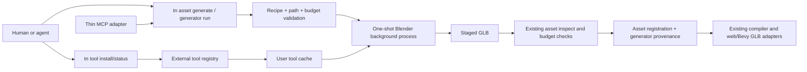

# Optional Headless Blender Asset Generation

Complexity: 10 -> HIGH mode

## Complexity Assessment

- +3 touches 10+ CLI, authoring, MCP, test, workflow, and status files
- +2 adds a new external-tool acquisition and execution module
- +2 requires download/install concurrency, atomic cache state, and process
  lifecycle control
- +2 spans `@threenative/cli`, `@threenative/authoring`, MCP, docs, and proof
- +1 integrates official Blender downloads and its versioned Python API

Every implementation phase has an automated checkpoint. External download,
cross-platform execution, and generated-model quality phases also require the
manual evidence called out below.

## Context

**Problem:** ThreeNative agents can source or import GLBs and can author runtime
primitives, but they cannot create reusable, styled 3D asset files on demand
through a bounded CLI operation without requiring users to preinstall a DCC.

**Files Analyzed:**

- `AGENTS.md`
- `packages/cli/package.json`
- `packages/cli/src/index.ts`
- `packages/cli/src/commands/registry.ts`
- `packages/cli/src/commands/asset.ts`
- `packages/cli/src/commands/assetImport.ts`
- `packages/cli/src/commands/sourceGeneratorCommand.ts`
- `packages/cli/src/commands/generator.test.ts`
- `packages/authoring/src/operationRegistry.ts`
- `packages/authoring/src/operations/documents.ts`
- `packages/authoring/src/operations/sharedA.ts`
- `packages/authoring/src/schemas.ts`
- `packages/authoring/src/sourceKinds.ts`
- `packages/mcp-server/src/index.ts`
- `packages/mcp-server/src/index.test.ts`
- `docs/contracts/authoring-source-documents.md`
- `docs/contracts/authoring-mcp.md`
- `docs/contracts/ir.md`
- `docs/workflows/asset-pipeline.md`
- `docs/workflows/open-source-3d-asset-kits.md`
- `docs/status/capabilities/assets.md`
- `docs/status/SYSTEMS_CODE_QUALITY_STATUS.md`
- `tools/spikes/blender-headless/*`
- Blender 4.5 command-line, glTF, download, checksum, and license sources
- BlenderMCP README, add-on, MCP server, and current headless guard

**Current Behavior:**

- `tn asset import` converts supported external assets and registers normal
  project-local assets; `assimpjs` is optional but dependency installation is
  left to the CLI environment.
- `tn generator record/run` owns durable one-way generator provenance, hashes,
  output conflict policy, and execution of project-local TypeScript generators.
- Generated assets can carry deterministic generator parameters in the asset
  manifest, but no external modeling provider is wired into authoring.
- The MCP server is intentionally a thin adapter over authoring/CLI operations
  with project-root and generated-source guards.
- The spike proved that an explicitly downloaded Blender 4.5.11 LTS runtime can
  execute a bounded background job, emit a valid GLB, and pass `tn asset
  inspect` without diagnostics.
- Current BlenderMCP explicitly refuses Blender background mode and exposes
  arbitrary Python, so it does not meet the execution or security boundary.

## Product Decision

Promote Blender as an **optional authoring provider**, not a runtime dependency
and not an MCP-owned engine.

```txt
tn tool install blender --accept-download --json

tn asset generate prop.crate \
  --provider blender \
  --recipe content/generators/prop.crate.recipe.json \
  --out assets/generated/prop.crate.glb \
  --json
```

The install command is the only command allowed to download Blender. Generation
without an installed or explicitly configured executable fails with a stable
diagnostic and an exact install fix. A successful generation records durable
provider/recipe provenance, emits and inspects a normal GLB, and registers the
asset through the existing structured asset operation.

Natural-language interpretation is outside the CLI contract. Humans, agents,
and MCP clients produce a versioned bounded recipe. ThreeNative validates and
executes that recipe; it never accepts raw Python or a backend handle.

## Goals

- Let users opt into Blender without increasing the published CLI package by
  hundreds of megabytes.
- Generate useful stylized props and modular environment pieces from validated,
  repeatable structured recipes.
- Reuse existing generator provenance, output conflict, asset registration,
  inspection, model-test, compiler, and web/native GLB paths.
- Give agents one discoverable CLI/MCP operation with stable JSON diagnostics,
  file paths, bounds, counts, hashes, tool version, and next proof commands.
- Reproduce at least 80% of BlenderMCP's useful tool outcomes through safe,
  registry-backed ThreeNative equivalents; v1 targets 19 of 22 tools (86%).
- Add provenance-first Poly Haven and Sketchfab discovery/import plus one
  optional text/image model-generation provider workflow without routing
  credentials or network downloads through Blender.
- Support pinned official Blender artifacts on Linux x64, macOS x64/arm64, and
  Windows x64; treat Windows arm64 as follow-on until the Node/CLI support
  matrix promotes it.
- Keep tool acquisition atomic, checksum-verified, concurrency-safe,
  auditable, removable, and outside project source and npm package contents.
- Bound process time, recipe complexity, output size, mesh/material counts, and
  project paths so an agent cannot turn asset generation into general host code
  execution.

## Non-Goals

- No raw Python, Blender add-on installation, `.blend` auto-execution, arbitrary
  Blender operators, or user-provided Blender scripts.
- No requirement for Blender in `tn build`, `tn dev`, runtimes, generated game
  packages, or users who consume already generated GLBs.
- No claim of unrestricted text-to-3D, artist-quality characters, sculpting,
  rig generation, motion capture, or photoreal asset creation.
- No persistent Blender process, GUI automation, Xvfb, TCP socket, or adoption
  of BlenderMCP as a production dependency.
- No remote recipe URLs. Poly Haven, Sketchfab, and generated-model network
  integrations use separate provider descriptors, explicit calls, credential
  guards, license/provenance capture, and staged asset inspection; they are not
  Blender recipe fields or Blender-side HTTP requests.
- No Hunyuan generate/poll/import adapter in v1. The generic provider registry
  must report it honestly as unsupported until a separate credential, API,
  archive-security, and terms review promotes it.
- No byte-for-byte reproducibility claim across different Blender versions or
  host platforms. Provenance makes the producing version explicit.
- No Blender binary redistribution in the npm package or generated project.
- No editor visual modeling UI in the initial implementation. The editor may
  call the same operation after the CLI/core path is proven.

## BlenderMCP Feature Adoption Contract

### Inspected Upstream Surface

Source inspection of BlenderMCP commit
`6e99eb5a442b83766a5796975ec7bb5bfc791341` found 22 MCP tools. The owning
evidence and handler notes are in
`docs/audits/blender-headless-cli-spike-2026-07-13.md`.

This PRD measures **functional outcome coverage**, not copied signatures or
code. A row counts only when a user can reach an equivalent outcome through a
tested CLI/core operation and the thin MCP adapter returns the same structured
result. Deliberately safer behavior is labeled `safe-replacement`.

| # | BlenderMCP tool | ThreeNative equivalent | Phase | Target |
| --- | --- | --- | --- | --- |
| 1 | `get_scene_info` | `asset inspect` scene summary | 4 | Full |
| 2 | `get_object_info` | named GLB node/object inspection | 4 | Full |
| 3 | `get_viewport_screenshot` | headless model-test/render evidence | 4 | Equivalent |
| 4 | `execute_blender_code` | bounded modeling-operation registry | 2-4 | Safe replacement |
| 5 | `get_polyhaven_categories` | provider/catalog categories | 5 | Full |
| 6 | `search_polyhaven_assets` | provider/catalog search | 5 | Full |
| 7 | `download_polyhaven_asset` | staged provenance-first model/texture/HDRI import | 5 | Full |
| 8 | `set_texture` | material texture-set assignment and recipe reference | 5 | Equivalent |
| 9 | `get_polyhaven_status` | provider status | 5 | Full |
| 10 | `get_hyper3d_status` | model-provider status | 7 | Full |
| 11 | `get_sketchfab_status` | provider/account status | 6 | Full |
| 12 | `search_sketchfab_models` | downloadable model search with license/faces | 6 | Full |
| 13 | `get_sketchfab_model_preview` | preview artifact and MCP image | 6 | Full |
| 14 | `download_sketchfab_model` | staged import plus meter-scale normalization | 6 | Full |
| 15 | `generate_hyper3d_model_via_text` | optional text model job | 7 | Full |
| 16 | `generate_hyper3d_model_via_images` | project-local image model job | 7 | Full |
| 17 | `poll_rodin_job_status` | normalized provider job polling | 7 | Full |
| 18 | `import_generated_asset` | staged GLB import/cleanup/inspect/register | 7 | Full |
| 19 | `get_hunyuan3d_status` | generic provider status reports unsupported/configuration | 7 | Equivalent |
| 20 | `generate_hunyuan3d_model` | none in v1 | follow-on | Deferred |
| 21 | `poll_hunyuan_job_status` | none in v1 | follow-on | Deferred |
| 22 | `import_generated_asset_hunyuan` | none in v1 | follow-on | Deferred |

V1 target: **19/22 rows = 86.4% outcome coverage**. The denominator remains
all upstream tools, including unsafe arbitrary code; coverage must not be
inflated by removing rejected rows. If the implementation cost and official
API/terms review for Hunyuan become small after Phase 7, its three deferred rows
may be added through the provider registry. They are not required to ship v1.

**Full-copy reassessment rule:** at the Phase 7 checkpoint, rescope Hunyuan
against the completed provider abstraction. Promote rows 20-22 into a bounded
Phase 7B and target 22/22 only if all three can fit one <=5-file vertical slice,
reuse the same credential/job/download/import contracts, use an officially
documented safe GLB path, and add no new archive, executable, local-server, or
terms/security boundary. Current source inspection does **not** satisfy that
rule: it adds Tencent request signing, official/local API modes, remote ZIP
download/extraction, and OBJ/MTL import. Therefore the planned scope is 19/22,
not full adoption. This rule prevents both premature scope inflation and
permanent deferral after the shared framework makes the work genuinely small.

### Asset-Creation Strategy Prompt Parity

BlenderMCP also owns an `asset_creation_strategy` MCP prompt. It is not counted
as a tool, but v1 must adapt its useful policy into descriptor-derived MCP
instructions, `tn game plan`, and cookbook guidance:

1. Inspect project/scene/asset/provider status before mutation.
2. Capture a baseline when modifying an existing asset or scene.
3. Search the shipped reviewed catalog first.
4. Prefer reviewed existing models; use Poly Haven for generic models,
   textures, and HDRIs and Sketchfab for specific downloadable models after
   license/preview review.
5. Use the optional model provider only for one unique item and require an
   explicit paid/external call acknowledgement; never generate the whole scene,
   ground, or fragmented parts as separate paid jobs by default.
6. Poll/import explicitly, inspect combined world bounds, normalize intended
   real-world scale, ground the pivot, and check clipping.
7. Reuse accepted generated assets instead of resubmitting identical jobs.
8. Use bounded procedural Blender recipes when a simple custom object is more
   reliable than sourcing/generation.
9. Finish with inspection, model-test visual evidence, authoring validation,
   and build proof.

ThreeNative intentionally diverges from the upstream prompt by prohibiting raw
Python fallback and by making license/provenance, project-root inputs, provider
cost acknowledgement, and offline-after-acquisition proof mandatory.

### Bounded Modeling Vocabulary

BlenderMCP relies on `execute_blender_code` for most ordinary modeling. To
preserve that value safely, the recipe/operation registry must cover:

- object create, delete, duplicate, rename, join, selection groups, parenting;
- transforms, finite dimensions, origin/pivot normalization, grounding, and
  target-size normalization;
- cube, sphere, cylinder, cone, torus, plane, and curve/text only after their
  geometry/format budgets are defined;
- PBR material create/update/assign with base color, metallic, roughness,
  emissive, alpha mode, double-sided state, and registered texture-set inputs;
- bevel, mirror, array, boolean, solidify, triangulate, weighted normals, and
  smooth/flat shading through an explicit descriptor allowlist;
- camera pose/target and bounded studio-light/environment setup used only for
  generation proof, not emitted as an implicit game scene;
- GLB import/export, hierarchy cleanup, named-node preservation, bounds/count
  inspection, and LOD/collision-proxy outputs when explicitly requested.

Every verb must declare its JSON schema, runner handler, budget effect,
diagnostics, CLI/MCP exposure, and tests in one owning descriptor or be guarded
by an explicit drift test. Raw Blender operator names are not public API.

### Provider Boundary

- Poly Haven and Sketchfab search/download occur in Node/CLI provider adapters,
  not Blender Python. Downloads are staged, hash/size checked where the provider
  supplies evidence, licensed/provenance-recorded, inspected, then registered.
- Texture/HDRI application uses ThreeNative material/environment source
  operations and recipe asset IDs. Blender receives only resolved project-local
  inputs.
- Hyper3D/Rodin uses an optional provider job adapter with credential-safe
  status, explicit text/image submission, polling, and staged GLB import.
- Provider calls never happen during `tn build`, Blender install, recipe
  validation, status for unrelated providers, or runtime loading.
- Provider terms, pricing acknowledgement, rate limits, supported input rights,
  retention, and generated-output license must be reviewed from official docs
  before its descriptor changes from experimental to supported.
- Hunyuan remains a registry-visible unsupported provider in v1. Do not copy
  Tencent signing, local API URLs, remote ZIP extraction, or OBJ import from
  BlenderMCP without a separate security and official-source review.

## Integration Points

**How will this feature be reached?**

- [x] Entry points identified: `tn tool status|install|remove blender`, `tn
  generator record/run`, and the asset-focused `tn asset generate` convenience
  surface; provider discovery/import uses `tn asset provider
  status|categories|search|preview|download|generate|poll|import`.
- [x] Caller files identified: `packages/cli/src/index.ts` dispatches the tool
  family; the existing `assetCommand` and `generatorCommand` call a shared
  Blender generator service.
- [x] Registration/wiring needed: top-level command registry, one external-tool
  manifest, generator provider descriptor, authoring operation descriptor,
  asset/provider subcommand registry/help, MCP adapter metadata, upstream
  feature-coverage registry, and focused gates.

**Is this user-facing?**

- [x] YES. Authors install an optional tool and receive project-local GLB assets
  plus structured provenance. There is no runtime/player UI.
- [ ] NO.

**Full user flow:**

1. User or agent runs `tn tool status blender --json` and sees source, pinned
   version, download size, cache location, license, and readiness without any
   mutation or network request.
2. User explicitly runs `tn tool install blender --accept-download --json`.
3. CLI downloads the exact host artifact to staging, verifies SHA-256, extracts
   it, validates `blender --version`, and atomically promotes the install.
4. User or MCP client submits an asset ID and versioned recipe to `tn asset
   generate ... --provider blender --json`.
5. CLI validates source/output paths and recipe budgets, records/updates the
   existing generator provenance document, and applies overwrite policy.
6. CLI runs the repository-owned Python runner once with Blender background,
   factory startup, auto-execution disabled, a timeout, and a minimal environment.
7. Runner emits a staged GLB; CLI verifies the exit code, hashes the output,
   moves it into `assets/generated/`, runs existing asset inspection/budgets,
   registers it in structured asset source, and updates generator `lastRun`.
8. JSON output names every file written, Blender/input/output versions/hashes,
   inspection summary, and `tn model-test`/build next commands.
9. Later `tn generator run <id>` reproduces the asset from the same recipe and
   refuses manual output conflicts unless its recorded policy permits replace.
10. For sourced/generated provider assets, user explicitly searches/previews or
    submits a job; the provider adapter stages the result and rejoins the same
    inspect/register/provenance path before Blender can consume it locally.

## Solution

### Approach

- Add one typed external-tool registry owning provider ID, pinned version,
  supported hosts, official URLs, hashes, archive type, executable path,
  expected size, license/source links, and version probe.
- Add a tool manager that resolves an explicit environment override before the
  managed cache and owns status, explicit install, remove, locking, staging,
  download, hashing, extraction, version probing, and cleanup.
- Extend the current generator provenance union with `provider: "blender"` and
  a durable recipe path/data reference; preserve the existing module/export
  provider unchanged.
- Define a bounded recipe registry and JSON validator for primitives,
  transforms, PBR materials, and a reviewed modifier set. Compile it only into
  arguments/data consumed by a repository-owned Blender Python runner.
- Route `tn asset generate` and `tn generator run` through one execution service;
  then derive a thin MCP tool from the owning authoring/CLI descriptor.
- Stage all outputs, inspect and budget-check the GLB, then atomically promote
  and register it. Failed jobs must not leave partially registered assets.
- Add one asset-provider registry for status/search/preview/download and one
  model-job registry for status/generate/poll/import. Poly Haven, Sketchfab,
  and Hyper3D adapters rejoin the normal asset pipeline and never execute
  network requests inside Blender.
- Add a BlenderMCP outcome-coverage registry/gate with all 22 inspected tools,
  their disposition, phase, evidence, and exact `full|equivalent|safe-replacement|deferred`
  state. The PRD cannot close below 19 covered rows.



### Key Decisions

- [x] Blender 4.5 LTS is pinned in the owning manifest. Updating it is a reviewed
  manifest/evidence change, not a floating `latest` lookup.
- [x] `tn tool install blender --accept-download` is the only download trigger.
  MCP, build, generator, and asset commands never install implicitly.
- [x] `THREENATIVE_BLENDER_PATH` is the explicit system-install override.
  `THREENATIVE_TOOL_CACHE` is the test/enterprise cache override. These names
  are parsed by the tool manager and must not leak into runtime or source IR.
- [x] Cache defaults follow the host user-cache convention and live outside the
  project and npm package. JSON output reports the resolved cache path.
- [x] The official archive and license/source URLs are disclosed before install.
  The CLI downloads from Blender Foundation infrastructure only.
- [x] Installation uses a cross-process lock, staging directory, streamed hash,
  disk-space preflight, timeout, maximum expected size, atomic rename, and stale
  staging cleanup.
- [x] macOS DMGs use reviewed `hdiutil` attach/copy/detach orchestration;
  Windows ZIP uses reviewed archive extraction; Linux `.tar.xz` uses a probed
  host extractor. Unsupported/missing host tooling produces stable diagnostics.
- [x] No shell interpolation is allowed. Process invocation uses executable plus
  argv arrays, bounded stdout/stderr capture, timeout, and process-tree cleanup.
- [x] Blender executes `--background --factory-startup --disable-autoexec
  --python-exit-code 1 --python <owned-runner> -- <args>` with a temporary
  working directory and no project-local add-on or startup loading.
- [x] The initial recipe supports composition from `cube`, `sphere`, `cylinder`,
  `cone`, and `torus`; named transforms; PBR base color/metallic/roughness;
  smooth/flat shading; and bounded bevel, mirror, array, boolean, and join
  operations. Each feature is descriptor-owned and independently budgeted.
- [x] Recipe v0.1 limits: 128 parts, 64 materials, 128 segments per radial
  primitive, 16 modifiers per part, finite transforms, and an explicit requested
  polygon/output-size budget. Defaults must be conservative.
- [x] Existing generator provenance remains the source of truth. A tagged union
  distinguishes `typescript` (`module`/`export`) from `blender`
  (`providerVersion`/`recipe`). Do not add a second generator document family.
- [x] Generation output is a normal GLB under `assets/generated/**` and a normal
  asset source declaration. Blender never enters the runtime IR contract.
- [x] `tn asset inspect` logic is extracted/reused as a service rather than
  parsing command stdout. Invalid outputs are rejected before promotion.
- [x] The MCP tool accepts recipe JSON or a project-local recipe path and returns
  the same CLI result. It cannot install/remove tools or submit Python.
- [x] Telemetry is not added. Provider/network credentials are not required.
- [x] BlenderMCP is not forked for the CLI. ThreeNative reimplements its useful
  modeling vocabulary through bounded descriptors and documented `bpy` calls.
  Selective MIT-licensed algorithm reuse requires attribution and review; the
  GUI panel, socket bridge, telemetry, and raw-code tool are excluded. Provider
  outcomes use separate ThreeNative adapters rather than BlenderMCP provider code.
- [x] V1 must reach 19/22 BlenderMCP outcome rows. Deferred Hunyuan job rows stay
  visible in the registry and docs so the percentage cannot drift or be gamed.

**Data Changes:** Extend `threenative.generator-provenance` as a backwards-
compatible tagged provider union. Existing documents without `provider` parse
as `typescript`. New Blender documents record `provider`, `providerVersion`,
`recipe`, `outputs`, overwrite policy, input/output hashes, and `lastRun`. No
runtime IR schema changes are required.

Example durable provenance:

```json
{
  "schema": "threenative.generator-provenance",
  "version": "0.1.0",
  "id": "prop.crate",
  "provider": "blender",
  "providerVersion": "4.5.11",
  "recipe": "content/generators/prop.crate.recipe.json",
  "outputs": ["assets/generated/prop.crate.glb"],
  "overwritePolicy": "manual",
  "inputHash": "sha256:<recipe-and-runner-hash>",
  "outputHash": "sha256:<glb-hash>"
}
```

## Sequence Flow

```mermaid
sequenceDiagram
    participant U as Human or MCP client
    participant C as tn CLI
    participant T as Tool manager
    participant A as Authoring/generator core
    participant B as Blender process
    participant I as Asset inspector

    U->>C: asset generate id + recipe
    C->>T: resolve blender
    alt Blender missing
        T-->>C: TN_EXTERNAL_TOOL_MISSING + explicit install fix
        C-->>U: non-zero JSON result; no download and no writes
    else Blender ready
        T-->>C: pinned executable/version/source
        C->>A: validate recipe, provenance, conflicts, paths
        A-->>C: normalized job and staging plan
        C->>B: background owned_runner.py + normalized job
        alt timeout or Blender error
            B-->>C: bounded logs and non-zero status
            C-->>U: stable failure; staged files removed
        else GLB emitted
            B-->>C: staged GLB
            C->>I: inspect GLB and enforce budgets
            I-->>C: bounds/counts/diagnostics
            C->>A: promote output, register asset, update provenance
            A-->>C: filesWritten + hashes + lastRun
            C-->>U: TN_ASSET_GENERATE_OK + next proof commands
        end
    end
```

## Execution Phases

### Phase 1: Explicit Optional Tool Lifecycle

**User-visible outcome:** A user can inspect, install, reuse, and remove a
checksum-verified Blender runtime without changing the npm package or project.

**Files (max 5):**

- `packages/cli/src/externalTools/registry.ts` - owning tool/platform manifest
- `packages/cli/src/externalTools/manager.ts` - resolve/status/install/remove
- `packages/cli/src/externalTools/manager.test.ts` - lifecycle and fault tests
- `packages/cli/src/commands/tool.ts` - stable CLI JSON/human surface
- `packages/cli/src/index.ts` - register and dispatch the `tool` family

**Implementation:**

- [ ] Define Blender 4.5.11 artifacts, exact official hashes, sizes, archive
  types, executable locations, license/source URLs, and version probe in one
  registry; reject a supported platform row missing any field.
- [ ] Implement override/cache resolution without probing the network.
- [ ] Require `--accept-download` for install; report download source, size,
  version, hash, license, destination, and free-space estimate before mutation.
- [ ] Stream to unique staging, hash while downloading, enforce timeout/size,
  acquire a cross-process lock, extract without shell interpolation, probe the
  binary, and atomically promote it.
- [ ] Make repeated install idempotent; make remove bounded to the selected
  managed cache entry and refuse to remove an override/system executable.
- [ ] Emit stable codes for missing tool, unsupported host, acknowledgement
  missing, lock contention, disk space, HTTP/proxy, hash, extraction, probe,
  timeout, stale staging, and removal failures.

**Tests Required:**

| Test File | Test Name | Assertion |
| --- | --- | --- |
| `externalTools/manager.test.ts` | `should report missing without network or writes when cache is empty` | status is read-only and missing |
| same | `should require explicit acknowledgement before download` | install fails before fetch |
| same | `should install atomically when artifact and hash are valid` | executable appears only after probe |
| same | `should remove staging when checksum mismatches` | no promoted/cache residue |
| same | `should serialize concurrent installs for the same tool` | one fetch/promotion occurs |
| same | `should prefer explicit Blender path when version is supported` | override is reported and cache untouched |
| same | `should refuse removal of an override executable` | external path remains unchanged |

**Verification Plan:**

1. Unit/integration: injected fetch, filesystem, extractor, clock, free-space,
   and process runner cover all failure branches without a 360 MB test fixture.
2. Real external proof on each host: clean cache -> status missing -> install ->
   version probe -> second idempotent install -> remove.
3. Commands: `pnpm --filter @threenative/cli test`, `pnpm --filter
   @threenative/cli typecheck`.
4. Evidence: resolved version/path/hash, download bytes/time, and `blender
   --version` output stored in a non-source tool proof artifact.

**User Verification:**

- Action: run `tn tool install blender --accept-download --json` on a clean
  supported host, then `tn tool status blender --json`.
- Expected: first command installs the pinned verified artifact; second performs
  no network access and reports ready from the user cache.

**Checkpoint:** Run the `prd-work-reviewer` checkpoint for Phase 1. Manual
external verification on Linux, macOS, and Windows is also required before
Phase 2 is promoted.

### Phase 2: Durable Bounded Blender Recipe

**User-visible outcome:** Authors can record and validate a Blender-backed
generator recipe without running or installing Blender.

**Files (max 5):**

- `packages/authoring/src/schemas.ts` - generator provider/recipe types and keys
- `packages/authoring/src/operations/documents.ts` - record/update provider union
- `packages/authoring/src/operations/sharedA.ts` - recipe/provenance validation
- `packages/authoring/src/operationRegistry.ts` - descriptor-owned record args
- `packages/authoring/src/operationRegistry.test.ts` - compatibility and recipe tests

**Implementation:**

- [ ] Extend generator provenance as a tagged union; infer `typescript` for
  existing module/export documents so no migration is required.
- [ ] Add `generator.record_blender` descriptor metadata with generator ID,
  recipe path/object, output, overwrite policy, and requested budgets.
- [ ] Normalize inline recipes into `content/generators/<id>.recipe.json` so
  reruns always reference durable structured JSON.
- [ ] Validate exact keys, schema/version, IDs, finite transforms/colors,
  supported primitives/modifiers, reference ordering, uniqueness, path
  containment, and all count/geometry/output budgets.
- [ ] Reject Python/code/module/add-on fields and remote URLs with explicit
  diagnostic fixes pointing to allowed recipe fields.

**Tests Required:**

| Test File | Test Name | Assertion |
| --- | --- | --- |
| `operationRegistry.test.ts` | `should preserve legacy TypeScript generator documents` | old shape validates unchanged |
| same | `should record normalized Blender recipe and provider provenance` | two durable files have stable order/shape |
| same | `should reject unknown Blender recipe operation` | exact path/code/fix returned |
| same | `should reject traversal and generated bundle output paths` | no writes escape source/assets boundary |
| same | `should reject Python and remote recipe fields` | general code/network inputs fail closed |
| same | `should enforce part material modifier and segment budgets` | over-limit recipe is rejected |

**Verification Plan:**

1. Unit: validator boundary table for every primitive/modifier/limit.
2. Compatibility: current generator tests run unchanged.
3. Integration: dispatch descriptor writes recipe/provenance, then authoring
   inspect/validate reloads both after a fresh process.
4. Commands: `pnpm --filter @threenative/authoring test`, `pnpm
   --filter @threenative/authoring typecheck`.

**User Verification:**

- Action: record the example crate recipe, close the process, then run `tn
  authoring validate --json`.
- Expected: recipe and provider provenance survive reload and validate without
  requiring Blender.

**Checkpoint:** Run the `prd-work-reviewer` checkpoint for Phase 2.

### Phase 3: One-Shot GLB Generation And Registration

**User-visible outcome:** `tn generator run` turns a recorded recipe into a
validated, registered GLB with provenance and no partial outputs on failure.

**Files (max 5):**

- `packages/cli/src/blender/runner.py` - owned, bounded Blender recipe executor
- `packages/cli/src/blender/runBlenderGenerator.ts` - process/staging lifecycle
- `packages/cli/src/commands/sourceGeneratorCommand.ts` - provider dispatch
- `packages/cli/src/commands/generator.test.ts` - mocked and real-run contracts
- `packages/cli/scripts/copy-templates.mjs` - package the owned Python runner

**Implementation:**

- [ ] Implement every recipe operation as explicit Python data dispatch; never
  call `exec`, evaluate expressions, load project scripts, or enable add-ons.
- [ ] Normalize names/order, delete factory objects, build materials/parts,
  apply modifiers, export selected content as GLB with Y-up, and emit one JSON
  result record separate from Blender logs.
- [ ] Run Blender with factory startup, autoexec disabled, owned runner, minimal
  environment, temp cwd, timeout, bounded logs, and process-tree termination.
- [ ] Compute input hash from normalized recipe + runner hash + provider version.
- [ ] Stage output, call extracted asset inspection logic, enforce requested and
  global mesh/material/triangle/file-size budgets, and promote atomically.
- [ ] Register the resulting model through existing `addAsset`; include
  `generator:<id>` source/provenance and update `lastRun` only after successful
  promotion/registration.
- [ ] On any failure, remove staging and preserve prior accepted output and
  provenance unchanged.

**Tests Required:**

| Test File | Test Name | Assertion |
| --- | --- | --- |
| `generator.test.ts` | `should return install fix when Blender is missing` | no implicit download or source writes |
| same | `should invoke Blender with hardened background arguments` | exact argv/env/cwd/timeout asserted |
| same | `should promote inspect and register a valid staged GLB` | asset + provenance written together |
| same | `should preserve prior output when Blender exits non-zero` | old GLB/hash remains |
| same | `should terminate and clean staging when Blender times out` | process tree killed; no residue |
| same | `should reject GLB exceeding polygon or size budget` | no asset registration occurs |
| same | `should reproduce output when recipe and provider are unchanged` | stable semantic inspect report/hashes recorded |

**Verification Plan:**

1. Unit: fake process/inspector covers missing, error, timeout, malformed JSON,
   oversized logs, invalid GLB, and registration rollback.
2. Real integration: generate crate, barrier, and pickup recipes with the
   managed Blender on all supported hosts.
3. Existing pipeline: run `tn asset inspect` and `tn model-test --angles
   0,90,180,270` for each generated GLB.
4. Commands: `pnpm --filter @threenative/cli test`, `pnpm --filter
   @threenative/cli build`, `pnpm verify:conformance`.
5. Evidence: GLBs, inspection JSON, contact sheets, provider/recipe/output
   hashes, durations, and host matrix report.

**User Verification:**

- Action: install Blender, record the example recipe, and run `tn generator run
  prop.crate --json` twice.
- Expected: first run writes/registers the GLB; second run is deterministic at
  the semantic inspection/provenance level and does not create duplicate assets.

**Checkpoint:** Run the `prd-work-reviewer` checkpoint for Phase 3. Manual
review must confirm the three generated props are visually distinct,
recognizable, correctly scaled, grounded, and usable in a game scene.

### Phase 4: Asset-Focused CLI And Thin MCP Interface

**User-visible outcome:** Agents can create and regenerate a model through one
discoverable asset command or MCP tool while receiving the same core result.

**Files (max 6):**

- `packages/cli/src/commands/asset.ts` - `asset generate` adapter
- `packages/cli/src/commands/registry.ts` - shared typed MCP adapter metadata shape
- `packages/cli/src/index.ts` - descriptor-owned asset/tool usage metadata
- `packages/cli/src/commands/asset.test.ts` - CLI parity and rollback tests
- `packages/mcp-server/src/index.ts` - derived thin generation tool
- `packages/mcp-server/src/index.test.ts` - CLI/MCP parity and guards

The sixth file is required because the owning CLI registry type must admit the
descriptor-derived Blender MCP name, schema, and argv metadata; keeping that
contract typed avoids a cast or a second hand-maintained adapter shape.

**Implementation:**

- [ ] Add `tn asset generate <asset-id> --provider blender --recipe <path|json>
  [--out <path>] [--overwrite-policy ...] [--project ...] [--json]` as a thin
  record-and-run composition over the Phase 2/3 operations.
- [ ] Derive help, argv, MCP name/description/schema, and tool exposure from the
  owning descriptor; add a drift assertion if an adapter field cannot yet derive.
- [ ] Default output to `assets/generated/<safe-asset-id>.glb`; reject existing
  unowned/manual assets unless explicit reviewed replacement policy permits it.
- [ ] Expose `asset.generate_blender` to MCP with recipe object/path and project
  root guards. Do not expose `tool install/remove` or any Python/code argument.
- [ ] Preserve core diagnostics, `fix`, files written, inspection summary,
  hashes, and next commands in MCP results.

**Tests Required:**

| Test File | Test Name | Assertion |
| --- | --- | --- |
| `asset.test.ts` | `should record run inspect and register through asset generate` | one command returns complete result |
| same | `should not replace a manual asset with generated output` | conflict is stable and prior file remains |
| `mcp-server/src/index.test.ts` | `should match CLI asset generation result` | paths/codes/diagnostics are equivalent |
| same | `should reject recipe and output traversal` | root/generated-source guards hold |
| same | `should expose no install remove or Python Blender tools` | forbidden tools/args absent |
| same | `should return explicit install fix when provider is unavailable` | MCP does not trigger download |

**Verification Plan:**

1. Unit/integration: injected Blender runner proves CLI/MCP parity cheaply.
2. Real MCP smoke: inspect -> generate -> authoring validate -> build ->
   model-test, using an already installed managed tool.
3. Commands: `pnpm --filter @threenative/cli test`, `pnpm --filter
   @threenative/mcp-server test`, `pnpm verify:adapter-surfaces` or its current
   descriptor-drift equivalent.

**User Verification:**

- Action: ask an MCP client to create a blue beveled crate within the recipe
  vocabulary in a temporary project.
- Expected: tool writes recipe/provenance/GLB/asset declaration, returns the same
  result as CLI, and never starts a socket server or installs software.

**Checkpoint:** Run the `prd-work-reviewer` checkpoint for Phase 4. Manual MCP
verification is required because external client/tool confirmation cannot be
fully represented by unit tests.

### Phase 5: Poly Haven Discovery, Import, And Texture Sets

**User-visible outcome:** Authors and agents can discover and import Poly Haven
models, texture sets, and HDRIs with durable license/provenance and apply them
through normal ThreeNative source operations.

**Files (max 5):**

- `packages/cli/src/assetProviders/registry.ts` - provider/tool descriptors and feature rows
- `packages/cli/src/assetProviders/polyHaven.ts` - official API adapter and normalization
- `packages/cli/src/assetProviders/polyHaven.test.ts` - API, provenance, and failure fixtures
- `packages/cli/src/commands/asset.ts` - descriptor-driven provider CLI adapter
- `packages/cli/src/commands/asset.test.ts` - command/MCP-result-compatible integration tests

**Implementation:**

- [ ] Add status, categories, and search operations for `hdris`, `textures`,
  `models`, and `all`, with bounded pagination/count and deterministic ranking.
- [ ] Reuse the shipped SQLite asset-source catalog first. Call the live
  official API only when explicitly requested and identify live vs snapshot
  results in JSON.
- [ ] Download only provider-declared files selected by asset ID, resolution,
  and format; enforce redirects, content length, timeout, maximum bytes, MIME/
  extension expectations, staging, cleanup, and project path containment.
- [ ] Record source URL, exact download URL when durable, provider asset ID,
  author, license, resolution/format, retrieved date, hashes, and attribution
  before asset registration.
- [ ] Map models into the existing import/inspect pipeline; map HDRIs into
  environment assets; map PBR texture sets into registered texture assets and
  descriptor-owned material texture slots.
- [ ] Implement `set_texture` outcome through existing material operations or
  Blender recipe material references. Never mutate a live Blender object by
  socket or accept a raw node graph.

**Tests Required:**

| Test File | Test Name | Assertion |
| --- | --- | --- |
| `polyHaven.test.ts` | `should list normalized categories without Blender` | provider response is bounded and typed |
| same | `should search snapshot before optional live API` | offline path is deterministic |
| same | `should stage inspect and register a selected model` | provenance and asset declaration are complete |
| same | `should register all required maps in a PBR texture set` | material inputs reference durable asset IDs |
| same | `should register HDRI through environment asset boundary` | no Blender world mutation occurs |
| same | `should reject oversized redirecting or mismatched downloads` | staging is cleaned and source is unchanged |
| `asset.test.ts` | `should expose Poly Haven provider commands through registry help` | CLI names/args derive from descriptor |

**Verification Plan:**

1. Unit: recorded official-response fixtures cover category/search/download
   normalization, license metadata, map selection, redirects, and errors.
2. Integration: one model, one texture set, and one HDRI are downloaded into a
   temporary project, inspected/validated, built, and proven offline afterward.
3. MCP parity: Phase 4 generic adapter returns the same structured provider
   results and image/file content where applicable.
4. Commands: CLI tests, MCP tests, `pnpm verify:conformance`, and asset catalog
   provenance verification.

**User Verification:**

- Action: search for a rock model, download a 1K texture set and HDRI, apply the
  texture to a bounded generated prop, then build with network disabled.
- Expected: source attribution/provenance is complete and the built project no
  longer depends on Poly Haven or Blender network access.

**Checkpoint:** Run the `prd-work-reviewer` checkpoint for Phase 5. Manual
license/provenance and visual material/HDRI review is required.

### Phase 6: Sketchfab Search, Preview, Download, And Scale

**User-visible outcome:** Authors and agents can search downloadable Sketchfab
models, inspect a preview and license, then import at an explicit meter scale.

**Files (max 5):**

- `packages/cli/src/assetProviders/sketchfab.ts` - credential-safe official API adapter
- `packages/cli/src/assetProviders/sketchfab.test.ts` - status/search/preview/download fixtures
- `packages/cli/src/assetProviders/registry.ts` - Sketchfab descriptor enrollment
- `packages/cli/src/commands/asset.ts` - provider command dispatch
- `packages/cli/src/commands/asset.test.ts` - end-to-end CLI and normalized-scale tests

**Implementation:**

- [ ] Add provider status that reports missing/invalid credentials without
  leaking keys, account payloads, or authorization headers.
- [ ] Search only downloadable models by default and return UID, name, author,
  license, face count, formats, preview metadata, and source URL in bounded rows.
- [ ] Fetch a selected thumbnail to a bounded temporary artifact and let the
  generic MCP adapter return it as image content without telemetry upload.
- [ ] Require explicit model UID, accepted license/provenance, and target size
  in meters before download. Do not infer rights from `downloadable` alone.
- [ ] Stage and safely extract supported provider archives, select GLB/glTF,
  inspect hierarchy/dependencies, normalize the combined mesh hierarchy's
  largest world-space dimension to `targetSize`, and record applied scale.
- [ ] Promote through existing asset registration only after dependency,
  license, size, polygon, and path validation succeeds.

**Tests Required:**

| Test File | Test Name | Assertion |
| --- | --- | --- |
| `sketchfab.test.ts` | `should report missing or invalid credential without leaking it` | stable safe status |
| same | `should return bounded downloadable search rows with license and faces` | required selection metadata present |
| same | `should return selected preview bytes within image budget` | MIME/size validated and temp cleaned |
| same | `should reject download without explicit license acceptance and target size` | no provider/download call |
| same | `should normalize combined hierarchy to requested meter size` | bounds match tolerance; child scaling not doubled |
| same | `should reject unsafe archive entries and unsupported formats` | no path escape/source writes |
| `asset.test.ts` | `should preserve Sketchfab provenance through inspect and asset add` | source declaration is complete |

**Verification Plan:**

1. Unit: recorded official API fixtures cover authentication, pagination,
   missing thumbnails, licenses, archives, and rate-limit/timeout diagnostics.
2. Integration: preview and import one reviewed downloadable model into a temp
   project, then run asset inspect/model-test/build offline.
3. MCP: search -> preview image -> download at target scale returns the same
   IDs, provenance, bounds, and diagnostics as CLI.
4. Commands: CLI/MCP tests, conformance, docs/license checker.

**User Verification:**

- Action: search for a chair, review its thumbnail/license, import it with
  `targetSize=1`, and inspect/model-test it.
- Expected: the largest world dimension is 1 m within tolerance, authored
  materials remain visible, and attribution is durable.

**Checkpoint:** Run the `prd-work-reviewer` checkpoint for Phase 6. Manual
preview/license/scale/material review is required.

### Phase 7: Optional Text/Image Model Provider Jobs

**User-visible outcome:** Authors and agents can explicitly submit, poll, and
import a text- or image-conditioned model job through one provider-neutral flow.

**Files (max 5):**

- `packages/cli/src/modelProviders/registry.ts` - model-provider descriptors and readiness
- `packages/cli/src/modelProviders/hyper3d.ts` - reviewed Hyper3D/Rodin adapter
- `packages/cli/src/modelProviders/hyper3d.test.ts` - job/credential/rate/failure fixtures
- `packages/cli/src/commands/asset.ts` - provider generate/poll/import dispatch
- `packages/cli/src/commands/asset.test.ts` - complete command and asset-pipeline flow

**Implementation:**

- [ ] Verify official current Hyper3D/Rodin and selected transport documentation,
  terms, pricing/charge semantics, credential method, retention, input rights,
  output license, rate limits, and job states before implementing endpoints.
  Do not copy endpoints or assumptions solely from BlenderMCP.
- [ ] Add provider status with credential-safe `available|missing-credential|
  unsupported|unreachable` states and no network call unless explicitly asked.
- [ ] Submit exactly one of text or project-local image inputs; validate prompt,
  MIME/size/path, optional three-axis bbox ratio, explicit provider/cost
  acknowledgement, and project-root containment.
- [ ] Normalize provider job IDs/states into a durable non-secret job artifact
  with provider, submitted time, input hash, current state, diagnostics, and
  expiration; never persist API keys or signed URLs.
- [ ] Poll only on explicit command/MCP calls with bounded timeout/rate guidance.
  Do not keep a background daemon or recursively poll inside one MCP call.
- [ ] Download completed GLB to staging, validate URL host/redirects/bytes,
  inspect and optionally clean simple empty/mesh hierarchy through the bounded
  Blender recipe, normalize scale when requested, then register/provenance it.
- [ ] Register Hunyuan as visible but unsupported with a reason/follow-up link.
  Its generate/poll/import handlers are absent and fail closed.

**Tests Required:**

| Test File | Test Name | Assertion |
| --- | --- | --- |
| `hyper3d.test.ts` | `should report provider readiness without leaking credential` | safe status payload |
| same | `should require exactly one text or local image input` | URLs/traversal/ambiguous inputs rejected |
| same | `should require explicit external-provider acknowledgement` | no paid job is submitted implicitly |
| same | `should normalize queued running completed failed and expired states` | stable provider-neutral state |
| same | `should persist job metadata without key or signed URL` | durable artifact contains no secret |
| same | `should stage inspect and register completed GLB` | same normal asset pipeline result |
| `asset.test.ts` | `should expose provider job flow through CLI and generic MCP descriptors` | generate/poll/import argv/result parity |
| same | `should report Hunyuan unsupported without submitting a request` | deferred row remains visible/fail-closed |

**Verification Plan:**

1. Unit: recorded official-response fixtures prove state normalization,
   credentials, acknowledgement, input paths, output download, and failures.
2. External manual proof: one text and one image job using a test account/budget;
   retain only non-secret job and final asset evidence.
3. Existing pipeline: inspect/model-test/build both resulting GLBs and audit
   license/provenance plus provider/recipe/output hashes.
4. Coverage: rows 10 and 15-19 in the BlenderMCP matrix resolve to evidence;
   rows 20-22 remain explicitly deferred.

**User Verification:**

- Action: submit a small prop by text, poll once after completion, import at an
  explicit target scale, then repeat using a project-local reference image.
- Expected: both produce inspected registered assets; no credential or signed
  result URL appears in stdout, source, bundle, or evidence.

**Checkpoint:** Run the `prd-work-reviewer` checkpoint for Phase 7. Manual
provider cost/terms/input-rights/output-license and visual-quality approval is
mandatory.

### Phase 8: Provider MCP Parity And BlenderMCP Coverage

**User-visible outcome:** MCP clients can reach all 19 targeted BlenderMCP
outcomes through the same bounded CLI/core operations and structured results.

**Files (max 5):**

- `packages/cli/src/assetProviders/registry.ts` - provider MCP metadata and tool mapping
- `packages/cli/src/modelProviders/registry.ts` - job-provider MCP metadata and deferred rows
- `packages/mcp-server/src/index.ts` - derive provider tools and image/file responses
- `packages/mcp-server/src/index.test.ts` - CLI parity, guards, and 22-row coverage tests
- `docs/contracts/authoring-mcp.md` - provider/image/job/path/paid-call adapter contract

**Implementation:**

- [ ] Derive provider status/categories/search/preview/download/generate/poll/
  import tool schemas, names, descriptions, argv, and availability from the two
  owning provider registries; do not hand-maintain another adapter list.
- [ ] Return structured JSON for status/search/jobs/import, MCP image content
  for bounded previews/proof captures, and project-relative artifact paths for
  durable outputs while preserving CLI diagnostics and `fix` fields.
- [ ] Apply project-root guards to recipe/image/output inputs, reject remote
  user-supplied image URLs, and prevent preview/temp/provider response paths
  from becoming durable source accidentally.
- [ ] Require the same license and paid-provider acknowledgements as CLI. MCP
  may transmit an explicit acknowledgement argument but must never infer it,
  persist it as a credential, install Blender, or auto-poll a job.
- [ ] Check all 22 upstream rows from one coverage registry. Resolve rows 1-19
  to exact CLI/core/MCP evidence, label row 4 `safe-replacement`, and keep rows
  20-22 `deferred` with unsupported diagnostics.
- [ ] Expose the adapted asset-creation strategy prompt from descriptor-owned
  guidance and test its inventory/catalog/preview/license/generate/reuse/proof
  ordering and absence of raw Python advice.

**Tests Required:**

| Test File | Test Name | Assertion |
| --- | --- | --- |
| `mcp-server/src/index.test.ts` | `should derive provider tools from owning registries` | names/schemas/argv do not drift |
| same | `should match CLI status search preview download and job results` | result semantics and diagnostics are equal |
| same | `should return bounded preview and proof image content` | MIME/bytes/path cleanup are correct |
| same | `should require license and paid-call acknowledgements` | MCP cannot cause implicit external mutation/cost |
| same | `should reject traversal remote input URL and generated-source paths` | project boundary remains closed |
| same | `should prove nineteen of twenty-two upstream outcome rows` | fixed denominator and evidence pass |
| same | `should keep raw code safe-replacement and Hunyuan jobs deferred` | unsupported surfaces remain unavailable |
| same | `should recommend catalog and reuse before generation or procedural fallback` | strategy prompt order is enforced |

**Verification Plan:**

1. Unit/integration: provider calls are mocked while full MCP -> CLI/core result
   translation, image responses, errors, paths, and acknowledgements are real.
2. Real MCP smoke: scene inspect -> source search -> preview -> import or Blender
   recipe generate -> bounds/material inspect -> model-test image -> build.
3. External-provider smoke: explicit job submit is manual; polling/import may be
   replayed from a recorded non-secret job fixture in automated validation.
4. Coverage artifact: list all 22 rows, disposition, owning descriptor, command,
   MCP tool, tests, and evidence path; fail below 19 covered outcomes.

**User Verification:**

- Action: use an MCP client to source one catalog asset, create one Blender
  recipe prop, and import one completed model-provider job.
- Expected: all paths use the same CLI/core operations, return visual/metadata
  evidence, preserve provenance, and expose no Python, socket, credential, or
  implicit paid/download operation.

**Checkpoint:** Run the `prd-work-reviewer` checkpoint for Phase 8. Manual MCP,
provider acknowledgement, preview image, and strategy-prompt review is required.

### Phase 9: Cross-Platform, Security, And Feature-Coverage Promotion Gate

**User-visible outcome:** The feature is promoted only on hosts where download,
execution, cleanup, and equivalent GLB semantics are proven.

**Files (max 5):**

- `tools/verify/src/blenderToolGate.ts` - host/install/generation evidence gate
- `tools/verify/src/blenderToolGate.test.ts` - positive and negative fixtures
- `tools/verify/src/index.ts` - gate registration
- `package.json` - focused verify script
- `.github/workflows/ci.yml` - opt-in host matrix job/cache policy

**Implementation:**

- [ ] Add Linux x64, macOS x64/arm64, and Windows x64 matrix jobs using official
  artifacts and exact manifest hashes. Do not download Blender in the normal
  fast test lane.
- [ ] Gate install source/hash/version, hardened argv, cleanup, three recipe
  outputs, semantic inspection equivalence, authoring validation, and build.
- [ ] Add negative controls for hash mismatch, zip/tar traversal, interrupted
  download, stale lock, timeout, malicious path, Python-like field, recipe
  budget, and malformed/oversized GLB.
- [ ] Record duration, archive/install/cache sizes, peak child memory when
  available, GLB sizes/counts/bounds, and platform-specific differences.
- [ ] Fail closed or mark a host experimental when its exact executable and
  cleanup semantics are not proven; never infer support from an artifact URL.
- [ ] Gate all 22 BlenderMCP inventory rows from one checked-in coverage
  descriptor. Require at least 19 rows with evidence-backed `full`,
  `equivalent`, or `safe-replacement`; require exactly documented reasons and
  follow-up owners for every `deferred` row.
- [ ] Gate Poly Haven model/texture/HDRI, Sketchfab search/preview/scale import,
  and Hyper3D text/image/poll/import evidence without running paid/live provider
  calls in the normal test lane.

**Tests Required:**

| Test File | Test Name | Assertion |
| --- | --- | --- |
| `blenderToolGate.test.ts` | `should pass complete pinned host evidence` | all required proof rows present |
| same | `should fail when install was implicit or unverified` | consent/hash evidence required |
| same | `should fail when forbidden code execution surface appears` | tool schema/argv audit fails |
| same | `should fail when semantic output exceeds tolerance` | bounds/count/material drift caught |
| same | `should require cleanup evidence after negative controls` | no staging/lock/process residue |
| same | `should require evidence for at least nineteen upstream feature rows` | 19/22 threshold is enforced |
| same | `should keep unsafe code execution labeled safe replacement` | row cannot claim full parity |
| same | `should keep three deferred Hunyuan rows visible` | denominator cannot shrink |
| same | `should reject provider evidence containing credentials or signed URLs` | artifacts remain secret-free |

**Verification Plan:**

1. Run gate unit tests on every PR.
2. Run real external matrix on manifest/runner/recipe changes and scheduled CI.
3. Run `pnpm verify:blender-tool`, `pnpm verify:conformance`, and `pnpm verify`.
4. Review the generated host report, three model contact sheets, provider
   provenance report, and 22-row feature matrix manually.

**User Verification:**

- Action: compare the three generated model-test sheets and inspection reports
  from every supported host.
- Expected: models are materially equivalent and any non-byte differences are
  explicitly measured within the approved semantic tolerance.

**Checkpoint:** Run the `prd-work-reviewer` checkpoint for Phase 9. Manual
cross-platform visual/security evidence approval is mandatory.

### Phase 10: Workflow, Cookbook, Capability, And Debt Closure

**User-visible outcome:** Authors and agents can discover the supported workflow,
limitations, provenance rules, proof commands, and recovery steps from repo and
generated-project guidance.

**Files (max 5):**

- `docs/workflows/asset-pipeline.md` - install/generate/rerun/prove workflow
- `docs/cookbook/blender-generated-prop.md` - bounded executable authoring pattern
- `docs/status/capabilities/assets.md` - exact supported host/recipe claim/evidence
- `docs/status/SYSTEMS_CODE_QUALITY_STATUS.md` - external-tool/runner risk row
- `docs/STATUS.md` - one-line asset capability index update

**Implementation:**

- [ ] Document that Blender is authoring-only, optional, large, downloaded only
  with consent, cache-removable, and absent from runtime/generated projects.
- [ ] Document official source/license/hash disclosure, cache/override locations,
  proxy/offline behavior, disk needs, timeout cleanup, and stable recovery codes.
- [ ] Add a cookbook recipe that creates, regenerates, inspects, model-tests,
  registers, builds, and verifies one useful prop using only bounded operations.
- [ ] Document Poly Haven search/download/texture/HDRI, Sketchfab
  search/preview/license/target-scale import, and model-provider
  status/generate/poll/import with credential/cost/provenance rules.
- [ ] Publish the 22-row BlenderMCP feature matrix, 19 covered evidence links,
  three deferred Hunyuan rows, and the distinction between full, equivalent,
  safe replacement, and deferred coverage.
- [ ] Publish and test the adapted asset-creation strategy prompt: inventory,
  catalog-first sourcing, preview/license review, single-item generation,
  reuse, scale/bounds correction, and before/after proof.
- [ ] State exact recipe vocabulary and host matrix; label BlenderMCP, raw Python,
  GUI/Xvfb, providerless/unbounded text-to-3D, rigs, and arbitrary `.blend`
  import unsupported. Label the explicit model-provider flow experimental until
  its official terms/cost/license evidence is approved.
- [ ] Record the new external-tool manager/process runner as a yellow quality
  risk until matrix, negative-control, and upgrade-drift gates are green.
- [ ] Run cookbook verification and link all evidence from the capability page.

**Tests Required:**

| Test/Gate | Test Name | Assertion |
| --- | --- | --- |
| cookbook verifier | `blender-generated-prop` | commands/schema remain valid |
| docs checker | capability/status links | exact claim and evidence resolve |
| adapter drift gate | command/MCP surfaces | descriptor is the owning truth |
| package contents check | published CLI files | no Blender archive/binary/cache ships |
| strategy prompt gate | catalog/provider/procedural/proof order | no raw Python or implicit paid call is recommended |

**Verification Plan:**

1. Run `pnpm verify:cookbook`, `pnpm check:docs`, package dry-run/content audit,
   narrow package tests, `pnpm verify:conformance`, then `pnpm verify`.
2. Follow the cookbook from a clean project/cache on one supported host.
3. Confirm an ordinary `pnpm pack` contains the Python runner/manifest but no
   Blender binary, archive, generated GLB, or user cache.

**User Verification:**

- Action: follow the cookbook from an empty Blender cache, then remove Blender
  and build the project again using the already generated GLB.
- Expected: generation requires explicit install; the game build/runtime does
  not require Blender after the asset exists.

**Checkpoint:** Run the `prd-work-reviewer` checkpoint for Phase 10. Manual
clean-machine workflow and package-content review are required.

## Checkpoint Protocol

After each phase:

1. Run the exact narrow tests and verification commands listed in that phase.
2. Spawn `prd-work-reviewer` with the PRD path and phase number.
3. Correct every requirement/test/drift finding before starting the next phase.
4. For Phases 1 and 3 through 10, attach the specified manual external evidence
   and wait for approval because downloads, visual quality, MCP clients, and
   provider terms/costs, host-specific process cleanup, and license provenance
   cannot be accepted from mocks alone.
5. Add results to Verification Evidence below; do not mark a phase complete
   solely because TypeScript compiles.

## Verification Strategy

### Unit proof

- Manifest completeness and platform selection.
- Cache and explicit override resolution.
- Consent, size, checksum, lock, staging, extraction, timeout, and removal.
- Recipe schema, exact keys/references, finite numeric values, and budgets.
- Provider-union compatibility and normalization.
- Process argv/environment/cwd/log limits and cleanup.
- Output conflict, inspection budget, promotion, registration, and rollback.
- CLI/MCP result parity and forbidden-surface assertions.
- BlenderMCP inventory completeness, fixed denominator, disposition, evidence,
  and 19/22 threshold.
- Poly Haven, Sketchfab, and model-provider response normalization, credentials,
  licenses, staging, rate limits, job states, and provenance.

### Integration proof

- Mock HTTP + real archive fixture for atomic install behavior.
- Real Blender generation for three recipes on every promoted host.
- Existing asset inspect/model-test/build path for every output.
- Rerun/conflict behavior after manual GLB modification.
- MCP smoke against an installed tool without implicit network mutation.
- Poly Haven model/texture/HDRI and Sketchfab preview/scale imports that build
  offline after acquisition.
- Explicit text/image provider jobs that rejoin the same asset pipeline.

### Security and negative proof

- Malicious archive entries cannot escape staging.
- Recipe/output/project paths cannot escape allowed roots.
- Recipe cannot name Python, module, add-on, URL, shell, environment, or host
  filesystem operations.
- Blender startup scripts and `.blend` autoexec are disabled.
- Timeout kills descendants and cleanup removes locks/staging.
- Oversized response/log/output/geometry inputs fail with bounded diagnostics.
- MCP exposes neither tool installation nor arbitrary code execution.
- Provider URLs, archives, previews, input images, credentials, paid-call
  acknowledgement, licenses, and signed outputs are bounded and secret-free.

### Visual and semantic proof

- At least crate, barrier, and pickup recipes look distinct and intentional.
- GLBs have expected named nodes/materials, meter-scale bounds, grounded pivot,
  embedded dependencies, triangle/material limits, and valid Y-up mapping.
- Web and desktop model-test scenes load each output.
- Platform comparison uses semantic inspection and image tolerance, not an
  unsupported byte-for-byte hash promise.

## Verification Evidence

Populate during implementation:

### Phase 1: Optional Tool Lifecycle

- Unit/integration tests: 23 focused lifecycle tests pass; status, explicit
  acknowledgement, atomic install, hash failure cleanup, serialization,
  override, removal guard, traversal-name rejection, stale-lock recovery,
  corrupt-cache repair, and structured missing-tool fix are covered.
- Linux/macOS/Windows install evidence: Linux x64 real install passed for
  Blender 4.5.11 LTS (377,898,640-byte official archive,
  SHA-256 `05ed7bd41bf3e61ae4f4a7cdc364c43088bf8b3fed702c2269c018fdf63a2188`);
  macOS and Windows remain pending.
- Cache/package size audit: the managed Linux extraction occupies 1.2 GB.
  `npm pack --dry-run` reports a 13,071,129-byte CLI tarball / 97,333,571-byte
  unpacked package (the shipped SQLite catalog dominates); it includes the
  10,222-byte owned `runner.py` and contains no Blender binary or archive.
- Checkpoint: pending macOS x64/arm64 and Windows x64 real lifecycle evidence;
  Linux lifecycle/security review passed.

### Phase 2: Recipe And Provenance

- Authoring compatibility/validation tests: 103 authoring tests pass, including
  rollback fault injection and operation/join/animation/track/keyframe budgets.
- Reload validation: a fresh process reloads and validates durable recipe and
  provenance documents; traversal/symlink and two-file rollback tests pass.
- Checkpoint: PASS (independent review)

### Phase 3: Generation

- Linux x64 real generation produced the three distinct grounded props plus the
  animated humanoid. Crate, barrier, and pickup model tests each built and
  passed 0/45/90/180-degree web turntables with 18/16/15 visible meshes,
  nonblank ratios of at least 0.9868, authored PBR material checks, and no white
  prefab fallback. Their inspected sizes are respectively
  `1.62 x 1.297648 x 1.505`, `3.35 x 1.63 x 0.95`, and
  `1.4 x 1.945 x 1.7` meters.
- The generated humanoid has 22 named parts/meshes, 2,752 triangles, four PBR
  materials, and `idle` plus `salute` clips. Two fresh Blender runs had equal
  normalized inspection semantics despite container-byte hash differences;
  the model-test placement grounded it to within `0.000001` meters. A retained
  exact 0/90/180/270-degree turntable passes 1280x720 canvas, authored PBR,
  nonblank, visible-mesh, build, and no-white-fallback checks at
  `tools/verify/artifacts/blender-tool/visuals/robot-guardian`.
- Conformance/build: generated-project authoring validation/build and
  `pnpm verify:conformance` pass.
- Web and native semantic proof: current web frames 20/30 pass the robot motion
  gate (`changedPixelRatio=0.002322049`, threshold `0.001`); native frames
  60/150 pass with `changedPixelRatio=0.003011068`. Native 1280x720 captures
  also show crate, barrier, and pickup through the Bevy adapter. This evidence
  and the real install/generation run cover Linux x64 only. macOS and Windows
  generation/visual proof remain Phase 9 promotion work; no cross-host claim is
  made.
- Checkpoint: PASS (independent review; generator tests 16/16, conformance,
  Linux visual/native evidence, and zero staging/backup/lock residue)

### Phase 4: CLI/MCP

- CLI/MCP parity smoke: injected CLI/MCP parity and a real managed-Blender MCP
  one-shot smoke pass. The real MCP call generated and registered a 14-mesh,
  168-triangle blue beveled crate and returned the same hashes, inspection,
  files-written, diagnostics, and next proof commands as the CLI core.
- Adapter drift: MCP name/schema/argv and the top-level CLI help row derive from
  `ASSET_GENERATE_BLENDER_DESCRIPTOR`; focused CLI asset tests pass 38/38 and
  MCP tests pass 28/28.
- Manual client verification: `/tmp/tn-blender-proof/mcp-real-smoke-result.json`
  records the successful client/tool result. The corresponding model-test proof
  in `/tmp/tn-blender-proof/mcp-real-visual.json` passed build, nonblank and
  visible-mesh checks, preserved authored blue PBR values
  (`metallic=0.08`, `roughness=0.48`), and rejected white-prefab fallback.
- Checkpoint: PASS (independent review; asset tests 38/38, MCP tests 28/28,
  descriptor/help drift coverage, and real MCP visual smoke)

### Phase 5: Poly Haven

- Catalog/live search, model/texture/HDRI import: official live imports passed
  for `wooden_crate_01`, `brick_floor`, and `studio_small_09`. The external
  glTF dependency set was packed into a self-contained GLB; the texture import
  registered base-color, OpenGL normal, packed metallic-roughness, and AO
  assets; the HDRI import retained the raw HDR and derived a runtime-supported
  local environment PNG from the provider-declared tonemapped image.
- License/provenance/offline build: all three imports record Poly Haven asset
  and API URLs, exact download URLs, CC0-1.0 license URL, author, resolution,
  format, retrieval date, MD5/SHA-256, and derived inputs/hashes. Authoring
  validation and an offline build passed with zero remote URL matches in the
  emitted bundle. Evidence project: `/tmp/tn-polyhaven-phase5-e2e`.
- Manual material/environment review: PASS. A bounded box and floor use the
  `polyhaven-brick` material's base-color, normal, packed metallic-roughness,
  and occlusion slots while `polyhaven-studio` supplies both the equirectangular
  skybox and `reflection-and-irradiance` environment map. The 1280x720 web
  capture has three visible meshes, nonblank ratio `0.9999989149305556`, zero
  resource/request/page failures, and no unexpected frame motion. The brick
  pattern and surface variation are visibly present and the studio environment
  illuminates the prop. Capture:
  `/tmp/tn-polyhaven-phase5-e2e/artifacts/verify/frame-01.png`; report:
  `/tmp/tn-polyhaven-phase5-e2e/artifacts/verify/verification-report.json`;
  hash/slot/locality manifest:
  `/tmp/tn-polyhaven-phase5-e2e/artifacts/polyhaven-phase5-render-evidence.json`.
  This is manual web-render inspection; cross-runtime pixel parity is not
  asserted.
- Automated evidence: Poly Haven provider tests pass 7/7, focused CLI tests
  pass 2/2, the current MCP suite passes 34/34, compiler tests pass 270/270, conformance
  passes, and `git diff --check` is clean.
- Literal rock workflow: a fresh live search selected Poly Haven `boulder_01`,
  then a canonical artifact-owned project imported the provider-declared 1K
  glTF, packed a 7,143,128-byte GLB, preserved three local texture dependencies,
  and passed inspection, authoring validation, offline build, model-test build,
  and exact 0/90/180/270-degree 1280x720 captures. Inspection reports one mesh,
  two materials, three textures, 66,122 triangles, and
  `1.272136 x 1.00383 x 1.830334` meter bounds. The retained evidence and manual
  visual review are at
  `tools/verify/artifacts/blender-tool/providers/poly-haven-rock/live-import-evidence.json`;
  the model-test project and turntable are retained beside it.
- Checkpoint: PASS on independent re-review. Evidence hashes, the prior brick
  texture set's four PBR slots, the durable rock model's three bound texture
  slots, bundle-local resources, environment binding, zero remote bundle URLs,
  offline build, provenance, staging, and rollback were independently checked.

### Phase 6: Sketchfab

- Status/search/preview/import/scale tests: 11 focused Sketchfab adapter tests
  pass, including user-OAuth Bearer redaction, a recorded official search and
  cursor shape, bounded preview cleanup, glTF and GLB hierarchy scaling,
  authored PBR material preservation, CRC/path/symlink/remote-dependency
  rejection, and registration-fault rollback. Descriptor-derived MCP
  search/preview-image/import parity passes in the 30-test MCP suite.
- License/provenance/offline build: mocked official archive responses prove
  explicit canonical license acceptance, author/source attribution, secret-free
  durable provenance, dependency hashes, inspection, registration, and no
  post-import provider dependency. An authenticated live import and its offline
  build remain pending because no user OAuth credential was available.
- Manual preview/scale/material review: a fresh live public search selected the
  356-face CC-BY chair `b07d263a7ab942e6935e77cd75bf1194`; its retained
  60,683-byte, 1024x576 JPEG
  (`sha256:38ba0a8578e5c0175011381f30f565ac59320ab52ae04098c1fcd83e4789a30c`)
  was visually reviewed and clearly shows a complete low-poly wooden chair with
  authored worn-wood variation. UID, author, source, formats, license, preview
  hash, and honest pending state are retained in
  `tools/verify/artifacts/blender-tool/providers/sketchfab-chair/public-preview-evidence.json`.
  Live imported scale/material review remains pending; recorded glTF/GLB
  fixtures prove exact scale and PBR preservation in tests.
- Checkpoint: implementation PASS on independent re-review (CLI build, 49/49
  focused CLI tests, MCP build and 30/30 tests, and conformance). The PRD's
  authenticated live download/offline-build/manual-scale evidence remains
  blocked on a user OAuth credential, so the phase promotion checkpoint remains
  evidence-pending rather than claiming completion.

### Phase 7: Model Provider Jobs

- Status/text/image/poll/import tests: PASS through 11 focused Hyper3D tests,
  including positive text and local-image multipart submissions, all normalized
  states, redacted durable jobs, project/symlink/signature guards, bounded GLB
  import and scale, rollback, and the atomic paid-response persistence race.
  CLI/MCP parity and fail-closed Hunyuan status pass in the 54-test focused CLI
  set and 34-test MCP suite.
- Official terms/cost/license review: the implementation follows the reviewed
  Gen-2 generation, status, download, balance, seven-day retention, and output
  contracts. User-facing acknowledgement names the documented 0.5-credit base,
  Business subscription requirement, current pricing URL, provider terms, and
  input-rights warranty. Default download hosts are provider-specific.
- External job and visual evidence: recorded official-response fixtures and
  final-asset inspection/build semantics pass without secrets. A real paid text
  and image job was intentionally not submitted because no authorized account,
  budget, or credential was supplied; no paid-call claim is made.
- Checkpoint: implementation PASS on independent review (54/54 focused CLI,
  34/34 MCP, both typechecks). The PRD's mandatory paid-provider visual
  approval remains evidence-pending on explicit user credential/budget authority.

### Phase 8: Provider MCP And Coverage

- Provider CLI/MCP parity and image responses: PASS. Descriptor-owned provider
  tools enforce type/pattern/enum/length/numeric/union schemas before execution;
  Sketchfab preview and `asset.model_test` return bounded image content only
  after realpath, PNG-signature, and 16 MiB checks. Output-directory and
  returned-file symlink escapes are rejected.
- 22-row inventory with 19 covered outcomes: PASS. The fixed inventory derives
  from one CLI registry; every covered row names existing core, real CLI
  behavior, and MCP evidence plus a reachable MCP tool. Rows 20-22 remain
  deferred with a documented follow-on owner.
- Strategy prompt and forbidden-surface audit: PASS. The registry-owned
  strategy prefers inventory/catalog reuse, then reviewed providers, then one
  bounded generated item, and ends with scale/inspection/visual/build proof.
  MCP exposes no install/remove, raw Python, remote generated path, or implicit
  Hunyuan job surface.
- Manual MCP/provider acknowledgement review: PASS for implemented behavior;
  paid Hyper3D submission and authenticated Sketchfab import remain explicitly
  pending as recorded in Phases 6-7.
- Checkpoint: PASS (independent re-review; 19/22 evidence matrix and 38/38 MCP
  tests)

### Phase 9: Promotion And Coverage Gate

- Host matrix and negative controls: PASS for the retained promotion boundary.
  Linux x64 is promoted by real managed Blender 4.5.11 execution; macOS x64,
  macOS arm64, and Windows x64 remain explicitly rejected with stable unproven-
  host diagnostics. The opt-in scheduled matrix can validate each rejected host
  as a candidate without silently changing its retained disposition. All eleven
  archive/hash/traversal/download/lock/timeout/recipe/output controls are bound
  to passing tests and stable diagnostic evidence.
- BlenderMCP feature coverage: PASS at 19/22. The fixed descriptor-owned
  inventory is drift-checked; rows 20-22 remain documented and deferred.
- Provider provenance and secret audit: PASS for honest retained state. Poly
  Haven is verified; Sketchfab and Hyper3D remain pending with explicit reasons
  and secret-free evidence rather than unsupported promotion claims.
- Security/cleanup report: PASS. The real Linux report binds the owning manifest
  and runner hash, managed-install source, exact absolute runner/job argv,
  semantic counts/bounds, GLB hashes/sizes/durations, authoring validation, and
  build success. It measured no remaining install lock, managed Blender process,
  staging/backup file, or work directory; the final checkpoint rerun measured
  144 ms for install/reuse and 385,273,856 bytes peak child RSS. The host-bound
  report SHA-256 is retained
  separately from the static report and survives a subsequent static gate run.
- Manual cross-platform review: Linux x64 PASS; the other three hosts are
  deliberately rejected until their scheduled candidate reports are retained
  and reviewed. This satisfies the prove-or-reject host policy without claiming
  execution that was not performed.
- Checkpoint: PASS (independent re-review reproduced `pnpm
  verify:blender-host && pnpm verify:blender-tool`, verified measured cleanup/
  memory/provenance and separate bound/static reports)

### Phase 10: Documentation

- Cookbook/docs/package-content verification: PASS. The executable cookbook
  records a concrete ten-part, three-material recipe, runs the managed Blender
  generator twice, inspects the GLB, captures four model-test angles, and then
  validates and builds the project. The focused opt-in proof passed with ten
  generated meshes, three authored PBR materials, 120 triangles, fourteen
  visible model-test meshes, nonblank ratios of at least `0.9955`, and no white
  prefab fallback. `pnpm verify:cookbook:blender`, the full cookbook gate, and
  `pnpm check:docs` pass.
- Clean-machine/package workflow: PASS for the bounded workflow. The public
  docs publish the exact primitive/modifier/animation vocabulary, explicit
  install/reuse command, normal record/run/inspect/model-test/validate/build
  sequence, and honest host/provider limitations. The real CLI tar inventory
  contains 958 entries, requires `package/dist/blender/runner.py`, contains no
  Blender executable/archive/cache entry, and passes with inventory SHA-256
  `1ef0504defa4763aa7f9fc8dc132dcbf482ce457624de394b1705a5ad5c97b81`.
- Clean-cache lifecycle: PASS on Linux x64. Starting from an absent isolated
  cache, offline status returned `TN_EXTERNAL_TOOL_MISSING`; explicit consent
  downloaded and hash-verified 377,898,640 bytes of Blender 4.5.11, a fresh
  22-mesh animated humanoid generation passed, removal returned
  `TN_EXTERNAL_TOOL_REMOVED`, and the project then built successfully with the
  managed tool absent. The generated project inventory contained no Blender
  executable or archive. Structured evidence is retained in
  `tools/verify/artifacts/blender-tool/clean-cache-lifecycle-report.json`.
- Checkpoint: PASS (independent re-review; cookbook, package inventory, docs,
  and the experimental humanoid/native boundary were checked)

## Acceptance Criteria

- [ ] All ten phases and checkpoint reviews pass.
- [ ] The checked-in BlenderMCP inventory contains all 22 inspected tools and
  proves at least 19 outcomes (86.4%) through full, equivalent, or explicitly
  safe-replacement evidence; rows 20-22 remain visible when deferred.
- [ ] The adapted `asset_creation_strategy` prompt is exposed through
  ThreeNative guidance and tested to prefer inventory/catalog/reuse before
  provider generation/procedural fallback and to end with visual/build proof.
- [ ] `execute_blender_code` is never exposed or labeled full parity; bounded
  modeling operations cover its high-value create/transform/material/modifier/
  camera/light/import/export outcomes.
- [ ] `tn tool status blender` is read-only/offline and install requires explicit
  `--accept-download` acknowledgement.
- [ ] Published CLI package and generated projects contain no Blender binary or
  archive; package-content proof enforces this.
- [ ] Official source, version, license, artifact size, and SHA-256 are reported
  and the installed executable is version-probed.
- [ ] Linux x64, macOS x64/arm64, and Windows x64 are either proved and promoted
  or explicitly rejected with stable diagnostics.
- [ ] Existing TypeScript generator provenance remains backward compatible.
- [ ] Blender recipes are versioned, durable, exact-key validated, bounded, and
  incapable of carrying Python/code/add-on/remote URL instructions.
- [ ] Missing Blender returns a stable install fix without network or writes.
- [ ] Valid recipes produce registered GLBs that pass existing inspection,
  model-test, build, and web/desktop load proof.
- [ ] Generated-model visual proof asserts that authored GLB PBR base color,
  metallic, and roughness survive the model-test scene; a white prefab fallback
  must not count as material evidence.
- [ ] Failure, timeout, budget, conflict, or registration errors preserve prior
  accepted assets/provenance and remove staging/locks/processes.
- [ ] Reruns record recipe/runner/provider/output hashes and enforce overwrite
  policy without duplicate asset declarations.
- [ ] MCP wraps the same descriptor/core result and exposes neither install nor
  arbitrary code.
- [ ] Poly Haven categories/search/model/texture/HDRI and texture assignment
  outcomes pass through catalog, provenance, inspection, and offline build.
- [ ] Sketchfab status/search/preview/download/target-scale outcomes preserve
  author/license/source metadata and do not leak credentials.
- [ ] Hyper3D/Rodin status/text/image/poll/import outcomes require explicit
  provider acknowledgement and yield inspected registered GLBs without secrets.
- [ ] Hunyuan status reports unsupported honestly and no Hunyuan network job is
  submitted in v1.
- [ ] The crate, barrier, and pickup quality floor passes manual review on each
  promoted host.
- [ ] `pnpm --filter @threenative/authoring test`, `pnpm --filter
  @threenative/cli test`, `pnpm --filter @threenative/mcp-server test`, `pnpm
  verify:cookbook`, `pnpm check:docs`, `pnpm verify:conformance`, and `pnpm
  verify` pass.

## Risks And Mitigations

| Risk | Impact | Mitigation |
| --- | --- | --- |
| 360+ MB download and larger extracted install | High | explicit consent, size/disk preflight, user cache, status/remove, no runtime/package dependency |
| Blender release URL/hash drift | High | pinned manifest, official hashes, scheduled proof, reviewed upgrades only |
| Arbitrary host execution through Blender Python | Critical | owned runner only, exact recipe schema, no eval/exec/modules/add-ons/autoexec, MCP schema audit |
| Archive traversal or partial install | Critical | safe extractor policy, staging, streaming hash, lock, atomic promotion, negative fixtures |
| Hung Blender/child processes | High | timeout, process-tree kill, bounded logs, temp cwd, cleanup evidence |
| Generated asset overwrites manual work | High | existing generator output hash/overwrite policy, staged promotion, ownership check |
| Cross-platform output drift | Medium | pin version, semantic inspection/image tolerance, record host/version, no byte-identical claim |
| Primitive recipes produce generic art | Medium | purposeful modifier/material vocabulary, three-asset quality gate, catalog assets remain preferred for hero art |
| MCP recreates BlenderMCP's unsafe surface | High | derive one bounded recipe tool; forbid install/code/socket/add-on tools with drift tests |
| GPL/source disclosure mistakes | Medium | direct official download, license/source links in manifest/output/docs, package-content audit; legal review if redistribution is later proposed |
| Duplicate registries/adapters | Medium | external-tool and recipe registries own truth; CLI/MCP/help/proof derive or have explicit drift gates |
| Third-party API, price, or terms drift | High | official-source review, experimental descriptors, explicit charge acknowledgement, recorded fixtures, scheduled/manual live proof |
| Credential or signed-URL leakage | Critical | config loader, redaction tests, secret-free durable job artifacts, stdout/source/bundle/artifact scans |
| Provider asset license/attribution loss | High | selection-time license review, required provenance fields, build/offline evidence, fail closed when rights are unclear |
| Provider archive or remote-content attack | Critical | host allowlist, redirects/size/MIME limits, safe extraction, staging, inspection, no Blender-side network |
| Inflated BlenderMCP coverage claim | Medium | fixed 22-row registry, disposition enum, evidence per row, safe replacement distinct from full, deferred rows stay in denominator |

## Open Questions

- Should Linux arm64 be promoted in the first release if Blender Foundation does
  not publish an equivalent official archive for the pinned version?
- Should a later recipe version add curve/text extrusion and UV/texture inputs,
  or should those wait for a concrete shipped-game need?
- Should managed tool downloads honor enterprise proxy configuration only via
  Node's standard environment behavior, or expose an explicit CLI config file?
- What conservative default triangle and GLB byte budgets best fit existing
  generated-game asset budgets? Phase 3 must measure before fixing the values.
- Is a reproducible thumbnail useful enough to run Blender rendering, or should
  the product always reuse the existing model-test renderer after export?
- After the provider framework is proven, does Hunyuan add enough quality,
  regional availability, or local-model value to justify Tencent signing,
  remote ZIP/OBJ ingestion, and a second terms/credential surface?

None of these questions blocks the first vertical slice: explicit lifecycle,
bounded primitive composition, GLB export, existing inspection, and provenance.

## Sources

- Blender 4.5 command-line arguments:
  https://docs.blender.org/manual/en/4.5/advanced/command_line/arguments.html
- Blender glTF 2.0 exporter:
  https://docs.blender.org/manual/en/4.5/addons/import_export/scene_gltf2.html
- Blender official downloads/checksums:
  https://download.blender.org/release/Blender4.5/
- Blender license:
  https://developer.blender.org/docs/license
- BlenderMCP repository and security limitations:
  https://github.com/ahujasid/blender-mcp
- Inspected BlenderMCP MCP tool definitions:
  https://github.com/ahujasid/blender-mcp/blob/6e99eb5a442b83766a5796975ec7bb5bfc791341/src/blender_mcp/server.py
- Inspected BlenderMCP Blender-side handlers:
  https://github.com/ahujasid/blender-mcp/blob/6e99eb5a442b83766a5796975ec7bb5bfc791341/addon.py
- Inspected BlenderMCP background-mode guard:
  https://github.com/ahujasid/blender-mcp/blob/6e99eb5a442b83766a5796975ec7bb5bfc791341/addon.py#L112-L117
- Executed ThreeNative spike:
  `docs/audits/blender-headless-cli-spike-2026-07-13.md`
