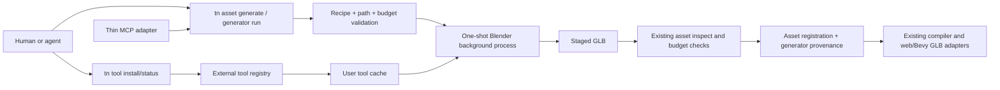

# Optional Headless Blender Asset Generation

Complexity: 10 -> HIGH mode

## Complexity Assessment

- +3 touches 10+ CLI, authoring, MCP, test, workflow, and status files
- +2 adds a new external-tool acquisition and execution module
- +2 requires download/install concurrency, atomic cache state, and process
  lifecycle control
- +2 spans `@threenative/cli`, `@threenative/authoring`, MCP, docs, and proof
- +1 integrates official Blender downloads and its versioned Python API

Every implementation phase has an automated checkpoint. External download,
cross-platform execution, and generated-model quality phases also require the
manual evidence called out below.

## Context

**Problem:** ThreeNative agents can source or import GLBs and can author runtime
primitives, but they cannot create reusable, styled 3D asset files on demand
through a bounded CLI operation without requiring users to preinstall a DCC.

**Files Analyzed:**

- `AGENTS.md`
- `packages/cli/package.json`
- `packages/cli/src/index.ts`
- `packages/cli/src/commands/registry.ts`
- `packages/cli/src/commands/asset.ts`
- `packages/cli/src/commands/assetImport.ts`
- `packages/cli/src/commands/sourceGeneratorCommand.ts`
- `packages/cli/src/commands/generator.test.ts`
- `packages/authoring/src/operationRegistry.ts`
- `packages/authoring/src/operations/documents.ts`
- `packages/authoring/src/operations/sharedA.ts`
- `packages/authoring/src/schemas.ts`
- `packages/authoring/src/sourceKinds.ts`
- `packages/mcp-server/src/index.ts`
- `packages/mcp-server/src/index.test.ts`
- `docs/contracts/authoring-source-documents.md`
- `docs/contracts/authoring-mcp.md`
- `docs/contracts/ir.md`
- `docs/workflows/asset-pipeline.md`
- `docs/workflows/open-source-3d-asset-kits.md`
- `docs/status/capabilities/assets.md`
- `docs/status/SYSTEMS_CODE_QUALITY_STATUS.md`
- `tools/spikes/blender-headless/*`
- Blender 4.5 command-line, glTF, download, checksum, and license sources
- BlenderMCP README, add-on, MCP server, and current headless guard

**Current Behavior:**

- `tn asset import` converts supported external assets and registers normal
  project-local assets; `assimpjs` is optional but dependency installation is
  left to the CLI environment.
- `tn generator record/run` owns durable one-way generator provenance, hashes,
  output conflict policy, and execution of project-local TypeScript generators.
- Generated assets can carry deterministic generator parameters in the asset
  manifest, but no external modeling provider is wired into authoring.
- The MCP server is intentionally a thin adapter over authoring/CLI operations
  with project-root and generated-source guards.
- The spike proved that an explicitly downloaded Blender 4.5.11 LTS runtime can
  execute a bounded background job, emit a valid GLB, and pass `tn asset
  inspect` without diagnostics.
- Current BlenderMCP explicitly refuses Blender background mode and exposes
  arbitrary Python, so it does not meet the execution or security boundary.

## Product Decision

Promote Blender as an **optional authoring provider**, not a runtime dependency
and not an MCP-owned engine.

```txt
tn tool install blender --accept-download --json

tn asset generate prop.crate \
  --provider blender \
  --recipe content/generators/prop.crate.recipe.json \
  --out assets/generated/prop.crate.glb \
  --json
```

The install command is the only command allowed to download Blender. Generation
without an installed or explicitly configured executable fails with a stable
diagnostic and an exact install fix. A successful generation records durable
provider/recipe provenance, emits and inspects a normal GLB, and registers the
asset through the existing structured asset operation.

Natural-language interpretation is outside the CLI contract. Humans, agents,
and MCP clients produce a versioned bounded recipe. ThreeNative validates and
executes that recipe; it never accepts raw Python or a backend handle.

## Goals

- Let users opt into Blender without increasing the published CLI package by
  hundreds of megabytes.
- Generate useful stylized props and modular environment pieces from validated,
  repeatable structured recipes.
- Reuse existing generator provenance, output conflict, asset registration,
  inspection, model-test, compiler, and web/native GLB paths.
- Give agents one discoverable CLI/MCP operation with stable JSON diagnostics,
  file paths, bounds, counts, hashes, tool version, and next proof commands.
- Reproduce at least 80% of BlenderMCP's useful tool outcomes through safe,
  registry-backed ThreeNative equivalents; v1 targets 19 of 22 tools (86%).
- Add provenance-first Poly Haven and Sketchfab discovery/import plus one
  optional text/image model-generation provider workflow without routing
  credentials or network downloads through Blender.
- Support pinned official Blender artifacts on Linux x64, macOS x64/arm64, and
  Windows x64; treat Windows arm64 as follow-on until the Node/CLI support
  matrix promotes it.
- Keep tool acquisition atomic, checksum-verified, concurrency-safe,
  auditable, removable, and outside project source and npm package contents.
- Bound process time, recipe complexity, output size, mesh/material counts, and
  project paths so an agent cannot turn asset generation into general host code
  execution.

## Non-Goals

- No raw Python, Blender add-on installation, `.blend` auto-execution, arbitrary
  Blender operators, or user-provided Blender scripts.
- No requirement for Blender in `tn build`, `tn dev`, runtimes, generated game
  packages, or users who consume already generated GLBs.
- No claim of unrestricted text-to-3D, artist-quality characters, sculpting,
  rig generation, motion capture, or photoreal asset creation.
- No persistent Blender process, GUI automation, Xvfb, TCP socket, or adoption
  of BlenderMCP as a production dependency.
- No remote recipe URLs. Poly Haven, Sketchfab, and generated-model network
  integrations use separate provider descriptors, explicit calls, credential
  guards, license/provenance capture, and staged asset inspection; they are not
  Blender recipe fields or Blender-side HTTP requests.
- No Hunyuan generate/poll/import adapter in v1. The generic provider registry
  must report it honestly as unsupported until a separate credential, API,
  archive-security, and terms review promotes it.
- No byte-for-byte reproducibility claim across different Blender versions or
  host platforms. Provenance makes the producing version explicit.
- No Blender binary redistribution in the npm package or generated project.
- No editor visual modeling UI in the initial implementation. The editor may
  call the same operation after the CLI/core path is proven.

## Integration Points

**How will this feature be reached?**

- [x] Entry points identified: `tn tool status|install|remove blender`, `tn
  generator record/run`, and the asset-focused `tn asset generate` convenience
  surface.
- [x] Caller files identified: `packages/cli/src/index.ts` dispatches the tool
  family; the existing `assetCommand` and `generatorCommand` call a shared
  Blender generator service.
- [x] Registration/wiring needed: top-level command registry, one external-tool
  manifest, generator provider descriptor, authoring operation descriptor,
  asset subcommand registry/help, MCP adapter metadata, and focused gates.

**Is this user-facing?**

- [x] YES. Authors install an optional tool and receive project-local GLB assets
  plus structured provenance. There is no runtime/player UI.
- [ ] NO.

**Full user flow:**

1. User or agent runs `tn tool status blender --json` and sees source, pinned
   version, download size, cache location, license, and readiness without any
   mutation or network request.
2. User explicitly runs `tn tool install blender --accept-download --json`.
3. CLI downloads the exact host artifact to staging, verifies SHA-256, extracts
   it, validates `blender --version`, and atomically promotes the install.
4. User or MCP client submits an asset ID and versioned recipe to `tn asset
   generate ... --provider blender --json`.
5. CLI validates source/output paths and recipe budgets, records/updates the
   existing generator provenance document, and applies overwrite policy.
6. CLI runs the repository-owned Python runner once with Blender background,
   factory startup, auto-execution disabled, a timeout, and a minimal environment.
7. Runner emits a staged GLB; CLI verifies the exit code, hashes the output,
   moves it into `assets/generated/`, runs existing asset inspection/budgets,
   registers it in structured asset source, and updates generator `lastRun`.
8. JSON output names every file written, Blender/input/output versions/hashes,
   inspection summary, and `tn model-test`/build next commands.
9. Later `tn generator run <id>` reproduces the asset from the same recipe and
   refuses manual output conflicts unless its recorded policy permits replace.

## Solution

### Approach

- Add one typed external-tool registry owning provider ID, pinned version,
  supported hosts, official URLs, hashes, archive type, executable path,
  expected size, license/source links, and version probe.
- Add a tool manager that resolves an explicit environment override before the
  managed cache and owns status, explicit install, remove, locking, staging,
  download, hashing, extraction, version probing, and cleanup.
- Extend the current generator provenance union with `provider: "blender"` and
  a durable recipe path/data reference; preserve the existing module/export
  provider unchanged.
- Define a bounded recipe registry and JSON validator for primitives,
  transforms, PBR materials, and a reviewed modifier set. Compile it only into
  arguments/data consumed by a repository-owned Blender Python runner.
- Route `tn asset generate` and `tn generator run` through one execution service;
  then derive a thin MCP tool from the owning authoring/CLI descriptor.
- Stage all outputs, inspect and budget-check the GLB, then atomically promote
  and register it. Failed jobs must not leave partially registered assets.



### Key Decisions

- [x] Blender 4.5 LTS is pinned in the owning manifest. Updating it is a reviewed
  manifest/evidence change, not a floating `latest` lookup.
- [x] `tn tool install blender --accept-download` is the only download trigger.
  MCP, build, generator, and asset commands never install implicitly.
- [x] `THREENATIVE_BLENDER_PATH` is the explicit system-install override.
  `THREENATIVE_TOOL_CACHE` is the test/enterprise cache override. These names
  are parsed by the tool manager and must not leak into runtime or source IR.
- [x] Cache defaults follow the host user-cache convention and live outside the
  project and npm package. JSON output reports the resolved cache path.
- [x] The official archive and license/source URLs are disclosed before install.
  The CLI downloads from Blender Foundation infrastructure only.
- [x] Installation uses a cross-process lock, staging directory, streamed hash,
  disk-space preflight, timeout, maximum expected size, atomic rename, and stale
  staging cleanup.
- [x] macOS DMGs use reviewed `hdiutil` attach/copy/detach orchestration;
  Windows ZIP uses reviewed archive extraction; Linux `.tar.xz` uses a probed
  host extractor. Unsupported/missing host tooling produces stable diagnostics.
- [x] No shell interpolation is allowed. Process invocation uses executable plus
  argv arrays, bounded stdout/stderr capture, timeout, and process-tree cleanup.
- [x] Blender executes `--background --factory-startup --disable-autoexec
  --python-exit-code 1 --python <owned-runner> -- <args>` with a temporary
  working directory and no project-local add-on or startup loading.
- [x] The initial recipe supports composition from `cube`, `sphere`, `cylinder`,
  `cone`, and `torus`; named transforms; PBR base color/metallic/roughness;
  smooth/flat shading; and bounded bevel, mirror, array, boolean, and join
  operations. Each feature is descriptor-owned and independently budgeted.
- [x] Recipe v0.1 limits: 128 parts, 64 materials, 128 segments per radial
  primitive, 16 modifiers per part, finite transforms, and an explicit requested
  polygon/output-size budget. Defaults must be conservative.
- [x] Existing generator provenance remains the source of truth. A tagged union
  distinguishes `typescript` (`module`/`export`) from `blender`
  (`providerVersion`/`recipe`). Do not add a second generator document family.
- [x] Generation output is a normal GLB under `assets/generated/**` and a normal
  asset source declaration. Blender never enters the runtime IR contract.
- [x] `tn asset inspect` logic is extracted/reused as a service rather than
  parsing command stdout. Invalid outputs are rejected before promotion.
- [x] The MCP tool accepts recipe JSON or a project-local recipe path and returns
  the same CLI result. It cannot install/remove tools or submit Python.
- [x] Telemetry is not added. Provider/network credentials are not required.
- [x] BlenderMCP is not forked for the CLI. ThreeNative reimplements its useful
  modeling vocabulary through bounded descriptors and documented `bpy` calls.
  Selective MIT-licensed algorithm reuse requires attribution and review; the
  GUI panel, socket bridge, telemetry, providers, and raw-code tool are excluded.

**Data Changes:** Extend `threenative.generator-provenance` as a backwards-
compatible tagged provider union. Existing documents without `provider` parse
as `typescript`. New Blender documents record `provider`, `providerVersion`,
`recipe`, `outputs`, overwrite policy, input/output hashes, and `lastRun`. No
runtime IR schema changes are required.

Example durable provenance:

```json
{
  "schema": "threenative.generator-provenance",
  "version": "0.1.0",
  "id": "prop.crate",
  "provider": "blender",
  "providerVersion": "4.5.11",
  "recipe": "content/generators/prop.crate.recipe.json",
  "outputs": ["assets/generated/prop.crate.glb"],
  "overwritePolicy": "manual",
  "inputHash": "sha256:<recipe-and-runner-hash>",
  "outputHash": "sha256:<glb-hash>"
}
```

## Sequence Flow

```mermaid
sequenceDiagram
    participant U as Human or MCP client
    participant C as tn CLI
    participant T as Tool manager
    participant A as Authoring/generator core
    participant B as Blender process
    participant I as Asset inspector

    U->>C: asset generate id + recipe
    C->>T: resolve blender
    alt Blender missing
        T-->>C: TN_EXTERNAL_TOOL_MISSING + explicit install fix
        C-->>U: non-zero JSON result; no download and no writes
    else Blender ready
        T-->>C: pinned executable/version/source
        C->>A: validate recipe, provenance, conflicts, paths
        A-->>C: normalized job and staging plan
        C->>B: background owned_runner.py + normalized job
        alt timeout or Blender error
            B-->>C: bounded logs and non-zero status
            C-->>U: stable failure; staged files removed
        else GLB emitted
            B-->>C: staged GLB
            C->>I: inspect GLB and enforce budgets
            I-->>C: bounds/counts/diagnostics
            C->>A: promote output, register asset, update provenance
            A-->>C: filesWritten + hashes + lastRun
            C-->>U: TN_ASSET_GENERATE_OK + next proof commands
        end
    end
```

## Execution Phases

### Phase 1: Explicit Optional Tool Lifecycle

**User-visible outcome:** A user can inspect, install, reuse, and remove a
checksum-verified Blender runtime without changing the npm package or project.

**Files (max 5):**

- `packages/cli/src/externalTools/registry.ts` - owning tool/platform manifest
- `packages/cli/src/externalTools/manager.ts` - resolve/status/install/remove
- `packages/cli/src/externalTools/manager.test.ts` - lifecycle and fault tests
- `packages/cli/src/commands/tool.ts` - stable CLI JSON/human surface
- `packages/cli/src/index.ts` - register and dispatch the `tool` family

**Implementation:**

- [ ] Define Blender 4.5.11 artifacts, exact official hashes, sizes, archive
  types, executable locations, license/source URLs, and version probe in one
  registry; reject a supported platform row missing any field.
- [ ] Implement override/cache resolution without probing the network.
- [ ] Require `--accept-download` for install; report download source, size,
  version, hash, license, destination, and free-space estimate before mutation.
- [ ] Stream to unique staging, hash while downloading, enforce timeout/size,
  acquire a cross-process lock, extract without shell interpolation, probe the
  binary, and atomically promote it.
- [ ] Make repeated install idempotent; make remove bounded to the selected
  managed cache entry and refuse to remove an override/system executable.
- [ ] Emit stable codes for missing tool, unsupported host, acknowledgement
  missing, lock contention, disk space, HTTP/proxy, hash, extraction, probe,
  timeout, stale staging, and removal failures.

**Tests Required:**

| Test File | Test Name | Assertion |
| --- | --- | --- |
| `externalTools/manager.test.ts` | `should report missing without network or writes when cache is empty` | status is read-only and missing |
| same | `should require explicit acknowledgement before download` | install fails before fetch |
| same | `should install atomically when artifact and hash are valid` | executable appears only after probe |
| same | `should remove staging when checksum mismatches` | no promoted/cache residue |
| same | `should serialize concurrent installs for the same tool` | one fetch/promotion occurs |
| same | `should prefer explicit Blender path when version is supported` | override is reported and cache untouched |
| same | `should refuse removal of an override executable` | external path remains unchanged |

**Verification Plan:**

1. Unit/integration: injected fetch, filesystem, extractor, clock, free-space,
   and process runner cover all failure branches without a 360 MB test fixture.
2. Real external proof on each host: clean cache -> status missing -> install ->
   version probe -> second idempotent install -> remove.
3. Commands: `pnpm --filter @threenative/cli test`, `pnpm --filter
   @threenative/cli typecheck`.
4. Evidence: resolved version/path/hash, download bytes/time, and `blender
   --version` output stored in a non-source tool proof artifact.

**User Verification:**

- Action: run `tn tool install blender --accept-download --json` on a clean
  supported host, then `tn tool status blender --json`.
- Expected: first command installs the pinned verified artifact; second performs
  no network access and reports ready from the user cache.

**Checkpoint:** Run the `prd-work-reviewer` checkpoint for Phase 1. Manual
external verification on Linux, macOS, and Windows is also required before
Phase 2 is promoted.

### Phase 2: Durable Bounded Blender Recipe

**User-visible outcome:** Authors can record and validate a Blender-backed
generator recipe without running or installing Blender.

**Files (max 5):**

- `packages/authoring/src/schemas.ts` - generator provider/recipe types and keys
- `packages/authoring/src/operations/documents.ts` - record/update provider union
- `packages/authoring/src/operations/sharedA.ts` - recipe/provenance validation
- `packages/authoring/src/operationRegistry.ts` - descriptor-owned record args
- `packages/authoring/src/operationRegistry.test.ts` - compatibility and recipe tests

**Implementation:**

- [ ] Extend generator provenance as a tagged union; infer `typescript` for
  existing module/export documents so no migration is required.
- [ ] Add `generator.record_blender` descriptor metadata with generator ID,
  recipe path/object, output, overwrite policy, and requested budgets.
- [ ] Normalize inline recipes into `content/generators/<id>.recipe.json` so
  reruns always reference durable structured JSON.
- [ ] Validate exact keys, schema/version, IDs, finite transforms/colors,
  supported primitives/modifiers, reference ordering, uniqueness, path
  containment, and all count/geometry/output budgets.
- [ ] Reject Python/code/module/add-on fields and remote URLs with explicit
  diagnostic fixes pointing to allowed recipe fields.

**Tests Required:**

| Test File | Test Name | Assertion |
| --- | --- | --- |
| `operationRegistry.test.ts` | `should preserve legacy TypeScript generator documents` | old shape validates unchanged |
| same | `should record normalized Blender recipe and provider provenance` | two durable files have stable order/shape |
| same | `should reject unknown Blender recipe operation` | exact path/code/fix returned |
| same | `should reject traversal and generated bundle output paths` | no writes escape source/assets boundary |
| same | `should reject Python and remote recipe fields` | general code/network inputs fail closed |
| same | `should enforce part material modifier and segment budgets` | over-limit recipe is rejected |

**Verification Plan:**

1. Unit: validator boundary table for every primitive/modifier/limit.
2. Compatibility: current generator tests run unchanged.
3. Integration: dispatch descriptor writes recipe/provenance, then authoring
   inspect/validate reloads both after a fresh process.
4. Commands: `pnpm --filter @threenative/authoring test`, `pnpm
   --filter @threenative/authoring typecheck`.

**User Verification:**

- Action: record the example crate recipe, close the process, then run `tn
  authoring validate --json`.
- Expected: recipe and provider provenance survive reload and validate without
  requiring Blender.

**Checkpoint:** Run the `prd-work-reviewer` checkpoint for Phase 2.

### Phase 3: One-Shot GLB Generation And Registration

**User-visible outcome:** `tn generator run` turns a recorded recipe into a
validated, registered GLB with provenance and no partial outputs on failure.

**Files (max 5):**

- `packages/cli/src/blender/runner.py` - owned, bounded Blender recipe executor
- `packages/cli/src/blender/runBlenderGenerator.ts` - process/staging lifecycle
- `packages/cli/src/commands/sourceGeneratorCommand.ts` - provider dispatch
- `packages/cli/src/commands/generator.test.ts` - mocked and real-run contracts
- `packages/cli/scripts/copy-templates.mjs` - package the owned Python runner

**Implementation:**

- [ ] Implement every recipe operation as explicit Python data dispatch; never
  call `exec`, evaluate expressions, load project scripts, or enable add-ons.
- [ ] Normalize names/order, delete factory objects, build materials/parts,
  apply modifiers, export selected content as GLB with Y-up, and emit one JSON
  result record separate from Blender logs.
- [ ] Run Blender with factory startup, autoexec disabled, owned runner, minimal
  environment, temp cwd, timeout, bounded logs, and process-tree termination.
- [ ] Compute input hash from normalized recipe + runner hash + provider version.
- [ ] Stage output, call extracted asset inspection logic, enforce requested and
  global mesh/material/triangle/file-size budgets, and promote atomically.
- [ ] Register the resulting model through existing `addAsset`; include
  `generator:<id>` source/provenance and update `lastRun` only after successful
  promotion/registration.
- [ ] On any failure, remove staging and preserve prior accepted output and
  provenance unchanged.

**Tests Required:**

| Test File | Test Name | Assertion |
| --- | --- | --- |
| `generator.test.ts` | `should return install fix when Blender is missing` | no implicit download or source writes |
| same | `should invoke Blender with hardened background arguments` | exact argv/env/cwd/timeout asserted |
| same | `should promote inspect and register a valid staged GLB` | asset + provenance written together |
| same | `should preserve prior output when Blender exits non-zero` | old GLB/hash remains |
| same | `should terminate and clean staging when Blender times out` | process tree killed; no residue |
| same | `should reject GLB exceeding polygon or size budget` | no asset registration occurs |
| same | `should reproduce output when recipe and provider are unchanged` | stable semantic inspect report/hashes recorded |

**Verification Plan:**

1. Unit: fake process/inspector covers missing, error, timeout, malformed JSON,
   oversized logs, invalid GLB, and registration rollback.
2. Real integration: generate crate, barrier, and pickup recipes with the
   managed Blender on all supported hosts.
3. Existing pipeline: run `tn asset inspect` and `tn model-test --angles
   0,90,180,270` for each generated GLB.
4. Commands: `pnpm --filter @threenative/cli test`, `pnpm --filter
   @threenative/cli build`, `pnpm verify:conformance`.
5. Evidence: GLBs, inspection JSON, contact sheets, provider/recipe/output
   hashes, durations, and host matrix report.

**User Verification:**

- Action: install Blender, record the example recipe, and run `tn generator run
  prop.crate --json` twice.
- Expected: first run writes/registers the GLB; second run is deterministic at
  the semantic inspection/provenance level and does not create duplicate assets.

**Checkpoint:** Run the `prd-work-reviewer` checkpoint for Phase 3. Manual
review must confirm the three generated props are visually distinct,
recognizable, correctly scaled, grounded, and usable in a game scene.

### Phase 4: Asset-Focused CLI And Thin MCP Interface

**User-visible outcome:** Agents can create and regenerate a model through one
discoverable asset command or MCP tool while receiving the same core result.

**Files (max 5):**

- `packages/cli/src/commands/asset.ts` - `asset generate` adapter
- `packages/cli/src/index.ts` - descriptor-owned asset/tool usage metadata
- `packages/cli/src/commands/asset.test.ts` - CLI parity and rollback tests
- `packages/mcp-server/src/index.ts` - derived thin generation tool
- `packages/mcp-server/src/index.test.ts` - CLI/MCP parity and guards

**Implementation:**

- [ ] Add `tn asset generate <asset-id> --provider blender --recipe <path|json>
  [--out <path>] [--overwrite-policy ...] [--project ...] [--json]` as a thin
  record-and-run composition over the Phase 2/3 operations.
- [ ] Derive help, argv, MCP name/description/schema, and tool exposure from the
  owning descriptor; add a drift assertion if an adapter field cannot yet derive.
- [ ] Default output to `assets/generated/<safe-asset-id>.glb`; reject existing
  unowned/manual assets unless explicit reviewed replacement policy permits it.
- [ ] Expose `asset.generate_blender` to MCP with recipe object/path and project
  root guards. Do not expose `tool install/remove` or any Python/code argument.
- [ ] Preserve core diagnostics, `fix`, files written, inspection summary,
  hashes, and next commands in MCP results.

**Tests Required:**

| Test File | Test Name | Assertion |
| --- | --- | --- |
| `asset.test.ts` | `should record run inspect and register through asset generate` | one command returns complete result |
| same | `should not replace a manual asset with generated output` | conflict is stable and prior file remains |
| `mcp-server/src/index.test.ts` | `should match CLI asset generation result` | paths/codes/diagnostics are equivalent |
| same | `should reject recipe and output traversal` | root/generated-source guards hold |
| same | `should expose no install remove or Python Blender tools` | forbidden tools/args absent |
| same | `should return explicit install fix when provider is unavailable` | MCP does not trigger download |

**Verification Plan:**

1. Unit/integration: injected Blender runner proves CLI/MCP parity cheaply.
2. Real MCP smoke: inspect -> generate -> authoring validate -> build ->
   model-test, using an already installed managed tool.
3. Commands: `pnpm --filter @threenative/cli test`, `pnpm --filter
   @threenative/mcp-server test`, `pnpm verify:adapter-surfaces` or its current
   descriptor-drift equivalent.

**User Verification:**

- Action: ask an MCP client to create a blue beveled crate within the recipe
  vocabulary in a temporary project.
- Expected: tool writes recipe/provenance/GLB/asset declaration, returns the same
  result as CLI, and never starts a socket server or installs software.

**Checkpoint:** Run the `prd-work-reviewer` checkpoint for Phase 4. Manual MCP
verification is required because external client/tool confirmation cannot be
fully represented by unit tests.

### Phase 5: Cross-Platform And Security Promotion Gate

**User-visible outcome:** The feature is promoted only on hosts where download,
execution, cleanup, and equivalent GLB semantics are proven.

**Files (max 5):**

- `tools/verify/src/blenderToolGate.ts` - host/install/generation evidence gate
- `tools/verify/src/blenderToolGate.test.ts` - positive and negative fixtures
- `tools/verify/src/index.ts` - gate registration
- `package.json` - focused verify script
- `.github/workflows/ci.yml` - opt-in host matrix job/cache policy

**Implementation:**

- [ ] Add Linux x64, macOS x64/arm64, and Windows x64 matrix jobs using official
  artifacts and exact manifest hashes. Do not download Blender in the normal
  fast test lane.
- [ ] Gate install source/hash/version, hardened argv, cleanup, three recipe
  outputs, semantic inspection equivalence, authoring validation, and build.
- [ ] Add negative controls for hash mismatch, zip/tar traversal, interrupted
  download, stale lock, timeout, malicious path, Python-like field, recipe
  budget, and malformed/oversized GLB.
- [ ] Record duration, archive/install/cache sizes, peak child memory when
  available, GLB sizes/counts/bounds, and platform-specific differences.
- [ ] Fail closed or mark a host experimental when its exact executable and
  cleanup semantics are not proven; never infer support from an artifact URL.

**Tests Required:**

| Test File | Test Name | Assertion |
| --- | --- | --- |
| `blenderToolGate.test.ts` | `should pass complete pinned host evidence` | all required proof rows present |
| same | `should fail when install was implicit or unverified` | consent/hash evidence required |
| same | `should fail when forbidden code execution surface appears` | tool schema/argv audit fails |
| same | `should fail when semantic output exceeds tolerance` | bounds/count/material drift caught |
| same | `should require cleanup evidence after negative controls` | no staging/lock/process residue |

**Verification Plan:**

1. Run gate unit tests on every PR.
2. Run real external matrix on manifest/runner/recipe changes and scheduled CI.
3. Run `pnpm verify:blender-tool`, `pnpm verify:conformance`, and `pnpm verify`.
4. Review the generated host report and three model contact sheets manually.

**User Verification:**

- Action: compare the three generated model-test sheets and inspection reports
  from every supported host.
- Expected: models are materially equivalent and any non-byte differences are
  explicitly measured within the approved semantic tolerance.

**Checkpoint:** Run the `prd-work-reviewer` checkpoint for Phase 5. Manual
cross-platform visual/security evidence approval is mandatory.

### Phase 6: Workflow, Cookbook, Capability, And Debt Closure

**User-visible outcome:** Authors and agents can discover the supported workflow,
limitations, provenance rules, proof commands, and recovery steps from repo and
generated-project guidance.

**Files (max 5):**

- `docs/workflows/asset-pipeline.md` - install/generate/rerun/prove workflow
- `docs/cookbook/blender-generated-prop.md` - bounded executable authoring pattern
- `docs/status/capabilities/assets.md` - exact supported host/recipe claim/evidence
- `docs/status/SYSTEMS_CODE_QUALITY_STATUS.md` - external-tool/runner risk row
- `docs/STATUS.md` - one-line asset capability index update

**Implementation:**

- [ ] Document that Blender is authoring-only, optional, large, downloaded only
  with consent, cache-removable, and absent from runtime/generated projects.
- [ ] Document official source/license/hash disclosure, cache/override locations,
  proxy/offline behavior, disk needs, timeout cleanup, and stable recovery codes.
- [ ] Add a cookbook recipe that creates, regenerates, inspects, model-tests,
  registers, builds, and verifies one useful prop using only bounded operations.
- [ ] State exact recipe vocabulary and host matrix; label BlenderMCP, raw Python,
  GUI/Xvfb, text-to-3D, rigs, and arbitrary `.blend` import unsupported.
- [ ] Record the new external-tool manager/process runner as a yellow quality
  risk until matrix, negative-control, and upgrade-drift gates are green.
- [ ] Run cookbook verification and link all evidence from the capability page.

**Tests Required:**

| Test/Gate | Test Name | Assertion |
| --- | --- | --- |
| cookbook verifier | `blender-generated-prop` | commands/schema remain valid |
| docs checker | capability/status links | exact claim and evidence resolve |
| adapter drift gate | command/MCP surfaces | descriptor is the owning truth |
| package contents check | published CLI files | no Blender archive/binary/cache ships |

**Verification Plan:**

1. Run `pnpm verify:cookbook`, `pnpm check:docs`, package dry-run/content audit,
   narrow package tests, `pnpm verify:conformance`, then `pnpm verify`.
2. Follow the cookbook from a clean project/cache on one supported host.
3. Confirm an ordinary `pnpm pack` contains the Python runner/manifest but no
   Blender binary, archive, generated GLB, or user cache.

**User Verification:**

- Action: follow the cookbook from an empty Blender cache, then remove Blender
  and build the project again using the already generated GLB.
- Expected: generation requires explicit install; the game build/runtime does
  not require Blender after the asset exists.

**Checkpoint:** Run the `prd-work-reviewer` checkpoint for Phase 6. Manual
clean-machine workflow and package-content review are required.

## Checkpoint Protocol

After each phase:

1. Run the exact narrow tests and verification commands listed in that phase.
2. Spawn `prd-work-reviewer` with the PRD path and phase number.
3. Correct every requirement/test/drift finding before starting the next phase.
4. For Phases 1, 3, 4, 5, and 6, attach the specified manual external evidence
   and wait for approval because downloads, visual quality, MCP clients, and
   host-specific process cleanup cannot be accepted from mocks alone.
5. Add results to Verification Evidence below; do not mark a phase complete
   solely because TypeScript compiles.

## Verification Strategy

### Unit proof

- Manifest completeness and platform selection.
- Cache and explicit override resolution.
- Consent, size, checksum, lock, staging, extraction, timeout, and removal.
- Recipe schema, exact keys/references, finite numeric values, and budgets.
- Provider-union compatibility and normalization.
- Process argv/environment/cwd/log limits and cleanup.
- Output conflict, inspection budget, promotion, registration, and rollback.
- CLI/MCP result parity and forbidden-surface assertions.

### Integration proof

- Mock HTTP + real archive fixture for atomic install behavior.
- Real Blender generation for three recipes on every promoted host.
- Existing asset inspect/model-test/build path for every output.
- Rerun/conflict behavior after manual GLB modification.
- MCP smoke against an installed tool without implicit network mutation.

### Security and negative proof

- Malicious archive entries cannot escape staging.
- Recipe/output/project paths cannot escape allowed roots.
- Recipe cannot name Python, module, add-on, URL, shell, environment, or host
  filesystem operations.
- Blender startup scripts and `.blend` autoexec are disabled.
- Timeout kills descendants and cleanup removes locks/staging.
- Oversized response/log/output/geometry inputs fail with bounded diagnostics.
- MCP exposes neither tool installation nor arbitrary code execution.

### Visual and semantic proof

- At least crate, barrier, and pickup recipes look distinct and intentional.
- GLBs have expected named nodes/materials, meter-scale bounds, grounded pivot,
  embedded dependencies, triangle/material limits, and valid Y-up mapping.
- Web and desktop model-test scenes load each output.
- Platform comparison uses semantic inspection and image tolerance, not an
  unsupported byte-for-byte hash promise.

## Verification Evidence

Populate during implementation:

### Phase 1: Optional Tool Lifecycle

- Unit/integration tests: pending
- Linux/macOS/Windows install evidence: pending
- Cache/package size audit: pending
- Checkpoint: pending

### Phase 2: Recipe And Provenance

- Authoring compatibility/validation tests: pending
- Reload validation: pending
- Checkpoint: pending

### Phase 3: Generation

- Three real GLBs and inspection/model-test artifacts: pending
- Conformance/build: pending
- Manual visual review: pending
- Checkpoint: pending

### Phase 4: CLI/MCP

- CLI/MCP parity smoke: pending
- Adapter drift: pending
- Manual client verification: pending
- Checkpoint: pending

### Phase 5: Promotion Gate

- Host matrix and negative controls: pending
- Security/cleanup report: pending
- Manual cross-platform review: pending
- Checkpoint: pending

### Phase 6: Documentation

- Cookbook/docs/package-content verification: pending
- Clean-machine workflow: pending
- Checkpoint: pending

## Acceptance Criteria

- [ ] All six phases and checkpoint reviews pass.
- [ ] `tn tool status blender` is read-only/offline and install requires explicit
  `--accept-download` acknowledgement.
- [ ] Published CLI package and generated projects contain no Blender binary or
  archive; package-content proof enforces this.
- [ ] Official source, version, license, artifact size, and SHA-256 are reported
  and the installed executable is version-probed.
- [ ] Linux x64, macOS x64/arm64, and Windows x64 are either proved and promoted
  or explicitly rejected with stable diagnostics.
- [ ] Existing TypeScript generator provenance remains backward compatible.
- [ ] Blender recipes are versioned, durable, exact-key validated, bounded, and
  incapable of carrying Python/code/add-on/remote URL instructions.
- [ ] Missing Blender returns a stable install fix without network or writes.
- [ ] Valid recipes produce registered GLBs that pass existing inspection,
  model-test, build, and web/desktop load proof.
- [ ] Generated-model visual proof asserts that authored GLB PBR base color,
  metallic, and roughness survive the model-test scene; a white prefab fallback
  must not count as material evidence.
- [ ] Failure, timeout, budget, conflict, or registration errors preserve prior
  accepted assets/provenance and remove staging/locks/processes.
- [ ] Reruns record recipe/runner/provider/output hashes and enforce overwrite
  policy without duplicate asset declarations.
- [ ] MCP wraps the same descriptor/core result and exposes neither install nor
  arbitrary code.
- [ ] The crate, barrier, and pickup quality floor passes manual review on each
  promoted host.
- [ ] `pnpm --filter @threenative/authoring test`, `pnpm --filter
  @threenative/cli test`, `pnpm --filter @threenative/mcp-server test`, `pnpm
  verify:cookbook`, `pnpm check:docs`, `pnpm verify:conformance`, and `pnpm
  verify` pass.

## Risks And Mitigations

| Risk | Impact | Mitigation |
| --- | --- | --- |
| 360+ MB download and larger extracted install | High | explicit consent, size/disk preflight, user cache, status/remove, no runtime/package dependency |
| Blender release URL/hash drift | High | pinned manifest, official hashes, scheduled proof, reviewed upgrades only |
| Arbitrary host execution through Blender Python | Critical | owned runner only, exact recipe schema, no eval/exec/modules/add-ons/autoexec, MCP schema audit |
| Archive traversal or partial install | Critical | safe extractor policy, staging, streaming hash, lock, atomic promotion, negative fixtures |
| Hung Blender/child processes | High | timeout, process-tree kill, bounded logs, temp cwd, cleanup evidence |
| Generated asset overwrites manual work | High | existing generator output hash/overwrite policy, staged promotion, ownership check |
| Cross-platform output drift | Medium | pin version, semantic inspection/image tolerance, record host/version, no byte-identical claim |
| Primitive recipes produce generic art | Medium | purposeful modifier/material vocabulary, three-asset quality gate, catalog assets remain preferred for hero art |
| MCP recreates BlenderMCP's unsafe surface | High | derive one bounded recipe tool; forbid install/code/socket/add-on tools with drift tests |
| GPL/source disclosure mistakes | Medium | direct official download, license/source links in manifest/output/docs, package-content audit; legal review if redistribution is later proposed |
| Duplicate registries/adapters | Medium | external-tool and recipe registries own truth; CLI/MCP/help/proof derive or have explicit drift gates |

## Open Questions

- Should Linux arm64 be promoted in the first release if Blender Foundation does
  not publish an equivalent official archive for the pinned version?
- Should a later recipe version add curve/text extrusion and UV/texture inputs,
  or should those wait for a concrete shipped-game need?
- Should managed tool downloads honor enterprise proxy configuration only via
  Node's standard environment behavior, or expose an explicit CLI config file?
- What conservative default triangle and GLB byte budgets best fit existing
  generated-game asset budgets? Phase 3 must measure before fixing the values.
- Is a reproducible thumbnail useful enough to run Blender rendering, or should
  the product always reuse the existing model-test renderer after export?

None of these questions blocks the first vertical slice: explicit lifecycle,
bounded primitive composition, GLB export, existing inspection, and provenance.

## Sources

- Blender 4.5 command-line arguments:
  https://docs.blender.org/manual/en/4.5/advanced/command_line/arguments.html
- Blender glTF 2.0 exporter:
  https://docs.blender.org/manual/en/4.5/addons/import_export/scene_gltf2.html
- Blender official downloads/checksums:
  https://download.blender.org/release/Blender4.5/
- Blender license:
  https://developer.blender.org/docs/license
- BlenderMCP repository and security limitations:
  https://github.com/ahujasid/blender-mcp
- Inspected BlenderMCP background-mode guard:
  https://github.com/ahujasid/blender-mcp/blob/6e99eb5a442b83766a5796975ec7bb5bfc791341/addon.py#L112-L117
- Executed ThreeNative spike:
  `docs/audits/blender-headless-cli-spike-2026-07-13.md`
