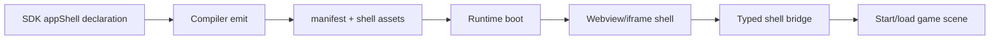

# Optional React App Shell and Pre-Game Flow

Complexity: 10 -> HIGH mode

## Complexity Assessment

- +3 touches 10+ implementation/test/docs files during implementation
- +2 adds a new app-shell lifecycle before game scene activation
- +2 spans SDK, IR, compiler, web runtime, native webview host, packaging, CLI,
  docs, and verification
- +1 external UI library compatibility risk, though not a required dependency
- +1 authentication/session boundary risk
- +1 visual/manual verification for web/native startup flows

## Context

**Problem:** ThreeNative supports optional React/CSS webview overlays after a
game bundle is loaded, but it does not have a first-class app-shell contract for
title screens, login, account linking, onboarding, route-like menus, storefront
panels, or launcher flows that run before the initial game scene starts.

**Files Analyzed:**

- `docs/contracts/ui.md`
- `docs/PRDs/done/v8/V8-05-optional-react-webview-overlay.md`
- `docs/PRDs/done/other/advanced-portable-ui-composition-and-screen-systems.md`
- `packages/sdk/src/overlay.ts`
- `packages/ir/src/overlays.ts`
- `packages/compiler/src/overlay/emit.ts`
- `packages/runtime-web-three/src/overlay/host.ts`
- `packages/runtime-web-three/src/render.ts`
- `runtime-bevy/crates/threenative_runtime/src/overlay_host.rs`
- `runtime-bevy/crates/threenative_runtime/src/lib.rs`

**Current Behavior:**

- Retained `ui.ir.json` remains the portable game UI contract.
- Optional `overlays.ir.json` can mount bundle-local HTML/CSS/JS assets as web
  iframes or native desktop webviews.
- Overlay input capture and bridge messages are explicit.
- Existing webview overlays are mounted as layers above an already-created game
  surface.
- Current overlay bounds are panel/modal oriented; they do not own a pre-game
  boot lifecycle or decide when the first game scene begins.

## Product Decision

Add an optional app-shell contract separate from retained game UI:

```txt
App shell entry -> web iframe/native webview -> typed shell bridge
  -> start/load/resume game bundle scene
  -> optional in-game overlay panels
```

The shell may be implemented with React, React Router, another SPA router, or
plain HTML/CSS/JS. ThreeNative should not require `react-router-dom` in the
runtime contract. The contract is bundle-local web assets plus typed bridge
messages and lifecycle policies.

## Goals

- Support title, login, account-linking, onboarding, profile select, settings,
  save-slot selection, storefront, and launcher flows before the game starts.
- Allow projects to use React and route libraries inside the shell when they
  bundle those assets locally.
- Keep the engine contract library-agnostic: no runtime dependency on
  `react-router-dom`.
- Let the shell trigger game startup through typed bridge messages such as
  `game:start`, `game:load-save`, `game:set-profile`, and `shell:close`.
- Preserve offline/bundle-local rules and reject remote scripts by default.
- Support target-aware diagnostics for native desktop webview availability,
  mobile unsupported states, and auth/network boundaries.

## Non-Goals

- Do not make React/webview the default portable game UI contract.
- Do not let shell code directly mutate ECS, Bevy, Three.js, filesystem, native
  handles, or generated bundle JSON.
- Do not require a specific router. `react-router-dom`, hash routing, memory
  routing, or a custom router are app implementation details.
- Do not add online account/auth providers in this PRD. This PRD defines the
  shell lifecycle and bridge; auth providers need a separate external-services
  contract.
- Do not use webview app shell for entity-attached UI, HUD, or gameplay-critical
  prompts.

## Integration Points

**How will this feature be reached?**

- [x] Entry point identified: SDK app-shell declaration, compiler emit,
  manifest capability flags, web runtime boot, native desktop webview boot,
  typed shell bridge, and CLI/package verification.
- [x] Caller file identified: SDK overlay/app-shell APIs, IR validation,
  compiler bundle emit, web render/bootstrap, Bevy runtime startup, overlay
  host bridge, packaging scripts, and verify gate.
- [x] Registration/wiring needed: manifest entries, lifecycle policy,
  target-profile diagnostics, bridge message schemas, screenshots, docs, and
  focused verification.

**Is this user-facing?**

- [x] YES. Players see the shell before the game starts.
- [ ] NO.

**Full user flow:**

1. Project declares an optional app shell with a bundle-local entry such as
   `shell/index.html`.
2. `tn build` emits shell metadata, copies shell assets, and records required
   capabilities.
3. Runtime starts in shell mode and either delays game scene activation or loads
   a lightweight background scene.
4. User navigates shell routes such as `/login`, `/profile`, `/settings`, or
   `/play`.
5. Shell sends a typed bridge message like `game:start`.
6. Runtime validates the message, activates the initial game scene, and either
   closes, hides, or keeps the shell as an in-game overlay according to policy.

## Solution

**Approach:**

- Extend the optional overlay model with an app-shell role and boot policy.
- Keep shell assets bundle-local and bridge-only.
- Support route-like behavior inside the shell without prescribing a routing
  library.
- Add lifecycle policies for `shell-first`, `shell-over-background`, and
  `game-first`.
- Add clear diagnostics for unsupported native webview targets, remote auth
  attempts, missing start messages, unsafe entries, and shell/game input
  conflicts.



**Key Decisions:**

- [x] Library/framework choices: reuse `overlays.ir.json`, typed bridge
  validation, bundle-local asset checks, web iframe host, and native WRY host
  where available.
- [x] Error-handling strategy: stable diagnostics for unsafe shell assets,
  missing lifecycle messages, unsupported targets, remote network/auth usage
  unless separately allowed, and bridge schema violations.
- [x] Reused utilities: overlay validation, compiler asset copying, manifest
  capability derivation, packaging inspection, and screenshot proof.

**Data Changes:** Add app-shell metadata either as a role inside
`overlays.ir.json` or as a new `app-shell.ir.json` if separation is cleaner.
Generated runtime bundle remains source of truth for emitted contracts; shell
source assets remain project-local durable source.

## Execution Phases

#### Phase 1: Shell Contract - Bundles can declare pre-game app shells.

**Files (max 5):**

- `packages/ir/src/overlays.ts` - app-shell role or shell IR validation
- `packages/ir/schemas/overlays.schema.json` - schema updates
- `packages/sdk/src/overlay.ts` - `overlay.appShell()` or equivalent
- `packages/compiler/src/overlay/emit.ts` - shell emit/copy support
- `packages/ir/src/overlays.test.ts` - accepted/rejected tests

**Implementation:**

- [ ] Add shell role, boot policy, entry, target profiles, input policy, and
  lifecycle message declarations.
- [ ] Require bundle-local shell entries/assets.
- [ ] Reject remote URLs, parent traversal, inline script content, and unknown
  fields.
- [ ] Add capability flags such as `overlay:app-shell`,
  `overlay:shell-first`, and `overlay:bridge`.

**Tests Required:**

| Test File | Test Name | Assertion |
|-----------|-----------|-----------|
| `packages/ir/src/overlays.test.ts` | `should accept shell-first app shell declaration` | Valid shell has no diagnostics. |
| `packages/ir/src/overlays.test.ts` | `should reject app shell without start message` | Diagnostic points to lifecycle bridge metadata. |

**User Verification:**

- Action: Build a fixture with `shell/index.html`.
- Expected: Bundle contains shell assets and manifest capabilities.

#### Phase 2: Runtime Boot Flow - Shell can start the game.

**Files (max 5):**

- `packages/runtime-web-three/src/render.ts` - shell-first web boot
- `packages/runtime-web-three/src/overlay/host.ts` - shell host behavior
- `runtime-bevy/crates/threenative_runtime/src/lib.rs` - native boot policy
- `runtime-bevy/crates/threenative_runtime/src/overlay_host.rs` - shell host
  lifecycle
- `packages/runtime-web-three/src/overlay/*.test.ts` - web boot tests

**Implementation:**

- [ ] Start runtime in shell-first mode when configured.
- [ ] Delay initial scene activation until a valid `game:start` or
  `game:load-save` message is received.
- [ ] Support close/hide/keep policies after game start.
- [ ] Preserve input capture rules before and after game activation.
- [ ] Emit lifecycle traces for shell mounted, route-ready, start requested,
  game activated, and shell hidden/closed.

**Tests Required:**

| Test File | Test Name | Assertion |
|-----------|-----------|-----------|
| `packages/runtime-web-three/src/overlay/host.test.ts` | `should keep shell full-screen before game start` | Shell iframe covers the game surface. |
| `runtime-bevy/crates/threenative_runtime/tests/overlay_host.rs` | `should prepare shell-first native mount plan` | Native plan records shell boot policy. |

**User Verification:**

- Action: Open fixture, click Play in shell.
- Expected: Shell starts first, then the game scene activates and shell follows
  configured close/hide policy.

#### Phase 3: Route-Like Shell Fixture - React routing is supported as app code, not engine API.

**Files (max 5):**

- `packages/ir/fixtures/conformance/app-shell/game.bundle/*` - fixture bundle
- `examples/app-shell-flow/*` - source example
- `scripts/verify-app-shell-flow.mjs` - focused verification
- `tools/verify/src/scriptGates.ts` - gate registration
- `docs/contracts/ui.md` - contract docs

**Implementation:**

- [ ] Add a shell fixture with title, login/mock profile, settings, and play
  routes.
- [ ] Use hash or memory routing so packaged file/native webview loading works
  without server URL rewriting.
- [ ] Demonstrate that React Router is optional by keeping the engine contract
  generic and documenting router constraints.
- [ ] Verify typed shell messages and game-to-shell snapshots.

**Tests Required:**

| Test File | Test Name | Assertion |
|-----------|-----------|-----------|
| `scripts/verify-app-shell-flow.test.mjs` | `should require shell screenshots and bridge traces` | Missing proof fails. |
| `packages/compiler/src/emit/bundle.test.ts` | `should copy shell route assets` | Bundle includes JS/CSS/assets. |

**User Verification:**

- Action: Navigate title -> login/profile -> settings -> play.
- Expected: Routes work from bundle-local assets and game start trace is
  emitted.

#### Phase 4: Packaging, Diagnostics, and Docs - Shell limitations are explicit.

**Files (max 5):**

- `docs/contracts/ui.md` - app shell docs
- `docs/STATUS.md` - status after implementation
- `docs/bevy-feature-parity.md` - parity/evidence row after implementation
- `tools/verify/src/*` - focused gate integration
- `scripts/verify-app-shell-flow.mjs` - final proof

**Implementation:**

- [ ] Document retained UI vs overlay panels vs app shell.
- [ ] Document router recommendations: prefer hash/memory routing for packaged
  shell assets; server-history routing is unsupported unless the shell supplies
  a local fallback.
- [ ] Add diagnostics for native webview unavailable, mobile unsupported,
  remote auth/network boundary, unsafe assets, and missing start route.
- [ ] Add package inspection evidence for desktop shell assets.

**Tests Required:**

| Test File | Test Name | Assertion |
|-----------|-----------|-----------|
| `tools/verify/src/scriptGates.test.ts` | `should register app-shell gate` | Gate is discoverable. |
| `scripts/verify-app-shell-flow.test.mjs` | `should fail on unsupported native shell target` | Diagnostic is stable. |

**User Verification:**

- Action: Run `pnpm verify:app-shell-flow`.
- Expected: Report includes shell screenshots, bridge traces, packaging
  inspection, and target diagnostics.

## Acceptance Criteria

- [ ] Projects can declare a bundle-local app shell that appears before the
  initial game scene.
- [ ] Shell assets may be built with React, React Router, or another local SPA
  stack, but ThreeNative does not depend on a router library.
- [ ] Shell-to-game messages are schema-validated and can start/load the game.
- [ ] Game-to-shell snapshots can update shell state when the shell remains
  mounted.
- [ ] Input capture transitions correctly from shell-first to in-game state.
- [ ] Web and native desktop targets either mount the shell or emit stable
  unsupported diagnostics.
- [ ] Docs clearly distinguish retained native UI, in-game webview overlays, and
  pre-game app shell usage.

## Open Questions

- Should app shell metadata live in `overlays.ir.json` as `role:
  "app-shell"` or in a separate `app-shell.ir.json`?
- Should shell-first mode allow a lightweight animated 3D background scene, or
  should that be a normal loading/menu scene behind the shell?
- What minimal session/auth payload shape should be allowed without committing
  to online auth providers?
- Should shell state be preserved across game reloads or destroyed once the game
  starts by default?

## Verification Strategy

```bash
pnpm --filter @threenative/ir test -- --run overlay
pnpm --filter @threenative/compiler test -- --run overlay
pnpm --filter @threenative/runtime-web-three test -- --run overlay
cd runtime-bevy && cargo test overlay
pnpm verify:app-shell-flow
```

If native webview support is not enabled, verification must still require
stable unsupported diagnostics instead of silently skipping the shell.
