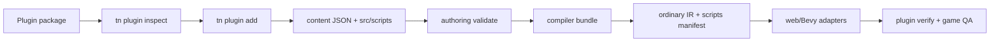
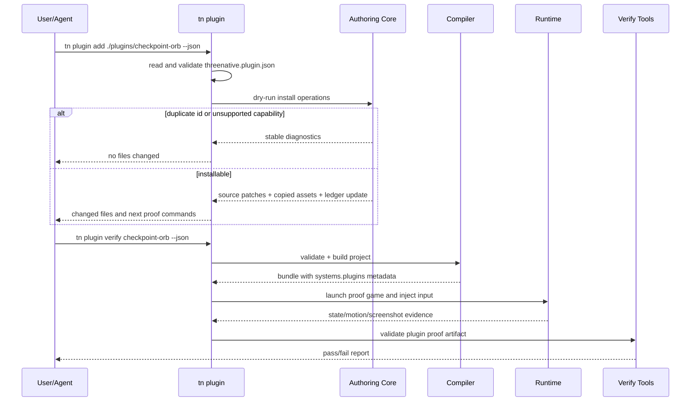

# PRD: Source-Backed Plugin System

Complexity: 10 -> HIGH mode

Score basis: +3 touches 10+ future files, +2 new plugin package/install system,
+2 multi-package changes across SDK/authoring/compiler/CLI/runtime verification,
+1 external package-style resolution, +1 sample game/template evidence, +1 docs
and release gates.

## 1. Context

**Problem:** ThreeNative has IR-level plugin composition metadata, but there is
no user-facing plugin system that lets a reusable feature package contribute
structured source, scripts, assets, and verification evidence to a game.

**Goal:** Let users install bounded, source-backed ThreeNative plugins into a
project, compile them through the existing source -> IR pipeline, and prove a
sample plugin works inside a playable game.

**Non-goals:**

- Do not load arbitrary runtime-native, Vite, Bevy, Node, DOM, filesystem, or
  renderer-handle plugins from game code.
- Do not let plugins mutate generated `dist/**`, emitted bundle JSON, or
  `scripts.bundle.js` as source.
- Do not create a second scene-authoring implementation outside the shared
  authoring operation registry and compiler.
- Do not make web-only plugin behavior appear portable. Unsupported surfaces
  must fail with stable diagnostics.
- Do not use plugin installation to bypass asset provenance, licensing, or
  generated-game visual quality gates.

**Files Analyzed:**

- `AGENTS.md`
- `docs/PRDs/README.md`
- `docs/PRDs/done/other/game-authoring-loop-hardening.md`
- `docs/PRDs/done/other/authoring-mcp-wrapper.md`
- `packages/ir/src/systems.ts`
- `packages/ir/src/systemsValidation.ts`
- `packages/compiler/src/emit/systems.ts`
- `packages/compiler/src/emit/bundle.ts`
- `packages/compiler/src/emit/capabilities.ts`
- `packages/runtime-web-three/src/systems/context.ts`
- `packages/runtime-web-three/src/runtimeGameplayHost.ts`
- `runtime-bevy/crates/threenative_runtime/src/systems_context.rs`
- `runtime-bevy/crates/threenative_runtime/src/runtime_gameplay_host.rs`
- `packages/cli/src/index.ts`
- `packages/cli/src/commands/game.ts`
- `packages/cli/src/commands/playtest.ts`
- `tools/verify/src/gameProductionGate.ts`
- `tools/verify/src/templateProductionGate.ts`
- `package.json`

**Current Behavior:**

- `systems.ir.json` supports `plugins` and `pluginGroups` as composition
  metadata, and both web and Bevy expose that metadata to portable scripts.
- Runtime dynamic plugins are explicitly unsupported through
  `TN_RUNTIME_DYNAMIC_PLUGIN_UNSUPPORTED`.
- Script modules are bundled from project source into `scripts.bundle.js`, with
  provenance recorded in `scripts.manifest.json`.
- CLI scene operations can attach scripts and mutate structured source, but
  there is no `tn plugin ...` front door.
- Generated-game gates already require build, playtest, screenshot, QA, and
  release evidence, but they do not know how to prove an installed plugin.

## Pre-Planning Findings

No secret configuration is required. The feature is developer-facing and should
work from package files, CLI commands, structured source documents, compiler
diagnostics, and verification artifacts.

**How will this feature be reached?**

- [x] Entry points identified:
  - `tn plugin inspect <specifier> --json`
  - `tn plugin add <specifier> [--project <path>] --json`
  - `tn plugin remove <plugin-id> [--project <path>] --json`
  - `tn plugin verify <plugin-id> [--project <path>] --json`
  - `tn authoring validate --json`
  - `tn build` / `pnpm build`
  - `tn playtest --project <path> ... --json`
  - `tn game qa --project <path> --run-proof --json`
  - `pnpm verify:conformance`
- [x] Caller files identified:
  - `packages/cli/src/index.ts`
  - new `packages/cli/src/commands/plugin.ts`
  - `packages/authoring/src/operations.ts`
  - `packages/compiler/src/emit/bundle.ts`
  - `packages/compiler/src/emit/systems.ts`
  - `packages/compiler/src/scripts/bundle.ts`
  - `packages/ir/src/systems.ts`
  - `packages/ir/src/systemsValidation.ts`
  - `packages/runtime-web-three/src/systems/context.ts`
  - `runtime-bevy/crates/threenative_runtime/src/systems_context.rs`
  - `tools/verify/src/gameProductionGate.ts`
- [x] Registration/wiring needed:
  - CLI command registration and help output.
  - Plugin manifest schema and validation.
  - Authoring operations for install/remove.
  - Compiler merge path into existing IR documents.
  - Script bundler provenance for plugin-owned modules.
  - Verification gate support for sample-plugin proof artifacts.
  - Docs/status/parity updates when capability gates change.

**Is this user-facing?**

- [x] YES. Developers and agents install plugins through CLI commands and see
  plugin effects in authored games.
- [ ] NO.

**Full user flow:**

1. User runs `tn plugin inspect @threenative/plugin-checkpoint-orb --json`.
2. CLI validates `threenative.plugin.json`, reports source fragments, scripts,
   assets, capabilities, install operations, license/provenance, and proof plan.
3. User runs `tn plugin add @threenative/plugin-checkpoint-orb --project . --json`.
4. CLI applies deterministic authoring operations to `content/**/*.json`,
   copies or references approved plugin assets, and records the install in
   `threenative.plugins.json`.
5. User runs `tn authoring validate --json` and `pnpm build`.
6. Compiler emits ordinary IR, `systems.plugins`/`pluginGroups`,
   `scripts.manifest.json` provenance, and capability tags.
7. User runs `tn plugin verify checkpoint-orb --project . --json` or
   `tn game qa --project . --run-proof --json`.
8. Verification launches the game, triggers the plugin behavior through normal
   input/gameplay, and records JSON plus screenshot/motion artifacts proving the
   plugin changed visible game state.

## 2. Solution

**Approach:**

- Define a versioned `threenative.plugin.json` manifest for portable plugin
  packages. A plugin may contribute structured-source fragments, source
  operation recipes, script modules/exports, assets, UI fragments, ECS schemas,
  capabilities, diagnostics, and proof commands.
- Add project-local `threenative.plugins.json` as the durable install ledger.
  It records plugin id/version/source/provenance, enabled features, applied
  source paths, asset provenance, and proof expectations.
- Implement `tn plugin inspect/add/remove/verify` as thin orchestration over
  existing authoring operations, validation, build, playtest, and game QA.
- Extend compiler merging so plugin-installed source becomes normal project
  source before IR emit. Runtime adapters consume only the emitted bundle and
  keep dynamic runtime plugin handles unsupported.
- Preserve current `systems.plugins`/`pluginGroups` as runtime-visible
  composition metadata, and extend validation only where needed for richer
  source provenance.
- Ship a sample `checkpoint-orb` plugin and a sample game proving that the
  plugin installs, compiles, runs, and visibly affects gameplay.



**Key Decisions:**

- [x] Plugins are source contributions, not dynamic runtime modules.
- [x] Plugin installation must be deterministic, reversible, and provenance
  preserving.
- [x] Plugin scripts use the same portable script restrictions as project
  scripts.
- [x] Plugin assets must carry source URL/provenance/license metadata when
  copied into a project.
- [x] Plugin proof must run through an actual game loop, not only schema tests.
- [x] Runtime adapters may expose plugin metadata to scripts but must not expose
  private runtime handles.

**Data Changes:**

- Add JSON schema for `threenative.plugin.json`.
- Add project install ledger `threenative.plugins.json`.
- Extend `scripts.manifest.json` and authoring provenance with plugin source
  identity where the existing structure cannot already represent it.
- Add plugin proof artifact shape under `artifacts/plugin-system/`.
- No database changes.

**Risks:**

- Plugin source merging can cause duplicate IDs or conflicting component/schema
  definitions. Mitigate with preflight diagnostics and no partial writes on
  failed install.
- Removal can be unsafe if a user edited plugin-installed source. Mitigate with
  install hashes, changed-file diagnostics, and explicit `--force` only for
  known-safe generated plugin source.
- Package resolution can be flaky or unsafe if it shells out broadly. Start
  with local path/workspace package support, then add registry support with
  allowlisted manifest reads.
- Sample plugin visual proof can become brittle. Use objective state and
  playtest assertions plus screenshot artifacts rather than screenshot-perfect
  matching.
- Bevy parity may lag the first web sample. Capability docs must label any
  web-only proof until native evidence exists.

## 3. Sequence Flow



## 4. Execution Phases

#### Phase 1: Plugin Manifest Contract - Users can inspect a portable plugin before installing it.

**Files (max 5):**

- `packages/ir/src/pluginManifest.ts` - manifest types and validation helpers.
- `packages/ir/src/pluginManifest.test.ts` - accepted/rejected manifest cases.
- `packages/ir/schemas/threenative.plugin.schema.json` - public JSON schema.
- `packages/cli/src/commands/plugin.ts` - `inspect` command.
- `packages/cli/src/index.ts` - command registration and help.

**Implementation:**

- [ ] Define manifest fields: `schema`, `version`, `id`, `name`, `pluginVersion`,
  `entry`, `sourceFragments`, `scripts`, `assets`, `capabilities`,
  `installOperations`, `proof`, `license`, and `provenance`.
- [ ] Reject unsupported fields with stable diagnostics.
- [ ] Require every script entry to name module/export, schedule, reads/writes,
  queries, commands, services, and owning plugin id.
- [ ] Require every asset entry to include path, role, license/provenance, and
  copy/reference policy.
- [ ] Implement `tn plugin inspect <specifier> --json` for local path and
  workspace package specifiers.

**Tests Required:**

| Test File | Test Name | Assertion |
|-----------|-----------|-----------|
| `packages/ir/src/pluginManifest.test.ts` | `should accept portable plugin manifests with source scripts assets and proof` | valid manifest returns no diagnostics |
| `packages/ir/src/pluginManifest.test.ts` | `should reject dynamic runtime handles in plugin manifests` | `runtimePlugin`, `nativeHandle`, or DOM fields emit stable diagnostics |
| `packages/cli/src/commands/plugin.test.ts` | `should inspect local plugin manifest as json` | command reports id/version/capabilities/proof without mutating project |

**User Verification:**

- Action: run `tn plugin inspect examples/plugins/checkpoint-orb --json`.
- Expected: JSON lists plugin source fragments, scripts, assets, capabilities,
  diagnostics, and proof commands.

#### Phase 2: Install Ledger and Authoring Operations - A plugin installs through durable source changes.

**Files (max 5):**

- `packages/authoring/src/pluginOperations.ts` - install/remove operation
  planning and application.
- `packages/authoring/src/pluginOperations.test.ts` - dry-run, install, remove,
  and conflict coverage.
- `packages/cli/src/commands/plugin.ts` - `add` and `remove` command paths.
- `packages/cli/src/commands/plugin.test.ts` - command output and no-partial
  writes.
- `docs/contracts/plugin-system.md` - source-backed plugin contract.

**Implementation:**

- [ ] Add `threenative.plugins.json` ledger with installed plugin id, version,
  specifier, source hash, file hashes, assets, capabilities, and proof status.
- [ ] Apply plugin install operations through shared authoring mutations where
  possible; write direct JSON only for source documents with no existing
  operation.
- [ ] Copy or reference assets according to manifest policy while preserving
  source URL, provenance URL, origin, license evidence, review status, and
  conversion notes.
- [ ] Refuse install when source IDs, component schemas, system names, script
  exports, UI IDs, or asset IDs collide.
- [ ] Implement removal only when installed files still match ledger hashes, or
  return a diagnostic that names changed files.

**Tests Required:**

| Test File | Test Name | Assertion |
|-----------|-----------|-----------|
| `packages/authoring/src/pluginOperations.test.ts` | `should install plugin source through deterministic operations` | content files and ledger match expected stable JSON |
| `packages/authoring/src/pluginOperations.test.ts` | `should reject install when plugin ids collide with project source` | no files are written and diagnostic names the collision |
| `packages/cli/src/commands/plugin.test.ts` | `should remove unmodified plugin install safely` | ledger and plugin-owned files are removed |
| `packages/cli/src/commands/plugin.test.ts` | `should refuse remove when user edited plugin file` | diagnostic names changed file and suggests manual resolution |

**User Verification:**

- Action: run `tn plugin add examples/plugins/checkpoint-orb --project examples/plugin-checkpoint-orb --json`.
- Expected: changed-file list includes `threenative.plugins.json`, structured
  source documents, script source, and asset metadata; `tn authoring validate
  --project examples/plugin-checkpoint-orb --json` passes.

#### Phase 3: Compiler, Script, and IR Provenance - Installed plugin source emits ordinary portable IR.

**Files (max 5):**

- `packages/compiler/src/emit/bundle.ts` - include installed plugin source in
  bundle graph and provenance.
- `packages/compiler/src/emit/systems.ts` - emit `systems.plugins` and
  `pluginGroups` from installed plugin ownership.
- `packages/compiler/src/scripts/bundle.ts` - record plugin script provenance.
- `packages/compiler/src/emit/plugin-system.test.ts` - bundle shape and
  diagnostics.
- `packages/ir/src/systemsValidation.ts` - validation for plugin-owned system
  metadata, if new fields are needed.

**Implementation:**

- [ ] Load installed plugin ledger during project compilation.
- [ ] Merge plugin source into the same declaration graph as project source,
  preserving source-path diagnostics.
- [ ] Emit existing `systems.plugins`/`pluginGroups` for plugin-owned systems.
- [ ] Preserve plugin id/version/source path in `scripts.manifest.json` or a
  companion provenance document.
- [ ] Reject plugin scripts that use unsupported imports, ambient APIs,
  undeclared reads/writes, undeclared commands, or unsupported services.

**Tests Required:**

| Test File | Test Name | Assertion |
|-----------|-----------|-----------|
| `packages/compiler/src/emit/plugin-system.test.ts` | `should emit installed plugin systems as ordinary systems ir` | `systems.ir.json` includes systems, plugin metadata, and group metadata |
| `packages/compiler/src/emit/plugin-system.test.ts` | `should preserve plugin script source provenance in scripts manifest` | manifest names plugin id/version/source module/export/hash |
| `packages/compiler/src/emit/plugin-system.test.ts` | `should reject plugin script ambient runtime access` | diagnostics match portable script restrictions |
| `packages/ir/src/systems.test.ts` | `should validate plugin groups reference installed plugin systems` | missing/duplicate references fail |

**User Verification:**

- Action: run `pnpm build` in the sample game after installing the plugin.
- Expected: `dist/**/systems.ir.json` contains the plugin declaration,
  `scripts.manifest.json` names the plugin source, and validation passes.

#### Phase 4: Runtime Context and Verification Gate - Plugin metadata is visible and proofable without dynamic runtime loading.

**Files (max 5):**

- `packages/runtime-web-three/src/systems/context.ts` - plugin context view
  updates, if provenance fields are added.
- `runtime-bevy/crates/threenative_runtime/src/systems_context.rs` - native
  context parity for plugin metadata.
- `tools/verify/src/pluginSystemGate.ts` - proof artifact validation.
- `tools/verify/src/pluginSystemGate.test.ts` - accepted/rejected proof cases.
- `tools/verify/src/cli/run.ts` - register `verify:plugin-system` gate.

**Implementation:**

- [ ] Ensure scripts can call `ctx.plugins.has`, `ctx.plugins.list`, and
  `ctx.plugins.group` for installed plugins in both web and Bevy contexts.
- [ ] Keep `runtimePlugin`, native handles, DOM handles, and renderer handles
  unsupported with explicit diagnostics.
- [ ] Define `artifacts/plugin-system/<plugin-id>.json` with install state,
  build result, runtime evidence, gameplay assertion, screenshot path, and
  diagnostics.
- [ ] Add `pnpm verify:plugin-system` through verify tools and package scripts.
- [ ] Make the gate reject proof that only validates schemas without running a
  game.

**Tests Required:**

| Test File | Test Name | Assertion |
|-----------|-----------|-----------|
| `packages/runtime-web-three/src/systems/context.test.ts` | `should expose installed plugin metadata to portable scripts` | context returns plugin id/version/group without handles |
| `runtime-bevy/crates/threenative_runtime/tests/systems_context.rs` | `systems context should include installed plugin metadata` | native snapshot matches web metadata |
| `tools/verify/src/pluginSystemGate.test.ts` | `should reject plugin proof without gameplay evidence` | missing playtest/screenshot/state assertion fails |
| `tools/verify/src/pluginSystemGate.test.ts` | `should accept plugin proof with build playtest and screenshot evidence` | valid sample proof passes |

**User Verification:**

- Action: run `pnpm verify:plugin-system`.
- Expected: gate passes only when plugin proof artifacts include installed
  source, emitted IR, runtime metadata, playtest evidence, and screenshot or
  recording artifacts.

#### Phase 5: Sample Checkpoint Orb Plugin - A real game proves the plugin works.

**Files (max 5):**

- `examples/plugins/checkpoint-orb/threenative.plugin.json` - sample plugin
  manifest.
- `examples/plugins/checkpoint-orb/src/scripts/checkpointOrb.ts` - portable
  plugin gameplay script.
- `examples/plugins/checkpoint-orb/content/**` - plugin source fragments and
  asset metadata.
- `examples/plugin-checkpoint-orb/**` - playable sample game using the plugin.
- `docs/workflows/plugin-system.md` - author/user workflow and proof commands.

**Implementation:**

- [ ] Create `checkpoint-orb` as the canonical sample plugin.
- [ ] Plugin behavior: spawn or install a visible orb/checkpoint, detect player
  overlap or proximity through declared queries/services, update a score or
  checkpoint resource, play declared feedback, and open/enable a visible goal
  marker.
- [ ] The sample game must start without the plugin goal complete, allow the
  player to trigger the plugin, visibly update HUD/world state, and support
  fail/retry or reset.
- [ ] Add package scripts in the sample game for authoring validation, build,
  plugin verification, playtest, screenshot, `tn game qa --run-proof`, and
  release proof.
- [ ] Include evidence under
  `examples/plugin-checkpoint-orb/artifacts/plugin-system/`.

**Tests Required:**

| Test File | Test Name | Assertion |
|-----------|-----------|-----------|
| `packages/cli/src/commands/plugin.test.ts` | `should verify checkpoint orb plugin in sample game` | command writes passing plugin proof artifact |
| `tools/verify/src/pluginSystemGate.test.ts` | `should require checkpoint orb gameplay state change` | proof fails when score/checkpoint state is unchanged |
| `tools/verify/src/gameProductionGate.test.ts` | `should accept plugin sample game with plugin proof evidence` | generated-game style QA includes plugin proof step |

**User Verification:**

- Action: run:

```bash
tn plugin add examples/plugins/checkpoint-orb --project examples/plugin-checkpoint-orb --json
tn authoring validate --project examples/plugin-checkpoint-orb --json
pnpm --dir examples/plugin-checkpoint-orb build
tn plugin verify checkpoint-orb --project examples/plugin-checkpoint-orb --json
tn game qa --project examples/plugin-checkpoint-orb --run-proof --json
pnpm verify:plugin-system
pnpm verify:conformance
```

- Expected: all commands pass; proof artifacts show the plugin installed,
  emitted into IR, exposed through runtime context, triggered in-game, changed
  visible state, and produced screenshot or motion evidence.

#### Phase 6: Docs, Status, and Release Gate - Plugin support is discoverable and release-visible.

**Files (max 5):**

- `docs/STATUS.md` - supported/partial plugin capability status.
- `docs/bevy-feature-parity.md` - web/native evidence anchors.
- `packages/ir/capabilities/threenative.capabilities.json` - plugin capability
  metadata.
- `package.json` - `verify:plugin-system` script.
- `docs/PRDs/README.md` - move/index PRD when complete.

**Implementation:**

- [ ] Document plugin system support level and unsupported boundaries.
- [ ] Link web and Bevy evidence for plugin metadata/context parity.
- [ ] Add plugin capabilities to the exported capability manifest.
- [ ] Include `verify:plugin-system` in release or focused capability gates as
  appropriate.
- [ ] Move this PRD to `docs/PRDs/done` only after sample-game proof passes.

**Tests Required:**

| Test File | Test Name | Assertion |
|-----------|-----------|-----------|
| `scripts/check-distribution-contract.test.mjs` | `should include plugin schemas and capabilities in distribution` | package exports include plugin manifest schema and capability metadata |
| `tools/verify/src/release.test.ts` | `should include plugin system gate when plugin capability is supported` | release gate invokes or reports plugin evidence |

**User Verification:**

- Action: run `pnpm check:docs`, `pnpm verify:plugin-system`, and
  `pnpm verify:release`.
- Expected: docs links resolve, plugin capability is release-visible, and release
  evidence includes sample-game plugin proof.

## 5. Checkpoint Protocol

Each phase requires an automated `prd-work-reviewer` checkpoint before the next
phase starts. Phase 5 also requires manual visual review of the sample game
screenshot or recording because gameplay proof must show the plugin effect in a
real scene.

For each completed phase, run focused tests first, then the narrowest relevant
gate:

- Manifest/IR/compiler changes: package tests plus `pnpm verify:conformance`.
- CLI install/remove changes: CLI command tests plus `pnpm check:docs` when help
  or docs change.
- Runtime context changes: web runtime tests, Bevy tests, and
  `pnpm verify:conformance`.
- Sample game changes: `tn plugin verify`, `tn game qa --run-proof`, and
  `pnpm verify:plugin-system`.

## 6. Verification Strategy

**Unit Tests:**

- Manifest validation accepts valid portable plugins and rejects unsupported
  dynamic runtime surfaces.
- Authoring operations install/remove deterministically and refuse unsafe
  partial writes.
- Compiler tests prove plugin-installed source emits normal IR and script
  provenance.

**Integration Tests:**

- CLI tests inspect, add, remove, and verify local plugins in a temporary
  project.
- Runtime tests prove web and Bevy expose equivalent plugin metadata.
- Verify-tool tests reject proof without in-game behavior.

**Game Proof:**

- Sample game proof must include authoring validation, build, plugin verify,
  playtest input, visible state change, screenshot or recording artifact, game
  QA report, and release/check-doc evidence.
- The final sample plugin cannot be considered done if it only passes schema or
  bundle validation; it must be verified working in game.

**Evidence Required:**

- [ ] `tn plugin inspect examples/plugins/checkpoint-orb --json`
- [ ] `tn plugin add examples/plugins/checkpoint-orb --project examples/plugin-checkpoint-orb --json`
- [ ] `tn authoring validate --project examples/plugin-checkpoint-orb --json`
- [ ] `pnpm --dir examples/plugin-checkpoint-orb build`
- [ ] `tn plugin verify checkpoint-orb --project examples/plugin-checkpoint-orb --json`
- [ ] `tn game qa --project examples/plugin-checkpoint-orb --run-proof --json`
- [ ] `pnpm verify:plugin-system`
- [ ] `pnpm verify:conformance`
- [ ] `pnpm check:docs`

## 7. Acceptance Criteria

- [ ] `threenative.plugin.json` schema, types, validation, docs, and package
  exports exist.
- [ ] `tn plugin inspect/add/remove/verify` commands are registered, documented,
  tested, and return stable JSON diagnostics.
- [ ] Plugin installs are durable structured-source changes with provenance in
  `threenative.plugins.json`.
- [ ] Plugin install/remove operations are deterministic and avoid partial
  writes on validation failure.
- [ ] Plugin scripts are bundled under the same portable scripting restrictions
  as project scripts.
- [ ] Compiler output includes plugin systems, groups, capabilities, and script
  provenance without requiring runtime dynamic plugins.
- [ ] Web and Bevy runtime contexts expose equivalent plugin metadata to
  portable scripts.
- [ ] Runtime dynamic/native/web handle plugins remain explicitly unsupported
  with stable diagnostics.
- [ ] `verify:plugin-system` exists and rejects proof that does not include
  in-game behavior.
- [ ] The `checkpoint-orb` sample plugin installs into
  `examples/plugin-checkpoint-orb`.
- [ ] The sample game proves the plugin working in game through build,
  playtest, visible state change, screenshot or recording, `tn game qa
  --run-proof`, and `verify:plugin-system`.
- [ ] `pnpm verify:conformance`, `pnpm check:docs`, and release-relevant gates
  pass.
- [ ] `docs/STATUS.md`, `docs/bevy-feature-parity.md`, capability metadata, and
  workflow docs reflect the final support level.
