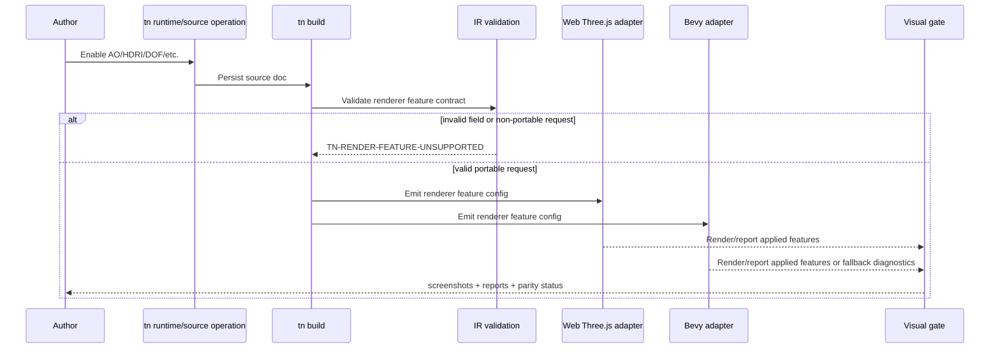

# PRD: Portable Photoreal Rendering and Post-Processing

Complexity: 11 -> HIGH mode

Score basis: +2 expands renderer/source/IR contracts, +2 spans SDK/IR/compiler/web/Bevy/CLI/editor/docs, +2 requires cross-runtime visual parity proof, +2 introduces optional web adapter dependencies, +1 capability/fallback diagnostics, +1 asset/material fixture coverage, +1 release-gate evidence.

## 1. Context

**Problem:** Three.js has strong ecosystem packages for expensive-looking rendering (`postprocessing`, `n8ao`, `realism-effects`, `threepipe`), but ThreeNative must not expose Three.js-only concepts as authored game APIs. João's requirement is explicit: if a visual capability is useful for the Three.js runtime, the same authored feature should be supported in Bevy too, or should produce an honest unsupported/fallback diagnostic.

**Goal:** Add a portable rendering/post-processing capability layer for photoreal-ish scenes: HDRI/environment lighting, tone mapping/exposure, ambient occlusion, bloom, depth of field, screen-space reflections, motion blur, and diagnostics for higher-risk effects such as SSGI. Web may use Three.js ecosystem libraries internally; authored source and IR remain engine-neutral.

**Non-goals:**

- Do not expose `threepipe`, `n8ao`, `realism-effects`, `postprocessing`, R3F, or drei concepts in SDK/source/IR.
- Do not make ThreeNative's web runtime a `threepipe` app or viewer framework.
- Do not claim Bevy parity for features that only render in Three.js.
- Do not block basic rendering on optional heavyweight post-processing packages.
- Do not vendor third-party asset binaries as part of this PRD.
- Do not implement arbitrary custom post-processing shaders here; see `portable-shader-material-parity.md` and advanced visual boundary PRDs.

**Files Analyzed:**

- `AGENTS.md`
- `package.json`
- `docs/PRDs/README.md`
- `docs/PRDs/done/advanced-visual-effects-lighting-material-depth.md`
- `docs/PRDs/done/other/camera-post-processing-boundaries.md`
- `docs/PRDs/done/beautiful-defaults-render-look-profiles.md`
- `docs/PRDs/done/other/render-look-shadow-bloom-polish.md`
- `docs/PRDs/done/other/imported-gltf-visual-fidelity.md`
- `docs/PRDs/done/other/dense-scene-lod-texture-delivery.md`
- `docs/data/asset-sources.seed.jsonl`
- `docs/data/polyhaven-asset-sources.snapshot.json`
- `docs/data/ambientcg-asset-sources.snapshot.json`
- `docs/data/os3a-asset-sources.snapshot.json`
- `scripts/build-asset-source-catalog.mjs`
- `packages/runtime-web-three/src/rendering/applyRenderLookProfile.ts`
- `packages/runtime-web-three/src/mapWorld.ts`

**Current Behavior:**

- Core render-look profile support exists for `parity` and `balanced`; web currently applies bounded bloom/color-grading defaults for `balanced` and falls back for unsupported profiles.
- The asset-source catalog already ships queryable Poly Haven, ambientCG, and Open Source 3D Assets/ToxSam-style records through generated snapshots and SQLite.
- Runtime/source docs already cover broad material texture/PBR fields, environment scene data, light probes, render targets, bloom, anti-aliasing, color grading metadata, and visual parity gates.
- Advanced effects such as DOF, motion blur, SSR, SSGI, richer AO, advanced PBR depth/parallax, and custom post passes are still diagnostic or boundary work.
- Web Three.js already has GLTF/Draco loader plumbing. Meshopt/KTX2 and texture-delivery concerns are tracked separately by dense scene / imported glTF fidelity work.

## Pre-Planning Findings

The safe architecture is a portable capability contract:

```txt
structured source / SDK renderer declarations
  -> validated IR renderer feature contract
  -> compiler capability requirements
  -> web Three.js adapter implementation or diagnostic
  -> Bevy adapter implementation or diagnostic
  -> visual proof gate comparing authored intent, reports, and screenshots
```

Useful ecosystem roles:

- `postprocessing`: candidate web-only implementation detail for composer/effects plumbing.
- `n8ao`: candidate web ambient occlusion implementation detail, because AO is a high-value/low-complexity realism win.
- `realism-effects`: experimental web-only candidate for SSR, motion blur, TRAA, and SSGI. Must stay feature-flagged until stable and parity-mapped.
- `threepipe`: reference for render-look profiles/plugin ergonomics only. Do not adopt it as the core runtime base.
- `drei`/R3F helpers: mostly not core-engine dependencies; mine portable ideas only.

**How will this feature be reached?**

- [x] Entry point identified:
  - SDK/source renderer declarations.
  - `tn runtime set-rendering ...` or equivalent CLI/source operations.
  - `tn build`, runtime preview, `tn screenshot`, `tn verify --json`.
- [x] Caller file identified:
  - SDK renderer helpers.
  - IR renderer/material/environment schemas and validators.
  - Compiler capability emit.
  - `packages/runtime-web-three` renderer setup and post-processing layer.
  - Bevy runtime renderer adapter/capability reports.
  - verify tooling and docs.
- [x] Registration/wiring needed:
  - Add renderer feature fields and validation.
  - Add capability diagnostics and target-profile metadata.
  - Add optional web dependencies only after a minimal proof spike.
  - Add Bevy implementation/fallback reports.
  - Add web+Bevy visual fixtures and release evidence when promoted.

**Is this user-facing?**

- [x] YES. Authors will declare visual features and expect them to render or fail honestly across both runtimes.
- [ ] NO.

**Full user flow:**

1. Author creates or edits a runtime/rendering source document.
2. Author enables a portable feature such as ambient occlusion, HDRI environment lighting, bloom, DOF, SSR, or motion blur.
3. `tn build` validates the feature against supported schema and target profile.
4. Web runtime renders the feature through Three.js/post-processing internals or emits a stable diagnostic.
5. Bevy runtime renders the equivalent feature or emits a stable diagnostic with the same authored feature ID.
6. Verification captures web and Bevy screenshots, runtime reports, diagnostics, and a contact sheet.
7. Release docs state whether the feature is `promoted`, `fallback`, `experimental`, or `unsupported` per runtime.

## 2. Solution

**Approach:**

Promote photoreal rendering in layers. Start with capabilities that are useful, bounded, and likely implementable in both runtimes. Keep unstable Three.js-only effects behind diagnostics or experimental flags until Bevy has an equivalent story.

### Portable renderer feature shape

Add or extend renderer config with engine-neutral fields:

```json
{
  "renderer": {
    "renderLook": {
      "profile": "balanced",
      "overrides": {
        "exposure": 1.0,
        "saturation": 1.05,
        "contrast": 0.08,
        "bloomIntensity": 0.25
      }
    },
    "environmentLighting": {
      "enabled": true,
      "mode": "hdri",
      "asset": "studio-hdri",
      "intensity": 1.0,
      "rotationY": 0
    },
    "ambientOcclusion": {
      "enabled": true,
      "mode": "screen-space",
      "radius": 3.0,
      "intensity": 1.2,
      "quality": "medium"
    },
    "screenSpaceReflections": {
      "enabled": true,
      "quality": "medium",
      "roughnessLimit": 0.45
    },
    "depthOfField": {
      "enabled": true,
      "focusDistance": 12,
      "aperture": 0.04,
      "maxBlur": 0.015
    },
    "motionBlur": {
      "enabled": false,
      "shutterAngle": 0.5
    },
    "screenSpaceGlobalIllumination": {
      "enabled": false,
      "quality": "low",
      "experimental": true
    }
  }
}
```

### Feature promotion tiers

| Feature | Initial status | Web implementation target | Bevy implementation target | Promotion bar |
|---|---|---|---|---|
| Tone mapping / exposure | promoted | existing Three.js renderer config | Bevy tonemapping/exposure | existing color/lighting gate remains stable |
| HDRI/environment lighting | candidate | PMREM/environment texture | Bevy environment-map/IBL path or diagnostic | reflective-object side-by-side proof |
| Bloom | promoted-ish | existing/postprocessing bloom | Bevy bloom | emissive fixture side-by-side proof |
| Ambient occlusion | P0 candidate | `n8ao` or `postprocessing` SSAO | Bevy SSAO/equivalent | corner/contact-shadow fixture proof |
| Depth of field | P1 candidate | `postprocessing` DOF | Bevy DOF/equivalent | foreground/background focus fixture proof |
| SSR | P2 experimental | `realism-effects`/custom SSR | Bevy SSR or diagnostic | wet-floor/metal fixture proof or honest unsupported |
| Motion blur | P2 experimental | `realism-effects` motion blur | Bevy motion blur or diagnostic | moving-object contact sheet proof |
| SSGI | diagnostic-first | `realism-effects` experimental | unsupported diagnostic until proven | no promotion without Bevy parity story |

### Diagnostics

Every unsupported or downgraded feature must produce stable machine-readable diagnostics:

```txt
TN-RENDER-FEATURE-FALLBACK
feature: renderer.ambientOcclusion
runtime: bevy
requestedMode: screen-space
appliedMode: disabled
reason: Bevy adapter has no promoted SSAO implementation for this target profile.
suggestion: Disable ambientOcclusion or choose a target profile that supports it.
```

Required diagnostic families:

- `TN-RENDER-FEATURE-FALLBACK`
- `TN-RENDER-FEATURE-UNSUPPORTED`
- `TN-RENDER-FEATURE-EXPERIMENTAL`
- `TN-RENDER-FEATURE-TARGET-BUDGET`
- `TN-RENDER-FEATURE-ASSET-MISSING`

### Web dependency policy

- Add web adapter dependencies only behind a small spike and focused proof.
- Dependencies must remain runtime-web-three implementation details.
- Authored source, IR, CLI, and editor must not mention package names.
- If a package is too unstable, keep its feature diagnostic-only and document why.

Recommended order:

1. Add `postprocessing` plumbing only if existing internal pass structure is insufficient.
2. Add `n8ao` first for AO.
3. Evaluate `realism-effects` for SSR/motion blur/SSGI under an experimental target profile.
4. Do not adopt `threepipe` as runtime base; use it only as reference material.

**Key Decisions:**

- [x] Library/framework choices: portable source/IR contract first; web libraries are adapter-private; Bevy equivalent/fallback is mandatory.
- [x] Error-handling strategy: unsupported capabilities produce stable diagnostics, not silent visual drift.
- [x] Reused utilities: existing screenshot/video proof, visual parity gates, render-look reports, asset-source catalog, material/environment source docs.

**Data Changes:**

- Extend runtime/rendering source docs and IR schemas with bounded renderer feature fields.
- Extend capability reports with per-feature runtime support state.
- No database migration. Asset catalog data is already generated from snapshots; this PRD consumes it for fixtures.

## 3. Sequence Flow



## 4. Implementation Plan

### Phase 1 — Inventory and contract slice

- [ ] Inventory existing renderer/runtime config fields and source operations.
- [ ] Define renderer feature schema for `environmentLighting`, `ambientOcclusion`, `depthOfField`, `screenSpaceReflections`, `motionBlur`, and `screenSpaceGlobalIllumination`.
- [ ] Add capability status enum: `promoted`, `experimental`, `fallback`, `unsupported`.
- [ ] Add IR validation for bounded numeric ranges and incompatible combinations.
- [ ] Add compiler/runtime report types for requested/applied feature status.

### Phase 2 — HDRI/PBR fixture path

- [ ] Use asset catalog records for Poly Haven HDRIs and ambientCG PBR materials.
- [ ] Add fixture source docs referencing catalog-selected HDRI/material assets.
- [ ] Validate that assets remain bundle-local after import; runtime adapters must not fetch arbitrary network resources at render time.
- [ ] Add missing diagnostics for missing/invalid HDRI or texture-set assets.

### Phase 3 — Ambient occlusion first pass

- [ ] Add portable `renderer.ambientOcclusion` source/IR fields.
- [ ] Implement web AO through the simplest stable path (`n8ao` preferred if spike passes; otherwise existing/postprocessing SSAO).
- [ ] Implement Bevy AO or a stable fallback diagnostic if Bevy support cannot be promoted yet.
- [ ] Add AO fixture with corners/contact surfaces and side-by-side screenshot report.

### Phase 4 — Bloom/HDRI/render-look consolidation

- [ ] Reconcile existing bloom/color grading/render-look code with the new feature report shape.
- [ ] Ensure `balanced` profile remains deterministic and can explain applied tone mapping/exposure/bloom.
- [ ] Add reflective PBR/HDRI showroom fixture.
- [ ] Update docs and parity tables.

### Phase 5 — DOF/SSR/motion blur experimental lanes

- [ ] Add source/IR fields with explicit `experimental` gating where needed.
- [ ] Add web implementation spikes for DOF and motion blur.
- [ ] Add Bevy implementation or fallback diagnostics.
- [ ] Keep SSR and SSGI diagnostic-first unless both runtimes have a credible proof path.

### Phase 6 — CLI/editor operations

- [ ] Add `tn runtime set-rendering` flags or registry operations for promoted fields.
- [ ] Add editor inspector controls for promoted fields only.
- [ ] Hide experimental fields unless target profile explicitly opts in.
- [ ] Ensure operation payloads preserve source ownership/provenance.

### Phase 7 — Verification and release evidence

- [ ] Add focused visual gate: `pnpm verify:rendering-photoreal` or integrate into existing render-look gate.
- [ ] Capture web+Bevy screenshots, reports, diagnostics, and contact sheets.
- [ ] Add fixtures:
  - `photoreal-hdri-showroom`
  - `photoreal-ao-corner-test`
  - `photoreal-bloom-emissive-test`
  - `photoreal-dof-depth-test`
  - `photoreal-reflective-wet-floor` if SSR becomes real
- [ ] Update `docs/STATUS.md`, `docs/bevy-feature-parity.md`, and PRD index.

## 5. Acceptance Criteria

- [ ] Authored renderer features are source/IR-level and do not expose Three.js package names.
- [ ] Web and Bevy runtimes both report requested/applied feature state.
- [ ] Unsupported Bevy/Web features emit stable diagnostics rather than silently dropping visual intent.
- [ ] AO has a real cross-runtime fixture or is explicitly documented as fallback per runtime.
- [ ] HDRI/environment lighting uses catalog-selected assets and proves reflective PBR output.
- [ ] Visual proof includes side-by-side web+Bevy screenshots and machine-readable reports.
- [ ] CLI/editor operations can mutate promoted fields without hand-editing generated bundles.
- [ ] Docs state which features are promoted, experimental, fallback, or unsupported.
- [ ] Release/focused verification catches accidental Three.js-only feature claims.

## 6. Risks and Pushback

- **Three.js library trap:** adopting `threepipe` or exposing `n8ao` concepts directly would make Bevy parity harder. Keep all library details adapter-private.
- **Visual parity overclaim:** AO/SSR/DOF will not pixel-match exactly across engines. Gate on authored intent, feature reports, and bounded visual regions, not full-frame identical screenshots.
- **Performance regression:** post-processing can be expensive. Target profiles need quality/budget metadata and default-off behavior for heavy effects.
- **Asset runtime leakage:** Poly Haven/ambientCG URLs are catalog/provenance sources, not runtime CDN dependencies. Imported fixtures should be bundle-local.
- **SSGI risk:** SSGI is attractive but likely too backend-specific. Treat it as experimental/diagnostic until a Bevy equivalent exists.

## 7. Verification Commands

Future implementation should prove itself with a focused subset before full release:

```bash
pnpm check:asset-sources
pnpm --filter @threenative/ir test
pnpm --filter @threenative/compiler test
pnpm --filter @threenative/runtime-web-three test
pnpm verify:render-look
pnpm verify:parity:push
pnpm verify:release
```

If new dependencies are added:

```bash
pnpm install
pnpm verify:pre-push
```

## 8. Open Questions

- Which Bevy version/API path should be treated as the first promoted SSAO/AO target?
- Should SSR remain entirely diagnostic until Bevy parity is available, or should it be allowed under an explicit web-only experimental target profile?
- Should `cinematic`/`stylized` render-look profiles become real profiles in this PRD or stay separate art-direction work?
- What target-profile performance budgets should gate AO/DOF/motion blur on mobile/webview?
