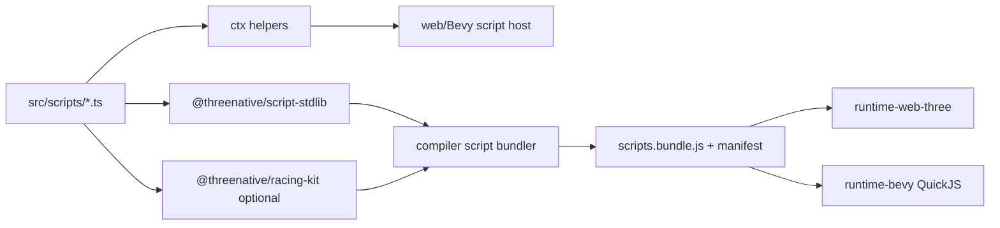
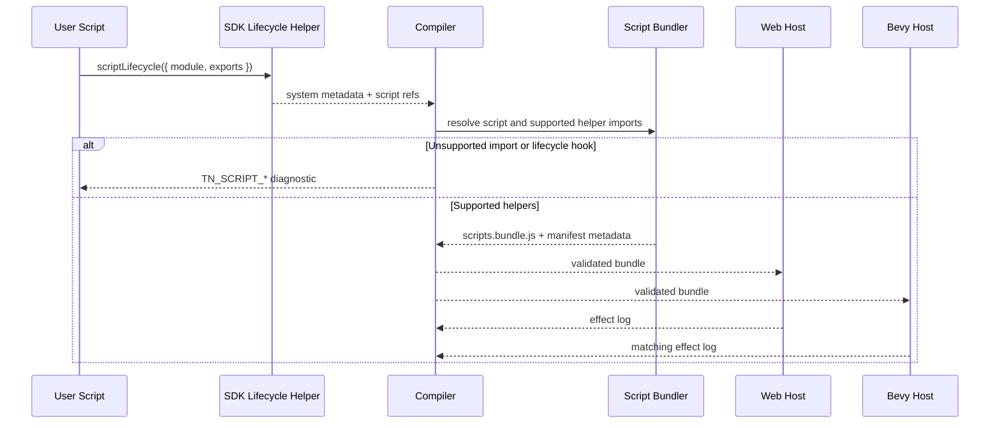

# PRD: Portable Scripting Ergonomics, Stdlib, and Lifecycle Facade

Complexity: 10 -> HIGH mode

Score basis: +3 touches 10+ future files, +2 adds new script helper package or
SDK module surface, +2 spans SDK/compiler/IR/runtime web/Bevy/docs/templates,
+1 requires script bundling/import diagnostics, +1 affects lifecycle authoring
semantics, +1 needs conformance and release-gate evidence.

## 1. Context

**Problem:** Non-trivial portable scripts are becoming bloated because each
script carries its own entity lookup, transform parsing, numeric guards, vector
math, quaternion math, input normalization, fixed-delta clamping, resource-state
defaults, and domain-specific helper code.

The rally script example that triggered this PRD embeds a small standard library
inside one gameplay function: `findEntity`, `vec3`, `number`, `round`, `clamp`,
`distance2d`, `yawRotation`, `yawFromRotation`, `lookAtQuaternion`,
`quaternionFromBasis`, `cross`, `normalize`, `onTrack`, `ovalPoint`, and HUD
formatting all live beside the actual driving behavior. The intended behavior is
valid, but the gameplay signal is buried under glue.

**Goal:** Make future `src/scripts/**/*.ts` modules small and readable by
promoting repeated portable helper patterns into three explicit layers:

```txt
1. Core script context ergonomics
   Entity lookup, typed resources, time/input conveniences, transform facade.

2. Portable script stdlib
   Pure math, vectors, quaternions, transforms, numeric guards, formatting.

3. Optional domain kits
   Racing/checkpoint/path helpers and similar game-specific packages.
```

Scripts should import helpers only through compiler-supported, portable,
deterministically bundled paths. Unsupported helpers must fail with stable
diagnostics before runtime.

**Non-goals:**

- Do not expose raw Three.js, Bevy, renderer, filesystem, DOM, worker, timer,
  platform, or native runtime handles to scripts.
- Do not make every helper part of the core script context.
- Do not add racing, checkpoint, path-following, or HUD concepts to the engine
  scripting API.
- Do not allow arbitrary npm dependencies in portable scripts.
- Do not introduce an editor-only or runtime-only script source format.
- Do not rename or remove the existing `startup`, `fixedUpdate`, `update`, and
  `postUpdate` schedule contract.
- Do not clone Unity semantics wholesale. Lifecycle helpers may be familiar, but
  they must lower to ThreeNative's existing portable schedules and scene
  lifecycle contracts.

**Files Analyzed:**

- `AGENTS.md`
- `packages/AGENTS.md`
- `docs/PRDs/README.md`
- `docs/PRDs/done/other/script-module-references-and-manifest.md`
- `docs/PRDs/done/other/scene-lifecycle-and-flow-contract.md`
- `docs/PRDs/done/v5/V5-11-game-authoring-ergonomics-refactor.md`
- `docs/PRDs/other/editor-ready-modular-authoring-and-scripting-architecture.md`
- `docs/contracts/scripting.md`
- `docs/contracts/scripting-api.md`
- `docs/STATUS.md`
- `packages/sdk/src/ecs/system.ts`
- `packages/sdk/src/index.ts`
- `packages/compiler/src/scene-document.ts`
- `packages/compiler/src/emit/bundle.ts`
- `package.json`

**Current Behavior:**

- Portable systems already run through `startup`, `fixedUpdate`, `update`, and
  `postUpdate` schedules.
- Script module references and `scripts.manifest.json` exist, but helper imports
  are currently rejected until real script helper bundling exists.
- `ISystemContext` exposes low-level primitives such as `ctx.query()`,
  `ctx.input.action/axis`, `ctx.resources.get/set`, `entity.get/patch/set`, and
  `ctx.time.dt/fixedDt`.
- Existing context APIs are portable but verbose for common game-script chores.
- Scene lifecycle services exist as `ctx.scenes.*`, but script authoring still
  reads as scheduled systems rather than familiar lifecycle-oriented modules.

## Pre-Planning Findings

No relevant `.env` or secret configuration is required.

**How will this feature be reached?**

- [x] Entry point identified:
  - user scripts under `src/scripts/**/*.ts`;
  - SDK system declarations that reference script modules/exports;
  - compiler script bundling and diagnostics;
  - web JavaScript and Bevy QuickJS scripting hosts;
  - structured-source starter and future examples/templates.
- [x] Caller files identified:
  - `packages/sdk/src/ecs/system.ts`
  - new SDK script context helper module, exported by `packages/sdk/src/index.ts`
  - new portable helper package or SDK subpath, for example
    `@threenative/script-stdlib`
  - `packages/compiler/src/scripts/*`
  - `packages/runtime-web-three/src/systems/*`
  - `runtime-bevy/crates/threenative_runtime/src/systems_*`
  - structured source system/script document emit paths in
    `packages/compiler/src/scene-document.ts`
- [x] Registration/wiring needed:
  - export supported helper APIs from public package entry points;
  - whitelist portable helper imports in script diagnostics;
  - bundle helper imports into `scripts.bundle.js` with source manifest entries;
  - implement matching context facade behavior in web and Bevy hosts;
  - add conformance fixtures and docs/status/parity evidence.

**Is this user-facing?**

- [x] YES. This is a public script authoring ergonomics feature.
- [ ] NO.

**Full user flow:**

1. User creates `src/scripts/rally.ts`.
2. Script imports pure helpers from the supported script stdlib and uses
   ergonomic context helpers.
3. Structured source or SDK system metadata references the module/export.
4. `tn authoring validate --json`, `tn scene proof ... --json`, or `pnpm run
   build` resolves helper imports, rejects unsupported imports/globals, emits
   `scripts.bundle.js`, and records source/helper metadata in
   `scripts.manifest.json`.
5. Web and Bevy execute the same bundle and produce matching effect logs.
6. User sees smaller scripts with the same runtime behavior.

## 2. Product Model

### Layer 1: Core script context ergonomics

Add small methods or facades on the existing script context. These helpers must
only compose existing context data and effects.

Target API shape:

```ts
const dt = ctx.time.fixedDelta({ fallback: 0.016, min: 0.001, max: 0.05 });

const { player, rival, camera } = ctx.entities.byId({
  player: "player.car",
  rival: "rival.car",
  camera: "camera.main",
});

const state = ctx.state("RallyState", {
  checkpoint: 0,
  hud: "",
  lap: 0,
  message: "Ready",
  rivalPhase: 0,
  speed: 0,
});

const steer = ctx.input.axis1("steer", {
  negative: "steer-left",
  positive: "steer-right",
});

const transform = player.transform();
const position = transform.positionOr(RALLY.start);
const yaw = transform.yawOr(RALLY.startYaw);
transform.setPose(next, Quat.fromYaw(yaw));
```

Rules:

- `ctx.entity(id)` and `ctx.entities.byId(map)` are lookup conveniences over
  stable script-facing entity IDs and query snapshots. Missing entities return
  `undefined`; they do not create entities.
- `ctx.state(key, defaults)` is a typed resource facade over
  `ctx.resources.get/set`. It must require declared resource write access where
  the existing effect validator requires it.
- `ctx.time.fixedDelta(...)` is a pure clamp/fallback helper over
  `ctx.time.fixedDt`, `ctx.time.dt`, and supplied bounds.
- `ctx.input.axis1(...)` combines an axis plus optional negative/positive
  action buttons and clamps to `[-1, 1]`.
- Entity transform helpers only read and patch the `Transform` component. They
  must use the same component write validation as manual `entity.patch`.

### Layer 2: Portable script stdlib

Add a supported importable helper surface for pure deterministic utilities:

```ts
import { NumberEx, Quat, TransformMath, Vec3 } from "@threenative/script-stdlib";

const next = Vec3.round(Vec3.add(position, Vec3.scale(forward, speed * dt)));
const rotation = Quat.lookAt(eye, target);
const yaw = TransformMath.yaw(transform.rotation, RALLY.startYaw);
```

Initial helper inventory:

- `NumberEx.clamp(value, min, max)`
- `NumberEx.finite(value, fallback)`
- `NumberEx.round(value, precision?)`
- `Vec3.from(value, fallback)`
- `Vec3.add/sub/scale/lerp/normalize/cross`
- `Vec3.distance2d(a, b)`
- `Vec3.round(value, precision?)`
- `Quat.fromYaw(yaw)`
- `Quat.yaw(rotation, fallback)`
- `Quat.lookAt(eye, target)`
- `TransformMath.position(value, fallback)`
- `TransformMath.yaw(rotation, fallback)`
- `TransformMath.pose({ position, yaw })`

Rules:

- Helpers must be pure, deterministic, dependency-free, and serializable through
  the script bundler.
- Helpers must not access the host context, resources, input, random, time,
  renderer, DOM, filesystem, network, platform APIs, or globals that are
  unsupported for portable scripts.
- Helper output precision policy must be explicit and shared across web/Bevy
  tests. Do not hide adapter-specific visual tuning in helper math.

### Layer 3: Optional domain kits

Game-specific helpers belong outside core scripting. A racing kit can exist, but
it must be opt-in and data-driven:

```ts
import { CheckpointRace, Track2D } from "@threenative/racing-kit";

const track = Track2D.loop({
  points: RALLY.checkpoints,
  width: 0.58,
});

const onTrack = track.contains2d(position);
const target = track.pointAtPhase(state.rivalPhase);
```

Rules:

- Racing helpers must not become core engine APIs.
- Domain kits must use the same portable helper import policy and bundling path.
- Domain kits must expose plain data and pure functions unless a separate PRD
  promotes a runtime service.

### Lifecycle facade

Add authoring helpers that make script modules read like lifecycle modules while
lowering to existing schedules and scene lifecycle contracts.

Target SDK authoring shape:

```ts
export const rallyLifecycle = scriptLifecycle({
  id: "rally",
  module: "src/scripts/rally.ts",
  scene: "arena",
  awake: "awakeRally",
  fixedUpdate: "fixedUpdateRally",
  update: "updateRally",
  lateUpdate: "lateUpdateRally",
  onEnter: "enterRally",
  onExit: "exitRally",
});
```

Lowering rules:

- `awake` lowers to a `startup` system scoped to the owning lifecycle scene when
  scene ownership is known.
- `fixedUpdate` lowers to `fixedUpdate`.
- `update` lowers to `update`.
- `lateUpdate` lowers to `postUpdate`.
- `onEnter` and `onExit` lower to scene lifecycle hooks or scene-service effects
  only where the existing scene lifecycle contract supports them. Unsupported
  lifecycle names must produce stable diagnostics.
- Lifecycle helpers create structured system metadata and script module/export
  references. They do not inline source code or generate hidden behavior.

The public schedules remain `startup`, `fixedUpdate`, `update`, and
`postUpdate`. Familiar lifecycle names are authoring conveniences only.

## 3. Solution

**Approach:**

- Promote only repeated, cross-game chores into the script context.
- Put pure math/transform/input-free utilities in a small importable stdlib.
- Keep game-domain behavior, such as racing tracks and checkpoints, in opt-in
  kits.
- Extend the script bundler/import validator so supported helper imports work
  and unsupported imports fail deterministically.
- Add lifecycle authoring helpers that lower to existing schedules instead of
  creating a parallel runtime lifecycle.



**Key Decisions:**

- [x] Use additive helpers; preserve existing low-level context APIs.
- [x] Prefer a narrow supported helper import allowlist over arbitrary npm
  dependencies.
- [x] Keep stdlib helpers pure and runtime-independent.
- [x] Treat lifecycle names as authoring aliases over existing schedules.
- [x] Reject unsupported helper imports, lifecycle hooks, ambient globals, and
  mutable module state with `TN_SCRIPT_*` diagnostics.

**Data Changes:** No new runtime IR document is required for the stdlib helpers.
Lifecycle facade work may add SDK metadata only if it lowers to existing
`systems.ir.json`, `scenes.ir.json`, and `scripts.manifest.json` fields. If new
fields become necessary, they must update `packages/ir`, docs, and
web/Bevy conformance in the same phase.

## 4. Sequence Flow



## 5. Execution Phases

#### Phase 1: Script Stdlib Bundling - Users can import pure portable helpers without copying math into every script.

**Files (max 5):**

- `packages/script-stdlib/package.json` - new package metadata if a separate
  package is chosen.
- `packages/script-stdlib/src/index.ts` - pure numeric/vector/quaternion helper
  exports.
- `packages/script-stdlib/src/index.test.ts` - deterministic helper tests.
- `packages/compiler/src/scripts/bundle.ts` - allow and bundle the helper
  import path.
- `packages/compiler/src/scripts/diagnostics.test.ts` - supported and rejected
  import diagnostics.

**Implementation:**

- [ ] Add pure helper implementations for `NumberEx`, `Vec3`, `Quat`, and
  `TransformMath`.
- [ ] Support `@threenative/script-stdlib` imports in source-referenced scripts.
- [ ] Keep arbitrary npm, relative helper imports outside the source module
  graph, DOM, Node, timers, network, and platform globals rejected.
- [ ] Record helper import metadata in `scripts.manifest.json` or equivalent
  diagnostics metadata.

**Tests Required:**

| Test File | Test Name | Assertion |
| --- | --- | --- |
| `packages/script-stdlib/src/index.test.ts` | `should compute yaw quaternions deterministically` | `Quat.fromYaw(Math.PI / 2)` matches expected rounded tuple. |
| `packages/script-stdlib/src/index.test.ts` | `should compute lookAt quaternions without host access` | `Quat.lookAt(eye, target)` returns finite values. |
| `packages/compiler/src/scripts/diagnostics.test.ts` | `should allow supported script stdlib imports` | Script with `@threenative/script-stdlib` builds. |
| `packages/compiler/src/scripts/diagnostics.test.ts` | `should reject unsupported script helper imports` | Arbitrary package import fails with stable `TN_SCRIPT_UNSUPPORTED_IMPORT`. |

**User Verification:**

- Action: Replace local `clamp`, `round`, `distance2d`, `yawRotation`, and
  `lookAtQuaternion` helpers in a script with stdlib imports.
- Expected: `pnpm run build` emits the same bundle behavior and no helper import
  diagnostic.

#### Phase 2: Core Context Ergonomics - Common entity, state, time, input, and transform access takes one line.

**Files (max 5):**

- `packages/sdk/src/ecs/system.ts` - extend `ISystemContext` and entity facade
  typings.
- `packages/runtime-web-three/src/systems/scriptContext.ts` - implement web
  host helpers over existing context primitives.
- `runtime-bevy/crates/threenative_runtime/src/systems_context.rs` - implement
  matching QuickJS host helper surface.
- `packages/runtime-web-three/src/systems/scriptContext.test.ts` - helper
  behavior and effect-validation tests.
- `runtime-bevy/crates/threenative_runtime/tests/systems_context.rs` - native
  helper parity tests.

**Implementation:**

- [ ] Add `ctx.entity(id)` and `ctx.entities.byId(map)`.
- [ ] Add `ctx.state(key, defaults)` resource facade with explicit save/commit
  semantics or automatic end-of-system persistence.
- [ ] Add `ctx.time.fixedDelta(options)`.
- [ ] Add `ctx.input.axis1(axis, buttons)`.
- [ ] Add entity `transform()` facade for `positionOr`, `yawOr`, `setPosition`,
  `setRotation`, and `setPose`.
- [ ] Ensure every write still flows through existing resource/component write
  validation.

**Tests Required:**

| Test File | Test Name | Assertion |
| --- | --- | --- |
| `packages/runtime-web-three/src/systems/scriptContext.test.ts` | `should look up entities by id deterministically` | Existing entity IDs map to facades and missing IDs are `undefined`. |
| `packages/runtime-web-three/src/systems/scriptContext.test.ts` | `should reject transform facade writes without declared Transform access` | Effect validator reports the same undeclared write diagnostic as manual patching. |
| `runtime-bevy/crates/threenative_runtime/tests/systems_context.rs` | `should expose matching context helper behavior in QuickJS` | Fixed trace matches web helper outputs. |

**User Verification:**

- Action: Rewrite the rally script's entity lookup, fixed delta, input steer,
  transform parsing, and state load/store to use context helpers.
- Expected: The script loses local plumbing helpers while patch/resource logs
  stay unchanged.

#### Phase 3: Lifecycle Authoring Facade - Script modules can declare familiar lifecycle exports without changing runtime schedules.

**Files (max 5):**

- `packages/sdk/src/scriptLifecycle.ts` - lifecycle helper that emits system
  declarations from module/export refs.
- `packages/sdk/src/scriptLifecycle.test.ts` - lowering and diagnostics tests.
- `packages/sdk/src/index.ts` - public export.
- `packages/compiler/src/scene-document.ts` - structured-source lowering support
  for lifecycle script declarations.
- `packages/compiler/src/scene-document.test.ts` - structured source lifecycle
  script proof.

**Implementation:**

- [ ] Add `scriptLifecycle(...)` with `awake`, `fixedUpdate`, `update`,
  `lateUpdate`, `onEnter`, and `onExit` export refs.
- [ ] Lower supported names to `startup`, `fixedUpdate`, `update`,
  `postUpdate`, and scene lifecycle metadata where available.
- [ ] Reject unknown lifecycle names and unsupported scene hook semantics with
  stable diagnostics.
- [ ] Preserve system IDs, source module/export refs, schedule ordering, reads,
  writes, services, commands, and scene ownership metadata.

**Tests Required:**

| Test File | Test Name | Assertion |
| --- | --- | --- |
| `packages/sdk/src/scriptLifecycle.test.ts` | `should lower lifecycle exports to portable schedules` | `awake`, `fixedUpdate`, `update`, and `lateUpdate` produce deterministic systems. |
| `packages/sdk/src/scriptLifecycle.test.ts` | `should reject unsupported lifecycle hooks` | Unsupported hook throws stable SDK diagnostic. |
| `packages/compiler/src/scene-document.test.ts` | `should lower structured lifecycle script refs` | Source document emits expected system metadata and script refs. |

**User Verification:**

- Action: Define a lifecycle module with `awakeRally`, `fixedUpdateRally`, and
  `lateUpdateRally`.
- Expected: `tn scene inspect --json` shows generated systems on existing
  schedules with source refs, not inline generated code.

#### Phase 4: Domain Kit Pilot and Template Proof - Racing behavior moves out of the engine API but remains reusable.

**Files (max 5):**

- `packages/racing-kit/package.json` - optional domain package metadata.
- `packages/racing-kit/src/index.ts` - `Track2D` and `CheckpointRace` pure
  helpers.
- `packages/racing-kit/src/index.test.ts` - track and checkpoint tests.
- `templates/structured-source-starter/src/scripts/rally.ts` - or a focused
  example script using the helper layers.
- `templates/structured-source-starter/content/**/*.json` - system/script refs
  if the template/example needs source updates.

**Implementation:**

- [ ] Add data-first racing helpers for looped paths, 2D containment, phase
  sampling, checkpoint progression, and HUD formatting if needed.
- [ ] Keep helpers pure and opt-in.
- [ ] Update one maintained example or template script to prove reduced script
  bloat.
- [ ] Do not add racing concepts to `ISystemContext`.

**Tests Required:**

| Test File | Test Name | Assertion |
| --- | --- | --- |
| `packages/racing-kit/src/index.test.ts` | `should sample loop tracks deterministically` | Phase values map to expected points. |
| `packages/racing-kit/src/index.test.ts` | `should detect off-track positions` | Positions inside/outside track width return expected booleans. |
| Template/example build test | `should build reduced rally script with domain kit imports` | Script bundle includes supported domain helper import and builds. |

**User Verification:**

- Action: Compare the old rally script against the updated script.
- Expected: Local helper count drops to near zero, and the remaining code reads
  as gameplay: input, drive, checkpoint, rival, camera, HUD.

#### Phase 5: Conformance, Docs, and Release Gate - The helper surface is documented and proven across web and Bevy.

**Files (max 5):**

- `docs/contracts/scripting-api.md` - promote supported helpers and lifecycle
  facade contract.
- `docs/contracts/scripting.md` - update helper import policy.
- `docs/STATUS.md` - add evidence anchor and current support note.
- `docs/bevy-feature-parity.md` - add parity/evidence anchor.
- `tools/verify/src/*` - focused helper/lifecycle conformance gate if existing
  gates are insufficient.

**Implementation:**

- [ ] Document the core/std/domain layering rule.
- [ ] Document supported helper import paths and rejected imports.
- [ ] Add web/Bevy fixed-trace conformance for stdlib, context helpers, and
  lifecycle lowering.
- [ ] Add docs checks so promoted helper APIs cannot drift from SDK/runtime
  implementation.
- [ ] Update release evidence anchors because this is a capability/release-gate
  change.

**Tests Required:**

| Test File | Test Name | Assertion |
| --- | --- | --- |
| Focused conformance fixture | `should match helper-driven script effects across web and Bevy` | Effect logs match for a script using stdlib and context helpers. |
| Docs check | `should keep scripting helper docs aligned` | API inventory matches exported helper names. |
| Release gate | `should include scripting helper evidence` | `pnpm verify:release` reports helper/lifecycle evidence. |

**User Verification:**

- Action: Run the documented useful loop on the updated example:
  `tn scene validate arena --json`, `tn scene proof arena --project . --json`,
  `pnpm run build`, and relevant focused gate.
- Expected: Validation, build, and web/Bevy proof pass with helper imports.

## 6. Verification Strategy

**Unit tests:**

- Pure stdlib math and data helpers.
- SDK lifecycle lowering.
- Context helper type/shape tests.
- Racing/domain helper data behavior.

**Integration tests:**

- Compiler script bundling accepts supported helper imports.
- Compiler diagnostics reject arbitrary imports and unsupported lifecycle hooks.
- Structured source system/script refs lower to existing system metadata.

**Runtime/conformance tests:**

- Web and Bevy fixed traces execute the same helper-driven script bundle.
- Effect logs match for entity lookup, transform facade writes, resource state,
  input axis helper, and lifecycle schedule lowering.

**Evidence required:**

- `pnpm --filter @threenative/sdk test`
- `pnpm --filter @threenative/compiler test -- --run scripts`
- `pnpm --filter @threenative/runtime-web-three test`
- Bevy runtime helper tests
- `pnpm verify:conformance`
- `pnpm check:docs`
- `pnpm verify:release` before marking the capability promoted

## 7. Acceptance Criteria

- [ ] Scripts can import `@threenative/script-stdlib` helpers through the real
  script bundling path.
- [ ] Unsupported imports still fail with stable `TN_SCRIPT_*` diagnostics.
- [ ] `ctx.entity`, `ctx.entities.byId`, `ctx.state`, `ctx.time.fixedDelta`,
  `ctx.input.axis1`, and transform facade helpers exist in web and Bevy hosts.
- [ ] All helper writes use the existing effect validation paths.
- [ ] Lifecycle facade declarations lower to existing portable schedules and
  source module/export refs.
- [ ] At least one rally-like script is rewritten to remove local standard
  library code while preserving effect logs.
- [ ] Optional racing helpers remain outside core scripting.
- [ ] Docs explain the three-layer rule: core context, stdlib, domain kit.
- [ ] `docs/STATUS.md` and `docs/bevy-feature-parity.md` are updated when the
  capability is implemented.
- [ ] Conformance and release gates include web/Bevy evidence for the promoted
  helper surface.

## 8. Open Questions

- Should `ctx.state(key, defaults)` auto-save at system return, or require an
  explicit `state.save()` call to avoid surprising resource writes?
- Should the stdlib be a separate `@threenative/script-stdlib` package or a
  public SDK subpath such as `@threenative/sdk/script`?
- Should domain kits be published packages, template-local helpers, or both?
- Should lifecycle facade names use familiar names (`awake`, `lateUpdate`) or
  ThreeNative-native names (`onStartup`, `onPostUpdate`) in public docs?
- What exact bundle manifest metadata should record helper package versions and
  imported symbols?
