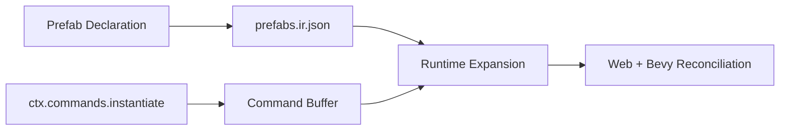
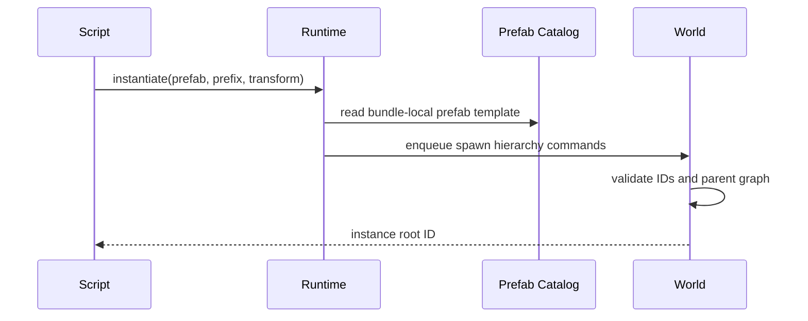

# Portable Scripting Runtime Prefabs And Hierarchy Commands

Complexity: 11 -> HIGH mode

## Complexity Assessment

- +3 touches 10+ implementation/test/docs files during implementation
- +2 adds runtime prefab instantiation system
- +2 includes complex hierarchy ownership and teardown logic
- +2 spans SDK, IR, compiler, web runtime, Bevy runtime, conformance, and docs
- +1 affects examples/templates
- +1 affects verification gates and parity status

## Context

**Problem:** Author-time prefab helpers exist, but scripts cannot instantiate
prefabs or mutate parent/child hierarchy at runtime.

**Files Analyzed:**

- `docs/contracts/scripting-api.md`
- `packages/sdk/src/prefab.ts`
- `packages/sdk/src/ecs/commands.ts`
- `packages/sdk/src/scene/Group.ts`
- `packages/compiler/src/emit/scene-to-world.ts`
- `packages/runtime-web-three/src/systems/effects.ts`
- `runtime-bevy/crates/threenative_runtime/src/systems_effects.rs`

**Current Behavior:**

- `primitiveActorPrefab` and `modelActorPrefab` expand at author/emit time.
- Command buffers support entity spawn/despawn and component add/remove/set.
- Scene `Group` lowers to hierarchy-only `SceneContainer` entities.
- Runtime prefab instantiation and child hierarchy commands are still missing.

## Checklist Coverage

- Runtime prefab instantiation.
- Script-driven parent/child hierarchy commands.
- Deterministic rendered entity ownership and recursive teardown.

## Impact

**Planned files touched by implementation:** SDK prefab/command APIs, IR command
schema/validator, compiler prefab catalog emit, web command effects, Bevy
command effects, conformance fixture, examples, docs, and verification tooling.

**Features affected:** gameplay spawning, transform hierarchy, renderer
reconciliation, recursive despawn, scene containers, and prefab metadata.

**Main risks:**

- Runtime prefab expansion can accidentally generate nondeterministic entity
  IDs.
- Hierarchy commands can create cycles or orphan rendered children.
- Web and Bevy renderer teardown must stay aligned for recursive despawn.

## Integration Points

**How will this feature be reached?**

- [x] Entry point identified: SDK prefab declarations, `ctx.commands.instantiate`
  or equivalent command, hierarchy command helpers, compiler bundle emit, web
  runtime, Bevy runtime, and conformance fixture.
- [x] Caller file identified: SDK command declarations, compiler prefab emit,
  runtime command/effect appliers, and renderer reconciliation code.
- [x] Registration/wiring needed: prefab catalog IR, command validation,
  runtime expansion, focused gate, docs/status updates.

**Is this user-facing?**

- [x] YES. Authors can spawn reusable actors and reparent entities from
  portable scripts.
- [ ] NO -> Internal/background feature.

**Full user flow:**

1. User declares a prefab with deterministic component/render metadata.
2. System calls runtime instantiate and optionally reparents the spawned root.
3. Runtime expands prefab into stable entity IDs and hierarchy.
4. Web and Bevy render and later despawn the hierarchy consistently.

## Solution

**Approach:**

- Emit a bundle-local prefab catalog with deterministic component templates and
  allowed child hierarchy.
- Add explicit command-buffer operations for instantiate, set parent, clear
  parent, and optional sibling order.
- Require caller-provided instance ID prefixes to avoid runtime ID generation.
- Validate hierarchy cycles, duplicate IDs, cross-scene ownership, and recursive
  despawn rules before mutation.



**Key Decisions:**

- [x] Library/framework choices: reuse existing command buffer and hierarchy
  component model.
- [x] Error-handling strategy: reject cycles, duplicate runtime IDs, unmanaged
  renderer ownership, and cross-scene parent violations.
- [x] Reused utilities: stable JSON emit, command validation, scene-to-world
  lowering, runtime effects.

**Data Changes:** Add prefab catalog/command IR fields; no database changes.

## Sequence Flow



## Execution Phases

#### Phase 1: Prefab Catalog Contract - Bundles carry runtime-instantiable prefab templates.

**Files (max 5):**

- `packages/sdk/src/prefab.ts` - runtime prefab metadata
- `packages/ir/src/types.ts` - prefab catalog types
- `packages/ir/src/validate.ts` - prefab validation
- `packages/compiler/src/emit/bundle.ts` - manifest/prefab entry emit
- `packages/ir/src/validate.test.ts` - accepted/rejected prefab coverage

**Implementation:**

- [ ] Define prefab catalog file and manifest entry.
- [ ] Require deterministic root ID, component templates, and child hierarchy.
- [ ] Reject unsupported runtime asset loading or backend handles.

**Tests Required:**

| Test File | Test Name | Assertion |
|-----------|-----------|-----------|
| `packages/ir/src/validate.test.ts` | `should accept runtime prefab catalog` | Valid prefab catalog passes. |
| `packages/ir/src/validate.test.ts` | `should reject cyclic prefab hierarchy` | Diagnostic code/path are stable. |

**User Verification:**

- Action: Run `pnpm --filter @threenative/ir test -- --run prefab`.
- Expected: Prefab validation passes.

#### Phase 2: SDK And Compiler Commands - Authors can declare instantiate and hierarchy commands.

**Files (max 5):**

- `packages/sdk/src/ecs/commands.ts` - command declarations
- `packages/sdk/src/ecs/system.ts` - context typings
- `packages/sdk/src/ecs/World.ts` - command serialization
- `packages/compiler/src/emit/systems.ts` - command emit
- `packages/compiler/src/emit/systems.test.ts` - compiler coverage

**Implementation:**

- [ ] Add instantiate/setParent/clearParent command declarations.
- [ ] Serialize command permissions into `systems.ir.json`.
- [ ] Validate command declarations against prefab catalog and world entities.

**Tests Required:**

| Test File | Test Name | Assertion |
|-----------|-----------|-----------|
| `packages/compiler/src/emit/systems.test.ts` | `should emit prefab instantiate command declarations` | Systems IR contains expected command. |
| `packages/sdk/src/ecs/World.test.ts` | `should serialize hierarchy command declarations` | World systems include stable command entries. |

**User Verification:**

- Action: Run SDK and compiler system tests.
- Expected: Command serialization is stable.

#### Phase 3: Runtime Expansion - Web and Bevy apply instantiate and hierarchy commands.

**Files (max 5):**

- `packages/runtime-web-three/src/systems/effects.ts` - web command application
- `packages/runtime-web-three/src/systems/runner.test.ts` - web tests
- `runtime-bevy/crates/threenative_runtime/src/systems_effects.rs` - native command application
- `runtime-bevy/crates/threenative_runtime/tests/systems_effects.rs` - native tests
- `runtime-bevy/crates/threenative_loader/src/lib.rs` - prefab loading DTOs

**Implementation:**

- [ ] Expand prefabs into deterministic entity IDs using caller prefix.
- [ ] Apply parent/child updates with cycle detection.
- [ ] Reconcile rendered objects and recursive teardown.

**Tests Required:**

| Test File | Test Name | Assertion |
|-----------|-----------|-----------|
| `packages/runtime-web-three/src/systems/runner.test.ts` | `should instantiate prefab hierarchy at command flush` | Web world has expected entities and parents. |
| `runtime-bevy/crates/threenative_runtime/tests/systems_effects.rs` | `should instantiate prefab hierarchy at command flush` | Bevy world has matching entities and parents. |

**User Verification:**

- Action: Run web runtime tests and native systems effects tests.
- Expected: Runtime expansion is identical.

#### Phase 4: Conformance And Docs - Runtime prefabs are evidence-backed.

**Files (max 5):**

- `packages/ir/fixtures/conformance/runtime-prefabs-hierarchy/game.bundle/world.ir.json` - fixture
- `packages/ir/fixtures/conformance/runtime-prefabs-hierarchy/game.bundle/systems.ir.json` - fixture
- `packages/ir/fixtures/conformance/fixture-catalog.json` - catalog entry
- `docs/contracts/scripting-api.md` - status update
- `docs/bevy-feature-parity.md` - checklist update

**Implementation:**

- [ ] Add fixture instantiating and reparenting a renderable prefab.
- [ ] Compare web/native command and hierarchy observations.
- [ ] Update docs to mark runtime prefab and hierarchy commands implemented.

**Tests Required:**

| Test File | Test Name | Assertion |
|-----------|-----------|-----------|
| `packages/ir/src/conformance.test.ts` | `should validate runtime prefab hierarchy fixture` | Fixture validates and is cataloged. |

**User Verification:**

- Action: Run `pnpm verify:conformance` and `pnpm check:docs`.
- Expected: Fixture and docs pass.

## Checkpoint Protocol

After each phase, spawn the `prd-work-reviewer` agent with:

```txt
Review checkpoint for phase [N] of PRD at docs/PRDs/other/portable-scripting-runtime-prefabs-hierarchy.md
```

Continue only after PASS. Manual verification is required after Phase 3 because
rendered hierarchy ownership should be inspected in web and Bevy traces.

## Verification Strategy

- Unit: SDK/IR command and prefab validation tests.
- Integration: compiler emit, web command flush, Bevy command flush.
- Conformance: shared runtime-prefabs-hierarchy fixture.
- Release: `pnpm verify:conformance` plus docs gate.
