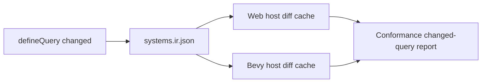
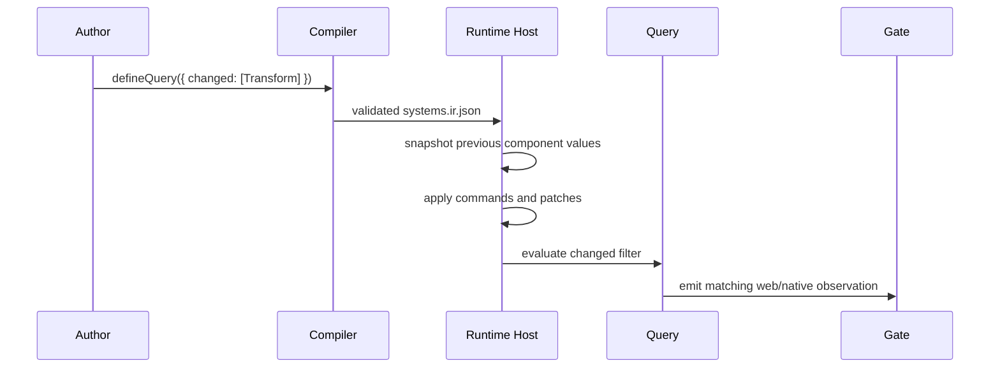

# Portable Scripting Runtime Query Diffing

Complexity: 10 -> HIGH mode

## Complexity Assessment

- +3 touches 10+ implementation/test/docs files during implementation
- +2 adds runtime diff state across web and Bevy hosts
- +2 includes complex state and deterministic ordering logic
- +2 spans SDK, IR, compiler, web runtime, Bevy runtime, conformance, and docs
- +1 affects verification gates and parity documentation

## Context

**Problem:** `ctx.query({ changed: [...] })` currently relies on explicit
fixed-trace change metadata; hidden runtime diffing is still missing.

**Files Analyzed:**

- `docs/contracts/scripting-api.md`
- `docs/bevy-feature-parity.md`
- `packages/sdk/src/ecs/query.ts`
- `packages/sdk/src/ecs/system.ts`
- `packages/ir/src/systems.ts`
- `packages/ir/src/validate.ts`
- `packages/runtime-web-three/src/systems/context.ts`
- `runtime-bevy/crates/threenative_runtime/src/systems_host.rs`

**Current Behavior:**

- Query filtering supports `with`, `without`, `changed`, `orderBy`, `offset`,
  and `limit`.
- Existing changed queries read explicit authored/runtime metadata such as
  `__changed` or `Changed`.
- Web and Bevy do not yet infer component changes from previous runtime
  snapshots.
- The docs still mark hidden runtime diffing as missing.

## Checklist Coverage

- Hidden runtime diffing for changed queries.
- Deterministic component-change windows across startup, fixed update, update,
  and post-update.
- Stable diagnostics for unsupported broad/deep diff requests.

## Impact

**Planned files touched by implementation:** SDK query typings, IR systems
schema/validator, compiler emit, web systems context/runner, Bevy systems
context/host, conformance fixtures, verify tooling, `docs/STATUS.md`,
`docs/bevy-feature-parity.md`, and `docs/contracts/scripting-api.md`.

**Features affected:** query filtering, command-buffer component mutation,
resource/event windows, runtime host state snapshots, and conformance evidence.

**Main risks:**

- Deep object comparison can become expensive or nondeterministic if not
  normalized.
- Diff windows can diverge between web and Bevy if command flush timing is not
  specified.
- Existing explicit fixed-trace metadata must remain supported for fixtures and
  deterministic tests.

## Integration Points

**How will this feature be reached?**

- [x] Entry point identified: `defineQuery({ changed })`, `ctx.query(...)`,
  emitted `systems.ir.json`, web system runner, Bevy QuickJS host, and
  `pnpm verify:conformance`.
- [x] Caller file identified: SDK query declarations, compiler system emit,
  `createSystemContext`, native system context snapshot, and runtime host
  runners.
- [x] Registration/wiring needed: validator rules, snapshot cache ownership,
  conformance fixture, focused verify gate, docs/status updates.

**Is this user-facing?**

- [x] YES. Authors can query components changed by runtime mutation without
  manually writing `__changed` metadata.
- [ ] NO -> Internal/background feature.

**Full user flow:**

1. User declares a system query with `changed: [Transform]`.
2. `tn build` emits validated query metadata.
3. Runtime snapshots component values before and after command/effect flush.
4. A later system receives only entities whose declared component changed in
   the active window.
5. User runs conformance and sees matching web/Bevy changed-query reports.

## Solution

**Approach:**

- Define a component-level diff window per schedule stage and command flush.
- Compare canonical structured component values after validation-normalized
  serialization, not object identity or backend handles.
- Preserve explicit `__changed`/`Changed` metadata as a fixture override, with
  runtime diffing used when metadata is absent.
- Reject unsupported diff selectors, wildcard/deep-path diffing, and backend
  component handle comparisons.



**Key Decisions:**

- [x] Library/framework choices: reuse existing structured IR values and stable
  JSON helpers instead of adding a new diff library.
- [x] Error-handling strategy: validator diagnostics for unsupported diff
  selectors and runtime diagnostics for malformed changed metadata.
- [x] Reused utilities: existing query normalization, system effect logs,
  conformance reports, and bundle validation.

**Data Changes:** Extend systems runtime metadata and conformance observations;
no database changes.

## Sequence Flow



## Execution Phases

#### Phase 1: Contract And Validation - Changed queries declare the runtime diff mode.

**Files (max 5):**

- `packages/sdk/src/ecs/query.ts` - expose runtime-diff option if needed
- `packages/ir/src/systems.ts` - IR metadata/type updates
- `packages/ir/src/validate.ts` - accepted/rejected diff validation
- `packages/ir/src/systems.test.ts` - IR validator coverage
- `docs/contracts/scripting-api.md` - contract wording

**Implementation:**

- [ ] Specify whether changed queries always use runtime diff fallback or an
  explicit `mode`.
- [ ] Validate component names and reject deep-path/wildcard changed selectors.
- [ ] Preserve existing explicit metadata behavior.

**Tests Required:**

| Test File | Test Name | Assertion |
|-----------|-----------|-----------|
| `packages/ir/src/systems.test.ts` | `should accept runtime changed query metadata` | Valid systems IR has no diagnostics. |
| `packages/ir/src/systems.test.ts` | `should reject unsupported changed query selectors` | Diagnostic code and path are stable. |

**User Verification:**

- Action: Run `pnpm --filter @threenative/ir test -- --run systems`.
- Expected: Accepted and rejected changed-query tests pass.

#### Phase 2: Web Runtime Diffing - Web queries use deterministic component snapshots.

**Files (max 5):**

- `packages/runtime-web-three/src/systems/context.ts` - changed-query diff cache
- `packages/runtime-web-three/src/systems/runner.ts` - snapshot lifecycle
- `packages/runtime-web-three/src/systems/effects.ts` - command/patch flush hook
- `packages/runtime-web-three/src/systems/context.test.ts` - unit coverage
- `packages/runtime-web-three/src/systems/runner.test.ts` - integration coverage

**Implementation:**

- [ ] Snapshot declared component values by entity ID and component name.
- [ ] Update snapshots after command-buffer flush with stable ordering.
- [ ] Ensure pagination/order are applied after changed filtering.

**Tests Required:**

| Test File | Test Name | Assertion |
|-----------|-----------|-----------|
| `packages/runtime-web-three/src/systems/context.test.ts` | `should filter changed entities from runtime snapshots` | Only changed entity is returned. |
| `packages/runtime-web-three/src/systems/runner.test.ts` | `should apply changed filters before pagination` | Result order/window is deterministic. |

**User Verification:**

- Action: Run `pnpm --filter @threenative/runtime-web-three test -- --run systems`.
- Expected: Changed-query diff tests pass.

#### Phase 3: Bevy Host And Conformance - Native changed-query results match web.

**Files (max 5):**

- `runtime-bevy/crates/threenative_runtime/src/systems_context.rs` - snapshot context
- `runtime-bevy/crates/threenative_runtime/src/systems_host.rs` - QuickJS changed query
- `runtime-bevy/crates/threenative_runtime/tests/systems_host.rs` - native coverage
- `packages/ir/fixtures/conformance/runtime-query-diffing/game.bundle/world.ir.json` - fixture
- `packages/ir/fixtures/conformance/runtime-query-diffing/game.bundle/systems.ir.json` - fixture

**Implementation:**

- [ ] Implement equivalent snapshot comparison in native host data.
- [ ] Add shared conformance fixture that mutates and then queries changed
  components.
- [ ] Compare canonical web/native query reports.

**Tests Required:**

| Test File | Test Name | Assertion |
|-----------|-----------|-----------|
| `runtime-bevy/crates/threenative_runtime/tests/systems_host.rs` | `systems_host_should_filter_runtime_changed_queries` | Native result matches fixture. |
| `packages/ir/src/conformance.test.ts` | `should include runtime query diffing fixture` | Fixture is in catalog and validates. |

**User Verification:**

- Action: Run `pnpm verify:conformance`.
- Expected: Runtime query diffing fixture passes with matching web/Bevy output.

#### Phase 4: Gate And Docs - The capability is release visible.

**Files (max 5):**

- `tools/verify/src/cli/run.ts` - focused gate registration
- `package.json` - public script alias if needed
- `docs/STATUS.md` - current support entry
- `docs/bevy-feature-parity.md` - checklist row update
- `docs/contracts/scripting-api.md` - final support status

**Implementation:**

- [ ] Add or wire a focused changed-query gate into release verification.
- [ ] Update docs to mark hidden runtime diffing implemented.
- [ ] Record artifact paths and residual limits.

**Tests Required:**

| Test File | Test Name | Assertion |
|-----------|-----------|-----------|
| `tools/verify/src/cli/run.test.ts` | `should register runtime query diffing gate` | Gate is invokable and writes report. |

**User Verification:**

- Action: Run `pnpm check:docs` and the focused gate.
- Expected: Docs drift checks pass and focused evidence exists.

## Checkpoint Protocol

After each phase, spawn the `prd-work-reviewer` agent with:

```txt
Review checkpoint for phase [N] of PRD at docs/PRDs/other/portable-scripting-runtime-query-diffing.md
```

Continue only after PASS. Manual verification is required after Phase 3 because
web/native conformance output must be inspected for changed-query ordering.

## Verification Strategy

- Unit: SDK/IR validation and query filtering tests.
- Integration: web runner and Bevy QuickJS host tests.
- Conformance: shared runtime-query-diffing fixture.
- Release: focused gate plus `pnpm verify:conformance`.
