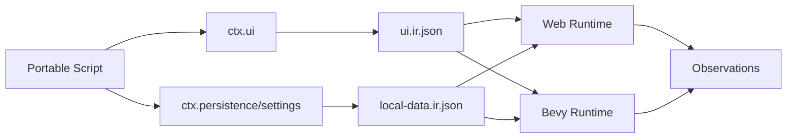
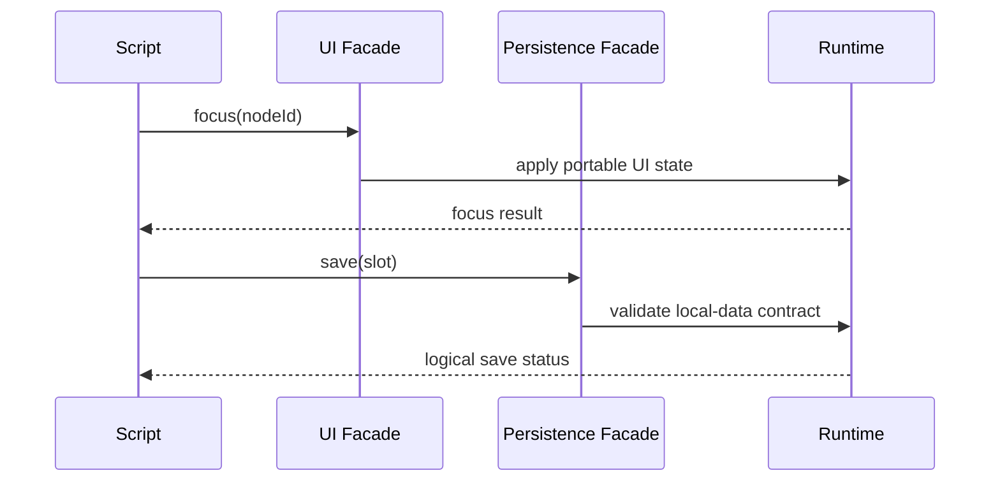

# Portable Scripting UI, Persistence, And Settings Facades

Complexity: 13 -> HIGH mode

## Complexity Assessment

- +3 touches 10+ implementation/test/docs files during implementation
- +2 adds script UI service facade
- +2 adds script persistence/settings facades
- +2 includes focus/input, durable state, and reload semantics
- +2 spans SDK, IR, compiler, web runtime, Bevy runtime, conformance, and docs
- +1 requires visual/accessibility verification
- +1 affects release/diagnostic evidence and parity status

## Context

**Problem:** Retained UI and persistence/settings IR are promoted, but scripts
still lack bounded `ctx.ui`, `ctx.persistence`, and `ctx.settings` facades.

**Files Analyzed:**

- `docs/contracts/scripting-api.md`
- `docs/contracts/ui.md`
- `packages/sdk/src/ui.ts`
- `packages/sdk/src/persistence.ts`
- `packages/ir/src/ui.test.ts`
- `packages/ir/src/persistence.test.ts`
- `packages/runtime-web-three/src/ui/navigation.ts`
- `packages/runtime-web-three/src/systems/services/persistence.ts`
- `runtime-bevy/crates/threenative_runtime/src/ui.rs`
- `runtime-bevy/crates/threenative_runtime/src/persistence.rs`

**Current Behavior:**

- Retained UI, rich text, navigation traces, accessibility metadata, and debug
  reports exist as structured UI IR/runtime evidence.
- Persistence, save slots, settings, autosave, migrations, and reload policy
  exist as structured local-data IR/runtime evidence.
- Systems service names reserve persistence/settings operations.
- Scripts cannot issue general UI commands or save/load/settings commands.

## Checklist Coverage

- UI command/focus/input script APIs.
- General `ctx.persistence` and `ctx.settings` facades.
- Stable diagnostics for DOM/native UI handles, filesystem/cloud/account
  storage, arbitrary webview access, and platform storage handles.

## Impact

**Planned files touched by implementation:** SDK UI/persistence/system context
APIs, IR UI/persistence/system schemas and validators, compiler emit, web UI
and persistence services, Bevy UI and persistence services, conformance
fixtures, visual/accessibility evidence, docs, and verification tooling.

**Features affected:** UI focus, activation, disabled/value state, UI actions,
save slots, settings, autosave restore, reload, local data, system services,
diagnostics, and release evidence.

**Main risks:**

- UI commands can become DOM/native specific if the facade is not data-only.
- Web and Bevy focus order can drift when layout or disabled state changes.
- Persistence APIs can accidentally expose filesystem/cloud/platform details.
- Save/load timing can become nondeterministic if scripts mutate world state
  during command flush.

## Integration Points

**How will this feature be reached?**

- [x] Entry point identified: retained UI declarations, `definePersistence`,
  system service declarations, `ctx.ui.*`, `ctx.persistence.*`,
  `ctx.settings.*`, web/Bevy UI runtimes, web/Bevy persistence services,
  `pnpm verify:persistence-reload`, and focused UI/conformance gates.
- [x] Caller file identified: SDK UI/persistence modules, SDK system context,
  compiler emit, runtime system contexts, UI runtimes, persistence services.
- [x] Registration/wiring needed: service names, validation, event routing,
  focus state ownership, logical storage adapter, conformance fixtures,
  docs/status updates.

**Is this user-facing?**

- [x] YES. Authors can drive HUD/menu focus and save/load/settings behavior
  from portable scripts.
- [ ] NO -> Internal/background feature.

**Full user flow:**

1. User declares retained UI nodes, actions, persisted state, and settings.
2. System calls `ctx.ui.focus("play")`,
   `ctx.persistence.save("slot.auto")`, or
   `ctx.settings.set("audio.master", 0.6)`.
3. Runtime validates node IDs, slot IDs, setting keys, and value shapes.
4. Web and Bevy update UI/logical storage and return matching plain-data
   results without exposing DOM, native widget, filesystem, or cloud handles.

## Solution

**Approach:**

- Add a small `ctx.ui` facade for focus, activation, value/disabled state, and
  event reads.
- Add `ctx.persistence` and `ctx.settings` facades over declared local-data IR
  only.
- Express all operations as stable IDs and plain payloads.
- Keep arbitrary webview DOM, native widgets, filesystem paths, cloud/account
  storage, and platform handles diagnostic-only.



**Key Decisions:**

- [x] Library/framework choices: reuse retained UI IR, navigation traces,
  local-data IR, persistence services, and reload reports.
- [x] Error-handling strategy: reject DOM/native handles, unsupported UI node
  mutation, raw paths, URLs, cloud IDs, platform storage handles, and undeclared
  keys with stable diagnostics.
- [x] Reused utilities: UI validation, accessibility reports, input action
  mapping, local-data validation, migration diagnostics, service effect logs.

**Data Changes:** Add UI/persistence/settings service payloads and result
observations; no database changes.

## Sequence Flow



## Execution Phases

#### Phase 1: UI Facade Contract - Scripts address UI by stable node IDs.

**Files (max 5):**

- `packages/sdk/src/ui.ts` - UI command/action types
- `packages/sdk/src/ecs/system.ts` - `ctx.ui` typing
- `packages/ir/src/systems.ts` - UI service names
- `packages/ir/src/validate.ts` - UI service validation
- `packages/ir/src/ui.test.ts` - accepted/rejected tests

**Implementation:**

- [ ] Define `ui.focus`, `ui.activate`, `ui.setDisabled`, `ui.setValue`, and
  `ui.read` or equivalent bounded APIs.
- [ ] Require node IDs and declared event/action schemas.
- [ ] Reject DOM handles, native widget handles, webview selectors, and
  unsupported node mutation.

**Tests Required:**

| Test File | Test Name | Assertion |
|-----------|-----------|-----------|
| `packages/ir/src/ui.test.ts` | `should accept declared script UI services` | Valid services pass. |
| `packages/ir/src/ui.test.ts` | `should reject DOM selector UI command` | Diagnostic code/path are stable. |

**User Verification:**

- Action: Run IR UI tests.
- Expected: UI facade contract is validated.

#### Phase 2: UI Runtime Parity - Web and Bevy apply UI commands through retained UI state.

**Files (max 5):**

- `packages/runtime-web-three/src/ui/navigation.ts` - web focus/action state
- `packages/runtime-web-three/src/systems/context.ts` - web `ctx.ui` facade
- `runtime-bevy/crates/threenative_runtime/src/ui.rs` - native UI command application
- `runtime-bevy/crates/threenative_runtime/src/systems_host.rs` - native QuickJS facade
- `runtime-bevy/crates/threenative_runtime/tests/ui.rs` - native UI tests

**Implementation:**

- [ ] Apply focus/value/disabled commands using UI node IDs in both runtimes.
- [ ] Emit deterministic focus/action/value observations.
- [ ] Preserve accessibility metadata and stable event ordering.
- [ ] Keep DOM elements and native widget references private.

**Tests Required:**

| Test File | Test Name | Assertion |
|-----------|-----------|-----------|
| `packages/runtime-web-three/src/ui/navigation.test.ts` | `should apply script focus command` | Focus order/current focus match expected node. |
| `runtime-bevy/crates/threenative_runtime/tests/ui.rs` | `should apply script focus command` | Native focus trace matches expected node. |
| `runtime-bevy/crates/threenative_runtime/tests/systems_host.rs` | `systems_host_should_expose_ui_facade` | QuickJS script writes expected UI report. |

**User Verification:**

- Action: Run web UI tests and native UI/systems host tests.
- Expected: UI command observations match.

#### Phase 3: Persistence And Settings Contract - Scripts access declared local data only.

**Files (max 5):**

- `packages/sdk/src/persistence.ts` - facade typings/helpers
- `packages/sdk/src/ecs/system.ts` - persistence/settings context typing
- `packages/ir/src/systems.ts` - service names/result types
- `packages/ir/src/validate.ts` - validation and diagnostics
- `packages/ir/src/persistence.test.ts` - accepted/rejected tests

**Implementation:**

- [ ] Define `persistence.save/load/listSlots/delete` and
  `settings.get/set/export/import` context APIs.
- [ ] Validate slot IDs, setting keys, schema versions, and allowed value
  shapes.
- [ ] Reject raw paths, URLs, platform handles, and undeclared keys.

**Tests Required:**

| Test File | Test Name | Assertion |
|-----------|-----------|-----------|
| `packages/ir/src/persistence.test.ts` | `should accept script persistence services for declared slots` | Valid services pass. |
| `packages/ir/src/persistence.test.ts` | `should reject undeclared settings key from script service` | Diagnostic code/path are stable. |

**User Verification:**

- Action: Run IR persistence tests.
- Expected: Facade validation passes.

#### Phase 4: Persistence Runtime Parity - Web and Bevy return matching logical storage results.

**Files (max 5):**

- `packages/runtime-web-three/src/systems/services/persistence.ts` - web service logic
- `packages/runtime-web-three/src/systems/context.ts` - web context facade
- `runtime-bevy/crates/threenative_runtime/src/persistence.rs` - native service logic
- `runtime-bevy/crates/threenative_runtime/src/systems_host.rs` - native QuickJS facade
- `runtime-bevy/crates/threenative_runtime/tests/persistence.rs` - native tests

**Implementation:**

- [ ] Implement save/load/list/delete and settings operations over declared
  local data in both runtimes.
- [ ] Return stable statuses for missing slots, migrations, and invalid values.
- [ ] Log service calls in canonical effect logs.
- [ ] Keep native file paths and web storage handles hidden.

**Tests Required:**

| Test File | Test Name | Assertion |
|-----------|-----------|-----------|
| `packages/runtime-web-three/src/systems/services/persistence.test.ts` | `should save and load declared script slot` | Loaded record matches saved state. |
| `runtime-bevy/crates/threenative_runtime/tests/persistence.rs` | `should save and load declared script slot` | Native logical result matches fixture. |
| `runtime-bevy/crates/threenative_runtime/tests/systems_host.rs` | `systems_host_should_expose_persistence_settings_facade` | QuickJS script writes expected report. |

**User Verification:**

- Action: Run web persistence tests and native persistence/systems host tests.
- Expected: Logical storage results match.

#### Phase 5: Evidence And Docs - UI, persistence, and settings facades are promoted.

**Files (max 5):**

- `packages/ir/fixtures/conformance/ui-persistence-settings-facades/game.bundle/ui.ir.json` - fixture
- `packages/ir/fixtures/conformance/ui-persistence-settings-facades/game.bundle/local-data.ir.json` - fixture
- `packages/ir/fixtures/conformance/ui-persistence-settings-facades/game.bundle/systems.ir.json` - fixture
- `docs/contracts/scripting-api.md` - status update
- `docs/STATUS.md` - evidence entry

**Implementation:**

- [ ] Add fixture with script-driven focus/action/value state plus
  save/load/settings operations.
- [ ] Compare web/native UI and logical storage observations.
- [ ] Capture visual/accessibility UI evidence.
- [ ] Update scripting API and status docs.

**Tests Required:**

| Test File | Test Name | Assertion |
|-----------|-----------|-----------|
| `packages/ir/src/conformance.test.ts` | `should validate UI persistence settings facade fixture` | Fixture validates and is cataloged. |
| `tools/verify/src/cli/run.test.ts` | `should run UI persistence settings facade gate` | Gate writes report. |

**User Verification:**

- Action: Run focused facade gate, `pnpm verify:persistence-reload`,
  `pnpm verify:conformance`, and `pnpm check:docs`.
- Expected: UI, persistence, and settings facade evidence is accepted.

## Checkpoint Protocol

After each phase, spawn the `prd-work-reviewer` agent with:

```txt
Review checkpoint for phase [N] of PRD at docs/PRDs/other/portable-scripting-ui-persistence-settings-facades.md
```

Continue only after PASS. Manual verification is required after Phase 2 for UI
focus/accessibility behavior and after Phase 5 for combined visual/storage
evidence.

## Verification Strategy

- Unit: UI, persistence, and settings validation tests.
- Integration: web/native UI and logical persistence context tests.
- Visual/accessibility: focused UI facade evidence.
- Conformance: combined UI persistence/settings fixture.
- Release: `pnpm verify:persistence-reload`, `pnpm verify:conformance`, and
  docs gate.
