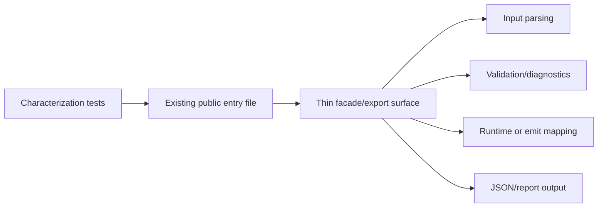
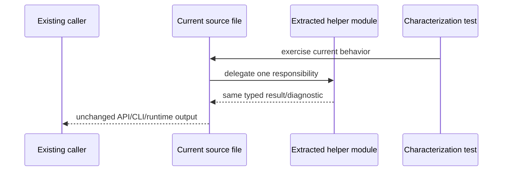

# Source Size SRP Refactor Plan

Complexity: 8 -> HIGH mode

## 1. Context

**Problem:** `pnpm check:source-size` reports 19 oversized source files, increasing the risk that new behavior violates SRP, duplicates existing helpers, and becomes hard to verify safely.

**Files Analyzed:**

- `AGENTS.md`
- `package.json`
- `scripts/check-source-size.mjs`
- `docs/PRDs/README.md`
- `packages/authoring/src/operations.ts`
- `packages/ir/src/validate.ts`
- `packages/ir/src/types.ts`
- `packages/ir/src/uiValidation.ts`
- `packages/ir/src/assetValidation.ts`
- `packages/runtime-web-three/src/mapWorld.ts`
- `packages/runtime-web-three/src/systems/context.ts`
- `packages/cli/src/commands/game.ts`
- `packages/cli/src/commands/scene.ts`
- `packages/cli/src/commands/sourceDocuments.ts`
- `packages/cli/src/commands/asset.ts`
- `packages/compiler/src/emit/bundle.ts`
- `tools/verify/src/gameProductionGate.ts`
- `tools/verify/src/gameProductionGate.test.ts`
- `runtime-bevy/crates/threenative_runtime/src/map_world.rs`
- `runtime-bevy/crates/threenative_runtime/src/ui.rs`
- `runtime-bevy/crates/threenative_runtime/src/conformance.rs`
- `runtime-bevy/crates/threenative_runtime/tests/systems_host.rs`
- `runtime-bevy/crates/threenative_loader/src/types.rs`
- `packages/sdk/src/geometry/meshBuilder.ts`
- `packages/sdk/src/geometry/meshBuilder.test.ts`
- `packages/sdk/src/ecs/World.ts`
- `packages/sdk/src/materials/MeshStandardMaterial.ts`
- `packages/sdk/src/scene/Object3D.ts`

**Current Behavior:**

- `pnpm check:source-size` exits 0 but warns on 19 files over warning thresholds.
- The largest warning is `packages/authoring/src/operations.ts` at 5414 lines, more than 4x the 1200-line source warning threshold.
- Runtime and IR concerns are concentrated in a few files: `mapWorld.ts`, Bevy `map_world.rs`, Bevy `ui.rs`, IR `validate.ts`, `types.ts`, `uiValidation.ts`, and `assetValidation.ts`.
- CLI commands mix parsing, validation, operation orchestration, output shaping, and command registration inside large command files.
- A TypeScript compiler-API class scan found 52 classes. Only `packages/sdk/src/geometry/meshBuilder.ts` has a clearly oversized production class: `MeshBuilder`, 256 lines, 30 members, 26 methods.

## Source Size Findings

Command run:

```bash
pnpm check:source-size
```

Warnings reported:

| Rank | File | Lines | Threshold | Primary Responsibility Cluster |
| --- | --- | ---: | ---: | --- |
| 1 | `packages/authoring/src/operations.ts` | 5414 | 1200 | Structured source operations, validation, editing, diagnostics |
| 2 | `packages/ir/src/validate.ts` | 2805 | 1200 | Bundle/schema validation and diagnostics |
| 3 | `runtime-bevy/crates/threenative_runtime/src/map_world.rs` | 2673 | 1200 | IR-to-Bevy world mapping |
| 4 | `runtime-bevy/crates/threenative_runtime/tests/systems_host.rs` | 2426 | 1800 | Systems host integration coverage |
| 5 | `tools/verify/src/gameProductionGate.test.ts` | 2076 | 1800 | Game production gate coverage |
| 6 | `runtime-bevy/crates/threenative_loader/src/types.rs` | 2073 | 1200 | Generated/loader IR types |
| 7 | `runtime-bevy/crates/threenative_runtime/src/ui.rs` | 2051 | 1200 | Native UI mapping and behavior |
| 8 | `packages/runtime-web-three/src/mapWorld.ts` | 2045 | 1200 | IR-to-Three world mapping |
| 9 | `packages/cli/src/commands/game.ts` | 1947 | 1200 | Game planning/scaffolding/generation commands |
| 10 | `runtime-bevy/crates/threenative_runtime/src/conformance.rs` | 1793 | 1200 | Native conformance assertions/reporting |
| 11 | `packages/cli/src/commands/scene.ts` | 1693 | 1200 | Scene command parsing and mutations |
| 12 | `tools/verify/src/gameProductionGate.ts` | 1638 | 1200 | Production gate checks and reports |
| 13 | `packages/ir/src/types.ts` | 1590 | 1200 | Shared IR type declarations |
| 14 | `packages/cli/src/commands/sourceDocuments.ts` | 1569 | 1200 | Structured source document commands |
| 15 | `packages/compiler/src/emit/bundle.ts` | 1528 | 1200 | SDK/scene/world/audio/etc. bundle emission |
| 16 | `packages/runtime-web-three/src/systems/context.ts` | 1527 | 1200 | Web script context/services |
| 17 | `packages/ir/src/uiValidation.ts` | 1442 | 1200 | UI schema and semantic validation |
| 18 | `packages/ir/src/assetValidation.ts` | 1360 | 1200 | Asset schema and semantic validation |
| 19 | `packages/cli/src/commands/asset.ts` | 1207 | 1200 | Asset sourcing/inspection commands |

Class scan notes:

| File | Class | Lines | Members | Assessment |
| --- | --- | ---: | ---: | --- |
| `packages/sdk/src/geometry/meshBuilder.ts` | `MeshBuilder` | 256 | 30 | Refactor candidate: fluent facade, primitive factories, transforms, normals, colors, and build validation are coupled. |
| `packages/sdk/src/ecs/World.ts` | `World` | 108 | 16 | Moderate and cohesive; defer unless new ECS responsibilities accumulate. |
| `packages/sdk/src/materials/MeshStandardMaterial.ts` | `MeshStandardMaterial` | 102 | 27 | Property-heavy value object; validate helpers could move, but class size is not urgent. |
| `packages/sdk/src/scene/Object3D.ts` | `Object3D` | 99 | 20 | Cohesive scene graph object; no immediate split required. |

## Pre-Planning Findings

**How will this refactor be reached?**

- [x] Entry point identified: existing package commands, runtime adapters, compiler emit, CLI command registration, verification gates, and SDK exports.
- [x] Caller files identified: package-local imports, `packages/sdk/src/index.ts`, CLI command modules, verify runner modules, runtime adapter tests, compiler emit tests, and IR validation tests.
- [x] Registration/wiring needed: preserve all existing public exports and command registrations; internal helper modules must be imported by the current entry files.

**Is this user-facing?**

- [x] YES. Refactors affect contributor workflows, CLI commands, compiler output, runtime behavior, SDK APIs, and verification gates.
- [ ] NO.

**Full user flow:**

1. Contributor runs an existing command, compiler flow, runtime adapter, or verification gate.
2. Existing entry file calls narrower helper modules instead of holding all behavior inline.
3. Public command/API/runtime behavior stays unchanged.
4. Results remain visible through current CLI JSON output, emitted bundles, runtime behavior, and verification reports.

## 2. Solution

**Approach:**

- Treat current oversized files as stable entry facades first; extract cohesive private modules behind existing imports and exports.
- Split by responsibility, not by arbitrary line count: parsing, normalization, validation, diagnostics, mapping, report shaping, and tests get separate homes.
- Preserve IR bundle shapes, CLI JSON output, diagnostic codes, error messages, command names, and SDK public exports unless a separate capability PRD authorizes contract changes.
- Add characterization tests before risky moves, especially for `operations.ts`, `validate.ts`, `mapWorld.ts`, Bevy `map_world.rs`, CLI commands, and compiler bundle emission.
- Keep each phase at five touched files or fewer and run narrow package checks before broader verification.



**Key Decisions:**

- [x] No public package boundary changes in this PRD.
- [x] No release-gate capability promotions; docs/status parity updates are not required unless a phase changes supported behavior.
- [x] Prefer helper extraction over rewrites.
- [x] Keep generated artifacts untouched.
- [x] Use structured parsers/serializers for IR and bundle behavior.

**Data Changes:** None.

## 3. Sequence Flow



## 4. Execution Phases

#### Phase 1: Authoring Operations Slices - Structured source operations become navigable without changing CLI behavior.

**Files (max 5):**

- `packages/authoring/src/operations.ts` - keep public operation registry/facade and delegate extracted responsibilities.
- `packages/authoring/src/operations/sceneOperations.ts` - scene/object operation helpers.
- `packages/authoring/src/operations/uiOperations.ts` - UI operation helpers.
- `packages/authoring/src/operations/materialOperations.ts` - material operation helpers.
- `packages/authoring/src/operationRegistry.test.ts` or focused operation tests - characterization coverage for moved operations.

**Implementation:**

- [ ] Inventory exported operation names and diagnostics before moving code.
- [ ] Extract scene, UI, and material operation handlers without changing operation IDs or JSON output.
- [ ] Keep `operations.ts` as the stable import surface.
- [ ] Remove local duplication where extracted helpers share path lookup or patch application logic.

**Tests Required:**

| Test File | Test Name | Assertion |
| --- | --- | --- |
| `packages/authoring/src/operationRegistry.test.ts` | `should preserve registered operation ids after operation extraction` | Extracted handlers are still registered with the same IDs. |
| `packages/authoring/src/__tests__/validate-scene.test.ts` | `should preserve diagnostics when scene operations are invalid` | Diagnostic code/path/severity/message are unchanged. |

**User Verification:**

- Action: Run `pnpm --filter @threenative/authoring test` and `pnpm check:source-size`.
- Expected: Authoring tests pass; `operations.ts` warning count decreases or the file is materially closer to threshold.

#### Phase 2: IR Validation Slices - Core, UI, and asset validation share utilities instead of duplicating checks.

**Files (max 5):**

- `packages/ir/src/validate.ts` - preserve main validation entry point.
- `packages/ir/src/validation/core.ts` - common diagnostic builders and primitive checks.
- `packages/ir/src/validation/world.ts` - world/entity/component validation.
- `packages/ir/src/uiValidation.ts` - delegate shared helpers.
- `packages/ir/src/assetValidation.ts` - delegate shared helpers.

**Implementation:**

- [ ] Add characterization tests around accepted and rejected fixtures before extraction.
- [ ] Extract common diagnostic construction and scalar/list validation helpers.
- [ ] Move world-specific validation out of `validate.ts` while preserving exported validator behavior.
- [ ] Deduplicate UI/asset validation helpers where diagnostic semantics match.

**Tests Required:**

| Test File | Test Name | Assertion |
| --- | --- | --- |
| `packages/ir/src/schema.test.ts` or existing validation tests | `should preserve rejected fixture diagnostics after validation extraction` | Rejected fixtures report the same stable codes and paths. |
| `packages/ir/src/conformance.test.ts` | `should preserve conformance fixture validation after validation extraction` | Existing conformance fixtures still validate. |

**User Verification:**

- Action: Run `pnpm --filter @threenative/ir test`, then `pnpm verify:conformance`.
- Expected: IR tests and conformance verification pass with unchanged diagnostics.

#### Phase 3: Runtime World Mapping Slices - Web and Bevy world mapping become feature-owned modules.

**Files (max 5):**

- `packages/runtime-web-three/src/mapWorld.ts` - keep adapter entry point.
- `packages/runtime-web-three/src/worldMapping/mesh.ts` - mesh/material/model mapping helpers.
- `packages/runtime-web-three/src/worldMapping/environment.ts` - environment/stylized nature mapping helpers.
- `runtime-bevy/crates/threenative_runtime/src/map_world.rs` - keep native entry point.
- `runtime-bevy/crates/threenative_runtime/src/world_mapping.rs` or submodule - extracted native mapping helpers.

**Implementation:**

- [ ] Identify mapping clusters with direct parity risk: transforms, materials, loaded models, environment/stylized nature, and hierarchy.
- [ ] Extract one cluster at a time behind package-private helpers.
- [ ] Keep authored IR values intact; do not tune colors/materials/lights as part of refactor.
- [ ] Preserve web/Bevy semantics and fixture behavior.

**Tests Required:**

| Test File | Test Name | Assertion |
| --- | --- | --- |
| `packages/runtime-web-three/src/mapWorld.test.ts` or focused existing tests | `should map material and transform IR unchanged after extraction` | Mapped Three.js objects match prior material and transform semantics. |
| `runtime-bevy/crates/threenative_runtime/tests/map_world.rs` | `should map world bundle unchanged after extraction` | Native mapping assertions still pass. |

**User Verification:**

- Action: Run focused web runtime tests, Bevy map world tests, and `pnpm verify:conformance`.
- Expected: Runtime mappings remain behaviorally identical.

#### Phase 4: CLI Command Slices - Large command files become thin command registration plus services.

**Files (max 5):**

- `packages/cli/src/commands/game.ts` - preserve command registration and output.
- `packages/cli/src/commands/game/plan.ts` - game plan orchestration.
- `packages/cli/src/commands/scene.ts` - preserve command registration and output.
- `packages/cli/src/commands/scene/operations.ts` - scene command execution helpers.
- `packages/cli/src/commands/sourceDocuments.ts` or `asset.ts` - extract one narrow helper if still under five files.

**Implementation:**

- [ ] Snapshot existing `--json` outputs for representative happy/error paths.
- [ ] Extract command service logic while leaving Commander wiring in the original files.
- [ ] Reuse existing authoring/asset helper APIs instead of copying parsing logic.
- [ ] Preserve exit codes and diagnostic fields.

**Tests Required:**

| Test File | Test Name | Assertion |
| --- | --- | --- |
| `packages/cli/src/commands/game.test.ts` or existing CLI tests | `should preserve game plan json output after command extraction` | JSON shape and exit behavior are unchanged. |
| `packages/cli/src/commands/scene.test.ts` or existing CLI tests | `should preserve scene operation diagnostics after command extraction` | Diagnostics keep code/path/severity/message. |

**User Verification:**

- Action: Run focused CLI tests and representative `tn ... --json` commands.
- Expected: Same JSON output and exit behavior.

#### Phase 5: Compiler, Verify, and SDK Builder Slices - Emission and procedural mesh helpers are smaller without public API drift.

**Files (max 5):**

- `packages/compiler/src/emit/bundle.ts` - keep bundle emit entry point.
- `packages/compiler/src/emit/worldBundle.ts` or equivalent - extracted world/scene emission helper.
- `tools/verify/src/gameProductionGate.ts` - keep gate entry point.
- `packages/sdk/src/geometry/meshBuilder.ts` - keep public fluent facade.
- `packages/sdk/src/geometry/meshBuilderParts.ts` or equivalent - primitive/normal/transform helpers.

**Implementation:**

- [ ] Split bundle emission by emitted domain while preserving bundle JSON shape.
- [ ] Split production gate checks from report formatting where tests show stable output.
- [ ] Refactor `MeshBuilder` into a fluent facade over internal part factories, transform helpers, normal recalculation, and build validation.
- [ ] Keep `packages/sdk/src/index.ts` exports unchanged.

**Tests Required:**

| Test File | Test Name | Assertion |
| --- | --- | --- |
| `packages/compiler/src/emit/bundle.test.ts` | `should emit identical bundle shape after bundle emitter extraction` | Existing bundle fixtures and assertions pass unchanged. |
| `tools/verify/src/gameProductionGate.test.ts` | `should preserve production gate report after extraction` | Gate report statuses and artifact paths remain stable. |
| `packages/sdk/src/geometry/meshBuilder.test.ts` | `should build deterministic mesh after MeshBuilder extraction` | Attributes, indices, bounds, and generation metadata remain identical. |

**User Verification:**

- Action: Run focused compiler, verify, and SDK geometry tests; run `pnpm check:source-size`.
- Expected: Tests pass; `MeshBuilder` facade is smaller and oversized file warnings are reduced without SDK API drift.

## 5. Checkpoint Protocol

After each phase:

- Run the phase-specific tests listed above.
- Run `pnpm check:source-size` and record the warning count plus changed files still above threshold.
- Run `pnpm typecheck` for TypeScript phases.
- Run Rust focused tests for Bevy phases.
- Run `pnpm verify:conformance` for shared runtime/IR/compiler contract phases.
- Use an automated PRD checkpoint review before moving to the next phase when the reviewer agent is available.

Manual checkpoint is required for Phase 3 if runtime screenshots or visual mapping evidence are affected. Refactor-only phases should not alter screenshots.

## 6. Verification Strategy

**Narrow checks first:**

- `pnpm check:source-size`
- `pnpm --filter @threenative/authoring test`
- `pnpm --filter @threenative/ir test`
- `pnpm --filter @threenative/runtime-web-three test`
- `pnpm --filter @threenative/compiler test`
- `pnpm --filter @threenative/sdk test`
- Focused `cargo test` commands under `runtime-bevy`

**Shared contract checks:**

- `pnpm typecheck`
- `pnpm verify:conformance`
- `pnpm verify:smoke`

**Evidence Required:**

- [x] Baseline `pnpm check:source-size` output captured: 19 warnings.
- [x] First refactor pass recorded after warning count: 18 warnings.
- [x] No public SDK export, CLI command, diagnostic code, or IR bundle shape changes unless separately approved.
- [x] Existing tests pass for each touched package in the first refactor pass.

First refactor pass evidence:

- Extracted UI recipe construction helpers from `packages/authoring/src/operations.ts`
  to `packages/authoring/src/operations/uiRecipes.ts`; `operations.ts`
  decreased from 5413 to 5253 lines.
- Extracted asset vector presentation helpers from
  `packages/cli/src/commands/asset.ts` to
  `packages/cli/src/commands/asset/vectorPresentation.ts`; `asset.ts` dropped
  below the source-size warning threshold.
- Verification: `pnpm --filter @threenative/authoring test`,
  `pnpm --filter @threenative/cli test`, and `pnpm check:source-size`.

Second refactor pass evidence:

- Extracted `MeshBuilder` primitive generation, transform/color helpers,
  normal recalculation, bounds helpers, and value validation from
  `packages/sdk/src/geometry/meshBuilder.ts` to
  `packages/sdk/src/geometry/meshBuilderParts.ts`; the public fluent facade
  remains in `meshBuilder.ts`, which decreased from 798 to 320 lines.
- Verification: `pnpm --filter @threenative/sdk test` and
  `pnpm check:source-size`.

Third refactor pass evidence:

- Extracted material document validation from
  `packages/authoring/src/operations.ts` to
  `packages/authoring/src/operations/materialValidation.ts` and moved shared
  validation diagnostic helpers to
  `packages/authoring/src/operations/validationHelpers.ts`; `operations.ts`
  decreased from 5253 to 5151 lines in `pnpm check:source-size`.
- Verification: `pnpm --filter @threenative/authoring test` and
  `pnpm check:source-size`.

## 7. Acceptance Criteria

- [x] `pnpm check:source-size` warning count is reduced from 19, or each remaining warning has an explicit owner and follow-up note.
- [x] `packages/authoring/src/operations.ts` is split by operation family and no longer grows as the default home for all authoring behavior.
- [ ] IR validation has shared validation/diagnostic helpers used by core, UI, and asset validation.
- [ ] Web and Bevy runtime world mapping keep behavior while moving feature-specific mapping into smaller modules.
- [ ] CLI command files preserve command registration but delegate implementation to narrow command services.
- [x] `MeshBuilder` remains public API-compatible while primitive generation, transforms, normals, colors, and build validation are separated internally.
- [ ] All phase-specific tests pass.
- [ ] `pnpm verify:conformance` passes after IR/runtime/compiler phases.
