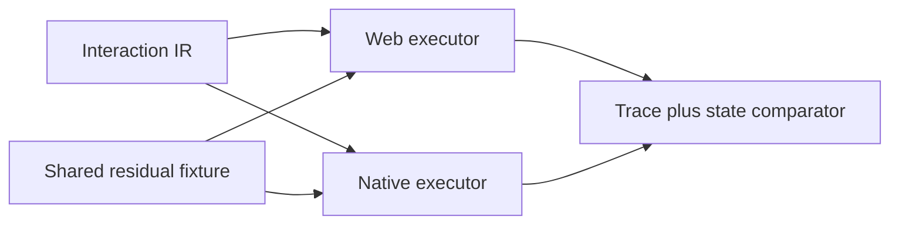

# PRD: Interaction Fixed-Tick Executor Parity

Complexity: 7 -> HIGH mode

Date: 2026-07-14
Status: PLANNED
Owner: IR contracts, web runtime, native runtime, and conformance tooling

## 1. Context

**Problem:** The web and native fixed-tick interaction executors accept one
Interaction IR but disagree on overlap geometry, typed component access,
typed component patching, and transform rotation.

**Complexity score:** +2 for 6-10 likely files, +2 for fixed-tick state and
effect ordering, +2 for multi-package/runtime work, and +1 for conformance and
status updates = 7 (HIGH).

**Files analyzed:** `packages/ir/src/interactions.ts`,
`packages/runtime-web-three/src/interactions.ts`,
`packages/runtime-web-three/src/interactions.test.ts`,
`runtime-bevy/crates/threenative_runtime/src/interactions.rs`,
`runtime-bevy/crates/threenative_runtime/tests/interactions.rs`,
`tools/verify/src/interactionParity.ts`, and the `interaction-*` entries in
`packages/ir/fixtures/conformance/fixture-catalog.json`.

### Current behavior

- Web overlap uses collider AABB half-extents; native uses center distance
  `<= 1.0`, ignoring authored collider size.
- Web component predicates read the unified component record; native reads
  only `components.extra`, so typed `Transform`, `Collider`, and other loader
  fields cannot satisfy the same predicate.
- Native `patchComponent` writes only `components.extra`, even when the target
  is a typed loader component.
- Web `setTransform` applies position, rotation, and scale; native ignores the
  authored quaternion.
- Existing conformance covers pickup, hazard, checkpoint, and projectile
  outcomes, but not the four divergent branches.

## 2. Integration Points

**How reached:** authored Interaction IR is run by
`runInteractionFixedTick` on web and `step_bundle_interactions` on native.
The conformance runner compares normalized traces plus resource/entity state.

**User-facing:** Yes. Wrong overlap volumes change triggers; missed typed
patches/predicates change gameplay; ignored rotation changes visible pose.

**Full flow:** author interaction -> compiler emits closed IR -> runtime
selects deterministic candidates -> gate/predicate evaluates -> effects mutate
world -> trace and resulting state are compared across adapters.

## 3. Solution

- Add one native component access/patch seam over loader typed fields and
  `extra`; do not duplicate per-effect field routing.
- Implement native overlap from the same documented box-size semantics used by
  web, including missing-collider defaults and boundary contact.
- Apply validated finite quaternion rotation in native `setTransform`.
- Enroll one compact residual fixture covering all four branches with negative
  controls that would pass under the old implementations.
- Keep lexical candidate order, gate mutation timing, 512-trace bound, and
  fail-closed unsupported diagnostics unchanged.

**Data changes:** No schema version change. The fixture vocabulary already
exists in Interaction IR.

## 4. Execution Phases

### Phase 1: Pin the four residuals - Tests fail on every known divergence

**Files (max 5):**

- `packages/runtime-web-three/src/interactions.test.ts` - canonical expected semantics
- `runtime-bevy/crates/threenative_runtime/tests/interactions.rs` - native residuals
- `packages/ir/fixtures/conformance/physics-events/game.bundle/interactions.ir.json` - bounded cases
- `tools/verify/src/interactionParity.test.ts` - negative-control assertions

**Implementation:**

- [ ] Add unequal-size overlap and just-outside negative cases.
- [ ] Predicate on a typed component and patch a typed component field.
- [ ] Apply a non-identity quaternion and assert exact normalized state.
- [ ] Prove each old native behavior is caught by a state comparison.

**Verification:** focused web interaction tests and
`cargo test -p threenative_runtime --test interactions --manifest-path runtime-bevy/Cargo.toml`.

**Required tests:** `should use collider extents for overlap boundaries`,
`should evaluate a predicate against a typed component`,
`should patch a typed component without creating a shadow extra component`,
and `should preserve quaternion rotation in setTransform`.

### Phase 2: Unify native component and transform semantics - Native state matches web

**Files (max 5):**

- `runtime-bevy/crates/threenative_loader/src/lib.rs` or its component module - expose structured typed access/patch if needed
- `runtime-bevy/crates/threenative_runtime/src/interactions.rs` - consume the shared seam
- `runtime-bevy/crates/threenative_runtime/tests/interactions.rs` - positive/error coverage
- `packages/runtime-web-three/src/interactions.test.ts` - preserve canonical behavior

**Implementation:**

- [ ] Route predicate lookup and patching through one loader-owned component API.
- [ ] Reject unknown typed fields or invalid value shapes without reporting the effect applied.
- [ ] Compute overlap from typed Collider size and Transform position.
- [ ] Apply position, quaternion rotation, and scale independently.
- [ ] Record writes for typed patches and transform fields through the existing ledger.

**Verification:** both focused suites pass; invalid typed patches leave state
unchanged and do not consume once/cooldown gates.

**Required tests:** `should reject an invalid typed component patch without
consuming the gate` and `should record typed transform writes in the interaction ledger`.

### Phase 3: Promote residual conformance - Drift cannot return silently

**Files (max 5):**

- `packages/ir/fixtures/conformance/fixture-catalog.json` - register residual evidence
- `tools/verify/src/interactionParity.ts` - compare required typed state if absent
- `tools/verify/src/conformance.ts` - wire only if catalog derivation is insufficient
- `docs/status/SYSTEMS_CODE_QUALITY_STATUS.md` - link evidence and rescore only after proof
- `docs/status/capabilities/scripting.md` - update interaction evidence

**Implementation:**

- [ ] Emit paired web/native artifacts for all four residuals.
- [ ] Preserve exact trace order and final typed component/transform state.
- [ ] Add negative controls for old center-distance, `extra`-only, and no-rotation behavior.

**Verification:** `pnpm verify:conformance` and the focused interaction parity tests.

**Required tests:** `should reject legacy native overlap output`, `should reject
extra-only typed state`, and `should reject a missing native rotation`.

## 5. Acceptance Criteria

- [ ] Overlap uses the same collider-size semantics on web and native.
- [ ] Predicates read typed and custom components consistently.
- [ ] Patches update typed and custom components or fail explicitly.
- [ ] Native `setTransform` preserves authored quaternion rotation.
- [ ] Failed effects do not consume gates or claim success in traces.
- [ ] Paired trace/state artifacts and negative controls pass.
- [ ] Automated checkpoints pass after all phases.

## 6. Verification Evidence (complete during implementation)

Record focused test counts, residual artifact paths, `pnpm verify:conformance`
result, and any status/capability changes here. No manual visual checkpoint is
required because exact world state proves the rotation contract.
