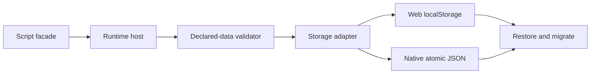

# PRD: Durable Persistence, Settings, and Local Data

Complexity: 9 -> HIGH mode

Date: 2026-07-14
Status: PLANNED
Owner: Runtime services, platform storage, IR, and proof tooling

## 1. Context

**Problem:** Persistence and settings are promoted at the facade/trace level,
but native script saves live in a QuickJS process-global object, so a successful
save can disappear at process exit despite reports describing a `native-json`
backend.

**Complexity score:** +3 for more than 10 eventual files, +2 for a new native
storage module, +2 for state/migration/autosave logic, and +2 for IR/web/native
scope = 9 (HIGH).

**Files analyzed:** `packages/sdk/src/persistence.ts`,
`packages/ir/src/localDataValidation.ts`,
`packages/runtime-web-three/src/systems/services/persistence.ts`, its tests,
`runtime-bevy/crates/threenative_runtime/src/systems_host_bridge.js`,
`systems_context.rs`, `persistence.rs`, `persistence_reload.rs`, and native
`systems_host`/`persistence` tests.

### Current behavior

- Web accepts an injected storage adapter and defaults to `localStorage`; a
  focused test proves a cold service recreation.
- Native QuickJS initializes `globalThis.__tnPersistenceStore` and therefore
  survives host calls only within one process.
- Native migration code diagnoses missing/forward migrators but the script
  facade does not load, migrate, atomically write, and restore a real file.
- `persistence_reload.rs` synthesizes a report and labels storage
  `native-json`; it is not evidence of process-restart durability.
- Autosave metadata is validated, but live interval/checkpoint/debounce
  scheduling lacks end-to-end restart proof.

## 2. Goals and Non-goals

**Goals:** one adapter-private storage contract; target-profile namespacing;
atomic native JSON writes; exact schema/app-version validation; sequential
migration; autosave/checkpoint integration; settings persistence; cold-restart
proof on web and desktop.

**Non-goals:** cloud/account sync, portable filesystem APIs, arbitrary save
paths, encryption promises, conflict resolution across devices, or exposing
native handles to scripts.

## 3. Integration Points

**How reached:** `ctx.persistence.*` and `ctx.settings.*` in portable scripts,
plus authored `local-data.ir.json` autosave metadata. The web system context
uses `createWebPersistenceService`; the native host must deliver accepted
service effects to a Rust-owned storage sink.

**User-facing:** Yes. Players expect progress and accessibility/audio/control
settings to survive quit and relaunch.

**Full flow:** script requests save/settings change -> host validates declared
slot/key -> adapter storage serializes only declared data -> atomic commit ->
new process loads and migrates -> runtime restores world/settings -> proof
asserts gameplay-visible values.

## 4. Solution

- Define a small adapter-private storage interface with in-memory test and
  platform-file implementations; portable scripts never receive paths.
- Make the Rust runtime own native persistence state. QuickJS emits validated
  service requests/results but does not own durable records.
- Resolve a per-app, per-target-profile storage namespace outside the bundle;
  reject traversal and never write durable source or `dist/**`.
- Use stage, flush/sync, atomic rename, and bounded record-size validation.
- Share record validation/migration vectors through IR fixtures while allowing
  adapter-private storage mechanics.
- Treat corrupt, forward-incompatible, or incomplete migration records as
  explicit diagnostics; do not silently reset or overwrite them.

**Data changes:** Keep Local Data IR version `0.1.0` unless implementation
uncovers a missing portable field. Native record/envelope format is
adapter-private but versioned.

## 5. Execution Phases

### Phase 1: Storage contract and failure policy - Durability semantics are executable

**Files (max 5):**

- `packages/ir/fixtures/contracts/persistence/records.json` - valid/corrupt/version vectors
- `packages/runtime-web-three/src/systems/services/persistence.ts` - align validation behavior
- `packages/runtime-web-three/src/systems/services/persistence.test.ts` - shared vector coverage
- `runtime-bevy/crates/threenative_runtime/src/persistence.rs` - record contract and diagnostics
- `runtime-bevy/crates/threenative_runtime/tests/persistence.rs` - native vector coverage

**Implementation:** define namespacing, size limits, allowed data, version
transitions, corrupt-record behavior, deletion, and atomicity expectations.

**Verification:** focused web persistence tests and native persistence tests.

**Required tests:** `should accept a declared bounded save record`, `should
reject undeclared fields`, `should preserve a corrupt record for recovery`, and
`should diagnose a forward-incompatible record`.

### Phase 2: Native atomic storage - Saves survive service and process recreation

**Files (max 5):**

- `runtime-bevy/crates/threenative_runtime/src/persistence_storage.rs` - storage trait/file backend
- `runtime-bevy/crates/threenative_runtime/src/lib.rs` - register runtime resource/system
- `runtime-bevy/crates/threenative_runtime/src/systems_context.rs` - inject storage state
- `runtime-bevy/crates/threenative_runtime/src/systems_host_bridge.js` - remove JS durability ownership
- `runtime-bevy/crates/threenative_runtime/tests/persistence_storage.rs` - temp-root integration tests

**Implementation:**

- [ ] Resolve a contained namespace from app identity and target profile.
- [ ] Write atomically and preserve the previous valid record on failure.
- [ ] Route save/load/delete/settings operations through the Rust owner.
- [ ] Bound bytes, slots, and settings; reject undeclared data.
- [ ] Keep injectable in-memory storage for deterministic tests.

**Verification:** tests recreate the runtime/storage object and separately
launch a second trace process against the same temporary profile root.

**Required tests:** `should restore a native save in a second process`, `should
retain the prior record when atomic commit fails`, and `should reject a storage
namespace escape`.

### Phase 3: Migration and autosave - Authored lifecycle metadata drives real behavior

**Files (max 5):**

- `runtime-bevy/crates/threenative_runtime/src/persistence.rs` - ordered migrator application
- `runtime-bevy/crates/threenative_runtime/src/lib.rs` - interval/checkpoint scheduling
- `runtime-bevy/crates/threenative_runtime/tests/persistence.rs` - migration failures
- `runtime-bevy/crates/threenative_runtime/tests/systems_host.rs` - live checkpoint/debounce flow
- `packages/runtime-web-three/src/persistenceReload.test.ts` - matching lifecycle expectations

**Implementation:** apply every declared version step in order; debounce
checkpoint events; use fixed/runtime timing semantics; flush on controlled
shutdown where supported; diagnose missing migrators without destroying data.

**Verification:** old record migrates and restores, missing migrator fails
closed, duplicate checkpoint events coalesce, and interval autosave respects
declared bounds.

**Required tests:** `should run every migration step in order`, `should fail
closed when one migrator is missing`, and `should debounce repeated checkpoint
autosaves`.

### Phase 4: Cold-relaunch proof and truthful claims - Promotion means real durability

**Files (max 5):**

- `scripts/verify-persistence-reload.mjs` - extend the existing gate with two-process proof
- `packages/ir/fixtures/conformance/persistence-reload/game.bundle/manifest.json` - evidence enrollment
- `docs/status/capabilities/scripting.md` - facade/runtime evidence
- `docs/bevy-feature-parity.md` - durability scope
- `docs/status/SYSTEMS_CODE_QUALITY_STATUS.md` - link/rescore after pass

**Implementation:** first process changes a persisted resource and setting and
saves; second process loads the same profile and asserts both values. Retain
corruption, forward-version, undeclared-field, and interrupted-write negative
controls.

**Verification:** focused gate plus `pnpm verify:conformance`. Manual desktop
checkpoint: quit the packaged/reference game, relaunch, and capture the restored
setting/progress evidence.

**Required tests:** `should fail the persistence gate when the second process
cannot restore progress` and `should fail when restored settings differ`.

## 6. Acceptance Criteria

- [ ] Native script persistence is not owned by a process-global JS object.
- [ ] Save/settings records survive a real native process restart.
- [ ] Writes are atomic, bounded, namespaced, and source/bundle independent.
- [ ] Only declared portable resources/components/settings are serialized.
- [ ] Migration, corruption, and forward-version failures are actionable and
      preserve recoverable data.
- [ ] Authored autosave interval/checkpoint/debounce behavior is proved.
- [ ] Cloud/account and arbitrary filesystem access remain explicit boundaries.
- [ ] Automated and manual checkpoints pass.

## 7. Verification Evidence (complete during implementation)

Record storage root policy, focused test counts, two-process artifact paths,
desktop relaunch evidence, conformance result, and doc claim changes.
