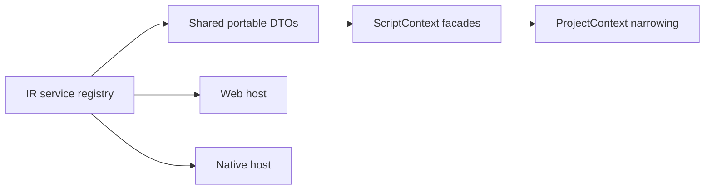

# PRD: Script Context Type Contract Closure

Complexity: 6 -> MEDIUM mode

Date: 2026-07-14
Status: PLANNED
Owner: Script stdlib, shared IR service types, compiler, and runtime hosts

## 1. Context

**Problem:** The public `ScriptContext` types only a subset of promoted runtime
services and uses an index signature plus a 22-entry test allowlist to tolerate
the rest, so scripts can execute supported APIs that TypeScript cannot verify.

**Complexity score:** +2 for 6-10 files, +2 for multi-package contract work,
and +2 for a shared service/type registry = 6 (MEDIUM).

**Files analyzed:** `packages/script-stdlib/src/script-context.ts`,
`packages/script-stdlib/src/index.test.ts`,
`packages/runtime-web-three/src/systems/contextTypes.ts`,
`packages/ir/src/systems.ts`, compiler script validation/types generation, and
`docs/status/capabilities/scripting.md`.

### Current behavior

- Public types cover core commands, entity/query, events, input, picking,
  resources, state, and time.
- Runtime types additionally expose animation, assets, audio, cameras,
  channels, character, components, effects, navigation, observers, particles,
  persistence, physics, plugins, random, scenes, schedule, sequences, settings,
  states, tasks, timers, and UI.
- A string index signature makes unknown surfaces type as `unknown`, masking
  omissions at the public boundary.
- `index.test.ts` parses interface source text and compares omissions with an
  explicit migration allowlist.
- Some runtime types import web implementation return types, preventing them
  from becoming a clean shared public contract.

## 2. Integration Points

**How reached:** game scripts import `ScriptContext` from
`@threenative/script-stdlib`; `tn types generate` builds project-specific
`ProjectContext` on top; compiler service validation and web/native hosts
execute the declared service vocabulary.

**User-facing:** Developer-facing. Authors should receive autocomplete and
compile-time errors for the exact portable service contract.

**Full flow:** service is declared in owning IR registry -> shared request and
result types are exported -> public `ScriptContext` references them -> project
context narrows IDs -> compiler validates service use -> both hosts implement
the same shape.

## 3. Solution

- Make the owning IR service registry/descriptor carry or point to public
  request/result type ownership; do not create another service-name list.
- Move portable DTOs out of web runtime implementation modules into IR or
  script-stdlib contract modules.
- Compose `ScriptContext` from named facade interfaces so phases can migrate
  coherent families without one monolithic interface.
- Remove the omission allowlist and broad index signature when all promoted
  services are typed; preserve explicit extension typing only for a declared
  plugin mechanism.
- Add compile fixtures that accept supported calls and reject wrong IDs,
  payloads, vectors, result assumptions, and unsupported handles.

**Data changes:** No runtime IR change expected. This is a TypeScript API and
contract-ownership migration.

## 4. Execution Phases

### Phase 1: Establish shared type ownership - Public types do not import adapters

**Files (max 5):**

- `packages/ir/src/systems.ts` or service registry owner - descriptor/type ownership
- `packages/ir/src/scriptServices.ts` - shared DTOs if a focused module is needed
- `packages/ir/src/index.ts` - exports
- `packages/runtime-web-three/src/systems/contextTypes.ts` - consume shared DTOs
- `packages/ir/src/contractDrift.test.ts` - registry/type drift assertions

**Implementation:** classify every promoted service as shared-typed or explicit
diagnostic-only; move portable DTOs without importing runtime classes/handles.

**Verification:** IR tests and web typecheck pass with no circular dependency.

**Required tests:** `should keep promoted service names aligned with shared DTO
ownership` and `should keep shared script service types adapter-independent`.

### Phase 2: Type promoted facade families - Real scripts compile against supported APIs

**Files (max 5 per slice):**

- `packages/script-stdlib/src/script-context.ts` - named facade interfaces
- `packages/script-stdlib/src/index.ts` - public exports
- `packages/script-stdlib/src/index.test.ts` - compile/drift coverage
- `packages/cli/src/commands/types.ts` - preserve ProjectContext narrowing
- relevant type-generation test - exact emitted declarations

**Implementation:** migrate in coherent slices: gameplay/presentation services;
world/query services; persistence/settings/UI services. Match runtime method
names, optionality, and return discriminants exactly. Do not type an unproved
service as broadly callable merely because the host has an internal helper.

**Verification:** package typecheck plus positive/negative fixture compilation.

**Required tests:** `should compile every promoted ScriptContext facade`,
`should reject an invalid physics vector`, `should reject an undeclared setting
value`, and `should preserve generated ProjectContext ID narrowing`.

### Phase 3: Delete migration escape hatches - New drift fails immediately

**Files (max 5):**

- `packages/script-stdlib/src/script-context.ts` - remove broad index signature
- `packages/script-stdlib/src/index.test.ts` - remove omission allowlist
- `packages/compiler/src/scripts/validation.ts` - align public/declared services if needed
- compiler script tests - unsupported/typed service cases
- `docs/status/capabilities/scripting.md` - document contract closure

**Implementation:** derive the drift assertion from the owning registry; fail
when a promoted service has no public facade, runtime implementation, or
compiler declaration. Any experimental surface needs explicit registry state,
not an unbounded type escape hatch.

**Verification:** script-stdlib generated check, compiler tests, CLI type
generation tests, and `pnpm verify:conformance`.

**Required tests:** `should fail when a promoted context surface lacks a public
facade` and `should reject an unknown ScriptContext property`.

## 5. Acceptance Criteria

- [ ] Every promoted runtime service has a portable public facade type.
- [ ] Public DTOs do not depend on the web or native adapter implementation.
- [ ] `ProjectContext` still narrows project-owned identifiers.
- [ ] Wrong calls fail TypeScript compilation in negative fixtures.
- [ ] The 22-entry omission allowlist and broad context index signature are gone.
- [ ] Registry drift fails when a new service misses public, compiler, web, or
      native ownership.
- [ ] Automated checkpoints pass after each phase.

## 6. Verification Evidence (complete during implementation)

Record migrated service families, compile-fixture results, generated-declaration
diff, drift-test result, and conformance result.
