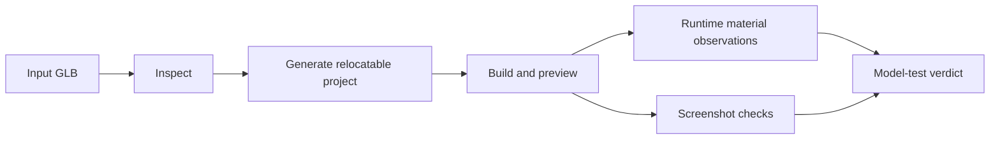

# PRD: Portable Model-Test Projects and Authored Material Evidence

Complexity: 5 -> MEDIUM mode

Date: 2026-07-14
Status: PLANNED
Owner: CLI model-test, templates/dependency resolution, web asset mapping, and asset proof

## 1. Context

**Problem:** `tn model-test` writes absolute paths to the current checkout into
generated `package.json`, and its generated GLB prefab declares a white
primitive fallback that can replace imported authored material in screenshots.

**Complexity score:** +2 for 6-10 files, +2 for CLI/runtime/template scope, and
+1 for screenshot/manual evidence = 5 (MEDIUM).

**Files analyzed:** `packages/cli/src/commands/modelTest.ts`, its tests,
`packages/runtime-web-three/src/mapWorld.ts` and `mapWorld.test.ts`,
`docs/audits/blender-headless-cli-spike-2026-07-13.md`,
`docs/PRDs/done/glb-visual-inspection-and-turntable-capture-2026-07-11.md`,
and asset workflow/capability docs.

### Current behavior

- Generated `package.json` hardcodes `file:/home/joao/projects/threejs-to-bevy/packages/...`.
- Moving or sharing the proof project can break install/build and leaks a local
  workspace path into retained artifacts.
- The generated `prefab.model-under-test` contains `primitive: "box"`,
  `color: "#ffffff"`, and `asset`, mixing fallback primitive material with the
  imported scene contract.
- A Blender spike produced a GLB with blue/metal PBR factors, but the
  model-test screenshot showed the white fallback and still returned success.
- Current nonblank/visible-mesh checks prove loading/framing, not authored
  material preservation.

## 2. Goals and Non-goals

**Goals:** relocatable generated projects; package references derived from the
active CLI distribution shape; imported GLB material ownership preserved;
machine-readable material observations; a screenshot/material negative control.

**Non-goals:** full photoreal parity, arbitrary glTF extension promotion,
package publishing changes, or treating isolated model proof as final-scene
composition proof.

## 3. Integration Points

**How reached:** `tn model-test <asset>` in the CLI command registry generates
source/config/package files, copies asset dependencies, builds the bundle,
starts web preview, and optionally captures screenshots/turntables.

**User-facing:** Yes. Authors and agents use this command to decide whether a
model, its scale, and its materials are usable before scene integration.

**Full flow:** inspect asset -> generate relocatable proof project -> compiler
emits asset-backed prefab -> runtime loads GLB source materials -> proof records
material observations and pixels -> command fails if fallback replaces the
authored material.

## 4. Solution

- Replace hardcoded dependency strings with one resolver derived from the
  running CLI/package distribution context. Workspace development may use
  relative `file:` references; installed distributions use compatible package
  versions. Never serialize an absolute checkout path.
- Generate an asset-only prefab/model instance. If fallback geometry is needed
  for load failure, keep it a separate diagnostic entity that cannot override
  a successfully loaded GLB.
- Extend the report with normalized imported material observations (material
  count/name, base color, metallic/roughness, texture presence) sourced from
  inspection/runtime evidence.
- Add a colored metallic GLB fixture and a white-fallback negative control.
- Keep nonblank, scale, bounds, and isolation caveat checks.

**Data changes:** Extend the model-test report schema/version only if the
report already has a versioned public contract; otherwise add backward-
compatible optional `materials` evidence and document it.

## 5. Execution Phases

### Phase 1: Relocatable generation - Output contains no developer checkout path

**Files (max 5):**

- `packages/cli/src/commands/modelTest.ts` - dependency/project resolver
- `packages/cli/src/commands/modelTest.test.ts` - relocation and path-leak tests
- existing CLI package-resolution helper - reuse/extend if available
- helper test - installed/workspace distribution cases

**Implementation:** derive dependencies from package metadata/runtime location;
normalize relative `file:` paths against the generated project; copy only if
that is the repository's existing self-contained-project convention. Reject
output containing the original absolute workspace root.

**Verification:** generate under one temp root, move to another, then validate
and build with no reference to the source checkout.

**Required tests:** `should generate package metadata without the workspace
root` and `should validate and build after the model-test project is moved`.

### Phase 2: Preserve imported material ownership - Successful GLB load cannot become a white box

**Files (max 5):**

- `packages/cli/src/commands/modelTest.ts` - asset-only prefab generation
- `packages/cli/src/commands/modelTest.test.ts` - structured source assertions
- `packages/runtime-web-three/src/mapWorld.ts` - correct asset/fallback mapping if needed
- `packages/runtime-web-three/src/mapWorld.test.ts` - source-material regression
- `packages/cli/fixtures/model-test/colored-metallic.glb` - deterministic evidence input

**Implementation:** remove primitive/color ownership from the model-under-test
prefab, or define explicit asset-material precedence in the owning mapper.
Missing/failed GLB loads must emit a diagnostic and may show a separately
labeled fallback; they must not pass as imported material evidence.

**Verification:** source/material unit tests and focused model-test generation
tests.

**Required tests:** `should generate an asset-only model prefab`, `should keep
authored GLB material after mapping`, and `should label a load fallback without
counting it as imported material`.

### Phase 3: Material-aware proof - Verdict distinguishes load from fidelity

**Files (max 5):**

- `packages/cli/src/commands/modelTest.ts` - report/check fields
- `packages/cli/src/commands/modelTest.test.ts` - material observations and failures
- `tools/verify/src/blenderToolGate.ts` or owning model-test gate - retained evidence
- `docs/workflows/asset-pipeline.md` - explain material verdict
- `docs/status/capabilities/assets.md` - update proof claim after pass

**Implementation:** report expected inspection materials and observed runtime
materials; fail `--verify` when an authored colored/materialized GLB resolves
only to fallback white/default material. Keep screenshot pixel checks bounded
and combine them with semantic observations to avoid lighting-dependent false
positives.

**Verification:** focused CLI tests, a real four-angle model-test on the colored
fixture, and the owning asset/Blender gate. Manual checkpoint: inspect the
contact sheet and confirm authored base color/metal response remains visible.

**Required tests:** `should report expected and observed imported materials`
and `should fail verify when a colored GLB resolves only to white fallback`.

### Phase 4: Claim and status cleanup - Evidence describes exactly what was proved

**Files (max 5):**

- `docs/audits/blender-headless-cli-spike-2026-07-13.md` - link closure evidence
- `docs/status/SYSTEMS_CODE_QUALITY_STATUS.md` - link/rescore after pass
- `docs/bevy-feature-parity.md` - update only if asset parity evidence changes
- `docs/PRDs/README.md` - move/link completed PRD bundle when finished

**Implementation:** retain relocation command/output, material observation
report, contact sheet, and negative control. Preserve the isolated-proof caveat.

**Verification:** `pnpm --filter @threenative/cli test -- --run model-test`,
relevant runtime-web tests, asset gate, and docs checks.

**Required test:** `should retain relocation and material artifacts in the
owning verification report`.

## 6. Acceptance Criteria

- [ ] Generated source/config/package/docs contain no absolute workspace path.
- [ ] A moved generated project validates and builds in a supported environment.
- [ ] Successfully loaded GLBs retain authored material ownership.
- [ ] Fallback geometry/material is separate, diagnostic, and cannot count as
      imported material evidence.
- [ ] Reported material observations agree with inspection/runtime state.
- [ ] Colored/metallic positive fixture and white-fallback negative control pass.
- [ ] Screenshot/manual evidence retains the isolated-proof caveat.
- [ ] Automated and manual checkpoints pass.

## 7. Verification Evidence (complete during implementation)

Record relocation roots, generated package excerpt, focused test counts,
material observation report, contact-sheet path, negative-control result, and
doc claim changes.
