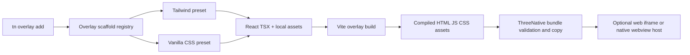
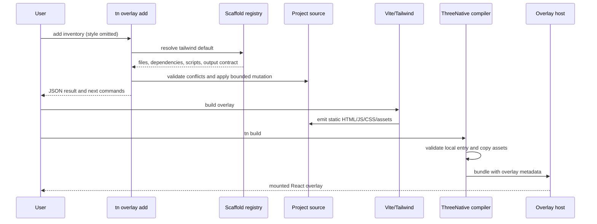

# Tailwind-Default React Webview Overlay Scaffold

Complexity: 8 -> HIGH mode

## Complexity Assessment

- +3 touches 10+ implementation, template, test, documentation, and proof files
- +2 adds a new registry-backed overlay scaffold/build surface
- +2 spans CLI, generated-project templates, compiler/package integration, and
  verification tooling
- +1 integrates external build-time packages (Tailwind CSS and its Vite plugin)

## Context

**Problem:** ThreeNative supports optional React/CSS webview overlays, but it
does not provide a maintained authoring scaffold or styling convention, so each
game must invent its own React entry, CSS organization, build configuration,
and bundle-local output flow.

**Files Analyzed:**

- `AGENTS.md`
- `package.json`
- `packages/cli/src/commands/create.ts`
- `packages/cli/src/commands/create.test.ts`
- `packages/cli/src/commands/package.ts`
- `packages/cli/src/commands/package.test.ts`
- `packages/cli/src/templates/registry.ts`
- `packages/ir/fixtures/conformance/v8-overlay-webview/game.bundle/overlay/*`
- `templates/structured-source-starter/package.json`
- `templates/racing-kit-rally-starter/package.json`
- `templates/_shared/AGENT_GAME_PLAN.md`
- `docs/contracts/ui.md`
- `docs/contracts/game-production-workflow.md`
- `docs/runtime/desktop-packaging.md`
- `docs/status/capabilities/tooling-proof.md`
- `docs/PRDs/done/v8/V8-05-optional-react-webview-overlay.md`
- `docs/PRDs/other/optional-react-app-shell-and-pre-game-flow.md`

**Current Behavior:**

- Retained `ui.ir.json` is the default portable game UI contract and maps to
  web DOM and native Bevy UI.
- React/CSS webview overlays are explicit, optional, capability-gated, and
  bundle-local.
- The conformance fixture proves static HTML and vanilla CSS assets, but the
  maintained game starters do not scaffold a React overlay source project.
- `tn package --runtime webview` builds the game runtime with Vite, but it does
  not own or compile a project's React overlay source.
- Generated starters contain no React, Tailwind, PostCSS, or overlay-specific
  dependencies.

## Product Decision

When a user scaffolds an optional React webview overlay, ThreeNative uses
Tailwind CSS as the default styling preset. Tailwind remains a project-local
build-time concern and is not part of the SDK, IR, runtime, bridge, or portable
retained-UI contract.

```txt
tn overlay add hud-shell
  -> React + Vite + Tailwind source scaffold (default preset)
  -> project-local overlay build
  -> compiled HTML/JS/CSS/assets
  -> bundle-local overlay entry
  -> optional iframe/native webview host

tn overlay add hud-shell --style vanilla
  -> same overlay/runtime contract with plain CSS source
```

This PRD does **not** add Tailwind dependencies to every generated game. The
dependencies and files are added only when the user opts into a React webview
overlay or selects a future template that explicitly enrolls such an overlay.

## Goals

- Give generated React overlays a consistent, productive default styling
  vocabulary.
- Keep Tailwind build-only: shipped bundles contain compiled CSS and no
  Tailwind runtime.
- Preserve a first-class vanilla CSS preset for teams that do not want
  utility-class markup.
- Derive scaffold choices, dependencies, help, dispatch, and tests from one
  owning descriptor registry.
- Ensure generated overlays work offline and obey existing bundle-local asset,
  bridge, input-capture, and target-capability rules.
- Include a small accessible baseline for focus visibility, reduced motion,
  readable contrast, safe-area layout, and pointer/keyboard interaction.
- Prove both Tailwind-default and vanilla opt-out projects through real build,
  bundle, preview, and packaged-webview paths.

## Non-Goals

- Do not make React DOM, CSS, webviews, or Tailwind the portable game UI
  contract.
- Do not replace retained UI for HUDs, health bars, touch controls, dialogue,
  or other gameplay-critical UI that must work natively.
- Do not expose Tailwind class names in IR, SDK types, runtime messages, or
  editor/native adapter APIs.
- Do not require Tailwind at runtime or load it from a CDN.
- Do not add Tailwind, React, or Vite dependencies to projects that have not
  opted into a webview overlay.
- Do not introduce DaisyUI or another component library in the default preset.
- Do not support arbitrary remote fonts, scripts, stylesheets, or assets.
- Do not change the current desktop packaging claim: the packaged webview path
  remains the documented localhost server plus platform browser/webview
  handler until an embedded shell is separately proven.

## Integration Points

**How will this feature be reached?**

- [x] Entry point identified: `tn overlay add <name> [--style tailwind|vanilla]
  [--json]`, with `tailwind` selected when `--style` is omitted.
- [x] Caller file identified: CLI command registration/dispatch invokes a new
  registry-backed overlay scaffold command, then existing build/compiler paths
  consume its generated output.
- [x] Registration/wiring needed: command descriptor, scaffold descriptor,
  template assets, dependency mutation, overlay declaration/source wiring,
  help/MCP/editor surfaces derived from the owning registry where applicable,
  and focused verification enrollment.

**Is this user-facing?**

- [x] YES. Authors receive a generated React overlay and players see its
  compiled UI in supported web/webview targets.
- [ ] NO.

**Full user flow:**

1. User runs `tn overlay add inventory --json` in a ThreeNative project.
2. CLI resolves the default `tailwind` scaffold descriptor and checks for
   conflicts without overwriting existing files.
3. CLI creates React/TypeScript source, Vite/Tailwind configuration, a minimal
   global stylesheet, and the owning overlay declaration; it mutates
   `package.json` with descriptor-owned dependencies and scripts.
4. User runs the returned install command, then the returned overlay build or
   normal ThreeNative build command.
5. Vite and Tailwind compile the overlay to deterministic bundle-local web
   assets.
6. The compiler validates and copies the emitted entry/assets into the game
   bundle and records existing overlay capabilities.
7. Web preview mounts the overlay in the existing host; supported native
   desktop builds mount the same compiled assets through the private webview
   host.
8. User can instead run `tn overlay add inventory --style vanilla` and receives
   the same runtime contract without Tailwind dependencies or directives.

## Solution

**Approach:**

- Add one overlay-scaffold descriptor registry that owns preset names,
  dependencies, scripts, source template locations, output conventions, and
  supported options.
- Add a bounded `tn overlay add` mutation that defaults to the `tailwind`
  descriptor and refuses unknown presets or file conflicts with stable,
  actionable diagnostics.
- Generate a small React overlay using Vite and the current supported Tailwind
  Vite integration; source scanning must cover generated TS/TSX and must not
  scan generated bundle output or `node_modules`.
- Keep structural/global CSS limited to reset, full-size mounting, typography,
  safe-area variables, focus visibility, and reduced-motion behavior. Use
  Tailwind utilities for component styling in the default example.
- Emit only compiled static assets into the overlay bundle. Existing IR and
  runtime hosts stay styling-framework agnostic.
- Add a vanilla preset generated from the same descriptor/operation and guard
  the two presets against dependency, help, output, and proof drift.



**Key Decisions:**

- [x] Tailwind is the default only after explicit React-overlay opt-in.
- [x] `--style vanilla` is the supported opt-out; the style choice affects
  authoring files and build dependencies, not emitted IR semantics.
- [x] Tailwind and its Vite integration are dev dependencies in the generated
  overlay project; React remains an overlay application dependency.
- [x] Generated projects pin versions according to the repository's existing
  dependency/version policy at implementation time rather than embedding
  versions in multiple templates.
- [x] The descriptor registry is the single source for preset metadata. Help,
  dispatch, package mutation, MCP/editor adapters, and tests must derive from it
  or use an explicit drift test when derivation is not yet practical.
- [x] The initial scaffold is intentionally unopinionated beyond React,
  Tailwind, and accessible primitives; no component kit is selected.
- [x] Existing `overlay.mount(...)`, bridge validation, input modes, capability
  diagnostics, and bundle-local security checks are reused.
- [x] Failures use stable diagnostics with code, severity, path, message, and a
  suggested fix or structured `fix` where supported.

**Data Changes:** No IR schema change is required. Add project-source metadata
only if needed to declare the overlay build command, source directory, and
deterministic emitted entry. Any such metadata belongs in the existing project
configuration/overlay declaration and must not duplicate `overlays.ir.json`.

## Sequence Flow



## Execution Phases

### Phase 1: Descriptor-Owned CLI Contract

**User-visible outcome:** Authors can discover the overlay command and receive
stable validation for the default and opt-out style presets.

**Files (max 5):**

- `packages/cli/src/overlays/scaffoldRegistry.ts` - owning preset descriptors,
  default selection, dependency/script metadata, and output convention
- `packages/cli/src/overlays/scaffoldRegistry.test.ts` - registry invariants and
  default/vanilla resolution
- `packages/cli/src/index.ts` - register the registry-backed command surface
- `packages/cli/src/commands/help.ts` - expose derived command examples and
  preset choices
- `packages/cli/src/commands/help.test.ts` - prove discoverability and drift

**Implementation:**

- [ ] Define `tailwind` and `vanilla` descriptors with `tailwind` as the only
  default.
- [ ] Store dependency roles, script names, template paths, source/output
  conventions, and supported flags in the descriptor rather than command
  conditionals.
- [ ] Register `tn overlay add <name> [--style tailwind|vanilla] [--json]`.
- [ ] Derive usage/help choices from the registry.
- [ ] Reject missing names, unknown styles, invalid stable IDs, unsupported
  project layouts, and malformed flags with stable diagnostics.

**Tests Required:**

| Test File | Test Name | Assertion |
|---|---|---|
| `packages/cli/src/overlays/scaffoldRegistry.test.ts` | `should select tailwind when overlay style is omitted` | Exactly one default resolves to `tailwind`. |
| `packages/cli/src/overlays/scaffoldRegistry.test.ts` | `should keep preset dependency metadata disjoint` | Vanilla has no Tailwind dependency or directive. |
| `packages/cli/src/commands/help.test.ts` | `should derive overlay style choices from the scaffold registry` | Help lists canonical presets and default without a second manual list. |

**Verification Plan:**

```bash
pnpm --filter @threenative/cli test
pnpm --filter @threenative/cli typecheck
```

**User Verification:**

- Action: Run `tn help overlay` and `tn overlay add --json`.
- Expected: Help shows Tailwind as the default and the invalid invocation
  returns a stable usage diagnostic.

**Checkpoint:** Spawn `prd-work-reviewer` for Phase 1. Continue only on PASS.

### Phase 2: Tailwind-Default Overlay Mutation

**User-visible outcome:** Running `tn overlay add inventory` creates a usable,
accessible React/Tailwind overlay without overwriting project work.

**Files (max 5):**

- `packages/cli/src/commands/overlayAdd.ts` - bounded scaffold and structured
  `package.json`/project configuration mutation
- `packages/cli/src/commands/overlayAdd.test.ts` - happy path, conflict,
  idempotency, JSON response, and diagnostic coverage
- `packages/cli/src/overlays/templates/tailwind/*` - React entry, stylesheet,
  HTML, TypeScript, and Vite/Tailwind source templates
- `packages/cli/src/overlays/templates/shared/*` - shared bridge and accessibility
  helpers used by both presets
- `packages/cli/package.json` - ensure scaffold assets are included in the
  published CLI distribution

**Implementation:**

- [ ] Resolve all generated files and dependency mutations from the descriptor.
- [ ] Use structured JSON parsing/serialization for `package.json` and project
  configuration; preserve unrelated keys and scripts.
- [ ] Generate React/TSX, Vite configuration, Tailwind import/configuration,
  bridge wrapper, local entry HTML, and deterministic output directory.
- [ ] Include an intentional sample panel with keyboard focus, visible focus
  rings, reduced-motion behavior, safe-area padding, readable contrast, and an
  explicit overlay input policy.
- [ ] Avoid a broad CSS reset that changes the game canvas or parent document;
  keep all overlay styling scoped to its iframe/webview document.
- [ ] Return changed files, selected style, dependencies, scripts, entry, and
  next commands in `--json` output.
- [ ] Refuse to overwrite conflicting source, config, scripts, dependencies, or
  overlay IDs; provide a specific path and suggested fix.
- [ ] Make a repeated identical command either a no-op with an explicit result
  or a stable already-exists diagnostic; never duplicate declarations.

**Tests Required:**

| Test File | Test Name | Assertion |
|---|---|---|
| `packages/cli/src/commands/overlayAdd.test.ts` | `should scaffold a Tailwind React overlay when style is omitted` | Generated files, dependency roles, build script, and entry match the descriptor. |
| `packages/cli/src/commands/overlayAdd.test.ts` | `should preserve unrelated package metadata` | Existing scripts and dependencies remain unchanged. |
| `packages/cli/src/commands/overlayAdd.test.ts` | `should reject an existing overlay source conflict` | No partial mutation occurs and diagnostic identifies the path. |
| `packages/cli/src/commands/overlayAdd.test.ts` | `should not duplicate an existing overlay declaration` | Repetition is deterministic and non-destructive. |

**Verification Plan:**

```bash
pnpm --filter @threenative/cli test
pnpm --filter @threenative/cli typecheck
pnpm --filter @threenative/cli build
```

**User Verification:**

- Action: Copy the structured-source starter to a temporary directory and run
  `tn overlay add inventory --json`.
- Expected: The command reports `style: "tailwind"`, creates only the declared
  overlay files, preserves starter content, and prints executable next steps.

**Checkpoint:** Spawn `prd-work-reviewer` for Phase 2. Because generated UI is
visual, also manually inspect the scaffolded source before continuing.

### Phase 3: Vanilla CSS Opt-Out and Generated-Project Build Proof

**User-visible outcome:** Both the default Tailwind overlay and explicit
vanilla overlay install and compile into bundle-local static assets.

**Files (max 5):**

- `packages/cli/src/overlays/templates/vanilla/*` - plain CSS variant using the
  shared React/bridge contract
- `packages/cli/src/commands/overlayAdd.test.ts` - vanilla dependency and source
  assertions
- `tools/verify/src/overlayScaffoldGate.ts` - generate, install, build, and
  inspect both presets in isolated temporary projects
- `tools/verify/src/overlayScaffoldGate.test.ts` - fail on missing CSS, remote
  references, dependency drift, or preset cross-contamination
- `tools/verify/src/gateDescriptors.ts` - register the focused gate and release
  artifact ownership from one descriptor

**Implementation:**

- [ ] Generate the same React component/bridge behavior with plain CSS when
  `--style vanilla` is selected.
- [ ] Ensure vanilla projects contain no Tailwind package, plugin, directive,
  configuration, or Tailwind-only class contract.
- [ ] In isolated temporary projects, scaffold each preset, perform the
  documented install, run its overlay build, and inspect emitted static assets.
- [ ] Assert compiled output has no remote script/style/font URLs and contains
  no runtime import of Tailwind.
- [ ] Assert Tailwind source scanning covers generated TSX and excludes bundle
  output, dependencies, and unrelated workspace files.
- [ ] Measure emitted JS/CSS/assets independently for both presets and record
  sizes without imposing an arbitrary equality requirement.

**Tests Required:**

| Test File | Test Name | Assertion |
|---|---|---|
| `packages/cli/src/commands/overlayAdd.test.ts` | `should scaffold vanilla CSS when explicitly selected` | No Tailwind dependencies/directives are emitted. |
| `tools/verify/src/overlayScaffoldGate.test.ts` | `should build the default Tailwind overlay from a generated project` | Entry HTML and non-empty local JS/CSS assets exist. |
| `tools/verify/src/overlayScaffoldGate.test.ts` | `should build the vanilla overlay without Tailwind` | Build succeeds and inspection finds no Tailwind surface. |
| `tools/verify/src/overlayScaffoldGate.test.ts` | `should reject remote assets in generated overlay output` | Gate fails with the offending URL/path. |

**Verification Plan:**

```bash
pnpm --filter @threenative/cli test
pnpm --filter @threenative/verify-tools test
pnpm build:verify-tools
node tools/verify/dist/cli/run.js verify:overlay-scaffold
```

**User Verification:**

- Action: Scaffold and build `tailwind-demo` and `vanilla-demo` overlays.
- Expected: Both emit local static assets; only the Tailwind source project has
  Tailwind dependencies and configuration.

**Checkpoint:** Spawn `prd-work-reviewer` for Phase 3. Continue only on PASS.

### Phase 4: Compiler, Preview, and Packaged-Webview End-to-End Proof

**User-visible outcome:** A generated Tailwind overlay is mounted from the real
game bundle in web preview and remains present in the packaged desktop-web
artifact.

**Files (max 5):**

- `packages/compiler/src/overlay/emit.test.ts` - generated output copy and
  bundle-local validation coverage
- `packages/runtime-web-three/src/overlay/host.test.ts` - mounted entry, bridge,
  and input-policy assertions using built assets
- `tools/verify/src/overlayScaffoldGate.ts` - extend proof through `tn build`,
  browser preview, and artifact capture
- `tools/verify/src/webviewPackageGate.ts` - inspect packaged inclusion using
  descriptor-provided expected paths rather than a duplicate list
- `tools/verify/src/webviewPackageGate.test.ts` - fail when overlay assets or
  inspection evidence are absent

**Implementation:**

- [ ] Build the generated overlay before bundle compilation through one
  documented project workflow; fail clearly when the emitted entry is missing
  or stale.
- [ ] Reuse current compiler path containment and asset validation rather than
  weakening it for Vite output.
- [ ] Mount the compiled entry in the existing overlay host and prove typed
  bridge readiness plus configured pointer/keyboard capture.
- [ ] Exercise the real browser preview, assert a non-empty game canvas and
  visible overlay landmark, and capture a screenshot and bridge trace.
- [ ] Package the same game with `tn package --runtime webview`; verify that the
  package contains the game bundle and generated overlay assets.
- [ ] Keep the inspection report wording honest about the current platform
  browser/webview handler.

**Tests Required:**

| Test File | Test Name | Assertion |
|---|---|---|
| `packages/compiler/src/overlay/emit.test.ts` | `should copy compiled Tailwind overlay assets into the bundle` | Local entry, JS, CSS, and referenced assets survive emission. |
| `packages/runtime-web-three/src/overlay/host.test.ts` | `should mount a generated React overlay with declared input policy` | Host readiness and input behavior match overlay metadata. |
| `tools/verify/src/webviewPackageGate.test.ts` | `should require generated overlay assets in the packaged webview bundle` | Missing entry/CSS/JS fails the gate. |

**Verification Plan:**

```bash
pnpm --filter @threenative/compiler test
pnpm --filter @threenative/runtime-web-three test
pnpm verify:conformance
pnpm verify:webview-package
node tools/verify/dist/cli/run.js verify:overlay-scaffold
```

**User Verification:**

- Action: Open the generated-project preview, use keyboard and pointer controls
  in the overlay, then install/run the packaged desktop-web artifact.
- Expected: Styling, focus treatment, bridge action, input pass-through/capture,
  and game canvas behave consistently in preview and packaged output.

**Checkpoint:** Spawn `prd-work-reviewer` for Phase 4. Manual browser and
packaged-artifact verification is required before continuing.

### Phase 5: Documentation, Cookbook, Status, and Release Enrollment

**User-visible outcome:** Authors can choose the correct UI path, scaffold it
from documented commands, and rely on release verification to prevent drift.

**Files (max 5):**

- `docs/contracts/ui.md` - document Tailwind-default overlay authoring while
  preserving retained-UI portability guidance
- `docs/cookbook/react-webview-overlay.md` - reusable Tailwind and vanilla
  scaffold/build/bridge recipe
- `docs/status/capabilities/tooling-proof.md` - record focused scaffold and
  packaged-webview evidence
- `docs/STATUS.md` - update the one-line capability index entry
- `tools/verify/src/release.test.ts` - prove descriptor-owned release enrollment

**Implementation:**

- [ ] Explain when to use retained UI versus an optional React webview overlay.
- [ ] Document that Tailwind is the scaffold default, not an engine/runtime
  dependency, and show `--style vanilla` as the supported opt-out.
- [ ] Document source/output ownership: authors edit React source; compiled
  overlay output and bundle artifacts are generated.
- [ ] Add cookbook commands for scaffold, install, build, validation, preview,
  playtest, and desktop-web packaging.
- [ ] Run cookbook verification because this PRD adds a reusable authoring
  pattern and CLI mutation.
- [ ] Link focused proof artifacts from the owning capability status and update
  the one-line `docs/STATUS.md` entry.
- [ ] Enroll the descriptor-owned overlay scaffold gate in release verification
  and test that no second release command list can drift.
- [ ] Update `docs/status/SYSTEMS_CODE_QUALITY_STATUS.md` only if implementation
  reveals a systemic registry/build-pipeline risk; do not manufacture a status
  change solely for this feature.

**Tests Required:**

| Test File | Test Name | Assertion |
|---|---|---|
| `tools/verify/src/release.test.ts` | `should enroll the overlay scaffold gate from its descriptor` | Release commands and artifacts are descriptor-derived. |
| cookbook gate | `should execute the React webview overlay recipe` | Documented commands and expected files remain valid. |
| docs checker | `should keep status capability links valid` | Status index and capability detail agree. |

**Verification Plan:**

```bash
pnpm verify:cookbook
pnpm check:docs
pnpm build:verify-tools
node tools/verify/dist/cli/run.js verify:overlay-scaffold
pnpm verify:webview-package
pnpm verify:release
```

**User Verification:**

- Action: Follow the cookbook from a clean generated starter without consulting
  source code.
- Expected: The Tailwind overlay builds and mounts; repeating with
  `--style vanilla` produces the documented non-Tailwind result.

**Checkpoint:** Spawn `prd-work-reviewer` for Phase 5. Manual documentation
walkthrough and visual inspection are required for final acceptance.

## Diagnostics

The implementation must use or add stable diagnostics equivalent to:

| Code | Condition | Required guidance |
|---|---|---|
| `TN_OVERLAY_ADD_USAGE` | Missing/invalid command arguments | Show canonical command syntax. |
| `TN_OVERLAY_STYLE_UNSUPPORTED` | Unknown `--style` | List descriptor-derived canonical styles. |
| `TN_OVERLAY_ID_INVALID` | Name cannot become a stable overlay ID/path | Show accepted naming rules. |
| `TN_OVERLAY_SCAFFOLD_CONFLICT` | A generated path, script, dependency, or declaration conflicts | Identify exact path/key and how to choose another name or reconcile it. |
| `TN_OVERLAY_BUILD_ENTRY_MISSING` | Declared compiled entry does not exist | Return the descriptor-owned overlay build command. |
| `TN_OVERLAY_BUILD_OUTPUT_UNSAFE` | Output contains traversal or remote assets | Identify the offending reference and require bundle-local output. |

Diagnostics must not leave partially mutated project files. Plan mutations
first, validate the complete plan, then apply it.

## Verification Evidence

Populate this section during implementation; do not mark the PRD complete from
unit tests alone.

### Phase 1: Descriptor-Owned CLI Contract

- CLI tests: passed (31 focused registry/command/help/dispatch tests)
- Typecheck: passed (`pnpm --filter @threenative/cli typecheck`)
- Checkpoint review: PASS after descriptor-ownership and drift fixes

### Phase 2: Tailwind-Default Overlay Mutation

- CLI mutation tests: passed, including staged rollback, cleanup failure,
  cross-role dependency conflicts, and multi-document ownership
- Generated source inspection: passed for shared, Tailwind, and vanilla files
- Checkpoint review: PASS

### Phase 3: Vanilla Opt-Out and Build Proof

- Tailwind generated-project build: passed with online resolution plus offline
  reinstall; CSS and JS were non-empty
- Vanilla generated-project build: passed with no Tailwind dependency,
  directive, plugin, or runtime surface
- Output/dependency inspection: passed; emitted HTML/CSS/JS contain only local
  executable asset references and independent byte measurements
- Checkpoint review: PASS

### Phase 4: Runtime and Packaging Proof

- Compiler/runtime tests: passed for generated asset copy, missing/stale output,
  host readiness, input policy, and typed bridge validation
- `pnpm verify:conformance`: passed
- Browser screenshot and bridge trace: passed at
  `tools/verify/artifacts/overlay-scaffold/browser/`; trace proves visible
  landmark, keyboard focus, pointer activation, and accepted typed bridge send
- `pnpm verify:webview-package`: passed with chess `overlayCount: 1` and two
  packaged HTML-derived assets
- Manual packaged-artifact inspection: passed against the packaged localhost
  app at `http://127.0.0.1:5188/index.html`; chooser focus, side selection,
  Settings interaction, non-empty canvas, and zero page errors were inspected.
  Screenshot: `tools/verify/artifacts/webview-package/packaged-chess-manual.png`
- Checkpoint review: automated requirements PASS; manual package evidence added

### Phase 5: Documentation and Release

- `pnpm verify:cookbook`: passed (31 entries)
- `pnpm check:docs`: passed
- Focused gate: passed (`pnpm verify:overlay-scaffold`)
- `pnpm verify:release`: rerun pending after the concurrent overlay-client
  upgrade settles; the prior run was interrupted because its overlapping
  worktree changed during execution
- Documentation walkthrough: passed from a clean maintained starter through
  scaffold, install, overlay build, authoring validation, bundle build, browser
  preview, and webview packaging
- Checkpoint review: pending final release report only

## Acceptance Criteria

- [ ] `tn overlay add <name>` defaults to the registry-owned Tailwind preset.
- [ ] Tailwind is added only to projects that explicitly scaffold a React
  webview overlay.
- [ ] `tn overlay add <name> --style vanilla` creates the same overlay/runtime
  contract without any Tailwind dependency or source directive.
- [ ] Scaffold metadata, dependencies, scripts, help, dispatch, adapters, and
  verification derive from one owning registry or have an explicit drift test.
- [ ] Project mutation is structured, bounded, non-destructive, and atomic from
  the user's perspective.
- [ ] Generated Tailwind and vanilla overlays install and build from clean
  maintained starters.
- [ ] Shipped overlay output contains compiled local CSS and no Tailwind runtime
  or remote asset dependency.
- [ ] Compiled overlay assets pass existing bundle-local validation and mount in
  the real web overlay host.
- [ ] Typed bridge behavior and explicit input capture remain intact.
- [ ] Retained UI remains the documented default for portable gameplay UI.
- [ ] Browser preview proof includes a non-empty canvas, visible overlay,
  keyboard focus, pointer behavior, and bridge trace.
- [ ] Packaged desktop-web proof contains and serves the compiled overlay assets
  without overstating the current host implementation.
- [ ] `pnpm verify:conformance`, `pnpm verify:cookbook`,
  `pnpm verify:webview-package`, the focused overlay scaffold gate, and relevant
  package tests pass.
- [ ] Capability documentation and the `docs/STATUS.md` index entry are updated.
- [ ] Every phase passes automated `prd-work-reviewer` checkpoint review; visual
  phases also pass manual inspection.
- [ ] After all evidence is recorded and all checks pass, move this PRD to
  `docs/PRDs/done/` and update the PRD index if needed.

## Risks and Mitigations

| Risk | Impact | Mitigation |
|---|---|---|
| Tailwind is perceived as mandatory engine UI | Authors bypass portable retained UI and weaken native parity | Add dependencies only on explicit overlay scaffold; repeat the boundary in CLI output, cookbook, and UI contract docs. |
| External package/version churn breaks generated projects | New overlays stop building | Centralize versions/preset metadata, test clean generated installs, and use current supported Vite/Tailwind integration at implementation time. |
| Utility classes are assembled dynamically and omitted from compiled CSS | UI appears unstyled at runtime | Generate statically detectable complete class names; test production output for representative states. |
| Tailwind source scanning crosses workspace/generated boundaries | Slow builds or accidental CSS growth | Explicitly constrain sources and inspect emitted CSS size/path provenance in the focused gate. |
| Scaffold mutation overwrites user configuration | Data loss or surprising dependency changes | Build and validate an atomic mutation plan; reject conflicts with paths and suggested fixes. |
| Tailwind and vanilla implementations drift | Opt-out becomes second-class | Share React/bridge structure, keep differences descriptor-owned, and build both presets in one focused gate. |
| CSS leaks into the game canvas document | Layout or input regressions | Mount within the existing isolated iframe/webview document and keep global rules overlay-local. |
| Generated overlay output is mistaken for durable source | Authors edit files that are overwritten | Document source/output ownership and exclude generated output from authoring guidance. |
| Default example becomes a de facto design system | Games converge on generic visual styling | Keep the example small and structural; do not ship a component library or large token catalog in this PRD. |

## Open Implementation Choice

Before Phase 2, confirm the narrowest existing project configuration field that
can own the overlay build source/output relationship. Prefer extending an
existing overlay/project descriptor. If no suitable owner exists, add the
smallest registry-backed configuration field plus schema validation and adjust
phase file allocations without creating a second hand-maintained overlay list.
