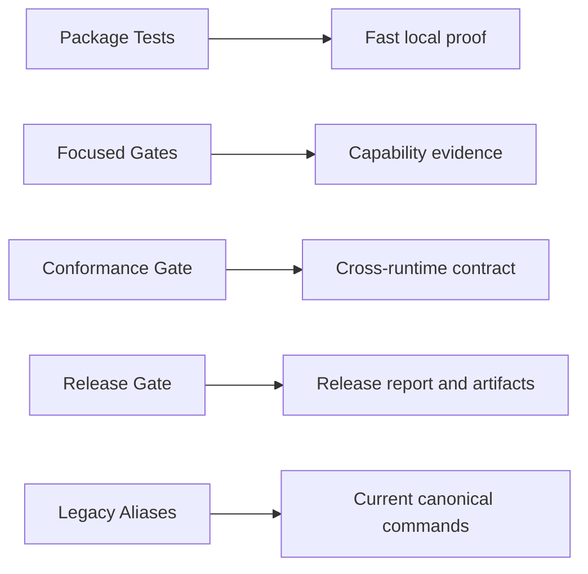
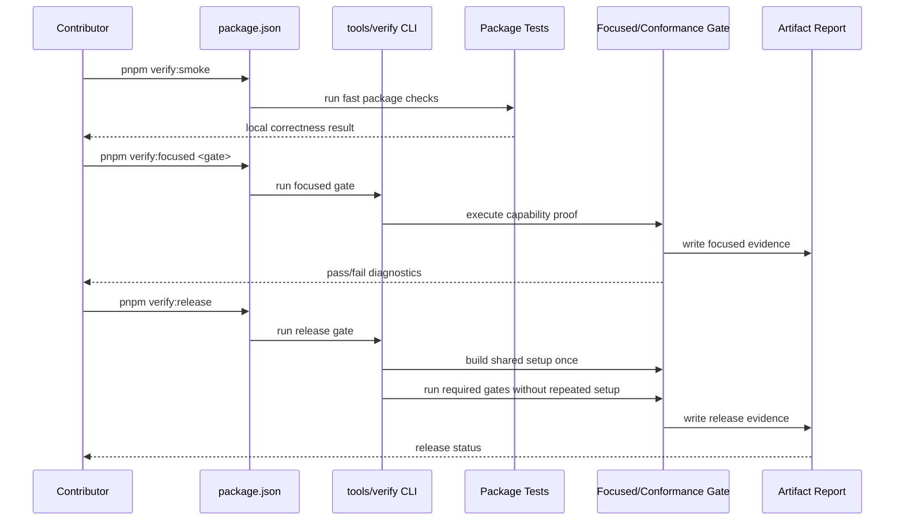

# Verification Strategy and Speed

Complexity: 6 -> MEDIUM mode

## 1. Context

**Problem:** ThreeNative must preserve verification accuracy and release
evidence quality, but the current verification surface is too broad,
too script-heavy, and too slow for normal iteration cycles.

**Files Analyzed:**

- `package.json`
- `tools/verify/src/cli/run.ts`
- `tools/verify/src/release.ts`
- `tools/verify/src/runner.ts`
- `tools/verify/src/legacyAliases.ts`
- `tools/verify/src/conformance.ts`
- `scripts/legacy-script-alias.mjs`
- `docs/PRDs/done/other/verification-gates-and-package-scripts-reorg.md`
- `docs/status/verification-speed-audit-2026-06-18.md`
- `packages/ir/fixtures/conformance/fixture-catalog.json`
- `tools/verify/artifacts/release/verification-report.json`
- `packages/ir/artifacts/conformance/verification-report.json`

**Current Behavior:**

- Root `package.json` has 70 scripts; 63 are verification or check related.
- 33 verification/check commands still call `scripts/*.mjs` directly, 16 route
  through `tools/verify`, 10 are legacy aliases, and 4 are other helpers.
- `scripts/` still contains 139 top-level `verify-*` or `check-*` files and 55
  matching top-level tests.
- The latest checked-in `verify:release` report passed in about 200 seconds with
  40 recorded steps.
- `verify:release` builds core packages, then invokes focused gates that often
  rebuild the same packages through `tools/verify/src/cli/run.ts`.
- Some verification scripts prove cross-runtime/release evidence, while others
  look like pure tests that should move to package-owned test suites.

## 2. Solution

**Approach:**

- Preserve the accuracy of cross-runtime proof and the quality of generated
  release artifacts as non-negotiable requirements.
- Define a hard ownership boundary between package tests, focused verification
  gates, conformance, release aggregation, and legacy historical aliases.
- Classify every root `verify-*` and `check-*` command by owner and outcome.
- Move pure assertions into package tests; keep only cross-package,
  cross-runtime, durable-artifact, and release-policy checks as verifier gates.
- Make `verify:release` build shared packages once and run focused gates without
  repeating setup.
- Add gate profiles so contributors can select the narrowest valid command:
  `smoke`, `changed`, `focused`, `release`, and `full`.
- Add timing metadata and budgets so verification performance regressions are
  visible.
- Make fast iteration paths explicit so contributors do not use the full release
  gate when a smaller proof is sufficient.

**Key Decisions:**

- Verification gates are appropriate for ThreeNative because the product promise
  is portable IR consumed by web Three.js and native Bevy.
- Optimization must not weaken cross-runtime parity checks, required artifact
  contracts, or diagnostic quality.
- Package tests remain the default home for pure logic and package-local
  behavior.
- Release verification is evidence-oriented and should not be the default local
  development loop.
- Standalone focused gates must keep their own setup path.
- Release orchestration should reuse setup and call typed gates or final gate
  commands directly.
- Script deletion is not the first optimization; classification and build reuse
  come first.

**Data Changes:** None.

## 3. Ownership Model

### Package Tests

These checks belong in `*.test.ts`, `*.test.mjs`, or Rust tests owned by the
package that implements the behavior:

- IR schema acceptance/rejection and semantic validation.
- Diagnostic shape, codes, severities, paths, and suggested fixes.
- Artifact path helpers, fixture catalog parsing, and report serialization.
- Compiler extraction, emitted bundle shape, and stable IR serialization.
- Runtime-local mapping, scheduling, input, audio, persistence, and error paths.
- CLI argument parsing, exit codes, and generated file layout for small fixtures.
- Verify-tool command selection, legacy alias resolution, timing metadata, and
  artifact contract unit behavior.

Rule: if the assertion can run against in-memory data, a small fixture, or one
package boundary, it should be a normal test.

### Focused Verification Gates

These checks remain in `tools/verify` as focused gates:

- One capability flowing through emitted bundle artifacts and at least one
  runtime path.
- Capability evidence that writes durable reports used by docs, status, or drift
  tracking.
- Native/web parity checks that are narrower than the full conformance suite.

Rule: if the proof exists to validate a real capability slice across generated
artifacts or runtimes, it is a focused gate.

### Conformance Gate

`verify:conformance` owns canonical fixture parity:

- The same IR bundle is consumed by web Three.js and native Bevy.
- Runtime observations are compared against the stable IR contract.
- Current fixture coverage is determined from the fixture catalog.

Rule: if the proof is about shared IR contract compatibility across runtimes, it
belongs in conformance.

### Release Gate

`verify:release` owns aggregation:

- Required current focused gates run.
- Conformance, sample-scene, and visual matrix proof are present.
- Required artifacts exist at canonical locations.
- The final release report is machine-readable and evidence-oriented.

Rule: release should aggregate required proof; it should not contain unique logic
that cannot be run or tested elsewhere.

### Legacy Aliases

Historical milestone commands should route to canonical commands or remain as
temporary compatibility wrappers with deprecation diagnostics.

Rule: old milestone names are not the product front door.

## 4. Sequence Flow

## 5. Execution Phases

#### Phase 1: Script Classification - Every verification command has an owner, outcome, and quality requirement.

**Files:**

- `docs/status/verification-script-classification.md` - classification table for
  every root `verify-*` and `check-*` command.
- `tools/verify/src/cli/run.ts` - add owner/profile/reason metadata for focused
  gates.
- `tools/verify/src/cli/run.test.ts` - validate metadata coverage.
- `docs/workflows/developer-workflow.md` - document the ownership model.
- `docs/status/verification-speed-audit-2026-06-18.md` - link this PRD as the
  implementation plan.

**Implementation:**

- [x] Classify each root verification/check script as `test`, `focused-gate`,
  `conformance-gate`, `release-gate`, `legacy-alias`, or `delete`.
- [x] Record replacement command or package test owner for each script.
- [x] Require every kept verifier to explain why it cannot be an ordinary test.
- [x] Record the accuracy or output-quality requirement each kept verifier
  protects.
- [x] Add profile metadata for all focused gates in `tools/verify`.

**Tests Required:**

| Test File | Test Name | Assertion |
| --- | --- | --- |
| `tools/verify/src/cli/run.test.ts` | `should expose focused gate ownership metadata` | Every focused gate has owner, profile, and reason metadata. |
| `tools/verify/src/cli/run.test.ts` | `should reject unclassified focused gates` | Missing metadata fails the verify-tool test suite. |

**Verification:**

- Run `pnpm --filter @threenative/verify-tools test`.
- Review `docs/status/verification-script-classification.md` and confirm no
  release-path script lacks a verifier reason.

#### Phase 2: Test Migration - Pure assertions move out of release scripts without losing coverage.

**Files:**

- Package-owned test files identified by
  `docs/status/verification-script-classification.md`.
- `tools/verify/src/*` test files for verify-tool-only assertions.
- `scripts/*.mjs` wrappers identified as pure test candidates.
- `package.json` - remove or reroute commands only after equivalent test
  coverage exists.
- `docs/status/verification-script-classification.md` - update outcomes after
  each migration.

**Implementation:**

- [ ] Move pure validation, serialization, CLI, artifact-helper, and command
  selection assertions into package tests.
- [ ] Keep cross-runtime/evidence behavior in verifier modules.
- [ ] Remove or deprecate scripts whose behavior is fully covered by tests.
- [ ] Preserve public commands that still have a contributor use case.
- [ ] Prove migrated tests still catch the same failure modes as the old script.

**Tests Required:**

| Test File | Test Name | Assertion |
| --- | --- | --- |
| Package-specific tests from classification | `should preserve migrated script behavior` | Moved assertions match the old script behavior. |
| `tools/verify/src/legacyAliases.test.ts` | `should route deleted script names to replacements when compatibility is required` | Legacy commands still point to supported commands or clear diagnostics. |

**Verification:**

- Run the package tests touched by the migration.
- Run `pnpm --filter @threenative/verify-tools test`.
- Run the affected root command once if it remains public.

#### Phase 3: Build Reuse - Release stops repeating focused gate setup while preserving evidence.

**Files:**

- `tools/verify/src/cli/run.ts` - split focused gate setup commands from verifier
  commands.
- `tools/verify/src/release.ts` - execute focused gates in no-setup mode after
  release setup builds complete.
- `tools/verify/src/cli/run.test.ts` - cover standalone and no-setup execution.
- `tools/verify/src/release.test.ts` - prove release uses no-setup focused gates.

**Implementation:**

- [ ] Keep standalone focused gates self-contained.
- [ ] Add an internal release path that skips already-completed package builds.
- [ ] Ensure release artifact checks still run after every focused gate.
- [ ] Preserve existing release artifact paths.
- [ ] Confirm release output quality is unchanged: same required reports, same
  diagnostic shape, same artifact ownership.

**Tests Required:**

| Test File | Test Name | Assertion |
| --- | --- | --- |
| `tools/verify/src/cli/run.test.ts` | `should run setup for standalone focused gate` | Normal focused gate executes build commands before verifier. |
| `tools/verify/src/cli/run.test.ts` | `should skip setup when requested by release` | No-setup mode executes only verifier commands. |
| `tools/verify/src/release.test.ts` | `should not rebuild focused gate packages after release setup` | Release step list contains shared builds once. |

**Verification:**

- Run `pnpm --filter @threenative/verify-tools test`.
- Run `pnpm verify:release` and compare duration against the 200 second baseline.

#### Phase 4: Gate Profiles and Timing Budgets - Developers get the narrowest accurate loop.

**Files:**

- `tools/verify/src/cli/run.ts` - add profile-aware gate selection.
- `tools/verify/src/runner.ts` - add step category/timing metadata.
- `tools/verify/src/release.ts` - include setup/gate/artifact timing categories
  and budget warnings.
- `package.json` - add stable profile commands if needed.
- `docs/workflows/developer-workflow.md` - document which command to run for
  common change types.

**Implementation:**

- [ ] Define `smoke`, `changed`, `focused`, `release`, and `full` profiles.
- [ ] Document when each profile is required.
- [ ] Add release report timing categories for setup, focused gate,
  conformance, visual/native, and artifact checks.
- [ ] Start timing budgets as warnings until baselines stabilize.
- [ ] Document which profiles are acceptable for local iteration, pre-PR review,
  release preparation, and full compatibility sweeps.

**Tests Required:**

| Test File | Test Name | Assertion |
| --- | --- | --- |
| `tools/verify/src/cli/run.test.ts` | `should list gates by profile` | Profiles resolve deterministic gate sets. |
| `tools/verify/src/release.test.ts` | `should categorize release timing steps` | Release report includes timing categories. |
| `tools/verify/src/release.test.ts` | `should preserve release artifact contract` | Profile metadata does not remove required artifacts. |

**Verification:**

- Run `pnpm --filter @threenative/verify-tools test`.
- Run the documented smoke command.
- Run `pnpm verify:release`.

## 6. Acceptance Criteria

- [x] Every root verification/check script has a documented owner and outcome.
- [ ] Pure assertions are covered by package tests, not release scripts.
- [x] Every remaining verifier gate documents why it is not an ordinary test.
- [x] Every remaining verifier gate documents the accuracy, parity, diagnostic,
  or artifact-quality requirement it protects.
- [ ] `verify:release` does not rebuild shared packages inside focused gates
  after initial release setup.
- [ ] Focused gates remain runnable standalone.
- [ ] Release reports include timing categories and budget warnings.
- [ ] Developer workflow docs identify the narrowest gate for common change
  categories.
- [ ] Local iteration guidance avoids full release verification unless release
  evidence or broad cross-runtime proof is actually required.
- [ ] Legacy aliases remain compatible or print stable deprecation diagnostics
  with replacements.
- [ ] The release artifact contract remains unchanged.
- [ ] No optimization removes required conformance checks, focused evidence
  reports, diagnostic fields, or artifact ownership guarantees.
