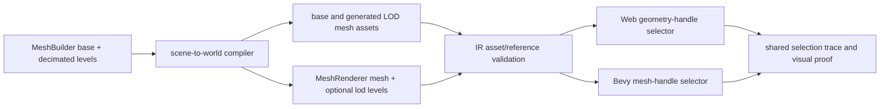
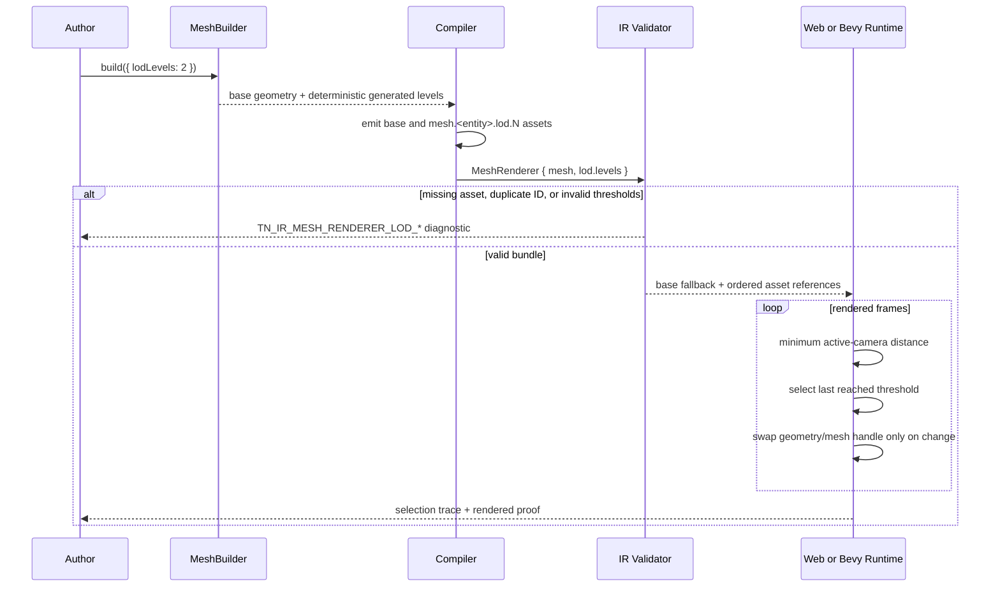

# PRD: Procedural Generated-Mesh LOD Contract And Runtime Selection

Complexity: 9 -> HIGH mode

Date: 2026-07-14
Status: PLANNED
Owner: IR, compiler, web runtime, and native runtime
Parent: `docs/PRDs/procedural-geometry-v2-2026-07-11.md` Phase 5

## 1. Context

**Problem:** Procedural Geometry V2 can generate decimated custom-mesh assets,
but the repository has no world-entity LOD contract or runtime behavior that
can select those assets for a procedural `MeshRenderer`.

**Why this is a separate PRD:** The parent PRD requires Phase 5 to reuse an
already-promoted LOD contract and explicitly says to stop and split a follow-up
PRD if that contract needs an addition. Current evidence proves that addition
is required:

- `IMeshRendererComponent` has one `mesh` reference and no LOD field
  (`packages/ir/src/types.ts:416-422`).
- The only shared LOD type is `IEnvironmentSourceAssetIr.lod`
  (`packages/ir/src/types.ts:1219-1242`).
- Environment validation builds its allowed asset set from `kind: "model"`
  only, then rejects base and level references outside that set
  (`packages/ir/src/environment.ts:51-76`, `:145-183`).
- Procedural geometry emits `kind: "mesh", format: "generated"` assets
  (`packages/ir/src/types.ts:887-919` and
  `packages/compiler/src/emit/scene-to-world.ts:193-223`).
- The environment web path loads the base GLTF model and does not replace it
  with an LOD level (`packages/runtime-web-three/src/environment.ts:111-190`);
  its distance helper currently produces observation data only
  (`packages/runtime-web-three/src/environment.ts:327-335`).
- Native environment LOD currently records asset/impostor traces rather than
  swapping render meshes (`runtime-bevy/crates/threenative_runtime/src/assets.rs:628-675`).

The existing environment contract remains useful for vegetation/model source
assets, but it cannot be reused for generated scene meshes without broadening
its product boundary and changing both adapters. This PRD introduces a small,
optional world-renderer contract instead.

**Complexity score:** +3 for more than 10 implementation files, +2 for a new
runtime selection system, +2 for camera/distance state behavior, and +2 for
multi-package IR/compiler/web/Bevy changes = 9 (HIGH).

**Files analyzed:** `packages/ir/src/types.ts`, `packages/ir/src/validate.ts`,
`packages/ir/src/environment.ts`, `packages/compiler/src/emit/scene-to-world.ts`,
`packages/compiler/src/emit/environment.ts`,
`packages/runtime-web-three/src/mapWorld.ts`,
`packages/runtime-web-three/src/environment.ts`,
`runtime-bevy/crates/threenative_loader/src/types.rs`,
`runtime-bevy/crates/threenative_runtime/src/map_world.rs`,
`runtime-bevy/crates/threenative_runtime/src/map_world/rendering.rs`, and
`runtime-bevy/crates/threenative_runtime/src/assets.rs`.

### Current behavior

- A procedural `MeshBuilder` result lowers to one generated mesh asset and one
  `MeshRenderer.mesh` reference.
- The parent PRD has not yet defined a runtime-consumable distance policy for
  the `lodLevels: 2` shorthand.
- IR validation checks only the base `MeshRenderer.mesh` reference
  (`packages/ir/src/validate.ts:1152-1192`).
- Web and Bevy reconstruct generated custom meshes, but neither owns a system
  that changes an entity's mesh by active-camera distance.
- Existing bundles and authored scenes assume a single stable base mesh.

## 2. Goals

1. Add one optional, version-compatible LOD contract to `MeshRenderer` for
   generated mesh asset references and ordered distance thresholds.
2. Lower procedural builder LOD metadata into deterministic variant asset IDs
   and the shared renderer contract.
3. Make web and Bevy select and render the same level at the same distance.
4. Preserve the base mesh as a correct fallback when LOD is absent, invalid,
   unsupported by an older runtime, or no active camera exists.
5. Prove asset emission, validation, selection traces, rendered switching,
   and near/far visual acceptability on both targets.

## 3. Non-goals

- Changing `IEnvironmentSourceAssetIr.lod`, environment instancing, HLOD,
  impostors, fades, or streaming.
- Runtime mesh generation or runtime decimation.
- Cross-fading, geomorphing, occlusion culling, screen-space-error selection,
  or GPU-driven indirect drawing.
- Per-material LOD variants; all levels reuse the base renderer material and
  shadow/visibility settings.
- Dynamically authoring or mutating LOD level arrays from gameplay scripts.
- Changing runtime deformation, terrain streaming, or GPU geometry boundaries.

## 4. Integration Points

**How will this feature be reached?**

- [x] Entry point: an author calls
  `MeshBuilder.build({ lodLevels: 2 })` or supplies explicit generated-level
  descriptors through the parent procedural geometry API.
- [x] Caller: `packages/compiler/src/emit/scene-to-world.ts` consumes optional
  LOD generation metadata carried by `CustomMeshGeometry`.
- [x] Wiring: compiler emission adds generated variant assets and optional
  `MeshRenderer.lod`; IR validation owns reference and threshold rules; web
  mapping and native world mapping register runtime selectors.

**Is this user-facing?** Yes, developer/agent-facing authoring plus visible
runtime behavior. There is no new GUI.

**Full user flow:**

1. Author builds a procedural hero prop with `lodLevels` and adds it to a
   scene as a normal SDK `Mesh`.
2. The builder deterministically produces base and reduced geometry plus
   target ratios and transition distances.
3. The compiler emits one generated asset per level and an optional LOD block
   on the entity's existing `MeshRenderer`.
4. IR validation proves every level points to a distinct generated mesh and
   uses ordered finite distances.
5. Web and native choose a level from active-camera distance while preserving
   the entity, transform, material, visibility, layers, shadows, and picking.
6. Playtest traces and near/far captures show the same selected asset and a
   recognizable silhouette on both targets.

## 5. Contract And Solution

### Shared IR contract

Extend `IMeshRendererComponent` with one optional field:

```ts
export interface IMeshRendererLodLevelIr {
  mesh: string;
  minDistance: number;
}

export interface IMeshRendererComponent {
  // Existing fields remain unchanged.
  mesh: string;
  material: string;
  lod?: {
    levels: readonly IMeshRendererLodLevelIr[];
  };
}
```

Selection semantics are exact and shared:

- `MeshRenderer.mesh` is LOD0 and is selected below the first threshold.
- Levels are sorted by strictly increasing `minDistance`.
- At distance `d`, select the last level whose `minDistance <= d`; otherwise
  select the base mesh.
- Distance is Euclidean world-space distance from an entity's world transform
  origin to each active rendered camera's world transform. With multiple
  active cameras, use the minimum distance so a close view never receives a
  lower-detail mesh. A later screen-space metric can be a new optional mode;
  it is not inferred here.
- With no valid active camera, select the base mesh and emit no warning.
- Threshold equality selects the new level. No cross-fade or hysteresis is
  implied.
- Selection affects render geometry only. Physics colliders, ray-query
  contract bounds, transforms, materials, and authored gameplay state remain
  based on the base entity contract.

Validation requirements:

- `levels` must contain 1-4 entries.
- Every `minDistance` must be finite, positive, and strictly increasing.
- Every level mesh must exist, be `kind: "mesh"`, and differ from the base and
  every other level.
- Procedural compiler output must reference `format: "generated"`,
  `primitive: "custom"` variants. The shared IR remains asset-kind-based so a
  future authoring surface may opt into other mesh formats deliberately.
- Diagnostics use stable `TN_IR_MESH_RENDERER_LOD_*` codes with exact paths,
  values, and suggested fixes.

### Procedural shorthand and compiler ownership

The parent PRD's `lodLevels: number` shorthand remains supported. Its default
policy must be deterministic and documented rather than adapter-specific:

- ratios are `0.5 ** levelIndex` for level indices starting at 1;
- transition distances are
  `max(1, max(bounds.max - bounds.min)) * 10 * (2 ** (levelIndex - 1))`;
- explicit level descriptors may override `ratio` and `minDistance`, but must
  pass the same ordering/range validation;
- ratios are decimation targets, not guarantees; actual triangle counts and
  accepted tolerance remain owned by the parent PRD's decimator tests.

The compiler, not the SDK, owns final asset references. For base asset
`mesh.<entityId>`, emitted IDs are `mesh.<entityId>.lod.1` through `.lod.N`.
Emission must fail on ID collision; it must never silently rename an asset.
Binary attributes and indices use the existing bundle-local payload writer.

### Runtime strategy

- Web keeps the existing entity object and material. It prebuilds/caches each
  generated `BufferGeometry`, then a small selector swaps the mesh geometry at
  selection boundaries. This preserves hierarchy, picking identity, layers,
  shadows, visibility, and system references better than replacing the entity
  with `THREE.LOD` children.
- Bevy maps all level asset IDs to `Handle<Mesh>`, attaches a native LOD
  component containing ordered thresholds/handles, and registers one system
  that swaps the render mesh handle after transforms and active-camera state
  are available.
- Both adapters expose the same trace tuple:
  `{ entity, distance, selectedMesh, threshold }`. Trace output is sorted by
  entity ID and records the selected base mesh with threshold `0`.
- Selection work is O(active LOD entities * active cameras), with no asset
  allocation or geometry reconstruction per frame. A later spatial index is
  justified only by profiling.



### Key decisions

- [ ] LOD is optional metadata on `MeshRenderer`, not an extension of the
  model-only environment source-asset contract.
- [ ] The base `mesh` remains authoritative and independently renderable.
- [ ] Level entries reference existing assets; they do not embed geometry in
  `world.ir.json`.
- [ ] All target-specific selectors implement one pure threshold-selection
  algorithm with shared fixtures.
- [ ] No runtime reconstructs or decimates geometry.
- [ ] Unsupported/invalid authored data fails during bundle validation; a
  runtime never guesses around an invalid level.
- [ ] Runtime traces are evidence only after a rendered mesh swap is tested;
  trace-only implementation does not satisfy this PRD.

### Data changes and versioning

- Add optional `MeshRenderer.lod`; no existing required field changes.
- Keep world and asset schema versions at `0.1.0` unless the repository's
  schema policy requires an additive minor bump. If a bump is required, update
  all documents and loaders atomically rather than accepting mixed versions.
- Do not add LOD metadata to each asset. Ownership stays on the renderer that
  selects among assets.

## 6. Sequence Flow



## 7. Execution Phases

#### Phase 1: Promote the shared renderer contract - Bundles can describe and validate generated-mesh LOD safely

**Files (max 5):**

- `packages/ir/src/types.ts` - optional `MeshRenderer.lod` and level type
- `packages/ir/src/validate.ts` - LOD shape, ordering, reference, and asset-kind validation
- `packages/ir/src/validate.test.ts` - positive and diagnostic-path coverage
- `runtime-bevy/crates/threenative_loader/src/types.rs` - backwards-compatible serde representation
- `runtime-bevy/crates/threenative_loader/tests/load_bundle.rs` - loader round-trip/absence coverage

**Implementation:**

- [ ] Add the optional contract exactly as specified above.
- [ ] Validate count, finite positive ordered thresholds, uniqueness, base
  cycles, asset existence, and `kind: "mesh"`.
- [ ] Preserve unknown-field and schema-version policies already used by
  world components; do not special-case generated JSON parsing.
- [ ] Deserialize absent `lod` as `None`; serialize existing renderers without
  adding `lod: null`.
- [ ] Add stable actionable diagnostics for every invalid case.

**Tests Required:**

| Test File | Test Name | Assertion |
| --- | --- | --- |
| `packages/ir/src/validate.test.ts` | `should accept ordered mesh renderer LOD levels when assets exist` | no diagnostics; generated mesh references accepted |
| `packages/ir/src/validate.test.ts` | `should reject missing duplicate and non-mesh LOD references` | exact `TN_IR_MESH_RENDERER_LOD_*` codes and paths |
| `packages/ir/src/validate.test.ts` | `should reject unordered or non-finite LOD thresholds` | threshold diagnostics are deterministic |
| loader test | `should deserialize world without mesh renderer LOD` | old fixture remains byte/shape compatible |
| loader test | `should round trip optional mesh renderer LOD` | levels and distances preserved |

**Verification Plan:**

1. `pnpm --filter @threenative/ir test`
2. `cargo test --manifest-path runtime-bevy/Cargo.toml -p threenative_loader`
3. `pnpm verify:conformance` against unchanged fixtures to prove additive compatibility.

**User Verification:** Validate a hand-built world fixture containing base,
LOD1, and LOD2 generated mesh assets. Expected: the valid fixture passes and
changing a level to a texture asset produces a precise diagnostic.

**Checkpoint:** automated (`prd-work-reviewer`).

---

#### Phase 2: Lower procedural levels into bundle assets - One build call emits deterministic variants and wiring

**Files (max 5):**

- `packages/sdk/src/geometry/primitives.ts` - generated-level metadata contract required by the parent decimator
- `packages/compiler/src/emit/scene-to-world.ts` - variant asset IDs and `MeshRenderer.lod` wiring
- `packages/compiler/src/emit/scene-to-world.test.ts` - asset count, IDs, thresholds, precedence, and collision tests
- `packages/compiler/src/emit/bundle.ts` - only if binary payload enrollment needs a shared emitted-asset type update
- `packages/compiler/src/emit/bundle.test.ts` - binary payload hash and old-bundle stability proof

**Implementation:**

- [ ] Consume the parent PRD's decimated level data without recomputing it.
- [ ] Normalize number shorthand/default thresholds once in SDK/compiler-owned
  code; adapters receive only explicit IR thresholds.
- [ ] Emit `.lod.N` custom mesh assets in level order using the existing
  inline/binary storage path and stable JSON ordering.
- [ ] Revalidate every emitted level against mesh attributes, indices, bounds,
  budget, finite values, and triangle-list invariants.
- [ ] Fail with a stable compiler diagnostic on asset-ID collision or invalid
  generated-level data.
- [ ] Geometry without LOD metadata must emit byte-for-byte-equivalent base
  asset and `MeshRenderer` shapes.

**Tests Required:**

| Test File | Test Name | Assertion |
| --- | --- | --- |
| `scene-to-world.test.ts` | `should emit one generated asset per procedural LOD level` | base plus N assets and exact renderer wiring |
| `scene-to-world.test.ts` | `should derive deterministic LOD IDs and default thresholds` | IDs/formula match contract across two runs |
| `scene-to-world.test.ts` | `should reject procedural LOD asset ID collision` | stable compiler diagnostic, no silent rename |
| `bundle.test.ts` | `should emit byte-identical procedural LOD payloads across rebuilds` | manifest metadata and every binary hash match |
| `bundle.test.ts` | `should preserve legacy procedural mesh output when LOD is absent` | existing fixture output unchanged |

**Verification Plan:**

1. `pnpm --filter @threenative/compiler test`
2. `pnpm --filter @threenative/sdk test`
3. `pnpm typecheck`
4. `pnpm verify:conformance`

**User Verification:** Compile one procedural mesh with `lodLevels: 2` and
inspect `assets.manifest.json` plus `world.ir.json`. Expected: three distinct
custom mesh assets and two ordered level references; the base renderer remains
valid on its own.

**Checkpoint:** automated (`prd-work-reviewer`).

---

#### Phase 3: Render selected levels on web - Moving the active camera changes geometry without replacing entity identity

**Files (max 5):**

- `packages/runtime-web-three/src/meshLod.ts` - pure selection helper, cache, updater, and trace
- `packages/runtime-web-three/src/mapWorld.ts` - register LOD geometry handles on mapped meshes
- `packages/runtime-web-three/src/render.ts` - invoke the selector after camera/world transforms update
- `packages/runtime-web-three/src/meshLod.test.ts` - threshold, multi-camera, fallback, and swap coverage
- `packages/runtime-web-three/src/mapWorld.test.ts` - generated asset integration and preserved material/picking identity

**Implementation:**

- [ ] Build all level geometries through the existing generated-mesh mapper.
- [ ] Select from world-space transforms and minimum active-camera distance.
- [ ] Swap geometry only when the selected asset changes; dispose only through
  existing world teardown ownership.
- [ ] Preserve object ID, material, layers, visibility, cast/receive shadow,
  hierarchy, and picking/system lookup behavior.
- [ ] Expose deterministic per-entity selection traces tied to actual geometry
  state, including the base selection.

**Tests Required:**

| Test File | Test Name | Assertion |
| --- | --- | --- |
| `meshLod.test.ts` | `should select base and last reached LOD threshold` | below/equal/above boundary semantics match contract |
| `meshLod.test.ts` | `should use closest active camera for LOD selection` | multi-view never lowers a close view |
| `meshLod.test.ts` | `should keep base mesh when no active camera exists` | no warning and no swap |
| `meshLod.test.ts` | `should avoid geometry reassignment when selected level is unchanged` | stable handle/object identity |
| `mapWorld.test.ts` | `should swap procedural geometry while preserving renderer state` | geometry changes; entity/material/picking identity stays |

**Verification Plan:**

1. `pnpm --filter @threenative/runtime-web-three test`
2. `pnpm typecheck`
3. Browser playtest at distances immediately below/at/above each threshold.

**User Verification:** Move the preview camera through both thresholds.
Expected: trace and rendered triangle-count observation change together, with
no material flash, lost picking, or hierarchy change.

**Checkpoint:** automated + manual rendered-transition review.

---

#### Phase 4: Render selected levels on Bevy - Desktop uses the same thresholds and selected asset IDs

**Files (max 5):**

- `runtime-bevy/crates/threenative_runtime/src/mesh_lod.rs` - native component, selection system, and trace
- `runtime-bevy/crates/threenative_runtime/src/map_world.rs` - validate/register level mesh handles
- `runtime-bevy/crates/threenative_runtime/src/map_world/entities.rs` - attach native LOD state during entity spawn
- `runtime-bevy/crates/threenative_runtime/src/lib.rs` - register the system in the owned render/update schedule
- `docs/status/SYSTEMS_CODE_QUALITY_STATUS.md` - record the new system, ownership, schedule, and risk

**Implementation:**

- [ ] Resolve all level assets through the existing mesh asset/handle registry;
  missing handles fail with a native diagnostic even after IR validation.
- [ ] Store ordered thresholds and handles once at mapping time.
- [ ] Run selection after `GlobalTransform` and active-camera state are current,
  and update only changed mesh handles.
- [ ] Match web base/equality/multi-camera/no-camera semantics exactly.
- [ ] Produce the shared sorted trace shape from actual selected handles.
- [ ] Record the new runtime system and ownership/risk in
  `docs/status/SYSTEMS_CODE_QUALITY_STATUS.md` during implementation, as
  required by repository work rules.

**Tests Required:**

| Test File | Test Name | Assertion |
| --- | --- | --- |
| `src/mesh_lod.rs` unit tests | `should map generated mesh LOD handles from renderer contract` | base and every level resolve |
| `src/mesh_lod.rs` unit tests | `should select same assets at shared threshold fixture distances` | expected IDs match web fixture table |
| `src/mesh_lod.rs` unit tests | `should use closest active camera and world transform` | hierarchy/global position handled |
| `src/mesh_lod.rs` unit tests | `should preserve base handle when camera is absent` | no swap/diagnostic |
| `src/mesh_lod.rs` unit tests | `should emit trace from the currently rendered mesh handle` | trace cannot pass without real swap |

**Verification Plan:**

1. `cargo test --manifest-path runtime-bevy/Cargo.toml -p threenative_runtime mesh_lod`
2. `cargo check --manifest-path runtime-bevy/Cargo.toml --workspace`
3. `pnpm verify:conformance`
4. Desktop playtest through the same threshold positions as web.

**User Verification:** Run the procedural LOD scenario with
`tn playtest --target desktop`. Expected: native trace IDs match web at each
camera position and the rendered mesh handle changes without despawning the
entity.

**Checkpoint:** automated + manual desktop transition review.

---

#### Phase 5: Prove parity and promote the capability - Generated LOD is release-gated rather than trace-only

**Files (max 5):**

- `packages/ir/fixtures/conformance/procedural-mesh-lod/` - base/LOD assets, camera positions, and expected selections
- `tools/verify/src/` - registry-owned generated-mesh LOD proof enrollment and trace comparison
- `docs/status/capabilities/rendering.md` - capability evidence and exact boundary
- `docs/STATUS.md` - one-line capability index update
- `docs/bevy-feature-parity.md` - generated-mesh LOD promotion; environment/HLOD boundaries unchanged

**Implementation:**

- [ ] Add one conformance fixture with visibly distinct but recognizable base,
  LOD1, and LOD2 triangle counts.
- [ ] Derive proof enrollment from the owning fixture/gate registry or add a
  drift test; do not create a second hand-maintained list.
- [ ] Capture near, exact-threshold, and far frames on web and desktop.
- [ ] Compare selected asset ID, threshold, triangle count, transform, material,
  and silhouette evidence across adapters.
- [ ] Promote only generated scene-mesh LOD. Keep environment instancing/HLOD,
  fades, impostors, runtime generation, deformation, and streaming truth-graded
  at their existing levels.
- [ ] Confirm Phase 4's `docs/status/SYSTEMS_CODE_QUALITY_STATUS.md` entry
  remains accurate after final gate integration.

**Tests Required:**

| Test/Gate | Test Name | Assertion |
| --- | --- | --- |
| conformance | `should report matching generated mesh LOD selections` | web/native selected IDs and thresholds match |
| visual gate | `should preserve procedural LOD silhouette across targets` | near/far captures meet documented tolerance |
| drift test | `should enroll every generated mesh LOD fixture once` | registry, fixture, and gate cannot drift |
| docs check | existing docs checks | capability links and status index remain valid |

**Verification Plan:**

1. `pnpm check:docs`
2. `pnpm build && pnpm typecheck && pnpm test`
3. `pnpm verify:conformance`
4. `pnpm verify:smoke`
5. Run the focused generated-mesh LOD gate on web and desktop and inspect all
   near/threshold/far captures.

**User Verification:** Move the camera through the committed proof scenario.
Expected: the selected asset switches at the same distances, LOD1 remains
recognizable, and both adapters report/render the same level.

**Checkpoint:** automated + manual screenshot/trace review.

## 8. Checkpoint Protocol

After each phase, spawn `prd-work-reviewer` with this PRD path and phase number.
Proceed only on PASS. Phases 3-5 additionally require the manual rendered
verification listed in each phase. A trace without a tested render-state change
is a checkpoint failure.

## 9. Migration And Backward Compatibility

- Existing bundles omit `MeshRenderer.lod` and retain identical rendering.
- New runtimes must treat absent LOD as the current single-mesh path with no
  extra per-frame work.
- The base `MeshRenderer.mesh` remains required and complete. An older runtime
  that ignores the additive `lod` field still renders the high-detail base
  mesh correctly; emitted LOD assets are unused but harmless.
- New compilers must not add `lod` or extra assets unless authoring metadata is
  present. Recompiling an old project must not change its world/asset output.
- New validation diagnostics apply only when the optional field is present.
- Rust serde fields use `Option`/defaults compatible with existing bundle
  fixtures. Do not introduce `deny_unknown_fields` as part of this feature.
- Variant asset IDs are deterministic and reserved beneath the base asset ID.
  A project already using one must receive a collision diagnostic and choose a
  different entity/base ID; compiler renaming would break reproducibility.
- Generated LOD assets increase bundle size. Verification must report base and
  total LOD payload bytes, but this PRD does not introduce streaming.
- Runtime capability negotiation/release gates must prevent claiming LOD
  behavior on an adapter version that only renders the base fallback.

## 10. Risks

- **Trace-only false promotion:** existing environment LOD evidence is largely
  observational. Mitigation: adapter tests assert the actual geometry/mesh
  handle and visual gates capture boundary transitions.
- **Selection disagreement:** active cameras, hierarchy, and equality can
  diverge. Mitigation: exact semantics above plus shared distance/expected-ID
  fixture tables consumed by both adapters.
- **Object identity regressions on web:** replacing objects breaks picking and
  systems. Mitigation: swap cached geometry on the existing mesh.
- **Schedule/order bugs on native:** stale transforms cause one-frame errors.
  Mitigation: explicit system ordering after global transforms/camera state and
  tests with parented entities.
- **Memory and bundle growth:** all variants are resident. Mitigation: cap four
  levels, report bytes, reuse handles, and defer streaming to its own PRD.
- **Physics mismatch:** visual LOD must not alter collision. Mitigation: collider
  derivation remains based on the base generated geometry and is asserted in
  the conformance fixture.
- **Thin-feature collapse:** owned by the parent decimator. This contract only
  promotes a level after its asset independently passes mesh validation and
  visual acceptance.

## 11. Acceptance Criteria

- [ ] All five phases complete and every checkpoint passes.
- [ ] Optional `MeshRenderer.lod` validates with stable diagnostics and old
  bundles deserialize/render unchanged.
- [ ] Procedural `lodLevels` emits deterministic `.lod.N` assets, thresholds,
  and byte-identical binary payloads across rebuilds.
- [ ] Web and Bevy render the same selected asset below, at, and above every
  threshold, including multi-camera and parented-transform cases.
- [ ] The base mesh renders when LOD is absent, no camera exists, or an older
  runtime ignores the optional field.
- [ ] Actual geometry/mesh handles change; trace-only selection is insufficient.
- [ ] Materials, hierarchy, picking identity, layers, visibility, shadows, and
  physics collider behavior remain unchanged across switches.
- [ ] `pnpm check:docs`, `pnpm build`, `pnpm typecheck`, `pnpm test`,
  `pnpm verify:conformance`, and `pnpm verify:smoke` pass.
- [ ] Focused web/native near-threshold-far visual evidence is committed and
  manually accepted.
- [ ] `docs/status/capabilities/rendering.md`, `docs/STATUS.md`,
  `docs/bevy-feature-parity.md`, and
  `docs/status/SYSTEMS_CODE_QUALITY_STATUS.md` reflect the promoted capability
  and unchanged boundaries.
- [ ] The finished PRD is moved to `docs/PRDs/done` only after all evidence is
  present.

## 12. Verification Evidence

(To be filled phase by phase during implementation.)
