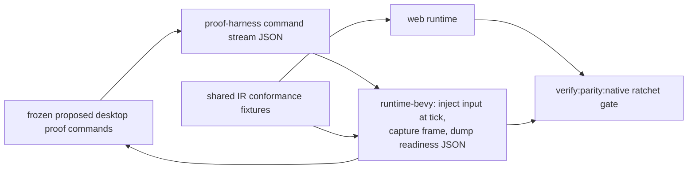

# PRD: Native Parity Closure And Proof Loop — Bevy Feels And Proves Like Web

`Planning Mode: Principal Architect`
`Complexity: 7 → HIGH mode`

Score basis: +3 touches 10+ files across Rust crates and TS tooling, +2
multi-package (runtime-bevy crates, cli, ir fixtures, tools/verify), +2
runtime state/scheduling semantics (script authority, input injection).

## 1. Context

**Problem:** The "looks awesome by default, easy for agents" goal only holds
if the native runtime keeps up. Today four web-ahead gaps are explicitly
recorded, and — most damaging for agent workflows — an agent **cannot prove
anything on native**: `tn playtest`, `tn screenshot`, and `tn record` inject
input and read readiness only on the web runtime. Native evidence is
hand-gathered, so agents rationally optimize for web and native drifts.

**Recorded gaps this PRD closes** (all in `docs/bevy-feature-parity.md` and
`docs/STATUS.md`):

1. Script kinematic authority: web skips kinematic velocity integration for
   entities a script posed in the same tick (abstractions PRD Phase 1);
   "Native Bevy does not yet have an equivalent script-authority execution
   hook" (parity ~121–128).
2. `KinematicMover` component: web-only (parity ~129–134; `docs/STATUS.md`
   ~line 137). Declarative hazards silently don't move on native.
3. Playtest/screenshot/record input injection: web-only (parity ~169,
   230–236; `docs/STATUS.md` ~2548).
4. Web `character.move` `direction`/`speed` overrides (abstractions Phase 1)
   need the equivalent native service behavior proven.

New declarative contracts from sibling PRDs (`Spawner`, `GameFlow`,
`Sequence`, terrain, cinematic profile) each carry their own Bevy phases;
this PRD owns the *pre-existing* debt plus the native proof harness they all
depend on.

**Files Analyzed:**

- `runtime-bevy/crates/threenative_runtime/src/{systems_host,systems_effects,
  systems_services,physics,input,rendering}.rs`; `systems_host_bridge.rs`
  (QuickJS bridge); `NativeGameLoopState` accumulator tick.
- `packages/runtime-web-three/src/character.ts` + physics step (the web
  script-authority implementation to mirror), `src/systems/context.ts`
  (`character.move` overrides).
- `packages/cli/src/commands/{playtest,visualProof,dev}.ts`,
  `packages/cli/src/native/bevy.ts` (`runBevyRuntime`).
- `packages/ir/fixtures/` conformance harness; `tools/verify/src`.
- Web readiness contract: `globalThis.__THREENATIVE_READY__` diagnostics
  consumed by Playwright-based proof commands.

**Current Behavior:**

- **Freeze status:** This PRD is frozen by the 2026-07-07 native path decision
  (`docs/runtime/native-path.md`). Do not start the generalized
  `--target desktop`, native proof harness, or `verify:parity:native` work
  unless a shipped-game need records web evidence, native proof evidence, and a
  focused gate. The existing native proof harness is limited to the P0 closure
  slice; this PRD no longer describes actionable near-term work by default.
- A kinematic entity posed by a script each tick double-integrates on Bevy
  (the exact footgun the web fixed), so rig-driven characters behave
  differently on native.
- `KinematicMover` entities are static on native.
- `tn playtest --project . --entity player --press KeyW --expect-moved`
  has no `--target desktop` path; `tn screenshot`/`tn record` cannot capture
  native output; `tn game qa --run-proof` is web-only evidence.

## 2. Solution

**Approach:**

1. **Port script kinematic authority to Bevy** — in the effects-apply path
   (`systems_effects.rs`), record entity ids whose `Transform` was written
   by a script this tick; the physics step (`physics.rs`) skips kinematic
   velocity integration once for those ids. Mirror the web semantics
   exactly; prove with a shared conformance fixture (setPose + nonzero
   velocity moves exactly once per tick on both runtimes).
2. **Port `KinematicMover`** — native system stepping sine (and waypoint,
   matching whatever the abstractions PRD shipped) movers before physics,
   preserving authored origin and writing derivative velocity — trajectory
   conformance per the existing fixture.
3. **Port `character.move` overrides** — `direction`/`speed` options in the
   native character service (`systems_services.rs`), same resolution rules.
4. **Native proof harness** — frozen until a shipped-game need justifies it.
   If the freeze is lifted, refresh this plan before implementing:
   - A `--proof-harness` mode on the native runtime: reads a JSON command
     stream (inject input at tick N, capture screenshot at tick M, dump
     readiness/diagnostics, exit at tick K) from a file or stdin —
     deterministic, headless-friendly (Bevy headed window with fixed size;
     offscreen if the platform allows).
   - Runtime writes the same readiness/diagnostics shape web exposes via
     `__THREENATIVE_READY__`, to a JSON file the CLI polls.
   - Proposed command surface at the time of writing:
     `tn playtest|screenshot|record --target desktop`; `tn game qa
     --run-proof --targets web,desktop`.
5. **Parity ratchet gate** — frozen until a shipped-game need justifies it:
   `verify:parity:native` runs the conformance
   fixtures + a native playtest/screenshot smoke on one example and fails if
   any previously-closed parity row regresses; parity/STATUS rows flip from
   "gap" to "proven" only via this gate's evidence.

**Architecture:**

**Key Decisions:**

- [ ] Input injection happens at the native input-mapping layer
      (`input.rs`), not by synthesizing OS events — deterministic per tick
      and platform-independent.
- [ ] The harness command stream and readiness JSON are documented contracts
      (`docs/contracts/native-proof-harness.md`) with schema validation —
      structured parsing rule.
- [ ] Screenshot capture uses Bevy's frame-readback path; if a platform
      cannot capture, the command fails with `TN_NATIVE_CAPTURE_UNSUPPORTED`
      rather than silently skipping (fail-closed).
- [ ] No new Bevy version: everything stays on pinned `=0.14.2`.
- [ ] Behavior ports are shared runtime contracts → conformance fixtures +
      `docs/STATUS.md` + `docs/bevy-feature-parity.md` updates in the same
      phase (repo rule).

**Data Changes:** none to game IR. New harness command/readiness JSON
schemas (tooling contract, versioned in `docs/contracts/`).

## 3. Integration Points

- Entry points are frozen proposals, not current implementation targets:
  `tn playtest|screenshot|record --target desktop --json`,
  `tn game qa --run-proof --targets web,desktop`, and
  `pnpm verify:parity:native`.
- Callers: `packages/cli/src/native/bevy.ts` (harness launch/flags),
  `packages/cli/src/commands/{playtest,visualProof,gameQaProof}.ts`
  (target dispatch), `runtime-bevy/crates/threenative_runtime` (harness
  module), `tools/verify/src` (gate).
- Wiring: `tn game plan` proof commands include the native matrix for games
  that claim native support; example artifacts gain
  `artifacts/<gate>/native/` evidence per the repo artifact layout
  (Bevy-only evidence under `runtime-bevy/artifacts/<gate>/` for
  runtime-level fixtures).

**User flow (agent):** agent finishes a slice → `tn game qa --run-proof
--targets web,desktop --json` → both runtimes' playtest + screenshots land in
artifacts → agent (and the release gate) can claim native parity with
evidence instead of assumption.

## 4. Execution Phases

#### Phase 1: Script kinematic authority on Bevy

**Files (max 5):**

- `runtime-bevy/crates/threenative_runtime/src/systems_effects.rs` — track
  script-posed entity ids per tick.
- `runtime-bevy/crates/threenative_runtime/src/physics.rs` — skip kinematic
  velocity integration once for tracked ids.
- `packages/ir/fixtures/` — shared conformance fixture (setPose + velocity →
  exactly one advance per tick, identical displacement web/Bevy).
- `docs/bevy-feature-parity.md`, `docs/STATUS.md` — flip the gap rows with
  evidence links.

**Tests Required:**
| Test File | Test Name | Assertion |
|-----------|-----------|-----------|
| bevy unit tests | `posed kinematic body integrates velocity zero times this tick` | single position advance |
| conformance | `identical per-tick displacement web vs bevy for posed kinematic entity` | trace match |

**Verification Plan:** `cargo test -p threenative_runtime`;
`pnpm verify:conformance`.

#### Phase 2: `KinematicMover` + `character.move` overrides on Bevy

**Files (max 5):**

- `runtime-bevy/crates/threenative_runtime/src/` — mover system (pre-physics,
  origin-stable, derivative velocity).
- `runtime-bevy/crates/threenative_loader/src/` — parse the component.
- `runtime-bevy/crates/threenative_runtime/src/systems_services.rs` —
  `character.move` `direction`/`speed` options with web-identical resolution.
- `packages/ir/fixtures/` — mover trajectory + move-override conformance
  fixtures (reuse/extend the web fixtures from the abstractions PRD).
- Parity/STATUS row updates.

**Tests Required:**
| Test File | Test Name | Assertion |
|-----------|-----------|-----------|
| conformance | `identical sine mover trajectory web vs bevy` | positions per tick within 1e-5 |
| conformance | `identical displacement for move() with speed override` | trace match |

**User Verification:** deferred under the native parity freeze. If a
shipped-game need unfreezes this phase, refresh and then compare native feel
against web for that focused case.

#### Phase 3: Native proof harness — input injection + readiness

**Files (max 5):**

- `runtime-bevy/crates/threenative_runtime/src/proof_harness.rs` (new) —
  command-stream reader, per-tick input injection into the input-mapping
  layer, readiness/diagnostics JSON writer, scripted exit.
- `runtime-bevy/crates/threenative_runtime/src/input.rs` — injection hook.
- `packages/cli/src/native/bevy.ts` — launch with harness flags; poll
  readiness file.
- `docs/contracts/native-proof-harness.md` (new) — command/readiness schema.
- Bevy tests — injected `KeyW` at tick 5 shows in the action state at tick 5;
  deterministic exit code.

**Tests Required:**
| Test File | Test Name | Assertion |
|-----------|-----------|-----------|
| bevy tests | `should apply injected action exactly at requested tick` | action active tick N only |
| bevy tests | `should write readiness json matching schema` | schema-valid output |

#### Phase 4: CLI native targets — playtest, screenshot, record (frozen)

**Files (max 5):**

- `packages/cli/src/commands/playtest.ts` — frozen proposed desktop target path
  (harness stream from the same `--press/--frames/--expect-moved` flags;
  identical JSON report shape as web).
- `packages/cli/src/commands/visualProof.ts` — native screenshot/record via
  harness capture commands; `TN_NATIVE_CAPTURE_UNSUPPORTED` fail-closed.
- `packages/cli/src/commands/gameQaProof.ts` — `--targets` matrix, per-target
  artifact directories.
- CLI tests — flag parsing, report shape parity, exit codes.

**Tests Required:**
| Test File | Test Name | Assertion |
|-----------|-----------|-----------|
| cli tests | `should produce web-shaped playtest report for desktop target` | same schema, `target: "desktop"` |
| cli tests | `should exit 1 when native expect-moved fails` | exit code + diagnostic |

**User Verification:** deferred under the native parity freeze. If a
shipped-game need unfreezes this phase, refresh and then run the focused native
playtest/screenshot commands for that need.

#### Phase 5: Parity ratchet gate + docs closure

**Files (max 5):**

- `tools/verify/src/` — `verify:parity:native`: conformance fixtures +
  native playtest/screenshot smoke on one enrolled example; compares parity
  rows claimed "proven" against produced evidence.
- `package.json` — wire into `pnpm verify:pre-push` tier (NOT pre-commit).
- `docs/bevy-feature-parity.md`, `docs/STATUS.md` — final rows with evidence
  anchors; `docs/PRDs/README.md` index; move this PRD to `done/` on
  completion.
- Example artifacts — committed native evidence for the enrolled example.

**Verification Plan:** deferred under the native parity freeze. If unfrozen,
refresh this section before wiring any new parity ratchet gate.

## 5. Checkpoint Protocol

Do not execute checkpoints for new native work while this PRD is freeze-gated.
If the freeze is lifted by shipped-game evidence, refresh this PRD first so its
commands and acceptance criteria match the then-current native tooling.

Spawn `prd-work-reviewer` after every phase. Manual checkpoints additionally
for Phase 2 (native feel) and Phase 4 (native screenshot review).

## 6. Acceptance Criteria

- [ ] A shipped-game need lifts the freeze with web evidence, native proof
      evidence, and a focused gate.
- [ ] This PRD is refreshed against current native tooling before implementation
      resumes.
- [ ] If unfrozen, script kinematic authority, `KinematicMover`, and
      `character.move` overrides behave identically on Bevy, proven by
      conformance fixtures.
- [ ] If unfrozen, the native proof harness and parity ratchet are documented,
      schema-validated, and linked from capability/status docs.

## 7. Success Metrics

| Metric | Before | Target |
| --- | --- | --- |
| Recorded web-ahead behavior gaps | 4 | 0 |
| Native input-injection proof commands | 0 | playtest/screenshot/record/qa |
| Agent evidence for "works on native" | manual/none | one flag on existing proof commands |
| Parity regressions caught pre-push | none | ratchet gate |

## 8. Open Questions

- Offscreen native capture on CI (no display): use `bevy_render` headless
  readback if viable on 0.14.2; otherwise gate native visual evidence to
  local/manual runs and keep behavioral conformance on CI. Decide in Phase 3
  with a spike, record the constraint in the harness contract doc.
- Should `tn record` on native produce webm (match web) or png sequences
  stitched by the CLI? Default: png sequence + CLI stitch, reusing existing
  compare/report tooling.
