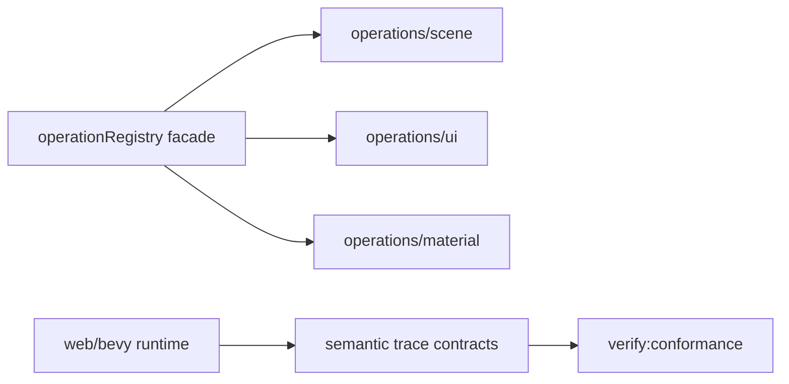
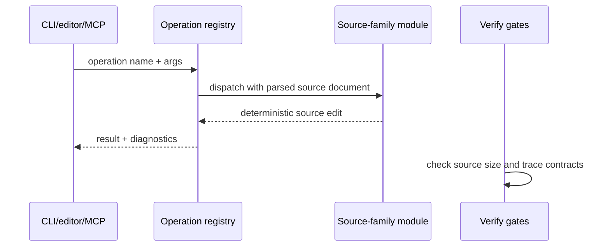

# PRD: Contract De-Sprawl Through Authoring Modules And Runtime Trace Contracts

`Planning Mode: Principal Architect`
`Complexity: 8 -> HIGH mode`

Score basis: +3 touches 10+ files in authoring, runtime-bevy, IR, and tests;
+2 multi-package refactor; +2 shared trace contract semantics; +1 release
gate/source-size impact.

## 1. Context

**Problem:** Roadmap continuous work names contract sprawl as a velocity tax:
authoring operations and native mapping hotspots remain large, central files
that every new capability must touch.

**Files Analyzed:**

- `docs/status/ROADMAP.md`
- `docs/audits/FOUNDATIONAL_BOTTLENECK_AUDIT_2026-07-05.md`
- `packages/authoring/src/operations.ts`
- `packages/authoring/src/operationRegistry.ts`
- `runtime-bevy/crates/threenative_runtime/src/map_world.rs`
- `runtime-bevy/crates/threenative_runtime/src/ui.rs`
- `runtime-bevy/crates/threenative_runtime/src/conformance.rs`
- `runtime-bevy/crates/threenative_loader/src/types.rs`
- `packages/ir/src/conformance.test.ts`
- `scripts/check-source-size.mjs`

**Current Behavior:**

- `packages/authoring/src/operations.ts` is over 5k lines and owns too many
  source-family mutations.
- Native mapping and loader files remain large enough to be hard to review
  and schema-drift-prone.
- Some parity checks compare broad reports instead of small semantic trace
  contracts.

## Pre-Planning Findings

**How will this feature be reached?**

- [x] Entry point identified: existing CLI/editor/MCP authoring operations
  and `pnpm check:source-size`.
- [x] Caller file identified: `packages/authoring/src/operationRegistry.ts`
  and native conformance/report emitters.
- [x] Registration/wiring needed: keep public imports stable while moving
  implementation behind module registries.

**Is this user-facing?**

- [ ] YES.
- [x] NO. This is internal agent-DX and contributor velocity work, triggered
      by existing commands and gates.

**Full user flow:**

1. Developer adds or changes a source operation or runtime mapping.
2. They modify a small source-family module or trace emitter instead of a
   monolith.
3. Existing CLI/editor commands keep working through the stable registry.
4. `check:source-size` and conformance trace tests catch drift.

## 2. Solution

**Approach:**

- Split authoring operation implementation by source family behind the stable
  public `operations.ts` facade.
- Introduce small runtime trace contracts for semantic state slices used by
  parity gates: transforms, physics contacts, UI tree, animation state,
  render/LOD/performance observations.
- Use trace contracts to guide native mapping extractions from `map_world.rs`,
  `ui.rs`, and `conformance.rs` without changing IR behavior.
- Ratchet source-size thresholds only after each extraction has equivalent
  tests.

**Key Decisions:**

- [x] Public package exports and operation names stay backward-compatible.
- [x] Refactors are behavior-preserving and ride behind existing tests.
- [x] Trace contracts compare semantics, not pixel output or private runtime
      implementation details.
- [x] No capability promotion happens in this PRD without a separate
      capability PRD.

**Data Changes:** Add versioned trace contract JSON schemas under
`docs/contracts/` or `packages/ir/src/traces.ts`. No game IR data changes.

## 3. Sequence Flow

## 4. Execution Phases

#### Phase 1: Authoring Operation Module Scaffold - Existing operations dispatch through small family modules.

**Files (max 5):**

- `packages/authoring/src/operations.ts` - preserve facade exports.
- `packages/authoring/src/operations/scene.ts` - move scene/entity/component
  operations.
- `packages/authoring/src/operations/ui.ts` - move UI operations.
- `packages/authoring/src/operations/shared.ts` - shared document helpers.
- `packages/authoring/src/operations.test.ts` - import/export parity tests.

**Implementation:**

- [ ] Move code without changing operation names, argument shapes, or JSON
      formatting.
- [ ] Keep facade exports stable for CLI/editor callers.
- [ ] Add module ownership comments only where dispatch is non-obvious.

**Tests Required:**

| Test File | Test Name | Assertion |
|-----------|-----------|-----------|
| `packages/authoring/src/operations.test.ts` | `should preserve scene operation output after module split` | source JSON diff unchanged |
| `packages/authoring/src/operationRegistry.test.ts` | `should resolve moved operation handlers` | registry names unchanged |

**User Verification:**

- Action: run an existing `tn scene ... --json` command.
- Expected: source edit output matches pre-refactor behavior.

#### Phase 2: Complete Source-Family Split - Authoring operations no longer trip the monolith warning.

**Files (max 5):**

- `packages/authoring/src/operations/material.ts` - material ops.
- `packages/authoring/src/operations/input.ts` - input ops.
- `packages/authoring/src/operations/systems.ts` - systems/resources ops.
- `packages/authoring/src/operations/assets.ts` - asset/prefab ops.
- `scripts/check-source-size.mjs` - ratchet threshold or allowlist update.

**Implementation:**

- [ ] Keep each operation module below the source-size warning threshold.
- [ ] Remove duplicated parsing/helpers introduced by the split.
- [ ] Ratchet `operations.ts` to facade-only expectations.

**Tests Required:**

| Test File | Test Name | Assertion |
|-----------|-----------|-----------|
| authoring package tests | `should preserve operation registry metadata` | all previous operation ids still present |
| root script | `check:source-size` | no warning for `operations.ts` |

**User Verification:**

- Action: `pnpm check:source-size`.
- Expected: authoring operations monolith warning is gone.

#### Phase 3: Semantic Trace Contract Slice - Parity gates compare focused traces.

**Files (max 5):**

- `docs/contracts/runtime-traces.md` - trace contract definitions.
- `packages/ir/src/runtimeTraces.ts` - types/validators if needed.
- `packages/ir/src/runtimeTraces.test.ts` - accepted/rejected traces.
- `packages/runtime-web-three/src/` trace emitter adapter.
- `runtime-bevy/crates/threenative_runtime/src/conformance.rs` - native
  emitter adapter.

**Implementation:**

- [ ] Define `transformSnapshot`, `physicsContacts`, `uiTree`,
      `animationState`, and `renderObservation` trace slices.
- [ ] Require stable entity ids, component names, frame/tick, and numeric
      tolerances in the contract.
- [ ] Keep adapter-private details out of the trace.

**Tests Required:**

| Test File | Test Name | Assertion |
|-----------|-----------|-----------|
| `packages/ir/src/runtimeTraces.test.ts` | `should reject trace with unstable entity id` | stable diagnostic |
| conformance tests | `should compare transform trace with tolerance` | web/bevy traces match fixture |

**User Verification:**

- Action: `pnpm verify:conformance`.
- Expected: report includes focused trace slice comparisons.

#### Phase 4: Native Mapping Extraction Behind Traces - Rust hotspots shrink without parity drift.

**Files (max 5):**

- `runtime-bevy/crates/threenative_runtime/src/map_world.rs` - facade.
- `runtime-bevy/crates/threenative_runtime/src/map_world/rendering.rs` -
  rendering mapping module.
- `runtime-bevy/crates/threenative_runtime/src/map_world/physics.rs` -
  physics mapping module.
- `runtime-bevy/crates/threenative_runtime/src/ui.rs` - facade.
- `runtime-bevy/crates/threenative_runtime/src/ui/widgets.rs` - UI widget
  mapping module.

**Implementation:**

- [ ] Extract modules only after trace tests cover the moved behavior.
- [ ] Keep loader DTO types unchanged unless a separate contract PRD changes
      them.
- [ ] Preserve native artifact/evidence paths.

**Tests Required:**

| Test File | Test Name | Assertion |
|-----------|-----------|-----------|
| Rust runtime tests | existing mapping tests | unchanged pass set |
| root script | `check:source-size` | hotspot warnings reduced |

**User Verification:**

- Action: `cargo test --manifest-path runtime-bevy/Cargo.toml -p threenative_runtime map_world ui conformance`.
- Expected: moved modules preserve existing behavior.

## 5. Verification Strategy

- `pnpm --filter @threenative/authoring test`
- `pnpm verify:conformance`
- `cargo test --manifest-path runtime-bevy/Cargo.toml -p threenative_runtime`
- `pnpm check:source-size`
- `pnpm check:docs`

## 6. Acceptance Criteria

- [ ] `operations.ts` is a stable facade and no longer a source-size warning.
- [ ] Operation registry names, argument schemas, and source edit outputs stay
      backward-compatible.
- [ ] Runtime trace contracts exist and are used by conformance checks.
- [ ] At least two native hotspot files are split behind trace-covered module
      boundaries.
- [ ] `check:source-size` becomes a ratchet for these files instead of a
      passive warning list.
