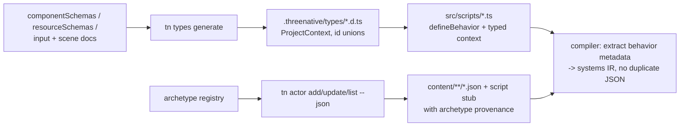

# PRD: Actor Archetypes And Typed Scripting — Blueprint-Class Ergonomics

`Planning Mode: Principal Architect`
`Complexity: 9 → HIGH mode`

Score basis: +3 touches 10+ files, +2 new modules (typegen, archetype
registry, `defineBehavior`), +2 multi-package (sdk, authoring, compiler, cli,
script-stdlib, templates), +2 build-time codegen/static-metadata extraction.

## 1. Context

**Problem:** The largest remaining authoring taxes are structural, not
missing helpers: every gameplay script needs a hand-maintained system access
declaration (`reads/writes/queries/services/...`) duplicated across
`*.scene.json` and `*.systems.json`; scripts type `context` as `any`; all
entity/resource references are untyped string ids; and recipes are one-shot
codegen — there is no live, parameterized "Actor class" an agent can apply,
re-tune, and diff. UE5 solves these with Actor/Pawn classes, typed
components, and Blueprints; this PRD delivers the data-first equivalents.

**Relationship to existing work (do not duplicate):**

- Stdlib rigs (`CharacterRig`, `CameraRig`, `TriggerEx`, ...) from
  `docs/PRDs/authoring-abstractions-and-polished-defaults.md` are the runtime
  behavior layer — this PRD builds the *declaration/typing/archetype* layer
  on top of them.
- Recipes (`packages/authoring/src/recipes.ts`) remain the one-shot stamping
  mechanism; archetypes are re-appliable and record provenance.
- `docs/PRDs/other/editor-ready-modular-authoring-and-scripting-architecture.md`
  owns editor-facing modularity; this PRD's outputs (typed context, behavior
  metadata, archetype provenance) must conform to its source-of-truth rules.

**Files Analyzed:**

- `packages/sdk/src/ecs/system.ts` (`ISystemOptions` access lists),
  `packages/sdk/src/scriptLifecycle.ts`.
- `templates/structured-source-starter/src/scripts/player.ts`
  (`type ScriptContext = any`) and `content/scenes/arena.scene.json` vs
  `content/systems/arena.systems.json` (duplicated system declaration).
- `packages/authoring/src/{recipes,operationRegistry,operations,schemas}.ts`.
- `packages/compiler` script bundler (whitelisted imports: script-stdlib +
  kit packages only; no relative script imports).
- `packages/ir/src/scriptingHost.ts` (37-service matrix),
  `packages/ir/src/systems.ts`, componentSchemas/resourceSchemas documents.
- `packages/cli/src/commands/asset.ts` (`tn asset inspect` GLB clip
  inventory).

**Current Behavior:**

- Wiring one collectible = 7 operations; a system = 2 duplicated JSON
  declarations + an untyped script export.
- Generic typed `ScriptContext` exports, Unity-style input/time aliases,
  `entity.get`/`resources.get` defaults, `resources.patch`, compact API cards,
  and scaffold-first game plan apply have landed. Project-specific typegen,
  single-source system metadata, and actor archetypes remain open.
- Agent-native PRD-002 has already landed L1 archetype scaffolds for
  perspective/control/physics/proof setup. This PRD still targets the larger
  re-appliable parameterized actor system (`tn actor add/update`) and must not
  duplicate the L1 scaffold path.
- Agent-native PRD-013 has already landed derived resource declarations, so
  hand-maintained resource access lists are no longer the primary pain point for
  literal resource helper calls. Phase 2 should focus on remaining access
  metadata, service declarations, and behavior co-location.
- Agent-native PRD-017 closed typed game-spec as experimental, not default.
  Coordinate any project-specific typegen or `defineBehavior` surface with that
  result before adding another broad typed authoring path.
- Access lists drift from what the function body actually touches; the
  runtime validates effects against declarations only at play time.
- Agents thread literal id strings (`"player"`, `"camera.main"`,
  `"GameState"`) with no compile-time safety and no discoverability.
- Rigged GLB actors require manual clip inspection and manual
  idle/walk/run wiring (repo rule requires clips wired and proven).

## 2. Solution

**Approach (three stacked slices, each independently shippable):**

1. **Project typegen** — build on the shipped generic `ScriptContext` helper.
   `tn types generate` (auto-run by `tn build` and `tn dev --watch`) emits
   `.threenative/types/` with a project-specialized context, literal unions
   for entity ids, prefab ids, resource ids, input action/axis names, and
   animation clip names. Scripts keep one type-only import line. Generated dir
   is git-ignored and rebuilt deterministically.
2. **`defineBehavior` single declaration** — a script exports
   `defineBehavior({ id, schedule, reads, writes, services, ... }, fn)`;
   the compiler extracts the metadata at build time and synthesizes the
   system declaration, eliminating the scene/systems duplication. Structured
   source keeps only the attachment (`system: { module, export }`); the
   access lists live once, next to the code they describe. Existing plain
   function exports keep working unchanged.
3. **Actor archetypes** — a typed registry (`packages/authoring/src/
   archetypes.ts`) of parameterized, re-appliable actor definitions:
   `character` (capsule+controller+camera-boom+input+clips),
   `vehicle` (chassis+wheels/suspension joints+chase camera),
   `pickup` (trigger+bob/spin mover+collect event), `camera-boom`
   (spring-arm third/first-person rig config), `prop-static`
   (mesh+auto-collider). `tn actor add character --id hero --asset
   soldier.glb --json` stamps documents WITH provenance
   (`archetype: { id, version, params }`); `tn actor update hero --set
   walkSpeed=4 --json` re-resolves parameters in place, preserving fields the
   user overrode (three-way merge against the recorded params). The
   `character` archetype auto-inventories GLB clips via the asset-inspect
   path and wires idle/walk/run to the constrained animation graph, failing
   with a diagnostic listing available clips when names don't match.
   Archetypes are the shared abstraction that carries the heavy lifting for
   hero, vehicle, pickup, camera, and prop setup; generated scripts should stay
   small and focused on game-specific behavior.

**Architecture:**

**Key Decisions:**

- [ ] Metadata extraction strategy: the compiler already executes the script
      bundle for validation; `defineBehavior` attaches a serializable
      `__tnBehavior` record the bundler reads post-build. No TS AST parsing.
- [ ] `defineBehavior` lives in `@threenative/script-stdlib` (the sanctioned
      import), mirrored in `bundle-source.ts` with parity tests, per the
      established dual-implementation contract.
- [ ] Typegen reads durable source docs only (never `dist/**`), so types are
      correct before the first successful build.
- [ ] Keep the public script API convention-first. Prefer Unity-like names and
      semantics where they match (`getButtonDown`, `fixedDeltaTime`,
      `deltaTime`, `transform.position`, `AudioSource`/`ParticleSystem`-style
      verbs), keep existing aliases for compatibility, and add diagnostics
      rather than making agents choose between project-specific names.
- [ ] Archetypes emit ordered authoring operations through the existing
      `dispatchAuthoringOperation` registry — no new mutation pathway; the
      editor and MCP get archetypes for free.
- [ ] Archetype `update` never touches user-overridden values; conflicts are
      reported as diagnostics (`TN_ARCHETYPE_PARAM_CONFLICT`), not silently
      resolved.

**Data Changes:** prefab/scene documents gain an optional `archetype`
provenance block (schema + validation, additive); systems documents gain an
optional `source: "behavior-metadata"` marker so `tn authoring validate` can
flag drift between extracted metadata and any hand-edited copy. No
migrations.

## 3. Integration Points

- Entry points: `tn types generate --json`, `tn actor
  add|update|list --json`, `import { defineBehavior } from
  "@threenative/script-stdlib"`, auto-typegen inside `tn build`/`tn dev`.
- Callers: `packages/cli/src/index.ts` registry (+ new `actor.ts`,
  `types.ts` command files), `packages/compiler` bundler post-step,
  `packages/authoring/src/operationRegistry.ts` (new `archetype.*`
  operations).
- Wiring: starter template scripts use typed context helpers now and move to
  `defineBehavior` once metadata extraction lands; `tn game plan` and
  `tn game plan --apply --json` recommend/apply archetypes for high-value
  surfaces; template `AGENTS.md`/`CLAUDE.md` and API cards name archetypes as
  the FIRST authoring tool for hero/vehicle/pickup/camera surfaces.

**User flow (agent):** `tn actor add character --id hero --asset
assets/knight.glb` → one command yields a walkable, animated,
camera-boomed hero + a ≤20-line typed behavior stub → agent edits the stub
with full autocomplete on `context`, entity ids, and clip names → `tn build`
extracts metadata; no systems JSON edited by hand.

## 4. Execution Phases

#### Phase 1: Typegen — typed context and id unions

**Files (max 5):**

- `packages/compiler/src/typegen.ts` (new) — schema → `.d.ts` emission.
- `packages/cli/src/commands/types.ts` (new) + `index.ts` registration —
  `tn types generate --json`; hook into `build.ts`/`dev.ts`.
- `packages/sdk/src/systemContextTypes.ts` (or existing home) — export the
  generic `ISystemContext<TComponents, TResources, TEvents>` base the
  generated file specializes.
- Compiler tests — snapshot the generated d.ts for the starter template.
- `templates/structured-source-starter/src/scripts/player.ts` +
  `tsconfig.json` — narrow from generic `ScriptContext` to generated
  project-specific types where available.

**Tests Required:**
| Test File | Test Name | Assertion |
|-----------|-----------|-----------|
| compiler tests | `should emit ProjectContext with declared resource fields typed` | `GameState.score: number` present |
| compiler tests | `should emit entity id union from scene documents` | `"player" \| "goal" ...` |
| cli tests | `should regenerate types deterministically` | two runs byte-identical |

**Verification Plan:** `pnpm --filter @threenative/compiler test`; scratch
project: a typo'd component name in a script is now a `tsc` error surfaced by
`tn validate`.

#### Phase 2: `defineBehavior` — declare system access once, next to code

**Files (max 5):**

- `packages/script-stdlib/src/behavior.ts` (new) + `bundle-source.ts` +
  `index.ts` — `defineBehavior(meta, fn)` returning `fn` with attached
  `__tnBehavior`; validate `meta` shape eagerly with actionable errors.
- `packages/compiler/src/` bundler post-step — read `__tnBehavior` from
  bundle exports; synthesize/merge system declarations into systems IR;
  diagnostic `TN_SYSTEM_DECLARATION_DUPLICATE` when a hand-written systems
  doc entry conflicts with extracted metadata.
- `packages/authoring/src/operations.ts` — `system.attach_script` accepts
  behavior exports without requiring a systems-doc access copy.
- `packages/script-stdlib/src/index.test.ts` — typed/bundle parity.
- `packages/ir/src/systemsValidation.ts` — accept `source:
  "behavior-metadata"` entries.

**Tests Required:**
| Test File | Test Name | Assertion |
|-----------|-----------|-----------|
| stdlib tests | `should keep exported and bundled defineBehavior identical` | parity sample |
| compiler tests | `should synthesize system declaration from behavior metadata` | systems IR matches meta |
| compiler tests | `should error when duplicate hand-written declaration conflicts` | stable diagnostic |

**Verification Plan:** `pnpm verify:conformance` (systems contract is shared
web/Bevy — extracted declarations must execute identically on both hosts;
runtime effect-validation behavior unchanged).

#### Phase 3: Archetype registry + `character` archetype (vertical slice)

**Files (max 5):**

- `packages/authoring/src/archetypes.ts` (new) — registry, param schemas,
  provenance record, three-way `update` merge, ordered-operation emission.
- `packages/authoring/src/operationRegistry.ts` — `archetype.apply`,
  `archetype.update`, `archetype.list` operations.
- `packages/cli/src/commands/actor.ts` (new) + `index.ts` — `tn actor
  add|update|list`, `--json`, stable exit codes.
- `packages/authoring/src/archetypes/character.ts` (new) — capsule with
  computed center, `CharacterController`, kinematic body, camera-boom entity,
  input doc, GLB clip inventory + idle/walk/run graph wiring
  (`TN_ARCHETYPE_CLIP_UNRESOLVED` lists available clips on mismatch),
  generated typed `defineBehavior` stub using `CharacterRig`/`CameraRig`.
- Authoring tests — apply/update/conflict/clip-wiring coverage.

**Tests Required:**
| Test File | Test Name | Assertion |
|-----------|-----------|-----------|
| authoring tests | `should stamp character archetype documents with provenance` | `archetype.version` recorded |
| authoring tests | `should preserve user override when update re-applies` | overridden speed untouched |
| authoring tests | `should list available clips when clip name unresolved` | diagnostic includes inventory |

**User Verification:** fresh starter project + `tn actor add character --id
hero --asset <rigged glb>` → `tn dev` → walk around with animated
locomotion; `tn actor update hero --set sprintSpeed=6` changes only that.

#### Phase 4: `vehicle`, `pickup`, `camera-boom`, `prop-static` archetypes

**Files (max 5):**

- `packages/authoring/src/archetypes/{vehicle,pickup,cameraBoom,propStatic}.ts`
  — vehicle: chassis + suspension joints + chase camera; pickup: trigger
  collider + `KinematicMover` bob/spin + collect event + HUD counter binding;
  camera-boom: spring-arm params (length, lag, shoulder, fov) over
  `CameraRig`; prop-static: mesh + auto-derived collider (reuse the
  `collider --size auto` derivation from the abstractions PRD Phase 5).
- Authoring tests per archetype.
- `packages/cli/src/commands/game.ts` — `tn game plan` maps high-value
  surfaces to archetype suggestions and `--apply` can stamp supported
  archetypes directly.

**User Verification:** a drivable vehicle with chase camera and a collectible
with HUD counter each reachable in one command + generated stub.

#### Phase 5: Template/docs closure + retrofit benchmark

**Files (max 5):**

- `templates/structured-source-starter/` — scripts on `defineBehavior` +
  typed context; systems doc reduced to attachments; `AGENTS.md`/`CLAUDE.md`
  updated ("use archetypes first; never hand-write access lists").
- `templates/*/docs/API-CARD.md` — compact archetype/typegen/behavior examples
  so agents do not rediscover lower-level JSON mutations.
- One example (`examples/humanoid-physics-course` or a smaller one) —
  retrofit as evidence; record before/after: JSON docs touched, LOC,
  hand-maintained access lists (target: 0).
- `docs/STATUS.md`, `docs/bevy-feature-parity.md`, `docs/PRDs/README.md`,
  `docs/workflows/` golden-path page update.

**Verification Plan:** `pnpm build && pnpm verify && pnpm verify:conformance`;
`pnpm check:docs`; full playtest matrix on the retrofit example.

**Orbit camera note:** `CameraRig.orbitThirdPerson` is now the promoted stdlib
surface for player-controlled third-person orbit cameras. The future character
archetype should make camera mode explicit (`follow` versus `orbit`) and stamp
orbit script/input wiring only after recipe/archetype operations can represent
the required helper import, pointer-delta axes, `physics.raycast` access, and
rig state resources without hidden runtime handles.

## 5. Checkpoint Protocol

Spawn `prd-work-reviewer` after every phase. Manual checkpoints additionally
for Phase 3 and 4 (feel/animation proof via `tn record` motion evidence).

## 6. Acceptance Criteria

- [ ] Scripts get full typed `context`, entity/resource/action/clip id
      unions, regenerated automatically by build/dev.
- [ ] A system's access lists are declared exactly once (in code) and the
      compiler synthesizes the IR; duplicates produce diagnostics.
- [ ] `tn actor add character` with a rigged GLB yields a walking, animated,
      camera-boomed hero + typed stub in one command; `tn actor update`
      re-tunes without clobbering user overrides.
- [ ] All archetype mutations flow through the operation registry (editor/
      MCP parity for free).
- [ ] Retrofit benchmark recorded; access-list count in the example drops to
      0 hand-maintained.
- [ ] `docs/STATUS.md` + parity doc updated; plain-function scripts still
      work (backwards compatible).

## 7. Success Metrics

| Metric | Before | Target |
| --- | --- | --- |
| Places a system's access lists are written | 2 (scene + systems doc) | 1 (code) |
| Script `context` typing | `any` | fully typed + id unions |
| Commands to an animated playable hero from a GLB | recipe + manual clip wiring + script | 1 command + generated stub |
| Archetype re-tune | re-stamp or hand-edit JSON | `tn actor update` (override-safe) |

## 8. Open Questions

- Should typegen also emit typed wrappers for `context.entity("hero")`
  (per-entity component typing)? Default: yes if it falls out of the same
  schema walk; otherwise follow-up.
- Vehicle archetype physics depth depends on
  `docs/PRDs/proof-first-engine-loop-2026-07-05/PRD-015-advanced-animation-physics-depth.md` boundaries — start
  with kinematic-or-joint-based arcade vehicles; document the boundary.
