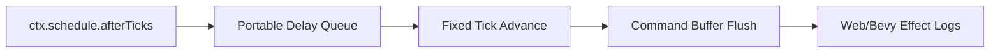
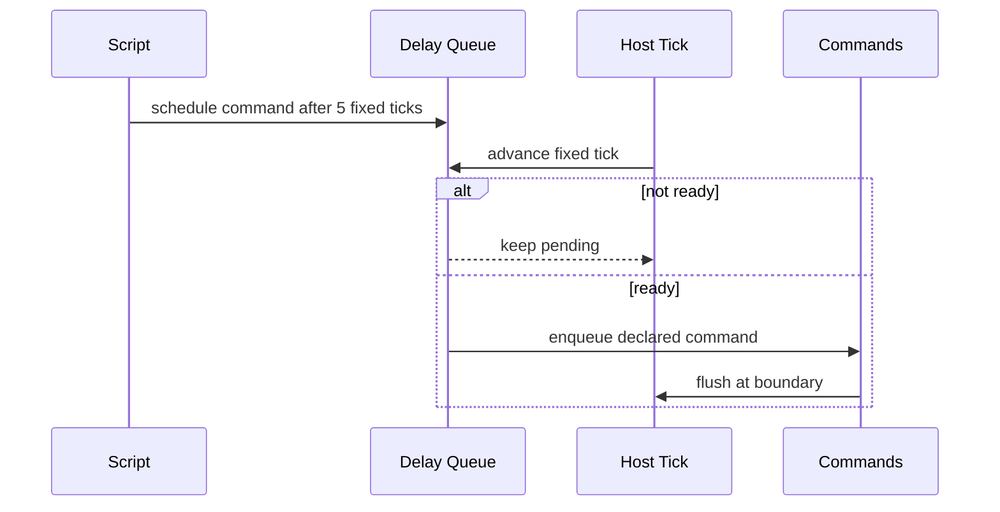

# Portable Scripting Delayed Commands And Bounded Scheduling

Complexity: 10 -> HIGH mode

## Complexity Assessment

- +3 touches 10+ implementation/test/docs files during implementation
- +2 adds bounded scheduling service behavior
- +2 includes deterministic time/event state logic
- +2 spans SDK, IR, compiler, web runtime, Bevy runtime, conformance, and docs
- +1 affects verification gates and parity status

## Context

**Problem:** Timer helpers and fixed-trace channels exist, but scripts cannot
schedule delayed command-buffer work beyond the current bounded helper surface.

**Files Analyzed:**

- `docs/contracts/scripting-api.md`
- `packages/sdk/src/ecs/system.ts`
- `packages/sdk/src/time.ts`
- `packages/ir/src/systems.ts`
- `packages/ir/src/validate.ts`
- `packages/runtime-web-three/src/systems/context.ts`
- `runtime-bevy/crates/threenative_runtime/src/systems_host.rs`
- `runtime-bevy/crates/threenative_runtime/src/runtime_gameplay_host.rs`

**Current Behavior:**

- `ctx.timers.elapsed/remaining/progress/done/ready` are pure helpers over
  elapsed time.
- Fixed-trace task/channel metadata exists.
- Arbitrary async/await, workers, promises, and platform timers are
  unsupported.
- Delayed command scheduling remains missing.

## Checklist Coverage

- Delayed command scheduling beyond bounded timer/channel services.
- Stable boundary between portable fixed-tick scheduling and arbitrary async.
- Diagnostics for platform timers, workers, promises, and dynamic schedulers.

## Impact

**Planned files touched by implementation:** SDK system/time APIs, IR systems
schema/validator, compiler emit, web runtime scheduler, Bevy runtime scheduler,
conformance fixtures, verify tooling, docs, and parity tracker.

**Features affected:** command buffers, event handoff, timers, fixed update
schedules, runtime host state, and unsupported async diagnostics.

**Main risks:**

- Delayed scheduling can become nondeterministic if it uses wall-clock time.
- Queued commands can outlive scenes/entities unless ownership is explicit.
- It is easy to accidentally enable promise/worker behavior that native QuickJS
  cannot mirror.

## Integration Points

**How will this feature be reached?**

- [x] Entry point identified: bounded scheduling declarations, `ctx.schedule`
  or command-delay API, emitted `systems.ir.json`, web runner, Bevy host, and
  focused gate.
- [x] Caller file identified: SDK system context typings, compiler system emit,
  runtime system context, runtime command flush, and diagnostics scanner.
- [x] Registration/wiring needed: schedule IR, command queue ownership,
  conformance fixture, focused gate, docs/status updates.

**Is this user-facing?**

- [x] YES. Authors can schedule portable delayed commands without platform
  timers or promises.
- [ ] NO -> Internal/background feature.

**Full user flow:**

1. User declares a bounded fixed-tick delayed command capability.
2. System schedules a spawn/event/component mutation for N fixed ticks later.
3. Runtime stores the pending command in portable host state.
4. Web and Bevy flush the command in the same tick and emit matching logs.

## Solution

**Approach:**

- Add a fixed-tick scheduler, not wall-clock timers.
- Require every delayed command to declare max delay, scene/entity ownership,
  and cancellation policy.
- Serialize pending schedule state as plain data for reload/conformance.
- Keep arbitrary promises, workers, browser timers, and platform schedulers
  diagnostic-only.



**Key Decisions:**

- [x] Library/framework choices: reuse command-buffer effect shapes and fixed
  runtime tick state.
- [x] Error-handling strategy: reject wall-clock delays, unbounded queues,
  external promises, and unmanaged scene/entity ownership.
- [x] Reused utilities: timers helpers, systems lifecycle metadata, command
  validation, unsupported API diagnostics.

**Data Changes:** Add bounded schedule metadata and pending queue observations;
no database changes.

## Sequence Flow



## Execution Phases

#### Phase 1: Scheduling Contract - Delays are fixed-tick and bounded.

**Files (max 5):**

- `packages/sdk/src/ecs/system.ts` - context/API types
- `packages/ir/src/systems.ts` - schedule metadata
- `packages/ir/src/validate.ts` - validation and diagnostics
- `packages/ir/src/systems.test.ts` - accepted/rejected tests
- `packages/compiler/src/scripts/diagnostics.ts` - unsupported API guidance

**Implementation:**

- [ ] Define `afterTicks`/bounded schedule API shape.
- [ ] Require max delay, declared command type, and ownership/cancel policy.
- [ ] Reject wall-clock, promises, workers, and unbounded queues.

**Tests Required:**

| Test File | Test Name | Assertion |
|-----------|-----------|-----------|
| `packages/ir/src/systems.test.ts` | `should accept bounded delayed command metadata` | Valid metadata passes. |
| `packages/compiler/src/scripts/diagnostics.test.ts` | `should suggest bounded scheduling for platform timers` | Diagnostic suggestion names portable API. |

**User Verification:**

- Action: Run IR systems and script diagnostics tests.
- Expected: Bounded scheduling accepted and platform timers rejected.

#### Phase 2: Web Runtime Scheduler - Delayed commands flush deterministically in web.

**Files (max 5):**

- `packages/runtime-web-three/src/systems/context.ts` - schedule context
- `packages/runtime-web-three/src/systems/runner.ts` - fixed-tick queue advance
- `packages/runtime-web-three/src/systems/effects.ts` - delayed command flush
- `packages/runtime-web-three/src/systems/context.test.ts` - context tests
- `packages/runtime-web-three/src/systems/runner.test.ts` - scheduler tests

**Implementation:**

- [ ] Store pending delayed commands in runtime host state.
- [ ] Advance queue only on fixed ticks.
- [ ] Flush ready commands through existing validation and effect logs.

**Tests Required:**

| Test File | Test Name | Assertion |
|-----------|-----------|-----------|
| `packages/runtime-web-three/src/systems/runner.test.ts` | `should flush delayed command after fixed ticks` | Command appears on expected tick only. |
| `packages/runtime-web-three/src/systems/context.test.ts` | `should reject undeclared delayed command` | Runtime diagnostic/effect rejection is stable. |

**User Verification:**

- Action: Run web systems tests.
- Expected: Delayed command timing is deterministic.

#### Phase 3: Bevy Runtime Scheduler - Native scheduling matches web.

**Files (max 5):**

- `runtime-bevy/crates/threenative_runtime/src/systems_host.rs` - QuickJS API
- `runtime-bevy/crates/threenative_runtime/src/systems_effects.rs` - command flush
- `runtime-bevy/crates/threenative_runtime/src/runtime_gameplay_host.rs` - queue report
- `runtime-bevy/crates/threenative_runtime/tests/systems_host.rs` - host tests
- `runtime-bevy/crates/threenative_runtime/tests/runtime_gameplay_host.rs` - report tests

**Implementation:**

- [ ] Mirror the fixed-tick queue and flush semantics in native host state.
- [ ] Emit matching queue observations and diagnostics.
- [ ] Validate cancellation when owning scene/entity is removed.

**Tests Required:**

| Test File | Test Name | Assertion |
|-----------|-----------|-----------|
| `runtime-bevy/crates/threenative_runtime/tests/systems_host.rs` | `systems_host_should_flush_delayed_commands_after_fixed_ticks` | Native command appears on expected tick. |
| `runtime-bevy/crates/threenative_runtime/tests/runtime_gameplay_host.rs` | `should report bounded scheduler observations` | Report contains queue state and diagnostics. |

**User Verification:**

- Action: Run native runtime gameplay host tests.
- Expected: Native schedule behavior matches web fixture.

#### Phase 4: Conformance And Docs - Delayed scheduling is promoted.

**Files (max 5):**

- `packages/ir/fixtures/conformance/delayed-commands/game.bundle/world.ir.json` - fixture
- `packages/ir/fixtures/conformance/delayed-commands/game.bundle/systems.ir.json` - fixture
- `packages/ir/fixtures/conformance/fixture-catalog.json` - catalog entry
- `docs/contracts/scripting-api.md` - status update
- `docs/STATUS.md` - gate evidence

**Implementation:**

- [ ] Add a fixture that schedules event and spawn commands across fixed ticks.
- [ ] Compare web/native command logs by tick.
- [ ] Update docs and status evidence.

**Tests Required:**

| Test File | Test Name | Assertion |
|-----------|-----------|-----------|
| `packages/ir/src/conformance.test.ts` | `should validate delayed command fixture` | Fixture validates and is cataloged. |

**User Verification:**

- Action: Run `pnpm verify:conformance` and `pnpm check:docs`.
- Expected: Delayed scheduling evidence is accepted.

## Checkpoint Protocol

After each phase, spawn the `prd-work-reviewer` agent with:

```txt
Review checkpoint for phase [N] of PRD at docs/PRDs/proof-first-engine-loop-2026-07-05/PRD-010-portable-scripting-delayed-commands-scheduling.md
```

Continue only after PASS. Manual verification is required after Phase 4 to
inspect tick-indexed web/native logs.

## Verification Strategy

- Unit: IR metadata and unsupported API diagnostics.
- Integration: web/native fixed-tick scheduler tests.
- Conformance: delayed-commands fixture.
- Release: docs gate and focused/conformance gate.
