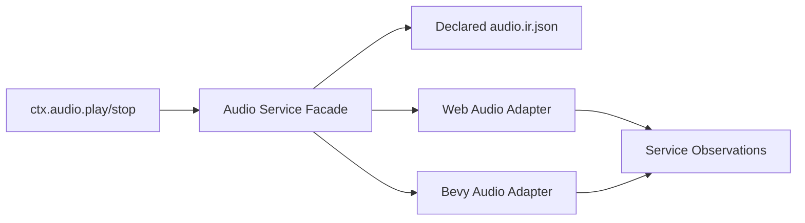
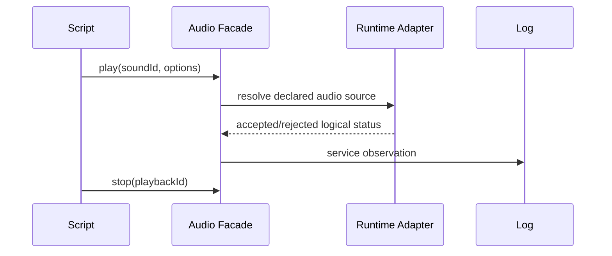

# Portable Scripting Audio Facade

Complexity: 10 -> HIGH mode

## Complexity Assessment

- +3 touches 10+ implementation/test/docs files during implementation
- +2 adds script audio service facade
- +2 includes runtime audio state and lifecycle logic
- +2 spans SDK, IR, compiler, web runtime, Bevy runtime, conformance, and docs
- +1 affects release/diagnostic evidence

## Context

**Problem:** Structured audio IR is promoted, but scripts still lack a portable
`ctx.audio.play/stop` facade.

**Files Analyzed:**

- `docs/contracts/scripting-api.md`
- `packages/sdk/src/audio.ts`
- `packages/ir/src/audio.test.ts`
- `packages/compiler/src/emit/audio.ts`
- `packages/runtime-web-three/src/audio.ts`
- `runtime-bevy/crates/threenative_runtime/src/audio.rs`
- `runtime-bevy/crates/threenative_runtime/src/audio_lifecycle_trace.rs`

**Current Behavior:**

- Bundle-local music, one-shots, listener/emitter metadata, routing, and
  reports exist as structured audio IR.
- UI-triggered audio actions and production diagnostics are represented through
  evidence paths.
- Scripts cannot call `ctx.audio.play` or `ctx.audio.stop`.
- Custom decoders, streaming/network audio, and platform handles remain
  unsupported.

## Checklist Coverage

- `ctx.audio.play` and `ctx.audio.stop`.
- Bounded audio state query if needed for gameplay.
- Stable diagnostics for streaming, network, custom decoder, and platform
  handle boundaries.

## Impact

**Planned files touched by implementation:** SDK audio/system context APIs, IR
system service names, audio validation, compiler emit, web audio facade, Bevy
audio facade, conformance fixtures, docs, and verification tooling.

**Features affected:** audio playback lifecycle, event-driven sounds,
UI-triggered sounds, bus routing, mixer reports, and runtime service logs.

**Main risks:**

- Audio hardware availability differs across hosts, so script results must not
  depend on real device playback.
- Handles must stay runtime-private while still allowing gameplay stop/control.
- Looping and one-shot lifetimes need deterministic observations.

## Integration Points

**How will this feature be reached?**

- [x] Entry point identified: audio asset/declaration helpers, system service
  declarations, `ctx.audio.play/stop/query`, emitted audio/system IR, web/Bevy
  audio runtimes, and focused gate.
- [x] Caller file identified: SDK audio module, SDK system context, compiler
  audio emit, web audio runtime, Bevy audio runtime.
- [x] Registration/wiring needed: service names, validator rules, runtime
  private handle mapping, conformance fixture, docs/status updates.

**Is this user-facing?**

- [x] YES. Authors can trigger and stop declared sounds from portable scripts.
- [ ] NO -> Internal/background feature.

**Full user flow:**

1. User declares bundle-local audio assets and buses.
2. System calls `ctx.audio.play("sound.hit", { entity })`.
3. Runtime returns a stable playback ID or status without exposing handles.
4. System can stop/query by stable playback ID.
5. Web and Bevy logs match even when real device playback is unavailable.

## Solution

**Approach:**

- Add a script facade over declared audio IR only.
- Return stable logical playback IDs/status, not native/web audio handles.
- Treat actual device availability as diagnostic/report state.
- Keep custom decoders, streaming/network audio, and platform mixer handles
  diagnostic-only.



**Key Decisions:**

- [x] Library/framework choices: reuse existing audio IR and runtime audio
  lifecycle trace modules.
- [x] Error-handling strategy: return deterministic accepted/rejected status
  and emit diagnostics for unavailable devices or unsupported audio sources.
- [x] Reused utilities: asset manifest lookup, audio validation, service logs,
  production audio diagnostics.

**Data Changes:** Add audio service names/result payloads; no database changes.

## Sequence Flow



## Execution Phases

#### Phase 1: Audio Service Contract - Scripts can declare audio service use.

**Files (max 5):**

- `packages/sdk/src/audio.ts` - facade typings/helpers
- `packages/sdk/src/ecs/system.ts` - `ctx.audio` context typing
- `packages/ir/src/systems.ts` - audio service names
- `packages/ir/src/validate.ts` - validation and diagnostics
- `packages/ir/src/audio.test.ts` - accepted/rejected tests

**Implementation:**

- [ ] Add `audio.play`, `audio.stop`, and optional `audio.query` service names.
- [ ] Require referenced audio IDs to exist in declared audio/assets IR.
- [ ] Reject raw handles, external URLs, custom decoders, and device selectors.

**Tests Required:**

| Test File | Test Name | Assertion |
|-----------|-----------|-----------|
| `packages/ir/src/audio.test.ts` | `should accept declared script audio services` | Valid service declarations pass. |
| `packages/ir/src/audio.test.ts` | `should reject script audio external source` | Diagnostic code/path are stable. |

**User Verification:**

- Action: Run IR audio tests.
- Expected: Audio service contract is validated.

#### Phase 2: Web Audio Facade - Web returns deterministic playback observations.

**Files (max 5):**

- `packages/runtime-web-three/src/audio.ts` - logical playback state
- `packages/runtime-web-three/src/systems/context.ts` - `ctx.audio` facade
- `packages/runtime-web-three/src/audio.test.ts` - audio runtime tests
- `packages/runtime-web-three/src/systems/context.test.ts` - service log tests
- `packages/runtime-web-three/src/productionHardening.ts` - device diagnostics

**Implementation:**

- [ ] Map declared audio IDs to private web audio handles.
- [ ] Return stable logical playback IDs/statuses.
- [ ] Log accepted/rejected play/stop/query service calls.

**Tests Required:**

| Test File | Test Name | Assertion |
|-----------|-----------|-----------|
| `packages/runtime-web-three/src/audio.test.ts` | `should play and stop declared logical audio` | Status and playback ID are stable. |
| `packages/runtime-web-three/src/systems/context.test.ts` | `should log script audio service calls` | Service log contains play and stop payloads. |

**User Verification:**

- Action: Run web audio/runtime systems tests.
- Expected: Web audio facade logs deterministic results.

#### Phase 3: Bevy Audio Facade - Native returns matching playback observations.

**Files (max 5):**

- `runtime-bevy/crates/threenative_runtime/src/audio.rs` - logical playback state
- `runtime-bevy/crates/threenative_runtime/src/systems_host.rs` - QuickJS facade
- `runtime-bevy/crates/threenative_runtime/src/audio_lifecycle_trace.rs` - reports
- `runtime-bevy/crates/threenative_runtime/tests/audio.rs` - native tests
- `runtime-bevy/crates/threenative_runtime/tests/systems_host.rs` - host tests

**Implementation:**

- [ ] Map declared audio IDs to private Bevy audio handles or unavailable
  diagnostics.
- [ ] Return the same logical status payloads as web.
- [ ] Keep device failures as report diagnostics, not script handle exposure.

**Tests Required:**

| Test File | Test Name | Assertion |
|-----------|-----------|-----------|
| `runtime-bevy/crates/threenative_runtime/tests/audio.rs` | `should play and stop declared logical audio` | Native logical status is stable. |
| `runtime-bevy/crates/threenative_runtime/tests/systems_host.rs` | `systems_host_should_expose_audio_facade` | QuickJS script writes expected audio report. |

**User Verification:**

- Action: Run native audio and systems host tests.
- Expected: Native audio facade matches web payload shape.

#### Phase 4: Conformance And Docs - Script audio facade is promoted.

**Files (max 5):**

- `packages/ir/fixtures/conformance/script-audio-facade/game.bundle/audio.ir.json` - fixture
- `packages/ir/fixtures/conformance/script-audio-facade/game.bundle/systems.ir.json` - fixture
- `packages/ir/fixtures/conformance/fixture-catalog.json` - catalog entry
- `docs/contracts/scripting-api.md` - status update
- `docs/STATUS.md` - evidence entry

**Implementation:**

- [ ] Add fixture that plays and stops a declared one-shot/loop.
- [ ] Compare web/native logical audio observations.
- [ ] Update docs and evidence paths.

**Tests Required:**

| Test File | Test Name | Assertion |
|-----------|-----------|-----------|
| `packages/ir/src/conformance.test.ts` | `should validate script audio facade fixture` | Fixture validates and is cataloged. |

**User Verification:**

- Action: Run `pnpm verify:conformance` and `pnpm check:docs`.
- Expected: Script audio facade evidence is accepted.

## Checkpoint Protocol

After each phase, spawn the `prd-work-reviewer` agent with:

```txt
Review checkpoint for phase [N] of PRD at docs/PRDs/proof-first-engine-loop-2026-07-05/PRD-011-portable-scripting-audio-facade.md
```

Continue only after PASS. Manual verification is required after Phase 4 to
inspect unavailable-device diagnostics and logical playback observations.

## Verification Strategy

- Unit: IR validation and audio service payload tests.
- Integration: web/native audio facade tests.
- Conformance: script-audio-facade fixture.
- Release: docs gate and conformance/release wiring.
