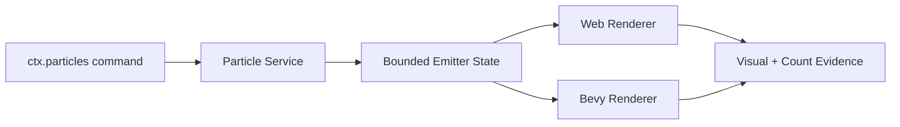
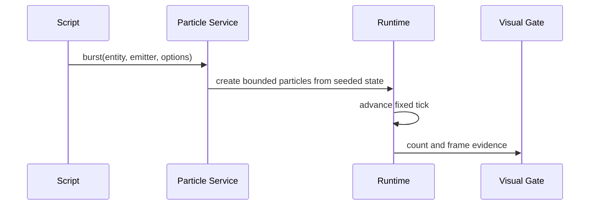

# Portable Scripting Particle Commands

Complexity: 10 -> HIGH mode

## Complexity Assessment

- +3 touches 10+ implementation/test/docs files during implementation
- +2 adds script command surface for particles
- +2 includes bounded runtime state and visual/runtime parity
- +2 spans SDK, IR, compiler, web runtime, Bevy runtime, conformance, and docs
- +1 affects visual verification evidence

## Context

**Problem:** Bounded particle emitter data and observations exist, but scripts
cannot command particle playback beyond declared emitter behavior.

**Files Analyzed:**

- `docs/contracts/scripting-api.md`
- `docs/PRDs/proof-first-engine-loop-2026-07-05/PRD-016-advanced-animation-physics-depth.md`
- `packages/sdk/src/animation.ts`
- `packages/ir/src/animation-residuals.test.ts`
- `packages/runtime-web-three/src/animation.ts`
- `runtime-bevy/crates/threenative_runtime/src/animation.rs`
- `runtime-bevy/crates/threenative_runtime/src/animation_physics_residuals.rs`

**Current Behavior:**

- Bounded particle emitters are represented as portable data.
- Runtime observations can report bounded particle counts.
- Arbitrary particle commands are still missing.
- Unbounded or backend-specific particle behavior remains unsupported.

## Checklist Coverage

- Script particle commands beyond bounded declared emitter data.
- Deterministic start/stop/burst/reset behavior across web and Bevy.
- Visual/runtime evidence for bounded portable particles.

## Impact

**Planned files touched by implementation:** SDK particle command APIs, IR
animation/particle schemas and validators, compiler emit, web particle runtime,
Bevy particle runtime, conformance fixtures, visual evidence, docs, and
verification tooling.

**Features affected:** animation/particle services, system service declarations,
runtime visual effects, effect logs, and asset/material references.

**Main risks:**

- Particles can become nondeterministic if emission depends on frame time or
  random host state.
- Visual parity can drift between Three.js and Bevy if particle material and
  blending rules are too broad.
- Command API must not expose backend emitter handles.

## Integration Points

**How will this feature be reached?**

- [x] Entry point identified: particle emitter declarations, script service
  calls such as `ctx.particles.play/stop/emit/clear`, emitted systems IR,
  runtime service facades, and visual/conformance gates.
- [x] Caller file identified: SDK animation/particles module, compiler emit,
  web animation/particle runtime, Bevy animation/particle runtime.
- [x] Registration/wiring needed: service names, validator support, runtime
  state, visual fixture, focused gate, docs/status updates.

**Is this user-facing?**

- [x] YES. Authors can trigger portable particle effects from gameplay scripts.
- [ ] NO -> Internal/background feature.

**Full user flow:**

1. User declares a bounded particle emitter on an entity or asset.
2. System calls `ctx.particles.burst(entity, emitter, options)`.
3. Web and Bevy advance a deterministic particle state.
4. User sees matching visual/effect observations.

## Solution

**Approach:**

- Add a small service facade for bounded emitter commands only.
- Require authored emitter IDs, deterministic seed source, maximum live count,
  fixed lifetime, and supported material/blend mode.
- Log command requests/results as plain data and compare particle counts by
  fixed tick.
- Keep GPU particles, simulation shaders, collisions, trails, and unbounded
  spawn rates diagnostic-only.



**Key Decisions:**

- [x] Library/framework choices: reuse animation residual particle data and
  runtime observation reports.
- [x] Error-handling strategy: reject backend handles, unbounded counts,
  unsupported blend/material modes, and host RNG.
- [x] Reused utilities: seeded random helpers, animation fixtures, visual
  parity gates, service effect logs.
- [x] Naming strategy: expose familiar particle verbs where semantics match.
  Prefer `play`, `stop`, `emit`, and `clear` as canonical script names,
  mirroring common `ParticleSystem` vocabulary; keep `start`, `burst`, and
  `reset` only as aliases or lower-level diagnostics if existing contracts need
  them.

**Data Changes:** Add particle service names and command observations; no
database changes.

## Sequence Flow



## Execution Phases

#### Phase 1: Service Contract - Particle commands are declared and bounded.

**Files (max 5):**

- `packages/sdk/src/animation.ts` - particle command API/types
- `packages/ir/src/systems.ts` - service names
- `packages/ir/src/validate.ts` - validation and diagnostics
- `packages/ir/src/animation-residuals.test.ts` - accepted/rejected cases
- `docs/contracts/scripting-api.md` - contract update

**Implementation:**

- [x] Define canonical `particles.play/stop/emit/clear` service names and
      payloads, with `start`/`burst`/`reset` compatibility aliases only if
      needed by existing authored content.
- [x] Require bounded emitter declarations and max live counts.
- [x] Reject backend particle handles and unbounded emitters.

**Tests Required:**

| Test File | Test Name | Assertion |
|-----------|-----------|-----------|
| `packages/ir/src/animation-residuals.test.ts` | `should accept bounded particle command services` | Valid systems/particle IR passes. |
| `packages/ir/src/animation-residuals.test.ts` | `should reject unbounded particle commands` | Diagnostic code/path are stable. |

**User Verification:**

- Action: Run IR animation residual tests.
- Expected: Particle command validation passes.

#### Phase 2: Runtime Services - Web and Bevy execute particle commands.

**Files (max 5):**

- `packages/runtime-web-three/src/animation.ts` - web particle state
- `packages/runtime-web-three/src/systems/context.ts` - service facade
- `packages/runtime-web-three/src/animation.test.ts` - web tests
- `runtime-bevy/crates/threenative_runtime/src/animation.rs` - native particle state
- `runtime-bevy/crates/threenative_runtime/tests/animation.rs` - native tests

**Implementation:**

- [x] Implement start/stop/burst/reset with fixed tick advancement.
- [x] Serialize count, seed, emitter, and command results.
- [x] Keep command outcomes identical across runtimes.

**Tests Required:**

| Test File | Test Name | Assertion |
|-----------|-----------|-----------|
| `packages/runtime-web-three/src/animation.test.ts` | `should execute bounded particle burst command` | Count/result matches expected tick. |
| `runtime-bevy/crates/threenative_runtime/tests/animation.rs` | `should execute bounded particle burst command` | Native count/result matches web fixture. |

**User Verification:**

- Action: Run web and native animation tests.
- Expected: Particle commands produce matching observations.

#### Phase 3: Visual Fixture - Particle commands have rendered evidence.

**Files (max 5):**

- `packages/ir/fixtures/conformance/particle-commands/game.bundle/world.ir.json` - fixture
- `packages/ir/fixtures/conformance/particle-commands/game.bundle/systems.ir.json` - fixture
- `packages/ir/fixtures/conformance/particle-commands/game.bundle/materials.ir.json` - fixture
- `tools/verify/src/cli/run.ts` - focused gate registration
- `docs/STATUS.md` - evidence entry

**Implementation:**

- [x] Add a simple scene with command-triggered bounded particle bursts.
- [x] Capture web/native count observations and rendered frames.
- [x] Register focused gate and artifacts.

**Tests Required:**

| Test File | Test Name | Assertion |
|-----------|-----------|-----------|
| `packages/ir/src/conformance.test.ts` | `should validate particle command fixture` | Fixture validates and is cataloged. |
| `tools/verify/src/cli/run.test.ts` | `should run particle command gate` | Gate writes report. |

**User Verification:**

- Action: Run focused particle command gate.
- Expected: Report includes matching counts and nonblank visual evidence.

#### Phase 4: Docs And Release - Particle command status is current.

**Files (max 5):**

- `docs/contracts/scripting-api.md` - mark command surface implemented
- `docs/bevy-feature-parity.md` - checklist update
- `docs/STATUS.md` - release evidence
- `docs/PRDs/README.md` - initiative status if completed
- `package.json` - script alias if needed

**Implementation:**

- [ ] Update scripting API checklist and missing inventory.
- [ ] Add evidence paths and remaining unsupported particle boundaries.
- [ ] Wire focused gate into release if appropriate.

**Tests Required:**

| Test File | Test Name | Assertion |
|-----------|-----------|-----------|
| `tools/verify/src/cli/check-docs.test.ts` | `should accept particle command docs` | Docs drift check passes if applicable. |

**User Verification:**

- Action: Run `pnpm check:docs` and `pnpm verify:release`.
- Expected: Docs and release evidence pass.

## Checkpoint Protocol

After each phase, spawn the `prd-work-reviewer` agent with:

```txt
Review checkpoint for phase [N] of PRD at docs/PRDs/proof-first-engine-loop-2026-07-05/PRD-012-portable-scripting-particle-commands.md
```

Continue only after PASS. Manual verification is required after Phase 3 because
visual evidence must be inspected for nonblank matching particles.

## Verification Strategy

- Unit: IR validation and runtime particle state tests.
- Integration: web/Bevy service command tests.
- Visual: focused particle command gate.
- Release: docs gate and release/conformance wiring.
