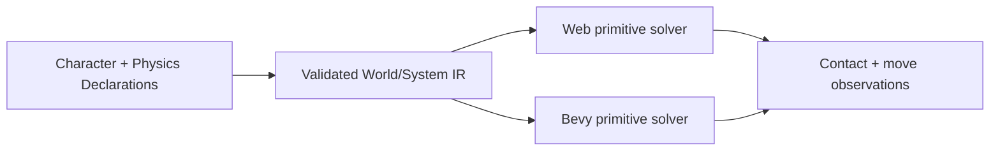
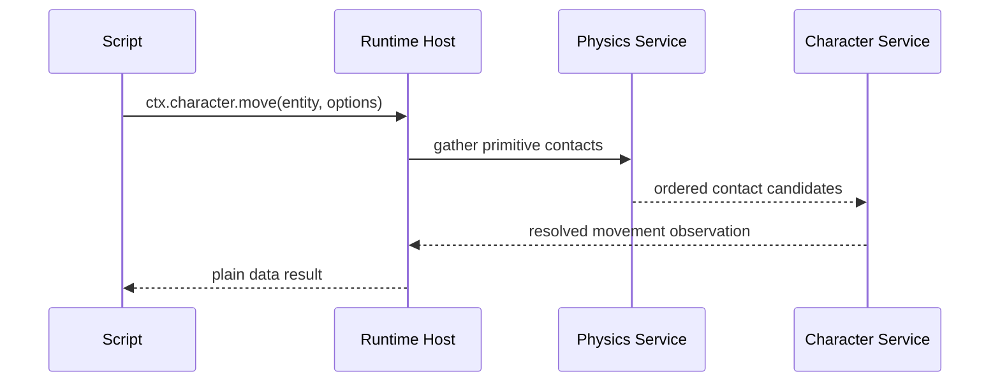

# Portable Scripting Character And Physics Contacts

Complexity: 12 -> HIGH mode

## Complexity Assessment

- +3 touches 10+ implementation/test/docs files during implementation
- +2 expands physics/character runtime systems
- +2 includes complex solver/contact state logic
- +2 spans SDK, IR, compiler, web runtime, Bevy runtime, conformance, and docs
- +2 adds service behavior beyond the current fixed-trace slice
- +1 affects release-gate documentation and parity status

## Context

**Problem:** Character movement and contact filtering remain narrower than the
rest of the promoted scripting host surface.

**Files Analyzed:**

- `docs/contracts/scripting-api.md`
- `docs/PRDs/proof-first-engine-loop-2026-07-05/PRD-016-advanced-animation-physics-depth.md`
- `docs/PRDs/done/other/post-v10-animation-physics-navigation-residuals.md`
- `packages/sdk/src/physics.ts`
- `packages/sdk/src/character.ts`
- `packages/ir/src/physics.test.ts`
- `packages/runtime-web-three/src/systems/services/physics.ts`
- `runtime-bevy/crates/threenative_runtime/src/physics.rs`
- `runtime-bevy/crates/threenative_runtime/src/character.rs`

**Current Behavior:**

- `ctx.physics.raycast/overlap/shapeCast/sensor` are promoted for primitive
  data.
- `ctx.character.move` returns deterministic fixed-trace observations.
- Primitive collision/trigger/sensor phases are promoted.
- Full contact filtering, sloped mesh terrain, solver-backed pushing, and
  richer character interaction remain narrow.

## Checklist Coverage

- Character movement beyond the narrow fixed-trace service.
- Full primitive contact filtering for script-observable collision/trigger
  events.
- Stable diagnostics for unsupported arbitrary mesh/constraint/vehicle/soft-body
  behavior.

## Impact

**Planned files touched by implementation:** SDK physics/character APIs, IR
physics schemas and validators, compiler emit, web physics/character services,
Bevy physics/character services, conformance fixtures, runtime tests, docs, and
verification tooling.

**Features affected:** character controllers, collision/trigger event streams,
contact material/layer filtering, moving platforms, slopes, and script physics
services.

**Main risks:**

- Matching a solver across web and Bevy can drift if the portable subset is too
  broad.
- Mesh slopes and dynamic pushing can introduce nondeterministic floating-point
  behavior.
- Contact event ordering must remain stable across runtimes.

## Integration Points

**How will this feature be reached?**

- [x] Entry point identified: SDK `CharacterController`/physics declarations,
  `ctx.character.move`, physics services, emitted world/system IR, and
  `pnpm verify:conformance`.
- [x] Caller file identified: compiler emit paths, web physics service facade,
  Bevy runtime character/physics modules, and system effect log serializers.
- [x] Registration/wiring needed: new IR fields, diagnostics, shared fixtures,
  focused gate, docs/status updates.

**Is this user-facing?**

- [x] YES. Authors see improved character movement/contact events in portable
  scripts and runtime reports.
- [ ] NO -> Internal/background feature.

**Full user flow:**

1. User authors a character controller with slopes, contact filters, and
   pushable primitive bodies.
2. System calls `ctx.character.move` and reads collision/trigger/sensor events.
3. Web and Bevy resolve movement and contact events into matching observations.
4. User runs the focused physics/character gate and gets deterministic evidence.

## Solution

**Approach:**

- Promote a bounded primitive-only contact model before arbitrary mesh/vehicle
  physics.
- Define exact contact ordering by phase, sensor/body ID, other entity ID, and
  contact point index.
- Extend `ctx.character.move` observations with slope, step, push, and contact
  filter results that are plain data.
- Keep dynamic mesh narrow phase, joints, vehicles, ragdolls, and soft bodies
  diagnostic-only unless separately promoted.



**Key Decisions:**

- [x] Library/framework choices: reuse existing primitive service code and Bevy
  runtime modules; do not expose Rapier/Bevy handles.
- [x] Error-handling strategy: reject unsupported solver breadth with stable
  diagnostics and suggested primitive alternatives.
- [x] Reused utilities: current physics IR validation, character trace reports,
  system service logs, and conformance fixtures.
- [x] Naming strategy: keep the script-facing shape convention-first. Prefer
  Unity-like concepts where semantics match (`CharacterController`, `move`,
  `isGrounded`, `slopeLimit`, `stepOffset`, `collisionFlags`) while preserving
  existing ThreeNative aliases and diagnostics for unsupported solver breadth.

**Data Changes:** Extend physics/character IR and observations; no database
changes.

## Sequence Flow



## Execution Phases

#### Phase 1: Contact Filter Contract - Portable contact event filtering is explicit.

**Files (max 5):**

- `packages/sdk/src/physics.ts` - filter authoring helpers
- `packages/ir/src/types.ts` - contact/filter types
- `packages/ir/src/validate.ts` - validation and diagnostics
- `packages/ir/src/physics.test.ts` - accepted/rejected cases
- `docs/contracts/scripting-api.md` - service contract wording

**Implementation:**

- [x] Define portable layer/mask/material/contact phase fields.
- [x] Reject backend bitsets, handles, callbacks, and unconstrained filters.
- [x] Specify event sort order and payload shape.

**Tests Required:**

| Test File | Test Name | Assertion |
|-----------|-----------|-----------|
| `packages/ir/src/physics.test.ts` | `should accept primitive contact filters` | Valid IR has no diagnostics. |
| `packages/ir/src/physics.test.ts` | `should reject backend contact callbacks` | Diagnostic code/path are stable. |

**User Verification:**

- Action: Run `pnpm --filter @threenative/ir test -- --run physics`.
- Expected: Contact filter validation passes.

#### Phase 2: Character Movement Observations - Move results include slope/contact/push data.

**Files (max 5):**

- `packages/sdk/src/character.ts` - options/result typings
- `packages/runtime-web-three/src/character.ts` - web movement observations
- `packages/runtime-web-three/src/systems/context.ts` - service result plumbing
- `packages/runtime-web-three/src/character.test.ts` - web coverage
- `packages/runtime-web-three/src/systems/context.test.ts` - service coverage

**Implementation:**

- [x] Add slope/step/contact/push fields to the portable result.
- [x] Keep result deterministic by rounding and stable sorting.
- [x] Preserve existing fixed-trace fields for compatibility.

**Tests Required:**

| Test File | Test Name | Assertion |
|-----------|-----------|-----------|
| `packages/runtime-web-three/src/character.test.ts` | `should report slope and push observations` | Result includes stable slope and push fields. |
| `packages/runtime-web-three/src/systems/context.test.ts` | `should log extended character move service payload` | Service log matches expected plain data. |

**User Verification:**

- Action: Run web runtime tests for character systems.
- Expected: Extended observations are stable.

#### Phase 3: Native Parity - Bevy emits matching movement/contact observations.

**Files (max 5):**

- `runtime-bevy/crates/threenative_runtime/src/character.rs` - movement logic
- `runtime-bevy/crates/threenative_runtime/src/physics.rs` - contacts/filtering
- `runtime-bevy/crates/threenative_runtime/src/systems_host.rs` - service payload
- `runtime-bevy/crates/threenative_runtime/tests/character.rs` - native tests
- `runtime-bevy/crates/threenative_runtime/tests/physics.rs` - native tests

**Implementation:**

- [x] Mirror web primitive filtering and character observation fields.
- [x] Sort contacts and pushed bodies using the shared order.
- [x] Add diagnostics for unsupported mesh/dynamic cases.

**Tests Required:**

| Test File | Test Name | Assertion |
|-----------|-----------|-----------|
| `runtime-bevy/crates/threenative_runtime/tests/character.rs` | `should report slope and push observations` | Native result matches expected payload. |
| `runtime-bevy/crates/threenative_runtime/tests/physics.rs` | `should filter primitive contacts by layer and phase` | Ordered contact list is stable. |

**User Verification:**

- Action: Run `cargo test -p threenative_runtime character physics`.
- Expected: Native physics/character tests pass.

#### Phase 4: Conformance And Gate - Shared fixture proves web/native parity.

**Files (max 5):**

- `packages/ir/fixtures/conformance/character-physics-contacts/game.bundle/world.ir.json` - fixture
- `packages/ir/fixtures/conformance/character-physics-contacts/game.bundle/systems.ir.json` - fixture
- `packages/ir/fixtures/conformance/fixture-catalog.json` - catalog entry
- `tools/verify/src/cli/run.ts` - focused gate registration
- `docs/bevy-feature-parity.md` - checklist update

**Implementation:**

- [ ] Add a fixture with slopes, pushable primitives, and filtered contacts.
- [ ] Compare web/native service logs and contact event observations.
- [ ] Wire focused gate into release evidence.

**Tests Required:**

| Test File | Test Name | Assertion |
|-----------|-----------|-----------|
| `packages/ir/src/conformance.test.ts` | `should validate character physics contacts fixture` | Fixture validates and is cataloged. |
| `tools/verify/src/cli/run.test.ts` | `should run character physics contacts gate` | Gate produces report. |

**User Verification:**

- Action: Run focused gate and `pnpm verify:conformance`.
- Expected: Web and Bevy observations match.

## Checkpoint Protocol

After each phase, spawn the `prd-work-reviewer` agent with:

```txt
Review checkpoint for phase [N] of PRD at docs/PRDs/proof-first-engine-loop-2026-07-05/PRD-013-portable-scripting-character-physics-contacts.md
```

Continue only after PASS. Manual verification is required after Phase 4 because
the fixture should be inspected for stable contact ordering.

## Verification Strategy

- Unit: IR validation and service payload tests.
- Integration: web and Bevy character/physics runtime tests.
- Conformance: shared character-physics-contacts fixture.
- Release: focused gate plus `pnpm verify:conformance`.
