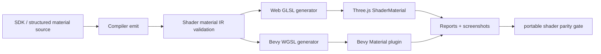
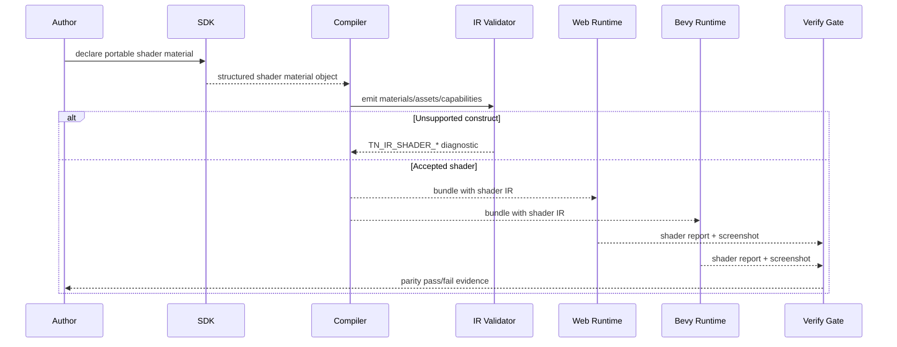

# PRD: Portable Shader Material Parity

Complexity: 13 -> HIGH mode

Score basis: +3 touches 10+ implementation/test/docs files, +2 adds a new
portable shader material contract, +2 spans SDK/structured source/IR/compiler,
+2 spans web Three.js and native Bevy runtime adapters, +2 requires complex
validation/codegen/resource-binding semantics, +1 affects release-gate docs, +1
requires visual parity evidence.

## 1. Context

**Problem:** ThreeNative currently rejects authored shader fields, but users need
a bounded shader material capability that behaves consistently in both web
Three.js and native Bevy.

**Files Analyzed:**

- `AGENTS.md`
- `docs/PRDs/README.md`
- `docs/PRDs/done/v8/V8-07-material-texture-shader-parity.md`
- `docs/PRDs/done/v10/V10-02-advanced-renderer-materials-and-physics.md`
- `docs/PRDs/done/advanced-visual-effects-lighting-material-depth.md`
- `docs/contracts/sdk.md`
- `docs/contracts/ir.md`
- `docs/STATUS.md`
- `docs/bevy-feature-parity.md`
- `packages/ir/src/materialValidation.ts`
- `packages/runtime-web-three/src/mapWorld.ts`
- `runtime-bevy/crates/threenative_runtime/src/map_world.rs`
- `/home/joao/.claude/skills/prd-creator/SKILL.md`

**Current Behavior:**

- SDK and IR promote standard/basic material parameters, texture slots, alpha,
  emissive, clearcoat, transmission, specular, vertex colors, and constrained
  extended material presets.
- Material-owned `shader`, `vertexShader`, `fragmentShader`, `nodeGraph`,
  `shaderDefs`, storage-buffer, render-phase, bindless, and material
  postprocess requests fail validation with stable `TN_IR_SHADER_*_UNSUPPORTED`
  diagnostics.
- Web runtime has internal Three.js shader use for runtime-owned effects, but
  those are not public authored ECS material support.
- Bevy runtime maps material IR to `StandardMaterial`; it does not consume
  authored shader programs.
- Existing docs require a constrained portable shader model, deterministic
  web/native resource binding, rejected fixtures, and visual evidence before
  shader support can be promoted.

## Pre-Planning Findings

No `.env` or host secret configuration is required. Shader verification must use
repo-local fixtures, deterministic generated artifacts, and existing
web/native visual proof infrastructure.

**How will this feature be reached?**

- [x] Entry point identified: TypeScript SDK material declarations, structured
  `content/materials/*.json`, `tn material ... --json`, compiler bundle emit,
  IR validation, web preview/runtime, Bevy runtime, conformance reports, and a
  focused verification gate.
- [x] Caller file identified: SDK material exports and scene `MeshRenderer`
  material references, structured-source material loader/editor operations,
  compiler material emit/capability derivation, IR schemas/validators,
  web material mapper, Bevy material mapper/plugin registration, conformance
  reporters, visual verification tooling, docs status/parity indexes.
- [x] Registration/wiring needed: schema/type updates, shader DSL or AST
  validation, uniform/texture binding model, generated GLSL/WGSL modules,
  runtime material registration, capability tags, fixtures, screenshots,
  diagnostics catalog entries, package scripts, `docs/STATUS.md`, and
  `docs/bevy-feature-parity.md`.

**Is this user-facing?**

- [x] YES. Authors declare portable shader materials and see the same material
  behavior in web and native previews, or receive stable diagnostics for
  unsupported shader requests.
- [ ] NO.

**Full user flow:**

1. User declares a portable shader material in TypeScript or structured source.
2. The compiler emits a `kind: "shader"` material, typed uniforms, texture
   bindings, shader entry points, required capabilities, and source provenance
   into the bundle.
3. IR validation accepts only the promoted shader subset and rejects raw
   backend snippets, undeclared bindings, unsupported builtins, unsafe loops, or
   non-deterministic resource access.
4. Web Three.js generates and registers the matching material implementation.
5. Native Bevy generates/registers the matching WGSL material implementation.
6. Verification compares web/native conformance observations and screenshots.

## 2. Solution

**Approach:**

- Promote a **portable shader material v1** instead of raw Three.js GLSL or raw
  Bevy WGSL. Authors use a constrained ThreeNative shader DSL/AST with codegen
  targets for GLSL and WGSL.
- Start with material-owned mesh shaders only: unlit fragment shading, optional
  alpha, texture sampling, vertex color/UV/normal access, and bounded vertex
  displacement.
- Make resource binding explicit: all uniforms, textures, samplers, varyings,
  builtins, and defaults are declared in IR and validated before runtime.
- Preserve parity by rejecting backend-specific features until both adapters
  implement them with matching reports and visual proof.
- Keep existing raw shader diagnostics for unsupported escape hatches.

**Key Decisions:**

- [x] Library/framework choices: reuse Three.js material infrastructure and
  Bevy 0.14.2 material/shader extension points behind adapter-private code.
- [x] Authoring model: add a portable shader DSL/AST or structured source form;
  do not expose raw GLSL/WGSL as the cross-runtime contract.
- [x] Error-handling strategy: unsupported constructs fail validation with
  stable `TN_IR_SHADER_*` diagnostics before runtime.
- [x] Reused utilities: material validators, asset/texture validation,
  capability derivation, conformance report comparison, screenshot proof,
  docs drift checks, and existing material parity gates.

**Data Changes:** Extend material IR/schema/types with `kind: "shader"`,
portable shader program declarations, uniform declarations, texture bindings,
varying declarations, generated-code metadata, and conformance observations. No
database migrations.

## 3. Portable Shader V1 Scope

### Promoted Capabilities

- `kind: "shader"` material referenced by existing `MeshRenderer.material`.
- Fragment output: `baseColor`, `emissive`, `alpha`, and `discard`/alpha-mask
  semantics.
- Inputs: mesh `position`, `normal`, `uv0`, optional `uv1`, optional vertex
  `color`, world/view/projection matrices, camera position, elapsed time, and
  declared material uniforms.
- Resources: declared 2D textures with existing texture asset validation and
  sampler/wrap/filter/transform policy.
- Uniform types: finite `float`, `int`, `bool`, `vec2`, `vec3`, `vec4`,
  `color`, and fixed-size arrays only when both codegen targets support them.
- Optional vertex stage: bounded position displacement using declared uniforms,
  texture-free arithmetic, and a generated normal policy documented per shader.
- Material policy: existing `alphaMode`, `alphaCutoff`, `opacity`,
  `renderOrder`, `depthWrite`, `depthTest`, and double-sided rules where they
  map identically.

### Explicit Deferrals

- Raw GLSL, raw WGSL, Three.js `onBeforeCompile`, Bevy render graph hooks, node
  materials, shader includes, macros/defs, bindless resources, storage buffers,
  compute shaders, geometry/tessellation stages, custom render phases,
  multi-pass materials, lighting-model replacement, shadows inside custom
  shaders, screen-space texture access, post-processing passes, runtime shader
  string mutation, and platform-specific renderer handles.

## 4. Sequence Flow

## 5. Execution Phases

#### Phase 1: Contract and Diagnostics - Raw shaders stay rejected while the portable shape is defined.

**Files (max 5):**

- `docs/contracts/sdk.md` - public shader material authoring contract.
- `docs/contracts/ir.md` - shader material IR contract and examples.
- `packages/ir/src/types.ts` - `kind: "shader"` and shader program types.
- `packages/ir/schemas/materials.schema.json` - schema additions.
- `packages/ir/src/materialValidation.ts` - accepted/rejected shader diagnostics.

**Implementation:**

- [x] Define `ShaderMaterial`/`Material.shader(...)` authoring shape and
  structured-source JSON shape.
- [x] Add `kind: "shader"` with typed `program`, `uniforms`, `textures`,
  `inputs`, `outputs`, and material policy fields.
- [x] Keep legacy raw fields rejected with existing `TN_IR_SHADER_*` codes.
- [x] Add new diagnostics for unsupported DSL nodes, undeclared uniforms,
  undeclared textures, unsupported builtins, unsafe loops, and unsupported
  resource access.
- [x] Document exact v1 scope and deferrals.

**Tests Required:**

| Test File | Test Name | Assertion |
| --- | --- | --- |
| `packages/ir/src/rendering.test.ts` | `should accept portable shader material declarations` | Valid shader material passes schema and validation. |
| `packages/ir/src/rendering.test.ts` | `should reject raw backend shader payloads on shader materials` | Raw GLSL/WGSL fields still produce `TN_IR_SHADER_CUSTOM_UNSUPPORTED`. |
| `packages/ir/src/rendering.test.ts` | `should reject undeclared shader bindings` | Diagnostic includes material path and missing binding name. |

**Verification Plan:**

1. `pnpm --filter @threenative/ir test -- --run rendering`
2. `pnpm check:docs`
3. Fixture validation for accepted and rejected shader material bundles.

**User Verification:**

- Action: Author one valid shader material and one raw fragment shader field.
- Expected: valid material validates; raw shader field fails with a stable
  diagnostic and promotion guidance.

**Checkpoint:** Automated review after this phase:
`Review checkpoint for phase 1 of PRD at docs/PRDs/proof-first-engine-loop-2026-07-05/PRD-014-portable-shader-material-parity.md`.

#### Phase 2: SDK, Structured Source, and Compiler Emit - Authors can create shader materials without hand-editing bundles.

**Files (max 5):**

- `packages/sdk/src/materials/*` - shader material authoring API.
- `packages/sdk/src/index.ts` - public exports.
- `packages/compiler/src/emit/*` - material emission and capabilities.
- `packages/cli/src/commands/material*` - structured material CLI operations.
- `templates/structured-source-starter/content/materials/*` - starter examples if needed.

**Implementation:**

- [x] Add SDK helpers for uniforms, textures, shader expressions, and material
  policy without exposing renderer handles.
- [x] Add compiler emission for shader materials from SDK and structured
  source.
- [x] Derive capability tags such as `material.shader.v1`,
  `shader.uniform.float`, `shader.texture2d`, and `shader.vertex-displacement`
  only when used.
- [x] Add CLI/editor-safe material operations for creating/updating shader
  material source documents.
- [x] Preserve source provenance and stable IDs.

**Tests Required:**

| Test File | Test Name | Assertion |
| --- | --- | --- |
| `packages/sdk/src/materials/ShaderMaterial.test.ts` | `should create bounded shader material declarations` | SDK normalizes uniforms, textures, inputs, and material policy. |
| `packages/compiler/src/emit/bundle.test.ts` | `should emit shader materials from SDK declarations` | Bundle contains deterministic `materials.ir.json` shader material. |
| `packages/compiler/src/emit/capabilities.test.ts` | `should derive shader material capabilities` | Manifest includes sorted shader capability tags. |
| `packages/cli/src/commands/material.test.ts` | `should create shader material source through JSON operation` | CLI writes source-persistable material JSON, not generated bundle JSON. |

**Verification Plan:**

1. SDK, compiler, and CLI unit tests.
2. `pnpm run validate:authoring` on a structured-source fixture.
3. `tn material ... --json` smoke proof for create/update flows.

**User Verification:**

- Action: Run a CLI JSON operation that creates a shader material and references
  it from a mesh.
- Expected: durable `content/materials/*.json` updates, `tn build` emits a
  valid bundle, and generated `dist/**` remains derived.

**Checkpoint:** Automated review after this phase:
`Review checkpoint for phase 2 of PRD at docs/PRDs/proof-first-engine-loop-2026-07-05/PRD-014-portable-shader-material-parity.md`.

#### Phase 3: Codegen and Runtime Mapping - The same shader IR runs in web and Bevy.

**Files (max 5):**

- `packages/ir/src/shaderCodegen/*` - shared validation/codegen helpers.
- `packages/runtime-web-three/src/*` - Three.js shader material mapping.
- `runtime-bevy/crates/threenative_loader/src/*` - loader types.
- `runtime-bevy/crates/threenative_runtime/src/*` - Bevy material registration/mapping.
- `packages/runtime-web-three/src/mapWorld.test.ts` and `runtime-bevy/.../tests/rendering.rs` - runtime assertions.

**Implementation:**

- [ ] Generate deterministic GLSL for the web adapter from the portable shader
  IR.
- [ ] Generate deterministic WGSL for the Bevy adapter from the same shader IR.
- [ ] Register adapter-private shader material implementations without exposing
  raw Three.js or Bevy handles to authors.
- [ ] Bind uniforms, textures, time, matrices, vertex attributes, and material
  policy consistently.
- [ ] Report generated shader metadata, binding layout, and unsupported runtime
  states in conformance output.

**Tests Required:**

| Test File | Test Name | Assertion |
| --- | --- | --- |
| `packages/ir/src/shaderCodegen.test.ts` | `should generate stable GLSL and WGSL from portable shader IR` | Snapshots contain expected entry points and binding names. |
| `packages/runtime-web-three/src/mapWorld.test.ts` | `should map portable shader materials to Three shader materials` | Web material has declared uniforms/textures and material policy. |
| `runtime-bevy/crates/threenative_runtime/tests/rendering.rs` | `should map portable shader materials to native shader materials` | Native material registry contains matching binding metadata. |

**Verification Plan:**

1. Codegen unit tests.
2. Web and Bevy runtime mapping tests.
3. `pnpm verify:conformance` with a shader material fixture.

**User Verification:**

- Action: Load the same shader-material bundle in web and native runtime.
- Expected: both runtimes report the same shader material ID, uniforms,
  textures, policy, and generated target metadata.

**Checkpoint:** Automated review after this phase:
`Review checkpoint for phase 3 of PRD at docs/PRDs/proof-first-engine-loop-2026-07-05/PRD-014-portable-shader-material-parity.md`.

#### Phase 4: Visual Parity Evidence - Shader output is visibly comparable across engines.

**Files (max 5):**

- `packages/ir/fixtures/conformance/portable-shader-material/game.bundle/*` - shared fixture.
- `examples/portable-shader-material/*` - runnable example if a fixture alone is insufficient.
- `tools/verify/src/*` - shader visual parity gate.
- `scripts/verify-portable-shader-material.mjs` - package-script wrapper.
- `package.json` - verification script registration.

**Implementation:**

- [ ] Add fixtures for color-ramp, texture-sample, alpha-mask, time-uniform, and
  bounded vertex-displacement shader materials.
- [ ] Capture web/native screenshots and conformance reports.
- [ ] Compare targeted image regions with documented thresholds for color,
  alpha, UV sampling, and displacement silhouette.
- [ ] Emit contact sheets and machine-readable artifact summaries.
- [ ] Fail the gate when either engine silently falls back to standard material.

**Tests Required:**

| Test File | Test Name | Assertion |
| --- | --- | --- |
| `tools/verify/src/portable-shader-material.test.ts` | `should fail when shader artifacts are missing for either engine` | Gate reports missing web/native evidence. |
| `tools/verify/src/portable-shader-material.test.ts` | `should compare shader material sample regions` | Gate validates configured regions and thresholds. |
| `packages/runtime-web-three/src/conformance.test.ts` | `should report portable shader material observations` | Web report includes shader material evidence. |
| `runtime-bevy/crates/threenative_runtime/tests/conformance.rs` | `should_report_portable_shader_material_observations` | Native report matches fixture metadata. |

**Verification Plan:**

1. `pnpm verify:conformance`
2. `pnpm verify:portable-shader-material`
3. Inspect generated contact sheet for nonblank web/native shader output.

**User Verification:**

- Action: Run `pnpm verify:portable-shader-material`.
- Expected: artifacts include web/native screenshots, conformance reports,
  contact sheet, and pass/fail region samples.

**Checkpoint:** Automated plus manual visual review after this phase:
`Review checkpoint for phase 4 of PRD at docs/PRDs/proof-first-engine-loop-2026-07-05/PRD-014-portable-shader-material-parity.md`.

#### Phase 5: Docs, Gates, and Release Boundary - Shader parity becomes a tracked supported capability.

**Files (max 5):**

- `docs/STATUS.md` - supported capability and remaining boundaries.
- `docs/bevy-feature-parity.md` - material/shader parity checklist and evidence.
- `docs/PRDs/README.md` - active/completed PRD index updates.
- `packages/ir/diagnostics/diagnostics.catalog.json` - diagnostic catalog updates.
- `docs/contracts/authoring-source-documents.md` - structured material source contract.

**Implementation:**

- [ ] Update status/parity docs with promoted shader v1 scope and artifact
  paths.
- [ ] Keep raw shader, storage-buffer, bindless, render-phase, postprocess, and
  backend-handle deferrals explicit.
- [ ] Add diagnostics catalog entries for every new shader validation code.
- [ ] Add release-gate expectations and fixture ownership.
- [ ] Move this PRD to `docs/PRDs/done` only after all phases and evidence pass.

**Tests Required:**

| Test File | Test Name | Assertion |
| --- | --- | --- |
| `packages/ir/src/diagnostics.test.ts` | `should catalog shader material diagnostics` | Every new `TN_IR_SHADER_*` code has catalog metadata. |
| docs check | `pnpm check:docs` | Status, parity, PRD links, and diagnostics references are consistent. |
| release gate | `pnpm verify:release` | Shader parity gate is included or explicitly documented as pre-release optional. |

**Verification Plan:**

1. `pnpm check:docs`
2. `pnpm verify:portable-shader-material`
3. `pnpm verify:release`

**User Verification:**

- Action: Read `docs/STATUS.md` and `docs/bevy-feature-parity.md`.
- Expected: shader v1 support, evidence, and deferrals are clear without
  implying arbitrary raw shader parity.

**Checkpoint:** Automated review after this phase:
`Review checkpoint for phase 5 of PRD at docs/PRDs/proof-first-engine-loop-2026-07-05/PRD-014-portable-shader-material-parity.md`.

## 6. Verification Strategy

- Unit tests prove schema, validators, SDK helpers, compiler emit, capability
  derivation, and codegen.
- Runtime tests prove web and Bevy consume the same shader IR and report the
  same binding/material metadata.
- Conformance fixtures prove bundle shape, diagnostics, and report parity.
- Visual gate proves nonblank, intended shader output in both engines with
  documented sample thresholds.
- Docs checks prove the supported capability and remaining boundaries are
  indexed and release-gated.

## 7. Acceptance Criteria

- [x] `kind: "shader"` material is documented in SDK and IR contracts.
- [x] Authors can create shader materials through SDK and structured source.
- [ ] Raw GLSL/WGSL/backend shader fields remain rejected unless wrapped by the
  portable shader contract.
- [ ] Web Three.js and native Bevy both render the same portable shader material
  fixture from the same IR.
- [ ] Conformance reports include matching shader material metadata for both
  engines.
- [ ] Visual evidence includes color, texture, alpha, time, and displacement
  samples across both engines.
- [ ] `docs/STATUS.md` and `docs/bevy-feature-parity.md` document the promoted
  v1 scope and explicit deferrals.
- [ ] `pnpm verify:portable-shader-material`, `pnpm verify:conformance`,
  `pnpm check:docs`, and the relevant release gate pass.

## 8. Non-Goals

- No arbitrary raw Three.js `ShaderMaterial` snippets as durable source.
- No arbitrary raw Bevy WGSL snippets as durable source.
- No public renderer handles, render graph handles, storage buffers, bindless
  resources, compute shaders, custom render phases, or post-processing chains.
- No claim of physically based lighting parity for custom shader materials in
  v1.
- No fallback that silently replaces a shader material with a standard material.

## 9. Verification Evidence

- Phase 1 contract and diagnostics are implemented in IR schema/types,
  validation, and SDK/IR contracts.
- Phase 2 SDK, structured source, compiler emit, capability tags, and CLI
  `--shader-json` authoring are implemented. Focused verification passed:
  `pnpm --filter @threenative/sdk test -- --run "bounded shader material|non-portable shader"`,
  `pnpm --filter @threenative/compiler test -- --run "shader materials from|shader material capabilities"`,
  `pnpm --filter @threenative/cli test -- --run "shader material source"`,
  `pnpm --filter @threenative/authoring build`, and
  `pnpm --filter @threenative/authoring test -- --run material`.
