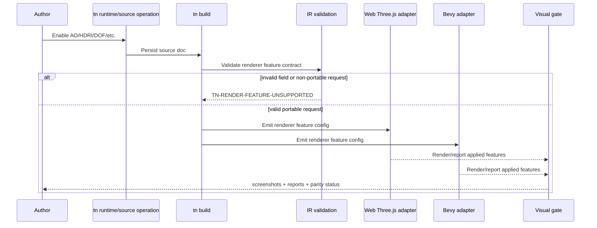

# PRD: Portable Photoreal Rendering and Post-Processing

Complexity: 11 -> HIGH mode

Score basis: +2 expands renderer/source/IR contracts, +2 spans SDK/IR/compiler/web/Bevy/CLI/editor/docs, +2 requires cross-runtime visual parity proof, +2 introduces adapter-private rendering dependencies, +1 capability diagnostics, +1 asset/material fixture coverage, +1 release-gate evidence.

## 1. Context

**Problem:** Three.js has strong ecosystem packages for expensive-looking rendering (`postprocessing`, `n8ao`, `realism-effects`, `threepipe`), but ThreeNative must not expose Three.js-only concepts as authored game APIs. João's requirement is explicit: photoreal rendering and post-processing are baseline engine features, so the same authored feature must be implemented in both the Three.js runtime and the Bevy runtime.

**Goal:** Add a portable rendering/post-processing baseline for photoreal-ish scenes: HDRI/environment lighting, tone mapping/exposure, ambient occlusion, bloom, depth of field, screen-space reflections, motion blur, and a defined path for SSGI. Web may use Three.js ecosystem libraries internally; Bevy may use native Bevy renderer facilities or adapter-private Rust implementations; authored source and IR remain engine-neutral.

**Non-goals:**

- Do not expose `threepipe`, `n8ao`, `realism-effects`, `postprocessing`, R3F, or drei concepts in SDK/source/IR.
- Do not make ThreeNative's web runtime a `threepipe` app or viewer framework.
- Do not claim Bevy parity for features that only render in Three.js.
- Do not make basic scene rendering depend on heavyweight post-processing packages when no authored feature needs them.
- Do not vendor third-party asset binaries as part of this PRD.
- Do not implement arbitrary custom post-processing shaders here; see `portable-shader-material-parity.md` and advanced visual boundary PRDs.

**Files Analyzed:**

- `AGENTS.md`
- `package.json`
- `docs/PRDs/README.md`
- `docs/PRDs/done/advanced-visual-effects-lighting-material-depth.md`
- `docs/PRDs/done/other/camera-post-processing-boundaries.md`
- `docs/PRDs/done/beautiful-defaults-render-look-profiles.md`
- `docs/PRDs/done/other/render-look-shadow-bloom-polish.md`
- `docs/PRDs/done/other/imported-gltf-visual-fidelity.md`
- `docs/PRDs/done/other/dense-scene-lod-texture-delivery.md`
- `docs/data/asset-sources.seed.jsonl`
- `docs/data/polyhaven-asset-sources.snapshot.json`
- `docs/data/ambientcg-asset-sources.snapshot.json`
- `docs/data/os3a-asset-sources.snapshot.json`
- `scripts/build-asset-source-catalog.mjs`
- `packages/runtime-web-three/src/rendering/applyRenderLookProfile.ts`
- `packages/runtime-web-three/src/mapWorld.ts`

**Current Behavior:**

- Core render-look profile support exists for `parity` and `balanced`; web currently applies bounded bloom/color-grading defaults for `balanced` and falls back for unsupported profiles.
- The asset-source catalog already ships queryable Poly Haven, ambientCG, and Open Source 3D Assets/ToxSam-style records through generated snapshots and SQLite.
- Runtime/source docs already cover broad material texture/PBR fields, environment scene data, light probes, render targets, bloom, anti-aliasing, color grading metadata, and visual parity gates.
- Advanced effects such as DOF, motion blur, SSR, SSGI, richer AO, advanced PBR depth/parallax, and custom post passes are still diagnostic or boundary work.
- Web Three.js already has GLTF/Draco loader plumbing. Meshopt/KTX2 and texture-delivery concerns are tracked separately by dense scene / imported glTF fidelity work.

## Pre-Planning Findings

The safe architecture is a portable capability contract:

```txt
structured source / SDK renderer declarations
  -> validated IR renderer feature contract
  -> compiler capability requirements
  -> web Three.js adapter implementation
  -> Bevy adapter implementation
  -> visual proof gate comparing authored intent, reports, and screenshots
```

Useful ecosystem roles:

- `postprocessing`: adapter-private Three.js implementation detail for composer/effects plumbing.
- `n8ao`: adapter-private Three.js ambient occlusion implementation detail, because AO is a high-value/low-complexity realism win.
- `realism-effects` ([0beqz/realism-effects](https://github.com/0beqz/realism-effects)): NOT a dependency. Source-porting reference only: borrow applicable pass/shader code (SSR, motion blur, TRAA, SSGI) into the web adapter where useful, preserving license attribution. Ported effects must be wired through the same public renderer feature contract, and any adopted behavior must be ported or honestly diagnosed in Rust/Bevy too.
- `threepipe`: reference for render-look profiles/plugin ergonomics only. Do not adopt it as the core runtime base.
- `drei`/R3F helpers: mostly not core-engine dependencies; mine portable ideas only.

**How will this feature be reached?**

- [x] Entry point identified:
  - SDK/source renderer declarations.
  - `tn runtime set-rendering ...` or equivalent CLI/source operations.
  - `tn build`, runtime preview, `tn screenshot`, `tn verify --json`.
- [x] Caller file identified:
  - SDK renderer helpers.
  - IR renderer/material/environment schemas and validators.
  - Compiler capability emit.
  - `packages/runtime-web-three` renderer setup and post-processing layer.
  - Bevy runtime renderer adapter/capability reports.
  - verify tooling and docs.
- [x] Registration/wiring needed:
  - Add renderer feature fields and validation.
  - Add capability diagnostics and runtime budget metadata.
  - Add web dependencies only after a minimal proof spike.
  - Add Bevy implementation reports.
  - Add web+Bevy visual fixtures and release evidence for baseline support.

**Is this user-facing?**

- [x] YES. Authors will declare visual features and expect them to render or fail honestly across both runtimes.
- [ ] NO.

**Full user flow:**

1. Author creates or edits a runtime/rendering source document.
2. Author enables a portable feature such as ambient occlusion, HDRI environment lighting, bloom, DOF, SSR, or motion blur.
3. `tn build` validates the feature against supported schema and runtime capability reports.
4. Web runtime renders the feature through Three.js/post-processing internals and reports the applied feature.
5. Bevy runtime renders the equivalent feature and reports the applied feature.
6. Verification captures web and Bevy screenshots, runtime reports, diagnostics, and a contact sheet.
7. Release docs state baseline support and evidence for each feature per runtime.

## 2. Solution

**Approach:**

Implement photoreal rendering in layers, but treat the layer list as baseline engine work rather than optional polish. Do not hide capabilities behind separate gates; if a feature is present in the authored renderer contract, both adapters must implement it and report it. Stable diagnostics are for invalid assets, invalid values, runtime budget violations, and temporary rollout gaps during development, not for shipping a Three.js-only feature.

### Portable renderer feature shape

Add or extend renderer config with engine-neutral fields:

```json
{
  "renderer": {
    "renderLook": {
      "profile": "balanced",
      "overrides": {
        "exposure": 1.0,
        "saturation": 1.05,
        "contrast": 0.08,
        "bloomIntensity": 0.25
      }
    },
    "environmentLighting": {
      "enabled": true,
      "mode": "hdri",
      "asset": "studio-hdri",
      "intensity": 1.0,
      "rotationY": 0
    },
    "ambientOcclusion": {
      "enabled": true,
      "mode": "screen-space",
      "radius": 3.0,
      "intensity": 1.2,
      "quality": "medium"
    },
    "screenSpaceReflections": {
      "enabled": true,
      "quality": "medium",
      "roughnessLimit": 0.45
    },
    "depthOfField": {
      "enabled": true,
      "focusDistance": 12,
      "aperture": 0.04,
      "maxBlur": 0.015
    },
    "motionBlur": {
      "enabled": false,
      "shutterAngle": 0.5
    },
    "screenSpaceGlobalIllumination": {
      "enabled": false,
      "quality": "low"
    }
  }
}
```

### Baseline Feature Matrix

| Feature | Engine status | Web implementation target | Bevy implementation target | Required proof |
|---|---|---|---|---|
| Tone mapping / exposure | baseline | existing Three.js renderer config | Bevy tonemapping/exposure | existing color/lighting gate remains stable |
| HDRI/environment lighting | baseline | PMREM/environment texture | Bevy environment-map/IBL path | reflective-object side-by-side proof |
| Bloom | baseline | existing/postprocessing bloom | Bevy bloom | emissive fixture side-by-side proof |
| Ambient occlusion | baseline | `n8ao` or `postprocessing` SSAO | Bevy SSAO/equivalent | corner/contact-shadow fixture proof |
| Depth of field | baseline | `postprocessing` DOF | Bevy DOF/equivalent | foreground/background focus fixture proof |
| SSR | baseline | custom SSR (port from `realism-effects` where applicable) | Bevy SSR/equivalent | wet-floor/metal fixture proof in both runtimes |
| Motion blur | baseline | custom motion blur (port from `realism-effects` where applicable) | Bevy motion blur/equivalent | moving-object contact sheet proof in both runtimes |
| SSGI | baseline stretch | ported `realism-effects` code where applicable | Bevy GI/equivalent | no support claim until both runtimes render and report it |

### Diagnostics

Every invalid, budget-blocked, or not-yet-landed feature must produce stable machine-readable diagnostics during development and verification:

```txt
TN-RENDER-FEATURE-FALLBACK
feature: renderer.ambientOcclusion
runtime: bevy
requestedMode: screen-space
appliedMode: disabled
reason: Bevy adapter has not landed the baseline SSAO implementation yet.
suggestion: Finish the Bevy SSAO baseline task or keep the feature out of release claims.
```

Required diagnostic families:

- `TN-RENDER-FEATURE-FALLBACK`
- `TN-RENDER-FEATURE-UNSUPPORTED`
- `TN-RENDER-FEATURE-TARGET-BUDGET`
- `TN-RENDER-FEATURE-ASSET-MISSING`

### Web dependency policy

- Add web adapter dependencies only behind a small spike and focused proof.
- Dependencies must remain runtime-web-three implementation details.
- Authored source, IR, CLI, and editor must not mention package names.
- If a package is too unstable, replace it with adapter-owned code or another library; do not turn a baseline renderer feature into a permanent Three.js-only diagnostic.

Recommended order:

1. Add `postprocessing` plumbing only if existing internal pass structure is insufficient.
2. Add `n8ao` first for AO.
3. For SSR/motion blur/SSGI, port the applicable parts of `realism-effects`
   source into the web adapter (with attribution) as normal adapter-private
   implementations of the public renderer contract; do not add it as a
   package dependency.
4. Do not adopt `threepipe` as runtime base; use it only as reference material.

**Key Decisions:**

- [x] Library/framework choices: portable source/IR contract first; web libraries are adapter-private; Bevy equivalent implementation is mandatory.
- [x] Error-handling strategy: invalid or not-yet-landed capabilities produce stable diagnostics, not silent visual drift.
- [x] Reused utilities: existing screenshot/video proof, visual parity gates, render-look reports, asset-source catalog, material/environment source docs.

**Data Changes:**

- Extend runtime/rendering source docs and IR schemas with bounded renderer feature fields.
- Extend capability reports with per-feature runtime support state.
- No database migration. Asset catalog data is already generated from snapshots; this PRD consumes it for fixtures.

## 3. Sequence Flow



## 4. Implementation Plan

### Phase 1 — Inventory and contract slice

- [ ] Inventory existing renderer/runtime config fields and source operations.
- [ ] Define renderer feature schema for `environmentLighting`, `ambientOcclusion`, `depthOfField`, `screenSpaceReflections`, `motionBlur`, and `screenSpaceGlobalIllumination`.
- [x] Add capability status enum: `baseline`, `rollout-gap`, `budget-blocked`, `invalid`.
- [x] Add IR validation for bounded numeric ranges and incompatible combinations.
- [x] Add compiler/runtime report types for requested/applied feature status.

### Phase 2 — HDRI/PBR fixture path

- [ ] Use asset catalog records for Poly Haven HDRIs and ambientCG PBR materials.
- [ ] Add fixture source docs referencing catalog-selected HDRI/material assets.
- [ ] Validate that assets remain bundle-local after import; runtime adapters must not fetch arbitrary network resources at render time.
- [ ] Add missing diagnostics for missing/invalid HDRI or texture-set assets.

### Phase 3 — Ambient occlusion first pass

- [x] Add portable `renderer.ambientOcclusion` source/IR fields.
- [x] Implement web AO through the simplest stable path (`n8ao` preferred if spike passes; otherwise existing/postprocessing SSAO).
- [x] Implement Bevy AO through SSAO/equivalent baseline support.
- [x] Add AO fixture with corners/contact surfaces and side-by-side screenshot report.

### Phase 4 — Bloom/HDRI/render-look consolidation

- [ ] Reconcile existing bloom/color grading/render-look code with the new feature report shape.
- [ ] Ensure `balanced` profile remains deterministic and can explain applied tone mapping/exposure/bloom.
- [ ] Add reflective PBR/HDRI showroom fixture.
- [ ] Update docs and parity tables.

### Phase 5 — DOF/SSR/motion blur baseline lanes

- [ ] Add source/IR fields as normal baseline renderer contract fields, without separate gates.
- [x] Add web implementation spikes for DOF and motion blur.
- [x] Add Bevy implementations for DOF and motion blur.
- [x] Implement SSR in both runtimes before claiming support; keep SSGI out of release claims until both runtimes render it.

### Phase 6 — CLI/editor operations

- [x] Add `tn runtime set-rendering` flags or registry operations for baseline fields.
- [x] Add editor inspector controls for renderer fields that are in the public source contract.
- [ ] Show rollout-gap, invalid, and budget-blocked diagnostics inline instead of hiding fields.
- [ ] Ensure operation payloads preserve source ownership/provenance.

### Phase 7 — Verification and release evidence

- [x] Add focused visual gate: `pnpm verify:rendering-photoreal` or integrate into existing render-look gate.
- [x] Capture web+Bevy screenshots, reports, diagnostics, and contact sheets.
- [ ] Add fixtures:
  - `photoreal-hdri-showroom`
  - [x] `photoreal-ao-corner-test`
  - [x] `photoreal-bloom-emissive-test`
  - [x] `photoreal-dof-depth-test`
  - [x] `photoreal-motion-blur-moving-test`
  - [x] `photoreal-reflective-wet-floor`
- [x] Update `docs/STATUS.md`, `docs/bevy-feature-parity.md`, and PRD index for AO, bloom/emissive, DOF, motion-blur, and SSR proof scope.

## 5. Acceptance Criteria

- [ ] Authored renderer features are source/IR-level and do not expose Three.js package names.
- [ ] Web and Bevy runtimes both report requested/applied feature state.
- [ ] Any temporary rollout gap emits stable diagnostics rather than silently dropping visual intent.
- [ ] AO has a real cross-runtime fixture.
- [ ] HDRI/environment lighting uses catalog-selected assets and proves reflective PBR output.
- [ ] Visual proof includes side-by-side web+Bevy screenshots and machine-readable reports.
- [ ] CLI/editor operations can mutate baseline fields without hand-editing generated bundles.
- [ ] Docs state baseline support and evidence for each feature.
- [ ] Release/focused verification catches accidental Three.js-only feature claims.

## 6. Risks and Pushback

- **Three.js library trap:** adopting `threepipe` or exposing `n8ao` concepts directly would make Bevy parity harder. Keep all library details adapter-private.
- **Visual parity overclaim:** AO/SSR/DOF will not pixel-match exactly across engines. Gate on authored intent, feature reports, and bounded visual regions, not full-frame identical screenshots.
- **Performance regression:** post-processing can be expensive. Runtime budgets need quality metadata and default-off behavior for heavy effects.
- **Asset runtime leakage:** Poly Haven/ambientCG URLs are catalog/provenance sources, not runtime CDN dependencies. Imported fixtures should be bundle-local.
- **SSGI risk:** SSGI is attractive but likely too backend-specific. Keep it out of release claims until both runtimes have a real implementation and proof.

## 7. Verification Commands

Future implementation should prove itself with a focused subset before full release:

```bash
pnpm check:asset-sources
pnpm --filter @threenative/ir test
pnpm --filter @threenative/compiler test
pnpm --filter @threenative/runtime-web-three test
pnpm verify:render-look
pnpm verify:parity:push
pnpm verify:release
```

If new dependencies are added:

```bash
pnpm install
pnpm verify:pre-push
```

## 8. Open Questions

- Which Bevy version/API path should be treated as the first baseline SSAO/AO target?
- Which minimal Bevy SSR/equivalent path is credible enough to pair with the
  Three.js SSR spike before any portable support claim?
- Should `cinematic`/`stylized` render-look profiles become real profiles in this PRD or stay separate art-direction work?
- What runtime performance budgets should gate AO/DOF/motion blur on mobile/webview?

## 9. Review Insights (2026-07-08)

Findings from a review against `docs/status/ENGINE-READINESS-REPORT-2026-07-08.md`,
`docs/runtime/native-path.md`, and the current web adapter code. These adjust
scope interpretation; they do not change the portable-contract architecture.

### 9.1 Cross-runtime rendering support is in scope

`docs/runtime/native-path.md` records a conservative policy for casual
Bevy-native promotions, but this PRD is not a web-only escape hatch. The
product requirement for photoreal rendering remains: authored rendering
features in this PRD are baseline engine features for both the Three.js adapter
and the Bevy adapter, with adapter-private implementations and proof per
runtime. A stable diagnostic is acceptable for rollout gaps, invalid inputs, or
budget-blocked runs; it is not the promotion bar for a feature we claim as
portable.

- Phase 3's "Implement Bevy AO" remains real implementation work. Ambient
  occlusion cannot graduate to baseline support on web proof alone.
- Phase 5's DOF, SSR, and motion-blur lanes carry Bevy implementation tasks
  beside the Three.js implementation spikes. If Bevy cannot implement a lane
  yet, that lane is a rollout gap and docs must say so.
- SSGI remains out of release claims until both adapters can prove it.
- The native-promotion evidence required by the freeze policy is satisfied by
  this PRD's shipped-game visual need, web proof, Bevy screenshot/report proof,
  and a focused rendering gate that can fail in CI.
- `TN-RENDER-FEATURE-FALLBACK`/`UNSUPPORTED` diagnostics are still required,
  but they are guardrails for rollout gaps, invalid requests, and regression
  reporting, not a substitute for implementing Bevy support for baseline
  features.

### 9.2 Diagnostic naming must reconcile with existing code

The web adapter already emits `TN_RENDER_PROFILE_FALLBACK_USED`
(`packages/runtime-web-three/src/rendering/applyRenderLookProfile.ts`), while
this PRD proposes a hyphenated `TN-RENDER-FEATURE-*` family. Phase 1 should
pick one convention and either migrate the existing code or fold the new
diagnostics into the existing style — two spellings of the same family is
exactly the silent-drift class the diagnostics are meant to prevent. The
existing shape is a good base to extend rather than replace:

```ts
export interface IWebRenderFeatureReport {
  feature: string;                  // "renderer.ambientOcclusion"
  requestedMode: string;
  appliedMode: string;              // "disabled" on fallback
  status: "baseline" | "rollout-gap" | "budget-blocked" | "invalid";
  diagnostic?: {
    code: "TN_RENDER_FEATURE_FALLBACK" | "TN_RENDER_FEATURE_UNSUPPORTED"
      | "TN_RENDER_FEATURE_TARGET_BUDGET"
      | "TN_RENDER_FEATURE_ASSET_MISSING";
    reason: string;
    suggestion: string;
  };
}
```

### 9.3 The baseline table needs an owner, not maintenance

Per the repo drift rules, the Section 2 feature/status table is a second
hand-maintained adapter list waiting to rot. Phase 1's capability status enum
should live in a registry (IR or compiler capability descriptors) that both
runtimes' reports and `docs/bevy-feature-parity.md` derive from, with a drift
test that fails when a feature is added to source/IR schema without a
registry entry. Note the readiness report sequences adapter-surface drift
gates (remediation PRD-002) ahead of new surface work — the same pattern
applies here even though renderer features are a different surface.

### 9.4 Sequencing note

The readiness report ranks this PRD (with cinematic-look PRD-5) as a
mid-size enabler behind closing PRD-012 and landing drift gates. Phases 1-4
(contract slice, HDRI fixtures, AO, render-look consolidation) are the value
core; Phases 5-6 (baseline lanes, editor controls) can trail without
blocking the "default output reads stylized-demo" fix that motivates the PRD.
