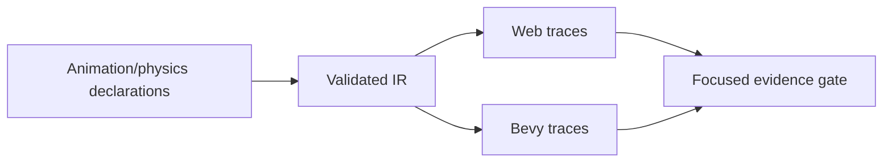
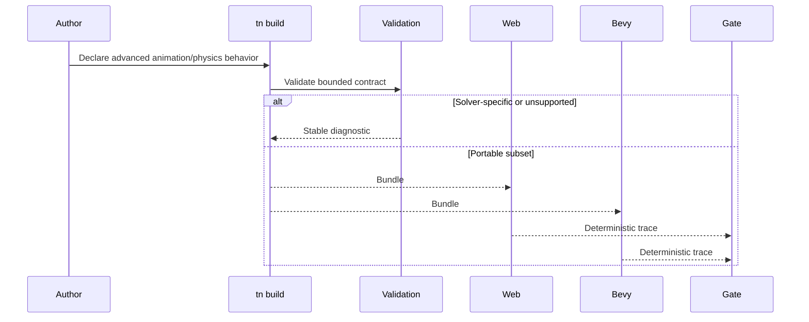

# PRD: Advanced Animation and Physics Depth

> **Physics planning note (2026-07-22):** Phase 2 is superseded by
> [`../done/PRD-advanced-physics-major-games-2026-07-22.md`](../done/PRD-advanced-physics-major-games-2026-07-22.md).
> This PRD remains the active owner of the advanced animation scope in Phase 1.

Complexity: 12 -> HIGH mode

Score basis: +3 touches 10+ future files, +2 adds advanced animation and
physics contract surfaces, +2 includes solver/navigation complexity, +2 spans
SDK/IR/compiler/web/Bevy/examples/verify/docs, +2 needs deterministic
cross-runtime traces, +1 affects conformance and parity docs.

## 1. Context

**Problem:** The remaining animation and physics gaps are high-complexity
features that need explicit, bounded semantics before they can be claimed as
portable.

**Files Analyzed:**

- `docs/bevy-feature-parity.md`
- `docs/STATUS.md`
- `docs/PRDs/done/other/post-v10-animation-physics-navigation-residuals.md`
- `/home/joao/.claude/skills/prd-creator/SKILL.md`

**Current Behavior:**

- Skeletal animation playback, stateful query/stop behavior, bounded blending,
  masks, morph targets, UI/property animation, particles, rigid bodies,
  colliders, character movement, dynamic mesh-collider metadata, dynamic
  navmesh, crowd steering, and off-mesh links are already promoted or
  diagnostic-gated.
- Retargeting, inverse kinematics, arbitrary blend trees, full constraints,
  arbitrary triangle narrow phase, vehicles, soft bodies, and ragdolls remain
  unchecked.

## Pre-Planning Findings

No external service or secret configuration is required. Future physics proof
must stay deterministic and avoid exposing raw backend handles in portable APIs.

**How will this feature be reached?**

- [x] Entry point identified: SDK animation/physics declarations, `tn build`,
  runtime previews, conformance fixtures, and focused animation/physics gates.
- [x] Caller file identified: SDK helpers, IR validators, compiler emit paths,
  web runtime animation/physics adapters, Bevy runtime adapters, and verify
  tooling.
- [x] Registration/wiring needed: new capability metadata, diagnostics,
  deterministic trace fixtures, examples, docs, and release gate inclusion
  after stabilization.

**Is this user-facing?**

- [x] YES. Game authors use animation and physics declarations directly.
- [ ] NO.

**Full user flow:**

1. User declares IK, retargeting, advanced blend, constraint, vehicle, or
   ragdoll behavior.
2. Build validation accepts only bounded portable semantics.
3. Web and Bevy runtimes produce deterministic traces and visual evidence.
4. Unsupported solver-specific behavior fails with diagnostic alternatives.

## 2. Solution

**Approach:**

- Split animation depth from solver depth within one PRD so each phase remains
  vertical and testable.
- Promote narrow IK/retargeting and blend-tree subsets only if they can compile
  into stable IR and deterministic runtime traces.
- Promote constraints, triangle narrow phase, and vehicles only with explicit
  solver policy and cross-runtime tolerance thresholds.
- Keep soft bodies and ragdolls diagnostic-first unless a future proof limits
  them to replayable authored poses or bounded joint graphs.

**Key Decisions:**

- [x] Library/framework choices: reuse current animation graph, physics trace,
  and conformance infrastructure.
- [x] Error-handling strategy: reject backend-specific solver knobs and raw
  handles with stable diagnostics.
- [x] Reused utilities: deterministic trace comparison, fixture builders,
  runtime report normalization, and docs drift checks.

**Data Changes:** Extend animation and physics IR schemas and trace report
types. No database migrations.

## 3. Sequence Flow

## 4. Execution Phases

#### Phase 1: IK, Retargeting, and Blend Trees - Advanced animation has a bounded contract.

**Files (max 5):**

- `packages/sdk/src/*` - animation authoring helpers
- `packages/ir/src/*` - animation schema and validation
- `packages/compiler/src/*` - animation emit
- `packages/runtime-web-three/src/*` - web animation runtime mapping
- `runtime-bevy/src/*` - native animation runtime mapping

**Implementation:**

- [ ] Define a limited IK chain declaration with finite joint count and target
  constraints.
- [ ] Define retargeting metadata only for declared compatible skeleton maps.
- [ ] Promote blend trees beyond crossfade only when finite states, weights,
  and event ordering are deterministic.
- [ ] Reject arbitrary script-driven animation graphs.

**Tests Required:**

| Test File | Test Name | Assertion |
| --- | --- | --- |
| `packages/ir/src/advanced-animation.test.ts` | `should reject IK chains with unsupported solver options` | Diagnostic includes solver option path. |
| `packages/runtime-web-three/src/advanced-animation.test.ts` | `should sample bounded blend tree deterministically` | Web trace matches fixture. |
| `runtime-bevy/tests/advanced_animation.rs` | `should sample bounded blend tree deterministically` | Native trace matches fixture. |

**Verification Plan:**

1. Unit tests for accepted and rejected animation declarations.
2. Cross-runtime trace comparison.
3. Visual fixture for at least one promoted animation feature.
4. `pnpm verify:conformance`.

**User Verification:**

- Action: run the advanced animation fixture.
- Expected: traces show matching IK/blend outputs or diagnostics explain why a
  declaration is unsupported.

#### Phase 2: Constraints, Triangle Narrow Phase, and Vehicles - Solver depth is explicit.

**Files (max 5):**

- `packages/ir/src/*` - physics schema and validation
- `packages/compiler/src/*` - physics emit
- `packages/runtime-web-three/src/*` - web physics/report mapping
- `runtime-bevy/src/*` - native physics/report mapping
- `tools/verify/src/*` - focused gate checks

**Implementation:**

- [ ] Promote a bounded constraint set beyond hinge/slider/suspension metadata
  only with deterministic trace tolerance.
- [ ] Add arbitrary triangle narrow-phase support or a stable diagnostic that
  directs authors to bounded mesh-collider policy.
- [ ] Define vehicle drivetrain/tire/friction declarations only if both
  runtimes can produce comparable traces.
- [ ] Keep soft bodies and ragdolls diagnostic-only unless constrained to a
  finite, portable joint graph.

**Tests Required:**

| Test File | Test Name | Assertion |
| --- | --- | --- |
| `packages/ir/src/advanced-physics.test.ts` | `should reject vehicle tire models outside the portable catalog` | Diagnostic includes model id. |
| `tools/verify/src/advanced-physics.test.ts` | `should fail when web and native constraint traces drift beyond tolerance` | Gate reports drift path. |
| `runtime-bevy/tests/advanced_physics.rs` | `should report unsupported soft body declarations` | Diagnostic code is stable. |

**Verification Plan:**

1. Unit tests for schema validation.
2. Runtime trace tests for each promoted physics feature.
3. Focused gate with web/Bevy trace comparison.
4. `pnpm check:docs` and `pnpm verify:release` before checking parity rows.

**User Verification:**

- Action: run the advanced physics fixture.
- Expected: promoted constraints or vehicle traces match; unsupported solver
  breadth fails explicitly.

## 5. Acceptance Criteria

- [ ] No raw physics backend handles are exposed in portable APIs.
- [ ] All promoted advanced animation and physics features have deterministic
  web/Bevy evidence.
- [ ] Unsupported solver and animation graph features emit stable diagnostics.
- [ ] Parity and status docs are updated only with passing evidence.
