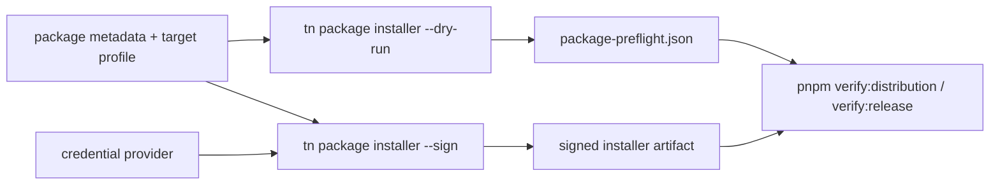
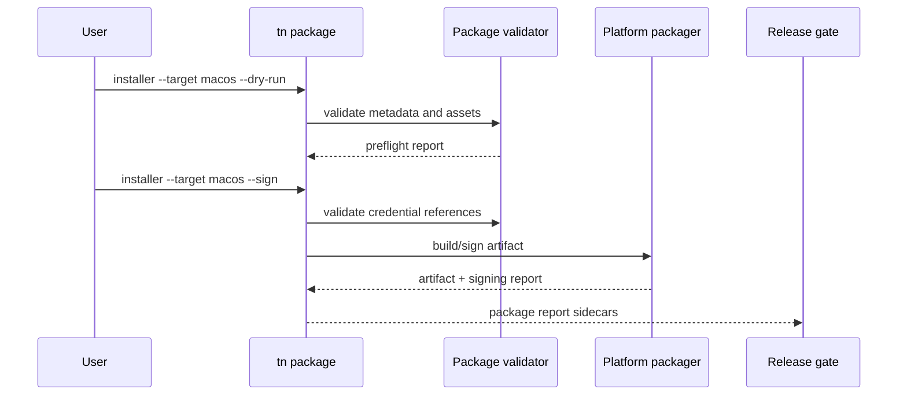

# PRD: Signed Installers And Store Packaging

`Planning Mode: Principal Architect`
`Complexity: 8 -> HIGH mode`

Score basis: +3 touches 10+ files across CLI, runtime-bevy packaging,
target-profile validation, scripts, docs, and verify-tools; +2 multi-package
release flow; +1 external credential integration; +1 platform packaging
surface; +1 release-gate evidence.

## 1. Context

**Problem:** The proof-first roadmap's Phase 5 includes signed installers and
store packaging, but current distribution work is mostly package-contract and
preflight evidence rather than real installer/signing/notarization flows.

**Files Analyzed:**

- `docs/status/ROADMAP.md`
- `docs/PRDs/done/other/post-v10-production-audio-diagnostics-packaging.md`
- `docs/PRDs/proof-first-engine-loop-2026-07-05/PRD-003-external-services-media-boundaries.md`
- `package.json`
- `scripts/verify-distribution-release.mjs`
- `scripts/publish-distribution-release.mjs`
- `scripts/check-distribution-contract.mjs`
- `docs/contracts/distribution-contract.md`
- `docs/workflows/ai-distribution.md`
- `tools/verify/src/release.ts`

**Current Behavior:**

- `pnpm verify:distribution` proves npm/AI distribution package shape and a
  desktop tarball-style artifact path.
- Existing production packaging work records signed/mobile packaging as a
  preflight and diagnostic boundary.
- Missing credentials and invalid metadata are not yet modeled as a first
  class release plan with dry-run and real-signing modes.
- There is no promoted `tn package installer` / `tn package store` flow for
  Windows/macOS/Linux installers or store submission bundles.

## Pre-Planning Findings

**How will this feature be reached?**

- [x] Entry point identified: new `tn package installer --target <platform>`
  and `tn package store --target <store>` commands plus `pnpm verify:distribution`.
- [x] Caller file identified: CLI package command module, distribution release
  scripts, and release verify tooling.
- [x] Registration/wiring needed: CLI command registration, target-profile
  packaging metadata, credential loader, docs, and release-gate checks.

**Is this user-facing?**

- [x] YES. Release engineers and game authors package signed builds.
- [ ] NO.

**Full user flow:**

1. User adds package metadata and target profile packaging settings.
2. `tn package installer --target macos --dry-run --json` validates metadata,
   bundle assets, icons, entitlements, and credential requirements.
3. With credentials configured, `tn package installer --target macos --sign
   --json` produces a signed/notarization-ready artifact.
4. `tn package store --target steam|itch|app-store --dry-run --json` writes a
   store preflight report and actionable missing-field diagnostics.
5. Release gates archive package reports without ever printing secrets.

## 2. Solution

**Approach:**

- Promote packaging from diagnostic-only preflight into a two-mode flow:
  `--dry-run` validates everything without secrets; `--sign` requires explicit
  credentials and produces signed artifacts.
- Model packaging metadata in source/target-profile documents, not ad hoc
  script flags.
- Keep credential access explicit and non-secret in reports: credential id,
  provider, presence/absence, and validation status only.
- Start with desktop installers (`macos`, `windows`, `linux`) and store
  preflight (`itch`, `steam`, `app-store` metadata), then gate real store
  upload behind a future credential-specific PRD.

**Key Decisions:**

- [x] Dry-run mode never requires private credentials.
- [x] Signed mode fails closed when credentials are absent or invalid.
- [x] Reports include credential references but never secret values.
- [x] Store upload is out of scope; store package validation and bundle
      generation are in scope.
- [x] Platform-specific tools are invoked behind adapters with stable
      diagnostics for unavailable host OS/toolchain.

**Data Changes:** Add packaging metadata to target-profile/source documents:
app id, display name, version, publisher, icons, entitlements, installer
targets, store metadata, credential references, and artifact policy.

## 3. Sequence Flow

## 4. Execution Phases

#### Phase 1: Packaging Metadata Contract - Projects can declare release package intent.

**Files (max 5):**

- `packages/ir/src/targetProfile.ts` or existing target-profile schema -
  packaging metadata shape.
- `packages/ir/src/validate.ts` - accepted/rejected package metadata.
- `packages/ir/src/validate.test.ts` - invalid app ids, icons, versions,
  credential references.
- `docs/contracts/package-artifacts.md` - source/report contract.
- `docs/bevy-feature-parity.md` - boundary status update.

**Implementation:**

- [ ] Add package metadata fields with strict validation and stable
      diagnostics.
- [ ] Require icons and artifact names to be bundle-local, not filesystem
      escape paths.
- [ ] Validate semver/build-number constraints by target platform.

**Tests Required:**

| Test File | Test Name | Assertion |
|-----------|-----------|-----------|
| `packages/ir/src/validate.test.ts` | `should accept desktop packaging metadata with dry-run credentials omitted` | validation passes |
| `packages/ir/src/validate.test.ts` | `should reject package icon outside bundle` | diagnostic includes path and suggested fix |

**User Verification:**

- Action: run `pnpm --filter @threenative/ir test -- --run packaging`.
- Expected: accepted and rejected packaging metadata fixtures behave
  deterministically.

#### Phase 2: Dry-Run Package Preflight - Authors get actionable release diagnostics without secrets.

**Files (max 5):**

- `packages/cli/src/commands/package.ts` - `tn package installer --dry-run`
  and `tn package store --dry-run`.
- `packages/cli/src/commands/package.test.ts` - preflight behavior.
- `packages/cli/src/index.ts` - command registration.
- `tools/verify/src/packagePreflight.ts` - report parser.
- `docs/workflows/release-packaging.md` - dry-run workflow.

**Implementation:**

- [ ] Validate package metadata, icons, bundle path, target profile, platform
      tools, and credential requirement presence.
- [ ] Emit `package-preflight.json` with status, diagnostics, missing fields,
      and reproduction command.
- [ ] Distinguish `credential-required`, `tool-unavailable`, and
      `metadata-invalid`.

**Tests Required:**

| Test File | Test Name | Assertion |
|-----------|-----------|-----------|
| `packages/cli/src/commands/package.test.ts` | `should report credential-required without exposing secrets` | report contains credential id only |
| `packages/cli/src/commands/package.test.ts` | `should fail invalid store metadata in dry-run` | diagnostic path points to missing field |

**User Verification:**

- Action: `tn package installer --project examples/simple-game --target linux --dry-run --json`.
- Expected: a package preflight sidecar is written and no secrets are required.

#### Phase 3: Desktop Installer Artifact Generation - Dry-run can become unsigned local artifacts.

**Files (max 5):**

- `packages/cli/src/package/desktop.ts` - platform adapter facade.
- `packages/cli/src/package/linux.ts` - tar/AppImage/deb policy slice.
- `packages/cli/src/package/windows.ts` - zip/MSIX/WiX policy slice.
- `packages/cli/src/package/macos.ts` - app bundle/dmg policy slice.
- `packages/cli/src/commands/package.test.ts` - artifact generation fixtures.

**Implementation:**

- [ ] Produce unsigned artifacts in a stable output directory.
- [ ] Record artifact hash, size, target platform, and toolchain diagnostics.
- [ ] Fail with stable diagnostics when host OS/toolchain cannot produce the
      requested format.

**Tests Required:**

| Test File | Test Name | Assertion |
|-----------|-----------|-----------|
| `packages/cli/src/commands/package.test.ts` | `should write unsigned linux package artifact report` | artifact hash and size recorded |
| `packages/cli/src/commands/package.test.ts` | `should report unsupported host toolchain` | stable diagnostic |

**User Verification:**

- Action: `tn package installer --target linux --unsigned --json`.
- Expected: unsigned artifact and report are generated under
  `artifacts/package/linux/`.

#### Phase 4: Credential-Aware Signing - Signed mode produces proof without leaking secrets.

**Files (max 5):**

- `packages/cli/src/package/credentials.ts` - credential provider loading.
- `packages/cli/src/package/signing.ts` - signing adapter facade.
- `packages/cli/src/commands/package.test.ts` - mocked credential tests.
- `scripts/verify-distribution-release.mjs` - include signing sidecar checks.
- `docs/workflows/release-packaging.md` - credential setup.

**Implementation:**

- [ ] Support environment/file/keychain-backed credential references through a
      typed provider interface.
- [ ] Signed mode requires explicit `--sign`.
- [ ] Reports include credential id, provider kind, validation status, and
      artifact signature metadata only.
- [ ] Never write secret values to logs, sidecars, or errors.

**Tests Required:**

| Test File | Test Name | Assertion |
|-----------|-----------|-----------|
| `packages/cli/src/commands/package.test.ts` | `should redact signing credential values in diagnostics` | stdout/stderr/report omit secret |
| `scripts/verify-distribution-release.test.mjs` | `should require signing sidecar for signed release artifact` | missing sidecar fails |

**User Verification:**

- Action: run package signing with mocked/local test credentials.
- Expected: signed artifact report records signature metadata and no secrets.

#### Phase 5: Store Package Preflight And Release Gate - Store-ready bundles are validated and archived.

**Files (max 5):**

- `packages/cli/src/package/store.ts` - store metadata validation and bundle
  report.
- `tools/verify/src/release.ts` - require package sidecars when release
  metadata asks for packaging.
- `scripts/publish-distribution-release.mjs` - optional package artifact
  upload handoff.
- `docs/STATUS.md` - promoted release packaging status.
- `docs/bevy-feature-parity.md` - packaging target status.

**Implementation:**

- [ ] Validate store metadata for `itch`, `steam`, and app-store-style
      targets without uploading.
- [ ] Archive package preflight, artifact, signing, and store reports in
      release evidence.
- [ ] Keep real store upload out of scope unless credentials and target
      account context are explicitly provided in a future PRD.

**Tests Required:**

| Test File | Test Name | Assertion |
|-----------|-----------|-----------|
| `tools/verify/src/release.test.ts` | `should require package reports when packaging targets are declared` | release gate fails missing reports |
| `packages/cli/src/commands/package.test.ts` | `should validate store metadata without upload credentials` | dry-run passes with complete metadata |

**User Verification:**

- Action: `pnpm verify:distribution && pnpm verify:release`.
- Expected: release evidence includes package preflight and artifact sidecars
  when packaging targets are declared.

## 5. Verification Strategy

- `pnpm --filter @threenative/ir test -- --run packaging`
- `pnpm --filter @threenative/cli test -- --run package`
- `node --test scripts/verify-distribution-release.test.mjs`
- `pnpm verify:distribution`
- `pnpm verify:release`
- `pnpm check:docs`

## 6. Acceptance Criteria

- [ ] Package metadata is source/target-profile validated with stable
      diagnostics.
- [ ] Dry-run package preflight works without credentials.
- [ ] Unsigned desktop artifacts can be produced with stable reports.
- [ ] Signed mode is explicit, credential-aware, and redacts secrets.
- [ ] Store package preflight validates metadata and writes release evidence
      without performing uploads.
