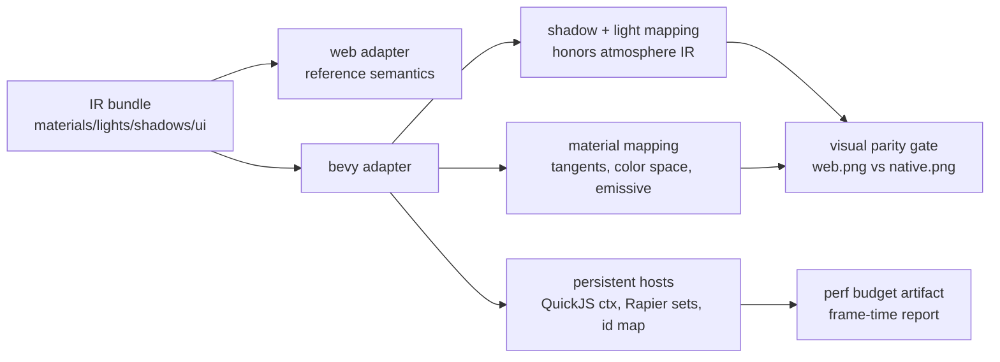
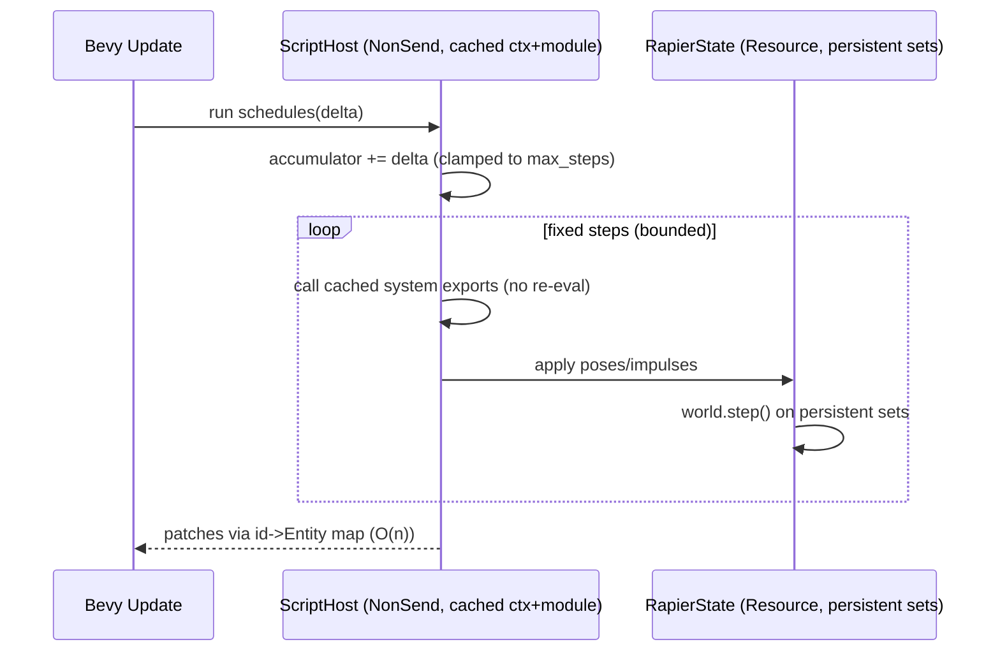

# PRD: Native Render Parity And Performance — Humanoid Physics Course Closure

`Planning Mode: Principal Architect`
`Complexity: 9 → HIGH mode`

Score basis: +3 touches 10+ files, +2 multi-package (packages/cli,
runtime-bevy, tools/verify, example content), +2 complex state (JS VM
lifecycle, physics world persistence, render change-detection), +2
cross-runtime visual contract changes.

## 1. Context

**Problem:** The native Bevy build of `examples/humanoid-physics-course`
renders visibly wrong versus the web Three.js reference (black wall, dead
emissive checkpoints, no drop shadow, washed-out lighting, absent HUD) and has
severe runtime performance problems, because the Bevy adapter misinterprets
several authored IR abstractions and executes multiple per-frame rebuild
anti-patterns.

**Reference evidence:**

- Web reference: `examples/humanoid-physics-course/artifacts/visual-parity/humanoid-web-bevy/web.png`
- Native capture showing the regressions: repo-root `image.png`
  (move to `examples/humanoid-physics-course/artifacts/visual-parity/humanoid-web-bevy/native.png` in Phase 0)

**Files Analyzed:**

- `packages/cli/src/native/bevy.ts` (native launch args)
- `runtime-bevy/Cargo.toml` (profiles)
- `runtime-bevy/crates/threenative_runtime/src/systems_host.rs` (QuickJS host,
  fixed-step accumulator)
- `runtime-bevy/crates/threenative_runtime/src/physics.rs` (Rapier stepping)
- `runtime-bevy/crates/threenative_runtime/src/rendering.rs` (atmosphere,
  shadow config, per-frame material normalization)
- `runtime-bevy/crates/threenative_runtime/src/assets.rs` (texture loading,
  texture controls, uv transform)
- `runtime-bevy/crates/threenative_runtime/src/map_world.rs` (lights,
  materials, meshes, bloom, camera)
- `runtime-bevy/crates/threenative_runtime/src/ui.rs` (HUD overlay)
- `runtime-bevy/crates/threenative_runtime/src/lib.rs` (system registration,
  script sync)
- `packages/runtime-web-three/src/rendering.ts`, `src/mapWorld.ts`
  (web semantics to match)
- `examples/humanoid-physics-course/content/**` and emitted
  `dist/humanoid-physics-course.bundle/**` (ground-truth IR)
- `docs/STATUS.md`, `docs/bevy-feature-parity.md` (declared parity claims)

**Current Behavior (root causes, verified with file:line evidence):**

Visual — authored abstractions the Bevy adapter drops or misreads:

- V1. Directional shadows are hardcoded off. The atmosphere sun sets
  `shadows_enabled: false` (`rendering.rs:180`) and the generic directional
  path does the same (`map_world.rs:1904`), even though the IR requests
  `shadows.enabled=true`, `sun.castsShadow=true`, `mapSize 2048`,
  `bias -0.0002`. `insert_shadow_markers` and per-mesh
  `castShadow/receiveShadow` are inert. Result: no player drop shadow, flat
  washed-out scene.
- V2. Authored scene lights are discarded under active atmosphere. When
  `atmosphere.active`, `light.key` (dir 4.6) and `light.ambient` (1.25) become
  empty `SpatialBundle`s (`map_world.rs:1877-1886`); only the atmosphere sun +
  ambient ~0.35-0.45 remain (`rendering.rs:167-170`, `396-399`). The wall face
  whose normal points away from the single sun receives ambient only and
  renders near-black — the black right wall. Web keeps the full lighting
  stack (`packages/runtime-web-three/src/rendering.ts:60-80`).
- V3. Emissive never glows. `emissive = linear(color) * intensity` peaks ~0.4
  for `mat.checkpoint` (`map_world.rs:2565-2570`, `2665-2671`), below the
  bloom prefilter threshold 0.88 (`map_world.rs:429-457`), then ACES at
  exposure 1.18 dulls it. Web renders emissive visibly self-lit
  (`mapWorld.ts:763-764`). Result: dull teal domes instead of glowing
  checkpoints.
- V4. No vertex tangents are ever generated (no `generate_tangents` call in
  the crate; procedural meshes insert only position/normal/uv —
  `map_world.rs:2414-2450`, `362-364`, `1191-1193`, `1264-1267`,
  `1400-1402`), while `add_material` sets `normal_map_texture`
  unconditionally (`map_world.rs:2583-2588`). In Bevy 0.14 a normal-mapped
  material on a tangent-less mesh fails the PBR pipeline → black/missing
  mesh (`mat.crate`).
- V5. Texture color space ignores roles. All textures load through one
  sRGB-default path (`assets.rs:144-146`); normal/metallic-roughness/
  occlusion maps must be linear. Web sets sRGB only for color/emissive maps
  (`mapWorld.ts:943`).
- V6. Per-texture `repeat` collapses to one transform. Bevy derives
  `uv_transform` from the base-color texture only and applies it to all slots
  (`map_world.rs:2533-2535`, `assets.rs:184-196`); web applies controls per
  texture (`mapWorld.ts:936`). Divergence for any material whose slots have
  differing repeats.
- V7. HUD renders static or not at all. UI text nodes spawn
  (`lib.rs:193-201`, `ui.rs:1168-1179`) but no system resolves
  `GameState` resource bindings/format strings into live `Text`, and the 2D
  overlay camera (`ui.rs:484-498`, `ClearColorConfig::None`) compositing over
  the HDR atmosphere camera is unverified — HUD absent in the native capture
  while STATUS.md:201/339/477-479 claim it promoted.

Performance — per-frame rebuild anti-patterns:

- P1. Debug build. `bevyRuntimeArgs` runs `cargo run` without `--release`
  (`packages/cli/src/native/bevy.ts:59-77`) and `runtime-bevy/Cargo.toml:10`
  has no `[profile.dev.package."*"] opt-level = 3`. Bevy/wgpu/rapier run
  10-50x slower unoptimized. This alone explains most of "native feels slow".
- P2. QuickJS VM rebuilt every schedule invocation.
  `run_native_system_schedules` re-reads `scripts.bundle.js` from disk
  (`systems_host.rs:298`), builds a new `Context` (`:305`), and re-evals the
  whole module (`:313`) — at least twice per frame, more per fixed step
  (`:210`, `:229-230`). Per system call, `call_system_export` re-evals the
  bridge source and does triple JSON round-trips (`:452-522`).
- P3. Rapier world rebuilt every fixed step. `step_rapier_bodies` constructs
  a fresh `PhysicsWorld` and recreates every body/collider from IR each step
  (`physics.rs:448-544`), discarding warm-start/contact state; writeback is
  O(n^2) (`physics.rs:184-191`).
- P4. Per-frame GPU re-uploads. `normalize_loaded_gltf_materials` iterates
  `materials.iter_mut()` every `Update` (`rendering.rs:414-427`) and
  `apply_loaded_texture_controls` calls `images.get_mut` every frame
  (`assets.rs:130-142`) — both mark assets modified and force bind-group /
  texture re-upload for every material and controlled texture every frame.
- P5. O(n^2) script sync. `sync_scripted_transforms` / `sync_scripted_materials`
  / UI text sync do linear `find` per entity per frame (`lib.rs:504-576`).
- P6. Unclamped fixed-step accumulator (`systems_host.rs:190-239`): a slow
  frame triggers more fixed steps, each paying P2+P3 → spiral of death.

Data drift (example-level, not adapter):

- D1. `assets.manifest.json` ships beige concrete texture sets
  (`tex.concrete.wall.*`, `tex.concrete.floor.*`) that no material
  references; walls/floor use the `ue-test-surface.png` grid. The intended
  art-directed look appears to be the concrete set. Per the visual-parity
  policy this is fixed in authored source, never by adapter tuning.

## 2. Solution

**Approach:**

- Fix the launch profile first (P1) — one-line-scale change, largest win,
  and a prerequisite for honest perf measurements in later phases.
- Make the Bevy adapter honor the authored IR contracts it currently drops:
  shadows from atmosphere config (V1), authored lights composing with
  atmosphere using the same semantics as web (V2), emissive luminance that
  reaches the configured bloom pipeline (V3), tangents + per-role color space
  so normal-mapped materials render (V4, V5), documented single-`uv_transform`
  limitation with a stable diagnostic when per-slot repeats diverge (V6), and
  live `GameState`-bound HUD text (V7). No screenshot-tuned constants; every
  change maps authored IR values through a documented shared contract.
- Replace per-frame rebuilds with persistent state: cached QuickJS context +
  evaluated module (P2), persistent Rapier sets (P3), change-detection-gated
  asset mutation (P4), a cached `id -> Entity` map (P5), and a clamped
  fixed-step catch-up (P6).
- Repair the example's texture-set drift in authored `content/**` (D1) so the
  same IR drives both runtimes.
- Close with a cross-runtime proof gate: side-by-side screenshots + a native
  frame-time budget artifact for this example, and update `docs/STATUS.md` +
  `docs/bevy-feature-parity.md` rows the fixes touch (required by repo rules).

**Architecture:**

**Key Decisions:**

- [ ] Match web semantics as the contract, not the screenshot: every mapping
      change references the corresponding web code path
      (`rendering.ts`, `mapWorld.ts`) and, where behavior is documented, the
      shared contract docs. No adapter-side color/intensity tuning to taste.
- [ ] Keep rapier3d used directly (no bevy_rapier migration in this PRD);
      persistence of `RigidBodySet`/`ColliderSet` in a Bevy `Resource` is the
      minimal fix.
- [ ] Keep the QuickJS engine choice; persist `Context` + module in a
      `NonSend` resource (QuickJS is not `Send`).
- [ ] `--release` for `tn ... --target desktop` launches, plus
      `[profile.dev.package."*"] opt-level = 3` so dev iterating stays usable.
- [ ] Emissive: map `emissive * emissiveIntensity` into HDR luminance using
      one documented shared conversion (new contract note in
      `docs/contracts/`), so authored intensity >= threshold produces bloom on
      both runtimes; do not lower the authored bloom threshold.
- [ ] V6 (per-slot uv transforms) is a documented limitation + compile-time
      diagnostic in this PRD, not a custom shader: Bevy 0.14
      `StandardMaterial` has a single `uv_transform`. Emit
      `TN-RENDER-UV-TRANSFORM-SLOT-MISMATCH` (warning) when a material's
      texture slots declare differing repeat/offset.

**Data Changes:** None to IR schemas. Example-only authored content edits in
`examples/humanoid-physics-course/content/` (D1). One new diagnostic code.

## 3. Sequence Flow

Script host after P2/P3 fixes (per frame):

## 4. Execution Phases

Ordering: perf P1 first (cheap, unblocks honest measurement), then visual
contract fixes (user-visible each phase), then deep perf, then example data +
proof gate.

#### Phase 0: Baseline evidence capture — a reproducible before-state exists

**Files (max 5):**

- `examples/humanoid-physics-course/artifacts/visual-parity/humanoid-web-bevy/native.png` — move repo-root `image.png` here
- `examples/humanoid-physics-course/artifacts/visual-parity/humanoid-web-bevy/notes.md` — symptom inventory with root-cause references (this PRD)

**Implementation:**

- [ ] Relocate the native capture next to `web.png`; delete repo-root `image.png`.
- [ ] Record the exact commands used to produce web and native captures so
      after-shots are apples-to-apples (same scene, camera, frame).
- [ ] Capture a native frame-time baseline (debug build) via the existing FPS
      overlay / `performance.json` evidence path and store it in the same folder.

**Verification Plan:**

- Evidence: both screenshots + baseline frame-time numbers committed under the
  artifact folder; notes list V1-V7/P1-P6/D1 with file:line references.

**User Verification:**

- Action: open `web.png` and `native.png` side by side.
- Expected: the documented symptoms are visible and enumerated in `notes.md`.

#### Phase 1: Release-mode native launch — native runs at release speed

**Files (max 5):**

- `packages/cli/src/native/bevy.ts` — add `--release` to `bevyRuntimeArgs`
  (with an escape hatch env/flag for debug runs)
- `runtime-bevy/Cargo.toml` — add `[profile.dev.package."*"] opt-level = 3`
- `packages/cli/src/native/bevy.test.ts` (or nearest existing test file) —
  cover args

**Implementation:**

- [ ] `cargo run -p threenative_runtime --release ...` as the default launch;
      honor an explicit debug opt-out (e.g. `TN_NATIVE_PROFILE=debug`).
- [ ] Dev-profile dependency optimization so debug launches remain usable.
- [ ] Re-capture native frame-time after the change (same method as Phase 0).

**Tests Required:**
| Test File | Test Name | Assertion |
|-----------|-----------|-----------|
| CLI native launch test | `should pass --release when building native runtime args by default` | args include `--release` |
| CLI native launch test | `should omit --release when debug profile is requested` | args exclude `--release` |

**User Verification:**

- Action: `tn playtest --project examples/humanoid-physics-course --target desktop ...`
- Expected: visibly smoother; frame-time artifact shows the improvement vs Phase 0 baseline.

#### Phase 2: Directional shadows honor IR — player has a real drop shadow

**Files (max 5):**

- `runtime-bevy/crates/threenative_runtime/src/rendering.rs` — atmosphere sun
  `shadows_enabled` from `sun.castsShadow && shadows.enabled`; wire mapSize
  (cap 2048), cascade count, bias from IR
- `runtime-bevy/crates/threenative_runtime/src/map_world.rs` — same for the
  non-atmosphere directional path (`:1904`); make `insert_shadow_markers` +
  per-mesh cast/receive flags effective (`NotShadowCaster`/`NotShadowReceiver`)
- `runtime-bevy/crates/threenative_runtime/src/conformance.rs` — extend the
  material/lighting conformance report with shadow-enabled observations

**Implementation:**

- [ ] Mirror web semantics: `sun.castShadow = profile.sun.castsShadow && profile.shadows.enabled`
      (`packages/runtime-web-three/src/rendering.ts:68`).
- [ ] Map `shadows.mapSize` -> `DirectionalLightShadowMap.size`,
      `bias` -> `shadow_depth_bias` equivalent, cascades from `cascadeCount`.
- [ ] Entities with `castShadow:false` / `receiveShadow:false` get the Bevy
      opt-out markers.

**Tests Required:**
| Test File | Test Name | Assertion |
|-----------|-----------|-----------|
| runtime-bevy conformance/unit test | `should enable directional shadows when atmosphere IR requests them` | mapped light has `shadows_enabled == true`, map size 2048 |
| runtime-bevy conformance/unit test | `should keep shadows disabled when shadows.enabled is false` | `shadows_enabled == false` |

**User Verification (manual, visual):**

- Action: native screenshot of the course.
- Expected: soldier casts a soft drop shadow comparable to `web.png`.

#### Phase 3: Authored lights compose with atmosphere — the black wall is lit

**Files (max 5):**

- `runtime-bevy/crates/threenative_runtime/src/map_world.rs` — stop discarding
  authored `Light` entities under active atmosphere (`:1877-1886`); apply the
  same composition rule the web runtime uses
- `runtime-bevy/crates/threenative_runtime/src/rendering.rs` — ambient
  composition (atmosphere ambient + authored ambient) per web semantics
- `runtime-bevy/crates/threenative_runtime/src/conformance.rs` — light-count/
  intensity observations for the conformance trace

**Implementation:**

- [ ] Read the exact web behavior first (`rendering.ts` + `mapWorld.ts` light
      paths) and implement the identical rule; if web also suppresses some
      authored lights under atmosphere, replicate that and fix the wall via
      the (already correct on web) surviving light set. The contract is
      "same inputs -> same lit set", not "make the wall brighter".
- [ ] Verify intensity unit conversions (`THREE_COMPAT_*`,
      `map_world.rs:2115-2137`) still hold for the re-enabled lights against
      the existing calibration gate (`pnpm verify:v10:visual-calibration`).

**Tests Required:**
| Test File | Test Name | Assertion |
|-----------|-----------|-----------|
| runtime-bevy conformance | `should map authored directional and ambient lights when atmosphere is active` | lit-entity report matches web conformance fixture |

**User Verification (manual, visual):**

- Action: native screenshot.
- Expected: both walls read as the same material; no black wall.

#### Phase 4: Material correctness — tangents + texture color space; the crate renders

**Files (max 5):**

- `runtime-bevy/crates/threenative_runtime/src/map_world.rs` — generate
  tangents (`mesh.generate_tangents()`) for any mesh paired with a
  normal-mapped material (procedural builders + `custom_mesh`)
- `runtime-bevy/crates/threenative_runtime/src/assets.rs` — per-role loading:
  color/emissive sRGB, normal/metallic-roughness/occlusion linear
  (`is_srgb=false`), matching `mapWorld.ts:943`
- `runtime-bevy/crates/threenative_runtime/src/conformance.rs` — texture-role
  color-space observations

**Implementation:**

- [ ] Track which texture asset IDs are referenced by non-color slots at
      map time; load those linear.
- [ ] Generate tangents once at mesh build (never per frame); log/diagnostic
      if generation fails (missing UVs).
- [ ] Emit `TN-RENDER-UV-TRANSFORM-SLOT-MISMATCH` warning when a material's
      slots declare differing repeat/offset (V6) and document the single
      `uv_transform` limitation in `docs/bevy-feature-parity.md` (done in
      Phase 8 docs pass).

**Tests Required:**
| Test File | Test Name | Assertion |
|-----------|-----------|-----------|
| runtime-bevy unit | `should generate tangents when material has a normal map` | mesh has `ATTRIBUTE_TANGENT` |
| runtime-bevy unit | `should load normal and roughness textures as linear` | image `is_srgb == false` |
| runtime-bevy unit | `should warn when texture slots declare mismatched uv repeats` | diagnostic code emitted |

**User Verification (manual, visual):**

- Action: native screenshot framing a crate.
- Expected: crate shows plank texture with normal detail, not black.

#### Phase 5: Emissive reaches bloom — checkpoint domes glow like web

**Files (max 5):**

- `runtime-bevy/crates/threenative_runtime/src/map_world.rs` — emissive
  mapping via the shared conversion (`emissive_color`, `:2665-2671`), keep
  bloom settings sourced from runtime config unchanged
- `docs/contracts/` (new or existing rendering contract doc) — document the
  emissive luminance conversion both runtimes implement
- `packages/runtime-web-three/src/mapWorld.ts` — only if the web side needs
  to adopt the same documented conversion (keep semantics identical)

**Implementation:**

- [ ] Define the conversion once (contract doc): authored
      `emissive * emissiveIntensity` -> HDR linear luminance such that the
      same authored values that visibly glow on web exceed the authored bloom
      threshold natively. This is a shared contract change, not native tuning.
- [ ] Preserve the `uses_unlit_emissive_display` special case behavior.
- [ ] Extend `trace_native_emissive_bloom` (`map_world.rs:479-527`) so the
      emissive-bloom verify gate (`pnpm verify:v10:emissive-bloom`) covers the
      checkpoint material values.

**Tests Required:**
| Test File | Test Name | Assertion |
|-----------|-----------|-----------|
| runtime-bevy conformance | `should map checkpoint emissive above bloom prefilter threshold` | emissive luminance > 0.88 for `mat.checkpoint` inputs |
| tools/verify emissive gate | existing gate re-run | web/native emissive reports agree |

**User Verification (manual, visual):**

- Action: native screenshot of checkpoint pads.
- Expected: cyan domes glow with bloom, matching `web.png`.

#### Phase 6: Persistent script host + bounded fixed step — smooth frame pacing

**Files (max 5):**

- `runtime-bevy/crates/threenative_runtime/src/systems_host.rs` — cache
  QuickJS `Context` + evaluated module + bridge in a `NonSend` resource;
  read `scripts.bundle.js` once; clamp accumulator catch-up (max steps)
- `runtime-bevy/crates/threenative_runtime/src/lib.rs` — host resource
  initialization/registration

**Implementation:**

- [ ] One `Context` per process; eval module + bridge once; per-call invoke
      cached exports.
- [ ] Keep the JSON snapshot interface initially (correctness first); note
      binding-based transfer as follow-up.
- [ ] `MAX_FIXED_STEPS_PER_FRAME` clamp (mirror the web runtime's accumulator
      policy if it has one; otherwise document the chosen bound).

**Tests Required:**
| Test File | Test Name | Assertion |
|-----------|-----------|-----------|
| runtime-bevy unit | `should reuse the script context across schedule invocations` | same context identity/count of module evals == 1 |
| runtime-bevy unit | `should clamp fixed-step catch-up when delta spikes` | steps run <= max bound |
| conformance | `pnpm verify:conformance` | native system traces unchanged vs fixtures |

**User Verification:**

- Action: native run; compare frame-time artifact vs Phase 1.
- Expected: large frame-time drop; no behavior change in playtest scenarios.

#### Phase 7: Persistent physics world + O(n) sync — stable simulation cost

**Files (max 5):**

- `runtime-bevy/crates/threenative_runtime/src/physics.rs` — persist
  `RigidBodySet`/`ColliderSet` across steps in a resource; rebuild only on
  world-structure changes; replace O(n^2) writeback with an id->index map
- `runtime-bevy/crates/threenative_runtime/src/lib.rs` — cached
  `id -> Entity` map for `sync_scripted_transforms` / `sync_scripted_materials`
  / UI text sync; only write transforms that changed

**Implementation:**

- [ ] Persistent Rapier state keyed by entity id; apply script poses as
      kinematic targets instead of rebuild.
- [ ] Preserve existing semantics that conformance fixtures encode (character
      controller `Collider.center` handling, kinematic velocity rules — see
      shared physics contract notes).
- [ ] Build the id map once at world map time; maintain on spawn/despawn.

**Tests Required:**
| Test File | Test Name | Assertion |
|-----------|-----------|-----------|
| runtime-bevy unit | `should reuse rigid body sets across fixed steps` | body handles stable across steps |
| runtime-bevy unit | `should write back simulated poses via id map` | no linear scan; poses match previous implementation on fixture |
| conformance | `pnpm verify:conformance` | physics traces match fixtures (contact/warm-start deltas within documented tolerance; update fixtures only with evidence) |

**User Verification:**

- Action: run the committed playtest scenarios
  (`playtests/humanoid-course-forward-movement`, camera orbit).
- Expected: identical movement/collision behavior; frame-time artifact improves again.

#### Phase 8: Asset change-detection + docs — no per-frame GPU re-uploads

**Files (max 5):**

- `runtime-bevy/crates/threenative_runtime/src/rendering.rs` — run
  `normalize_loaded_gltf_materials` on `AssetEvent<StandardMaterial>`/load
  events only
- `runtime-bevy/crates/threenative_runtime/src/assets.rs` — run
  `apply_loaded_texture_controls` once per texture on load, then stop
- `docs/STATUS.md`, `docs/bevy-feature-parity.md` — update shadow/lighting/
  emissive/uv-transform/HUD rows changed by Phases 2-5 (repo rule for
  capability changes)

**Implementation:**

- [ ] Gate both systems with change detection / one-shot completion markers.
- [ ] Docs: shadows enabled natively, light composition rule, emissive
      contract link, `TN-RENDER-UV-TRANSFORM-SLOT-MISMATCH`, HUD binding
      status (after Phase 9).

**Tests Required:**
| Test File | Test Name | Assertion |
|-----------|-----------|-----------|
| runtime-bevy unit | `should not mark materials modified when nothing loaded` | no `Assets` mutation after settle frame |
| docs gate | `pnpm check:docs` | passes |

**User Verification:**

- Action: frame-time artifact re-capture.
- Expected: render-prepare cost drops; visuals unchanged vs Phase 5 screenshot.

#### Phase 9: Live HUD on native — "CP 0/2 Hits 0" updates during play

**Files (max 5):**

- `runtime-bevy/crates/threenative_runtime/src/ui.rs` — resolve resource
  bindings + format strings (`CP {checkpoint}/{checkpointTotal} ...`) into
  `Text` each time bound `GameState` changes; verify/fix overlay `Camera2d`
  compositing over the HDR main camera
- `runtime-bevy/crates/threenative_runtime/src/lib.rs` — register the binding
  system

**Implementation:**

- [ ] Reuse the binding/format semantics the web runtime implements for
      retained HUD (same format-string grammar).
- [ ] Fix overlay ordering/HDR interaction so the 2D UI camera composites
      over the atmosphere camera (root suspicion for full absence).
- [ ] Emit an explicit diagnostic for unsupported binding kinds instead of
      silently rendering placeholders.

**Tests Required:**
| Test File | Test Name | Assertion |
|-----------|-----------|-----------|
| runtime-bevy unit | `should format GameState bindings into HUD text` | text == "CP 1/2 Hits 0 ..." for fixture state |
| runtime-bevy unit | `should render UI overlay camera above HDR main camera` | camera order/composite config asserted |

**User Verification (manual, visual):**

- Action: native playtest crossing a checkpoint.
- Expected: HUD visible and counter increments, matching web behavior.

#### Phase 10: Example data repair + parity proof gate — the course looks the same on both runtimes

**Files (max 5):**

- `examples/humanoid-physics-course/content/materials/arena.materials.json` —
  point wall/floor/edge materials at the intended concrete texture sets (D1),
  via `tn material`/direct JSON per the sanctioned fallback
- `examples/humanoid-physics-course/content/assets/arena.assets.json` — drop
  or repurpose now-unreferenced grid texture entries
- `tools/verify/src/**` (one focused gate) — side-by-side web/native
  screenshot + frame-time budget check for this example, wired into the
  existing visual-parity gate family
- `examples/humanoid-physics-course/artifacts/visual-parity/humanoid-web-bevy/`
  — refreshed `web.png` / `native.png` / `notes.md` / perf artifact

**Implementation:**

- [ ] Rebuild (`tn build`), re-validate (`tn authoring validate`), re-run
      committed playtests.
- [ ] Capture final side-by-side; store frame-time report against a stated
      budget (e.g. 16.6ms p95 on the dev machine — record hardware).
- [ ] Do NOT tune adapter values to close residual pixel differences; residuals
      go into `notes.md` with owner (adapter contract vs authored data).

**Tests Required:**
| Test File | Test Name | Assertion |
|-----------|-----------|-----------|
| tools/verify gate | `humanoid-course visual parity` | nonblank + structural-similarity checks pass for both captures |
| tools/verify gate | `humanoid-course native perf budget` | frame-time p95 within budget |
| example | `tn game qa --project . --run-proof --json` | passes |

**User Verification (manual, visual):**

- Action: open final side-by-side artifact.
- Expected: same material read on walls/floor, glowing checkpoints, drop
  shadow, HUD present, no black surfaces; native runs smoothly.

## 5. Checkpoint Protocol

HIGH complexity: after every phase, spawn `prd-work-reviewer` with this PRD
path and the phase number; proceed only on PASS. Phases 2, 3, 4, 5, 9, 10 also
require the manual visual checkpoint (screenshot inspection) in addition to
the automated review — this is exactly the class of work where "code merged"
and "pixels correct" diverge.

## 6. Verification Strategy

- Narrowest first per phase (unit tests in `runtime-bevy`, CLI arg tests),
  then `pnpm verify:conformance` for every phase that touches shared runtime
  contracts (2, 3, 5, 6, 7, 9), then the example proof loop
  (`tn scene proof`, committed playtests), then the new parity + perf gate
  (Phase 10). `pnpm verify:smoke` before each checkpoint; `pnpm verify:pre-push`
  before push.
- Perf evidence is longitudinal: the same frame-time capture method from
  Phase 0 is re-run at Phases 1, 6, 7, 8 and committed, so each perf fix has
  attributable numbers instead of "feels faster".
- Physics/scripting refactors (6, 7) must not change behavior: committed
  playtest scenarios and conformance fixtures are the regression net; fixture
  updates require recorded justification.

## 7. Acceptance Criteria

- [ ] All 11 phases complete with passing checkpoints.
- [ ] Native launch defaults to release profile; debug opt-out documented.
- [ ] Native screenshot of humanoid-physics-course shows: lit walls (no black
      faces), drop shadow under the soldier, glowing checkpoint/hazard
      emissives, textured crate with normal detail, live HUD — side-by-side
      with web within the parity gate's thresholds.
- [ ] Frame-time artifact shows p95 within budget and the per-phase
      improvement trail is committed.
- [ ] No per-frame: script module eval, physics world rebuild, `Assets`
      mutation without change, O(n^2) entity scans (asserted by tests).
- [ ] `pnpm verify` and `pnpm verify:conformance` pass.
- [ ] `docs/STATUS.md` and `docs/bevy-feature-parity.md` updated for every
      capability row the fixes change; new diagnostic documented.
- [ ] No adapter values tuned to match screenshots; all visual changes trace
      to IR values through documented shared contracts.
