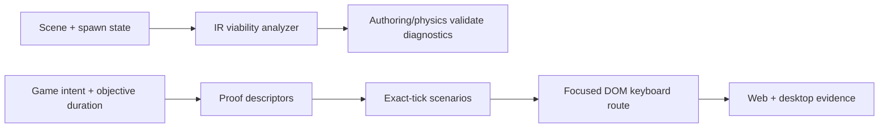

# PRD-001: Flight Viability and Realistic Proof

`Complexity: 8 -> HIGH mode` (`+3` 10+ files, `+2` complex harness state,
`+2` multi-package, `+1` release-gate change)

## 1. Context

**Problem:** Valid aerodynamic data can describe a vehicle that cannot sustain
flight, while short programmatic-input scenarios can still certify it.

**Files analyzed:** `packages/ir/src/physicsValidation.ts`,
`packages/authoring/src/operations/physics.ts`,
`packages/runtime-web-three/src/physicsAerodynamics.test.ts`,
`packages/runtime-web-three/src/browser/main.ts`,
`packages/cli/src/commands/playtestScenario.ts`,
`packages/cli/src/commands/playtestScaffold.ts`,
`packages/cli/src/game/intentContract.ts`,
`templates/_shared/skills/threenative-verify/SKILL.md`.

**Current behavior:**

- Aerodynamic validation checks structure and ranges, not force balance.
- The AoA sign bug has an independent physical-direction regression and is not
  part of this PRD.
- `holdTicks`/`waitTicks` provide exact simulation timing and are not part of
  this PRD.
- Browser playtests dispatch input on `window`, bypassing real iframe focus.
- The planner does not derive a scenario duration from the objective or enroll
  generic flight sign/force probes.

## 2. Solution

**Approach:**

- Add one pure, adapter-independent aerodynamic viability analyzer beside the
  owning IR validation contract.
- Project its findings through existing authoring validation and the
  descriptor-backed `tn physics aerodynamics validate` operation.
- Add an explicit focus-realistic web input mode that drives the focused
  browser surface with real DOM keyboard routing.
- Derive objective-duration and flight diagnostic scenarios from the plan
  intent/acceptance owner, using exact ticks.

**Key decisions:**

- The analyzer reports conservative diagnostics; it is not a full flight
  simulator.
- Curve sampling and force equations reuse the physical kernel or shared pure
  math extracted from it. Adapters must not own duplicate formulas.
- Focus realism is an explicit scenario/proof mode because native injection
  and deterministic headless tests still need direct input.
- Durations and proof roles live in intent/proof descriptors, not a second
  genre keyword list.

**Data changes:** Add versioned optional plan/scenario fields for objective
duration and input delivery mode. Existing scenarios retain current behavior.

## 3. Integration points

- [x] Entry points: `tn authoring validate`, `tn physics aerodynamics validate`,
  `tn playtest --scenario`, `tn game plan`, and plan-derived proof scaffolding.
- [x] Callers: authoring physics operation, CLI playtest driver, game intent
  contract, proof-template descriptor registry, iterate/release gates.
- [x] Registration: extend existing operation and proof descriptors.
- [x] User-facing: CLI diagnostics and generated proof; no editor UI required.

**Full user flow:** An author validates a flight scene, receives force-balance
diagnostics before build, generates plan-derived scenarios, and proves the
objective duration plus keyboard focus/control signs on web and behavior on
desktop.

## 4. Execution phases

### Phase 1: Aerodynamic spawn-state analysis

**Planner/scaffold files (max 5):**

- `packages/ir/src/aerodynamicViability.ts` - pure owned analyzer.
- `packages/ir/src/aerodynamicViability.test.ts` - numeric fixtures.
- `packages/ir/src/physicsValidation.ts` - invoke and normalize diagnostics.
- `packages/authoring/src/operations/physics.ts` - supply entity/body/spawn data.
- `packages/authoring/src/aerodynamicsOperations.test.ts` - public boundary.

**Implementation:**

- [x] Compute weight, lift and drag at declared spawn velocity/orientation.
- [x] Compute available thrust versus drag at declared cruise speed.
- [x] Report rigid-body damping combined with authored aerodynamic drag.
- [x] Sum baseline surface force moments and flag materially untrimmed stowed
  controls.
- [x] Emit stable codes, paths, measured values, thresholds, and fixes.
- [x] Return `not-applicable` rather than guessing when required state is absent.

**Tests required:**

| Test | Assertion |
| --- | --- |
| `should reject lift below weight at spawn` | Diagnostic includes lift, weight, path, and fix. |
| `should reject thrust below cruise drag` | Diagnostic identifies the limiting budget. |
| `should warn on double-counted damping` | Warning is deterministic and bounded. |
| `should report stowed trim moment` | Surface IDs and moment axis are present. |
| `should accept the stable flight fixture` | No viability error is emitted. |

**Verification:** Run IR and authoring focused tests, then validate both a
known-stable and deliberately impossible scene.

### Phase 2: Focus-realistic input delivery

**Files (max 5):**

- `packages/cli/src/commands/playtestScenario.ts` - versioned delivery mode.
- `packages/cli/src/commands/playtestSchema.ts` - schema/help.
- `packages/cli/src/commands/playtest.ts` - route web focus mode.
- `packages/runtime-web-three/src/browser/main.ts` - focused-surface hook.
- `packages/cli/src/commands/playtest.test.ts` - positive/negative integration.

**Implementation:**

- [x] Add `inputDelivery: "deterministic" | "focused-dom"` with deterministic
  default.
- [x] In focused mode, focus the preview/overlay surface and send actual
  `KeyboardEvent.code` transitions through the browser path.
- [x] Fail with an actionable diagnostic on desktop/headless targets that
  cannot provide this mode.
- [x] Prove pointer and none overlays forward input; prove a deliberately
  keyboard-capturing overlay causes the negative control to fail.

**Verification:** Focused CLI tests plus one Playwright scenario with overlay
focus. Manual checkpoint: interact with the same scenario in a visible browser.

### Phase 3: Objective-duration and flight proof descriptors

**Files (max 5):**

- `packages/cli/src/game/intentContract.ts` - duration/proof responsibilities.
- `packages/cli/src/game/intentContract.test.ts` - genre and duration cases.
- `packages/cli/src/commands/playtestScaffold.ts` - descriptor-derived scenarios.
- `packages/cli/src/commands/playtestScaffold.test.ts` - generated proof.
- `docs/cookbook/flight-diagnostic-probes.md` - reusable author flow.

**Plan-transport files (max 5):**

- `packages/cli/src/commands/game.ts` and `gamePlanTypes.ts` - carry the
  plan-owned duration/proof descriptor.
- `packages/cli/src/commands/playtestScenario.ts` - validate the reusable
  aerodynamic assertion contract.

**Observation-evaluation files (max 5):**

- `packages/cli/src/commands/playtestAssertions.ts`,
  `playtestAssertions.test.ts`, `playtest.ts`, and `playtest.test.ts` - capture
  per-step evidence and evaluate finite force telemetry, discovered control
  surfaces, and opposing downstream torque at the real playtest boundary.

**Reference-project files (max 5):**

- `examples/battle-of-pacific/content/scenes/arena.scene.json` - source-owned
  retry proof state.
- `examples/battle-of-pacific/playtests/acceptance-flight-*.playtest.json` -
  committed duration, sign, and force-trace scenarios.
- `examples/battle-of-pacific/playtests/acceptance-retry-path.playtest.json` -
  committed failure-to-recovery scenario.

**Implementation:**

- [x] Derive objective duration from explicit goal/plan data; ambiguity must
  produce a diagnostic, not an invented duration.
- [x] Generate hands-off cruise for the full objective duration.
- [x] Generate pitch and roll sign/safety probes and a stepped force-trace probe.
- [x] Use `holdTicks`/`waitTicks`, real project IDs, and transition assertions.
- [x] Emit unsupported diagnostics when flight metadata or observation support
  is missing.

**Verification:** Planner/scaffold tests, `pnpm verify:cookbook`, and generated
web/desktop scenarios for the aerodynamics reference project.

### Phase 4: Release-gate and documentation closure

**Files (max 5):**

- `tools/verify/src/generatedGameQualityGate.ts` - duration/focus enrollment.
- `tools/verify/src/generatedGameQualityGate.test.ts` - false-green controls.
- `docs/status/capabilities/physics.md` - viability boundary/evidence.
- `docs/status/capabilities/tooling-proof.md` - proof modes/evidence.
- `docs/STATUS.md` - one-line index updates.

**Implementation:**

- [ ] Require one objective-duration scenario for objective-driven games.
- [ ] Require one focus-realistic web proof when a web overlay accepts input.
- [ ] Keep direct deterministic input as the cross-target conformance lane.
- [ ] Add capability and quality-status notes if new systemic debt is found.

## 5. Checkpoints and acceptance

After every phase, spawn `prd-work-reviewer` with this PRD path and phase
number. Phases 2 and 3 also require manual visible-browser review.

- [ ] Impossible flight configurations fail at author time with measured fixes.
- [ ] A stable configuration passes without adapter-specific exceptions.
- [ ] A real focus failure is caught by a committed scenario.
- [ ] Objective duration, axis signs, and force trace are plan-derived.
- [ ] Web and desktop scenario evidence passes.
- [ ] `pnpm verify:conformance`, `pnpm verify:cookbook`, `pnpm check:docs`, and
  the generated-game quality gate pass.

## Verification evidence

Append per-phase commands, outputs, and artifact paths here during execution.

- Phase 1 (2026-07-24): `pnpm --filter @threenative/ir test` passed
  429/429; focused aerodynamic analyzer tests passed 14/14; authoring
  aerodynamic operation tests passed 3/3; runtime aerodynamic tests passed
  7/7. `tn authoring validate` passed for both
  `examples/aerodynamics-flight-course` and `examples/battle-of-pacific`.
  Full web-runtime verification reached 561/564 with three unrelated concurrent
  ocean-shader assertion mismatches. `pnpm verify:conformance` reached the V9
  rendering-lights comparison before failing on the concurrent rendering
  branch; the focused advanced-aerodynamics gate also reported integrated
  maneuver parity failures while all shared-kernel unit boundaries remained
  green. The required independent Phase 1 review completed clean after
  zero-density, force-cap, supported-launch, terminal-speed, and direction
  false-green controls were added.
- Phase 2 (2026-07-24): CLI focused tests passed 51/51 and web overlay tests
  passed 10/10, including explicit `none`/`pointer` forwarding and
  `pointer-and-keyboard` capture. A fresh visible-browser checkpoint loaded
  Battle of Pacific with one canvas and one React overlay, runtime ready, and
  the focus hook installed. The committed focused-DOM Battle scenario passed
  all 6 assertions with zero playtest diagnostics at
  `examples/battle-of-pacific/artifacts/playtest/acceptance-input-caused-action/2026-07-24T09-52-46-534Z`.
  The browser check also caught and closed an eager Node-only IR root import
  regression by routing runtime values through browser-safe IR subpaths. The
  required independent Phase 2 review completed clean.
- Phase 3 (2026-07-24): focused planner/scaffold/assertion/playtest tests
  passed 86/86.
  Explicit
  `45 seconds` normalized to 2,700 fixed ticks; missing and conflicting
  durations emitted stable diagnostics. A source-backed flight fixture
  generated duration, pitch, roll, and stepped force-trace scenarios using its
  real entity, resource, and axis bindings across multiple source documents;
  missing duration or safety observations failed without publishing partial
  files. The full `pnpm verify:cookbook` gate passed with
  `TN_COOKBOOK_GATE_OK`. Battle of Pacific web evidence passed for the exact
  1,800-tick cruise, bidirectional pitch sign, bidirectional roll sign, and
  four-sample force trace with `FlightState.stall === false`, discovered
  surface IDs, both input signs, neutral-relative opposing downstream
  aerodynamic torque, per-step no-stall state, finite aero vectors, and zero
  diagnostics. Same-direction torque and recovered transient-stall controls
  fail in focused tests. The final pitch and roll evidence is under
  `2026-07-24T10-39-37-993Z` and `2026-07-24T10-40-26-429Z` respectively.
  Native per-step resource capture has focused integration coverage; the
  bidirectional pitch scenario passed all five assertions in the graphical
  Bevy harness under Xvfb at `2026-07-24T10-45-22-059Z`. The force trace also
  passed all four assertions in the same harness at
  `examples/battle-of-pacific/artifacts/playtest/acceptance-flight-force-trace/2026-07-24T10-35-08-218Z`.
  The plan-derived Battle retry scenario began at its source-declared failure
  position, observed `DITCHED`, delivered `KeyR`, then observed `CRUISE`, an
  incremented `retryCount`, and restored no-stall state at
  `2026-07-24T10-51-02-820Z`.
  The required independent Phase 3 review reran the CLI build and all four
  focused suites (86/86), inspected the labeled artifact samples, and returned
  clean.
  A fresh visible-browser checkpoint separately confirmed focused pitch/roll
  input while the aircraft remained in `CRUISE`, integrity 100, and
  `stall: false`; the aircraft advanced from z=-7.18 to z=-13.15 and a
  screenshot was retained as `battle-flight-probes-phase3.png`.
