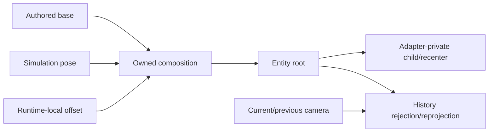

# PRD-002: Runtime Transform and Temporal Ownership

`Complexity: 9 -> HIGH mode` (`+3` 10+ files, `+2` new layered transform
contract, `+2` complex temporal state, `+2` multi-package)

## 1. Context

**Problem:** Authored transforms, runtime cosmetic offsets, camera-relative
objects, and temporal history currently compete for the same final pose, causing
replacement, ping-pong, or whole-frame smear.

**Files analyzed:** `packages/runtime-web-three/src/systems/effects.ts`,
`packages/runtime-web-three/src/mapWorld.ts`,
`packages/runtime-web-three/src/worldMapping/oceanWater.ts`,
`packages/runtime-web-three/src/render.ts`,
`runtime-bevy/crates/threenative_runtime/src/motion_blur_postprocess.rs`,
`runtime-bevy/crates/threenative_runtime/src/motion_blur_postprocess.wgsl`.

**Current behavior:**

- Partial Transform patches preserve omitted fields but replace a supplied
  position or rotation.
- Per-frame transform sync reapplies the entity root pose.
- The current ocean avoids recenter conflict with a large fixed plane; it does
  not solve camera-relative ownership.
- Web and native motion blur blend same-UV history, so camera translation
  smears the entire frame.
- Universal wrapping of special web objects is already planned in the Pacific
  mastery PRD and is not duplicated here.

## 2. Solution

- Add an explicit layered transform contract: authored base, simulation pose,
  and bounded runtime-local/cosmetic offset.
- Define which layers scripts may mutate and how composition/order work.
- Give camera-relative internals an owned child/local-offset path rather than
  competing writes to the entity root.
- Add camera-history rejection/reprojection so motion blur preserves intended
  temporal effects without translating the whole previous frame.

**Data changes:** Versioned optional transform-layer metadata and/or a bounded
script command. Raw adapter handles and arbitrary transform-sync opt-out remain
unsupported.

## 3. Integration points

- [x] Entry: structured Transform data and `ctx.entity(...).transform()`.
- [x] Callers: compiler validation, web system effects/sync, Bevy script
  effects/reconciliation, animation/physics transform writers, render history.
- [x] User-facing: script API and diagnostics; no new visual UI.

**Full user flow:** An author keeps the model's authored orientation, applies a
cosmetic bank/recenter through a documented layer, and sees stable web/native
poses and camera-safe temporal rendering.

## 4. Execution phases

### Phase 1: Versioned transform-layer contract

**Files (max 5):**

- `packages/ir/src/types.ts` - contract types.
- `packages/ir/src/validation.ts` - supported fields and diagnostics.
- `packages/script-stdlib/src/script-context.ts` - typed bounded API.
- `packages/compiler/src/scripts/diagnostics.ts` - portable contract diagnostics.
- `packages/ir/src/transformLayers.test.ts` - composition truth table.

**Implementation:**

- [ ] Specify `final = authoredBase * simulation * cosmeticLocal` order for
  translation, quaternion rotation, and scale.
- [ ] Separate runtime-local offsets from durable authored values.
- [ ] Reject unknown layers, non-finite values, and writes from undeclared
  systems.
- [ ] Define animation/physics ownership and conflict diagnostics.

### Phase 2: Web and native execution parity

**Files (max 5):**

- `packages/runtime-web-three/src/systems/effects.ts` - layered commands.
- `packages/runtime-web-three/src/mapWorld.ts` - composition/sync owner.
- `packages/runtime-web-three/src/systems/context.test.ts` - web cases.
- `runtime-bevy/crates/threenative_runtime/src/systems_effects.rs` - native.
- `runtime-bevy/crates/threenative_runtime/tests/systems_host.rs` - native cases.

**Implementation:**

- [ ] Apply every layer exactly once per fixed update.
- [ ] Preserve authored base across script updates and animation state changes.
- [ ] Produce matching conflict/missing-declaration diagnostics.
- [ ] Keep ordinary Transform patch semantics backward compatible.

**Verification:** Shared fixture asserts exact composed matrices/quaternions,
reset behavior, and conflict errors across adapters.

### Phase 3: Camera-relative child ownership

**Files (max 5):**

- `packages/runtime-web-three/src/worldMapping/oceanWater.ts` - inner recenter.
- `packages/runtime-web-three/src/worldMapping/oceanWater.test.ts` - no ping-pong.
- `packages/runtime-web-three/src/mapWorld.test.ts` - root/child sync.
- `runtime-bevy/crates/threenative_runtime/src/map_world.rs` - native policy.
- `packages/ir/fixtures/conformance/transform-layers/world.ir.json` - fixture.

**Implementation:**

- [ ] Recenter only an adapter-private inner object or declared local layer.
- [ ] Never mutate the same root pose from render and transform sync.
- [ ] Prove authored root position is stable over consecutive frames.
- [ ] Enroll another cosmetic child use besides water before promotion.

### Phase 4: Camera-safe temporal history

**Files (max 5):**

- `packages/runtime-web-three/src/render.ts` - camera-aware history policy.
- `packages/runtime-web-three/src/render.test.ts` - web negative controls.
- `runtime-bevy/crates/threenative_runtime/src/motion_blur_postprocess.rs` - uniforms/state.
- `runtime-bevy/crates/threenative_runtime/src/motion_blur_postprocess.wgsl` - rejection/reprojection.
- `tools/verify/src/motionBlurParity.ts` - paired visual gate.

**Implementation:**

- [ ] Define intended object/camera motion behavior before choosing rejection
  versus depth/velocity reprojection.
- [ ] Reset history on cuts, resize, projection change, and large camera deltas.
- [ ] Add static-camera moving-object positive control and translating-camera
  static-world negative control.
- [ ] Record comparable web/native visual metrics; do not widen tolerances.

### Phase 5: Public guidance and status

**Files (max 5):**

- `docs/workflows/conventions.md` - composition and ownership.
- `docs/cookbook/cosmetic-transform-layers.md` - executable examples.
- `docs/status/capabilities/scripting.md` - API boundary.
- `docs/status/capabilities/rendering.md` - temporal boundary/evidence.
- `docs/STATUS.md` - one-line updates.

## 5. Checkpoints and acceptance

Automated `prd-work-reviewer` after every phase. Manual side-by-side visual
review is additionally required for Phases 3 and 4.

- [ ] Authored rotation survives repeated runtime cosmetic changes.
- [ ] Web/native composition fixtures match.
- [ ] Camera-relative objects do not ping-pong with root sync.
- [ ] Camera translation does not smear a static world.
- [ ] Intended moving-object temporal effect remains observable.
- [ ] Cookbook, docs, conformance, and visual gates pass.

## Verification evidence

Append phase evidence during implementation.
