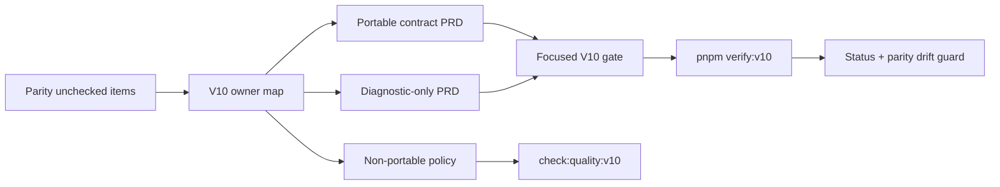
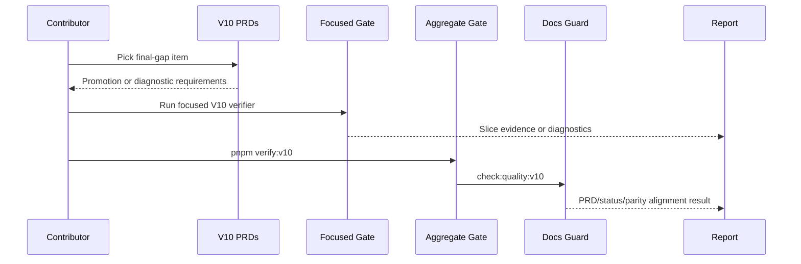

# V10-01 Scope, Triage, and Release Gate

Complexity: 8 -> HIGH mode

Score basis: +3 touches 10+ implementation/test/docs files during future
execution, +2 spans SDK/IR/compiler/web/Bevy/CLI/docs verification, +2 adds an
aggregate final-gap gate and drift policy, +1 affects release-gate behavior.

## Context

**Problem:** After V9, the parity tracker is close to full practical coverage
but still mixes promotable final gaps, advanced renderer/physics features,
platform packaging work, and intentionally non-portable boundaries.

**Files Analyzed:**

- `docs/bevy-feature-parity.md`
- `docs/STATUS.md`
- `docs/PRDs/v9/README.md`
- `docs/PRDs/v9/V9-04-rendering-lights-post-processing-parity.md`
- `docs/PRDs/v9/V9-05-input-ui-accessibility-parity.md`
- `docs/PRDs/v9/V9-06-audio-persistence-tooling-support.md`
- `docs/PRDs/v9/V9-07-engine-quality-control-hardening.md`
- `package.json`
- `scripts/verify-conformance.mjs`

**Current Behavior:**

- V9 has focused implemented gates and an aggregate quality-control front door.
- The remaining unchecked checklist items are concentrated in advanced
  rendering/materials, animation residuals, dynamic mesh colliders, retained UI
  residuals, editor tooling, production packaging, cloud/online boundaries, and
  custom extension points.
- Some V9 PRDs already defer these items, but the parity tracker does not yet
  assign every residual to a next PRD or final non-portable policy.
- Deferred items need stable diagnostics so unsupported APIs fail explicitly
  instead of becoming silent runtime differences.

## Checklist Coverage

This PRD owns the V10 planning and gate mechanics for the current final-gap
runtime/platform batch. Feature implementation is split across V10-02, V10-03,
and V10-04.

Retained editor UI, visual inspector panels, and broader authoring-tool UX are
left unowned by this V10 batch by request and should remain unchecked until a
dedicated editor/UI planning pass is requested.

Deferred or never-portable rows remain in the parity checklist but must be
covered by explicit diagnostic and documentation tests.

## Integration Points

**How will this feature be reached?**

- [x] Entry point identified: `docs/PRDs/v10/README.md`, future
  `pnpm verify:v10`, future `pnpm check:quality:v10`, V10 focused gates,
  `docs/STATUS.md`, and `docs/bevy-feature-parity.md`.
- [x] Caller file identified: root `package.json`, future
  `scripts/verify-v10.mjs`, future `scripts/check-quality-v10.mjs`,
  focused verifier scripts, docs gates, and conformance fixtures.
- [x] Registration/wiring needed: package scripts, aggregate report artifact,
  PRD-to-checklist ownership map, conformance catalog entries, docs/status
  guard coverage, and artifact presence checks.

**Is this user-facing?**

- [x] YES -> contributor-facing release commands, docs, diagnostics, examples,
  and artifact reports are required.

**Full user flow:**

1. Contributor selects a remaining parity item from `docs/bevy-feature-parity.md`.
2. The V10 README maps the item to V10-02, V10-03, V10-04, or a non-portable
   diagnostic boundary.
3. Implementation promotes the item through the portable SDK/IR/runtime path or
   adds stable unsupported diagnostics with tests.
4. Focused V10 verification writes evidence under `artifacts/v10/<slice>/`.
5. `pnpm verify:v10` and `pnpm check:quality:v10` fail if the feature is not
   wired into aggregate evidence and docs.

## Solution

**Approach:**

- Add a V10 PRD front door and keep final-gap work grouped by coherent product
  area rather than by Bevy subsystem alone.
- Require every current-batch runtime/platform item to have one owner PRD or an
  explicit intentionally non-portable policy.
- Reuse the V9 aggregate-gate pattern: focused gates first, then aggregate V10
  orchestration, artifact checks, conformance catalog ownership, and docs drift
  checks.
- Require diagnostic-only features to include stable codes, JSON paths,
  suggestions, target-profile context when relevant, and rejected fixtures.
- Keep the product boundary strict: TypeScript authoring emits structured IR;
  runtimes consume bundles and do not become sources of truth.

**Key Decisions:**

- [x] Library/framework choices: reuse existing Node verification scripts,
  conformance fixtures, Playwright/screenshot helpers, and Bevy 0.14.2 runtime
  tests; do not introduce a new test framework for V10 gate plumbing.
- [x] Error-handling strategy: unsupported or deferred declarations fail in IR
  validation or CLI preflight with stable `TN_IR_*`, `TN_CLI_*`, or
  `TN_RUNTIME_*` diagnostics.
- [x] Reused utilities: V9 aggregate report shape, conformance report
  comparison, docs quality guards, artifact manifest checks, and existing
  visual evidence helpers.

**Data Changes:** None in this scope PRD. Feature PRDs define runtime/IR data
changes.

## Sequence Flow

## Execution Phases

#### Phase 1: V10 Ownership Map - Every remaining parity item has a planned owner or boundary decision.

**Files (max 5):**

- `docs/PRDs/v10/README.md` - V10 front door and ticket map.
- `docs/PRDs/v10/V10-01-scope-triage-and-release-gate.md` - scope contract.
- `docs/bevy-feature-parity.md` - V10 planning notes and PRD ownership.
- `docs/STATUS.md` - current status and V10 planning pointer.
- `scripts/check-docs-v10.mjs` - future docs ownership guard.

**Implementation:**

- [ ] Add V10 PRD index and scope contract.
- [ ] Annotate the parity tracker with V10 ownership for current-batch residual
  checklist categories without marking features implemented.
- [ ] Add status language that V10 planning exists but the active release gate
  remains V7/V9 as currently documented.
- [ ] Add a docs guard that fails when an unchecked non-deferred item lacks a
  V10 owner or an explicit deferred/non-portable policy.

**Tests Required:**

| Test File | Test Name | Assertion |
| --- | --- | --- |
| `scripts/check-docs-v10.test.mjs` | `should require every current-batch parity item to have a V10 owner or boundary` | Missing owner produces a stable docs diagnostic. |
| `scripts/check-docs-v10.test.mjs` | `should reject V10 completion claims without focused gate references` | Docs guard fails when a checked V10 item lacks evidence. |

**Verification Plan:**

1. **Unit Tests:** `node --test scripts/check-docs-v10.test.mjs`.
2. **Docs Gate:** `pnpm check:docs:v10`.
3. **Evidence Required:** docs guard output and updated parity/status pointers.

**User Verification:**

- Action: inspect the V10 README and the parity tracker.
- Expected: every current-batch unchecked non-deferred item points to a V10 PRD
  or an explicit non-portable boundary.

**Checkpoint:** Automated `prd-work-reviewer` review after Phase 1.

#### Phase 2: Aggregate V10 Gate - Contributors can run one command for final-gap evidence.

**Files (max 5):**

- `package.json` - register `verify:v10` and `check:quality:v10`.
- `scripts/verify-v10.mjs` - orchestrate focused V10 gates and write report.
- `scripts/verify-v10.test.mjs` - test command aggregation and artifact checks.
- `scripts/check-quality-v10.mjs` - verify PRD/status/parity/conformance drift.
- `scripts/check-quality-v10.test.mjs` - test drift diagnostics.

**Implementation:**

- [ ] Run focused gates from V10-02, V10-03, and V10-04 after they exist.
- [ ] Write `artifacts/v10/verification-report.json` with command summaries,
  diagnostics, promoted/deferred feature lists, artifact paths, and durations.
- [ ] Fail when a V10 PRD claims completion but the focused gate is missing from
  the aggregate verifier.
- [ ] Fail when a checklist item is checked without docs/status evidence and a
  conformance, runtime, or diagnostic proof appropriate to the feature.
- [ ] Preserve V9 gates; V10 extends quality control rather than replacing V9.

**Tests Required:**

| Test File | Test Name | Assertion |
| --- | --- | --- |
| `scripts/verify-v10.test.mjs` | `should report pass when all focused V10 gates pass` | Aggregate report status is `pass`. |
| `scripts/verify-v10.test.mjs` | `should fail when a focused report is missing` | Diagnostic code is `TN_VERIFY_V10_ARTIFACT_MISSING`. |
| `scripts/check-quality-v10.test.mjs` | `should fail when parity docs claim unchecked V10 completion without evidence` | Drift diagnostic names the checklist item and PRD. |

**Verification Plan:**

1. **Unit Tests:** `node --test scripts/verify-v10.test.mjs
   scripts/check-quality-v10.test.mjs`.
2. **Integration Test:** `pnpm verify:v10`.
3. **Quality Gate:** `pnpm check:quality:v10`.
4. **Evidence Required:** `artifacts/v10/verification-report.json`.

**User Verification:**

- Action: run `pnpm verify:v10`.
- Expected: a single PASS/FAIL report names focused V10 gates, artifacts, and
  first actionable failure.

**Checkpoint:** Automated `prd-work-reviewer` review after Phase 2.

#### Phase 3: Final Boundary Diagnostics - Non-portable surfaces fail explicitly.

**Files (max 5):**

- `packages/ir/src/validate.ts` - reject non-portable declaration categories.
- `packages/ir/src/diagnostics.ts` - add stable final-boundary diagnostic codes.
- `packages/compiler/src/diagnostics.ts` - preserve source paths and repair
  hints for non-portable authoring attempts.
- `packages/cli/src/diagnostics.ts` - report target-profile and package
  boundary failures.
- `packages/ir/fixtures/rejected/v10-boundaries/` - rejected fixture set.

**Implementation:**

- [ ] Add rejected fixtures for direct Bevy authoring, raw Three.js source of
  truth, public renderer/runtime plugins, online services, networking,
  replication, arbitrary npm/filesystem/worker/timer/platform APIs, backend-only
  features, and 2D-only workflows while ThreeNative is scoped as 3D.
- [ ] Ensure diagnostics include severity, code, bundle path or source path,
  target profile when relevant, and a suggested portable alternative.
- [ ] Wire rejected fixtures into `verify:v10` and `check:quality:v10`.
- [ ] Document promotion criteria for features that are diagnostic-only rather
  than permanently non-portable.

**Tests Required:**

| Test File | Test Name | Assertion |
| --- | --- | --- |
| `packages/ir/src/validate.test.ts` | `should reject public renderer plugin escape hatches` | Diagnostic code is stable and includes a portable alternative. |
| `packages/ir/src/validate.test.ts` | `should reject online replication declarations while networking is non-portable` | Diagnostic includes target profile and docs link metadata. |
| `packages/compiler/src/diagnostics.test.ts` | `should preserve source path for non-portable platform API usage` | Compiler diagnostic points to the authoring declaration. |

**Verification Plan:**

1. **Unit Tests:** `pnpm --filter @threenative/ir test` and
   `pnpm --filter @threenative/compiler test`.
2. **Conformance:** `pnpm verify:conformance`.
3. **Aggregate:** `pnpm verify:v10`.
4. **Evidence Required:** rejected fixture diagnostics under
   `artifacts/v10/boundaries/`.

**User Verification:**

- Action: build a fixture that declares raw networking or direct Bevy authoring.
- Expected: build fails before runtime with a stable diagnostic and a portable
  alternative.

**Checkpoint:** Automated `prd-work-reviewer` review after Phase 3.

## Acceptance Criteria

- [ ] All current-batch unchecked non-deferred checklist items have a V10 owner
  PRD.
- [ ] Deferred and non-portable features have stable diagnostics or documented
  promotion criteria.
- [ ] `pnpm verify:v10` exists and writes an aggregate report.
- [ ] `pnpm check:quality:v10` prevents PRD/status/parity drift.
- [ ] V10 completion claims update `docs/STATUS.md` and
  `docs/bevy-feature-parity.md` in the same change.
