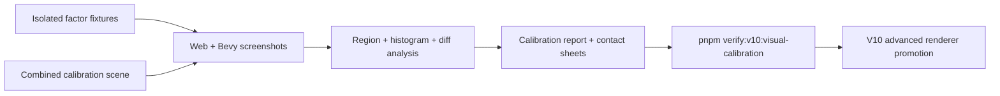
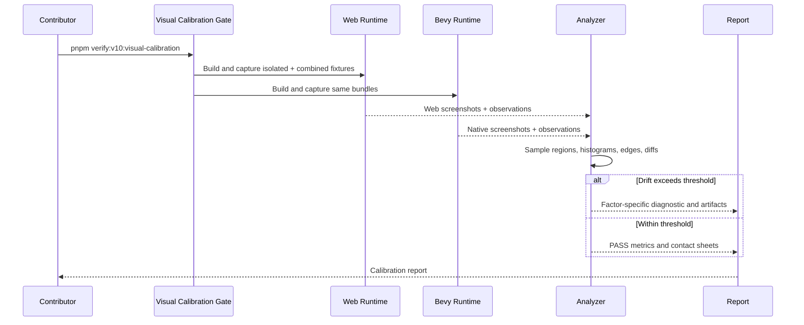

# V10-03 Cross-Runtime Visual Calibration

Complexity: 12 -> HIGH mode

Score basis: +3 touches 10+ implementation/test/docs files during execution,
+2 adds a new calibration evidence system, +2 spans compiler/IR/CLI/web/Bevy/
examples/scripts, +2 includes visual screenshot analysis and threshold policy,
+2 coordinates isolated and combined-scene experiments, +1 affects release-gate
behavior.

## Context

**Problem:** ThreeNative has focused visual parity checks for color, lighting,
fog/sky, materials, and rendering/lights, but there is no single calibration
gate that proves web Three.js and native Bevy have the same look and feel across
isolated visual factors and a combined scene.

**Files Analyzed:**

- `docs/bevy-feature-parity.md`
- `docs/STATUS.md`
- `docs/visual-parity-policy.md`
- `docs/PRDs/v8/V8-07-material-texture-shader-parity.md`
- `docs/PRDs/v8/V8-11-rendering-atmosphere-post-processing-parity.md`
- `docs/PRDs/v8/V8-12-lights-shadows-environment-probes.md`
- `docs/PRDs/v9/V9-04-rendering-lights-post-processing-parity.md`
- `docs/PRDs/v9/V9-07-engine-quality-control-hardening.md`
- `docs/PRDs/v10/V10-02-advanced-renderer-materials-and-physics.md`

**Current Behavior:**

- V8 color parity proves near-exact unlit swatches and bounded lit PBR sphere
  deltas.
- V8 rendering-quality proves focused fog/sky screenshots.
- V8 material parity and V9 rendering/lights prove selected materials,
  skyboxes, environment maps, probes, shadow-filter metadata, dense/HLOD
  observations, and debug-gizmo regions.
- These checks are useful but scattered. They do not define a reusable
  calibration ladder from isolated color through combined scene composition.
- Advanced V10 rendering work needs a stable way to tell whether a new feature
  changed real visual parity or only introduced acceptable backend-specific
  noise.

## Checklist Coverage

This PRD does not directly check off an engine feature. It creates the visual
evidence gate required before V10-02 can safely promote advanced rendering,
materials, lights, post-processing, instancing, and scene-level visual claims.

Covered calibration factors:

- color management: sRGB/linear conversion, tone mapping, exposure, white point,
  gamma, transparent/opaque backgrounds, and render target readback.
- material response: unlit color, base PBR, metalness, roughness, emissive,
  alpha/mask/blend, texture sampling, normal/occlusion/specular/clearcoat/
  transmission slots, UV transforms, vertex colors, and generated UV channels.
- lighting response: ambient, directional, point, spot, range/falloff, shadow
  caster/receiver policy, bias, PCF/filter metadata, probe/environment
  contribution, and dynamic light budget behavior.
- atmosphere and background: fog, sky/horizon, skybox, environment maps,
  exposure, color grading, and deferred volumetric/atmospheric diagnostics.
- camera and post: perspective/orthographic framing, viewport/split-screen,
  render targets, bloom, MSAA, and future AA/DOF/decal effects.
- geometry and dense scene: primitives, generated meshes, glTF instances,
  instancing/batching observations, LOD/HLOD fade metadata, and visibility
  ranges.
- combined scene: one calibrated visual scene exercising representative factors
  together with region, histogram, edge, luminance, and contact-sheet evidence.

Out of scope: using raw Three.js or Bevy renderer code as the authoring source
of truth, hand-tuning one runtime outside the portable IR contract, or claiming
human-identical output without measurable evidence.

## Integration Points

**How will this feature be reached?**

- [x] Entry point identified: calibration fixtures/examples,
  `pnpm verify:v10:visual-calibration`, future `pnpm verify:v10`, screenshot
  capture helpers, conformance reports, and docs/status/parity gates.
- [x] Caller file identified: root `package.json`, future
  `scripts/verify-v10-visual-calibration.mjs`, visual analysis helpers, web
  preview capture, Bevy screenshot capture, examples under
  `examples/v10-visual-calibration-*`, and report writers.
- [x] Registration/wiring needed: package scripts, fixtures/examples, artifact
  manifest, calibrated threshold config, per-factor region definitions,
  combined-scene contact sheets, docs updates, and aggregate V10 gate wiring.

**Is this user-facing?**

- [x] YES -> user-facing through visual output, screenshots, contact sheets,
  calibration reports, and release-gate failures that explain why web/native
  look different.

**Full user flow:**

1. Contributor changes rendering, materials, lights, camera, or scene output.
2. Contributor runs `pnpm verify:v10:visual-calibration`.
3. The verifier builds isolated calibration fixtures and a combined scene,
   captures web/native screenshots, samples stable regions, computes metrics,
   and writes contact sheets/diffs.
4. The report identifies which factor drifted: color, material, lighting,
   atmosphere, camera, post-processing, geometry, dense content, or combined
   scene composition.
5. V10 advanced rendering work cannot mark a visual feature promoted unless the
   relevant calibration factor remains within threshold or updates thresholds
   with documented evidence.

## Solution

**Approach:**

- Build a calibration ladder: start with one-factor-at-a-time fixtures, then
  run a controlled combined scene that uses the same portable bundle contract.
- Use structured region metadata instead of ad hoc manual inspection: each
  fixture defines expected sample regions, factor labels, tolerances, and
  failure hints.
- Measure multiple signals: pixel diff, average channel delta, luminance delta,
  region histograms, edge/framing checks, alpha/background checks, and nonblank
  safety.
- Separate hard parity gates from report-only probes: mature factors can fail
  the gate; unstable/advanced factors write diagnostics until promotion.
- Keep calibration assets bundle-local and deterministic so examples can run
  independently in web and native runtimes.

**Key Decisions:**

- [x] Library/framework choices: reuse existing Playwright/web capture, Bevy
  screenshot capture, PNG analysis, contact-sheet, conformance, and artifact
  report utilities.
- [x] Error-handling strategy: calibration failures emit stable
  `TN_VERIFY_VISUAL_CALIBRATION_*` diagnostics with factor, fixture, region,
  metric, expected threshold, observed value, and artifact paths.
- [x] Reused utilities: V8 color parity, V8 rendering quality, V8 material
  parity, V9 rendering/lights visual matrix, nonblank checks, region sampling,
  and diff/contact-sheet generation.

**Data Changes:**

- Calibration manifest: fixture ID, factor group, promoted/report-only status,
  screenshot paths, region definitions, thresholds, and failure hints.
- Calibration report: per-factor pass/fail, metrics, artifacts, diagnostics,
  combined-scene summary, and calibration version.
- Optional IR metadata only for test fixtures: calibration region labels and
  deterministic camera/framing anchors. Runtime contract features remain
  ordinary SDK/IR declarations.

## Sequence Flow

## Execution Phases

#### Phase 1: Calibration Harness and Manifest - Contributors can add visual factors with explicit thresholds.

**Files (max 5):**

- `scripts/verify-v10-visual-calibration.mjs` - orchestrate calibration
  fixtures, capture, analysis, and report writing.
- `scripts/visual-calibration/manifest.mjs` - define fixture registry,
  regions, thresholds, factor groups, and report-only/promoted status.
- `scripts/verify-v10-visual-calibration.test.mjs` - test manifest validation,
  metric aggregation, and missing artifact diagnostics.
- `package.json` - register `verify:v10:visual-calibration`.
- `docs/visual-parity-policy.md` - document calibration threshold policy.

**Implementation:**

- [ ] Add a machine-readable calibration manifest with fixture IDs, factor
  groups, capture sizes, camera anchors, required artifacts, region rectangles,
  thresholds, and failure hints.
- [ ] Normalize report shape with `status`, `ok`, `factorGroups`, `metrics`,
  `diagnostics`, `artifacts`, `promoted`, and `reportOnly`.
- [ ] Fail when required screenshots, region definitions, or contact sheets are
  missing.
- [ ] Keep thresholds explicit and versioned; threshold changes require artifact
  evidence and PRD/status notes.

**Tests Required:**

| Test File | Test Name | Assertion |
| --- | --- | --- |
| `scripts/verify-v10-visual-calibration.test.mjs` | `should reject calibration factors without regions or thresholds` | Diagnostic is `TN_VERIFY_VISUAL_CALIBRATION_MANIFEST_INVALID`. |
| `scripts/verify-v10-visual-calibration.test.mjs` | `should fail when required screenshots are missing` | Missing artifact diagnostic includes fixture and runtime. |
| `scripts/verify-v10-visual-calibration.test.mjs` | `should separate promoted and report-only calibration factors` | Report does not fail on report-only drift unless configured. |

**Verification Plan:**

1. **Unit Tests:** `node --test scripts/verify-v10-visual-calibration.test.mjs`.
2. **Smoke:** `pnpm verify:v10:visual-calibration -- --list`.
3. **Evidence Required:** manifest validation report under
   `artifacts/v10/visual-calibration/manifest-report.json`.

**User Verification:**

- Action: add a malformed calibration factor and run the verifier.
- Expected: the gate fails before capture with a precise manifest diagnostic.

**Checkpoint:** Automated `prd-work-reviewer` review after Phase 1.

#### Phase 2: Isolated Color, Camera, and Material Calibration - Basic surface appearance is stable before lighting enters.

**Files (max 5):**

- `examples/v10-visual-calibration-color/` - fixture for color management,
  camera framing, backgrounds, alpha, and unlit swatches.
- `examples/v10-visual-calibration-materials/` - fixture for PBR factors,
  textures, UV transforms, vertex colors, and generated UV channels.
- `scripts/visual-calibration/analyze.mjs` - region, histogram, luminance,
  edge, and alpha analysis helpers.
- `scripts/verify-v10-visual-calibration.mjs` - run color/material fixture
  capture and analysis.
- `docs/pr-evidence/v10-visual-calibration/README.md` - artifact index and
  expected interpretation.

**Implementation:**

- [ ] Add isolated color-management fixture with white/black/mid-gray,
  saturated swatches, transparent/opaque backgrounds, tone mapping, exposure,
  and render-target readback checks.
- [ ] Add isolated camera/framing checks for perspective and orthographic
  projections, viewport region placement, and edge alignment.
- [ ] Add isolated material fixture for unlit, standard PBR, metalness,
  roughness, emissive, alpha/mask/blend, texture slots, UV transforms, vertex
  colors, and generated UV channels.
- [ ] Use strict thresholds for unlit/color factors and calibrated tolerances
  for lit/PBR material response.

**Tests Required:**

| Test File | Test Name | Assertion |
| --- | --- | --- |
| `scripts/visual-calibration/analyze.test.mjs` | `should compute region color and luminance deltas deterministically` | Metrics are stable for fixture PNGs. |
| `scripts/visual-calibration/analyze.test.mjs` | `should detect camera framing drift from edge samples` | Edge/framing diagnostic names shifted region. |
| `scripts/verify-v10-visual-calibration.test.mjs` | `should fail color calibration when unlit swatch delta exceeds threshold` | Diagnostic includes region and channel delta. |

**Verification Plan:**

1. **Unit Tests:** analyzer and verifier tests.
2. **Visual Proof:** web/native screenshots, diffs, histograms, and contact
   sheets for color and material fixtures.
3. **Evidence Required:** reports under
   `artifacts/v10/visual-calibration/color/` and
   `artifacts/v10/visual-calibration/materials/`.

**User Verification:**

- Action: run `pnpm verify:v10:visual-calibration -- --group color,materials`.
- Expected: failures identify whether drift came from color management, camera
  framing, or material response.

**Checkpoint:** Automated `prd-work-reviewer` review plus manual contact-sheet
inspection after Phase 2.

#### Phase 3: Isolated Lighting, Shadows, Atmosphere, and Post Calibration - Light transport and screen effects are measured separately.

**Files (max 5):**

- `examples/v10-visual-calibration-lighting/` - fixture for ambient,
  directional, point, spot, range, falloff, shadows, probes, and environment
  contribution.
- `examples/v10-visual-calibration-atmosphere/` - fixture for fog, sky,
  skybox, exposure, color grading, and report-only atmospheric/volumetric
  requests.
- `examples/v10-visual-calibration-post/` - fixture for bloom, MSAA, future AA,
  DOF, decals, and report-only advanced post effects.
- `scripts/visual-calibration/analyze.mjs` - lighting/post-specific sample
  metrics.
- `scripts/verify-v10-visual-calibration.mjs` - run lighting/atmosphere/post
  capture and analysis.

**Implementation:**

- [ ] Add light-isolation cards and spheres where only one light/factor changes
  at a time: ambient, directional angle, point range/falloff, spot cone/range,
  shadow caster/receiver, bias, and PCF/filter metadata.
- [ ] Add environment/probe fixture regions for skybox, reflection probe, and
  diffuse environment contribution.
- [ ] Add fog/sky/exposure/color-grading fixture with near/mid/far depth
  samples and known sky/background regions.
- [ ] Add post fixture for bloom and MSAA now, with report-only hooks for
  FXAA/TAA/SMAA, DOF, decals, motion blur, SSR, and custom post until V10-02
  promotes them.
- [ ] Keep advanced atmospheric/volumetric features diagnostic/report-only
  until promoted by V10-02.

**Tests Required:**

| Test File | Test Name | Assertion |
| --- | --- | --- |
| `scripts/visual-calibration/analyze.test.mjs` | `should detect lighting intensity drift in named probe regions` | Diagnostic names light type and region. |
| `scripts/visual-calibration/analyze.test.mjs` | `should detect fog convergence drift by depth band` | Near/mid/far metrics are reported separately. |
| `scripts/verify-v10-visual-calibration.test.mjs` | `should keep report-only post effects out of hard gate failures` | Report-only drift is listed but does not fail promoted groups. |

**Verification Plan:**

1. **Unit Tests:** analyzer and verifier tests.
2. **Visual Proof:** lighting, atmosphere, and post screenshots plus
   contact-sheet/diff artifacts.
3. **Evidence Required:** reports under
   `artifacts/v10/visual-calibration/lighting/`,
   `artifacts/v10/visual-calibration/atmosphere/`, and
   `artifacts/v10/visual-calibration/post/`.

**User Verification:**

- Action: run `pnpm verify:v10:visual-calibration -- --group lighting,atmosphere,post`.
- Expected: report isolates drift to light type, shadow policy, fog/depth band,
  sky/background, bloom/MSAA, or report-only post effect.

**Checkpoint:** Automated `prd-work-reviewer` review plus manual contact-sheet
inspection after Phase 3.

#### Phase 4: Geometry, Asset, Dense Scene, and Instancing Calibration - Scene scale does not hide visual drift.

**Files (max 5):**

- `examples/v10-visual-calibration-geometry/` - fixture for primitives,
  generated meshes, normals, UVs, glTF instances, and bounds.
- `examples/v10-visual-calibration-dense/` - fixture for repeated instances,
  visibility ranges, HLOD fades, and instancing/batching observations.
- `scripts/visual-calibration/analyze.mjs` - geometry edge, normal, UV, and
  dense-scene metrics.
- `scripts/verify-v10-visual-calibration.mjs` - run geometry/dense capture and
  analysis.
- `packages/ir/fixtures/conformance/v10-visual-calibration/` - shared bundle
  fixture for non-visual runtime observations.

**Implementation:**

- [ ] Add primitive and generated mesh grid with normals, UV channels, vertex
  colors, and texture-coordinate markers.
- [ ] Add glTF asset instances with deterministic transforms, material slots,
  animation disabled, and known camera framing.
- [ ] Add dense content fixture with repeated mesh/model instances, visibility
  ranges, HLOD fade markers, and instance/batch observation regions.
- [ ] Compare visual output and non-visual observations together so a draw-count
  optimization cannot mask wrong material or transform output.

**Tests Required:**

| Test File | Test Name | Assertion |
| --- | --- | --- |
| `scripts/visual-calibration/analyze.test.mjs` | `should detect geometry edge and uv marker drift` | Edge/UV diagnostics name the fixture region. |
| `scripts/verify-v10-visual-calibration.test.mjs` | `should fail dense calibration when visual and observation reports disagree` | Report names visual metric and instance-count metric. |
| `packages/ir/src/conformance.test.ts` | `should include visual calibration fixture ownership` | Fixture catalog points to V10-03. |

**Verification Plan:**

1. **Unit Tests:** analyzer, verifier, and conformance catalog tests.
2. **Conformance:** `pnpm verify:conformance` includes the V10 calibration
   observation fixture.
3. **Visual Proof:** geometry/dense screenshots and reports.
4. **Evidence Required:** reports under
   `artifacts/v10/visual-calibration/geometry/` and
   `artifacts/v10/visual-calibration/dense/`.

**User Verification:**

- Action: run `pnpm verify:v10:visual-calibration -- --group geometry,dense`.
- Expected: report separates mesh/material/UV drift from dense-content
  instancing or visibility observation drift.

**Checkpoint:** Automated `prd-work-reviewer` review plus manual contact-sheet
inspection after Phase 4.

#### Phase 5: Combined Scene Calibration - The whole scene has the same look and feel.

**Files (max 5):**

- `examples/v10-visual-calibration-scene/` - combined calibration scene using
  representative promoted factors together.
- `scripts/verify-v10-visual-calibration.mjs` - run combined-scene capture and
  aggregate report.
- `scripts/verify-v10.mjs` - wire calibration into the future V10 aggregate
  gate.
- `docs/STATUS.md` - update only after implementation proves the gate exists.
- `docs/bevy-feature-parity.md` - document calibration evidence without marking
  feature rows complete by itself.

**Implementation:**

- [ ] Create one combined scene with calibrated camera, sky/fog/background,
  mixed lights, shadow casters/receivers, PBR/unlit/emissive/transparent
  materials, textures/UVs, generated meshes, glTF assets, repeated instances,
  UI overlay sample, and optional report-only advanced features.
- [ ] Define factor-tagged regions so failures still point to a likely cause.
- [ ] Add global metrics for full-frame average delta, changed-pixel ratio,
  perceptual/luminance drift, edge/framing drift, histogram drift, and
  nonblank safety.
- [ ] Write a contact sheet with web, native, diff, highlighted failing regions,
  and metric captions.
- [ ] Require combined-scene calibration before V10-02 promotes any advanced
  visual feature.

**Tests Required:**

| Test File | Test Name | Assertion |
| --- | --- | --- |
| `scripts/verify-v10-visual-calibration.test.mjs` | `should fail combined scene when a factor-tagged region exceeds threshold` | Diagnostic names factor, region, and artifact paths. |
| `scripts/verify-v10-visual-calibration.test.mjs` | `should write combined scene contact sheet with highlighted regions` | Report references the contact-sheet artifact. |
| `scripts/verify-v10.test.mjs` | `should run visual calibration before advanced renderer promotion gates` | Aggregate command order includes calibration first. |

**Verification Plan:**

1. **Unit Tests:** verifier and aggregate gate tests.
2. **Integration Test:** `pnpm verify:v10:visual-calibration`.
3. **Aggregate Gate:** `pnpm verify:v10` after the future aggregate exists.
4. **Manual Verification:** inspect combined-scene contact sheet.
5. **Evidence Required:** `artifacts/v10/visual-calibration/verification-report.json`,
   combined-scene screenshots, diffs, contact sheets, and region metrics.

**User Verification:**

- Action: run `pnpm verify:v10:visual-calibration` and open the combined-scene
  contact sheet.
- Expected: web and native output have the same calibrated look and feel, or
  the report identifies exactly which factor drifted.

**Checkpoint:** Automated `prd-work-reviewer` review plus manual visual
checkpoint after Phase 5.

## Acceptance Criteria

- [ ] All five phases complete with checkpoint PASS.
- [ ] Isolated calibration fixtures exist for color/camera/materials,
  lighting/shadows, atmosphere/background, post-processing, geometry/assets,
  and dense content.
- [ ] A combined calibration scene exercises representative factors together.
- [ ] `pnpm verify:v10:visual-calibration` passes and writes an aggregate
  report under `artifacts/v10/visual-calibration/`.
- [ ] Calibration failures include factor, fixture, region, metric, threshold,
  observed value, suggestion, and artifact paths.
- [ ] Contact sheets and diff images exist for all visual factor groups.
- [ ] Report-only advanced factors are visible but cannot be mistaken for
  promoted parity.
- [ ] V10-02 advanced visual promotion depends on the relevant calibration
  factor passing or explicitly updating thresholds with evidence.
- [ ] `docs/STATUS.md` and `docs/bevy-feature-parity.md` are updated only when
  implementation lands and the calibration gate exists.
