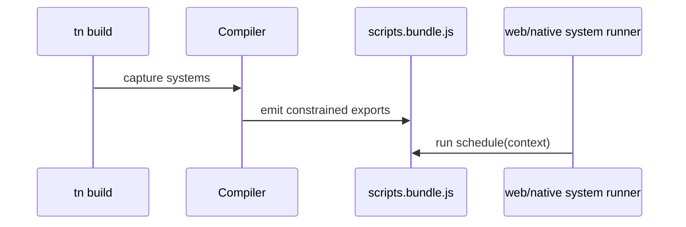

# V2-03 TypeScript Systems and Runtime Host

Complexity: 8 -> HIGH mode

## Context

**Problem:** V2 gameplay needs constrained TypeScript systems that run from the
same source on web preview and native desktop without compiling arbitrary
JavaScript into runtime internals.

**Files Analyzed:** `docs/ROADMAP.md`, `docs/scripting.md`, `docs/ecs.md`,
`docs/ir.md`, `packages/compiler`, `packages/runtime-web-three`,
`runtime-bevy`.

**Current Behavior:**

- V1 may prove simple built-in motion, but V2 needs real gameplay systems.
- Roadmap requires portable constrained TypeScript systems.
- Native TypeScript hosting remains an explicit technical risk.

## Solution

**Approach:**

- Compile registered system functions into a constrained `scripts.bundle.js`.
- Expose only a runtime-neutral system context: queries, resources, events,
  commands, time, and input.
- Run systems in web preview first, then prove the native strategy through one
  hosted gameplay fixture or a documented adapter fallback.
- Reject unsupported APIs with compiler diagnostics before runtime.

**Data Changes:** Adds `scripts.bundle.js` references and executable system
metadata to `systems.ir.json`.

## Integration Points

**How will this feature be reached?**

- Entry point identified: systems registered in `@threenative/sdk` and executed
  by `tn dev --target web|desktop`.
- Caller file identified: web runtime game loop and Bevy runtime schedule
  bridge.
- Registration/wiring needed: compiler script bundling, runtime system runner,
  validator access checks.

**Is this user-facing?** Yes, gameplay behavior.

**Full user flow:**

1. User registers a movement system in TypeScript.
2. `tn build` emits system metadata and script bundle.
3. `tn dev --target web` runs the system and moves the player.
4. `tn dev --target desktop` proves the same system path or reports the chosen
   native-host limitation explicitly.

## Execution Phases

#### Phase 1: System Bundle Emit - Registered systems become runnable exports

**Files (max 5):**

- `packages/compiler/src/scripts/bundle.ts` - constrained script bundling.
- `packages/compiler/src/scripts/diagnostics.ts` - unsupported API diagnostics.
- `packages/compiler/src/emit/systems.ts` - script export references.
- `packages/compiler/src/scripts/bundle.test.ts` - bundling tests.
- `packages/compiler/src/scripts/diagnostics.test.ts` - rejection tests.

**Implementation:**

- [ ] Bundle system exports deterministically.
- [ ] Preserve system IDs and schedule names.
- [ ] Reject direct DOM, renderer, filesystem, network, and runtime adapter
  imports.
- [ ] Emit diagnostics with code, severity, file, and suggested fix.

**Tests Required:**

| Test File | Test Name | Assertion |
| --- | --- | --- |
| `packages/compiler/src/scripts/bundle.test.ts` | `should emit deterministic movement system bundle` | Two builds produce byte-identical system metadata. |
| `packages/compiler/src/scripts/diagnostics.test.ts` | `should reject browser api in portable system` | Diagnostic points at unsupported API usage. |

**User Verification:**

- Action: Build a fixture with one movement system.
- Expected: Bundle contains system metadata and script export.

#### Phase 2: Web System Runner - Movement updates visible state

**Files (max 5):**

- `packages/runtime-web-three/src/systems/context.ts` - portable runtime context.
- `packages/runtime-web-three/src/systems/runner.ts` - schedule runner.
- `packages/runtime-web-three/src/gameLoop.ts` - fixed/update/post-update loop.
- `packages/runtime-web-three/src/systems/runner.test.ts` - runner tests.
- `packages/runtime-web-three/src/mapWorld.ts` - component sync.

**Implementation:**

- [ ] Load system exports from `scripts.bundle.js`.
- [ ] Provide query/resource/event/command context.
- [ ] Apply command buffers at deterministic points.
- [ ] Sync changed transforms to Three.js objects.

**Tests Required:**

| Test File | Test Name | Assertion |
| --- | --- | --- |
| `packages/runtime-web-three/src/systems/runner.test.ts` | `should move entity during fixed update` | Transform changes after fixed tick. |
| `packages/runtime-web-three/src/systems/runner.test.ts` | `should apply despawn command after schedule` | Entity is removed after command flush. |

**User Verification:**

- Action: Run web preview for movement fixture.
- Expected: Player position changes over time.

#### Phase 3: Native Host Proof - Desktop path runs or explicitly gates systems

**Files (max 5):**

- `runtime-bevy/src/systems_host.rs` - native system host adapter.
- `runtime-bevy/src/ir/systems.rs` - system metadata load.
- `runtime-bevy/src/main.rs` - schedule wiring.
- `runtime-bevy/tests/systems_host.rs` - native host tests.
- `docs/scripting.md` - V2 native host decision.

**Implementation:**

- [ ] Choose the V2 native script host strategy.
- [ ] Run at least one movement or damage system natively, or document a
  narrow built-in fallback as a V2 risk requiring release approval.
- [ ] Preserve command buffer and event semantics.
- [ ] Fail with actionable diagnostics when the native host cannot run a system.

**Tests Required:**

| Test File | Test Name | Assertion |
| --- | --- | --- |
| `runtime-bevy/tests/systems_host.rs` | `should run hosted movement system` | Loaded fixture updates transform after tick. |
| `runtime-bevy/tests/systems_host.rs` | `should report unsupported script host` | Diagnostic includes system ID and reason. |

**User Verification:**

- Action: Run native desktop fixture.
- Expected: The same movement proof runs or emits documented V2 gate diagnostic.

## Verification Strategy

- `pnpm --filter @threenative/compiler test -- --run scripts`
- `pnpm --filter @threenative/runtime-web-three test -- --run systems`
- `cd runtime-bevy && cargo test systems_host`

## Acceptance Criteria

- [ ] System bundle output is deterministic.
- [ ] Unsupported portable-system APIs fail before runtime.
- [ ] Web runtime executes scheduled TypeScript gameplay systems.
- [ ] Native system-host strategy is implemented or explicitly gated with
  release-risk documentation.
