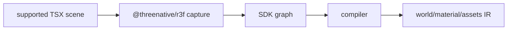

# V2-04 R3F JSX Authoring Capture

Complexity: 8 -> HIGH mode

## Context

**Problem:** V2 must support first-class R3F/JSX-style scene authoring while
preserving the same portable IR contract as direct SDK authoring.

**Files Analyzed:** `docs/ROADMAP.md`, `docs/sdk.md`, `docs/architecture.md`,
`docs/ir.md`, `packages/sdk`, `packages/compiler`.

**Current Behavior:**

- V1 direct SDK authoring is the lower-level contract.
- V2 requires `@threenative/r3f`, supported JSX capture, stable IDs, and
  diagnostics for arbitrary React/R3F/Drei/browser features.

## Solution

**Approach:**

- Add `@threenative/r3f` as a constrained authoring package.
- Support a documented JSX subset for scene, mesh, group, cameras, lights,
  transforms, primitive geometry, materials, and asset references.
- Lower JSX capture into the same SDK authoring graph and IR as direct SDK use.
- Reject refs/hooks/effects/Drei helpers/renderer access that have no portable
  meaning.

**Data Changes:** None beyond existing world/material/asset IR outputs.

## Integration Points

**How will this feature be reached?**

- Entry point identified: user imports JSX components from `@threenative/r3f`.
- Caller file identified: compiler capture path used by `tn build`.
- Registration/wiring needed: new package, TSX compiler config in templates,
  compiler root detection.

**Is this user-facing?** Yes, public authoring API.

**Full user flow:**

1. User writes a TSX arena scene with supported components.
2. Compiler captures JSX into SDK graph.
3. Build emits the same IR shape as equivalent direct SDK scene.
4. Unsupported React/R3F features produce diagnostics.

## Execution Phases

#### Phase 1: JSX Component Subset - User can author a static scene in TSX

**Files (max 5):**

- `packages/r3f/src/components.tsx` - supported JSX components.
- `packages/r3f/src/capture.ts` - capture tree builder.
- `packages/r3f/src/index.ts` - public exports.
- `packages/r3f/src/components.test.tsx` - component tests.
- `package.json` - workspace package registration.

**Implementation:**

- [ ] Support `scene`, `group`, `mesh`, cameras, ambient/directional/point/spot
  lights, primitive geometries, and standard/basic materials.
- [ ] Support `id`, `name`, `position`, `rotation`, `scale`, and `visible`.
- [ ] Generate stable IDs from explicit IDs or deterministic fallback paths.
- [ ] Keep capture independent of React DOM.

**Tests Required:**

| Test File | Test Name | Assertion |
| --- | --- | --- |
| `packages/r3f/src/components.test.tsx` | `should capture mesh hierarchy from jsx` | Capture graph matches direct SDK hierarchy. |
| `packages/r3f/src/components.test.tsx` | `should preserve explicit entity ids` | Entity ID is stable across builds. |

**User Verification:**

- Action: Author a cube scene in TSX.
- Expected: Capture graph contains scene, mesh, camera, and light.

#### Phase 2: Compiler Integration - JSX lowers to identical IR

**Files (max 5):**

- `packages/compiler/src/capture/r3f.ts` - TSX root loading.
- `packages/compiler/src/capture.ts` - supported root dispatch.
- `packages/compiler/src/emit/scene-to-world.ts` - shared graph mapping.
- `packages/compiler/src/capture/r3f.test.tsx` - capture tests.
- `templates/v2/tsconfig.json` - TSX settings.

**Implementation:**

- [ ] Accept supported TSX scene roots.
- [ ] Reuse direct SDK graph-to-IR mapping.
- [ ] Compare equivalent direct SDK and TSX fixtures.
- [ ] Add template config for TSX authoring.

**Tests Required:**

| Test File | Test Name | Assertion |
| --- | --- | --- |
| `packages/compiler/src/capture/r3f.test.tsx` | `should emit same ir as sdk scene` | Normalized IR for SDK and TSX fixtures is equal. |

**User Verification:**

- Action: Run `tn build` on TSX scene fixture.
- Expected: Bundle validates and renders through existing runtime path.

#### Phase 3: Unsupported JSX Diagnostics - Capture fails closed

**Files (max 5):**

- `packages/r3f/src/diagnostics.ts` - R3F diagnostic helpers.
- `packages/compiler/src/capture/r3f.ts` - unsupported feature detection.
- `packages/compiler/src/capture/r3f.diagnostics.test.tsx` - diagnostics tests.
- `docs/sdk.md` - supported R3F subset.
- `docs/PRDs/v2/V2-04-r3f-jsx-authoring-capture.md` - scope record.

**Implementation:**

- [ ] Reject unsupported Drei helpers.
- [ ] Reject arbitrary React effects/hooks in portable scene capture.
- [ ] Reject direct Three.js renderer access and browser-only APIs.
- [ ] Include suggested direct SDK or supported JSX replacement.

**Tests Required:**

| Test File | Test Name | Assertion |
| --- | --- | --- |
| `packages/compiler/src/capture/r3f.diagnostics.test.tsx` | `should reject drei helper` | Diagnostic names unsupported component and supported alternatives. |
| `packages/compiler/src/capture/r3f.diagnostics.test.tsx` | `should reject browser api in scene capture` | Diagnostic includes file reference. |

**User Verification:**

- Action: Build a fixture using an unsupported Drei component.
- Expected: Build fails before runtime with actionable diagnostic.

## Verification Strategy

- `pnpm --filter @threenative/r3f test`
- `pnpm --filter @threenative/compiler test -- --run r3f`
- Build direct SDK and TSX equivalent fixtures and diff normalized IR.

## Acceptance Criteria

- [ ] `@threenative/r3f` supports the V2 JSX subset.
- [ ] Supported JSX emits the same IR contract as direct SDK authoring.
- [ ] Stable entity IDs are deterministic.
- [ ] Unsupported R3F/Drei/React/browser features fail with diagnostics.

