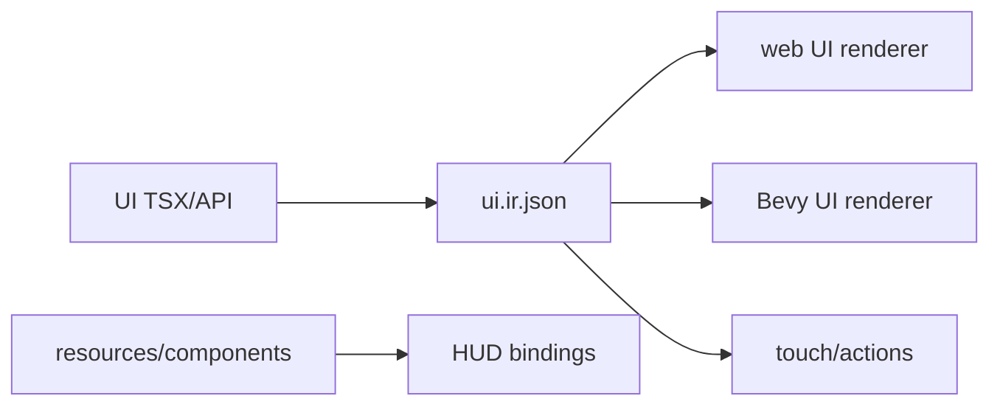

# V2-08 Portable UI Foundation

Complexity: 8 -> HIGH mode

## Context

**Problem:** The arena demo needs HUD, touch controls, and pause/menu basics
that are portable through UI IR rather than arbitrary React DOM.

**Files Analyzed:** `docs/ROADMAP.md`, `docs/ui.md`, `docs/sdk.md`,
`docs/ir.md`, `packages/ir`, `packages/compiler`, `packages/runtime-web-three`,
`runtime-bevy`.

**Current Behavior:**

- V1 explicitly defers UI IR.
- V2 requires HUD, touch control surface, pause/menu basics, text, buttons,
  bars, focusable controls, and simple layout.
- Web may render UI with DOM, but the portable contract is `ui.ir.json`.

## Solution

**Approach:**

- Add a constrained UI authoring API or TSX capture surface for V2 primitives.
- Emit `ui.ir.json` with layout, bindings, actions, and focus metadata.
- Render UI IR on web and recreate equivalent native UI in Bevy.
- Connect UI buttons/touch controls to input actions and pause state.

**Data Changes:** Adds `ui.ir.json` and UI schema file.

## Integration Points

**How will this feature be reached?**

- Entry point identified: UI authoring export in game source.
- Caller file identified: compiler bundle emit and runtime UI layers.
- Registration/wiring needed: `@threenative/ui` package or SDK UI exports,
  compiler capture, web/native UI renderers, input bridge.

**Is this user-facing?** Yes, game UI.

**Full user flow:**

1. User declares HUD text/bar, pause button, and touch joystick/buttons.
2. `tn build` emits `ui.ir.json`.
3. Web and native render UI.
4. UI actions feed input/pause resources.

## Execution Phases

#### Phase 1: UI IR Emit - HUD and controls validate

**Files (max 5):**

- `packages/ui/src/components.tsx` - V2 UI primitives.
- `packages/ir/src/ui.ts` - UI IR schema.
- `packages/compiler/src/emit/ui.ts` - UI emit.
- `packages/ir/src/ui.test.ts` - validation tests.
- `packages/compiler/src/emit/ui.test.tsx` - UI emit tests.

**Implementation:**

- [ ] Support text, button, bar, stack/row/column/simple layout, focusable
  control, and touch control primitives.
- [ ] Support bindings to resources/components needed by HUD.
- [ ] Support action bindings for buttons/touch controls.
- [ ] Reject arbitrary HTML, CSS selectors, DOM event handlers, and browser APIs.

**Tests Required:**

| Test File | Test Name | Assertion |
| --- | --- | --- |
| `packages/compiler/src/emit/ui.test.tsx` | `should emit hud and pause ui ir` | `ui.ir.json` includes text, bar, and button nodes. |
| `packages/ir/src/ui.test.ts` | `should reject dom event handler` | Validator reports unsupported UI field. |

**User Verification:**

- Action: Build HUD fixture.
- Expected: `ui.ir.json` validates.

#### Phase 2: Web UI Renderer - HUD and touch controls work in preview

**Files (max 5):**

- `packages/runtime-web-three/src/ui/renderUi.tsx` - web UI renderer.
- `packages/runtime-web-three/src/ui/bindings.ts` - HUD binding resolver.
- `packages/runtime-web-three/src/ui/inputBridge.ts` - touch/button actions.
- `packages/runtime-web-three/src/ui/renderUi.test.tsx` - renderer tests.
- `packages/runtime-web-three/src/browser/main.ts` - UI mount.

**Implementation:**

- [ ] Render text, bars, buttons, and simple layout.
- [ ] Resolve resource/component bindings from runtime state.
- [ ] Dispatch UI/touch actions into input context.
- [ ] Keep web DOM as implementation detail.

**Tests Required:**

| Test File | Test Name | Assertion |
| --- | --- | --- |
| `packages/runtime-web-three/src/ui/renderUi.test.tsx` | `should update health bar from resource` | Bar value changes when resource changes. |
| `packages/runtime-web-three/src/ui/renderUi.test.tsx` | `should dispatch pause action from button` | Input action is emitted on click. |

**User Verification:**

- Action: Run web HUD fixture.
- Expected: Health bar updates and pause button pauses gameplay.

#### Phase 3: Native UI Renderer - Bevy recreates the portable HUD

**Files (max 5):**

- `runtime-bevy/src/ui.rs` - Bevy UI IR renderer.
- `runtime-bevy/src/ui_bindings.rs` - binding resolver.
- `runtime-bevy/src/input.rs` - UI action bridge.
- `runtime-bevy/tests/ui.rs` - native UI tests.
- `examples/fixtures/v2-ui/README.md` - fixture docs.

**Implementation:**

- [ ] Render text, bars, buttons, and simple layout through Bevy UI.
- [ ] Resolve HUD bindings from resources/components.
- [ ] Dispatch button/touch action equivalents.
- [ ] Report unsupported UI nodes before rendering.

**Tests Required:**

| Test File | Test Name | Assertion |
| --- | --- | --- |
| `runtime-bevy/tests/ui.rs` | `should build bevy hud from ui ir` | Native UI tree contains text, bar, and button nodes. |
| `runtime-bevy/tests/ui.rs` | `should reject unsupported ui node` | Diagnostic names unsupported node. |

**User Verification:**

- Action: Run native HUD fixture.
- Expected: HUD appears and pause control changes runtime state.

## Verification Strategy

- `pnpm --filter @threenative/ir test -- --run ui`
- `pnpm --filter @threenative/runtime-web-three test -- --run ui`
- `cd runtime-bevy && cargo test ui`

## Acceptance Criteria

- [ ] UI authoring emits `ui.ir.json`.
- [ ] Web and native render required V2 UI primitives.
- [ ] HUD bindings and touch/action controls connect to gameplay state.
- [ ] Arbitrary React DOM/HTML/CSS/browser APIs are rejected as portable UI.

