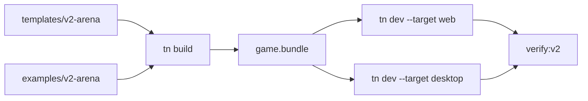

# V2-10 Arena Demo Template

Complexity: 9 -> HIGH mode

## Context

**Problem:** V2 is only proven when a developer or AI can build, validate,
preview, and run a small playable game from the documented surface.

**Files Analyzed:** `docs/ROADMAP.md`, all V2 PRDs, `examples`, `templates`,
`packages/cli`, `packages/runtime-web-three`, `runtime-bevy`.

**Current Behavior:**

- V1 has a canonical scene proof.
- V2 requires a mobile-friendly third-person arena game with R3F/JSX, player
  movement, camera follow, keyboard/touch controls, model loading, enemies,
  ECS systems, collision, health/damage, HUD, web preview, and native desktop.

## Solution

**Approach:**

- Add a V2 arena example and optional template built from the documented APIs.
- Keep gameplay small: one player, one level, basic enemies, health/damage,
  spawn/despawn, simple collision, HUD, sound, and music.
- Ensure every previous V2 feature is exercised by the example.
- Use the example as the source for V2 smoke and release-gate tests.

**Data Changes:** Adds tracked V2 example/template source and fixture assets.

## Integration Points

**How will this feature be reached?**

- Entry point identified: `tn create --template v2-arena` and
  `examples/v2-arena`.
- Caller file identified: CLI create/build/dev commands and release gate.
- Registration/wiring needed: template registration, example package scripts,
  docs links.

**Is this user-facing?** Yes, canonical V2 game workflow.

**Full user flow:**

1. Developer creates or opens the V2 arena demo.
2. They run validate/build/web preview/native desktop.
3. They change gameplay or scene source and rebuild.
4. Smoke tests prove the demo remains playable.

## Execution Phases

#### Phase 1: Arena Source - Demo builds from supported authoring APIs

**Files (max 5):**

- `examples/v2-arena/src/scene.tsx` - R3F/JSX arena scene.
- `examples/v2-arena/src/gameplay.ts` - ECS systems and components.
- `examples/v2-arena/src/input.ts` - input map.
- `examples/v2-arena/src/ui.tsx` - HUD/touch/pause UI.
- `examples/v2-arena/threenative.config.json` - project config.

**Implementation:**

- [ ] Use `@threenative/r3f` for scene authoring.
- [ ] Add player, enemies, arena, camera follow, input, health/damage,
  collision, UI, and audio declarations.
- [ ] Keep all APIs within V2 supported surface.
- [ ] Avoid direct runtime, Bevy, Three.js renderer, DOM, or Rapier APIs.

**Tests Required:**

| Test File | Test Name | Assertion |
| --- | --- | --- |
| `examples/v2-arena/src/gameplay.test.ts` | `should reduce health when damage event is handled` | Health decreases and death/spawn command is emitted. |

**User Verification:**

- Action: Run `pnpm tn -- build --project examples/v2-arena`.
- Expected: Valid V2 bundle is emitted.

#### Phase 2: Template Registration - Users can scaffold the playable proof

**Files (max 5):**

- `templates/v2-arena` - template source.
- `packages/cli/src/commands/create.ts` - template selection.
- `packages/cli/src/commands/create.test.ts` - create tests.
- `docs/developer-workflow.md` - V2 arena commands.
- `examples/v2-arena/README.md` - demo workflow.

**Implementation:**

- [ ] Register `v2-arena` template.
- [ ] Ensure scaffolded project has scripts for validate, build, web, native,
  and verify.
- [ ] Keep template assets minimal and tracked intentionally.
- [ ] Document supported modifications.

**Tests Required:**

| Test File | Test Name | Assertion |
| --- | --- | --- |
| `packages/cli/src/commands/create.test.ts` | `should create v2 arena template` | Generated project contains scene, gameplay, UI, config, and scripts. |

**User Verification:**

- Action: Run `tn create my-arena --template v2-arena`.
- Expected: Project builds without manual edits.

#### Phase 3: Playability Smoke - Web and native prove the same game loop

**Files (max 5):**

- `packages/cli/src/verify/v2Arena.ts` - arena smoke checks.
- `packages/cli/src/commands/verify.ts` - V2 verify dispatch.
- `examples/v2-arena/README.md` - verification docs.
- `scripts/verify-v2.*` - release-gate script.
- `package.json` - `verify:v2` script.

**Implementation:**

- [ ] Verify web preview starts and renders nonblank.
- [ ] Simulate movement input and observe player/camera change.
- [ ] Trigger collision/damage and observe HUD health change.
- [ ] Run native desktop long enough to load bundle and execute core gameplay
  smoke.

**Tests Required:**

| Test File | Test Name | Assertion |
| --- | --- | --- |
| `packages/cli/src/verify/v2Arena.test.ts` | `should report movement and damage smoke results` | Report includes input, movement, collision, HUD, and audio checks. |

**User Verification:**

- Action: Run `pnpm verify:v2`.
- Expected: V2 arena smoke report passes or names exact failed capability.

## Verification Strategy

- `pnpm tn -- build --project examples/v2-arena`
- `pnpm tn -- verify --project examples/v2-arena --profile v2-arena`
- `pnpm verify:v2`

## Acceptance Criteria

- [ ] Arena demo uses supported R3F/JSX and ECS APIs.
- [ ] Demo validates, builds, previews on web, and runs natively.
- [ ] Demo exercises input, time, assets, rendering, physics, UI, audio, and
  gameplay systems.
- [ ] Template scaffolds a clean playable V2 project.

