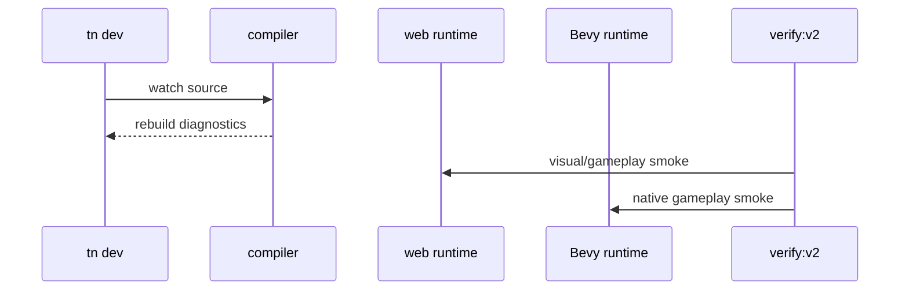

# V2-11 Dev Loop and Release Gate

Complexity: 7 -> HIGH mode

## Context

**Problem:** V2 needs an iteration loop and release gate that prove the playable
arena workflow, not just isolated package tests.

**Files Analyzed:** `docs/ROADMAP.md`, `docs/developer-workflow.md`,
`docs/ai-workflows.md`, `packages/cli`, `scripts`, `examples/v2-arena`,
`runtime-bevy`.

**Current Behavior:**

- V1 gate proves scaffold/build/web verification/native load for a simple
  scene.
- V2 requires dev server, rebuild on change, runtime diagnostics, and example
  smoke tests.
- Hot reload improvements, profiling reports, MCP, and production templates are
  V3 scope.

## Solution

**Approach:**

- Extend CLI dev loop with watch/rebuild diagnostics for V2 projects.
- Add V2 smoke verification artifacts for web and native.
- Add docs consistency and example rebuild checks.
- Keep the release gate focused on the arena proof and documented V2 surface.

**Data Changes:** Writes verification artifacts under example/project output.

## Integration Points

**How will this feature be reached?**

- Entry point identified: `tn dev`, `tn verify`, `pnpm verify:v2`, and
  `pnpm check:docs:v2`.
- Caller file identified: CLI commands and top-level scripts.
- Registration/wiring needed: package scripts, verify profile, artifact paths.

**Is this user-facing?** Yes, developer and AI iteration loop.

**Full user flow:**

1. Developer edits the arena demo.
2. `tn dev --target web --watch` rebuilds and reports diagnostics.
3. Developer runs `pnpm verify:v2`.
4. Gate verifies docs, bundle, web, native, and gameplay smoke artifacts.

## Execution Phases

#### Phase 1: Watch Diagnostics - Changes rebuild with actionable output

**Files (max 5):**

- `packages/cli/src/commands/dev.ts` - watch/rebuild mode.
- `packages/cli/src/dev/watch.ts` - file watcher orchestration.
- `packages/cli/src/diagnostics/format.ts` - runtime/build diagnostics.
- `packages/cli/src/commands/dev.test.ts` - CLI tests.
- `docs/developer-workflow.md` - watch workflow docs.

**Implementation:**

- [ ] Watch source, config, and asset manifest inputs.
- [ ] Rebuild bundles on change.
- [ ] Keep web preview running where possible.
- [ ] Print structured diagnostics with file, code, severity, and suggested fix.

**Tests Required:**

| Test File | Test Name | Assertion |
| --- | --- | --- |
| `packages/cli/src/commands/dev.test.ts` | `should rebuild when v2 source changes` | Watcher reports rebuild success and updated bundle path. |
| `packages/cli/src/commands/dev.test.ts` | `should surface validation diagnostics during watch` | Diagnostic output includes code and file. |

**User Verification:**

- Action: Run `tn dev --target web --watch` and edit arena source.
- Expected: Preview rebuilds or reports actionable diagnostics.

#### Phase 2: V2 Verification Artifacts - Smoke checks are machine-readable

**Files (max 5):**

- `packages/cli/src/verify/v2.ts` - V2 verification profile.
- `packages/cli/src/verify/report.ts` - report extensions.
- `packages/cli/src/verify/v2.test.ts` - profile tests.
- `scripts/verify-v2.*` - top-level gate.
- `package.json` - `verify:v2` script.

**Implementation:**

- [ ] Include bundle validation status.
- [ ] Include web visual, input, movement, UI, physics, and audio checks.
- [ ] Include native load and gameplay smoke status.
- [ ] Save screenshots, logs, bundle paths, and JSON report predictably.

**Tests Required:**

| Test File | Test Name | Assertion |
| --- | --- | --- |
| `packages/cli/src/verify/v2.test.ts` | `should emit v2 verification report` | Report includes capability statuses and artifact paths. |

**User Verification:**

- Action: Run `pnpm verify:v2`.
- Expected: Report is saved and identifies pass/fail per V2 capability.

#### Phase 3: Release Gate - V2 can be accepted as one coherent version

**Files (max 5):**

- `scripts/check-docs-v2.*` - docs gate.
- `scripts/verify-v2.*` - verification gate.
- `docs/PRDs/v2/README.md` - release gate docs.
- `docs/README.md` - PRD index link.
- `docs/ROADMAP.md` - completion note if project tracks status there.

**Implementation:**

- [ ] Check every V2 PRD is linked and every V2 command is documented.
- [ ] Rebuild `examples/v2-arena` from source.
- [ ] Run package tests required by touched V2 features.
- [ ] Run native Bevy smoke tests for V2 fixtures.

**Tests Required:**

| Test File | Test Name | Assertion |
| --- | --- | --- |
| `scripts/check-docs-v2.*` | `should validate v2 prd index links` | Every V2 ticket link resolves. |
| `scripts/verify-v2.*` | `should fail when arena report fails` | Nonpassing smoke report exits nonzero. |

**User Verification:**

- Action: Run `pnpm check:docs:v2 && pnpm verify:v2`.
- Expected: V2 release gate passes from clean checkout.

## Verification Strategy

- `pnpm check:docs:v2`
- `pnpm verify:v2`
- `pnpm test`
- `cd runtime-bevy && cargo test`

## Acceptance Criteria

- [ ] V2 watch/rebuild loop reports actionable diagnostics.
- [ ] V2 verification produces machine-readable artifacts.
- [ ] `verify:v2` proves the arena game across web and native smoke paths.
- [ ] Docs and examples match the supported V2 surface.

