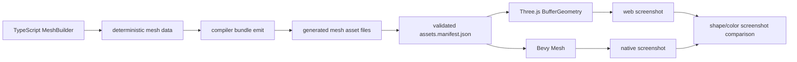
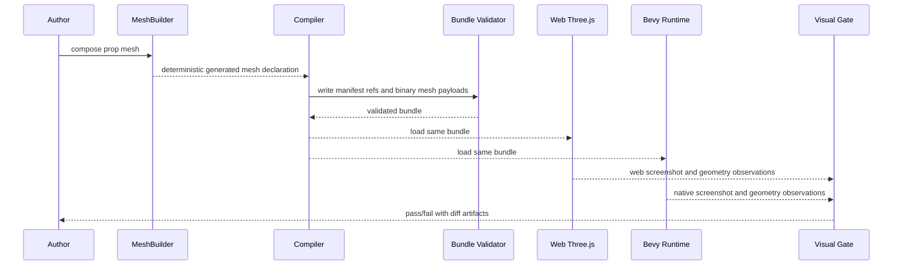

# V8-02 Portable Procedural Mesh Authoring

Complexity: 7 -> HIGH mode

## Context

**Problem:** Authors need the Three.js-style flexibility to create custom
organic props such as trees, mushrooms, rocks, crystals, and placeholder
characters without importing Blender assets or writing backend-specific mesh
code, while still proving the same authored shape renders in web Three.js and
native Bevy.

**Files Analyzed:** `docs/bevy-feature-parity.md`,
`docs/PRDs/v8/README.md`, `docs/PRDs/v8/V8-01-editor-project-snapshot-and-structured-diffs.md`,
`docs/PRDs/v7/V7-06-renderer-and-dense-content-runtime-parity.md`,
`docs/PRDs/v3/V3-07-scene-visual-verification.md`,
`packages/sdk/src/geometry/primitives.ts`,
`packages/compiler/src/emit/scene-to-world.ts`, `packages/ir/src/types.ts`,
`packages/ir/src/validate.ts`, `packages/ir/schemas/assets.schema.json`,
`packages/runtime-web-three/src/mapWorld.ts`,
`runtime-bevy/crates/threenative_runtime/src/map_world.rs`,
`packages/cli/src/verify/v3Scene.ts`, `scripts/verify-v7.mjs`.

**Current Behavior:**

- Generated mesh primitives and custom generated meshes already lower through
  SDK, compiler, IR validation, Three.js `BufferGeometry`, and Bevy `Mesh`.
- `CustomMeshGeometry` requires callers to provide final attributes and indices,
  which is portable but too low-level for "make a tree/mushroom/rock" authoring.
- Custom generated mesh data is currently inline in `assets.manifest.json`, so
  larger generated meshes would bloat JSON and make binary artifact checks weak.
- Existing verification can detect blank screenshots and compare artifacts, but
  there is no web-vs-Bevy screenshot gate for one authored procedural mesh.

## Integration Points

**How will this feature be reached?**

- [x] Entry point identified: TypeScript SDK authoring via `MeshBuilder`, scene
  capture/compiler bundle emission, web preview, native Bevy runtime, and a new
  procedural mesh visual verification gate.
- [x] Caller file identified: SDK geometry exports, compiler scene-to-world
  emission, IR asset validation, runtime mesh mapping, conformance fixtures,
  CLI/script verification.
- [x] Registration/wiring needed: SDK public exports, asset manifest/schema
  fields, compiler bundle writer for generated mesh binaries, runtime asset
  loaders, conformance capability tags, docs and verify script registration.

**Is this user-facing?** Yes. Developers and AI agents author procedural static
props in TypeScript and verify that the emitted bundle renders the same shape
and material color in both runtime targets.

**Full user flow:**

1. User writes `MeshBuilder.create("prop.mushroom.red")` and composes primitive
   parts, modifiers, normals, UVs, and a material.
2. Scene capture reaches the compiler through the existing SDK object model.
3. The compiler emits deterministic generated mesh asset data and bundle
   references instead of renderer-specific source code.
4. Three.js creates `BufferGeometry`; Bevy creates `Mesh`.
5. The verification gate captures web and native screenshots of the same prop
   and fails if shape silhouette, framing, material color, or nonblank output
   drift beyond documented tolerances.

## Solution

**Approach:**

- Add `MeshBuilder` as an SDK authoring layer that produces deterministic
  `CustomMeshGeometry`-compatible static mesh data.
- Store larger generated mesh payloads as bundle-local binary asset files with
  manifest references, while keeping small inline custom meshes compatible.
- Ship practical organic prop helpers for primitive composition and modifiers:
  `sphere`, `icosphere`, `capsule`, `cylinder`, `cone`, `tubeAlongCurve`,
  `lathe`, `extrudeShape`, `merge`, `weld`, `smoothNormals`, `flatNormals`,
  `noise`, `bend`, `twist`, `taper`, `scale`, `rotate`, and `position`.
- Add a compiler-only Three.js `BufferGeometry` snapshot bridge for migration
  and AI-assisted authoring, normalized immediately into the same portable mesh
  asset data. Runtime adapters never consume Three.js objects directly.
- Promote the feature only when an automated screenshot parity fixture proves
  the same authored prop shape and material color in web Three.js and Bevy.

**Key Decisions:**

- [ ] P1 is author-time/compile-time static mesh generation only.
- [ ] Runtime vertex mutation, terrain chunk streaming, deformable meshes, CSG,
  and frame-by-frame procedural geometry are deferred.
- [ ] The runtime contract is portable mesh asset data, not raw Three.js or raw
  Bevy APIs.
- [ ] Validation owns safety: finite values, complete triangles, index range,
  vertex budget, deterministic generation, bounds, and material references.
- [ ] Screenshot parity is part of the release proof, using deterministic
  lighting/camera and tolerant image metrics for renderer differences.

**Data Changes:** Extend generated mesh assets with optional binary attribute
and index payload references, bounds, topology, usage, generation metadata, and
budget classification. Inline custom mesh attributes remain supported for small
fixtures and backwards compatibility.

## Sequence Flow

## Execution Phases

#### Phase 1: MeshBuilder Core - Authors can generate one static custom mesh from portable primitives

**Files (max 5):**

- `packages/sdk/src/geometry/meshBuilder.ts` - builder, primitive generators,
  transforms, merge, normals, UV helpers, and deterministic output.
- `packages/sdk/src/geometry/meshBuilder.test.ts` - builder behavior tests.
- `packages/sdk/src/geometry/primitives.ts` - shared mesh attribute validation
  helpers or public types reused by builder output.
- `packages/sdk/src/index.ts` - public `MeshBuilder` export.
- `docs/sdk.md` - short authoring example and boundaries.

**Implementation:**

- [ ] Add `MeshBuilder.create(id)` with `box`, `sphere`, `icosphere`,
  `capsule`, `cylinder`, `cone`, transform, merge, and build operations.
- [ ] Produce a `CustomMeshGeometry`-compatible result with stable attribute
  order, triangle indices, bounds, and generation metadata.
- [ ] Enforce P1 budgets: standard prop <= 8k vertices, hero prop <= 25k
  vertices, merged doodad warning threshold <= 50k vertices.
- [ ] Reject non-finite values, invalid segment/ring counts, empty meshes,
  incomplete triangles, and non-deterministic random sources.

**Tests Required:**

| Test File | Test Name | Assertion |
| --- | --- | --- |
| `packages/sdk/src/geometry/meshBuilder.test.ts` | `should build a deterministic mushroom mesh from primitives` | Two identical builds produce identical attributes, indices, bounds, and metadata. |
| `packages/sdk/src/geometry/meshBuilder.test.ts` | `should reject procedural meshes over the P1 prop budget` | Builder throws a stable SDK diagnostic with the vertex count and budget. |
| `packages/sdk/src/geometry/meshBuilder.test.ts` | `should generate normals and uv0 for merged primitives` | Output contains position, normal, uv, and indices with matching vertex counts. |

**Verification Plan:**

1. **Unit Tests:** `pnpm --filter @threenative/sdk test -- --run meshBuilder`
2. **Integration Test:** Use the builder result in a scene mesh and confirm the
   existing compiler can emit the same shape as a custom generated mesh.
3. **Evidence Required:** Test output includes deterministic mushroom or tree
   mesh attribute counts and bounds.

**User Verification:**

- Action: Build a sample scene with `MeshBuilder.create("prop.mushroom.red")`.
- Expected: The SDK produces a static mesh declaration with stable geometry,
  bounds, and no renderer-specific objects.

**Checkpoint:** Automated review after this phase:
`Review checkpoint for phase 1 of PRD at docs/PRDs/v8/V8-02-portable-procedural-mesh-authoring.md`.

#### Phase 2: Generated Mesh Asset Contract - Large procedural meshes emit as validated bundle-local assets

**Files (max 5):**

- `packages/ir/src/types.ts` - generated mesh binary payload shape.
- `packages/ir/src/validate.ts` - mesh asset validation and budget
  diagnostics.
- `packages/ir/schemas/assets.schema.json` - schema for binary attributes,
  indices, bounds, topology, and usage.
- `packages/compiler/src/emit/scene-to-world.ts` - emit binary mesh payloads
  from builder output.
- `packages/compiler/src/emit/scene-to-world.test.ts` - deterministic emission
  and validation tests.

**Implementation:**

- [ ] Support `topology: "triangle-list"` and `usage: "static"` for P1.
- [ ] Allow mesh attributes to be inline or binary references with format
  metadata such as `float32x3`, `float32x2`, `float32x4`, and U16/U32 indices.
- [ ] Write deterministic binary files under `generated/meshes/<mesh-id>.*.bin`
  and use bundle-relative paths.
- [ ] Validate position presence, matching vertex counts, normal/UV/color item
  sizes, indices in range, triangle count, bounds, no NaN/Infinity, and budget
  metadata.
- [ ] Emit stable diagnostics for unsupported topology, runtime mutation flags,
  missing bounds, path escape attempts, and malformed binary payload references.

**Tests Required:**

| Test File | Test Name | Assertion |
| --- | --- | --- |
| `packages/ir/src/assets.test.ts` | `should accept binary generated mesh payload references` | Validator accepts position, normal, uv0, indices, bounds, and static usage. |
| `packages/ir/src/assets.test.ts` | `should reject generated mesh indices outside the vertex range` | Diagnostic path points to the mesh asset indices. |
| `packages/compiler/src/emit/scene-to-world.test.ts` | `should emit procedural mesh binaries deterministically` | Repeated emits produce identical manifest refs and binary hashes. |

**Verification Plan:**

1. **Unit Tests:** `pnpm --filter @threenative/ir test -- --run assets`
2. **Compiler Tests:** `pnpm --filter @threenative/compiler test -- --run scene-to-world`
3. **Integration Test:** Validate an emitted bundle containing the procedural
   mushroom/tree mesh.
4. **Evidence Required:** Manifest and generated mesh binary hashes are recorded
   in the test fixture output.

**User Verification:**

- Action: Run bundle emission for the procedural prop fixture.
- Expected: `assets.manifest.json` references deterministic generated mesh
  binary files and validation accepts the bundle.

**Checkpoint:** Automated review after this phase:
`Review checkpoint for phase 2 of PRD at docs/PRDs/v8/V8-02-portable-procedural-mesh-authoring.md`.

#### Phase 3: Runtime Mesh Mapping - Web and Bevy load the same generated mesh asset

**Files (max 5):**

- `packages/runtime-web-three/src/mapWorld.ts` - create `BufferGeometry` from
  inline or binary generated mesh attributes.
- `packages/runtime-web-three/src/mapWorld.test.ts` - web mapping tests.
- `runtime-bevy/crates/threenative_runtime/src/map_world.rs` - create Bevy
  `Mesh` from inline or binary generated mesh attributes.
- `runtime-bevy/crates/threenative_runtime/tests/rendering.rs` - native mapping
  tests.
- `packages/ir/fixtures/conformance/procedural-mesh/game.bundle` -
  shared fixture with one procedural prop and material.

**Implementation:**

- [ ] Load binary mesh payloads through the same bundle-local asset root as
  other emitted assets.
- [ ] Map `position`, `normal`, `uv`, `uv1`, and `color` to existing Three.js
  and Bevy attribute names.
- [ ] Preserve custom attributes using the existing `custom:<name>` behavior.
- [ ] Preserve material color and vertex colors consistently across both
  runtimes.
- [ ] Add conformance observations for vertex count, index count, bounds,
  topology, material color, and generated mesh source metadata.

**Tests Required:**

| Test File | Test Name | Assertion |
| --- | --- | --- |
| `packages/runtime-web-three/src/mapWorld.test.ts` | `should map procedural mesh binary attributes to BufferGeometry` | Geometry has expected attributes, index count, bounds, and material color. |
| `runtime-bevy/crates/threenative_runtime/tests/rendering.rs` | `rendering_should_map_procedural_mesh_binary_attributes` | Bevy mesh has matching attributes, indices, bounds, and material color. |
| `packages/ir/src/conformance.test.ts` | `should validate procedural mesh conformance fixture` | Fixture advertises the procedural mesh capability and validates. |

**Verification Plan:**

1. **Runtime Tests:** `pnpm --filter @threenative/runtime-web-three test -- --run mapWorld`
2. **Native Tests:** `cd runtime-bevy && cargo test procedural_mesh`
3. **Conformance:** `pnpm verify:conformance`
4. **Evidence Required:** Web and native conformance reports include matching
   mesh counts, bounds, and material color observations.

**User Verification:**

- Action: Load the procedural mesh fixture in web preview and native runtime.
- Expected: Both runtimes render the same static prop from the same bundle
  asset references.

**Checkpoint:** Automated review after this phase:
`Review checkpoint for phase 3 of PRD at docs/PRDs/v8/V8-02-portable-procedural-mesh-authoring.md`.

#### Phase 4: Organic Prop Helpers and Snapshot Import - AI-friendly shape authoring covers common custom props

**Files (max 5):**

- `packages/sdk/src/geometry/meshBuilderOrganic.ts` - tree, mushroom, rock,
  crystal, bush, and tube/branch helper recipes built on `MeshBuilder`.
- `packages/sdk/src/geometry/meshBuilderOrganic.test.ts` - helper tests.
- `packages/compiler/src/geometry/bufferGeometrySnapshot.ts` - compiler-only
  normalization of Three.js-style attribute snapshots into portable mesh data.
- `packages/compiler/src/geometry/bufferGeometrySnapshot.test.ts` - snapshot
  import tests.
- `docs/sdk.md` - examples and explicit deferred runtime mutation notes.

**Implementation:**

- [ ] Add helper recipes that compose primitives and modifiers without storing
  backend-specific objects in user-facing runtime IR.
- [ ] Support deterministic seeded noise for organic variation.
- [ ] Normalize compiler-only BufferGeometry snapshots by reading position,
  normal, uv, uv1, color, custom attributes, and indices into the same generated
  mesh asset contract.
- [ ] Reject snapshots with interleaved/unsupported attribute formats unless
  they are explicitly flattened before compile.
- [ ] Document that snapshot import is a migration/capture bridge and not a
  runtime renderer API.

**Tests Required:**

| Test File | Test Name | Assertion |
| --- | --- | --- |
| `packages/sdk/src/geometry/meshBuilderOrganic.test.ts` | `should build a deterministic stylized tree helper` | Helper output has stable trunk/canopy bounds, normals, UVs, and budget metadata. |
| `packages/sdk/src/geometry/meshBuilderOrganic.test.ts` | `should vary organic helpers only by seed` | Same seed matches; different seed changes vertices within bounds. |
| `packages/compiler/src/geometry/bufferGeometrySnapshot.test.ts` | `should normalize a BufferGeometry snapshot into portable mesh data` | Snapshot output matches generated mesh attribute and index validation. |

**Verification Plan:**

1. **Unit Tests:** Run SDK organic helper tests and compiler snapshot tests.
2. **Integration Test:** Use a helper-generated tree or mushroom in the
   procedural mesh conformance fixture.
3. **Evidence Required:** Fixture records generation seed, helper name, vertex
   count, material, and bounds.

**User Verification:**

- Action: Replace the sample mushroom with a helper-generated tree using a
  fixed seed.
- Expected: Bundle output remains deterministic, portable, and within P1
  budgets.

**Checkpoint:** Automated review after this phase:
`Review checkpoint for phase 4 of PRD at docs/PRDs/v8/V8-02-portable-procedural-mesh-authoring.md`.

#### Phase 5: Screenshot Parity Gate - The same procedural prop is self-verified in web and Bevy

**Files (max 5):**

- `examples/v8-procedural-mesh` - minimal scene with one generated organic prop,
  a neutral background, fixed camera, fixed light, and one standard material.
- `packages/cli/src/verify/proceduralMeshVisual.ts` - screenshot capture,
  image comparison, and report writer.
- `packages/cli/src/verify/proceduralMeshVisual.test.ts` - synthetic screenshot
  and report tests.
- `scripts/verify-v8-procedural-mesh.mjs` - focused verification entry point.
- `docs/verify-v8-procedural-mesh.md` - artifact and threshold documentation.

**Implementation:**

- [ ] Render the same emitted bundle in web Three.js and native Bevy using a
  deterministic orthographic camera, neutral lighting, fixed material color,
  and no animation.
- [ ] Capture `artifacts/v8/procedural-mesh/web.png` and
  `artifacts/v8/procedural-mesh/bevy.png`.
- [ ] Produce a side-by-side contact sheet, a pixel-diff image, and a JSON
  report with screenshot paths, bundle hash, mesh hash, vertex/index counts,
  bounds, material color, changed-pixel ratio, average color delta, and
  silhouette overlap.
- [ ] Fail if either screenshot is blank, the prop is missing or badly framed,
  the material color differs beyond tolerance, or the silhouette overlap drops
  below the documented threshold.
- [ ] Add the focused gate to V8 docs and leave full `pnpm verify:v8` promotion
  for the V8 release-gate PRD.

**Tests Required:**

| Test File | Test Name | Assertion |
| --- | --- | --- |
| `packages/cli/src/verify/proceduralMeshVisual.test.ts` | `should pass matching procedural mesh screenshots` | Report passes with matching silhouette, color, and nonblank checks. |
| `packages/cli/src/verify/proceduralMeshVisual.test.ts` | `should fail when the native screenshot is blank` | Report includes native screenshot path and failure diagnostic. |
| `packages/cli/src/verify/proceduralMeshVisual.test.ts` | `should fail when material color drifts` | Report includes expected/observed color delta and suggested fix. |

**Verification Plan:**

1. **Unit Tests:** `pnpm --filter @threenative/cli test -- --run proceduralMeshVisual`
2. **Focused Gate:** `node scripts/verify-v8-procedural-mesh.mjs`
3. **Conformance:** `pnpm verify:conformance`
4. **Native Evidence:** `cd runtime-bevy && cargo test procedural_mesh`
5. **Evidence Required:** Web screenshot, Bevy screenshot, contact sheet,
   diff image, JSON report, bundle hash, mesh hash, and matching runtime
   observations under `artifacts/v8/procedural-mesh/`.

**User Verification:**

- Action: Run `node scripts/verify-v8-procedural-mesh.mjs` and open the
  side-by-side contact sheet.
- Expected: The same generated prop appears in both screenshots with matching
  shape silhouette, framing, and material color within documented tolerance.

**Checkpoint:** Automated review after this phase:
`Review checkpoint for phase 5 of PRD at docs/PRDs/v8/V8-02-portable-procedural-mesh-authoring.md`.

## Verification Strategy

- `pnpm --filter @threenative/sdk test -- --run meshBuilder`
- `pnpm --filter @threenative/ir test -- --run assets`
- `pnpm --filter @threenative/compiler test -- --run scene-to-world`
- `pnpm --filter @threenative/runtime-web-three test -- --run mapWorld`
- `pnpm --filter @threenative/cli test -- --run proceduralMeshVisual`
- `pnpm verify:conformance`
- `node scripts/verify-v8-procedural-mesh.mjs`
- `cd runtime-bevy && cargo test procedural_mesh`
- `pnpm check:docs:v8`

## Acceptance Criteria

- [ ] `P1 Portable procedural mesh authoring` is listed in
  `docs/bevy-feature-parity.md`.
- [ ] `MeshBuilder` generates deterministic static meshes from portable
  primitives and modifiers.
- [ ] Generated mesh assets can be emitted as validated bundle-local binary
  payloads with bounds, topology, usage, and budget metadata.
- [ ] Three.js and Bevy runtimes load the same generated mesh asset and report
  matching geometry/material observations.
- [ ] Organic prop helpers cover at least one tree-like prop and one mushroom or
  rock-like prop.
- [ ] Compiler-only BufferGeometry snapshot import normalizes into portable
  generated mesh data and does not expose runtime renderer APIs.
- [ ] The focused screenshot gate captures web and Bevy images of the same
  authored procedural prop and fails on shape, framing, blank output, or color
  drift.
- [ ] All phase checkpoint reviews pass before promotion.
