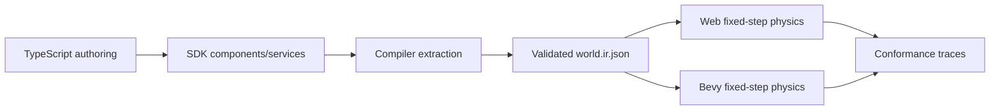
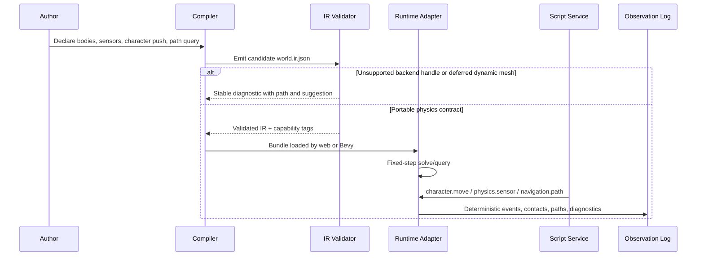

# V9-02 Physics Character Runtime Parity

Complexity: 12 -> HIGH mode

## Context

**Problem:** The current physics and character stack proves fixed primitive
traces, a falling-box solver slice, shape queries, and slope/step movement, but
does not yet provide enough cross-runtime behavior for common small-game
rigid-body interaction, broad sensors, object pushing, path queries, or a clear
external backend boundary.

**Files Analyzed:**

- `docs/bevy-feature-parity.md`
- `docs/PRDs/v8/README.md`
- `docs/PRDs/v8/V8-09-rigid-body-character-interaction-and-navigation.md`
- `docs/PRDs/v7/V7-02-advanced-physics-and-character-runtime-parity.md`
- `docs/STATUS.md`

**Current Behavior:**

- Box, sphere, and capsule colliders validate and participate in deterministic
  fixed traces.
- Rigid-body metadata now includes `gravityScale`, `damping`, `restitution`,
  and `friction`, with one web/native falling dynamic box against static floor
  trace.
- Collider layer/mask filters, overlap queries, shape casts, and raycast-style
  grounding have portable service traces.
- Character movement covers blocking, step offsets, ledge ungrounding,
  slope-limit ramp walkability, and moving-platform carry.
- Dynamic mesh colliders, broad sensor declarations, object pushing,
  navmesh/pathfinding, and external physics backend integration remain open.

## Integration Points

**How will this feature be reached?**

- [x] Entry point identified: SDK physics helpers, `Collider`, `RigidBody`,
  `CharacterController`, portable script service declarations, CLI bundle
  emission, fixed-step web/native runtime updates, and conformance fixtures.
- [x] Caller file identified: SDK component factories call compiler extraction;
  compiler emits `world.ir.json` and capability metadata; IR validation accepts
  or rejects physics/navigation payloads; web and Bevy fixed-step runners consume
  the validated bundle; conformance runners compare emitted observations.
- [x] Registration/wiring needed: new capability names, diagnostics, schema
  validation, compiler emission, web adapter mapping, Bevy adapter mapping,
  conformance fixture registration, V9 verification scripts, docs status, and
  parity checklist updates.

**Is this user-facing?** Yes. Game authors should be able to declare and script
common physical interactions without writing adapter-specific Three.js, Rapier,
Avian, or Bevy code.

**Full user flow:**

1. User declares primitive colliders, rigid bodies, sensors, character movement
   policy, and optional navigation areas in TypeScript.
2. The compiler extracts the declarations into validated IR and rejects
   unsupported mesh dynamics or backend handles with stable diagnostics.
3. The CLI emits the bundle and capability manifest.
4. Web and Bevy runtimes run fixed steps using the same bundle data and service
   permissions.
5. The result appears as deterministic runtime behavior and conformance
   observations in web/native traces, plus playable example evidence.

## Solution

**Approach:**

- Promote a broader primitive rigid-body solver contract for static, dynamic,
  and kinematic box/sphere/capsule bodies, covering multi-body contact,
  stacking, bounce, friction, sleeping/settling, and deterministic event order.
- Promote broad sensor declarations as first-class non-solid volumes with
  enter/stay/exit phases, layer/mask filtering, tracked occupants, and script
  service visibility.
- Promote character interaction volumes and constrained object pushing as
  explicit character-controller behavior, with authored push policy and
  deterministic mass/velocity limits.
- Promote constrained navigation/pathfinding behavior through portable static
  navigation regions and path-query traces, while deferring full dynamic navmesh
  baking.
- Document an external physics backend strategy that keeps third-party backend
  dependencies adapter-private until a future capability-gated backend can prove
  web/native parity.



**Key Decisions:**

- [x] Library/framework choices: keep the portable contract backend-neutral;
  use the existing in-repo deterministic primitive physics path where possible,
  and allow adapter-private acceleration only behind identical observations.
- [x] Error-handling strategy: unsupported dynamic mesh collider behavior,
  direct backend handles, non-deterministic solver settings, and dynamic navmesh
  mutation fail validation with stable `TN_IR_*` diagnostics.
- [x] Reused utilities: reuse existing collider validation, capability manifest
  derivation, physics service permission checks, conformance fixture layout,
  web/native effect logs, and V8 rigid-body primitive verification structure.

**Data Changes:** Extend existing IR schemas only. No database migrations.

## Scope and Deferrals

### Promoted in V9-02

- `P1` Full rigid-body solver parity beyond the current primitive falling-box
  trace, scoped to primitive box/sphere/capsule colliders and deterministic
  small-game cases.
- `P1` Broad sensors beyond current trigger/overlap scope.
- `P1` Character interaction volumes and object pushing.
- `P1` Navmesh/pathfinding behavior, scoped to static portable navigation
  regions and fixed path-query traces.
- `P1` External physics backend integration strategy, scoped to docs,
  diagnostics, capability boundaries, and adapter-private implementation rules.

### Explicitly Deferred or Split

- `P2` Dynamic mesh colliders are deferred. Promotion criteria: deterministic
  static concave mesh collision can be validated from bundle mesh assets,
  dynamic triangle mesh behavior has matching web/native narrow-phase results,
  fixture performance remains bounded, and diagnostics distinguish static mesh
  terrain from unsupported dynamic mesh bodies.
- Full navmesh baking, dynamic obstacle rebaking, crowd simulation, avoidance,
  off-mesh links, and arbitrary sloped mesh terrain are deferred. Promotion
  criteria: an authored or generated navmesh format can round-trip through IR,
  both runtimes produce identical paths for the same start/goal/cost inputs, and
  path failures expose stable reason codes.
- Joints, constraints, continuous collision detection, soft bodies, ragdolls,
  fluids, vehicles, per-backend solver handles, and custom physics plugins are
  deferred. Promotion criteria: a narrow portable behavior exists with accepted
  and rejected fixtures plus web/native evidence.

## Sequence Flow



## Execution Phases

#### Phase 1: Multi-Body Primitive Solver Contract - Authors can declare portable primitive body interactions beyond one falling-box trace.

**Files (max 5):**

- `packages/sdk/src/physics.ts` - expose any missing authored solver fields and
  document primitive-only support in types/comments.
- `packages/ir/src/schemas/world.ts` - validate promoted primitive body,
  material, sleep, and solver-policy fields.
- `packages/compiler/src/physics.ts` - emit new fields and manifest
  capabilities from SDK declarations.
- `packages/ir/fixtures/conformance/v9-physics-character/` - add accepted and
  rejected solver fixtures.
- `docs/scripting-api.md` - document stable authoring and service semantics.

**Implementation:**

- [ ] Promote deterministic primitive body interactions for static, dynamic,
  and kinematic box/sphere/capsule bodies.
- [ ] Validate finite mass, inverse-mass rules, velocity/angular-velocity,
  gravity scale, damping, restitution, friction, sleep threshold, and solver
  iteration policy within bounded portable ranges.
- [ ] Reject cylinder/mesh dynamics, constraints, backend-specific handles,
  unbounded solver iterations, and nondeterministic settings with stable
  diagnostics.
- [ ] Emit capabilities such as `physics:primitive-solver-v2` only when the
  bundle uses the promoted contract.

**Tests Required:**

| Test File | Test Name | Assertion |
|-----------|-----------|-----------|
| `packages/ir/src/__tests__/physics-solver-v9.test.ts` | `should accept primitive dynamic and kinematic bodies when fields are bounded` | Valid bundle includes `physics:primitive-solver-v2`. |
| `packages/ir/src/__tests__/physics-solver-v9.test.ts` | `should reject dynamic mesh colliders when solver parity is requested` | Diagnostic code and path identify the unsupported collider. |
| `packages/compiler/src/__tests__/physics-solver-v9.test.ts` | `should emit solver material and sleep metadata when authored` | Emitted `world.ir.json` preserves deterministic values. |

**Verification Plan:**

1. **Unit Tests:** run IR and compiler tests listed above.
2. **Integration Test:** compile the accepted fixture and validate the emitted
   bundle.
3. **Evidence Required:** diagnostics include code, severity, path, value or
   limit where relevant, and suggested fix.

**User Verification:**

- Action: build the V9 accepted solver fixture with the CLI.
- Expected: bundle validation passes and capability manifest advertises the
  promoted primitive solver without claiming mesh dynamics.

**Checkpoint:** Spawn `prd-work-reviewer` for phase 1 and continue only after
PASS.

#### Phase 2: Runtime Solver Parity - Web and Bevy produce matching fixed-step primitive contact traces.

**Files (max 5):**

- `packages/runtime-web-three/src/physics/primitive-solver.ts` - implement or
  extend deterministic multi-body primitive solving.
- `packages/runtime-web-three/src/physics/primitive-solver.test.ts` - cover
  web stacking, bounce, friction, and event ordering.
- `runtime-bevy/crates/threenative_runtime/src/physics.rs` - map the same
  solver contract into native runtime behavior.
- `runtime-bevy/crates/threenative_runtime/tests/physics_v9.rs` - cover native
  trace behavior.
- `scripts/verify-v9-physics-character.mjs` - compare web/native solver traces
  and write artifacts.

**Implementation:**

- [ ] Produce matching fixed-step traces for stacked boxes, sphere bounce,
  capsule slide, kinematic platform contact, resting contact, and friction
  slowdown.
- [ ] Preserve deterministic contact ordering for simultaneous contacts using
  stable entity IDs and contact type ordering.
- [ ] Emit web/native artifacts under
  `artifacts/conformance/v9-physics-character/solver/`.
- [ ] Fail the verification script on drift outside documented numeric
  tolerances.

**Tests Required:**

| Test File | Test Name | Assertion |
|-----------|-----------|-----------|
| `packages/runtime-web-three/src/physics/primitive-solver.test.ts` | `should settle stacked primitive bodies when contact order is deterministic` | Final positions and contact events match snapshots. |
| `packages/runtime-web-three/src/physics/primitive-solver.test.ts` | `should apply restitution and friction when dynamic sphere hits static floor` | Bounce height and lateral velocity are within tolerance. |
| `runtime-bevy/crates/threenative_runtime/tests/physics_v9.rs` | `should emit v9 primitive solver trace matching fixture expectations` | Native observation JSON matches expected ordering and tolerances. |

**Verification Plan:**

1. **Unit Tests:** web primitive solver tests.
2. **Integration Tests:** native Rust tests and fixture bundle validation.
3. **Conformance Proof:**
   ```bash
   pnpm verify:v9:physics-character
   ```
   Expected: solver diff report passes and writes web/native/diff artifacts.
4. **Evidence Required:** report includes fixed delta, frame count, tolerance
   policy, contact count, body count, and any skipped deferred cases.

**User Verification:**

- Action: run the V9 physics-character verifier.
- Expected: web and Bevy solver traces match for promoted primitive cases.

**Checkpoint:** Spawn `prd-work-reviewer` for phase 2 and continue only after
PASS.

#### Phase 3: Broad Sensors and Interaction Volumes - Characters and scripts can observe non-solid volumes portably.

**Files (max 5):**

- `packages/sdk/src/physics.ts` - add sensor and interaction-volume authoring
  helpers if missing.
- `packages/ir/src/schemas/world.ts` - validate sensor shape, occupant policy,
  phase policy, layer/mask, and script service permissions.
- `packages/runtime-web-three/src/physics/sensors.ts` - emit deterministic web
  sensor observations.
- `runtime-bevy/crates/threenative_runtime/src/physics_sensors.rs` - emit
  deterministic native sensor observations.
- `packages/ir/fixtures/conformance/v9-physics-character/sensors/` - add
  accepted/rejected sensor fixtures.

**Implementation:**

- [ ] Promote broad sensors as explicit non-solid colliders with
  `enter`/`stay`/`exit`, occupant snapshots, layer/mask filters, and stable
  sort order.
- [ ] Add interaction-volume metadata for use prompts, pickup zones, hazards,
  checkpoints, and scripted proximity triggers.
- [ ] Allow scripts to request sensor snapshots only when declared permissions
  are present.
- [ ] Reject mesh sensors, unbounded occupant histories, and sensor callbacks
  that bypass the fixed event queue.

**Tests Required:**

| Test File | Test Name | Assertion |
|-----------|-----------|-----------|
| `packages/ir/src/__tests__/physics-sensors-v9.test.ts` | `should accept primitive interaction volumes with occupant limits` | Valid IR preserves phase and filter metadata. |
| `packages/ir/src/__tests__/physics-sensors-v9.test.ts` | `should reject mesh sensors when broad sensor parity is requested` | Stable diagnostic suggests primitive sensor alternatives. |
| `packages/runtime-web-three/src/physics/sensors.test.ts` | `should emit enter stay and exit phases when body crosses sensor volume` | Event order and occupant snapshots are deterministic. |
| `runtime-bevy/crates/threenative_runtime/tests/physics_sensors_v9.rs` | `should emit native sensor phases matching fixture expectations` | Native JSON matches expected phase sequence. |

**Verification Plan:**

1. **Unit Tests:** IR sensor validation and web sensor tests.
2. **Integration Tests:** native sensor tests and conformance fixture compare.
3. **Conformance Proof:** `pnpm verify:v9:physics-character` includes
   `sensors/web-sensors.json`, `sensors/native-sensors.json`, and
   `sensors/sensor-diff.json`.
4. **Evidence Required:** reports include filtered-out entities and ordered
   occupant IDs so layer/mask behavior is inspectable.

**User Verification:**

- Action: run the V9 sensor fixture and inspect the artifact report.
- Expected: both runtimes emit the same interaction-volume phases and occupant
  snapshots.

**Checkpoint:** Spawn `prd-work-reviewer` for phase 3 and continue only after
PASS.

#### Phase 4: Character Object Pushing - Character movement can push constrained primitive dynamic objects.

**Files (max 5):**

- `packages/sdk/src/character.ts` - expose push policy and interaction-volume
  references on `CharacterController`.
- `packages/ir/src/schemas/world.ts` - validate character push policy,
  pushable tags, mass limits, and solver dependencies.
- `packages/runtime-web-three/src/character-controller.ts` - apply fixed-step
  push behavior and emit observations.
- `runtime-bevy/crates/threenative_runtime/src/character.rs` - apply native
  push behavior and emit observations.
- `examples/v9-physics-character/` - provide a playable crate-pushing and
  trigger-zone scene.

**Implementation:**

- [ ] Add `pushPolicy` with enabled flag, max push mass, impulse scale, allowed
  layers, minimum movement speed, and blocked-when-too-heavy behavior.
- [ ] Move push resolution through the existing fixed-step character movement
  service so scripts call `ctx.character.move` rather than backend-specific
  force APIs.
- [ ] Emit observations for blocked, pushed, too-heavy, sensor-enter, and
  interaction-available states.
- [ ] Keep pushed objects primitive-only and reject pushing kinematic/static
  bodies unless explicitly configured as movable platforms.

**Tests Required:**

| Test File | Test Name | Assertion |
|-----------|-----------|-----------|
| `packages/ir/src/__tests__/character-push-v9.test.ts` | `should accept character push policy when primitive solver capability is present` | Valid bundle includes character push capability. |
| `packages/ir/src/__tests__/character-push-v9.test.ts` | `should reject push policy when target layer can include mesh dynamic bodies` | Diagnostic identifies incompatible target. |
| `packages/runtime-web-three/src/character-controller.test.ts` | `should push light dynamic box and stop at heavy box when moving character` | Observations distinguish pushed and blocked states. |
| `runtime-bevy/crates/threenative_runtime/tests/character_push_v9.rs` | `should emit native character push trace matching web fixture` | Native trace matches ordered expected observations. |

**Verification Plan:**

1. **Unit Tests:** IR and web character-controller tests.
2. **Integration Tests:** native character push tests and CLI build for
   `examples/v9-physics-character`.
3. **Playtest Proof:** run web and Bevy preview for the example and compare
   effect logs captured by the verifier.
4. **Evidence Required:** `artifacts/conformance/v9-physics-character/push/`
   contains web/native/diff reports plus example bundle validation output.

**User Verification:**

- Action: run the example and move the character into a light crate, a heavy
  crate, and an interaction volume.
- Expected: light crate moves, heavy crate blocks or resists according to
  policy, and interaction volume events match in both runtimes.

**Manual Checkpoint Required:** Because this phase changes playable character
behavior, perform automated checkpoint plus manual web/native example playtest.

**Checkpoint:** Spawn `prd-work-reviewer` for phase 4 and continue only after
PASS and manual verification evidence is recorded.

#### Phase 5: Static Pathfinding Contract and Backend Boundary - Path queries work for bounded static navigation while backend-specific physics remains private.

**Files (max 5):**

- `packages/sdk/src/navigation.ts` - add static navigation-region and path-query
  authoring helpers.
- `packages/ir/src/schemas/navigation.ts` - validate static nav regions,
  agent radius, area costs, start/goal bounds, and unsupported dynamic navmesh
  features.
- `packages/runtime-web-three/src/navigation.ts` - implement deterministic
  path queries for promoted static regions.
- `runtime-bevy/crates/threenative_runtime/src/navigation.rs` - implement the
  same native path-query observations.
- `docs/runtime-backends.md` - document external physics backend strategy and
  non-portable backend-handle diagnostics.

**Implementation:**

- [ ] Promote static navigation regions made of authored convex polygons or
  generated primitive walkable surfaces with stable IDs, area costs, and agent
  radius constraints.
- [ ] Add `navigation.path` service permission and deterministic response shape:
  status, path points, visited region IDs, total cost, and failure reason.
- [ ] Reject dynamic obstacle rebaking, crowd steering, off-mesh links, backend
  navmesh handles, and arbitrary mesh terrain navigation.
- [ ] Document that external physics libraries may be used inside adapters only
  when they preserve the exact portable IR contract and conformance artifacts;
  public third-party handles remain unsupported until a future backend PRD.

**Tests Required:**

| Test File | Test Name | Assertion |
|-----------|-----------|-----------|
| `packages/ir/src/__tests__/navigation-v9.test.ts` | `should accept static navigation regions with bounded agent radius and area costs` | Valid IR preserves ordered region metadata. |
| `packages/ir/src/__tests__/navigation-v9.test.ts` | `should reject backend navmesh handles and dynamic rebake requests` | Diagnostics point to unsupported fields. |
| `packages/runtime-web-three/src/navigation.test.ts` | `should return shortest deterministic path across static regions` | Path points, region IDs, and total cost match expected. |
| `runtime-bevy/crates/threenative_runtime/tests/navigation_v9.rs` | `should emit native path query trace matching web fixture` | Native path response matches web report. |

**Verification Plan:**

1. **Unit Tests:** navigation validation and web pathfinding tests.
2. **Integration Tests:** native navigation tests and rejected fixture
   diagnostic assertions.
3. **Conformance Proof:** `pnpm verify:v9:physics-character` includes
   navigation artifacts and backend-boundary diagnostic fixtures.
4. **Evidence Required:** docs explain supported portable path behavior,
   explicit deferrals, and promotion criteria for external backends.

**User Verification:**

- Action: build the V9 example and request paths across the static navigation
  regions through a declared script service.
- Expected: both runtimes return the same path, and unsupported dynamic/backend
  declarations fail before runtime.

**Manual Checkpoint Required:** Because this phase includes external backend
strategy and path behavior, perform automated checkpoint plus a manual review of
the backend-boundary documentation and artifact reports.

**Checkpoint:** Spawn `prd-work-reviewer` for phase 5 and continue only after
PASS and manual verification evidence is recorded.

#### Phase 6: Release Gate and Drift Tracking - V9 physics-character parity is documented and release-gated.

**Files (max 5):**

- `package.json` - add `verify:v9:physics-character` script.
- `docs/STATUS.md` - update current V9 physics-character status and evidence
  anchors.
- `docs/bevy-feature-parity.md` - check promoted P1 items and keep deferred
  P2/P3 items explicit.
- `docs/PRDs/v9/README.md` - register V9-02 and gate command if a V9 index now
  exists.
- `artifacts/conformance/v9-physics-character/verification-report.json` -
  generated evidence output from the verifier.

**Implementation:**

- [ ] Add the aggregate verifier script to package scripts and make it run all
  accepted/rejected fixture checks required by this PRD.
- [ ] Update `docs/STATUS.md` before or with release-gate changes so future
  agents can discover the current implementation front door.
- [ ] Update `docs/bevy-feature-parity.md` to mark only the P1 items actually
  proven by V9-02 and leave dynamic mesh colliders unchecked with promotion
  criteria.
- [ ] Write a verification report that records commands, artifact paths,
  promoted checklist items, deferred checklist items, and numeric tolerance
  policy.

**Tests Required:**

| Test File | Test Name | Assertion |
|-----------|-----------|-----------|
| `scripts/__tests__/verify-v9-physics-character.test.ts` | `should fail when any web native physics-character artifact drifts` | Non-zero exit and report include drift path. |
| `scripts/__tests__/verify-v9-physics-character.test.ts` | `should record promoted and deferred checklist items in the report` | Report metadata lists exact checklist IDs. |

**Verification Plan:**

1. **Unit Tests:** verifier script tests.
2. **Integration Tests:** full V9 physics-character verifier.
3. **Docs Gate:** run any available V9 docs guard, or add one if V9 aggregate
   docs validation exists by implementation time.
4. **Evidence Required:** final report links the PRD phases to passing
   artifacts and docs updates.

**User Verification:**

- Action: run `pnpm verify:v9:physics-character`.
- Expected: all promoted solver, sensor, push, path, and diagnostic fixtures
  pass, and docs match the implemented checklist state.

**Checkpoint:** Spawn `prd-work-reviewer` for phase 6 and continue only after
PASS.

## Checkpoint Protocol

This PRD is HIGH complexity. Each phase requires the automated checkpoint:

```txt
Use Task tool with:
- subagent_type: "prd-work-reviewer"
- prompt: "Review checkpoint for phase N of PRD at docs/PRDs/v9/V9-02-physics-character-runtime-parity.md"
```

Proceed to the next phase only when the reviewer reports PASS. Phases 4 and 5
also require manual checkpoint evidence because they affect playable character
behavior and external backend strategy.

## Verification Strategy

**Primary Gate:**

```bash
pnpm verify:v9:physics-character
```

The gate must build the V9 physics-character fixture or example, validate
accepted and rejected bundles, run web runtime tests, run native Rust tests,
compare web/native conformance observations, and write a complete report under
`artifacts/conformance/v9-physics-character/verification-report.json`.

**Narrow Commands:**

```bash
pnpm --filter @threenative/ir test
pnpm --filter @threenative/compiler test
pnpm --filter @threenative/runtime-web-three test
cd runtime-bevy && cargo test
pnpm verify:conformance
```

**Evidence Required:**

- Solver artifacts for stacking, bounce, friction, kinematic platform contact,
  resting contact, and deterministic contact ordering.
- Sensor artifacts for enter/stay/exit, occupant snapshots, filtering, and
  permission-gated service access.
- Character push artifacts for light-object push, heavy-object block/resist,
  interaction-volume availability, and fixed-step event ordering.
- Navigation artifacts for successful path, unreachable goal, invalid start or
  goal, area-cost selection, and rejected dynamic/backend navmesh declarations.
- Diagnostics artifacts for dynamic mesh colliders, backend physics handles,
  unsupported solver features, and unsupported dynamic navigation.

## Acceptance Criteria

- [ ] All phases complete.
- [ ] All specified tests pass.
- [ ] `pnpm verify:v9:physics-character` passes.
- [ ] `pnpm verify:conformance` passes or any unrelated existing failures are
  documented with exact commands and output.
- [ ] All automated checkpoint reviews pass; manual checkpoints for phases 4
  and 5 are recorded.
- [ ] Feature is reachable through SDK declarations, compiler emission, CLI
  bundles, fixed-step runtime adapters, script services, and conformance
  fixtures.
- [ ] P1 rigid-body solver parity is promoted beyond the falling-box trace for
  primitive small-game cases.
- [ ] P1 broad sensors are promoted beyond existing trigger/overlap traces.
- [ ] P1 character interaction volumes and object pushing are promoted.
- [ ] P1 static pathfinding behavior is promoted with explicit limits.
- [ ] P1 external physics backend integration strategy is documented and
  enforced through diagnostics.
- [ ] P2 dynamic mesh colliders remain unchecked unless the promotion criteria
  in this PRD are satisfied by implementation evidence.
- [ ] `docs/STATUS.md` and `docs/bevy-feature-parity.md` are updated in the
  implementation change that completes this version-scoped work.

