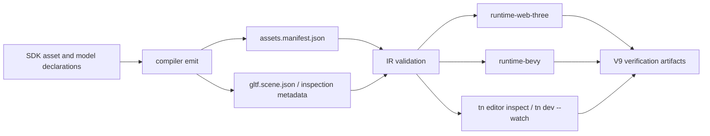
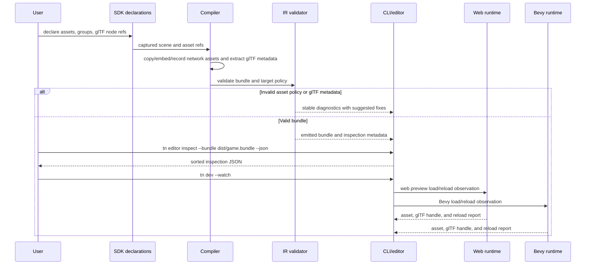

# V9-03 Assets, glTF, and Scene Workflow

Complexity: 10 -> HIGH mode

## Complexity Assessment

- +3 Touches 10+ files across SDK, IR, compiler, CLI, web runtime, Bevy
  runtime, fixtures, scripts, examples, and docs.
- +2 New asset workflow surfaces for source modes, glTF metadata, scene
  inspection, and watch/reload reports.
- +2 Complex state logic for dev-time file watching, reload classification, and
  state-preserving reload boundaries.
- +2 Multi-package changes across TypeScript packages and Rust runtime crates.
- +1 External API integration for explicitly declared web/network asset loading
  in web previews.

## Context

**Problem:** V8 proved deterministic bundle-local asset load traces, but authors
still lack a coherent asset workflow for embedded/network sources, glTF
metadata, spawned scene handles, editor inspection, file-watch diagnostics, and
reload behavior.

**Files Analyzed:**

- `docs/bevy-feature-parity.md`
- `docs/PRDs/v8/README.md`
- `docs/PRDs/v8/V8-10-asset-load-sync-gltf-scene-access-and-inspection.md`
- `docs/PRDs/v3/V3-01-scene-asset-bundling-and-budgets.md`
- `docs/PRDs/v6/V6-08-asset-and-diagnostic-hardening.md`
- `docs/PRDs/v8/V8-01-editor-project-snapshot-and-structured-diffs.md`
- `docs/PRDs/v8/V8-18-editor-debugging-diagnostics-packaging-performance-support.md`
- `docs/STATUS.md`
- `package.json`
- `scripts/verify-v8-asset-load-gltf-inspection.mjs`
- `packages/sdk/src/assets.ts`
- `packages/ir/src/types.ts`
- `packages/cli/src/commands/editor.ts`
- `packages/runtime-web-three/src/assets.ts`
- `runtime-bevy/crates/threenative_runtime/src/assets.rs`

**Current Behavior:**

- Bundle-local glTF/GLB assets, `.bin` files, and texture dependencies are
  promoted for the existing bundle workflow.
- Web and Bevy emit matching `threenative.asset-load-sync-trace` reports for
  bundle-local path assets and environment model scene references.
- Editor snapshot/apply/diff commands operate on structured bundle JSON, but
  there is no scene inspection command or asset-specific inspection report.
- STATUS explicitly says public asset groups, spawned glTF node query/update
  handles, material override handles, editor inspection commands, watch
  diagnostics, and state-preserving hot reload remain future work.
- Network/file asset loading and custom runtime asset loaders were previously
  listed as unsupported for arbitrary scripting escape hatches; V9 must promote
  only declared, validated asset sources.

## Integration Points

**How will this feature be reached?**

- [x] Entry point identified: SDK asset helpers, `tn build`, `tn dev --watch`,
  `tn editor inspect --bundle <path>`, web preview bundle loading, Bevy runtime
  bundle loading, and `pnpm verify:v9:assets-gltf-scene-workflow`.
- [x] Caller file identified: `packages/sdk/src/assets.ts`,
  compiler asset/bundle emitters, `packages/ir/src/assets.ts` and validation,
  `packages/cli/src/commands/editor.ts`, future CLI dev/watch command wiring,
  `packages/runtime-web-three/src/assets.ts`,
  `runtime-bevy/crates/threenative_runtime/src/assets.rs`, runtime rendering
  scene-spawn code, conformance fixtures, and verification scripts.
- [x] Registration/wiring needed: asset source-mode schema fields, asset groups,
  glTF metadata extraction, spawned-node handle registry, scene inspection JSON
  entry point, watch/reload diagnostic codes, web/Bevy observation reports,
  conformance fixture catalog entries, package scripts, and parity/status docs.

**Is this user-facing?**

- [x] YES -> CLI/editor workflow and runtime authoring APIs are user-facing.
  Required user surfaces are `tn editor inspect`, `tn dev --watch` diagnostics,
  SDK asset declarations, web preview source policy, and optional structured
  JSON that future editor panels can render.
- [ ] NO -> Not applicable.

**Full user flow:**

1. User declares local, embedded, or web-hosted model/texture assets through SDK
   helpers and optionally groups them into an asset barrier.
2. `tn build` captures declarations, validates source policies, extracts
   supported glTF metadata, emits `assets.manifest.json`, and fails unsupported
   assets with stable diagnostics before runtime.
3. User runs `tn editor inspect --bundle dist/game.bundle --json`.
4. CLI reads bundle JSON and emitted inspection metadata, then returns sorted
   assets, dependencies, source modes, glTF nodes, extras, custom attributes,
   scene instances, diagnostics, and reachable update handles.
5. User runs `tn dev --watch`; changing an asset triggers rebuild/reload
   diagnostics that classify the change as live-reloadable,
   rebuild-required, state-preserving reload, or unsupported.
6. Web and Bevy runtimes consume the same bundle contract and emit matching
   observations for load barriers, glTF scene handles, node updates, and reload
   policy.

## Solution

**Approach:**

- Promote a declared asset source policy: `bundle` for copied files,
  `embedded` for bounded inline payloads, and `network` for explicit web-only or
  cached sources with target-profile diagnostics.
- Extend asset groups/barriers from V8 trace evidence into SDK/IR/compiler
  declarations that both runtimes observe deterministically.
- Extract portable glTF metadata into bundle data: named nodes, mesh/material
  references, selected `extras`, and custom vertex attribute declarations.
- Add stable spawned glTF scene handles for named-node query/update operations:
  transform, visibility, material override, and metadata lookup.
- Build a structured scene inspection workflow and dev-time watch/reload policy
  over bundle data, not raw Three.js or Bevy state.



**Key Decisions:**

- [x] Library/framework choices: use existing TypeScript SDK/IR/compiler/CLI
  patterns and Bevy 0.14 `AssetServer`/glTF scene spawning; no new editor UI
  framework is required for this PRD.
- [x] Error-handling strategy: unsupported or ambiguous assets fail with stable
  diagnostics containing code, severity, bundle-relative path, asset ID, target,
  and suggested fix.
- [x] Reused utilities: extend existing asset manifest validation, editor
  snapshot helpers, conformance reports, `traceAssetLoadSynchronization`, and
  native asset trace binary instead of adding parallel formats.

**Data Changes:**

- Add asset source metadata to `assets.manifest.json`: `sourceMode`,
  `embedded`, `network`, `integrity`, `cachePolicy`, and bounded size fields.
- Add asset groups/barriers: id, required asset IDs, optional assets, failure
  policy, timeout policy, and deterministic observation shape.
- Add glTF metadata document or manifest extension for named nodes, extras,
  custom vertex attributes, mesh/material refs, and spawned-handle eligibility.
- Add scene inspection JSON schema, either as a CLI output-only schema or a
  bundle entry when produced during build.
- Add watch/reload diagnostic report shape with change classification and
  state-preservation eligibility.

## Sequence Flow



## Execution Phases

#### Phase 1: Declared Asset Sources and Groups - Authors can build local, embedded, and web-hosted assets through one manifest contract

**Files (max 5):**

- `packages/sdk/src/assets.ts` - add `embeddedAsset`, network source options,
  and `assetGroup` declarations.
- `packages/ir/src/types.ts` - add asset source-mode and group types.
- `packages/ir/src/assets.ts` - validate source modes, groups, sizes, and target
  policy.
- `packages/ir/src/assets.test.ts` - accepted/rejected source-mode and group
  tests.
- `packages/compiler/src/assets.ts` - emit copied, embedded, and network source
  manifest entries deterministically.

**Implementation:**

- [ ] Add explicit `sourceMode: "bundle" | "embedded" | "network"` to emitted
  asset entries while defaulting current path assets to `bundle`.
- [ ] Support bounded embedded payloads for small JSON/text/binary-safe assets
  using base64 or JSON-safe inline data with `byteLength`, `mediaType`, and
  optional hash metadata.
- [ ] Support declared network URLs only when the target profile allows network
  assets; require `https`, optional integrity, and cache policy.
- [ ] Add `assetGroup(id, { required, optional, failurePolicy, timeoutMs })`
  metadata and promote `bundle.requiredAssets` as the default group.
- [ ] Reject source paths outside asset roots, unbounded embedded payloads,
  network assets on native-only/offline profiles, duplicate group IDs, and group
  refs to unknown assets.

**Tests Required:**

| Test File | Test Name | Assertion |
| --- | --- | --- |
| `packages/ir/src/assets.test.ts` | `should accept embedded assets within the configured byte limit` | Validation succeeds and preserves `byteLength`, `mediaType`, and hash metadata. |
| `packages/ir/src/assets.test.ts` | `should reject network assets when target profile disallows remote sources` | Diagnostic includes asset ID, target, URL, and suggested local-bundle fix. |
| `packages/ir/src/assets.test.ts` | `should reject asset groups that reference unknown required assets` | Diagnostic path points to the group required asset entry. |
| `packages/compiler/src/assets.test.ts` | `should emit asset source modes and groups deterministically` | Repeated builds produce byte-stable manifest JSON. |

**Verification Plan:**

1. **Unit Tests:**
   - File: `packages/ir/src/assets.test.ts`
   - Tests: `should accept embedded assets within the configured byte limit`,
     `should reject network assets when target profile disallows remote sources`,
     `should reject asset groups that reference unknown required assets`
2. **Integration Tests:**
   - File: `packages/compiler/src/assets.test.ts`
   - Tests: `should emit asset source modes and groups deterministically`
3. **Command Proof:**

   ```bash
   pnpm --filter @threenative/ir test -- --run assets
   pnpm --filter @threenative/compiler test -- --run assets
   ```

4. **Evidence Required:**
   - [ ] Manifest fixture contains `bundle`, `embedded`, and allowed `network`
     source modes.
   - [ ] Invalid network and embedded cases fail before runtime.
   - [ ] Asset group ordering is deterministic.

**User Verification:**

- Action: Build a fixture with one embedded metadata asset, one bundle-local
  glTF, and one allowed web texture.
- Expected: `assets.manifest.json` records all source modes, `bundle.requiredAssets`
  waits for required assets, and an offline target rejects the web texture.

**Checkpoint:**

- Automated: run `prd-work-reviewer` for Phase 1 of
  `docs/PRDs/v9/V9-03-assets-gltf-scene-workflow.md` and continue only after
  PASS.
- Manual: not required.

#### Phase 2: glTF Metadata Extraction - Extras and custom vertex attributes are inspectable without becoming source code

**Files (max 5):**

- `packages/compiler/src/gltf/metadata.ts` - parse glTF/GLB metadata and extract
  supported nodes, extras, mesh refs, material refs, and custom attributes.
- `packages/compiler/src/gltf/metadata.test.ts` - extraction and rejection
  tests.
- `packages/ir/src/gltfScene.ts` - schema and validation for portable glTF
  metadata.
- `packages/ir/src/gltfScene.test.ts` - metadata validation tests.
- `packages/ir/src/index.ts` - export metadata validation helpers.

**Implementation:**

- [ ] Extract named nodes with stable paths, parent path, mesh refs, material
  refs, local transform, and spawned-handle eligibility.
- [ ] Preserve glTF `extras` only when JSON-serializable and under configured
  size/depth limits; reject functions, binary blobs, and cyclic data.
- [ ] Promote custom vertex attribute declarations as metadata:
  attribute name, item size, component type, normalized flag, target mesh, and
  shader-consumption status.
- [ ] Do not promote arbitrary glTF extensions, materials, or shader behavior;
  unsupported fields produce diagnostics or inspection-only metadata.
- [ ] Emit metadata deterministically per source asset and avoid treating glTF
  internals as generated TypeScript or Bevy source.

**Tests Required:**

| Test File | Test Name | Assertion |
| --- | --- | --- |
| `packages/compiler/src/gltf/metadata.test.ts` | `should extract named gltf nodes and extras deterministically` | Output node paths and extras are sorted and stable across runs. |
| `packages/compiler/src/gltf/metadata.test.ts` | `should report custom vertex attributes as inspection metadata` | Attribute names and item sizes are emitted without claiming shader support. |
| `packages/ir/src/gltfScene.test.ts` | `should reject oversized gltf extras` | Diagnostic includes asset ID, node path, byte limit, and suggested fix. |
| `packages/ir/src/gltfScene.test.ts` | `should reject duplicate spawned handle paths` | Diagnostic points to the duplicate node metadata. |

**Verification Plan:**

1. **Unit Tests:**
   - File: `packages/compiler/src/gltf/metadata.test.ts`
   - Tests: `should extract named gltf nodes and extras deterministically`,
     `should report custom vertex attributes as inspection metadata`
2. **Validation Tests:**
   - File: `packages/ir/src/gltfScene.test.ts`
   - Tests: `should reject oversized gltf extras`, `should reject duplicate
     spawned handle paths`
3. **Command Proof:**

   ```bash
   pnpm --filter @threenative/compiler test -- --run gltf
   pnpm --filter @threenative/ir test -- --run gltf
   ```

4. **Evidence Required:**
   - [ ] Fixture glTF metadata output is sorted by asset ID and node path.
   - [ ] Extras/custom attributes appear in inspection data but do not imply
     custom shader support.
   - [ ] Unsupported metadata has explicit diagnostics.

**User Verification:**

- Action: Add a named node with `extras: { gameplayTag: "door" }` and a custom
  mesh attribute to the fixture glTF, then run build.
- Expected: Inspection metadata shows the extras and attribute declaration; no
  custom shader capability is advertised.

**Checkpoint:**

- Automated: run `prd-work-reviewer` for Phase 2 of this PRD and continue only
  after PASS.
- Manual: not required.

#### Phase 3: Spawned glTF Scene Handles - Gameplay can query and update named model nodes portably

**Files (max 5):**

- `packages/sdk/src/gltfScene.ts` - authoring helpers for model node handles and
  allowed operations.
- `packages/ir/src/gltfSceneHandles.ts` - handle operation types and validation.
- `packages/runtime-web-three/src/gltfSceneHandles.ts` - web registry and
  transform/visibility/material update mapping.
- `runtime-bevy/crates/threenative_runtime/src/gltf_scene_handles.rs` - Bevy
  registry and update observation mapping.
- `packages/ir/fixtures/conformance/v9-assets-gltf-scene-workflow/game.bundle`
  - fixture with named glTF nodes and update operations.

**Implementation:**

- [ ] Add stable handle IDs for `(assetId, instanceId, nodePath)` and expose
  query results for found/missing/ambiguous nodes.
- [ ] Support portable operations for transform override, visibility override,
  material override to an existing portable material, and extras lookup.
- [ ] Apply updates after glTF scene spawn/load barrier resolution and report
  deferred operations until the barrier is ready.
- [ ] Reject ambiguous duplicate node names unless the author uses full node
  paths.
- [ ] Emit matching web/native observations for handle resolution, before/after
  transform, visibility, material override, and failure diagnostics.

**Tests Required:**

| Test File | Test Name | Assertion |
| --- | --- | --- |
| `packages/ir/src/gltfSceneHandles.test.ts` | `should validate transform visibility and material update operations` | Valid operations preserve sorted handle IDs and refs. |
| `packages/ir/src/gltfSceneHandles.test.ts` | `should reject ambiguous gltf node handle refs` | Diagnostic suggests using the full node path. |
| `packages/runtime-web-three/src/gltfSceneHandles.test.ts` | `should update spawned gltf node transform and visibility` | Web observation records before/after values for the named node. |
| `runtime-bevy/crates/threenative_runtime/tests/gltf_scene_handles.rs` | `should resolve and update spawned gltf scene handles` | Native observation matches handle IDs and update results. |

**Verification Plan:**

1. **Unit Tests:**
   - File: `packages/ir/src/gltfSceneHandles.test.ts`
   - Tests: `should validate transform visibility and material update
     operations`, `should reject ambiguous gltf node handle refs`
2. **Runtime Tests:**
   - File: `packages/runtime-web-three/src/gltfSceneHandles.test.ts`
   - File: `runtime-bevy/crates/threenative_runtime/tests/gltf_scene_handles.rs`
3. **Conformance Proof:**

   ```bash
   pnpm verify:conformance
   cd runtime-bevy && cargo test gltf_scene_handles
   ```

4. **Evidence Required:**
   - [ ] Web and Bevy reports use the same handle IDs and update result shape.
   - [ ] Missing and ambiguous handle refs fail with stable diagnostics.
   - [ ] Material overrides only reference portable material IDs.

**User Verification:**

- Action: Run the V9 fixture and update a named `Door` node visibility from
  true to false through the declared handle operation.
- Expected: Web and Bevy reports show the same handle resolution and visibility
  transition.

**Checkpoint:**

- Automated: run `prd-work-reviewer` for Phase 3 of this PRD and continue only
  after PASS.
- Manual: not required.

#### Phase 4: Scene Inspection Command - Bundle contents and spawned glTF metadata are available as deterministic JSON

**Files (max 5):**

- `packages/ir/src/sceneInspection.ts` - inspection report schema and
  deterministic builder over bundle JSON.
- `packages/ir/src/sceneInspection.test.ts` - report shape and sorting tests.
- `packages/cli/src/commands/editor.ts` - add
  `tn editor inspect --bundle <path> [--json] [--out <path>]`.
- `packages/cli/src/commands/editor.test.ts` - CLI inspect success and
  diagnostic tests.
- `packages/cli/src/index.ts` - help text and command registration update.

**Implementation:**

- [ ] Build `threenative.scene-inspection` JSON from bundle documents:
  manifest, assets, materials, world entities, environment scene, glTF metadata,
  asset groups, diagnostics, and update handles.
- [ ] Include bundle-relative paths, asset dependencies, source modes, group
  membership, named glTF nodes, extras, custom attributes, scene instances, and
  material refs.
- [ ] Provide compact CLI output by default and full JSON with `--json` or
  `--out`.
- [ ] Keep inspection read-only; edits still flow through structured editor
  snapshots and `tn editor apply`.
- [ ] Make output deterministic so future visual editor panels can consume the
  same JSON without creating a separate source of truth.

**Tests Required:**

| Test File | Test Name | Assertion |
| --- | --- | --- |
| `packages/ir/src/sceneInspection.test.ts` | `should build deterministic scene inspection reports from bundle documents` | Asset, entity, glTF node, and diagnostic arrays are sorted. |
| `packages/ir/src/sceneInspection.test.ts` | `should include gltf extras and custom attributes in inspection output` | Report contains metadata under the owning asset and node path. |
| `packages/cli/src/commands/editor.test.ts` | `editor inspect should write structured scene inspection json` | Command exits 0, writes schema/version, and lists inspected documents. |
| `packages/cli/src/commands/editor.test.ts` | `editor inspect should return diagnostics for invalid bundles` | Command exits non-zero with stable JSON diagnostics. |

**Verification Plan:**

1. **Unit Tests:**
   - File: `packages/ir/src/sceneInspection.test.ts`
   - Tests: deterministic report and glTF metadata inclusion.
2. **CLI Tests:**
   - File: `packages/cli/src/commands/editor.test.ts`
   - Tests: inspect success and invalid bundle diagnostics.
3. **Command Proof:**

   ```bash
   pnpm --filter @threenative/ir test -- --run sceneInspection
   pnpm --filter @threenative/cli test -- --run editor
   pnpm tn -- editor inspect --bundle packages/ir/fixtures/conformance/v9-assets-gltf-scene-workflow/game.bundle --json
   ```

4. **Evidence Required:**
   - [ ] Inspection JSON uses schema `threenative.scene-inspection`.
   - [ ] Report is byte-stable for unchanged bundles.
   - [ ] Invalid bundles return diagnostics rather than partial inspection.

**User Verification:**

- Action: Run `tn editor inspect --bundle` against the V9 fixture.
- Expected: The output lists asset groups, source modes, glTF nodes, extras,
  custom attributes, scene instances, and update handles with deterministic
  ordering.

**Checkpoint:**

- Automated: run `prd-work-reviewer` for Phase 4 of this PRD and continue only
  after PASS.
- Manual: inspect the CLI JSON once to confirm it contains enough fields for a
  scene viewer/editor panel without reading runtime internals.

#### Phase 5: Dev-Time Watch and Reload Diagnostics - Asset edits produce explicit reload policy and preserve state only when safe

**Files (max 5):**

- `packages/cli/src/commands/dev.ts` - watch-mode asset change classification
  and reload diagnostics.
- `packages/cli/src/commands/dev.test.ts` - file-watch and reload-policy tests.
- `packages/ir/src/assetReload.ts` - reload report schema and validation.
- `packages/runtime-web-three/src/assetReload.ts` - web reload observation and
  state-preservation policy.
- `runtime-bevy/crates/threenative_runtime/src/asset_reload.rs` - native reload
  observation and state-preservation policy.

**Implementation:**

- [ ] Classify watched file changes as `reloadable`, `rebuildRequired`,
  `statePreservingReload`, or `unsupported`.
- [ ] Emit diagnostics for changed, missing, malformed, unsupported extension,
  network-unavailable, integrity-mismatch, and group-barrier-failed assets.
- [ ] Preserve entity/component state only when asset identity and spawned glTF
  handle topology remain stable; otherwise require rebuild or restart.
- [ ] Invalidate handle operations when a reload removes or renames a glTF node,
  and report the affected handle IDs.
- [ ] Keep current gameplay script hot-reload invalidation semantics separate
  from asset reload policy.

**Tests Required:**

| Test File | Test Name | Assertion |
| --- | --- | --- |
| `packages/cli/src/commands/dev.test.ts` | `dev watch should report reloadable texture edits` | Diagnostic classifies texture-byte changes as reloadable when refs are stable. |
| `packages/cli/src/commands/dev.test.ts` | `dev watch should require rebuild when gltf node topology changes` | Diagnostic names removed/renamed node handles and suggests rebuild. |
| `packages/ir/src/assetReload.test.ts` | `should validate state preserving reload reports` | Reports include changed assets, impacted handles, state policy, and diagnostics. |
| `runtime-bevy/crates/threenative_runtime/tests/asset_reload.rs` | `should report unsupported native network asset reload` | Native report rejects unavailable network reload with stable code. |

**Verification Plan:**

1. **Unit Tests:**
   - File: `packages/ir/src/assetReload.test.ts`
   - Tests: `should validate state preserving reload reports`
2. **CLI Integration Tests:**
   - File: `packages/cli/src/commands/dev.test.ts`
   - Tests: reloadable texture edit and rebuild-required glTF topology edit.
3. **Runtime Tests:**
   - File: `runtime-bevy/crates/threenative_runtime/tests/asset_reload.rs`
   - File: `packages/runtime-web-three/src/assetReload.test.ts`
4. **Command Proof:**

   ```bash
   pnpm --filter @threenative/cli test -- --run dev
   pnpm --filter @threenative/runtime-web-three test -- --run assetReload
   cd runtime-bevy && cargo test asset_reload
   ```

5. **Evidence Required:**
   - [ ] Watch reports distinguish reload, rebuild, and unsupported changes.
   - [ ] State-preserving reload is allowed only for stable asset and handle
     topology.
   - [ ] Web and Bevy report equivalent reload policy for the V9 fixture.

**User Verification:**

- Action: Start `tn dev --watch`, edit a texture used by the V9 fixture, then
  rename a glTF node used by a handle.
- Expected: Texture edit reports reloadable/state-preserving where supported;
  node rename reports rebuild-required and identifies the affected handle.

**Checkpoint:**

- Automated: run `prd-work-reviewer` for Phase 5 of this PRD and continue only
  after PASS.
- Manual: run the watch workflow once and save the JSON diagnostics in the V9
  artifact directory.

#### Phase 6: V9 Assets Gate and Documentation - The promoted workflow is covered by release evidence and parity docs

**Files (max 5):**

- `scripts/verify-v9-assets-gltf-scene-workflow.mjs` - aggregate fixture,
  inspection, web/native observation, and reload-policy proof.
- `scripts/verify-v9-assets-gltf-scene-workflow.test.mjs` - verifier contract
  tests.
- `package.json` - add `verify:v9:assets-gltf-scene-workflow`.
- `docs/bevy-feature-parity.md` - check promoted asset/glTF/scene items and
  document deferrals.
- `docs/STATUS.md` - record V9-03 landed scope, artifacts, and remaining drift.

**Implementation:**

- [ ] Build a fixture covering bundle, embedded, and allowed network asset
  declarations; asset groups; glTF extras/custom attributes; named-node handle
  updates; inspection output; and watch/reload diagnostics.
- [ ] Compare web and Bevy observations for asset groups, glTF handle updates,
  and reload policy, while allowing target-specific network diagnostics where
  explicitly declared.
- [ ] Write artifacts under `artifacts/v9/assets-gltf-scene-workflow/`:
  inspection report, web report, native report, reload report, and diff JSON.
- [ ] Add package script and tests that fail when required artifact paths,
  schema names, or diagnostics disappear.
- [ ] Update parity/status docs in the same implementation change because this
  is version-scoped V9 work.

**Tests Required:**

| Test File | Test Name | Assertion |
| --- | --- | --- |
| `scripts/verify-v9-assets-gltf-scene-workflow.test.mjs` | `should require inspection and reload artifacts in the v9 assets report` | Verifier fails when required artifact paths are missing. |
| `scripts/verify-v9-assets-gltf-scene-workflow.test.mjs` | `should compare web and native gltf handle observations` | Mismatched handle result produces `TN_VERIFY_V9_GLTF_HANDLE_MISMATCH`. |
| `scripts/verify-v9-assets-gltf-scene-workflow.test.mjs` | `should allow documented target-specific network diagnostics` | Web-only network asset does not fail native when marked unsupported with a stable diagnostic. |

**Verification Plan:**

1. **Verifier Contract Tests:**
   - File: `scripts/verify-v9-assets-gltf-scene-workflow.test.mjs`
   - Tests: required artifacts, handle comparison, target-specific network
     diagnostics.
2. **Aggregate Proof:**

   ```bash
   pnpm verify:v9:assets-gltf-scene-workflow
   pnpm verify:conformance
   ```

3. **Docs Proof:**

   ```bash
   pnpm check:docs:v8
   ```

   Add `check:docs:v9` only if V9 docs guard infrastructure exists by the time
   this phase is implemented.

4. **Evidence Required:**
   - [ ] `artifacts/v9/assets-gltf-scene-workflow/inspection.json`
   - [ ] `artifacts/v9/assets-gltf-scene-workflow/web-report.json`
   - [ ] `artifacts/v9/assets-gltf-scene-workflow/native-report.json`
   - [ ] `artifacts/v9/assets-gltf-scene-workflow/reload-report.json`
   - [ ] `artifacts/v9/assets-gltf-scene-workflow/diff.json`

**User Verification:**

- Action: Run `pnpm verify:v9:assets-gltf-scene-workflow`.
- Expected: The command exits 0, writes all required artifacts, and reports only
  documented target-specific diagnostics.

**Checkpoint:**

- Automated: run `prd-work-reviewer` for Phase 6 of this PRD and continue only
  after PASS.
- Manual: inspect the final artifact report and confirm docs mark only actually
  promoted checklist items as complete.

## Checkpoint Protocol

- Each phase requires an automated `prd-work-reviewer` checkpoint before moving
  to the next phase.
- Manual checkpoints are additionally required for Phase 4, Phase 5, and Phase
  6 because they include user-facing CLI output, watch behavior, and artifact
  evidence.
- Checkpoint prompt template:

```text
Review implementation checkpoint.
PRD path: docs/PRDs/v9/V9-03-assets-gltf-scene-workflow.md
Phase: <N>
Summary: <implemented vertical slice>
```

- Continue only when the reviewer reports PASS. If the reviewer reports drift,
  fix the implementation or update the PRD before continuing.

## Verification Strategy

**Primary proof commands:**

```bash
pnpm --filter @threenative/ir test -- --run assets
pnpm --filter @threenative/ir test -- --run gltf
pnpm --filter @threenative/ir test -- --run sceneInspection
pnpm --filter @threenative/compiler test -- --run assets
pnpm --filter @threenative/compiler test -- --run gltf
pnpm --filter @threenative/cli test -- --run editor
pnpm --filter @threenative/cli test -- --run dev
pnpm --filter @threenative/runtime-web-three test -- --run asset
cd runtime-bevy && cargo test gltf_scene_handles asset_reload
pnpm verify:v9:assets-gltf-scene-workflow
pnpm verify:conformance
```

**Verification Types:**

- Unit tests for IR validation, glTF metadata parsing, inspection report
  building, reload report validation, and diagnostics.
- Compiler integration tests for emitted source modes, asset groups, embedded
  payloads, network policy, and deterministic glTF metadata.
- CLI integration tests for `tn editor inspect` and `tn dev --watch` diagnostic
  output.
- Runtime tests for web and Bevy spawned glTF handles, asset group observation,
  and reload policy.
- Aggregate conformance and V9 verification artifacts proving web/native
  agreement where the feature is portable.

**Evidence Required:**

- [ ] Invalid assets fail before runtime with stable diagnostics.
- [ ] Inspection JSON is deterministic and complete enough for editor panels.
- [ ] Web and Bevy observations agree for portable asset groups and glTF handle
  updates.
- [ ] Network assets are explicitly target-gated; unsupported native/offline
  use is diagnostic, not silent fallback.
- [ ] State-preserving reload is proven only for stable topology and otherwise
  reports rebuild/restart requirements.

## Checklist Coverage and Deferrals

**Covered by this PRD:**

- `P2` Embedded assets through bounded manifest source mode and validation.
- `P2` Web/network asset loading through declared network source policy and
  target-profile diagnostics.
- `P2` glTF extras and custom glTF vertex attributes as inspection metadata,
  with custom shader behavior explicitly out of scope.
- `P1` Query/update spawned glTF scene entities through stable named-node
  handles and portable operations.
- `P1` Scene viewer/editor inspection workflow through deterministic
  `tn editor inspect` JSON over bundle data.
- `P1` Dev-time asset file watching and explicit reload diagnostics through
  watch classifications and stable diagnostic reports.
- `P2` Asset hot reload and state-preserving reload behavior for narrow,
  topology-stable asset changes.

**Deferred:**

- `P3` Custom asset loaders and custom asset types. This remains deferred
  because a public loader/plugin surface affects sandboxing, target profiles,
  packaging, native runtime extension policy, diagnostics, and security. V9-03
  should produce explicit unsupported diagnostics for undeclared custom loaders
  rather than adding a broad extension API.
- Arbitrary runtime network/file asset loading from scripts remains unsupported.
  Only declared, validated manifest network assets are in scope.
- Custom shaders consuming glTF custom attributes remain covered by the shader
  promotion criteria backlog, not this PRD.

## Acceptance Criteria

- [ ] All six phases complete.
- [ ] All specified unit, integration, runtime, CLI, and verifier tests pass.
- [ ] `pnpm verify:v9:assets-gltf-scene-workflow` passes and writes required
  artifacts.
- [ ] `pnpm verify:conformance` passes or any changed expectations are
  explicitly documented by this PRD.
- [ ] All automated checkpoint reviews pass; manual checks for Phases 4, 5, and
  6 also pass.
- [ ] Feature is reachable through SDK declarations, build validation,
  `tn editor inspect`, `tn dev --watch`, web runtime, and Bevy runtime.
- [ ] User-facing CLI output exists for inspection and reload diagnostics.
- [ ] `docs/bevy-feature-parity.md` and `docs/STATUS.md` are updated when the
  implementation lands, with only actually promoted checklist items checked.
- [ ] Custom loader/type support remains explicitly deferred with diagnostics.
